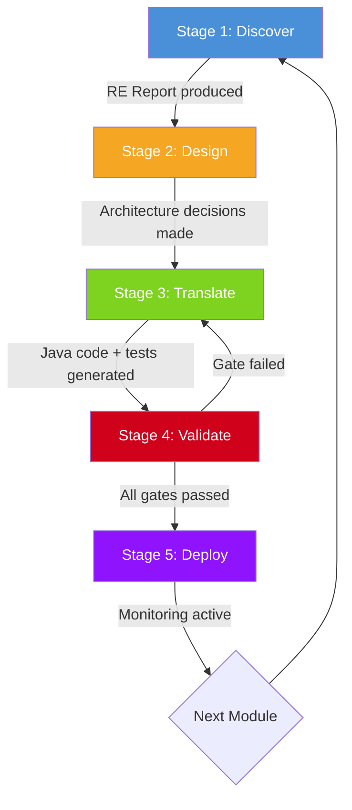
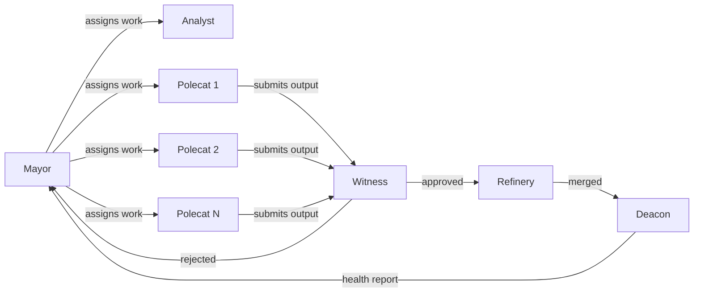

# EvolutionAI Methodology Guide

## Overview

EvolutionAI modernizes COBOL banking applications through a structured **Five-Stage Loop**. Each COBOL module passes through all five stages before it is considered complete. Human oversight is embedded at every stage, ensuring that AI agents execute within well-defined boundaries while subject-matter experts retain control over architectural and business decisions.

This guide walks through the complete methodology using a real example: the **COSGN00C login module** from AWS CardDemo.

## The Five-Stage Loop

---

## Stage 1: Discover

**Agent**: Analyst
**Input**: Raw COBOL source code (COSGN00C.cbl)
**Output**: Reverse-Engineering (RE) Report

The Analyst agent reads the COBOL source and produces a comprehensive reverse-engineering report. No translation occurs at this stage. The goal is to fully understand the existing system before changing anything.

### What the Analyst Does

1. **Maps the module structure**: Identifies all COBOL divisions (Identification, Environment, Data, Procedure), paragraphs, and control flow
2. **Catalogs data dependencies**: Documents all copybooks, working storage variables, file definitions, and CICS communication areas
3. **Extracts business rules**: Identifies validation logic, branching conditions, and error handling patterns
4. **Documents external interfaces**: Maps CICS screens (BMS maps), VSAM file access, and inter-program calls (CALL, LINK, XCTL)

### COSGN00C Example

For the login module, the Analyst produces:

- **Data map**: CDEMO-SIGN-SIGNON-ID (user ID, PIC X(8)), CDEMO-SIGN-SIGNON-PASS (password, PIC X(8)), CDEMO-SIGN-SIGNON-MSG (status message, PIC X(50))
- **Business rules**: User ID must be non-empty, password must be non-empty, credentials validated against USRSEC file, maximum 3 failed attempts before lockout
- **CICS interactions**: RECEIVE MAP (get user input), SEND MAP (display result), READ file USRSEC (credential lookup)
- **Control flow**: Main paragraph PROCESS-ENTER-KEY performs credential validation, branches to success (XCTL to main menu) or failure (display error, increment counter)

### Quality Gate

The RE Report must document all business rules, data structures, and external dependencies before Stage 2 can begin. Incomplete analysis leads to translation defects downstream.

---

## Stage 2: Design

**Agent**: Human Architect (with Mayor agent coordination)
**Input**: RE Report from Stage 1
**Output**: Architecture decisions and API contracts

This is the primary human-in-the-loop stage. A human architect reviews the RE Report and makes decisions about the target architecture. The Mayor agent coordinates this review and records decisions.

### What the Architect Decides

1. **API shape**: What REST endpoints will replace the CICS transaction?
2. **Data model**: How do COBOL data structures map to Java entities and database tables?
3. **Security model**: How will authentication and authorization be handled?
4. **Integration points**: How does this module connect to other modernized (or not-yet-modernized) modules?

### COSGN00C Example

The architect reviews the login module analysis and decides:

- **Endpoint**: `POST /api/v1/auth/login` accepting JSON `{ "userId": "string", "password": "string" }`
- **Response**: JWT token on success, structured error response on failure
- **Data model**: User credentials stored in PostgreSQL `app_users` table, passwords hashed with bcrypt
- **Security**: Rate limiting (5 attempts per minute), account lockout after 3 consecutive failures (preserving original COBOL business rule), audit logging for all authentication events
- **Integration**: JWT token consumed by all downstream CardDemo services

### Quality Gate

Architecture decisions must be explicitly approved by the human architect. No translation begins without sign-off on the API contract and data model.

---

## Stage 3: Translate

**Agent**: Polecat (one or more instances)
**Input**: RE Report + Architecture Decisions
**Output**: Java/Quarkus source code, unit tests, integration tests, OpenAPI specification

Polecat agents execute the actual code translation. Multiple Polecat instances can work in parallel on independent modules. Each Polecat operates in an isolated Git worktree to prevent conflicts.

### What the Polecat Produces

1. **Java source code**: Quarkus REST endpoint, service layer, repository layer, DTOs
2. **Unit tests**: Covering all business rules identified in the RE Report
3. **Integration tests**: Verifying behavioral equivalence with the original COBOL logic
4. **OpenAPI 3.1 specification**: Complete API documentation for the new endpoint

### COSGN00C Example

The Polecat generates:

- `LoginResource.java`: Quarkus REST endpoint handling `POST /api/v1/auth/login`
- `LoginService.java`: Business logic including credential validation, lockout tracking, JWT generation
- `UserRepository.java`: JPA repository for the `app_users` table
- `LoginRequest.java`: Java record DTO for the request body
- `LoginResponse.java`: Java record DTO for the response (token or error)
- `LoginResourceTest.java`: Unit tests covering valid login, invalid password, account lockout, empty fields
- `LoginIntegrationTest.java`: End-to-end tests with test database
- `auth-login.yaml`: OpenAPI 3.1 specification

### Translation Rules

- All monetary values use `BigDecimal`, never `float` or `double`
- COBOL PIC clauses map to specific Java types (see Mapping Reference)
- Every generated class includes Javadoc referencing the original COBOL source
- Record types for DTOs, sealed interfaces for domain types
- No `var` in public API signatures

### Quality Gate

Generated code must compile, all unit tests must pass, and OpenAPI spec must validate before advancing to Stage 4.

---

## Stage 4: Validate

**Agent**: Witness
**Input**: All Stage 3 outputs
**Output**: Validation report (pass/fail with details)

The Witness agent is independent from the Polecat agents that produced the code. It performs a fresh review focused on correctness, security, and compliance.

### What the Witness Checks

1. **Behavioral equivalence**: Do the integration tests verify that the Java code produces the same outputs as the COBOL code for the same inputs?
2. **Code quality**: Does the code meet coverage thresholds (90% line, 80% branch)?
3. **Security review**: Are authentication, cryptography, and PII patterns implemented correctly?
4. **Compliance**: Does the output conform to FINOS CDM requirements?
5. **Documentation**: Are Javadoc references, OpenAPI specs, and RE Report consistent?

### COSGN00C Example

The Witness validates:

- Login with valid credentials returns a JWT token (matches COBOL XCTL to main menu behavior)
- Login with invalid password returns error and increments failure counter (matches COBOL error handling)
- Three consecutive failures trigger account lockout (matches COBOL business rule)
- Passwords are never logged or returned in API responses (security)
- All test coverage thresholds are met

### Quality Gate

Any Witness rejection sends the module back to Stage 3 for remediation. Security-sensitive findings require human review before re-submission. No code advances to Stage 5 without Witness approval.

---

## Stage 5: Deploy

**Agents**: Refinery (merge) + Deacon (monitor)
**Input**: Witness-approved code
**Output**: Merged code on feature branch, post-deployment metrics

### Refinery Actions

1. Merges the Polecat worktree into the feature branch
2. Resolves any merge conflicts (escalating to human if conflicts affect business logic)
3. Ensures CI pipeline passes on the merged result

### Deacon Monitoring

After merge, the Deacon agent monitors:

- **Build health**: CI pipeline success/failure
- **Test stability**: Any test regressions introduced by the merge
- **Token budget**: Cumulative AI token expenditure stays within allocated limits
- **Agent activity**: No agents stuck or idle beyond 30 minutes

### Quality Gate

Merged code must pass all CI checks. Post-merge test regressions trigger automatic rollback and escalation.

---

## Agent Orchestration: The Gas Town Pattern

The agent team follows the **Gas Town orchestration pattern**, inspired by distributed systems coordination models. Each agent has a clearly defined role, communication boundary, and accountability scope.

**Key principles:**

- **Single responsibility**: Each agent does one thing well
- **Isolation**: Agents operate in separate Git worktrees to prevent interference
- **Explicit handoffs**: Work moves between agents only through defined quality gates
- **Human authority**: The Mayor escalates to human architects for any decision outside its defined scope
- **Full traceability**: Every agent action is logged to Langfuse with trace IDs linking back to the originating task

---

## Summary

The Five-Stage Loop ensures that no COBOL module is translated without first being understood, that no architecture decision is made without human review, that no code is merged without independent validation, and that no deployment goes unmonitored. This structured approach is why EvolutionAI achieves a 99.7% behavioral equivalence pass rate while reducing migration cost by 75-80%.
