# CBACT01C — Account Master File Extract

**Application:** CardDemo · **Source file:** `CBACT01C.cbl` · **Type:** Batch COBOL program · **Source banner:** `CardDemo_v2.0-25-gdb72e6b-235 Date: 2025-04-29 11:01:27 CDT`

This document describes what the program does in plain English. It treats the program as a sequence of data actions — reading rows, looking up values, calling external services, copying fields, writing rows — and names every file, field, copybook, and external program along the way so a developer can still find each piece in the source. The reader does not need to know COBOL.

---

## 1. Purpose

CBACT01C reads the **Account Master File** — an indexed VSAM file identified in the program as `ACCTFILE-FILE`, assigned to the JCL DDname `ACCTFILE` — and produces records into three output files. The Account Master File is a KSDS (keyed sequential data set) with each record keyed on the 11-digit account number (`FD-ACCT-ID`), so the program reads it one account at a time, in ascending account-number order. The Account Master File is **read-only**: this program never updates, inserts, or deletes anything from it.

For every account it reads, the program produces:

- **One row** in the **Account Extract File** (`OUT-FILE`, DDname `OUTFILE`) — a flat, fixed-format record containing eleven of the account's fields, including the card reissue date reformatted by an external assembler program.
- **One row** in the **Account Array File** (`ARRY-FILE`, DDname `ARRYFILE`) — a record containing the account number plus a five-slot table of balance/debit pairs (only three of the five slots are populated; slots 4 and 5 stay at zero).
- **Two rows** in the **Variable-Length Record File** (`VBRC-FILE`, DDname `VBRCFILE`) — one short row of 12 bytes (account number plus active-status flag) and one longer row of 39 bytes (account number, balance, credit limit, and reissue year). Both rows go to the same file but in two different physical formats.

So for every input account, **four output rows are written across three files**.

The layout of an account record — its field names, lengths, and meanings — is defined externally in copybook `CVACT01Y`, which provides the group `ACCOUNT-RECORD` and all `ACCT-*` fields. The FILE SECTION defines only a skeletal two-field FD (`FD-ACCT-ID` + `FD-ACCT-DATA`) for VSAM access; the richly named layout in working storage is what all processing paragraphs reference.

For each account, the program calls an **external assembler date-reformatting program** named `COBDATFT`. The program passes a communication area defined in copybook `CODATECN` — holding the input date, two format-type codes, and a slot for the result — and reads the reformatted date back from the same area when `COBDATFT` returns.

Several values written to the output files are **hardcoded literals** rather than coming from the input account: `2525.00`, `1005.00`, `1525.00`, `-1025.00`, `-2500.00`, `12`, and `39`. These are not business rules. CBACT01C reads more like a sample or demonstration program than production logic, and these values must not be carried forward as real business policy during any migration. Each literal is flagged at its point of occurrence and collected in Appendix C.

If any file operation fails, the program calls the IBM Language Environment service `CEE3ABD` with abend code `999`, terminating the job step with completion code `U999`.

---

## 2. Program Flow

The program runs in three phases: **startup** (open all four files, once), **per-account processing loop** (for every row in the Account Master File, perform the same sequence of steps), and **shutdown** (close the master file and end). The walkthrough below follows that order, naming each paragraph and each field as the program touches them.

### 2.1 Startup

The program opens all four files in sequence. Before each open it marks the operation as "in progress" by setting `APPL-RESULT` to `8`. If the open succeeds (file status `'00'`) it sets `APPL-RESULT` to `0` (`APPL-AOK`); any other status sets it to `12`. If `APPL-AOK` is not true after the attempt, the program logs an error message and abends.

**Step 1 — Open the Account Master File for reading** *(paragraph `0000-ACCTFILE-OPEN`, line 317).* Opens `ACCTFILE-FILE` for input. On failure, logs the message `'ERROR OPENING ACCTFILE'`, formats and displays the file status code via `9910-DISPLAY-IO-STATUS`, and terminates via `9999-ABEND-PROGRAM`.

**Step 2 — Open the Account Extract File for writing** *(paragraph `2000-OUTFILE-OPEN`, line 334).* Opens `OUT-FILE` for output. On failure, logs `'ERROR OPENING OUTFILE'` followed by the raw status bytes and abends.

**Step 3 — Open the Account Array File for writing** *(paragraph `3000-ARRFILE-OPEN`, line 352).* Opens `ARRY-FILE` for output. On failure, logs `'ERROR OPENING ARRAYFILE'` followed by the raw status bytes and abends.

**Step 4 — Open the Variable-Length Record File for writing** *(paragraph `4000-VBRFILE-OPEN`, line 370).* Opens `VBRC-FILE` for output. This file's records are not a fixed size — the FD declares the record as varying in length from 10 to 80 bytes, with the actual length determined at each write by the value of the working-storage field `WS-RECD-LEN`. On failure, logs `'ERROR OPENING VBRC FILE'` and abends.

After all four opens succeed, the loop-control flag `END-OF-FILE` is at its initialised value of `'N'` and no output has been written.

### 2.2 Per-Account Processing Loop

The program loops until `END-OF-FILE` becomes `'Y'`. Inside the loop there is a redundant inner guard that checks `END-OF-FILE = 'N'` — this condition can never be false while the loop is still running, so it adds no logic (see Migration Note 6). The loop body calls paragraph `1000-ACCTFILE-GET-NEXT` and then, if `END-OF-FILE` is still `'N'` when it returns, writes a raw 300-byte block dump of the entire `ACCOUNT-RECORD` (including the 178-byte filler) to the job log. This second dump is in addition to the field-by-field display inside `1100-DISPLAY-ACCT-RECORD` and is a debugging artifact (see Migration Note 7).

The walkthrough below describes **one full iteration** for a single account. Paragraph `1000-ACCTFILE-GET-NEXT` controls the entire per-account sequence.

**Step 5 — Read the next row from the Account Master File** *(inside `1000-ACCTFILE-GET-NEXT`, line 166).* The program reads the next account record from `ACCTFILE-FILE` into the working-storage area `ACCOUNT-RECORD` defined by copybook `CVACT01Y`. After a successful read, all of the following fields hold this account's values:

| Field | PIC | Business meaning |
|---|---|---|
| `ACCT-ID` | `9(11)` | Account number (primary key) |
| `ACCT-ACTIVE-STATUS` | `X(01)` | Active/inactive flag |
| `ACCT-CURR-BAL` | `S9(10)V99` | Current outstanding balance |
| `ACCT-CREDIT-LIMIT` | `S9(10)V99` | Approved credit limit |
| `ACCT-CASH-CREDIT-LIMIT` | `S9(10)V99` | Cash-advance sub-limit |
| `ACCT-OPEN-DATE` | `X(10)` | Date account was opened |
| `ACCT-EXPIRAION-DATE` | `X(10)` | Card expiry date *(typo in source preserved)* |
| `ACCT-REISSUE-DATE` | `X(10)` | Most recent card reissue date, stored as `YYYY-MM-DD` |
| `ACCT-CURR-CYC-CREDIT` | `S9(10)V99` | Credits posted in current billing cycle |
| `ACCT-CURR-CYC-DEBIT` | `S9(10)V99` | Debits posted in current billing cycle |
| `ACCT-ADDR-ZIP` | `X(10)` | Account ZIP code — **read from file but never used or written to any output** |
| `ACCT-GROUP-ID` | `X(10)` | Rate/disclosure group classification |
| FILLER | `X(178)` | Padding to reach the 300-byte record length |

The read produces one of three outcomes:
- **Status `'00'` — success.** The record is in memory and processing continues with steps 6–15.
- **Status `'10'` — end-of-file.** The post-read check sets `END-OF-FILE` to `'Y'`. No output is written for this attempt. The loop exits and the program moves to shutdown.
- **Any other status — unexpected failure.** The post-read check logs `'ERROR READING ACCOUNT FILE'`, displays the status code, and abends.

**Step 6 — Reset the array output buffer to zero** *(line 169).* All five balance/debit slots in `ARR-ARRAY-REC` and its 4-byte filler are cleared before any values are placed in them. Without this reset, slots 4 and 5 would carry leftover values from the previous iteration.

**Step 7 — Log all input fields to the job log** *(paragraph `1100-DISPLAY-ACCT-RECORD`, line 200).* Eleven lines are written to the job log, one per field from `ACCT-ID` through `ACCT-GROUP-ID`, followed by a separator line of dashes. `ACCT-ADDR-ZIP` is silently skipped — it is not displayed here and not written to any output (see Migration Note 1).

**Step 8 — Build the Account Extract File row** *(paragraph `1300-POPUL-ACCT-RECORD`, line 215).* Assembles `OUT-ACCT-REC`, which will be written to `OUTFILE`. The field-by-field sequence is:

*8.1 — Seven fields are copied straight from the input account with no transformation:*

| Source field (`CVACT01Y`) | Destination field (FD `OUT-FILE`) |
|---|---|
| `ACCT-ID` | `OUT-ACCT-ID` |
| `ACCT-ACTIVE-STATUS` | `OUT-ACCT-ACTIVE-STATUS` |
| `ACCT-CURR-BAL` | `OUT-ACCT-CURR-BAL` |
| `ACCT-CREDIT-LIMIT` | `OUT-ACCT-CREDIT-LIMIT` |
| `ACCT-CASH-CREDIT-LIMIT` | `OUT-ACCT-CASH-CREDIT-LIMIT` |
| `ACCT-OPEN-DATE` | `OUT-ACCT-OPEN-DATE` |
| `ACCT-EXPIRAION-DATE` | `OUT-ACCT-EXPIRAION-DATE` |

*8.2 — The reissue date is loaded into two working areas simultaneously (line 223).* `ACCT-REISSUE-DATE` is written both into `CODATECN-INP-DATE` (the input slot of the date-conversion communication area, PIC X(20) — only the first 10 bytes are used) and into `WS-REISSUE-DATE` (a 10-byte flat alias that overlays `WS-ACCT-REISSUE-DATE`). The overlay breaks the date string into four named portions: year `WS-ACCT-REISSUE-YYYY` (4 chars), separator `WS-FILLER-1` (1 char), month `WS-ACCT-REISSUE-MM` (2 chars), separator `WS-FILLER-2` (1 char), and day `WS-ACCT-REISSUE-DD` (2 chars). The year portion is used again in step 13.

*8.3 — Two date-format type codes are set (lines 225–226).* The input format code `CODATECN-TYPE` is set to `'2'` and the output format code `CODATECN-OUTTYPE` is set to `'2'`. The meaning of these codes is defined by the 88-level values in `CODATECN.cpy`:

| Field | Value set | 88-level name in copybook | Meaning |
|---|---|---|---|
| `CODATECN-TYPE` | `'2'` | `YYYY-MM-DD-IN` | Input date is in `YYYY-MM-DD` format (with separator characters) |
| `CODATECN-OUTTYPE` | `'2'` | `YYYYMMDD-OP` | Output date should be `YYYYMMDD` compact format (no separators) |

So `COBDATFT` is being asked to strip the dashes from the `YYYY-MM-DD` reissue date and produce the 8-character compact form `YYYYMMDD`.

*8.4 — The external date-reformatting program is called (line 231).* The entire `CODATECN-REC` communication area (input date, type codes, output slot, error message slot) is passed to `COBDATFT`. `COBDATFT` reads the input date and the two type codes, performs the conversion, and writes the result into `CODATECN-0UT-DATE` (PIC X(20) — note the literal zero `0` in this field name, not the letter `O`; this is a typo in the copybook that is preserved in the source). The compact `YYYYMMDD` result occupies the first 8 bytes of that 20-byte slot; the remaining 12 bytes are assembler-controlled filler. The copybook also defines a `CODATECN-ERROR-MSG` (X(38)) slot that `COBDATFT` populates on failure, but this program **never reads or checks it** (see Migration Note, Appendix B).

*8.5 — The formatted date is copied from the conversion result into the output record (line 233).* `CODATECN-0UT-DATE` is 20 bytes; `OUT-ACCT-REISSUE-DATE` is PIC X(10), so the move takes only the first 10 bytes. The `YYYYMMDD` result is 8 bytes, meaning bytes 9–10 of `OUT-ACCT-REISSUE-DATE` will contain whatever `COBDATFT` left in positions 9–10 of the output slot (typically spaces or zeros, but not guaranteed — see Migration Note 11).

*8.6 — The current cycle credit is copied straight through (line 235)*: `ACCT-CURR-CYC-CREDIT` is written to `OUT-ACCT-CURR-CYC-CREDIT` with no transformation.

*8.7 — Conditional debit substitution (lines 236–238).* If `ACCT-CURR-CYC-DEBIT` is zero, the literal `2525.00` is written into `OUT-ACCT-CURR-CYC-DEBIT`. There is no business reason for this value anywhere in the code. **When the input cycle debit is non-zero, no assignment is made to `OUT-ACCT-CURR-CYC-DEBIT` at all** — it carries over whatever value was placed there in the previous iteration (zero on the very first account). This is a latent data-corruption defect (see Migration Note 2). `OUT-ACCT-CURR-CYC-DEBIT` is declared as COMP-3 packed decimal in the FD — 7 bytes on disk.

*8.8 — The group ID is copied straight through (line 239)*: `ACCT-GROUP-ID` is written to `OUT-ACCT-GROUP-ID` with no transformation. `OUT-ACCT-REC` is now complete.

**Step 9 — Write the Account Extract File row** *(paragraph `1350-WRITE-ACCT-RECORD`, line 242).* `OUT-ACCT-REC` is written as a new sequential row to `OUT-FILE`. The write status is checked: status `'00'` and `'10'` are both treated as acceptable; any other status triggers the error message `'ACCOUNT FILE WRITE STATUS IS:'` followed by the status code, then abend. Accepting `'10'` on a write is unusual — for a sequential output file this status should never occur; it appears to be a defensive pattern copied from a read-oriented template (see Migration Note 8). **One row has now been added to the Account Extract File.**

**Step 10 — Build the Account Array File row** *(paragraph `1400-POPUL-ARRAY-RECORD`, line 253).* `ARR-ARRAY-REC` is assembled. The account number `ACCT-ID` is placed in `ARR-ACCT-ID`. The five-slot OCCURS table is populated as follows (slots 4 and 5 remain zero from the reset in step 6):

| Slot | Balance field `ARR-ACCT-CURR-BAL(n)` — source | Debit field `ARR-ACCT-CURR-CYC-DEBIT(n)` — source |
|---|---|---|
| 1 | `ACCT-CURR-BAL` (live input value) | Hardcoded literal **`1005.00`** — test data |
| 2 | `ACCT-CURR-BAL` (live input value) | Hardcoded literal **`1525.00`** — test data |
| 3 | Hardcoded literal **`-1025.00`** — test data | Hardcoded literal **`-2500.00`** — test data |
| 4 | Zero (from reset in step 6) | Zero |
| 5 | Zero (from reset in step 6) | Zero |

Both `ARR-ACCT-CURR-BAL` and `ARR-ACCT-CURR-CYC-DEBIT` are declared `PIC S9(10)V99 USAGE IS COMP-3` in the FD — packed decimal on disk.

**Step 11 — Write the Account Array File row** *(paragraph `1450-WRITE-ARRY-RECORD`, line 263).* `ARR-ARRAY-REC` is written to `ARRY-FILE`. The same write status check as step 9 applies — status `'00'` or `'10'` accepted; anything else abends. **One row has now been added to the Account Array File.**

**Step 12 — Reset the short variable-length record buffer** *(line 175).* `VBRC-REC1` (the 12-byte short record) is cleared before population. `VBRC-REC2` (the 39-byte long record) is not reset here because step 13 overwrites all four of its fields anyway.

**Step 13 — Build both variable-length records** *(paragraph `1500-POPUL-VBRC-RECORD`, line 276).* Both record formats are populated from the same input account:

The account number `ACCT-ID` is written simultaneously into both `VB1-ACCT-ID` (short record) and `VB2-ACCT-ID` (long record) in a single statement. `ACCT-ACTIVE-STATUS` is then written into `VB1-ACCT-ACTIVE-STATUS`, completing `VBRC-REC1`. For the long record, `ACCT-CURR-BAL` is placed in `VB2-ACCT-CURR-BAL`, `ACCT-CREDIT-LIMIT` in `VB2-ACCT-CREDIT-LIMIT`, and the four-character year portion `WS-ACCT-REISSUE-YYYY` (parsed from the reissue date in step 8.2) in `VB2-ACCT-REISSUE-YYYY`. `VBRC-REC2` is now complete.

After populating both records, the paragraph writes them both verbatim to the job log as a debugging trace. Neither `VB1` nor `VB2` fields use COMP-3; all are display format.

Physical lengths: `VBRC-REC1` = `VB1-ACCT-ID` (11) + `VB1-ACCT-ACTIVE-STATUS` (1) = **12 bytes**. `VBRC-REC2` = `VB2-ACCT-ID` (11) + `VB2-ACCT-CURR-BAL` S9(10)V99 display (12) + `VB2-ACCT-CREDIT-LIMIT` S9(10)V99 display (12) + `VB2-ACCT-REISSUE-YYYY` X(04) (4) = **39 bytes**.

**Step 14 — Write the short 12-byte variable-length row** *(paragraph `1550-WRITE-VB1-RECORD`, line 287).* `WS-RECD-LEN` is set to `12`, `VBRC-REC1` is copied into the first 12 bytes of the file's 80-byte write buffer `VBR-REC`, and the buffer is written to `VBRC-FILE`. The runtime uses `WS-RECD-LEN` to write exactly 12 physical bytes. The same `'00'`/`'10'` status acceptance pattern applies; any other status abends. **One 12-byte row has now been added to the Variable-Length Record File.**

**Step 15 — Write the longer 39-byte variable-length row** *(paragraph `1575-WRITE-VB2-RECORD`, line 302).* Same pattern: `WS-RECD-LEN` is set to `39`, `VBRC-REC2` is copied into the first 39 bytes of `VBR-REC`, and written. **One 39-byte row has now been added to the Variable-Length Record File.**

After step 15, the per-account cycle is complete. The loop checks `END-OF-FILE`: if still `'N'`, the raw block dump is written to the job log (see opening of section 2.2) and the next iteration begins at step 5. When `END-OF-FILE` is `'Y'`, the loop exits.

> **Per-account totals.** One row appended to the Account Extract File. One row appended to the Account Array File. Two rows appended to the Variable-Length Record File. **Four output rows across three files for every input account.**

### 2.3 Shutdown

**Step 16 — Close the Account Master File** *(paragraph `9000-ACCTFILE-CLOSE`, line 388).* The close uses an arithmetic-idiom style rather than simple assignments — `ADD 8 TO ZERO GIVING APPL-RESULT` sets the initial value, and on success `SUBTRACT APPL-RESULT FROM APPL-RESULT` produces zero. This is functionally identical to direct assignments and is a stylistic curiosity with no practical significance. On failure, logs `'ERROR CLOSING ACCOUNT FILE'` and abends.

**Important:** The three output files — `OUT-FILE`, `ARRY-FILE`, and `VBRC-FILE` — are **never explicitly closed**. When the program returns control to the operating system, the runtime closes them implicitly. Any I/O error that occurs during that implicit close is invisible to this program's error-handling logic and will not produce a `U999` abend.

**Step 17 — Return to the operating system** *(line 160).* The program writes the banner `'END OF EXECUTION OF PROGRAM CBACT01C'` to the job log and returns. The runtime performs the implicit closes and releases storage.

---

## 3. Error Handling

Every unexpected file status — on open, read, write, or close, on any of the four files — is fatal. The pattern is the same each time: log a message naming the file and operation, call `9910-DISPLAY-IO-STATUS` to format the status code for display, then call `9999-ABEND-PROGRAM` to terminate.

### 3.1 Status Decoder — `9910-DISPLAY-IO-STATUS` (line 413)

File status codes are two bytes. Most are two printable digits such as `'00'` (success) or `'10'` (end-of-file). In this common case the decoder left-pads to four characters — status `'10'` prints in the job log as `0010`.

For system-level errors the first status byte is `'9'` and the second byte is a raw binary value from 0 to 255. The decoder handles this by keeping the first byte as-is and converting the binary second byte to a three-digit decimal using the overlay area `TWO-BYTES-BINARY` / `TWO-BYTES-ALPHA` / `TWO-BYTES-RIGHT`, producing a display such as `9034`. The formatted result is always four characters and is held in `IO-STATUS-04`.

### 3.2 Abend Routine — `9999-ABEND-PROGRAM` (line 406)

The routine logs the message `'ABENDING PROGRAM'`, sets the abend code parameter `ABCODE` to `999` and the timing parameter `TIMING` to `0` (immediate abend), then calls the IBM Language Environment service `CEE3ABD` with those two parameters. `CEE3ABD` terminates the job step immediately, producing completion code `U999` in the job listing. Every failure mode in this program uses the same generic code `999`; there are no distinct codes per failure type (see Migration Note 5).

---

## 4. Migration Notes

1. **`ACCT-ADDR-ZIP` is defined in `CVACT01Y` but never used.** The field (`X(10)`, positioned between `ACCT-CURR-CYC-DEBIT` and `ACCT-GROUP-ID`) is present in every record read from disk but is never referenced, never logged in `1100-DISPLAY-ACCT-RECORD`, and never written to any output. ZIP code data is silently dropped by this program.

2. **The output cycle-debit field carries stale data when the input cycle debit is non-zero.** The zero-debit case substitutes the literal `2525.00`. The non-zero case has no handling at all — `OUT-ACCT-CURR-CYC-DEBIT` keeps whatever value was written in the previous iteration (zero on the first account). This is a silent correctness defect. A migration must decide the intended behaviour: pass the live value through, or preserve the zero-substitution.

3. **Three of the four files are never explicitly closed.** `GOBACK` triggers implicit closure by the runtime. Any flush or I/O error during that implicit close is not caught and will not produce a `U999` abend.

4. **Hardcoded literals must not be carried forward as business rules.** See Appendix C. The values `2525.00`, `1005.00`, `1525.00`, `-1025.00`, and `-2500.00` are demonstration test data, not real account-level business rules.

5. **A single generic abend code (`999`) covers every failure mode.** Open, read, write, and close errors on all four files all produce `U999`. The migrated system should surface failure context — file name and operation — in structured logging so operators can diagnose without reading the full job log.

6. **The inner guard `END-OF-FILE = 'N'` inside the main loop is redundant.** While `PERFORM UNTIL END-OF-FILE = 'Y'` is looping, `END-OF-FILE` is by definition `'N'`. The inner check can never be false and adds no logic.

7. **Each account record is displayed twice to the job log.** `1100-DISPLAY-ACCT-RECORD` writes 11 labelled field values inside `1000-ACCTFILE-GET-NEXT`. After `1000-ACCTFILE-GET-NEXT` returns, the main loop also dumps the entire 300-byte `ACCOUNT-RECORD` as a raw block, including 178 bytes of non-printable filler. This doubles logging volume and is a debugging artifact.

8. **Write status checks accept `'10'` as well as `'00'`.** Status `'10'` (end-of-file) should never be returned on a write to a sequential output file. Its inclusion looks like a boilerplate template originally written for read operations. It is harmless but must not be interpreted as an intentional feature during migration.

9. **`CODATECN-0UT-DATE` has a zero, not the letter O, in its name.** The copybook (`CODATECN.cpy`, line 39) spells this field `CODATECN-0UT-DATE`. Any search for `CODATECN-OUT-DATE` with the letter `O` will miss all references to this field.

10. **`ACCT-EXPIRAION-DATE` is a typo in the source.** The field is misspelled in both the FD definition and in `CVACT01Y`. The misspelling must be preserved exactly in any migration that maintains field-name compatibility with the VSAM file layout or existing JCL.

11. **`OUT-ACCT-REISSUE-DATE` will contain two uncontrolled trailing bytes from `COBDATFT`.** The conversion result slot is 20 bytes wide; the `YYYYMMDD` output is only 8 bytes. Copying the first 10 bytes into the 10-byte output field means bytes 9–10 come from whatever the assembler routine left in positions 9–10 of its output area — typically spaces or zeros, but not guaranteed by this program.

---

## Appendix A — Files

| Logical name | DDname | Type | Record key | Direction | Contents |
|---|---|---|---|---|---|
| `ACCTFILE-FILE` | `ACCTFILE` | VSAM KSDS — indexed, accessed sequentially | `FD-ACCT-ID` PIC 9(11), 11-digit account number | **Input — read-only, sequential** | Account master. One 300-byte row per account. The FD defines a two-field skeleton (`FD-ACCT-ID` + `FD-ACCT-DATA X(289)`); the full named layout comes from copybook `CVACT01Y`. |
| `OUT-FILE` | `OUTFILE` | Sequential, fixed-format | None | **Output — sequential write** | Account Extract File. One row per input account: `OUT-ACCT-REC` with 11 fields. `OUT-ACCT-CURR-CYC-DEBIT` is COMP-3 packed decimal (7 bytes on disk). |
| `ARRY-FILE` | `ARRYFILE` | Sequential, fixed-format | None | **Output — sequential write** | Account Array File. One row per input account: `ARR-ARRAY-REC` — `ARR-ACCT-ID` plus a 5-occurrence table of balance/debit pairs (both fields COMP-3 packed decimal), plus a 4-byte `ARR-FILLER`. |
| `VBRC-FILE` | `VBRCFILE` | Sequential, **variable-length** — records vary from 10 to 80 bytes; actual length per write controlled by `WS-RECD-LEN` | None | **Output — sequential write** | Variable-Length Record File. Two rows per input account: `VBRC-REC1` (12 bytes — account number + active flag) and `VBRC-REC2` (39 bytes — account number + balance + credit limit + reissue year). Both are written via the 80-byte FD buffer `VBR-REC`. |

---

## Appendix B — Copybooks and External Programs

### Copybook `CVACT01Y` (WORKING-STORAGE SECTION, line 89)

Defines `ACCOUNT-RECORD` — the working-storage layout for account rows read from `ACCTFILE-FILE`. Total record length is 300 bytes (noted in the copybook header as `RECLN 300`). Source file: `CVACT01Y.cpy`.

| Field | PIC | Bytes | Notes |
|---|---|---|---|
| `ACCT-ID` | `9(11)` | 11 | Account number; VSAM KSDS primary key |
| `ACCT-ACTIVE-STATUS` | `X(01)` | 1 | Active/inactive flag |
| `ACCT-CURR-BAL` | `S9(10)V99` | 12 | Current balance, display signed |
| `ACCT-CREDIT-LIMIT` | `S9(10)V99` | 12 | Approved credit limit |
| `ACCT-CASH-CREDIT-LIMIT` | `S9(10)V99` | 12 | Cash-advance sub-limit |
| `ACCT-OPEN-DATE` | `X(10)` | 10 | Account open date |
| `ACCT-EXPIRAION-DATE` | `X(10)` | 10 | Card expiry date — *misspelled in source and in copybook; spelling must be preserved* |
| `ACCT-REISSUE-DATE` | `X(10)` | 10 | Card reissue date, stored as `YYYY-MM-DD` |
| `ACCT-CURR-CYC-CREDIT` | `S9(10)V99` | 12 | Current billing cycle credits |
| `ACCT-CURR-CYC-DEBIT` | `S9(10)V99` | 12 | Current billing cycle debits |
| `ACCT-ADDR-ZIP` | `X(10)` | 10 | ZIP code — **present in every record read, but never referenced by this program** |
| `ACCT-GROUP-ID` | `X(10)` | 10 | Rate/disclosure group code |
| `FILLER` | `X(178)` | 178 | Padding to 300-byte record length |

### Copybook `CODATECN` (WORKING-STORAGE SECTION, line 90)

Defines `CODATECN-REC` — the parameter structure passed to and returned from `COBDATFT`. Source file: `CODATECN.cpy`.

| Field | PIC | Notes |
|---|---|---|
| `CODATECN-TYPE` | `X(01)` | Input date format code. 88-level `YYYYMMDD-IN` = `'1'`; 88-level `YYYY-MM-DD-IN` = `'2'`. **This program sets `'2'` — input is `YYYY-MM-DD` with separators.** |
| `CODATECN-INP-DATE` | `X(20)` | Input date string. Only the first 10 bytes are populated when input format is `YYYY-MM-DD`. Two REDEFINES (`CODATECN-1INP`, `CODATECN-2INP`) provide byte-level access to year, month, and day components. |
| `CODATECN-OUTTYPE` | `X(01)` | Output date format code. 88-level `YYYY-MM-DD-OP` = `'1'`; 88-level `YYYYMMDD-OP` = `'2'`. **This program sets `'2'` — output is `YYYYMMDD` compact format with no separators.** |
| `CODATECN-0UT-DATE` | `X(20)` | Output date written by `COBDATFT`. **Field name contains a literal zero `0`, not the letter `O` — this is a typo in the copybook that is carried into all referencing source.** The `YYYYMMDD` result occupies bytes 1–8; bytes 9–20 are assembler-controlled filler. |
| `CODATECN-ERROR-MSG` | `X(38)` | Error message slot populated by `COBDATFT` on failure. **This program never reads or inspects this field.** A silent failure in `COBDATFT` will not be detected. |

### External Program `COBDATFT`

| Item | Detail |
|---|---|
| Type | Assembler (non-COBOL) routine; linked at runtime, called statically |
| Called from | Paragraph `1300-POPUL-ACCT-RECORD`, line 231 |
| Input passed | `CODATECN-REC` with `CODATECN-TYPE = '2'` (YYYY-MM-DD input) and `CODATECN-INP-DATE` set to the account's reissue date |
| Output returned | `CODATECN-0UT-DATE` — the reissue date reformatted as `YYYYMMDD` (8 bytes) plus 12 bytes of filler |
| Error handling gap | `COBDATFT` writes an error message to `CODATECN-ERROR-MSG` on failure, but CBACT01C never checks it. A silent failure leaves stale or garbage bytes in `CODATECN-0UT-DATE`, which then propagates into `OUT-ACCT-REISSUE-DATE` |
| Source location | Not in this repository — assembler object linked at runtime |

### External Service `CEE3ABD`

| Item | Detail |
|---|---|
| Type | IBM Language Environment runtime service for forced abend |
| Called from | Paragraph `9999-ABEND-PROGRAM`, line 410 |
| `ABCODE` parameter | `PIC S9(9) BINARY`, set to `999` — produces job completion code `U999` |
| `TIMING` parameter | `PIC S9(9) BINARY`, set to `0` — abend is immediate, without deferral to condition handlers |

---

## Appendix C — Hardcoded Literals (Not Business Rules)

These values are embedded directly in the source. They are listed here so they are not mistaken for business rules during migration.

| Paragraph | Source line | Value | How used | Classification |
|---|---|---|---|---|
| `1300-POPUL-ACCT-RECORD` | 225–226 | `'2'` and `'2'` | Input/output format codes passed to `COBDATFT` | Format codes — meaning defined by `CODATECN.cpy` 88-levels |
| `1300-POPUL-ACCT-RECORD` | 237 | `2525.00` | Written to `OUT-ACCT-CURR-CYC-DEBIT` when input cycle debit is zero | Test data — not a real default value |
| `1400-POPUL-ARRAY-RECORD` | 256 | `1005.00` | Array slot 1 debit | Test data |
| `1400-POPUL-ARRAY-RECORD` | 258 | `1525.00` | Array slot 2 debit | Test data |
| `1400-POPUL-ARRAY-RECORD` | 259 | `-1025.00` | Array slot 3 balance | Test data |
| `1400-POPUL-ARRAY-RECORD` | 260 | `-2500.00` | Array slot 3 debit | Test data |
| `1550-WRITE-VB1-RECORD` | 288 | `12` | Length of the short variable-length write | Size constant — equals the byte size of `VBRC-REC1` |
| `1575-WRITE-VB2-RECORD` | 303 | `39` | Length of the longer variable-length write | Size constant — equals the byte size of `VBRC-REC2` |
| `9999-ABEND-PROGRAM` | 409 | `999` | Abend code passed to `CEE3ABD` | Generic — same code for every failure type |
| Open/close paragraphs | 318, 335, 353, 371, 389 | `8`, `0`, `12` | Internal progress/result codes for `APPL-RESULT` | Internal convention |

---

## Appendix D — Internal Working Fields

These fields serve the program's own bookkeeping and are not written to any output file.

| Field | PIC | Initialised | Purpose |
|---|---|---|---|
| `END-OF-FILE` | `X(01)` | `'N'` | Loop-control flag — set to `'Y'` when the Account Master File is exhausted |
| `APPL-RESULT` | `S9(9) COMP` | Set per step | Numeric result code. 88-level `APPL-AOK` = 0 (success); 88-level `APPL-EOF` = 16 (end-of-file); 12 = error |
| `IO-STATUS` with `IO-STAT1`, `IO-STAT2` | `X(02)` | Set on each I/O error | Two-byte file status code of the file that just failed; passed to `9910-DISPLAY-IO-STATUS` |
| `IO-STATUS-04` with `IO-STATUS-0401` (1 digit), `IO-STATUS-0403` (3 digits) | `9` + `999` | 0 | Four-character formatted display of the status code, produced by `9910-DISPLAY-IO-STATUS` |
| `TWO-BYTES-BINARY` and its redefinition `TWO-BYTES-ALPHA` | `9(4) BINARY` / `X + X` | — | Overlay area used by the status decoder to convert a single binary status byte to a 0–255 decimal |
| `WS-RECD-LEN` | `9(04)` | Set before each variable-length write | Tells the runtime the physical byte count to write: `12` for the short record, `39` for the long record |
| `WS-ACCT-REISSUE-DATE` with subfields `WS-ACCT-REISSUE-YYYY` (4), `WS-FILLER-1` (1), `WS-ACCT-REISSUE-MM` (2), `WS-FILLER-2` (1), `WS-ACCT-REISSUE-DD` (2) | 10 bytes total | Set in step 8.2 | Parsed reissue date; the year subfield `WS-ACCT-REISSUE-YYYY` is used in step 13 |
| `WS-REISSUE-DATE` | `X(10)` REDEFINES `WS-ACCT-REISSUE-DATE` | — | Flat 10-byte alias over the same storage; the target of the date copy in step 8.2 |
| `ABCODE` | `S9(9) BINARY` | Set to `999` in abend routine | Abend code parameter for `CEE3ABD` |
| `TIMING` | `S9(9) BINARY` | Set to `0` in abend routine | Timing parameter for `CEE3ABD` — immediate abend |

---

## Appendix E — Execution at a Glance

```mermaid
flowchart TD

    START([CBACT01C]) --> BANNER_S

    subgraph PH1 ["Phase 1 — Startup  ·  runs once"]
        BANNER_S["Write start banner to job log"]
        BANNER_S --> OP1["Open ACCTFILE-FILE for input\nVSAM KSDS · DDname ACCTFILE"]
        OP1 -->|"Status 00"| OP2["Open OUT-FILE for output\nsequential · DDname OUTFILE"]
        OP2 -->|"Status 00"| OP3["Open ARRY-FILE for output\nsequential · DDname ARRYFILE"]
        OP3 -->|"Status 00"| OP4["Open VBRC-FILE for output\nvariable-length 10–80 bytes · DDname VBRCFILE"]
        OP4 -->|"Status 00"| READY(["All four files open"])
        OP1 -->|"Any error"| OPERR["Log open error message\ndisplay status code"]
        OP2 -->|"Any error"| OPERR
        OP3 -->|"Any error"| OPERR
        OP4 -->|"Any error"| OPERR
    end

    OPERR --> ABEND
    READY --> READ

    subgraph PH2 ["Phase 2 — Main Loop  ·  repeats once per account record"]

        READ["Read next account record\nfrom ACCTFILE-FILE into ACCOUNT-RECORD\nparagraph 1000-ACCTFILE-GET-NEXT"]
        READ -->|"Status 10 — end-of-file"| EOF_SET["Set END-OF-FILE = Y"]
        READ -->|"Any other error"| RDERR["Log ERROR READING ACCOUNT FILE\ndisplay status code"]
        READ -->|"Status 00 — success"| CLR

        CLR["Clear ARR-ARRAY-REC\nzero all 5 balance/debit slots + filler"] --> LOGFLD
        LOGFLD["Log 11 input fields to job log\nparagraph 1100-DISPLAY-ACCT-RECORD\nACCT-ADDR-ZIP silently skipped"] --> CP7

        subgraph SB1 ["Build Account Extract row  ·  paragraph 1300-POPUL-ACCT-RECORD"]
            CP7["Copy 7 fields direct to OUT-ACCT-REC\nACCT-ID · ACCT-ACTIVE-STATUS · ACCT-CURR-BAL\nACCT-CREDIT-LIMIT · ACCT-CASH-CREDIT-LIMIT\nACCT-OPEN-DATE · ACCT-EXPIRAION-DATE"] --> FMTSET
            FMTSET["Set date format codes on CODATECN-REC\nCODATECN-TYPE = 2  input is YYYY-MM-DD\nCODATECN-OUTTYPE = 2  output is YYYYMMDD"] --> CALLCOB
            CALLCOB["Call COBDATFT\nreissue date YYYY-MM-DD → YYYYMMDD\nresult written to CODATECN-0UT-DATE"] --> DATCP
            DATCP["Copy first 10 bytes of CODATECN-0UT-DATE\nto OUT-ACCT-REISSUE-DATE"] --> DBTCHK
            DBTCHK{"ACCT-CURR-CYC-DEBIT = 0?"}
            DBTCHK -->|"Yes"| DBTYES["Write literal 2525.00\nto OUT-ACCT-CURR-CYC-DEBIT\ntest data — not a business rule"]
            DBTCHK -->|"No — non-zero"| DBTBUG["OUT-ACCT-CURR-CYC-DEBIT\nnot assigned — carries stale value\nlatent bug"]
            DBTYES & DBTBUG --> GRPCP["Copy ACCT-GROUP-ID to OUT-ACCT-GROUP-ID\nCopy ACCT-CURR-CYC-CREDIT to OUT-ACCT-CURR-CYC-CREDIT\nOUT-ACCT-REC complete"]
        end

        GRPCP --> W1["Write OUT-ACCT-REC → OUTFILE\nparagraph 1350-WRITE-ACCT-RECORD\nRow 1 of 4"]
        W1 -->|"Error"| WRERR["Log ACCOUNT FILE WRITE STATUS IS\ndisplay status code"]
        W1 -->|"OK"| ARRBLD

        subgraph SB2 ["Build Account Array row  ·  paragraph 1400-POPUL-ARRAY-RECORD"]
            ARRBLD["Copy ACCT-ID to ARR-ACCT-ID"] --> SL1
            SL1["Slot 1 — balance: ACCT-CURR-BAL  /  debit: 1005.00 test data"] --> SL2
            SL2["Slot 2 — balance: ACCT-CURR-BAL  /  debit: 1525.00 test data"] --> SL3
            SL3["Slot 3 — balance: −1025.00 test data  /  debit: −2500.00 test data"] --> SL45
            SL45["Slots 4 and 5 — zero from earlier clear\nARR-ARRAY-REC complete"]
        end

        SL45 --> W2["Write ARR-ARRAY-REC → ARRYFILE\nparagraph 1450-WRITE-ARRY-RECORD\nRow 2 of 4"]
        W2 -->|"Error"| WRERR
        W2 -->|"OK"| VCLR

        VCLR["Clear VBRC-REC1  12-byte short record"] --> VBRBLD

        subgraph SB3 ["Build variable-length records  ·  paragraph 1500-POPUL-VBRC-RECORD"]
            VBRBLD["Copy ACCT-ID to both VB1-ACCT-ID and VB2-ACCT-ID\nsingle assignment to both targets"] --> VB1OK
            VB1OK["Copy ACCT-ACTIVE-STATUS to VB1-ACCT-ACTIVE-STATUS\nVBRC-REC1 complete — 12 bytes"] --> VB2OK
            VB2OK["Copy ACCT-CURR-BAL · ACCT-CREDIT-LIMIT\nWS-ACCT-REISSUE-YYYY to VB2 fields\nVBRC-REC2 complete — 39 bytes"] --> VLOG
            VLOG["Write both records verbatim to job log\ndebugging trace"]
        end

        VLOG --> W3["Write VBRC-REC1  12 bytes → VBRCFILE\nparagraph 1550-WRITE-VB1-RECORD\nRow 3 of 4"]
        W3 -->|"Error"| WRERR
        W3 -->|"OK"| W4

        W4["Write VBRC-REC2  39 bytes → VBRCFILE\nparagraph 1575-WRITE-VB2-RECORD\nRow 4 of 4"]
        W4 -->|"Error"| WRERR
        W4 -->|"OK"| BLKDMP

        BLKDMP["Write raw 300-byte ACCOUNT-RECORD\nblock dump to job log\ndebugging artifact — includes 178-byte filler"]
    end

    RDERR --> ABEND
    WRERR --> ABEND
    BLKDMP -->|"Next account — loop back"| READ
    EOF_SET --> CLS

    subgraph PH3 ["Phase 3 — Shutdown  ·  runs once after loop exits"]
        CLS["Close ACCTFILE-FILE\nparagraph 9000-ACCTFILE-CLOSE"]
        CLS -->|"Status 00"| BANNER_E
        CLS -->|"Any error"| CLERR["Log ERROR CLOSING ACCOUNT FILE\ndisplay status code"]
        BANNER_E["Write end banner to job log"] --> GOBACK
        GOBACK(["GOBACK\nRuntime implicitly closes OUT-FILE · ARRY-FILE · VBRC-FILE\nErrors during implicit close are undetected"])
    end

    CLERR --> ABEND
    ABEND(["Log error message\nDisplay status code via 9910-DISPLAY-IO-STATUS\nCall CEE3ABD  abend code 999\nJob completion code U999"])

    %% ── Node colour styles ──────────────────────────────────────────────────
    style START   fill:#1F497D,color:#fff,stroke:none
    style READY   fill:#2E74B5,color:#fff,stroke:none
    style EOF_SET fill:#7F7F7F,color:#fff,stroke:none
    style ABEND   fill:#C00000,color:#fff,stroke:none
    style GOBACK  fill:#1F497D,color:#fff,stroke:none
    style W1      fill:#E2EFDA,stroke:#70AD47,color:#000
    style W2      fill:#E2EFDA,stroke:#70AD47,color:#000
    style W3      fill:#E2EFDA,stroke:#70AD47,color:#000
    style W4      fill:#E2EFDA,stroke:#70AD47,color:#000
    style CALLCOB fill:#FFF2CC,stroke:#ED7D31,color:#000
    style DBTBUG  fill:#FCE4D6,stroke:#C00000,color:#000
    style BLKDMP  fill:#F2F2F2,stroke:#7F7F7F,color:#595959
    %% ── Subgraph fill styles ────────────────────────────────────────────────
    style PH1 fill:#EEF4FB,stroke:#2E74B5,color:#000
    style PH2 fill:#FFFDF0,stroke:#ED7D31,color:#000
    style PH3 fill:#EEF4FB,stroke:#2E74B5,color:#000
    style SB1 fill:#FAFAFA,stroke:#BFBFBF,color:#000
    style SB2 fill:#FAFAFA,stroke:#BFBFBF,color:#000
    style SB3 fill:#FAFAFA,stroke:#BFBFBF,color:#000
```

For an input file of N accounts: startup runs once, the loop runs N times producing **4N output rows across 3 files**, shutdown runs once.

---

*Source: `CBACT01C.cbl`, CardDemo, Apache 2.0 license. Copybooks: `CVACT01Y.cpy`, `CODATECN.cpy`. External programs: `COBDATFT` (assembler, runtime-linked), `CEE3ABD` (IBM Language Environment). All file names, DDnames, paragraph names, field names, PIC clauses, and literal values in this document are taken directly from the source files.*
