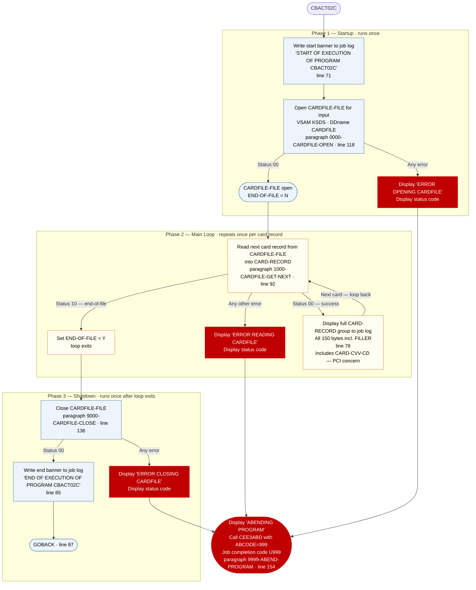

# CBACT02C — Card Data File Reader and Printer

```
Application : AWS CardDemo
Source File : CBACT02C.cbl
Type        : Batch COBOL
Source Banner: Program     : CBACT02C.CBL
```

This document describes what the program does in plain English. It treats the program as a sequence of data actions — reading rows, logging values, handling errors — and names every file, field, copybook, and external program along the way so a developer can still find each piece in the source. The reader does not need to know COBOL.

---

## 1. Purpose

CBACT02C reads the **Card Master File** — an indexed VSAM file identified in the program as `CARDFILE-FILE`, assigned to the JCL DDname `CARDFILE` — and prints every card record it finds to the job log. The Card Master File is a KSDS (keyed sequential data set) with each record keyed on the 16-character card number (`FD-CARD-NUM`), so the program reads it one card at a time in ascending card-number order. No output files are written; the sole output of this program is the sequence of `DISPLAY` statements that send record content to the job log.

The layout of a card record — its field names, lengths, and meanings — is defined externally in copybook `CVACT02Y`, which provides the group `CARD-RECORD` and all `CARD-*` fields.

No external programs (apart from the IBM Language Environment abend service `CEE3ABD`) are called. No date conversions, lookups, or calculations are performed.

No output files are written by this program. This is a diagnostic read-and-display utility.

---

## 2. Program Flow

The program runs in three phases: **startup** (open the card file), **per-record processing loop** (read and display each card record), and **shutdown** (close the card file).

### 2.1 Startup

**Step 1 — Write the start banner** *(Procedure Division, line 71).* The message `'START OF EXECUTION OF PROGRAM CBACT02C'` is written to the job log.

**Step 2 — Open the Card Master File for reading** *(paragraph `0000-CARDFILE-OPEN`, line 118).* Opens `CARDFILE-FILE` for input. Before the open, `APPL-RESULT` is pre-set to `8` as an "in-progress" sentinel. If the open returns status `'00'`, `APPL-RESULT` is set to `0` (`APPL-AOK`); any other status sets it to `12`. If `APPL-AOK` is not true, the program displays `'ERROR OPENING CARDFILE'`, calls `9910-DISPLAY-IO-STATUS` to format the status code for the job log, then calls `9999-ABEND-PROGRAM` to terminate with `U999`.

After the open succeeds, the loop-control flag `END-OF-FILE` is at its initialised value of `'N'`.

### 2.2 Per-Record Processing Loop

The program loops until `END-OF-FILE` becomes `'Y'`. Inside the loop there is a **redundant inner guard** that checks `END-OF-FILE = 'N'` before calling the read paragraph — this condition can never be false while the loop is still executing, so it adds no logic (see Migration Note 2). The walkthrough below describes one full iteration for a single card.

**Step 3 — Read the next card record** *(paragraph `1000-CARDFILE-GET-NEXT`, line 92).* The program reads the next card record from `CARDFILE-FILE` into the working-storage area `CARD-RECORD` defined by copybook `CVACT02Y`. The outcome is one of three:

- **Status `'00'` — success.** `APPL-RESULT` is set to `0` (`APPL-AOK`). Processing continues with step 4. Note: there is a **commented-out** `DISPLAY CARD-RECORD` statement at line 96 — this debug display was present at some point and removed by commenting rather than deletion (see Migration Note 3).
- **Status `'10'` — end-of-file.** `APPL-RESULT` is set to `16` (`APPL-EOF`). The post-read check sets `END-OF-FILE` to `'Y'`. No display is done. The loop exits and shutdown begins.
- **Any other status — unexpected failure.** `APPL-RESULT` is set to `12`. The post-read check displays `'ERROR READING CARDFILE'`, calls `9910-DISPLAY-IO-STATUS`, and calls `9999-ABEND-PROGRAM`.

**Step 4 — Display the card record** *(main loop body, line 78).* If `END-OF-FILE` is still `'N'` after the read, the entire `CARD-RECORD` group is written to the job log as a single display line. All fields defined in `CVACT02Y` are part of this display — the 59-byte `FILLER` at the end of the record is also included in the raw display, though it will print as spaces or binary garbage.

After step 4, the loop checks `END-OF-FILE`. If still `'N'`, the next iteration begins at step 3. When `END-OF-FILE` is `'Y'`, the loop exits.

### 2.3 Shutdown

**Step 5 — Close the Card Master File** *(paragraph `9000-CARDFILE-CLOSE`, line 136).* Uses the same arithmetic-idiom style as CBACT01C: `ADD 8 TO ZERO GIVING APPL-RESULT` sets the initial progress sentinel, and on success `SUBTRACT APPL-RESULT FROM APPL-RESULT` zeroes the result. This is functionally equivalent to simple assignments. On close failure, the program displays `'ERROR CLOSING CARDFILE'`, calls `9910-DISPLAY-IO-STATUS`, and calls `9999-ABEND-PROGRAM`.

**Step 6 — Write the end banner and return** *(lines 85–87).* The message `'END OF EXECUTION OF PROGRAM CBACT02C'` is written to the job log. Control returns to the operating system via `GOBACK`.

---

## 3. Error Handling

All file errors are fatal. The pattern used throughout is: display a message identifying the file and operation, call `9910-DISPLAY-IO-STATUS` to format the two-byte file status for the job log, then call `9999-ABEND-PROGRAM` to terminate.

### 3.1 Status Decoder — `9910-DISPLAY-IO-STATUS` (line 161)

Accepts the two-byte file status in `IO-STATUS` (set by copying `CARDFILE-STATUS` before the call). For standard two-digit status codes such as `'00'` or `'10'`, the decoder zero-pads to four characters — status `'00'` prints as `0000`. For system-level errors where the first byte is `'9'` and the second byte is a binary value, the decoder converts the binary byte to a three-digit decimal using the `TWO-BYTES-BINARY` / `TWO-BYTES-RIGHT` overlay, producing a display such as `9034`. The formatted result is written to the job log as: `'FILE STATUS IS: NNNN'` followed by the four-character `IO-STATUS-04`.

### 3.2 Abend Routine — `9999-ABEND-PROGRAM` (line 154)

Displays `'ABENDING PROGRAM'`, sets `ABCODE` to `999` and `TIMING` to `0`, then calls `CEE3ABD`. The job step terminates with completion code `U999`. Every failure mode in this program uses the same generic code `999`.

---

## 4. Migration Notes

1. **`CARD-EXPIRAION-DATE` is a typo in `CVACT02Y`.** The field (`X(10)`) is misspelled in the copybook and in the FD skeleton. The misspelling must be preserved exactly in any migration that maintains field-name compatibility with the VSAM file layout.

2. **The inner guard `END-OF-FILE = 'N'` inside the main loop is redundant** *(line 75).* While `PERFORM UNTIL END-OF-FILE = 'Y'` is looping, `END-OF-FILE` is by definition `'N'`. The condition can never be false at that point and adds no logic. This is the same boilerplate pattern as in CBACT01C.

3. **Commented-out duplicate display inside `1000-CARDFILE-GET-NEXT`** *(line 96).* There is a commented-out `DISPLAY CARD-RECORD` inside the read paragraph, in addition to the live display in the main loop (line 78). Had both been active, each successful record would have been displayed twice. The comment is a debugging artifact; it was removed by commenting rather than deletion.

4. **The 59-byte FILLER is included in the raw `DISPLAY CARD-RECORD`** *(line 78).* The display emits the full 150-byte `CARD-RECORD` group including its trailing `FILLER`. On most z/OS systems this will appear as spaces, but if the VSAM record contains uninitialized bytes they will print as non-printable characters.

5. **`CARD-CVV-CD` is printed to the job log** *(line 78).* The CVV code (PIC `9(03)`) is part of `CARD-RECORD` and is included in the unfiltered `DISPLAY CARD-RECORD`. Displaying raw card security codes to a batch job log is a PCI-DSS concern and must not be replicated in any migration.

6. **A single generic abend code (`999`) covers every failure mode** *(line 157).* Open, read, and close errors all produce `U999`. The migrated system should surface failure context in structured logging.

7. **No explicit DISPLAY of individual fields** — the program dumps the entire raw record group rather than formatting individual fields. Java migration should produce a structured log entry per field.

---

## Appendix A — Files

| Logical Name | DDname | Organization | Recording | Key Field | Direction | Contents |
|---|---|---|---|---|---|---|
| `CARDFILE-FILE` | `CARDFILE` | VSAM KSDS — indexed, accessed sequentially | Fixed, 150 bytes | `FD-CARD-NUM` PIC X(16), 16-character card number | Input — read-only, sequential | Card master. One 150-byte row per card. The FD defines a two-field skeleton (`FD-CARD-NUM` + `FD-CARD-DATA X(134)`); the full named layout comes from copybook `CVACT02Y`. |

---

## Appendix B — Copybooks and External Programs

### Copybook `CVACT02Y` (WORKING-STORAGE SECTION, line 45)

Defines `CARD-RECORD` — the working-storage layout for card rows read from `CARDFILE-FILE`. Total record length is 150 bytes (noted in the copybook header as `RECLN 150`). Source file: `CVACT02Y.cpy`.

| Field | PIC | Bytes | Notes |
|---|---|---|---|
| `CARD-NUM` | `X(16)` | 16 | Card number; VSAM KSDS primary key |
| `CARD-ACCT-ID` | `9(11)` | 11 | Linked account number |
| `CARD-CVV-CD` | `9(03)` | 3 | Card verification value — **printed to job log by this program; PCI-DSS concern** |
| `CARD-EMBOSSED-NAME` | `X(50)` | 50 | Cardholder name as embossed on the card |
| `CARD-EXPIRAION-DATE` | `X(10)` | 10 | Card expiry date — **misspelled in copybook (missing 'I' in EXPIRATION); spelling must be preserved** |
| `CARD-ACTIVE-STATUS` | `X(01)` | 1 | Active/inactive flag |
| `FILLER` | `X(59)` | 59 | Padding to 150-byte record length — **included in raw DISPLAY** |

All fields in `CVACT02Y` are implicitly displayed via the `DISPLAY CARD-RECORD` statement. There are no unused fields from a referencing standpoint, though the program references the group as a whole rather than individual fields.

### External Service `CEE3ABD`

| Item | Detail |
|---|---|
| Type | IBM Language Environment runtime service for forced abend |
| Called from | Paragraph `9999-ABEND-PROGRAM`, line 158 |
| `ABCODE` parameter | `PIC S9(9) BINARY`, set to `999` — produces job completion code `U999` |
| `TIMING` parameter | `PIC S9(9) BINARY`, set to `0` — abend is immediate |

---

## Appendix C — Hardcoded Literals

| Paragraph | Line | Value | Usage | Classification |
|---|---|---|---|---|
| `PROCEDURE DIVISION` (banner) | 71 | `'START OF EXECUTION OF PROGRAM CBACT02C'` | Job log banner at entry | Display message |
| `PROCEDURE DIVISION` (banner) | 85 | `'END OF EXECUTION OF PROGRAM CBACT02C'` | Job log banner at exit | Display message |
| `0000-CARDFILE-OPEN` | 119 | `8` | Pre-open sentinel in `APPL-RESULT` | Internal convention |
| `0000-CARDFILE-OPEN` | 122, 124 | `0`, `12` | Result codes for `APPL-RESULT` | Internal convention |
| `0000-CARDFILE-OPEN` | 129 | `'ERROR OPENING CARDFILE'` | Error message for job log | Display message |
| `1000-CARDFILE-GET-NEXT` | 95, 99, 101 | `0`, `16`, `12` | Result codes for `APPL-RESULT` | Internal convention |
| `1000-CARDFILE-GET-NEXT` | 110 | `'ERROR READING CARDFILE'` | Error message for job log | Display message |
| `9000-CARDFILE-CLOSE` | 147 | `'ERROR CLOSING CARDFILE'` | Error message for job log | Display message |
| `9999-ABEND-PROGRAM` | 157 | `999` | Abend code passed to `CEE3ABD` | Generic — same code for every failure |
| `9910-DISPLAY-IO-STATUS` | 168, 172 | `'FILE STATUS IS: NNNN'` | Job log prefix for status display | Display message |

---

## Appendix D — Internal Working Fields

| Field | PIC | Bytes | Purpose |
|---|---|---|---|
| `CARDFILE-STATUS` with `CARDFILE-STAT1`, `CARDFILE-STAT2` | `X` + `X` | 2 | Two-byte file status code returned by the VSAM runtime after each operation on `CARDFILE-FILE` |
| `END-OF-FILE` | `X(01)` | 1 | Loop-control flag — initialised `'N'`; set to `'Y'` when the card file is exhausted |
| `APPL-RESULT` | `S9(9) COMP` | 4 | Numeric result code. 88-level `APPL-AOK` = 0 (success); 88-level `APPL-EOF` = 16 (end-of-file); 12 = error |
| `IO-STATUS` with `IO-STAT1`, `IO-STAT2` | `X` + `X` | 2 | Copy of the failing file status, passed to `9910-DISPLAY-IO-STATUS` |
| `TWO-BYTES-BINARY` / `TWO-BYTES-ALPHA` (`TWO-BYTES-LEFT` + `TWO-BYTES-RIGHT`) | `9(4) BINARY` / `X` + `X` | 4 | Overlay area used by the status decoder to convert a single binary status byte to a 0–255 decimal |
| `IO-STATUS-04` with `IO-STATUS-0401` (1 digit) + `IO-STATUS-0403` (3 digits) | `9` + `999` | 4 | Four-character formatted display of the status code, produced by `9910-DISPLAY-IO-STATUS` |
| `ABCODE` | `S9(9) BINARY` | 4 | Abend code parameter for `CEE3ABD`; set to `999` |
| `TIMING` | `S9(9) BINARY` | 4 | Timing parameter for `CEE3ABD`; set to `0` (immediate abend) |

---

## Appendix E — Execution at a Glance



For an input file of N cards: startup runs once, the loop runs N times writing N display lines to the job log, shutdown runs once.

---

*Source: `CBACT02C.cbl`, CardDemo, Apache 2.0 license. Copybook: `CVACT02Y.cpy`. External service: `CEE3ABD` (IBM Language Environment). All file names, DDnames, paragraph names, field names, PIC clauses, and literal values in this document are taken directly from the source files.*
