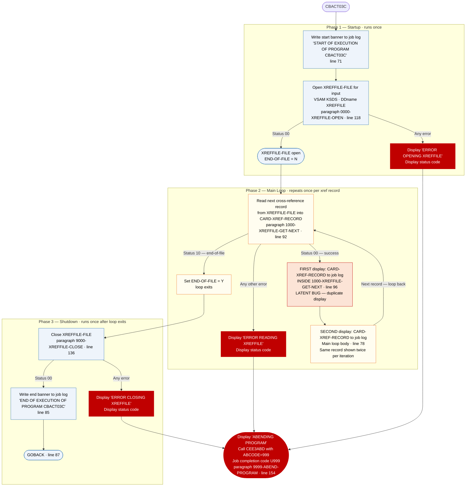

# CBACT03C — Card Cross-Reference File Reader and Printer

```
Application : AWS CardDemo
Source File : CBACT03C.cbl
Type        : Batch COBOL
Source Banner: Program     : CBACT03C.CBL
```

This document describes what the program does in plain English. It treats the program as a sequence of data actions — reading rows, logging values, handling errors — and names every file, field, copybook, and external program along the way so a developer can still find each piece in the source. The reader does not need to know COBOL.

---

## 1. Purpose

CBACT03C reads the **Card Cross-Reference File** — an indexed VSAM file identified in the program as `XREFFILE-FILE`, assigned to the JCL DDname `XREFFILE` — and prints every cross-reference record it finds to the job log. The Cross-Reference File is a KSDS (keyed sequential data set) with each record keyed on the 16-character card number (`FD-XREF-CARD-NUM`), so the program reads it one record at a time in ascending card-number order. No output files are written; all output goes to the job log via `DISPLAY` statements.

The cross-reference record links a card number, a customer ID, and an account ID. The record layout is defined in copybook `CVACT03Y`, which provides the group `CARD-XREF-RECORD` and its three data fields.

No external programs (apart from `CEE3ABD`) are called. No calculations, lookups, or transformations are performed.

**Note:** This program displays `CARD-XREF-RECORD` **twice** for every record read — once inside the read paragraph `1000-XREFFILE-GET-NEXT` and once in the main loop body. This double-display is a latent bug inherited from a copy-and-paste template (see Migration Note 1).

---

## 2. Program Flow

The program runs in three phases: **startup** (open the cross-reference file), **per-record processing loop** (read and display each cross-reference record), and **shutdown** (close the file).

### 2.1 Startup

**Step 1 — Write the start banner** *(Procedure Division, line 71).* The message `'START OF EXECUTION OF PROGRAM CBACT03C'` is written to the job log.

**Step 2 — Open the Cross-Reference File for reading** *(paragraph `0000-XREFFILE-OPEN`, line 118).* Opens `XREFFILE-FILE` for input. Before the open, `APPL-RESULT` is pre-set to `8` as a progress sentinel. If the open returns status `'00'`, `APPL-RESULT` is set to `0`; any other status sets it to `12`. If `APPL-AOK` is not true, the program displays `'ERROR OPENING XREFFILE'`, calls `9910-DISPLAY-IO-STATUS` to format the status code, then calls `9999-ABEND-PROGRAM` to terminate with `U999`.

After the open succeeds, `END-OF-FILE` is at its initialised value of `'N'`.

### 2.2 Per-Record Processing Loop

The program loops until `END-OF-FILE` becomes `'Y'`. There is a **redundant inner guard** checking `END-OF-FILE = 'N'` (line 75) — this condition can never be false while the loop is running (see Migration Note 2). The walkthrough below describes one full iteration.

**Step 3 — Read the next cross-reference record** *(paragraph `1000-XREFFILE-GET-NEXT`, line 92).* Reads the next record from `XREFFILE-FILE` into the working-storage area `CARD-XREF-RECORD` defined by copybook `CVACT03Y`. Three possible outcomes:

- **Status `'00'` — success.** `APPL-RESULT` is set to `0` (`APPL-AOK`). **Immediately inside this paragraph, at line 96, the program displays `CARD-XREF-RECORD` to the job log** — this is a first display of the record. Processing continues with step 4.
- **Status `'10'` — end-of-file.** `APPL-RESULT` is set to `16` (`APPL-EOF`). The post-read check sets `END-OF-FILE` to `'Y'`. The loop exits.
- **Any other status — unexpected failure.** `APPL-RESULT` is set to `12`. The post-read check displays `'ERROR READING XREFFILE'`, calls `9910-DISPLAY-IO-STATUS`, and calls `9999-ABEND-PROGRAM`.

**Step 4 — Display the cross-reference record a second time** *(main loop body, line 78).* If `END-OF-FILE` is still `'N'` after the read paragraph returns, `CARD-XREF-RECORD` is displayed again to the job log. Every successfully read record therefore appears **twice** in the job log — once from inside `1000-XREFFILE-GET-NEXT` and once here (see Migration Note 1).

After step 4, the loop checks `END-OF-FILE`. If still `'N'`, the next iteration begins at step 3. When `END-OF-FILE` is `'Y'`, the loop exits.

### 2.3 Shutdown

**Step 5 — Close the Cross-Reference File** *(paragraph `9000-XREFFILE-CLOSE`, line 136).* Uses the same arithmetic-idiom style as other programs in the suite: `ADD 8 TO ZERO GIVING APPL-RESULT` as a sentinel, and `SUBTRACT APPL-RESULT FROM APPL-RESULT` on success. On close failure, displays `'ERROR CLOSING XREFFILE'`, calls `9910-DISPLAY-IO-STATUS`, and calls `9999-ABEND-PROGRAM`.

**Step 6 — Write the end banner and return** *(lines 85–87).* The message `'END OF EXECUTION OF PROGRAM CBACT03C'` is written to the job log. Control returns to the operating system via `GOBACK`.

---

## 3. Error Handling

All file errors are fatal. The pattern used throughout is: display an error message naming the file and operation, call `9910-DISPLAY-IO-STATUS` to format the two-byte file status for the job log, then call `9999-ABEND-PROGRAM` to terminate.

### 3.1 Status Decoder — `9910-DISPLAY-IO-STATUS` (line 161)

Accepts the two-byte file status in `IO-STATUS` (set by copying `XREFFILE-STATUS` before the call). For standard two-digit status codes, the decoder zero-pads to four characters — status `'00'` prints as `0000`. For system-level errors where the first byte is `'9'` and the second byte is binary, the decoder converts the binary byte to a three-digit decimal, producing output such as `9034`. The formatted result is written to the job log as `'FILE STATUS IS: NNNN'` followed by the four-character `IO-STATUS-04`.

### 3.2 Abend Routine — `9999-ABEND-PROGRAM` (line 154)

Displays `'ABENDING PROGRAM'`, sets `ABCODE` to `999` and `TIMING` to `0`, then calls `CEE3ABD`. The job step terminates with completion code `U999`.

---

## 4. Migration Notes

1. **Every successfully read record is displayed twice to the job log.** Inside `1000-XREFFILE-GET-NEXT` (line 96), `CARD-XREF-RECORD` is displayed immediately after a status-`'00'` read. Then in the main loop (line 78), the same record is displayed again when `END-OF-FILE` is still `'N'`. This doubles the output volume for every record and is a copy-and-paste defect — in the template (CBACT01C and CBACT02C) the in-paragraph display is commented out; here it was left active. Java migration should produce exactly one structured log entry per record.

2. **The inner guard `END-OF-FILE = 'N'` inside the main loop is redundant** *(line 75).* While `PERFORM UNTIL END-OF-FILE = 'Y'` is looping, `END-OF-FILE` is by definition `'N'`. The condition adds no logic.

3. **`FILLER` at the end of `CARD-XREF-RECORD` is included in the raw display.** The 14-byte `FILLER` at the end of the record (bytes 37–50) is part of the group and will be included in both display outputs. This prints as spaces or uninitialized bytes.

4. **A single generic abend code (`999`) covers every failure mode** *(line 157).* Open, read, and close errors all produce `U999`.

5. **The cross-reference record has no unused fields** — all three data fields (`XREF-CARD-NUM`, `XREF-CUST-ID`, `XREF-ACCT-ID`) are emitted via the group display, though none is individually inspected by the program logic.

---

## Appendix A — Files

| Logical Name | DDname | Organization | Recording | Key Field | Direction | Contents |
|---|---|---|---|---|---|---|
| `XREFFILE-FILE` | `XREFFILE` | VSAM KSDS — indexed, accessed sequentially | Fixed, 50 bytes | `FD-XREF-CARD-NUM` PIC X(16), 16-character card number | Input — read-only, sequential | Card-to-account-to-customer cross-reference. One 50-byte row per card. The FD defines a two-field skeleton (`FD-XREF-CARD-NUM` + `FD-XREF-DATA X(34)`); the full named layout comes from copybook `CVACT03Y`. |

---

## Appendix B — Copybooks and External Programs

### Copybook `CVACT03Y` (WORKING-STORAGE SECTION, line 45)

Defines `CARD-XREF-RECORD` — the working-storage layout for cross-reference rows read from `XREFFILE-FILE`. Total record length is 50 bytes (noted in the copybook header as `RECLN 50`). Source file: `CVACT03Y.cpy`.

| Field | PIC | Bytes | Notes |
|---|---|---|---|
| `XREF-CARD-NUM` | `X(16)` | 16 | Card number; VSAM KSDS primary key. This field links to the card entity. |
| `XREF-CUST-ID` | `9(09)` | 9 | Customer ID — links to the customer entity |
| `XREF-ACCT-ID` | `9(11)` | 11 | Account ID — links to the account entity |
| `FILLER` | `X(14)` | 14 | Padding to 50-byte record length — included in raw DISPLAY output |

All fields are emitted via the group-level `DISPLAY CARD-XREF-RECORD` (twice per record). No field is selectively referenced by the program.

### External Service `CEE3ABD`

| Item | Detail |
|---|---|
| Type | IBM Language Environment runtime service for forced abend |
| Called from | Paragraph `9999-ABEND-PROGRAM`, line 158 |
| `ABCODE` parameter | `PIC S9(9) BINARY`, set to `999` — produces job completion code `U999` |
| `TIMING` parameter | `PIC S9(9) BINARY`, set to `0` — abend is immediate |

---

## Appendix C — Hardcoded Literals

| Paragraph | Line | Value | Usage | Classification |
|---|---|---|---|---|
| `PROCEDURE DIVISION` (banner) | 71 | `'START OF EXECUTION OF PROGRAM CBACT03C'` | Job log banner at entry | Display message |
| `PROCEDURE DIVISION` (banner) | 85 | `'END OF EXECUTION OF PROGRAM CBACT03C'` | Job log banner at exit | Display message |
| `0000-XREFFILE-OPEN` | 119 | `8` | Pre-open sentinel in `APPL-RESULT` | Internal convention |
| `0000-XREFFILE-OPEN` | 122, 124 | `0`, `12` | Result codes for `APPL-RESULT` | Internal convention |
| `0000-XREFFILE-OPEN` | 129 | `'ERROR OPENING XREFFILE'` | Error message for job log | Display message |
| `1000-XREFFILE-GET-NEXT` | 95, 99, 101 | `0`, `16`, `12` | Result codes for `APPL-RESULT` | Internal convention |
| `1000-XREFFILE-GET-NEXT` | 110 | `'ERROR READING XREFFILE'` | Error message for job log | Display message |
| `9000-XREFFILE-CLOSE` | 147 | `'ERROR CLOSING XREFFILE'` | Error message for job log | Display message |
| `9999-ABEND-PROGRAM` | 157 | `999` | Abend code passed to `CEE3ABD` | Generic — same code for every failure |
| `9910-DISPLAY-IO-STATUS` | 168, 172 | `'FILE STATUS IS: NNNN'` | Job log prefix for status display | Display message |

---

## Appendix D — Internal Working Fields

| Field | PIC | Bytes | Purpose |
|---|---|---|---|
| `XREFFILE-STATUS` with `XREFFILE-STAT1`, `XREFFILE-STAT2` | `X` + `X` | 2 | Two-byte file status code returned by the VSAM runtime after each operation on `XREFFILE-FILE` |
| `END-OF-FILE` | `X(01)` | 1 | Loop-control flag — initialised `'N'`; set to `'Y'` when the cross-reference file is exhausted |
| `APPL-RESULT` | `S9(9) COMP` | 4 | Numeric result code. 88-level `APPL-AOK` = 0 (success); 88-level `APPL-EOF` = 16 (end-of-file); 12 = error |
| `IO-STATUS` with `IO-STAT1`, `IO-STAT2` | `X` + `X` | 2 | Copy of the failing file status, passed to `9910-DISPLAY-IO-STATUS` |
| `TWO-BYTES-BINARY` / `TWO-BYTES-ALPHA` (`TWO-BYTES-LEFT` + `TWO-BYTES-RIGHT`) | `9(4) BINARY` / `X` + `X` | 4 | Overlay area used by the status decoder to convert a single binary status byte to a 0–255 decimal |
| `IO-STATUS-04` with `IO-STATUS-0401` + `IO-STATUS-0403` | `9` + `999` | 4 | Four-character formatted display of the status code |
| `ABCODE` | `S9(9) BINARY` | 4 | Abend code for `CEE3ABD`; set to `999` |
| `TIMING` | `S9(9) BINARY` | 4 | Timing parameter for `CEE3ABD`; set to `0` (immediate) |

---

## Appendix E — Execution at a Glance



For an input file of N cross-reference records: startup runs once, the loop runs N times producing **2N display lines** to the job log (two per record due to the duplicate display defect), shutdown runs once.

---

*Source: `CBACT03C.cbl`, CardDemo, Apache 2.0 license. Copybook: `CVACT03Y.cpy`. External service: `CEE3ABD` (IBM Language Environment). All file names, DDnames, paragraph names, field names, PIC clauses, and literal values in this document are taken directly from the source files.*
