# CBACT04C — Interest Calculator and Transaction Writer

```
Application : AWS CardDemo
Source File : CBACT04C.cbl
Type        : Batch COBOL
Source Banner: Program     : CBACT04C.CBL
```

This document describes what the program does in plain English. It treats the program as a sequence of data actions — reading category balances, looking up interest rates, computing charges, writing transactions, and updating account balances — and names every file, field, copybook, and external program along the way so a developer can still find each piece in the source. The reader does not need to know COBOL.

---

## 1. Purpose

CBACT04C is the **interest calculator** for the CardDemo system. It is the only program in the batch suite that both reads and updates the Account Master File, and the only one that writes new transaction records to the Transaction File. The program is invoked with a **run date** passed as a parameter (`PARM-DATE`, PIC X(10)) which it uses to construct transaction IDs for the interest charges it generates.

The program reads five files:

- **Transaction Category Balance File** (`TCATBAL-FILE`, DDname `TCATBALF`) — a KSDS read sequentially; one row per account-transaction-type-category combination giving the balance for that category. This is the primary driver file.
- **Card Cross-Reference File** (`XREF-FILE`, DDname `XREFFILE`) — a KSDS accessed randomly by account ID via an alternate key (`FD-XREF-ACCT-ID`); used to look up the card number for each account so it can be placed in the generated interest transaction.
- **Account Master File** (`ACCOUNT-FILE`, DDname `ACCTFILE`) — a KSDS accessed randomly by account ID (`FD-ACCT-ID`); read to get `ACCT-GROUP-ID` (rate group) for interest rate lookup, and rewritten at account rollover to update balances.
- **Disclosure Group File** (`DISCGRP-FILE`, DDname `DISCGRP`) — a KSDS accessed randomly by a composite key (group ID + transaction type + category code); provides the annual interest rate `DIS-INT-RATE` for each category.

The program writes to one file:

- **Transaction File** (`TRANSACT-FILE`, DDname `TRANSACT`) — a sequential output file; one interest-charge transaction record is written for every category whose interest rate is non-zero.

**What the program does, in one paragraph:** For each account, it sums the monthly interest charges across all of that account's active transaction categories, writes one interest transaction record per category, then updates the account's current balance by adding the total interest, and zeros out the account's current-cycle credit and debit counters.

---

## 2. Program Flow

The program runs in three phases: **startup** (open all five files), **per-category-balance processing loop** (main interest calculation and account update logic), and **shutdown** (close all five files).

The program is invoked as `PROCEDURE DIVISION USING EXTERNAL-PARMS`, meaning it expects a LINKAGE SECTION parameter block containing the run date. `PARM-LENGTH` (PIC S9(04) COMP) carries the byte length of the parameter and `PARM-DATE` (PIC X(10)) carries the date string.

### 2.1 Startup

**Step 1 — Write start banner** *(Procedure Division, line 181).* The message `'START OF EXECUTION OF PROGRAM CBACT04C'` is written to the job log.

**Step 2 — Open the Transaction Category Balance File** *(paragraph `0000-TCATBALF-OPEN`, line 234).* Opens `TCATBAL-FILE` for input. On failure, displays `'ERROR OPENING TRANSACTION CATEGORY BALANCE'` and abends.

**Step 3 — Open the Cross-Reference File** *(paragraph `0100-XREFFILE-OPEN`, line 252).* Opens `XREF-FILE` for input. On failure, displays `'ERROR OPENING CROSS REF FILE'` followed by the raw status bytes (note: this open error message concatenates the status value directly rather than using `9910-DISPLAY-IO-STATUS`, making the output format inconsistent with other error paths — see Migration Note 1) and abends.

**Step 4 — Open the Disclosure Group File** *(paragraph `0200-DISCGRP-OPEN`, line 270).* Opens `DISCGRP-FILE` for input. On failure, displays `'ERROR OPENING DALY REJECTS FILE'` — this display message is a copy-paste artifact; the file is the Disclosure Group (interest rate) file, not a "daily rejects" file (see Migration Note 2). Abends on failure.

**Step 5 — Open the Account Master File for I-O** *(paragraph `0300-ACCTFILE-OPEN`, line 289).* Opens `ACCOUNT-FILE` in I-O mode (read and update). On failure, displays `'ERROR OPENING ACCOUNT MASTER FILE'` and abends.

**Step 6 — Open the Transaction File for output** *(paragraph `0400-TRANFILE-OPEN`, line 307).* Opens `TRANSACT-FILE` for sequential output. On failure, displays `'ERROR OPENING TRANSACTION FILE'` and abends.

After all five opens succeed, `END-OF-FILE` is at `'N'`, `WS-FIRST-TIME` is at `'Y'`, `WS-TOTAL-INT` is uninitialized (zeroed by the INITIALIZE implicit in VALUE 0), and `WS-LAST-ACCT-NUM` is spaces.

### 2.2 Per-Category-Balance Processing Loop

The program drives on the Transaction Category Balance File, reading one category-balance row per iteration. The file is grouped by account: all rows for account A appear before any row for account B. The program detects account transitions by comparing `TRANCAT-ACCT-ID` in the current row with `WS-LAST-ACCT-NUM` from the previous row.

**Important structural note:** The `ELSE` branch of the outer loop (lines 219–221) handles the case where `END-OF-FILE` has been set to `'Y'` — in this situation the `PERFORM 1050-UPDATE-ACCOUNT` call at line 220 runs **after the loop condition has already triggered the exit**. This is a subtle COBOL structure: the ELSE clause inside the `PERFORM UNTIL` body runs for the last iteration when the read set `END-OF-FILE = 'Y'`, ensuring the final account's balance is updated before the loop truly exits. This pattern works because the PERFORM UNTIL checks the condition at the top of each iteration, not mid-iteration.

The walkthrough below describes one full iteration for a single category-balance row.

**Step 7 — Read the next category-balance row** *(paragraph `1000-TCATBALF-GET-NEXT`, line 325).* Reads from `TCATBAL-FILE` into `TRAN-CAT-BAL-RECORD`. Fields now in memory:

| Field | PIC | Business meaning |
|---|---|---|
| `TRANCAT-ACCT-ID` | `9(11)` | Account ID for this category balance |
| `TRANCAT-TYPE-CD` | `X(02)` | Transaction type code (e.g. purchase, cash advance) |
| `TRANCAT-CD` | `9(04)` | Transaction category code |
| `TRAN-CAT-BAL` | `S9(09)V99` | Balance for this account/type/category combination |
| `FILLER` | `X(22)` | Padding |

On status `'00'`, `APPL-RESULT` is set to `0`. On `'10'` (EOF), `APPL-RESULT` is set to `16` and `END-OF-FILE` is set to `'Y'`. Any other status triggers display of `'ERROR READING TRANSACTION CATEGORY FILE'` and abends.

**Step 8 — Display the category-balance record to the job log** *(line 193).* For every successfully read row, the full `TRAN-CAT-BAL-RECORD` is written to the job log. This is a diagnostic display that fires for every record in the file.

**Step 9 — Detect account change and process prior account** *(lines 194–206).* If `TRANCAT-ACCT-ID` is different from `WS-LAST-ACCT-NUM`, an account boundary has been crossed:

- If this is not the very first account (`WS-FIRST-TIME` is not `'Y'`), the prior account's interest is posted by calling `1050-UPDATE-ACCOUNT` (step 10 below).
- If it is the first account, `WS-FIRST-TIME` is set to `'N'` so subsequent boundaries trigger updates.
- `WS-TOTAL-INT` is reset to `0` for the new account.
- `WS-LAST-ACCT-NUM` is updated with the new account ID.
- The account's master record is fetched by placing `TRANCAT-ACCT-ID` into `FD-ACCT-ID` and calling `1100-GET-ACCT-DATA` (step 11 below).
- The cross-reference is fetched by placing `TRANCAT-ACCT-ID` into `FD-XREF-ACCT-ID` and calling `1110-GET-XREF-DATA` (step 12 below).

**Step 10 — Update the prior account's balance** *(paragraph `1050-UPDATE-ACCOUNT`, line 350).* Adds `WS-TOTAL-INT` to `ACCT-CURR-BAL`, then sets `ACCT-CURR-CYC-CREDIT` and `ACCT-CURR-CYC-DEBIT` both to `0`. The entire `ACCOUNT-RECORD` is then rewritten to `ACCOUNT-FILE` using the VSAM REWRITE verb. If the rewrite fails (status other than `'00'`), the program displays `'ERROR RE-WRITING ACCOUNT FILE'` and abends.

**Step 11 — Fetch the account master record** *(paragraph `1100-GET-ACCT-DATA`, line 372).* Reads `ACCOUNT-FILE` randomly using `FD-ACCT-ID` as the key, reading into `ACCOUNT-RECORD`. If the account is not found (INVALID KEY path), displays `'ACCOUNT NOT FOUND: '` followed by `FD-ACCT-ID`. **The program does not abend on a missing account in the INVALID KEY path** — it only logs the message. If `ACCTFILE-STATUS` is then `'00'`, processing continues; otherwise it displays `'ERROR READING ACCOUNT FILE'` and abends. (See Migration Note 3 for the INVALID KEY / status check interaction.)

**Step 12 — Fetch the cross-reference record** *(paragraph `1110-GET-XREF-DATA`, line 393).* Reads `XREF-FILE` randomly using `FD-XREF-ACCT-ID` as the alternate key, reading into `CARD-XREF-RECORD`. If the cross-reference is not found, displays `'ACCOUNT NOT FOUND: '` followed by `FD-XREF-ACCT-ID`. Same non-fatal INVALID KEY behaviour as step 11 (see Migration Note 3).

**Step 13 — Fetch the interest rate** *(paragraph `1200-GET-INTEREST-RATE`, line 415).* The composite key for `DISCGRP-FILE` is assembled from `ACCT-GROUP-ID` (into `FD-DIS-ACCT-GROUP-ID`), `TRANCAT-CD` (into `FD-DIS-TRAN-CAT-CD`), and `TRANCAT-TYPE-CD` (into `FD-DIS-TRAN-TYPE-CD`). The file is read randomly into `DIS-GROUP-RECORD`. Two possible outcomes besides a clean read:

- **Status `'23'` — key not found.** The program logs `'DISCLOSURE GROUP RECORD MISSING'` and `'TRY WITH DEFAULT GROUP CODE'`, then falls through to set `FD-DIS-ACCT-GROUP-ID` to `'DEFAULT'` and calls `1200-A-GET-DEFAULT-INT-RATE` (step 13A). Status `'23'` is treated as acceptable — it does not set `APPL-RESULT` to `12`.
- **Any other non-`'00'` status.** Sets `APPL-RESULT` to `12` and abends after displaying `'ERROR READING DISCLOSURE GROUP FILE'`.

**Step 13A — Fetch the default interest rate** *(paragraph `1200-A-GET-DEFAULT-INT-RATE`, line 443).* Reads `DISCGRP-FILE` again with key `'DEFAULT'` + current type and category codes. If this default record is also missing or fails, abends with `'ERROR READING DEFAULT DISCLOSURE GROUP'`. After this paragraph returns, `DIS-INT-RATE` from `DIS-GROUP-RECORD` is in memory.

**Step 14 — Compute monthly interest** *(paragraph `1300-COMPUTE-INTEREST`, line 462).* If `DIS-INT-RATE` is not zero, the monthly interest is computed as: `WS-MONTHLY-INT = (TRAN-CAT-BAL × DIS-INT-RATE) / 1200`. The divisor `1200` converts an annual percentage rate to a monthly rate. `WS-MONTHLY-INT` is accumulated into `WS-TOTAL-INT`. Then paragraph `1300-B-WRITE-TX` (step 15) is called to write the transaction record.

**Step 15 — Write the interest transaction record** *(paragraph `1300-B-WRITE-TX`, line 473).* Assembles `TRAN-RECORD` and writes it to `TRANSACT-FILE`:

- `WS-TRANID-SUFFIX` is incremented by 1.
- `TRAN-ID` is built by concatenating `PARM-DATE` (the run date from the LINKAGE SECTION) with `WS-TRANID-SUFFIX`.
- `TRAN-TYPE-CD` is set to `'01'` (system transaction type).
- `TRAN-CAT-CD` is set to `'05'` (interest category).
- `TRAN-SOURCE` is set to `'System'`.
- `TRAN-DESC` is built as `'Int. for a/c '` concatenated with `ACCT-ID`.
- `TRAN-AMT` is set to `WS-MONTHLY-INT`.
- `TRAN-MERCHANT-ID` is set to `0`, `TRAN-MERCHANT-NAME`, `TRAN-MERCHANT-CITY`, and `TRAN-MERCHANT-ZIP` are set to spaces.
- `TRAN-CARD-NUM` is set to `XREF-CARD-NUM` (from the cross-reference read in step 12).
- A DB2-format timestamp is generated by calling paragraph `Z-GET-DB2-FORMAT-TIMESTAMP` and stored in both `TRAN-ORIG-TS` and `TRAN-PROC-TS`.

The assembled record is written to `TRANSACT-FILE`. If the write fails, the program displays `'ERROR WRITING TRANSACTION RECORD'` and abends.

**Step 16 — Compute fees** *(paragraph `1400-COMPUTE-FEES`, line 518).* This paragraph exists in the source but contains only an `EXIT` statement — it is a stub marked with the comment `'* To be implemented'`. No fees are ever computed (see Migration Note 4).

### 2.3 Shutdown

**Step 17 — Close all five files in sequence** *(paragraphs `9000-TCATBALF-CLOSE` through `9400-TRANFILE-CLOSE`, lines 522–611).* Each close uses the `MOVE 8` / `MOVE 0` / `MOVE 12` pattern. Failure messages are:

| Paragraph | Line | Error message |
|---|---|---|
| `9000-TCATBALF-CLOSE` | 522 | `'ERROR CLOSING TRANSACTION BALANCE FILE'` |
| `9100-XREFFILE-CLOSE` | 541 | `'ERROR CLOSING CROSS REF FILE'` |
| `9200-DISCGRP-CLOSE` | 559 | `'ERROR CLOSING DISCLOSURE GROUP FILE'` |
| `9300-ACCTFILE-CLOSE` | 577 | `'ERROR CLOSING ACCOUNT FILE'` |
| `9400-TRANFILE-CLOSE` | 595 | `'ERROR CLOSING TRANSACTION FILE'` |

**Step 18 — Write end banner and return** *(lines 230–232).* The message `'END OF EXECUTION OF PROGRAM CBACT04C'` is written to the job log. Control returns via `GOBACK`.

---

## 3. Error Handling

All file errors are fatal unless noted. The standard pattern is: display an error message, copy the failing file status into `IO-STATUS`, call `9910-DISPLAY-IO-STATUS` to format it, then call `9999-ABEND-PROGRAM`.

### 3.1 Non-Fatal Error Paths

- **INVALID KEY on account read** *(paragraph `1100-GET-ACCT-DATA`, line 373–376):* If the account key is not found, the INVALID KEY path displays `'ACCOUNT NOT FOUND: '` followed by `FD-ACCT-ID` but does **not** abend. Processing continues with stale or uninitialized `ACCOUNT-RECORD` data in memory (see Migration Note 3).
- **INVALID KEY on cross-reference read** *(paragraph `1110-GET-XREF-DATA`, line 395–398):* Same behaviour — displays `'ACCOUNT NOT FOUND: '` with `FD-XREF-ACCT-ID` and continues with stale `CARD-XREF-RECORD` data.
- **Status `'23'` on disclosure group read** *(paragraph `1200-GET-INTEREST-RATE`, line 422):* Key-not-found on the primary group code triggers a fallback to the `'DEFAULT'` group rather than an abend.

### 3.2 Status Decoder — `9910-DISPLAY-IO-STATUS` (line 635)

Identical to the decoder in CBACT01C–CBACT03C: formats the two-byte `IO-STATUS` to a four-character display and writes `'FILE STATUS IS: NNNN'` followed by the formatted value to the job log.

### 3.3 Abend Routine — `9999-ABEND-PROGRAM` (line 628)

Displays `'ABENDING PROGRAM'`, sets `ABCODE` to `999` and `TIMING` to `0`, calls `CEE3ABD`. Job completion code `U999`.

### 3.4 Timestamp Utility — `Z-GET-DB2-FORMAT-TIMESTAMP` (line 613)

Not an error handler but a utility. Calls `FUNCTION CURRENT-DATE` to get the current date and time, then assembles the 26-character DB2-format timestamp (`YYYY-MM-DD-HH.MM.SS.cc0000`) in `DB2-FORMAT-TS`. The milliseconds component (`DB2-MIL`) is set from `COB-MIL` (hundredths of seconds from `CURRENT-DATE`), and `DB2-REST` is always set to `'0000'`. The separators are hard-coded: `'-'` between date parts and `'.'` between time parts.

---

## 4. Migration Notes

1. **Error message for XREF open is inconsistent with all other error paths** *(paragraph `0100-XREFFILE-OPEN`, line 263).* All other open errors copy the status to `IO-STATUS` and call `9910-DISPLAY-IO-STATUS`. The cross-reference open error concatenates `XREFFILE-STATUS` directly onto the display string: `'ERROR OPENING CROSS REF FILE' XREFFILE-STATUS`. The status bytes appear as raw characters appended to the message rather than being decoded to four-digit format. This is an inconsistency that may produce misleading output if the status contains binary bytes.

2. **`DISCGRP-FILE` open error message says `'DALY REJECTS FILE'`** *(paragraph `0200-DISCGRP-OPEN`, line 281).* The display string reads `'ERROR OPENING DALY REJECTS FILE'`. This is a copy-paste artifact — the message was carried from a different program and was never updated to reflect the actual file being opened (Disclosure Group interest rate file). The word `'DALY'` is also a misspelling of `'DAILY'`. In a real failure, this message would actively mislead an operator.

3. **INVALID KEY on `1100-GET-ACCT-DATA` and `1110-GET-XREF-DATA` does not abend; processing continues with stale data** *(lines 373–376 and 395–398).* If an account in the category-balance file has no matching record in the Account Master File or Cross-Reference File, the program logs the "not found" message but continues. `ACCOUNT-RECORD` and `CARD-XREF-RECORD` in working storage retain whatever values were placed there by the previous successful read. The interest computation in step 14 then runs using those stale values — applying rates from the previous account's group to the current account's balances, and writing transactions with the wrong card number. This is a serious latent data integrity defect.

4. **`1400-COMPUTE-FEES` is an unimplemented stub** *(line 518–520).* The paragraph contains only `EXIT`. No fees of any kind are ever computed or written. Migration must decide whether fee computation is a real business requirement and, if so, implement it. The stub must not be translated into a no-op method without an explicit decision.

5. **`WS-MONTHLY-INT` and `WS-TOTAL-INT` are display-format (not COMP-3)** *(line 168–169).* Both fields are `PIC S9(09)V99` with no USAGE clause — they are stored as zoned decimal (display format) rather than packed decimal. In Java, both must be `BigDecimal` regardless, but the COBOL representation means they are not on disk as COMP-3; the risk is purely in arithmetic precision within the program.

6. **Interest formula divides by `1200` as a display-format integer** *(paragraph `1300-COMPUTE-INTEREST`, line 464–465).* The COMPUTE statement is `WS-MONTHLY-INT = (TRAN-CAT-BAL × DIS-INT-RATE) / 1200`. `TRAN-CAT-BAL` is `S9(09)V99` (display), `DIS-INT-RATE` is `S9(04)V99` (display), and `1200` is a literal integer. COBOL will use the precision of the receiving field `WS-MONTHLY-INT` (`S9(09)V99`) for the result, which means the decimal portion is truncated to 2 places. In Java, using `BigDecimal` with `HALF_EVEN` rounding at 2 decimal places matches this behaviour.

7. **The final account in the file is updated via an unconventional ELSE path** *(lines 219–221).* When the last read sets `END-OF-FILE = 'Y'`, the `PERFORM UNTIL` loop condition becomes true, but before the loop exits, it evaluates the ELSE clause that calls `1050-UPDATE-ACCOUNT`. This means the last account always gets its balance updated. Java migration must replicate this post-loop final-account update explicitly — it cannot rely on loop structure to trigger it automatically.

8. **`TRAN-AMT` in `CVTRA05Y` is `PIC S9(09)V99`** — display format, not COMP-3. However, `EXP-TRAN-AMT` in `CVEXPORT.cpy` is `COMP-3`. The format changes depending on which context the transaction amount is stored in. Java migration should use `BigDecimal` throughout.

9. **`WS-TRANID-SUFFIX` is a 6-digit counter starting at 0** *(line 173).* If a single run generates more than 999,999 interest transactions the suffix wraps to zero, causing `TRAN-ID` collisions (duplicate primary keys in the transaction file). For large portfolios this is a real risk.

10. **`1200-A-GET-DEFAULT-INT-RATE` reads without setting a key** *(line 444).* After setting `FD-DIS-ACCT-GROUP-ID` to `'DEFAULT'` in `1200-GET-INTEREST-RATE`, the subparagraph reads `DISCGRP-FILE` with the key that was just assembled. However, the READ statement in `1200-A-GET-DEFAULT-INT-RATE` contains no `KEY IS` clause, so the VSAM runtime uses whatever key is currently in the FD key fields. If `FD-DIS-TRAN-TYPE-CD` and `FD-DIS-TRAN-CAT-CD` have not been updated, the default lookup may succeed or fail depending on whether that exact `DEFAULT`/type/category combination exists in the file.

---

## Appendix A — Files

| Logical Name | DDname | Organization | Recording | Key Field | Direction | Contents |
|---|---|---|---|---|---|---|
| `TCATBAL-FILE` | `TCATBALF` | VSAM KSDS — indexed, accessed sequentially | Fixed, 50 bytes | `FD-TRAN-CAT-KEY` composite: `FD-TRANCAT-ACCT-ID` 9(11) + `FD-TRANCAT-TYPE-CD` X(02) + `FD-TRANCAT-CD` 9(04) | Input — read-only, sequential | Transaction category balance file. One row per account/type/category combination, giving the balance for interest computation. |
| `XREF-FILE` | `XREFFILE` | VSAM KSDS — indexed, accessed randomly by alternate key | Fixed, 50 bytes | Primary: `FD-XREF-CARD-NUM` X(16); Alternate: `FD-XREF-ACCT-ID` 9(11) | Input — random read by alternate key | Card-to-account cross-reference. Used to look up the card number for each account. |
| `ACCOUNT-FILE` | `ACCTFILE` | VSAM KSDS — indexed, accessed randomly | Fixed, 300 bytes | `FD-ACCT-ID` 9(11) | I-O — random read and REWRITE | Account master file. Read for group ID and balance fields; rewritten to post accumulated interest and clear cycle counters. |
| `DISCGRP-FILE` | `DISCGRP` | VSAM KSDS — indexed, accessed randomly | Fixed, 50 bytes | `FD-DISCGRP-KEY` composite: `FD-DIS-ACCT-GROUP-ID` X(10) + `FD-DIS-TRAN-TYPE-CD` X(02) + `FD-DIS-TRAN-CAT-CD` 9(04) | Input — random read | Disclosure group interest rate file. Provides annual interest rates by account group, transaction type, and category. |
| `TRANSACT-FILE` | `TRANSACT` | Sequential | Fixed, 350 bytes | N/A | Output — sequential write | Transaction file. One interest-charge transaction record is written per category per account where the applicable interest rate is non-zero. |

---

## Appendix B — Copybooks and External Programs

### Copybook `CVTRA01Y` (WORKING-STORAGE SECTION, line 97)

Defines `TRAN-CAT-BAL-RECORD` — the working-storage layout for rows read from `TCATBAL-FILE`. Total record length 50 bytes (`RECLN 50`). Source file: `CVTRA01Y.cpy`.

| Field | PIC | Bytes | Notes |
|---|---|---|---|
| `TRAN-CAT-KEY` | group | 17 | Composite key group |
| `TRANCAT-ACCT-ID` | `9(11)` | 11 | Account ID component of composite key |
| `TRANCAT-TYPE-CD` | `X(02)` | 2 | Transaction type code component |
| `TRANCAT-CD` | `9(04)` | 4 | Transaction category code component |
| `TRAN-CAT-BAL` | `S9(09)V99` | 11 | Category balance used as the base for interest calculation (display format — not COMP-3) |
| `FILLER` | `X(22)` | 22 | Padding to 50-byte record length — **never referenced** |

### Copybook `CVACT03Y` (WORKING-STORAGE SECTION, line 102)

Defines `CARD-XREF-RECORD`. Source file: `CVACT03Y.cpy`. See CBACT03C appendix for full field table. Fields used by CBACT04C:

| Field | Used by CBACT04C? | Purpose |
|---|---|---|
| `XREF-CARD-NUM` | Yes | Copied to `TRAN-CARD-NUM` when writing the interest transaction |
| `XREF-CUST-ID` | **No — never referenced** | Customer ID is available but not used in this program |
| `XREF-ACCT-ID` | Yes (as lookup key only via `FD-XREF-ACCT-ID`) | Used as the alternate-key search value |
| `FILLER` | No | Not referenced |

### Copybook `CVTRA02Y` (WORKING-STORAGE SECTION, line 107)

Defines `DIS-GROUP-RECORD` — the working-storage layout for rows read from `DISCGRP-FILE`. Total record length 50 bytes (`RECLN 50`). Source file: `CVTRA02Y.cpy`.

| Field | PIC | Bytes | Notes |
|---|---|---|---|
| `DIS-GROUP-KEY` | group | 16 | Composite key group |
| `DIS-ACCT-GROUP-ID` | `X(10)` | 10 | Account group ID component of key |
| `DIS-TRAN-TYPE-CD` | `X(02)` | 2 | Transaction type code component |
| `DIS-TRAN-CAT-CD` | `9(04)` | 4 | Category code component |
| `DIS-INT-RATE` | `S9(04)V99` | 6 | Annual interest rate as a percentage (e.g., 18.00 means 18%). Used directly in the formula: `(balance × rate) / 1200`. Display format, not COMP-3. |
| `FILLER` | `X(28)` | 28 | Padding — **never referenced** |

### Copybook `CVACT01Y` (WORKING-STORAGE SECTION, line 112)

Defines `ACCOUNT-RECORD`. Source file: `CVACT01Y.cpy`. See CBACT01C appendix for full field table. Fields used by CBACT04C:

| Field | Used by CBACT04C? | Purpose |
|---|---|---|
| `ACCT-ID` | Yes | Used in `TRAN-DESC` string concatenation |
| `ACCT-ACTIVE-STATUS` | **No — never referenced** | Present but unused |
| `ACCT-CURR-BAL` | Yes | `WS-TOTAL-INT` is added to this field before REWRITE |
| `ACCT-CREDIT-LIMIT` | **No — never referenced** | Present but unused |
| `ACCT-CASH-CREDIT-LIMIT` | **No — never referenced** | Present but unused |
| `ACCT-OPEN-DATE` | **No — never referenced** | Present but unused |
| `ACCT-EXPIRAION-DATE` | **No — never referenced** | Present but unused (also a typo) |
| `ACCT-REISSUE-DATE` | **No — never referenced** | Present but unused |
| `ACCT-CURR-CYC-CREDIT` | Yes | Reset to 0 in `1050-UPDATE-ACCOUNT` |
| `ACCT-CURR-CYC-DEBIT` | Yes | Reset to 0 in `1050-UPDATE-ACCOUNT` |
| `ACCT-ADDR-ZIP` | **No — never referenced** | Present but unused |
| `ACCT-GROUP-ID` | Yes | Copied to `FD-DIS-ACCT-GROUP-ID` for disclosure group lookup |
| `FILLER` | No | Not referenced |

### Copybook `CVTRA05Y` (WORKING-STORAGE SECTION, line 117)

Defines `TRAN-RECORD` — the output transaction record written to `TRANSACT-FILE`. Total record length 350 bytes (`RECLN 350`). Source file: `CVTRA05Y.cpy`.

| Field | PIC | Bytes | Notes |
|---|---|---|---|
| `TRAN-ID` | `X(16)` | 16 | Transaction ID — built from `PARM-DATE` concatenated with `WS-TRANID-SUFFIX` |
| `TRAN-TYPE-CD` | `X(02)` | 2 | Hardcoded `'01'` for system/interest transactions |
| `TRAN-CAT-CD` | `9(04)` | 4 | Hardcoded `'05'` for interest category |
| `TRAN-SOURCE` | `X(10)` | 10 | Hardcoded `'System'` |
| `TRAN-DESC` | `X(100)` | 100 | `'Int. for a/c '` + `ACCT-ID` |
| `TRAN-AMT` | `S9(09)V99` | 11 | Monthly interest amount — `WS-MONTHLY-INT` (display format, not COMP-3) |
| `TRAN-MERCHANT-ID` | `9(09)` | 9 | Hardcoded `0` |
| `TRAN-MERCHANT-NAME` | `X(50)` | 50 | Hardcoded spaces |
| `TRAN-MERCHANT-CITY` | `X(50)` | 50 | Hardcoded spaces |
| `TRAN-MERCHANT-ZIP` | `X(10)` | 10 | Hardcoded spaces |
| `TRAN-CARD-NUM` | `X(16)` | 16 | From `XREF-CARD-NUM` |
| `TRAN-ORIG-TS` | `X(26)` | 26 | DB2-format timestamp from `Z-GET-DB2-FORMAT-TIMESTAMP` |
| `TRAN-PROC-TS` | `X(26)` | 26 | Same timestamp as `TRAN-ORIG-TS` — both set identically |
| `FILLER` | `X(20)` | 20 | Padding — not referenced |

### External Service `CEE3ABD`

| Item | Detail |
|---|---|
| Type | IBM Language Environment runtime service for forced abend |
| Called from | Paragraph `9999-ABEND-PROGRAM`, line 632 |
| `ABCODE` parameter | `PIC S9(9) BINARY`, set to `999` — produces `U999` |
| `TIMING` parameter | `PIC S9(9) BINARY`, set to `0` — immediate abend |

---

## Appendix C — Hardcoded Literals

| Paragraph | Line | Value | Usage | Classification |
|---|---|---|---|---|
| `PROCEDURE DIVISION` | 181 | `'START OF EXECUTION OF PROGRAM CBACT04C'` | Job log start banner | Display message |
| `PROCEDURE DIVISION` | 230 | `'END OF EXECUTION OF PROGRAM CBACT04C'` | Job log end banner | Display message |
| `1050-UPDATE-ACCOUNT` | 353, 354 | `0`, `0` | Reset cycle credit and debit to zero | Business rule |
| `1300-B-WRITE-TX` | 482 | `'01'` | Transaction type code for interest | Business rule |
| `1300-B-WRITE-TX` | 483 | `'05'` | Transaction category code for interest | Business rule |
| `1300-B-WRITE-TX` | 484 | `'System'` | Transaction source identifier | Business rule |
| `1300-B-WRITE-TX` | 485–488 | `'Int. for a/c '` | Prefix of transaction description | Business rule |
| `1300-B-WRITE-TX` | 491 | `0` | Merchant ID for system-generated transaction | System constant |
| `1300-COMPUTE-INTEREST` | 465 | `1200` | Divisor to convert annual rate to monthly (12 months × 100 for percentage) | Business rule — rate conversion factor |
| `1200-GET-INTEREST-RATE` | 437 | `'DEFAULT'` | Fallback group ID when specific group not found | Business rule |
| `Z-GET-DB2-FORMAT-TIMESTAMP` | 622 | `'0000'` | DB2 timestamp sub-second remainder field | System constant |
| `Z-GET-DB2-FORMAT-TIMESTAMP` | 623 | `'-'` | Date separator in DB2 timestamp format | System constant |
| `Z-GET-DB2-FORMAT-TIMESTAMP` | 624 | `'.'` | Time separator in DB2 timestamp format | System constant |
| `9999-ABEND-PROGRAM` | 630, 631 | `0`, `999` | `TIMING` and `ABCODE` for `CEE3ABD` | Internal convention |

---

## Appendix D — Internal Working Fields

| Field | PIC | Bytes | Purpose |
|---|---|---|---|
| `TCATBALF-STATUS` / `XREFFILE-STATUS` / `DISCGRP-STATUS` / `ACCTFILE-STATUS` / `TRANFILE-STATUS` | `X` + `X` each | 2 each | Two-byte file status codes for each of the five files |
| `END-OF-FILE` | `X(01)` | 1 | Loop-control flag — `'N'` initially; `'Y'` when `TCATBAL-FILE` is exhausted |
| `APPL-RESULT` | `S9(9) COMP` | 4 | Result code: 0 = success (`APPL-AOK`), 16 = EOF (`APPL-EOF`), 12 = error |
| `IO-STATUS` with `IO-STAT1`, `IO-STAT2` | `X` + `X` | 2 | Copy of failing file status for `9910-DISPLAY-IO-STATUS` |
| `TWO-BYTES-BINARY` / `TWO-BYTES-ALPHA` | `9(4) BINARY` / `X` + `X` | 4 | Status decoder overlay |
| `IO-STATUS-04` | `9` + `999` | 4 | Formatted four-character status display |
| `WS-LAST-ACCT-NUM` | `X(11)` | 11 | Account ID from the previous iteration; used to detect account-boundary transitions |
| `WS-MONTHLY-INT` | `S9(09)V99` | 11 | Monthly interest for the current category (display format) |
| `WS-TOTAL-INT` | `S9(09)V99` | 11 | Accumulated monthly interest across all categories for the current account (display format) |
| `WS-FIRST-TIME` | `X(01)` | 1 | Flag — `'Y'` at startup; prevents a spurious account-update call on the very first account boundary encountered |
| `WS-RECORD-COUNT` | `9(09)` | 9 | Counter of category-balance rows read; displayed but not used for logic |
| `WS-TRANID-SUFFIX` | `9(06)` | 6 | Monotonically increasing transaction ID suffix; starts at 0, incremented per written transaction; at risk of overflow above 999,999 |
| `COBOL-TS` with `COB-YYYY`, `COB-MM`, `COB-DD`, `COB-HH`, `COB-MIN`, `COB-SS`, `COB-MIL`, `COB-REST` | various X fields | 21 total | Receives raw output from `FUNCTION CURRENT-DATE` |
| `DB2-FORMAT-TS` | `X(26)` | 26 | Assembled DB2 timestamp used in `TRAN-ORIG-TS` and `TRAN-PROC-TS` |
| `ABCODE` | `S9(9) BINARY` | 4 | Abend code for `CEE3ABD`; set to `999` |
| `TIMING` | `S9(9) BINARY` | 4 | Timing for `CEE3ABD`; set to `0` |
| `PARM-DATE` (LINKAGE) | `X(10)` | 10 | Run date passed from JCL PARM; used as the date prefix of `TRAN-ID` |
| `PARM-LENGTH` (LINKAGE) | `S9(04) COMP` | 2 | Byte length of the PARM value; **never checked or used in the program logic** |

---

## Appendix E — Execution at a Glance

```mermaid
flowchart TD
    START([CBACT04C\nPROCEDURE DIVISION USING EXTERNAL-PARMS]) --> BANNER_S

    subgraph PH1 ["Phase 1 — Startup  ·  runs once"]
        BANNER_S["Write start banner · line 181"]
        BANNER_S --> OP1["Open TCATBAL-FILE input\nDDname TCATBALF\n0000-TCATBALF-OPEN · 234"]
        OP1 --> OP2["Open XREF-FILE input\nDDname XREFFILE\n0100-XREFFILE-OPEN · 252"]
        OP2 --> OP3["Open DISCGRP-FILE input\nDDname DISCGRP\n0200-DISCGRP-OPEN · 270"]
        OP3 --> OP4["Open ACCOUNT-FILE I-O\nDDname ACCTFILE\n0300-ACCTFILE-OPEN · 289"]
        OP4 --> OP5["Open TRANSACT-FILE output\nDDname TRANSACT\n0400-TRANFILE-OPEN · 307"]
        OP5 --> READY(["All five files open\nEND-OF-FILE = N"])
        OP1 -->|Error| OPERR["Display error + status\nAbend"]
        OP2 -->|Error| OPERR
        OP3 -->|Error| OPERR
        OP4 -->|Error| OPERR
        OP5 -->|Error| OPERR
    end

    OPERR --> ABEND
    READY --> READ

    subgraph PH2 ["Phase 2 — Main Loop  ·  once per category-balance row"]
        READ["Read next TRAN-CAT-BAL-RECORD\nfrom TCATBAL-FILE\n1000-TCATBALF-GET-NEXT · 325"]
        READ -->|"Status 00"| DISP
        READ -->|"Status 10 EOF"| EOF_SET["Set END-OF-FILE = Y\nFinal account update fires via ELSE branch · 220"]
        READ -->|Other error| RDERR["Display 'ERROR READING\nTRANSACTION CATEGORY FILE'"]

        DISP["Display TRAN-CAT-BAL-RECORD to job log\nAdd 1 to WS-RECORD-COUNT · 192–193"]
        DISP --> ACCHK

        ACCHK{"TRANCAT-ACCT-ID\n≠ WS-LAST-ACCT-NUM?\nline 194"}
        ACCHK -->|Yes — new account| UPDCHK

        UPDCHK{"WS-FIRST-TIME\n= Y?\nline 195"}
        UPDCHK -->|"No — not first time"| UPD["1050-UPDATE-ACCOUNT · 350\nAdd WS-TOTAL-INT to ACCT-CURR-BAL\nZero cycle credit + debit\nREWRITE ACCOUNT-RECORD"]
        UPDCHK -->|"Yes — first account"| SETFIRST["Set WS-FIRST-TIME = N"]

        UPD --> RESETINT
        SETFIRST --> RESETINT

        RESETINT["Reset WS-TOTAL-INT = 0\nUpdate WS-LAST-ACCT-NUM\nline 200–201"]
        RESETINT --> GETACCT

        GETACCT["1100-GET-ACCT-DATA · 372\nRandom read ACCOUNT-FILE by FD-ACCT-ID\nIf INVALID KEY: log 'ACCOUNT NOT FOUND'\ncontinues with stale data — latent bug"]
        GETACCT --> GETXREF

        GETXREF["1110-GET-XREF-DATA · 393\nRandom read XREF-FILE by FD-XREF-ACCT-ID\nIf INVALID KEY: log 'ACCOUNT NOT FOUND'\ncontinues with stale data — latent bug"]
        GETXREF --> SETKEY

        SETKEY["Build DISCGRP key:\nFD-DIS-ACCT-GROUP-ID = ACCT-GROUP-ID\nFD-DIS-TRAN-CAT-CD = TRANCAT-CD\nFD-DIS-TRAN-TYPE-CD = TRANCAT-TYPE-CD\nlines 210–212"]

        ACCHK -->|"No — same account"| SETKEY

        SETKEY --> GETRATE

        GETRATE["1200-GET-INTEREST-RATE · 415\nRandom read DISCGRP-FILE\nIf status 23: log + fallback to DEFAULT group\n1200-A-GET-DEFAULT-INT-RATE · 443"]
        GETRATE --> RATECHK

        RATECHK{"DIS-INT-RATE\n≠ 0?\nline 214"}
        RATECHK -->|"Yes — non-zero rate"| COMPUTE

        subgraph SB_INT ["Interest computation and write"]
            COMPUTE["1300-COMPUTE-INTEREST · 462\nWS-MONTHLY-INT = (TRAN-CAT-BAL × DIS-INT-RATE) / 1200\nAdd WS-MONTHLY-INT to WS-TOTAL-INT"]
            COMPUTE --> WRITETX
            WRITETX["1300-B-WRITE-TX · 473\nBuild TRAN-RECORD:\n  TRAN-ID = PARM-DATE + WS-TRANID-SUFFIX\n  TRAN-TYPE-CD = 01, TRAN-CAT-CD = 05\n  TRAN-SOURCE = System\n  TRAN-DESC = Int. for a/c + ACCT-ID\n  TRAN-AMT = WS-MONTHLY-INT\n  TRAN-CARD-NUM = XREF-CARD-NUM\nWrite to TRANSACT-FILE"]
        end

        WRITETX --> FEES
        RATECHK -->|"Zero rate — skip"| FEES

        FEES["1400-COMPUTE-FEES · 518\nSTUB — EXIT only\nNo fees implemented"]
    end

    FEES -->|"Next row — loop back"| READ
    EOF_SET --> FINALUPD

    FINALUPD["Final account update\n1050-UPDATE-ACCOUNT via ELSE branch\nline 220"]
    FINALUPD --> CLS

    RDERR --> ABEND

    subgraph PH3 ["Phase 3 — Shutdown  ·  runs once"]
        CLS["Close TCATBAL-FILE · 9000 · 522\nClose XREF-FILE · 9100 · 541\nClose DISCGRP-FILE · 9200 · 559\nClose ACCOUNT-FILE · 9300 · 577\nClose TRANSACT-FILE · 9400 · 595"]
        CLS --> BANNER_E["Write end banner · line 230"]
        BANNER_E --> GOBACK(["GOBACK · line 232"])
        CLS -->|Error| CLERR["Display close error + status"]
    end

    CLERR --> ABEND
    ABEND(["Display 'ABENDING PROGRAM'\nCall CEE3ABD ABCODE=999\nU999"])

    classDef startup fill:#EEF4FB,stroke:#2E74B5,color:#000
    classDef loop fill:#FFFDF0,stroke:#ED7D31,color:#000
    classDef shutdown fill:#EEF4FB,stroke:#2E74B5,color:#000
    classDef error fill:#C00000,color:#fff,stroke:none
    classDef bug fill:#FCE4D6,stroke:#C00000,color:#000
    classDef write fill:#E2EFDA,stroke:#70AD47,color:#000
    classDef stub fill:#F2F2F2,stroke:#7F7F7F,color:#595959

    class BANNER_S,OP1,OP2,OP3,OP4,OP5,READY startup
    class READ,DISP,ACCHK,UPDCHK,RESETINT,SETKEY,GETRATE,RATECHK,COMPUTE loop
    class GETACCT,GETXREF bug
    class WRITETX write
    class FEES stub
    class EOF_SET,FINALUPD loop
    class CLS,BANNER_E,GOBACK shutdown
    class OPERR,RDERR,CLERR,ABEND,UPD error
```



---

*Source: `CBACT04C.cbl`, CardDemo, Apache 2.0 license. Copybooks: `CVTRA01Y.cpy`, `CVACT03Y.cpy`, `CVTRA02Y.cpy`, `CVACT01Y.cpy`, `CVTRA05Y.cpy`. External service: `CEE3ABD` (IBM Language Environment). All file names, DDnames, paragraph names, field names, PIC clauses, and literal values in this document are taken directly from the source files.*
