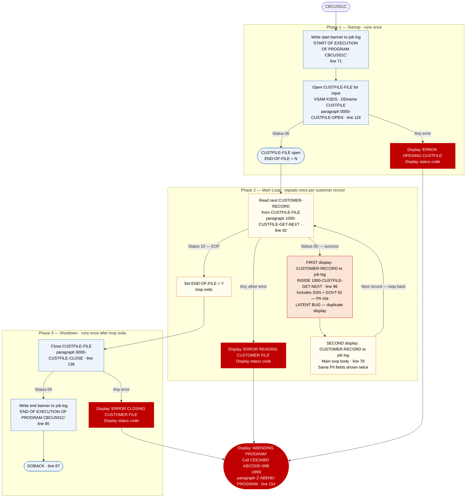

# CBCUS01C — Customer Data File Reader and Printer

```
Application : AWS CardDemo
Source File : CBCUS01C.cbl
Type        : Batch COBOL
Source Banner: Program     : CBCUS01C.CBL
```

This document describes what the program does in plain English. It treats the program as a sequence of data actions — reading rows, logging values, handling errors — and names every file, field, copybook, and external program along the way so a developer can still find each piece in the source. The reader does not need to know COBOL.

---

## 1. Purpose

CBCUS01C reads the **Customer Master File** — an indexed VSAM file identified in the program as `CUSTFILE-FILE`, assigned to the JCL DDname `CUSTFILE` — and prints every customer record it finds to the job log. The Customer Master File is a KSDS (keyed sequential data set) with each record keyed on the 9-digit customer ID (`FD-CUST-ID`), so the program reads it one customer at a time in ascending customer-ID order. No output files are written; all output goes to the job log via `DISPLAY` statements.

The customer record layout — its field names, lengths, and meanings — is defined in copybook `CVCUS01Y`, which provides the group `CUSTOMER-RECORD` and all `CUST-*` fields.

No external programs (apart from `CEE3ABD`) are called. No calculations, lookups, or transformations are performed.

**Note:** Like CBACT03C, this program displays `CUSTOMER-RECORD` **twice** for every record read — once inside the read paragraph `1000-CUSTFILE-GET-NEXT` (line 96) and once in the main loop body (line 78). This double-display is a latent defect (see Migration Note 1).

**Security note:** `CUST-SSN` (social security number) and `CUST-GOVT-ISSUED-ID` are both part of `CUSTOMER-RECORD` and are printed in full to the job log (see Migration Note 5).

---

## 2. Program Flow

The program runs in three phases: **startup** (open the customer file), **per-record processing loop** (read and display each customer record), and **shutdown** (close the file).

### 2.1 Startup

**Step 1 — Write the start banner** *(Procedure Division, line 71).* The message `'START OF EXECUTION OF PROGRAM CBCUS01C'` is written to the job log.

**Step 2 — Open the Customer Master File for reading** *(paragraph `0000-CUSTFILE-OPEN`, line 118).* Opens `CUSTFILE-FILE` for input. Before the open, `APPL-RESULT` is set to `8` as a progress sentinel. If status `'00'` is returned, `APPL-RESULT` is set to `0` (`APPL-AOK`); any other status sets it to `12`. If `APPL-AOK` is not true, the program displays `'ERROR OPENING CUSTFILE'`, calls `Z-DISPLAY-IO-STATUS` to format the status code, then calls `Z-ABEND-PROGRAM` to terminate with `U999`.

Note: this program uses `Z-DISPLAY-IO-STATUS` and `Z-ABEND-PROGRAM` as the names for its utility paragraphs, while other programs in the suite use `9910-DISPLAY-IO-STATUS` and `9999-ABEND-PROGRAM`. The logic inside these paragraphs is identical.

After the open succeeds, `END-OF-FILE` is at its initialised value of `'N'`.

### 2.2 Per-Record Processing Loop

The program loops until `END-OF-FILE` becomes `'Y'`. There is a **redundant inner guard** checking `END-OF-FILE = 'N'` (line 75) — this condition can never be false while the loop is running (see Migration Note 2). The walkthrough below describes one full iteration.

**Step 3 — Read the next customer record** *(paragraph `1000-CUSTFILE-GET-NEXT`, line 92).* Reads from `CUSTFILE-FILE` into `CUSTOMER-RECORD` defined by copybook `CVCUS01Y`. Three outcomes:

- **Status `'00'` — success.** `APPL-RESULT` is set to `0`. **Immediately inside this paragraph, at line 96, the program displays `CUSTOMER-RECORD` to the job log** — this is the first display of the record (including PII/SSN data).
- **Status `'10'` — end-of-file.** `APPL-RESULT` is set to `16` (`APPL-EOF`). `END-OF-FILE` is set to `'Y'`. The loop exits.
- **Any other status.** `APPL-RESULT` is set to `12`. The program displays `'ERROR READING CUSTOMER FILE'`, calls `Z-DISPLAY-IO-STATUS`, and calls `Z-ABEND-PROGRAM`.

**Step 4 — Display the customer record a second time** *(main loop body, line 78).* If `END-OF-FILE` is still `'N'` after the read paragraph returns, `CUSTOMER-RECORD` is displayed again. Every successfully read customer therefore appears **twice** in the job log (see Migration Note 1). The display includes all PII fields.

After step 4, the loop checks `END-OF-FILE`. If still `'N'`, the next iteration begins at step 3. When `'Y'`, the loop exits.

### 2.3 Shutdown

**Step 5 — Close the Customer Master File** *(paragraph `9000-CUSTFILE-CLOSE`, line 136).* Uses the arithmetic-idiom: `ADD 8 TO ZERO GIVING APPL-RESULT` as a sentinel, `SUBTRACT APPL-RESULT FROM APPL-RESULT` on success. On close failure, displays `'ERROR CLOSING CUSTOMER FILE'`, calls `Z-DISPLAY-IO-STATUS`, and calls `Z-ABEND-PROGRAM`.

**Step 6 — Write the end banner and return** *(lines 85–87).* The message `'END OF EXECUTION OF PROGRAM CBCUS01C'` is written to the job log. Control returns via `GOBACK`.

---

## 3. Error Handling

All file errors are fatal. The pattern is: display an error message naming the file and operation, call `Z-DISPLAY-IO-STATUS` to format the two-byte file status, then call `Z-ABEND-PROGRAM`.

### 3.1 Status Decoder — `Z-DISPLAY-IO-STATUS` (line 161)

Logically identical to `9910-DISPLAY-IO-STATUS` in the other programs. Accepts `IO-STATUS`, formats it to four characters, and writes `'FILE STATUS IS: NNNN'` followed by the formatted `IO-STATUS-04` to the job log.

### 3.2 Abend Routine — `Z-ABEND-PROGRAM` (line 154)

Displays `'ABENDING PROGRAM'`, sets `ABCODE` to `999` and `TIMING` to `0`, calls `CEE3ABD`. Job step terminates with `U999`.

---

## 4. Migration Notes

1. **Every successfully read record is displayed twice to the job log.** Inside `1000-CUSTFILE-GET-NEXT` (line 96), `CUSTOMER-RECORD` is displayed immediately on a status-`'00'` read. In the main loop (line 78), the same record is displayed again. This doubles output volume and is a copy-paste defect — identical to the bug in CBACT03C. Java migration should produce exactly one structured log entry per record.

2. **The inner guard `END-OF-FILE = 'N'` is redundant** *(line 75).* While `PERFORM UNTIL END-OF-FILE = 'Y'` is running, `END-OF-FILE` is `'N'` by definition.

3. **Utility paragraphs are named differently from the rest of the suite.** This program uses `Z-ABEND-PROGRAM` and `Z-DISPLAY-IO-STATUS` rather than `9999-ABEND-PROGRAM` and `9910-DISPLAY-IO-STATUS`. The logic is identical; only the names differ. In a Java migration, a common utility class would serve all programs.

4. **The 168-byte FILLER at the end of `CUSTOMER-RECORD` is included in the raw display.** The uninitialized filler bytes will appear as spaces or non-printable characters in the job log output.

5. **PII fields `CUST-SSN` and `CUST-GOVT-ISSUED-ID` are printed in full to the job log** *(lines 78 and 96).* Both the first and second raw `DISPLAY CUSTOMER-RECORD` output include these fields. This violates modern data protection norms (GDPR, PCI-DSS) and must not be replicated during migration. A Java implementation should either omit these fields from logs or mask them.

6. **A single generic abend code (`999`) covers every failure mode.** Open, read, and close errors all produce `U999`.

---

## Appendix A — Files

| Logical Name | DDname | Organization | Recording | Key Field | Direction | Contents |
|---|---|---|---|---|---|---|
| `CUSTFILE-FILE` | `CUSTFILE` | VSAM KSDS — indexed, accessed sequentially | Fixed, 500 bytes | `FD-CUST-ID` PIC 9(09), 9-digit customer ID | Input — read-only, sequential | Customer master. One 500-byte row per customer. The FD defines a two-field skeleton (`FD-CUST-ID` + `FD-CUST-DATA X(491)`); the full named layout comes from copybook `CVCUS01Y`. |

---

## Appendix B — Copybooks and External Programs

### Copybook `CVCUS01Y` (WORKING-STORAGE SECTION, line 45)

Defines `CUSTOMER-RECORD` — the working-storage layout for customer rows read from `CUSTFILE-FILE`. Total record length is 500 bytes (`RECLN 500`). Source file: `CVCUS01Y.cpy`.

| Field | PIC | Bytes | Notes |
|---|---|---|---|
| `CUST-ID` | `9(09)` | 9 | Customer ID; VSAM KSDS primary key |
| `CUST-FIRST-NAME` | `X(25)` | 25 | Customer first name — **PII** |
| `CUST-MIDDLE-NAME` | `X(25)` | 25 | Customer middle name — **PII** |
| `CUST-LAST-NAME` | `X(25)` | 25 | Customer last name — **PII** |
| `CUST-ADDR-LINE-1` | `X(50)` | 50 | Address line 1 — **PII** |
| `CUST-ADDR-LINE-2` | `X(50)` | 50 | Address line 2 — **PII** |
| `CUST-ADDR-LINE-3` | `X(50)` | 50 | Address line 3 — **PII** |
| `CUST-ADDR-STATE-CD` | `X(02)` | 2 | State code |
| `CUST-ADDR-COUNTRY-CD` | `X(03)` | 3 | Country code |
| `CUST-ADDR-ZIP` | `X(10)` | 10 | ZIP code |
| `CUST-PHONE-NUM-1` | `X(15)` | 15 | Primary phone number — **PII** |
| `CUST-PHONE-NUM-2` | `X(15)` | 15 | Secondary phone number — **PII** |
| `CUST-SSN` | `9(09)` | 9 | Social Security Number — **highly sensitive PII; printed raw to job log** |
| `CUST-GOVT-ISSUED-ID` | `X(20)` | 20 | Government-issued ID number — **highly sensitive PII; printed raw to job log** |
| `CUST-DOB-YYYY-MM-DD` | `X(10)` | 10 | Date of birth in YYYY-MM-DD format — **PII** |
| `CUST-EFT-ACCOUNT-ID` | `X(10)` | 10 | EFT (electronic funds transfer) account ID — **sensitive financial data** |
| `CUST-PRI-CARD-HOLDER-IND` | `X(01)` | 1 | Primary cardholder indicator |
| `CUST-FICO-CREDIT-SCORE` | `9(03)` | 3 | FICO credit score |
| `FILLER` | `X(168)` | 168 | Padding to 500-byte record length — included in raw DISPLAY |

All fields are emitted twice per record via group-level `DISPLAY CUSTOMER-RECORD` statements. No field is selectively referenced by program logic.

### External Service `CEE3ABD`

| Item | Detail |
|---|---|
| Type | IBM Language Environment runtime service for forced abend |
| Called from | Paragraph `Z-ABEND-PROGRAM`, line 158 |
| `ABCODE` parameter | `PIC S9(9) BINARY`, set to `999` — produces `U999` |
| `TIMING` parameter | `PIC S9(9) BINARY`, set to `0` — immediate abend |

---

## Appendix C — Hardcoded Literals

| Paragraph | Line | Value | Usage | Classification |
|---|---|---|---|---|
| `PROCEDURE DIVISION` | 71 | `'START OF EXECUTION OF PROGRAM CBCUS01C'` | Job log start banner | Display message |
| `PROCEDURE DIVISION` | 85 | `'END OF EXECUTION OF PROGRAM CBCUS01C'` | Job log end banner | Display message |
| `0000-CUSTFILE-OPEN` | 119 | `8` | Pre-open sentinel in `APPL-RESULT` | Internal convention |
| `0000-CUSTFILE-OPEN` | 122, 124 | `0`, `12` | Result codes for `APPL-RESULT` | Internal convention |
| `0000-CUSTFILE-OPEN` | 129 | `'ERROR OPENING CUSTFILE'` | Error message | Display message |
| `1000-CUSTFILE-GET-NEXT` | 95, 99, 101 | `0`, `16`, `12` | Result codes for `APPL-RESULT` | Internal convention |
| `1000-CUSTFILE-GET-NEXT` | 110 | `'ERROR READING CUSTOMER FILE'` | Error message | Display message |
| `9000-CUSTFILE-CLOSE` | 147 | `'ERROR CLOSING CUSTOMER FILE'` | Error message | Display message |
| `Z-ABEND-PROGRAM` | 157 | `999` | Abend code for `CEE3ABD` | Generic — same code for every failure |
| `Z-DISPLAY-IO-STATUS` | 168, 172 | `'FILE STATUS IS: NNNN'` | Job log status display prefix | Display message |

---

## Appendix D — Internal Working Fields

| Field | PIC | Bytes | Purpose |
|---|---|---|---|
| `CUSTFILE-STATUS` with `CUSTFILE-STAT1`, `CUSTFILE-STAT2` | `X` + `X` | 2 | Two-byte file status code from the VSAM runtime after each operation on `CUSTFILE-FILE` |
| `END-OF-FILE` | `X(01)` | 1 | Loop-control flag — initialised `'N'`; set to `'Y'` when the customer file is exhausted |
| `APPL-RESULT` | `S9(9) COMP` | 4 | Result code: `APPL-AOK` = 0, `APPL-EOF` = 16, 12 = error |
| `IO-STATUS` with `IO-STAT1`, `IO-STAT2` | `X` + `X` | 2 | Copy of failing file status for `Z-DISPLAY-IO-STATUS` |
| `TWO-BYTES-BINARY` / `TWO-BYTES-ALPHA` (`TWO-BYTES-LEFT` + `TWO-BYTES-RIGHT`) | `9(4) BINARY` / `X` + `X` | 4 | Status decoder overlay |
| `IO-STATUS-04` with `IO-STATUS-0401` + `IO-STATUS-0403` | `9` + `999` | 4 | Four-character formatted display of the status code |
| `ABCODE` | `S9(9) BINARY` | 4 | Abend code parameter for `CEE3ABD`; set to `999` |
| `TIMING` | `S9(9) BINARY` | 4 | Timing parameter for `CEE3ABD`; set to `0` |

---

## Appendix E — Execution at a Glance



For an input file of N customers: startup runs once, the loop runs N times producing **2N display lines** to the job log (due to the duplicate display defect), shutdown runs once.

---

*Source: `CBCUS01C.cbl`, CardDemo, Apache 2.0 license. Copybook: `CVCUS01Y.cpy`. External service: `CEE3ABD` (IBM Language Environment). All file names, DDnames, paragraph names, field names, PIC clauses, and literal values in this document are taken directly from the source files.*
