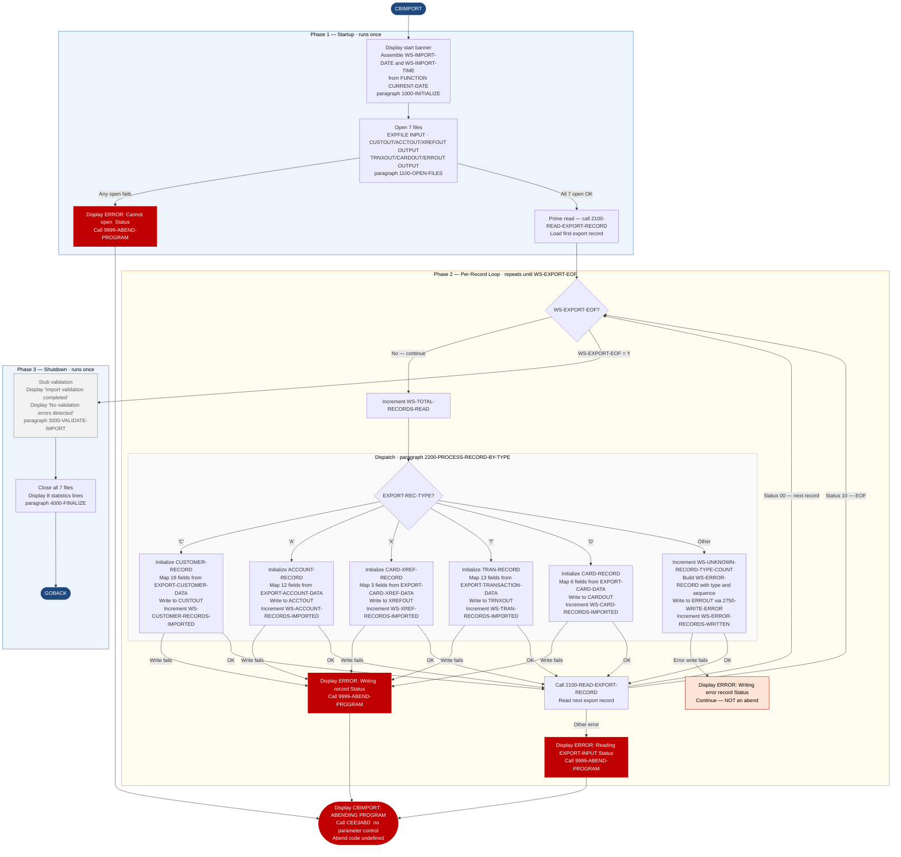

Application : AWS CardDemo
Source File : CBIMPORT.cbl
Type        : Batch COBOL
Source Banner: Program: CBIMPORT.CBL / Application: CardDemo / Type: BATCH COBOL Program / Function: Import Customer Data from Branch Migration Export

# CBIMPORT — Branch Migration Import

This document describes what the program does in plain English. It treats the program as a sequence of data actions and names every file, field, copybook, and literal so a Java developer can use this document instead of re-reading the COBOL source.

---

## 1. Purpose

CBIMPORT reads a single multi-record indexed export file (`EXPORT-INPUT`, DDname `EXPFILE`) produced by a branch migration export process and fans its records into six normalized target files. It is a one-pass, record-type-dispatch batch program: for each record in the export file it reads the one-byte `EXPORT-REC-TYPE` field and routes the record to the correct output writer. It also writes an error record to a seventh file for any record whose type is unrecognized.

The six typed output files are:

- **Customer file** (`CUSTOMER-OUTPUT`, DDname `CUSTOUT`) — one `CUSTOMER-RECORD` per `'C'`-type input record.
- **Account file** (`ACCOUNT-OUTPUT`, DDname `ACCTOUT`) — one `ACCOUNT-RECORD` per `'A'`-type record.
- **Card cross-reference file** (`XREF-OUTPUT`, DDname `XREFOUT`) — one `CARD-XREF-RECORD` per `'X'`-type record.
- **Transaction file** (`TRANSACTION-OUTPUT`, DDname `TRNXOUT`) — one `TRAN-RECORD` per `'T'`-type record.
- **Card file** (`CARD-OUTPUT`, DDname `CARDOUT`) — one `CARD-RECORD` per `'D'`-type record.
- **Error file** (`ERROR-OUTPUT`, DDname `ERROUT`) — one 132-byte `WS-ERROR-RECORD` per unrecognized record type.

No external programs are called. There are no hardcoded business-rule values in the PROCEDURE DIVISION; the only literals are display messages and the string `'Unknown record type encountered'` written to the error output.

The program's `3000-VALIDATE-IMPORT` paragraph displays the message `'CBIMPORT: Import validation completed'` and `'CBIMPORT: No validation errors detected'` unconditionally — **it performs no actual validation**. This is an incomplete stub (see Migration Note 1).

---

## 2. Program Flow

### 2.1 Startup

**Step 1 — Initialize and open files** *(paragraph `1000-INITIALIZE`, line 174).*
The program displays `'CBIMPORT: Starting Customer Data Import'`. It then assembles `WS-IMPORT-DATE` (10 chars, `YYYY-MM-DD`) and `WS-IMPORT-TIME` (8 chars, `HH:MM:SS`) from `FUNCTION CURRENT-DATE` by extracting individual substrings and inserting separator characters. It calls `1100-OPEN-FILES` (line 197) to open all seven files. Each open is followed immediately by a status check: if the 88-level condition for that file's status variable is not `'00'` (`WS-*-OK`), the program displays an error message naming the file and terminates via `9999-ABEND-PROGRAM`. After all opens succeed it displays the import date and time.

**Step 2 — Prime the read** *(paragraph `2000-PROCESS-EXPORT-FILE`, line 248).* Before entering the main loop, the program calls `2100-READ-EXPORT-RECORD` once to load the first record.

### 2.2 Per-Record Loop

The program loops with `PERFORM UNTIL WS-EXPORT-EOF`. `WS-EXPORT-EOF` is the 88-level name (`VALUE '10'`) on `WS-EXPORT-STATUS`. Inside each iteration:

**Step 3 — Increment read counter** *(line 253).* `WS-TOTAL-RECORDS-READ` is incremented by 1.

**Step 4 — Dispatch by record type** *(paragraph `2200-PROCESS-RECORD-BY-TYPE`, line 270).* The program reads `EXPORT-REC-TYPE` (position 1 of `EXPORT-RECORD`) and calls one of five type handlers or the unknown handler:

| `EXPORT-REC-TYPE` | Handler paragraph | Output target |
|---|---|---|
| `'C'` | `2300-PROCESS-CUSTOMER-RECORD` (line 288) | `CUSTOMER-OUTPUT` |
| `'A'` | `2400-PROCESS-ACCOUNT-RECORD` (line 323) | `ACCOUNT-OUTPUT` |
| `'X'` | `2500-PROCESS-XREF-RECORD` (line 351) | `XREF-OUTPUT` |
| `'T'` | `2600-PROCESS-TRAN-RECORD` (line 372) | `TRANSACTION-OUTPUT` |
| `'D'` | `2650-PROCESS-CARD-RECORD` (line 401) | `CARD-OUTPUT` |
| Any other | `2700-PROCESS-UNKNOWN-RECORD` (line 425) | `ERROR-OUTPUT` |

Each handler initializes its working-storage record, maps fields from the appropriate REDEFINES overlay of `EXPORT-RECORD-DATA` (defined in copybook `CVEXPORT`), writes the record, checks the write status, and increments its counter.

**Step 5 — Read next export record** *(paragraph `2100-READ-EXPORT-RECORD`, line 259).* Reads into `EXPORT-RECORD`. If the status is not `'00'` and not `'10'` (EOF), displays `'ERROR: Reading EXPORT-INPUT, Status: '` followed by `WS-EXPORT-STATUS` and abends. EOF is handled implicitly by the loop-exit condition.

**Step 6 — Unknown record type handling** *(paragraph `2700-PROCESS-UNKNOWN-RECORD`, line 425).* Increments `WS-UNKNOWN-RECORD-TYPE-COUNT`, populates `WS-ERROR-RECORD` (timestamp from `FUNCTION CURRENT-DATE`, the unrecognized type byte, the sequence number, and message `'Unknown record type encountered'`), then calls `2750-WRITE-ERROR` (line 437). The error write is the only output operation in the program that does not abend on write failure — it merely displays a message (see Migration Note 2).

### 2.3 Shutdown

**Step 7 — Stub validation** *(paragraph `3000-VALIDATE-IMPORT`, line 449).* Displays two messages. Performs no actual data checks.

**Step 8 — Close all files and display statistics** *(paragraph `4000-FINALIZE`, line 455).* Closes all seven files explicitly (no implicit-close risk). Displays eight statistics lines:
- `'CBIMPORT: Import completed'`
- `'CBIMPORT: Total Records Read: '` + `WS-TOTAL-RECORDS-READ`
- `'CBIMPORT: Customers Imported: '` + `WS-CUSTOMER-RECORDS-IMPORTED`
- `'CBIMPORT: Accounts Imported: '` + `WS-ACCOUNT-RECORDS-IMPORTED`
- `'CBIMPORT: XRefs Imported: '` + `WS-XREF-RECORDS-IMPORTED`
- `'CBIMPORT: Transactions Imported: '` + `WS-TRAN-RECORDS-IMPORTED`
- `'CBIMPORT: Cards Imported: '` + `WS-CARD-RECORDS-IMPORTED`
- `'CBIMPORT: Errors Written: '` + `WS-ERROR-RECORDS-WRITTEN`

After the statistics are displayed, the program issues `GOBACK`.

---

## 3. Error Handling

### 3.1 File Open Errors — paragraph `1100-OPEN-FILES` (line 197)

Each of the seven files is opened with an immediate status check. The first file whose open fails triggers a `DISPLAY` of one of the following messages followed by the raw status bytes, then a call to `9999-ABEND-PROGRAM`:

- `'ERROR: Cannot open EXPORT-INPUT, Status: '`
- `'ERROR: Cannot open CUSTOMER-OUTPUT, Status: '`
- `'ERROR: Cannot open ACCOUNT-OUTPUT, Status: '`
- `'ERROR: Cannot open XREF-OUTPUT, Status: '`
- `'ERROR: Cannot open TRANSACTION-OUTPUT, Status: '`
- `'ERROR: Cannot open CARD-OUTPUT, Status: '`
- `'ERROR: Cannot open ERROR-OUTPUT, Status: '`

### 3.2 Read Error — paragraph `2100-READ-EXPORT-RECORD` (line 259)

Any status other than `'00'` or `'10'` on a read triggers: `'ERROR: Reading EXPORT-INPUT, Status: '` + status bytes, then abend.

### 3.3 Write Errors — type handler paragraphs

Each of the five type handlers (customer, account, xref, transaction, card) checks the write status. On failure:

- `'ERROR: Writing customer record, Status: '` → abend
- `'ERROR: Writing account record, Status: '` → abend
- `'ERROR: Writing xref record, Status: '` → abend
- `'ERROR: Writing transaction record, Status: '` → abend
- `'ERROR: Writing card record, Status: '` → abend

### 3.4 Error File Write — paragraph `2750-WRITE-ERROR` (line 437)

If the write to the error file fails, the program displays `'ERROR: Writing error record, Status: '` + `WS-ERROR-STATUS` but does **not** abend. Processing continues. This is the only non-fatal write failure in the program.

### 3.5 Abend Routine — paragraph `9999-ABEND-PROGRAM` (line 481)

Displays `'CBIMPORT: ABENDING PROGRAM'` then calls `CEE3ABD` with no explicit parameter list. The call has no `USING` clause — `ABCODE` and `TIMING` fields present in similar programs are absent here. This means the abend code is uncontrolled; IBM Language Environment will use whatever values are in registers at the time of the call (see Migration Note 3).

---

## 4. Migration Notes

1. **`3000-VALIDATE-IMPORT` is an empty stub (lines 450–452).** It displays two messages claiming validation was performed but contains no validation logic. Any data integrity checking intended for this phase was never implemented.

2. **Error-file write failures are silently ignored (line 443–444).** All other write errors in this program abend the job. The error-file failure merely displays a message and continues. An operator may believe records are being captured in the error file when they are not.

3. **`9999-ABEND-PROGRAM` calls `CEE3ABD` with no parameters (line 484).** Unlike the exemplar program (CBACT01C) which passes `ABCODE` and `TIMING` explicitly, CBIMPORT uses `CALL 'CEE3ABD'` with no `USING` clause. This will produce an undefined abend code in the job listing, making failure diagnosis harder.

4. **`EXPORT-INPUT` is declared as INDEXED but read sequentially (lines 37–41, 261).** The file has `ORGANIZATION IS INDEXED` with `ACCESS MODE IS SEQUENTIAL`. The KSDS record key is `EXPORT-SEQUENCE-NUM` (PIC 9(9) COMP, bytes 28–31 of `EXPORT-RECORD`). The program reads sequentially in key order — it never performs a random-keyed read. Downstream systems must not depend on record order unless the export file was built in sequence-number order.

5. **`EXPORT-SEQUENCE-NUM` is PIC 9(9) COMP (4 bytes binary) in the export record but PIC 9(7) display in the error record (`ERR-SEQUENCE`, line 157).** When a sequence number exceeds 9,999,999 the display field will truncate the high-order digits silently.

6. **`EXP-ACCT-CURR-BAL` is COMP-3 in the export but `ACCT-CURR-BAL` in `CVACT01Y` is display.** The mapping from `EXP-ACCT-CURR-BAL` (PIC S9(10)V99 COMP-3) to `ACCT-CURR-BAL` (PIC S9(10)V99 display) is a packed-to-display conversion that COBOL handles automatically at runtime, but the Java migration must explicitly unpack the packed-decimal bytes when reading the export file directly. Similarly `EXP-ACCT-CURR-CYC-DEBIT` is PIC S9(10)V99 COMP (binary), which differs from the display format in the target `CVACT01Y`.

7. **`EXP-ACCT-EXPIRAION-DATE` preserves the source typo (line 54 of CVEXPORT.cpy).** The misspelling from `CVACT01Y` is carried into the export layout and must be preserved in any migration that processes the export file format.

8. **No record-count reconciliation is performed.** The program counts records written per type but never compares the total to any control total in the export file or JCL. There is no checksum or hash-total validation.

9. **`WS-IMPORT-DATE` and `WS-IMPORT-TIME` are assembled by byte-slice moves (lines 178–188).** The logic slices `FUNCTION CURRENT-DATE` but the time slices at lines 184–188 extract hours, minutes, and seconds from positions 9–13 of `CURRENT-DATE`, which corresponds to hours (9:2), minutes (11:2), seconds (13:2). This is correct but fragile — the offset arithmetic depends on `CURRENT-DATE` returning a 21-character result (standard), so no bug exists, but the code is hard to read.

10. **All seven files are explicitly closed before `GOBACK` (lines 457–463).** Unlike some programs in this repository, CBIMPORT closes all files explicitly, reducing the risk of undetected flush errors.

---

## Appendix A — Files

| Logical Name | DDname | Organization | Recording | Key Field | Direction | Contents |
|---|---|---|---|---|---|---|
| `EXPORT-INPUT` | `EXPFILE` | INDEXED (KSDS), accessed SEQUENTIAL | FIXED, 500 bytes | `EXPORT-SEQUENCE-NUM` PIC 9(9) COMP | INPUT | Multi-record branch migration export. First byte is record type. Records are read in key-ascending order. |
| `CUSTOMER-OUTPUT` | `CUSTOUT` | SEQUENTIAL | FIXED, 500 bytes | N/A | OUTPUT | Normalized customer records (`CUSTOMER-RECORD`) extracted from type-`'C'` export records. |
| `ACCOUNT-OUTPUT` | `ACCTOUT` | SEQUENTIAL | FIXED, 300 bytes | N/A | OUTPUT | Normalized account records (`ACCOUNT-RECORD`) extracted from type-`'A'` export records. |
| `XREF-OUTPUT` | `XREFOUT` | SEQUENTIAL | FIXED, 50 bytes | N/A | OUTPUT | Card cross-reference records (`CARD-XREF-RECORD`) extracted from type-`'X'` export records. |
| `TRANSACTION-OUTPUT` | `TRNXOUT` | SEQUENTIAL | FIXED, 350 bytes | N/A | OUTPUT | Transaction records (`TRAN-RECORD`) extracted from type-`'T'` export records. |
| `CARD-OUTPUT` | `CARDOUT` | SEQUENTIAL | FIXED, 150 bytes | N/A | OUTPUT | Card records (`CARD-RECORD`) extracted from type-`'D'` export records. |
| `ERROR-OUTPUT` | `ERROUT` | SEQUENTIAL | FIXED, 132 bytes | N/A | OUTPUT | Error records for unrecognized record types. One 132-byte `WS-ERROR-RECORD` per bad record. |

---

## Appendix B — Copybooks and External Programs

### Copybook `CVEXPORT` (WORKING-STORAGE SECTION, line 113)

Defines `EXPORT-RECORD` — the 500-byte flat record read from `EXPFILE`. The first 40 bytes are fixed header fields; bytes 41–500 (`EXPORT-RECORD-DATA`, 460 bytes) are overloaded via five REDEFINES overlays, one per record type.

**Fixed header fields (present in every record):**

| Field | PIC | Bytes | Notes |
|---|---|---|---|
| `EXPORT-REC-TYPE` | `X(1)` | 1 | Record type: `'C'` customer, `'A'` account, `'X'` xref, `'T'` transaction, `'D'` card |
| `EXPORT-TIMESTAMP` | `X(26)` | 26 | Full timestamp string; REDEFINES as `EXPORT-DATE` (X(10)), separator (X(1)), `EXPORT-TIME` (X(15)) |
| `EXPORT-SEQUENCE-NUM` | `9(9) COMP` | 4 | KSDS primary key — binary, 4 bytes on disk |
| `EXPORT-BRANCH-ID` | `X(4)` | 4 | Branch identifier — **never referenced by the program** |
| `EXPORT-REGION-CODE` | `X(5)` | 5 | Region code — **never referenced by the program** |
| `EXPORT-RECORD-DATA` | `X(460)` | 460 | Payload; overloaded via REDEFINES below |

**`EXPORT-CUSTOMER-DATA` REDEFINES (type `'C'`):**

| Field | PIC | Bytes | Notes |
|---|---|---|---|
| `EXP-CUST-ID` | `9(09) COMP` | 4 | Customer ID (binary) |
| `EXP-CUST-FIRST-NAME` | `X(25)` | 25 | |
| `EXP-CUST-MIDDLE-NAME` | `X(25)` | 25 | |
| `EXP-CUST-LAST-NAME` | `X(25)` | 25 | |
| `EXP-CUST-ADDR-LINE(1..3)` | `X(50)` each | 150 | OCCURS 3 TIMES |
| `EXP-CUST-ADDR-STATE-CD` | `X(02)` | 2 | |
| `EXP-CUST-ADDR-COUNTRY-CD` | `X(03)` | 3 | |
| `EXP-CUST-ADDR-ZIP` | `X(10)` | 10 | |
| `EXP-CUST-PHONE-NUM(1..2)` | `X(15)` each | 30 | OCCURS 2 TIMES |
| `EXP-CUST-SSN` | `9(09)` | 9 | Display numeric, 9 bytes |
| `EXP-CUST-GOVT-ISSUED-ID` | `X(20)` | 20 | |
| `EXP-CUST-DOB-YYYY-MM-DD` | `X(10)` | 10 | |
| `EXP-CUST-EFT-ACCOUNT-ID` | `X(10)` | 10 | |
| `EXP-CUST-PRI-CARD-HOLDER-IND` | `X(01)` | 1 | |
| `EXP-CUST-FICO-CREDIT-SCORE` | `9(03) COMP-3` | 2 | **(COMP-3 — use BigDecimal in Java)** |
| FILLER | `X(134)` | 134 | Padding |

**`EXPORT-ACCOUNT-DATA` REDEFINES (type `'A'`):**

| Field | PIC | Bytes | Notes |
|---|---|---|---|
| `EXP-ACCT-ID` | `9(11)` | 11 | Display numeric |
| `EXP-ACCT-ACTIVE-STATUS` | `X(01)` | 1 | |
| `EXP-ACCT-CURR-BAL` | `S9(10)V99 COMP-3` | 7 | **(COMP-3 — use BigDecimal in Java)** |
| `EXP-ACCT-CREDIT-LIMIT` | `S9(10)V99` | 12 | Display signed |
| `EXP-ACCT-CASH-CREDIT-LIMIT` | `S9(10)V99 COMP-3` | 7 | **(COMP-3 — use BigDecimal in Java)** |
| `EXP-ACCT-OPEN-DATE` | `X(10)` | 10 | |
| `EXP-ACCT-EXPIRAION-DATE` | `X(10)` | 10 | Typo preserved — misspelled in source and in `CVACT01Y` |
| `EXP-ACCT-REISSUE-DATE` | `X(10)` | 10 | |
| `EXP-ACCT-CURR-CYC-CREDIT` | `S9(10)V99` | 12 | Display signed |
| `EXP-ACCT-CURR-CYC-DEBIT` | `S9(10)V99 COMP` | 6 | Binary (COMP), not COMP-3; treat as `long` scaled to 2 decimal places |
| `EXP-ACCT-ADDR-ZIP` | `X(10)` | 10 | |
| `EXP-ACCT-GROUP-ID` | `X(10)` | 10 | |
| FILLER | `X(352)` | 352 | Padding |

**`EXPORT-TRANSACTION-DATA` REDEFINES (type `'T'`):**

| Field | PIC | Bytes | Notes |
|---|---|---|---|
| `EXP-TRAN-ID` | `X(16)` | 16 | |
| `EXP-TRAN-TYPE-CD` | `X(02)` | 2 | |
| `EXP-TRAN-CAT-CD` | `9(04)` | 4 | Display numeric |
| `EXP-TRAN-SOURCE` | `X(10)` | 10 | |
| `EXP-TRAN-DESC` | `X(100)` | 100 | |
| `EXP-TRAN-AMT` | `S9(09)V99 COMP-3` | 6 | **(COMP-3 — use BigDecimal in Java)** |
| `EXP-TRAN-MERCHANT-ID` | `9(09) COMP` | 4 | Binary |
| `EXP-TRAN-MERCHANT-NAME` | `X(50)` | 50 | |
| `EXP-TRAN-MERCHANT-CITY` | `X(50)` | 50 | |
| `EXP-TRAN-MERCHANT-ZIP` | `X(10)` | 10 | |
| `EXP-TRAN-CARD-NUM` | `X(16)` | 16 | |
| `EXP-TRAN-ORIG-TS` | `X(26)` | 26 | |
| `EXP-TRAN-PROC-TS` | `X(26)` | 26 | |
| FILLER | `X(140)` | 140 | Padding |

**`EXPORT-CARD-XREF-DATA` REDEFINES (type `'X'`):**

| Field | PIC | Bytes | Notes |
|---|---|---|---|
| `EXP-XREF-CARD-NUM` | `X(16)` | 16 | |
| `EXP-XREF-CUST-ID` | `9(09)` | 9 | Display numeric |
| `EXP-XREF-ACCT-ID` | `9(11) COMP` | 6 | Binary (COMP) |
| FILLER | `X(427)` | 427 | Padding |

**`EXPORT-CARD-DATA` REDEFINES (type `'D'`):**

| Field | PIC | Bytes | Notes |
|---|---|---|---|
| `EXP-CARD-NUM` | `X(16)` | 16 | |
| `EXP-CARD-ACCT-ID` | `9(11) COMP` | 6 | Binary (COMP) |
| `EXP-CARD-CVV-CD` | `9(03) COMP` | 2 | Binary |
| `EXP-CARD-EMBOSSED-NAME` | `X(50)` | 50 | |
| `EXP-CARD-EXPIRAION-DATE` | `X(10)` | 10 | Typo preserved |
| `EXP-CARD-ACTIVE-STATUS` | `X(01)` | 1 | |
| FILLER | `X(373)` | 373 | Padding |

**Unused header fields:** `EXPORT-BRANCH-ID` and `EXPORT-REGION-CODE` are present in every input record but are never referenced by any handler paragraph in this program.

### Copybook `CVCUS01Y` (FILE SECTION, FD `CUSTOMER-OUTPUT`, line 84)

Defines `CUSTOMER-RECORD`. All fields are mapped from export type-`'C'` records.

| Field | PIC | Bytes | Notes |
|---|---|---|---|
| `CUST-ID` | `9(09)` | 9 | Display (target); source `EXP-CUST-ID` is COMP |
| `CUST-FIRST-NAME` | `X(25)` | 25 | |
| `CUST-MIDDLE-NAME` | `X(25)` | 25 | |
| `CUST-LAST-NAME` | `X(25)` | 25 | |
| `CUST-ADDR-LINE-1` | `X(50)` | 50 | |
| `CUST-ADDR-LINE-2` | `X(50)` | 50 | |
| `CUST-ADDR-LINE-3` | `X(50)` | 50 | |
| `CUST-ADDR-STATE-CD` | `X(02)` | 2 | |
| `CUST-ADDR-COUNTRY-CD` | `X(03)` | 3 | |
| `CUST-ADDR-ZIP` | `X(10)` | 10 | |
| `CUST-PHONE-NUM-1` | `X(15)` | 15 | |
| `CUST-PHONE-NUM-2` | `X(15)` | 15 | |
| `CUST-SSN` | `9(09)` | 9 | |
| `CUST-GOVT-ISSUED-ID` | `X(20)` | 20 | |
| `CUST-DOB-YYYY-MM-DD` | `X(10)` | 10 | |
| `CUST-EFT-ACCOUNT-ID` | `X(10)` | 10 | |
| `CUST-PRI-CARD-HOLDER-IND` | `X(01)` | 1 | |
| `CUST-FICO-CREDIT-SCORE` | `9(03)` | 3 | Display in target; COMP-3 in export source |
| FILLER | `X(168)` | 168 | Padding to 500 bytes |

### Copybook `CVACT01Y` (FILE SECTION, FD `ACCOUNT-OUTPUT`, line 89)

Defines `ACCOUNT-RECORD`. See Appendix B of BIZ-CBACT01C.md for the full field table. `ACCT-ADDR-ZIP` is mapped from the export (`EXP-ACCT-ADDR-ZIP`), unlike in CBACT01C where it was never used. All balance and limit fields are display-signed in the target record layout.

### Copybook `CVACT03Y` (FILE SECTION, FD `XREF-OUTPUT`, line 94)

Defines `CARD-XREF-RECORD`.

| Field | PIC | Bytes | Notes |
|---|---|---|---|
| `XREF-CARD-NUM` | `X(16)` | 16 | |
| `XREF-CUST-ID` | `9(09)` | 9 | Display; source `EXP-XREF-CUST-ID` also display |
| `XREF-ACCT-ID` | `9(11)` | 11 | Display; source `EXP-XREF-ACCT-ID` is COMP (binary) — type conversion |
| FILLER | `X(14)` | 14 | Padding to 50 bytes |

### Copybook `CVTRA05Y` (FILE SECTION, FD `TRANSACTION-OUTPUT`, line 99)

Defines `TRAN-RECORD`.

| Field | PIC | Bytes | Notes |
|---|---|---|---|
| `TRAN-ID` | `X(16)` | 16 | |
| `TRAN-TYPE-CD` | `X(02)` | 2 | |
| `TRAN-CAT-CD` | `9(04)` | 4 | Display numeric |
| `TRAN-SOURCE` | `X(10)` | 10 | |
| `TRAN-DESC` | `X(100)` | 100 | |
| `TRAN-AMT` | `S9(09)V99` | 11 | Display signed; source is COMP-3 |
| `TRAN-MERCHANT-ID` | `9(09)` | 9 | Display; source is COMP (binary) |
| `TRAN-MERCHANT-NAME` | `X(50)` | 50 | |
| `TRAN-MERCHANT-CITY` | `X(50)` | 50 | |
| `TRAN-MERCHANT-ZIP` | `X(10)` | 10 | |
| `TRAN-CARD-NUM` | `X(16)` | 16 | |
| `TRAN-ORIG-TS` | `X(26)` | 26 | |
| `TRAN-PROC-TS` | `X(26)` | 26 | |
| FILLER | `X(20)` | 20 | Padding to 350 bytes |

### Copybook `CVACT02Y` (FILE SECTION, FD `CARD-OUTPUT`, line 104)

Defines `CARD-RECORD`.

| Field | PIC | Bytes | Notes |
|---|---|---|---|
| `CARD-NUM` | `X(16)` | 16 | |
| `CARD-ACCT-ID` | `9(11)` | 11 | Display; source `EXP-CARD-ACCT-ID` is COMP |
| `CARD-CVV-CD` | `9(03)` | 3 | Display; source is COMP |
| `CARD-EMBOSSED-NAME` | `X(50)` | 50 | |
| `CARD-EXPIRAION-DATE` | `X(10)` | 10 | Typo preserved |
| `CARD-ACTIVE-STATUS` | `X(01)` | 1 | |
| FILLER | `X(59)` | 59 | Padding to 150 bytes |

### External Program `CEE3ABD`

Called from `9999-ABEND-PROGRAM` (line 484) with no `USING` parameters. Forces a job abend. Abend code is uncontrolled.

---

## Appendix C — Hardcoded Literals

| Paragraph | Line | Value | Usage | Classification |
|---|---|---|---|---|
| `1000-INITIALIZE` | 176 | `'CBIMPORT: Starting Customer Data Import'` | Start banner | Display message |
| `1000-INITIALIZE` | 192 | `'CBIMPORT: Import Date: '` | Date display | Display message |
| `1000-INITIALIZE` | 193 | `'CBIMPORT: Import Time: '` | Time display | Display message |
| `1100-OPEN-FILES` | 200 | `'ERROR: Cannot open EXPORT-INPUT, Status: '` | Error message | Display message |
| `1100-OPEN-FILES` | 207 | `'ERROR: Cannot open CUSTOMER-OUTPUT, Status: '` | Error message | Display message |
| `1100-OPEN-FILES` | 214 | `'ERROR: Cannot open ACCOUNT-OUTPUT, Status: '` | Error message | Display message |
| `1100-OPEN-FILES` | 221 | `'ERROR: Cannot open XREF-OUTPUT, Status: '` | Error message | Display message |
| `1100-OPEN-FILES` | 228 | `'ERROR: Cannot open TRANSACTION-OUTPUT, Status: '` | Error message | Display message |
| `1100-OPEN-FILES` | 235 | `'ERROR: Cannot open CARD-OUTPUT, Status: '` | Error message | Display message |
| `1100-OPEN-FILES` | 242 | `'ERROR: Cannot open ERROR-OUTPUT, Status: '` | Error message | Display message |
| `2100-READ-EXPORT-RECORD` | 264 | `'ERROR: Reading EXPORT-INPUT, Status: '` | Error message | Display message |
| Various write paragraphs | 315–420 | `'ERROR: Writing customer/account/xref/transaction/card record, Status: '` | Error messages | Display messages |
| `2700-PROCESS-UNKNOWN-RECORD` | 432 | `'Unknown record type encountered'` | Error record message | System constant |
| `3000-VALIDATE-IMPORT` | 451 | `'CBIMPORT: Import validation completed'` | Stub validation message | Display message |
| `3000-VALIDATE-IMPORT` | 452 | `'CBIMPORT: No validation errors detected'` | Stub validation message | Display message |
| `4000-FINALIZE` | 465–478 | `'CBIMPORT: Import completed'` etc. | Statistics messages | Display messages |
| `9999-ABEND-PROGRAM` | 483 | `'CBIMPORT: ABENDING PROGRAM'` | Abend banner | Display message |

---

## Appendix D — Internal Working Fields

| Field | PIC | Bytes | Purpose |
|---|---|---|---|
| `WS-IMPORT-DATE` | `X(10)` | 10 | Import run date assembled as `YYYY-MM-DD` from `FUNCTION CURRENT-DATE` |
| `WS-IMPORT-TIME` | `X(08)` | 8 | Import run time assembled as `HH:MM:SS` |
| `WS-TOTAL-RECORDS-READ` | `9(09)` | 9 | Count of all records read from `EXPFILE` |
| `WS-CUSTOMER-RECORDS-IMPORTED` | `9(09)` | 9 | Count of type-`'C'` records written |
| `WS-ACCOUNT-RECORDS-IMPORTED` | `9(09)` | 9 | Count of type-`'A'` records written |
| `WS-XREF-RECORDS-IMPORTED` | `9(09)` | 9 | Count of type-`'X'` records written |
| `WS-TRAN-RECORDS-IMPORTED` | `9(09)` | 9 | Count of type-`'T'` records written |
| `WS-CARD-RECORDS-IMPORTED` | `9(09)` | 9 | Count of type-`'D'` records written |
| `WS-ERROR-RECORDS-WRITTEN` | `9(09)` | 9 | Count of error records written |
| `WS-UNKNOWN-RECORD-TYPE-COUNT` | `9(09)` | 9 | Count of unrecognized record types encountered |
| `WS-EXPORT-STATUS` | `X(02)` | 2 | File status for `EXPORT-INPUT`; 88s: `WS-EXPORT-EOF` (`'10'`), `WS-EXPORT-OK` (`'00'`) |
| `WS-CUSTOMER-STATUS` | `X(02)` | 2 | File status for `CUSTOMER-OUTPUT`; 88: `WS-CUSTOMER-OK` (`'00'`) |
| `WS-ACCOUNT-STATUS` | `X(02)` | 2 | File status for `ACCOUNT-OUTPUT`; 88: `WS-ACCOUNT-OK` (`'00'`) |
| `WS-XREF-STATUS` | `X(02)` | 2 | File status for `XREF-OUTPUT`; 88: `WS-XREF-OK` (`'00'`) |
| `WS-TRANSACTION-STATUS` | `X(02)` | 2 | File status for `TRANSACTION-OUTPUT`; 88: `WS-TRANSACTION-OK` (`'00'`) |
| `WS-CARD-STATUS` | `X(02)` | 2 | File status for `CARD-OUTPUT`; 88: `WS-CARD-OK` (`'00'`) |
| `WS-ERROR-STATUS` | `X(02)` | 2 | File status for `ERROR-OUTPUT`; 88: `WS-ERROR-OK` (`'00'`) |
| `WS-ERROR-RECORD` | Group, 132 bytes | 132 | Error record: `ERR-TIMESTAMP` X(26), pipe X(1), `ERR-RECORD-TYPE` X(1), pipe X(1), `ERR-SEQUENCE` 9(7), pipe X(1), `ERR-MESSAGE` X(50), FILLER X(43) |

---

## Appendix E — Execution at a Glance

For an input file of N records: startup runs once, the loop runs N times writing records to one of six outputs, shutdown runs once.

---

*Source: `CBIMPORT.cbl`, CardDemo, Apache 2.0 license. Copybooks: `CVEXPORT.cpy`, `CVCUS01Y.cpy`, `CVACT01Y.cpy`, `CVACT03Y.cpy`, `CVTRA05Y.cpy`, `CVACT02Y.cpy`. External programs: `CEE3ABD` (IBM Language Environment). Version tag: CardDemo_v2.0-44-gb6e9c27-254 Date: 2025-10-16 14:07:18 CDT.*
