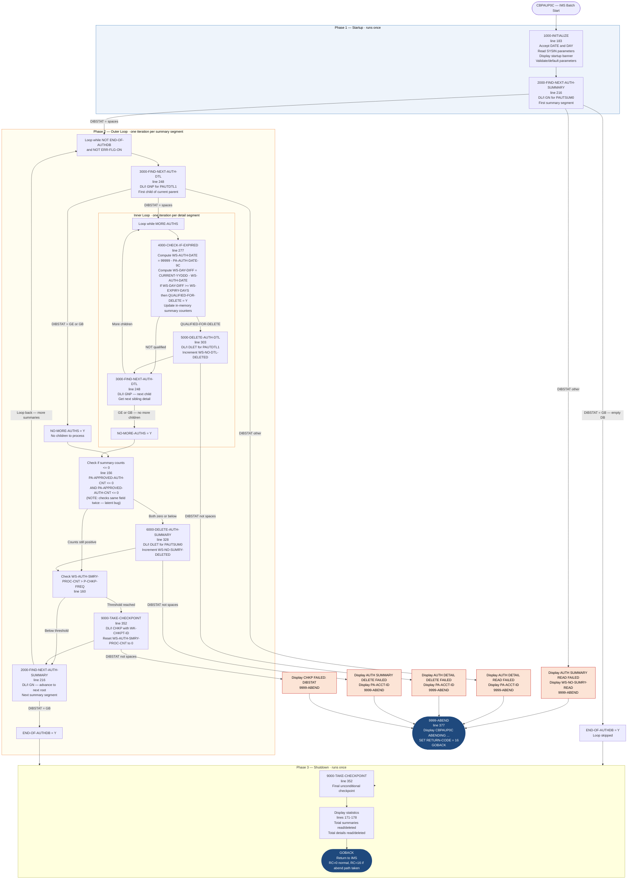

# CBPAUP0C — Pending Authorization Purge

```
Application : AWS CardDemo
Source File : CBPAUP0C.cbl
Type        : Batch COBOL IMS Program
Source Banner: Program : CBPAUP0C.CBL / Application : CardDemo - Authorization Module / Type : BATCH COBOL IMS Program / Function : Delete Expired Pending Authoriation Messages
```

This document describes what the program does in plain English. It treats the program as a sequence of data actions and names every file, field, copybook, and external service so a developer can trust this document instead of re-reading the COBOL source.

---

## 1. Purpose

CBPAUP0C is an IMS batch program that purges stale records from an IMS hierarchical database containing **pending authorization messages** for credit card transactions. The program operates against a database whose PSB (Program Specification Block) is named `PSBPAUTB` and whose PCB (Program Control Block) number is 2 (`PAUT-PCB-NUM = +2`).

The database has two segment types in a parent-child hierarchy:

- **PAUTSUM0** — the root segment, one per account, holding a summary of all pending authorizations for that account (copybook `CIPAUSMY`).
- **PAUTDTL1** — a child segment, one per individual authorization event, holding the full authorization detail (copybook `CIPAUDTY`).

The program reads the program's parameters from the SYSIN stream to determine how many days old an authorization must be before it qualifies for deletion. It then walks every summary segment in the database, examines each child detail segment beneath it, and deletes any detail that has aged beyond the expiry threshold. After all children are processed, if the summary's approved and declined counts have both dropped to zero (or below), the summary segment itself is also deleted.

The program writes **nothing to any sequential VSAM or flat file**. All I/O is against the IMS database via DL/I calls. Run-time statistics (total summaries read, summaries deleted, details read, details deleted) are displayed to the job log at the end of execution.

**External programs called:** none beyond the IMS DL/I interface, which is invoked via `EXEC DLI` statements (not a CALL). The program does not call `CEE3ABD` — its abend routine sets `RETURN-CODE` to 16 and issues `GOBACK`.

**Note on hardcoded defaults:** If the `P-EXPIRY-DAYS` parameter is non-numeric, the program defaults to `5` days (line 199). If `P-CHKP-FREQ` or `P-CHKP-DIS-FREQ` are blank or zero, they default to `5` and `10` respectively (lines 202, 205). These are default fallbacks, not business-policy constants.

---

## 2. Program Flow

### 2.1 Startup

**Step 1 — Initialization** *(paragraph `1000-INITIALIZE`, line 183).*
The program accepts today's date in six-digit format (`YYMMDD`) into `CURRENT-DATE` and today's Julian date in five-digit format (`YYDDD`) into `CURRENT-YYDDD`. It then reads the SYSIN input stream into `PRM-INFO`, which contains four parameters: `P-EXPIRY-DAYS` (2 digits), `P-CHKP-FREQ` (5 characters), `P-CHKP-DIS-FREQ` (5 characters), and `P-DEBUG-FLAG` (1 character, `'Y'` to enable debug logging). Each parameter is validated and defaulted if absent or non-numeric. The startup banner `'STARTING PROGRAM CBPAUP0C::'` and the received parameters are displayed to the job log.

**Step 2 — Read the first auth summary** *(paragraph `2000-FIND-NEXT-AUTH-SUMMARY`, line 216).* A DL/I `GN` (Get Next) call retrieves the first `PAUTSUM0` root segment into `PENDING-AUTH-SUMMARY`. The DL/I status code is inspected via `DIBSTAT`:

| DIBSTAT value | Action |
|---|---|
| Spaces (success) | Sets `NOT-END-OF-AUTHDB`, increments `WS-NO-SUMRY-READ` and `WS-AUTH-SMRY-PROC-CNT`, saves `PA-ACCT-ID` to `WS-CURR-APP-ID` |
| `'GB'` (end of database) | Sets `END-OF-AUTHDB` — loop will not execute |
| Anything else | Displays error and calls `9999-ABEND` |

### 2.2 Per-Authorization-Summary Loop

The outer loop continues until `ERR-FLG-ON` is true or `END-OF-AUTHDB` is true. For each summary segment the following steps are performed:

**Step 3 — Read the first child detail for this summary** *(paragraph `3000-FIND-NEXT-AUTH-DTL`, line 248).* A DL/I `GNP` (Get Next within Parent) call retrieves the first `PAUTDTL1` child segment for the current parent into `PENDING-AUTH-DETAILS`.

| DIBSTAT value | Action |
|---|---|
| Spaces (success) | Sets `MORE-AUTHS`, increments `WS-NO-DTL-READ` |
| `'GE'` (segment not found) or `'GB'` (end of DB) | Sets `NO-MORE-AUTHS` — inner loop will not execute |
| Anything else | Displays error, account ID, records read count, and calls `9999-ABEND` |

**Step 4 — Inner loop: process each child detail** *(lines 146–154).* While `MORE-AUTHS` is true:

**Step 4a — Check expiry** *(paragraph `4000-CHECK-IF-EXPIRED`, line 277).* Computes `WS-AUTH-DATE = 99999 - PA-AUTH-DATE-9C`. This reverses the IMS storage convention where dates are stored as complement values (the smaller the stored number, the newer the date). Then computes `WS-DAY-DIFF = CURRENT-YYDDD - WS-AUTH-DATE`. If `WS-DAY-DIFF >= WS-EXPIRY-DAYS`, the record qualifies for deletion.

When qualified for deletion, the program also updates the in-memory summary counters:
- If `PA-AUTH-RESP-CODE = '00'` (approved): subtracts 1 from `PA-APPROVED-AUTH-CNT` and subtracts `PA-APPROVED-AMT` from `PA-APPROVED-AUTH-AMT`.
- Otherwise (declined/other): subtracts 1 from `PA-DECLINED-AUTH-CNT` and subtracts `PA-TRANSACTION-AMT` from `PA-DECLINED-AUTH-AMT`.

**Step 4b — Delete the detail if qualified** *(paragraph `5000-DELETE-AUTH-DTL`, line 303).* If `QUALIFIED-FOR-DELETE` is true, issues a DL/I `DLET` call for segment `PAUTDTL1`. On success (`DIBSTAT = SPACES`), increments `WS-NO-DTL-DELETED`. On failure, displays the status and account ID, then abends.

**Step 4c — Read next child detail** *(paragraph `3000-FIND-NEXT-AUTH-DTL`, line 248 again).* The same read paragraph is called again to advance to the next child.

**Step 5 — Conditionally delete the summary** *(paragraph `6000-DELETE-AUTH-SUMMARY`, line 328).* After all children are processed, if `PA-APPROVED-AUTH-CNT <= 0 AND PA-APPROVED-AUTH-CNT <= 0` (see Migration Note 1 — this condition checks the same field twice due to a copy-paste bug), the summary root segment is deleted via DL/I `DLET` against `PAUTSUM0`. On success, increments `WS-NO-SUMRY-DELETED`. On failure, abends.

**Step 6 — Checkpoint** *(paragraph `9000-TAKE-CHECKPOINT`, line 352).* If `WS-AUTH-SMRY-PROC-CNT > P-CHKP-FREQ`, a DL/I `CHKP` call is issued with checkpoint ID `WK-CHKPT-ID` (format `'RMAD' + 4-digit counter`). After a successful checkpoint, `WS-AUTH-SMRY-PROC-CNT` is reset to 0. Every `P-CHKP-DIS-FREQ` checkpoints, the message `'CHKP SUCCESS: AUTH COUNT - ' WS-NO-SUMRY-READ ', APP ID - ' WS-CURR-APP-ID` is displayed. On checkpoint failure, displays the DIBSTAT value and abends.

**Step 7 — Read next summary** *(paragraph `2000-FIND-NEXT-AUTH-SUMMARY`, line 216 again).* Advances to the next root segment and the outer loop repeats.

### 2.3 Shutdown

**Step 8 — Final checkpoint** *(paragraph `9000-TAKE-CHECKPOINT`, line 352).* A final checkpoint is taken unconditionally after the loop exits.

**Step 9 — Display statistics** *(lines 171–178).* The following summary is displayed:
```
 
*-------------------------------------*
# TOTAL SUMMARY READ  :<WS-NO-SUMRY-READ>
# SUMMARY REC DELETED :<WS-NO-SUMRY-DELETED>
# TOTAL DETAILS READ  :<WS-NO-DTL-READ>
# DETAILS REC DELETED :<WS-NO-DTL-DELETED>
*-------------------------------------*
 
```

**Step 10 — GOBACK** *(line 180).* The program returns normally. No explicit database close is needed; IMS releases resources when the PSB is unscheduled.

---

## 3. Error Handling

### 3.1 DL/I GN Error — in `2000-FIND-NEXT-AUTH-SUMMARY` (line 237)

Triggered when `DIBSTAT` contains any value other than spaces or `'GB'` after a `GN` call for segment `PAUTSUM0`. Displays:
```
AUTH SUMMARY READ FAILED  :<DIBSTAT>
SUMMARY READ BEFORE ABEND :<WS-NO-SUMRY-READ>
```
Then performs `9999-ABEND`.

### 3.2 DL/I GNP Error — in `3000-FIND-NEXT-AUTH-DTL` (line 267)

Triggered when `DIBSTAT` contains any value other than spaces, `'GE'`, or `'GB'` after a `GNP` call for segment `PAUTDTL1`. Displays:
```
AUTH DETAIL READ FAILED  :<DIBSTAT>
SUMMARY AUTH APP ID      :<PA-ACCT-ID>
DETAIL READ BEFORE ABEND :<WS-NO-DTL-READ>
```
Then performs `9999-ABEND`.

### 3.3 DL/I DLET Detail Error — in `5000-DELETE-AUTH-DTL` (line 318)

Triggered when `DIBSTAT` is not spaces after a `DLET` for `PAUTDTL1`. Displays:
```
AUTH DETAIL DELETE FAILED :<DIBSTAT>
AUTH APP ID               :<PA-ACCT-ID>
```
Then performs `9999-ABEND`.

### 3.4 DL/I DLET Summary Error — in `6000-DELETE-AUTH-SUMMARY` (line 343)

Triggered when `DIBSTAT` is not spaces after a `DLET` for `PAUTSUM0`. Displays:
```
AUTH SUMMARY DELETE FAILED :<PA-ACCT-ID>
AUTH APP ID                :<PA-ACCT-ID>
```
Note: line 344 displays `'AUTH SUMMARY DELETE FAILED :'` followed by `DIBSTAT`; line 345 displays `'AUTH APP ID                :'` followed by `PA-ACCT-ID`. Then performs `9999-ABEND`.

### 3.5 DL/I CHKP Error — in `9000-TAKE-CHECKPOINT` (line 366)

Triggered when `DIBSTAT` is not spaces after a `CHKP` call. Displays:
```
CHKP FAILED: DIBSTAT - <DIBSTAT>, REC COUNT - <WS-NO-SUMRY-READ>, APP ID - <WS-CURR-APP-ID>
```
Then performs `9999-ABEND`.

### 3.6 Abend Routine — `9999-ABEND` (line 377)

Unlike other CardDemo programs that call `CEE3ABD`, this program uses a softer abend: it displays `'CBPAUP0C ABENDING ...'`, sets `RETURN-CODE` to 16, and issues `GOBACK`. This produces a job-step condition code of 16 rather than a U-abend. The IMS scheduler will still handle PSB cleanup on return.

---

## 4. Migration Notes

1. **The summary-deletion condition checks `PA-APPROVED-AUTH-CNT` twice instead of also checking `PA-DECLINED-AUTH-CNT` (line 156).** The source reads `IF PA-APPROVED-AUTH-CNT <= 0 AND PA-APPROVED-AUTH-CNT <= 0`. The second half should be `PA-DECLINED-AUTH-CNT <= 0`. As written, a summary is deleted even if it still has active declined authorizations. This is a latent correctness defect.

2. **The word "Authoriation" in the source banner is a typo** (line 5 of CBPAUP0C.cbl). The header comment reads `Function : Delete Expired Pending Authoriation Messages` — missing the letter `z`. Preserve exact spelling in migration documentation.

3. **`PA-ACCT-ID` is PIC `S9(11) COMP-3` (packed decimal)** in `CIPAUSMY`. Any Java code reading or displaying this field must use `BigDecimal` and unpack from a 6-byte packed decimal representation (COMP-3 — use BigDecimal in Java).

4. **Several `CIPAUSMY` fields are never read or used by this program.** The fields `PA-CUST-ID`, `PA-AUTH-STATUS`, `PA-ACCOUNT-STATUS` (5-occurrence array), `PA-CREDIT-LIMIT`, `PA-CASH-LIMIT`, `PA-CREDIT-BALANCE`, `PA-CASH-BALANCE`, and the 34-byte `FILLER` are present in every summary segment read but are never referenced in the procedure division.

5. **Several `CIPAUDTY` fields are never read or used.** Only `PA-AUTHORIZATION-KEY` (for expiry calculation), `PA-AUTH-RESP-CODE` (to classify approved vs. declined), `PA-TRANSACTION-AMT`, and `PA-APPROVED-AMT` are used. All other fields — `PA-AUTH-ORIG-DATE`, `PA-AUTH-ORIG-TIME`, `PA-CARD-NUM`, `PA-AUTH-TYPE`, `PA-CARD-EXPIRY-DATE`, `PA-MESSAGE-TYPE`, `PA-MESSAGE-SOURCE`, `PA-AUTH-ID-CODE`, `PA-AUTH-RESP-REASON`, `PA-PROCESSING-CODE`, `PA-MERCHANT-CATAGORY-CODE`, `PA-ACQR-COUNTRY-CODE`, `PA-POS-ENTRY-MODE`, `PA-MERCHANT-ID`, `PA-MERCHANT-NAME`, `PA-MERCHANT-CITY`, `PA-MERCHANT-STATE`, `PA-MERCHANT-ZIP`, `PA-TRANSACTION-ID`, `PA-MATCH-STATUS`, `PA-AUTH-FRAUD`, `PA-FRAUD-RPT-DATE` — are populated from the database but never examined.

6. **The date expiry algorithm uses Julian dates (`YYDDD` format) and the IMS complement convention.** `PA-AUTH-DATE-9C` is stored as `99999 - YYDDD`. The reversal `WS-AUTH-DATE = 99999 - PA-AUTH-DATE-9C` recovers the original Julian date. `WS-DAY-DIFF` is then a simple subtraction of two YYDDD values. This arithmetic is correct within a single century but will produce incorrect results when `CURRENT-YYDDD` rolls over a year boundary (e.g., day 001 of a new year compared to day 365 of the prior year — the diff will be negative, and the record will never be deleted). This is a latent year-boundary bug.

7. **`CURRENT-DATE` (PIC `9(06)`, YYMMDD format) is accepted at startup but never subsequently used.** Only `CURRENT-YYDDD` is used in the expiry calculation. `CURRENT-DATE` is a dead variable.

8. **`WS-TOT-REC-WRITTEN` (PIC `S9(8) COMP`) is defined in working storage (line 53) but never incremented or referenced anywhere in the procedure division.** This field is a dead variable.

9. **`WS-ERR-FLG` / `ERR-FLG-ON` / `ERR-FLG-OFF` are defined (line 59) but never set to `'Y'` by the program.** The outer loop condition `PERFORM UNTIL ERR-FLG-ON OR END-OF-AUTHDB` therefore depends only on `END-OF-AUTHDB`. The error-flag logic is incomplete or left over from a prior version.

10. **`WS-IMS-PSB-SCHD-FLG` (line 93) and `IMS-RETURN-CODE` with all its 88-levels (line 83) are defined but never used.** These suggest a more elaborate IMS scheduling protocol was planned but never implemented.

11. **The program does not use `PAUTBPCB.CPY` directly.** The PCB mask is accessed via `PCB-OFFSET` / `PAUT-PCB-NUM = +2` with the PCB address provided by IMS through the `PROCEDURE DIVISION USING IO-PCB-MASK PGM-PCB-MASK` linkage. The `PAUTBPCB.CPY` copybook (which defines the full PCB mask structure) is not copied in the source, meaning PCB fields like `PAUT-PCB-STATUS` are not directly accessible to this program.

12. **`DIBSTAT` is a DL/I interface variable provided by the IMS run-time.** It is not defined in this program's working storage; it is supplied by the IMS environment when `EXEC DLI` statements execute. In a Java migration, its equivalent is the return/status value from each JMS or IMS client call.

---

## Appendix A — Files

| Logical Name | DDname | Organization | Recording | Key Field | Direction | Contents |
|---|---|---|---|---|---|---|
| `PENDING-AUTH-SUMMARY` (IMS segment) | IMS DB via PSB `PSBPAUTB`, PCB 2 | IMS hierarchical database | Segment `PAUTSUM0` | `PA-ACCT-ID` (account number) | I-O (GN read + conditional DLET) | Summary root segment: one per account with approved/declined counts and amounts. Layout defined by `CIPAUSMY`. |
| `PENDING-AUTH-DETAILS` (IMS segment) | IMS DB via PSB `PSBPAUTB`, PCB 2 | IMS hierarchical database | Segment `PAUTDTL1` | `PA-AUTHORIZATION-KEY` (date+time complement) | I-O (GNP read + conditional DLET) | Detail child segment: one per individual authorization event. Layout defined by `CIPAUDTY`. |
| SYSIN | SYSIN | Sequential (system input stream) | N/A | N/A | Input | Program parameters: expiry days, checkpoint frequency, display frequency, debug flag. |

---

## Appendix B — Copybooks and External Programs

### Copybook `CIPAUSMY` (WORKING-STORAGE, line 117 — `01 PENDING-AUTH-SUMMARY`)

Defines the IMS root segment `PAUTSUM0`. Source file: `CIPAUSMY.cpy`.

| Field | PIC | Bytes | Notes |
|---|---|---|---|
| `PA-ACCT-ID` | `S9(11) COMP-3` | 6 | Account number. COMP-3 — use BigDecimal in Java. |
| `PA-CUST-ID` | `9(09)` | 9 | Customer ID. **Never referenced by this program.** |
| `PA-AUTH-STATUS` | `X(01)` | 1 | Authorization status flag. **Never referenced by this program.** |
| `PA-ACCOUNT-STATUS` | `X(02) OCCURS 5 TIMES` | 10 | Array of account status codes. **Never referenced by this program.** |
| `PA-CREDIT-LIMIT` | `S9(09)V99 COMP-3` | 6 | Credit limit. COMP-3 — use BigDecimal in Java. **Never referenced by this program.** |
| `PA-CASH-LIMIT` | `S9(09)V99 COMP-3` | 6 | Cash advance limit. COMP-3 — use BigDecimal in Java. **Never referenced by this program.** |
| `PA-CREDIT-BALANCE` | `S9(09)V99 COMP-3` | 6 | Current credit balance. COMP-3 — use BigDecimal in Java. **Never referenced by this program.** |
| `PA-CASH-BALANCE` | `S9(09)V99 COMP-3` | 6 | Current cash balance. COMP-3 — use BigDecimal in Java. **Never referenced by this program.** |
| `PA-APPROVED-AUTH-CNT` | `S9(04) COMP` | 2 | Count of approved pending authorizations. Read and modified in `4000-CHECK-IF-EXPIRED`. |
| `PA-DECLINED-AUTH-CNT` | `S9(04) COMP` | 2 | Count of declined pending authorizations. Read and modified in `4000-CHECK-IF-EXPIRED`. |
| `PA-APPROVED-AUTH-AMT` | `S9(09)V99 COMP-3` | 6 | Total approved amounts. COMP-3 — use BigDecimal in Java. Modified in `4000-CHECK-IF-EXPIRED`. |
| `PA-DECLINED-AUTH-AMT` | `S9(09)V99 COMP-3` | 6 | Total declined amounts. COMP-3 — use BigDecimal in Java. Modified in `4000-CHECK-IF-EXPIRED`. |
| `FILLER` | `X(34)` | 34 | Padding. Never referenced. |

### Copybook `CIPAUDTY` (WORKING-STORAGE, line 120 — `01 PENDING-AUTH-DETAILS`)

Defines the IMS child segment `PAUTDTL1`. Source file: `CIPAUDTY.cpy`.

| Field | PIC | Bytes | Notes |
|---|---|---|---|
| `PA-AUTHORIZATION-KEY` (group) | — | 7 | Segment key: date complement + time complement. |
| `PA-AUTH-DATE-9C` | `S9(05) COMP-3` | 3 | Auth date stored as IMS complement: `99999 - YYDDD`. COMP-3 — use BigDecimal in Java. Used in `4000-CHECK-IF-EXPIRED`. |
| `PA-AUTH-TIME-9C` | `S9(09) COMP-3` | 5 | Auth time stored as complement. COMP-3 — use BigDecimal in Java. **Never referenced by this program.** |
| `PA-AUTH-ORIG-DATE` | `X(06)` | 6 | Original auth date string. **Never referenced by this program.** |
| `PA-AUTH-ORIG-TIME` | `X(06)` | 6 | Original auth time string. **Never referenced by this program.** |
| `PA-CARD-NUM` | `X(16)` | 16 | Card number. **Never referenced by this program.** |
| `PA-AUTH-TYPE` | `X(04)` | 4 | Authorization type code. **Never referenced by this program.** |
| `PA-CARD-EXPIRY-DATE` | `X(04)` | 4 | Card expiry date. **Never referenced by this program.** |
| `PA-MESSAGE-TYPE` | `X(06)` | 6 | ISO message type. **Never referenced by this program.** |
| `PA-MESSAGE-SOURCE` | `X(06)` | 6 | Message source. **Never referenced by this program.** |
| `PA-AUTH-ID-CODE` | `X(06)` | 6 | Authorization identification code. **Never referenced by this program.** |
| `PA-AUTH-RESP-CODE` | `X(02)` | 2 | Response code. 88-level `PA-AUTH-APPROVED` = `'00'` (approved authorization). Used in `4000-CHECK-IF-EXPIRED`. |
| `PA-AUTH-RESP-REASON` | `X(04)` | 4 | Response reason code. **Never referenced by this program.** |
| `PA-PROCESSING-CODE` | `9(06)` | 6 | ISO processing code. **Never referenced by this program.** |
| `PA-TRANSACTION-AMT` | `S9(10)V99 COMP-3` | 6 | Transaction amount. COMP-3 — use BigDecimal in Java. Used in `4000-CHECK-IF-EXPIRED` for declined transactions. |
| `PA-APPROVED-AMT` | `S9(10)V99 COMP-3` | 6 | Approved amount. COMP-3 — use BigDecimal in Java. Used in `4000-CHECK-IF-EXPIRED` for approved transactions. |
| `PA-MERCHANT-CATAGORY-CODE` | `X(04)` | 4 | Merchant category code (note: "CATAGORY" is a typo in the copybook — should be "CATEGORY"). **Never referenced by this program.** |
| `PA-ACQR-COUNTRY-CODE` | `X(03)` | 3 | Acquirer country code. **Never referenced by this program.** |
| `PA-POS-ENTRY-MODE` | `9(02)` | 2 | Point-of-sale entry mode. **Never referenced by this program.** |
| `PA-MERCHANT-ID` | `X(15)` | 15 | Merchant identifier. **Never referenced by this program.** |
| `PA-MERCHANT-NAME` | `X(22)` | 22 | Merchant name. **Never referenced by this program.** |
| `PA-MERCHANT-CITY` | `X(13)` | 13 | Merchant city. **Never referenced by this program.** |
| `PA-MERCHANT-STATE` | `X(02)` | 2 | Merchant state. **Never referenced by this program.** |
| `PA-MERCHANT-ZIP` | `X(09)` | 9 | Merchant ZIP code. **Never referenced by this program.** |
| `PA-TRANSACTION-ID` | `X(15)` | 15 | Transaction identifier. **Never referenced by this program.** |
| `PA-MATCH-STATUS` | `X(01)` | 1 | Match status. 88-levels: `PA-MATCH-PENDING` = `'P'`, `PA-MATCH-AUTH-DECLINED` = `'D'`, `PA-MATCH-PENDING-EXPIRED` = `'E'`, `PA-MATCHED-WITH-TRAN` = `'M'`. **Never referenced by this program.** |
| `PA-AUTH-FRAUD` | `X(01)` | 1 | Fraud flag. 88-levels: `PA-FRAUD-CONFIRMED` = `'F'`, `PA-FRAUD-REMOVED` = `'R'`. **Never referenced by this program.** |
| `PA-FRAUD-RPT-DATE` | `X(08)` | 8 | Fraud report date. **Never referenced by this program.** |
| `FILLER` | `X(17)` | 17 | Padding. Never referenced. |

---

## Appendix C — Hardcoded Literals

| Paragraph | Line | Value | Usage | Classification |
|---|---|---|---|---|
| `1000-INITIALIZE` | 199 | `5` | Default value for `WS-EXPIRY-DAYS` when `P-EXPIRY-DAYS` is non-numeric | Business rule default |
| `1000-INITIALIZE` | 202 | `5` | Default value for `P-CHKP-FREQ` when blank or zero | System constant |
| `1000-INITIALIZE` | 205 | `10` | Default value for `P-CHKP-DIS-FREQ` when blank or zero | System constant |
| `9999-ABEND` | 382 | `16` | `RETURN-CODE` value set on abend | System constant |
| `MAIN-PARA` / `WK-CHKPT-ID` | 76 | `'RMAD'` | Prefix of IMS checkpoint ID | System constant |

---

## Appendix D — Internal Working Fields

| Field | PIC | Bytes | Purpose |
|---|---|---|---|
| `WS-PGMNAME` | `X(08)` | 8 | Program name `'CBPAUP0C'`, displayed in startup banner |
| `CURRENT-DATE` | `9(06)` | 6 | Today's date in YYMMDD format from `ACCEPT ... FROM DATE`. **Accepted but never used in processing.** |
| `CURRENT-YYDDD` | `9(05)` | 5 | Today's Julian date in YYDDD format. Used in expiry age calculation. |
| `WS-AUTH-DATE` | `9(05)` | 5 | Computed: `99999 - PA-AUTH-DATE-9C`. Reverses IMS complement to recover original Julian date. |
| `WS-EXPIRY-DAYS` | `S9(4) COMP` | 2 | Number of days before an authorization is considered expired. Set from `P-EXPIRY-DAYS` or defaulted to 5. |
| `WS-DAY-DIFF` | `S9(4) COMP` | 2 | `CURRENT-YYDDD - WS-AUTH-DATE`. Positive value means the auth is that many days old. |
| `IDX` | `S9(4) COMP` | 2 | Defined but **never used** in the procedure division. |
| `WS-CURR-APP-ID` | `9(11)` | 11 | Holds `PA-ACCT-ID` from the most recent summary read, used in checkpoint display messages. |
| `WS-NO-CHKP` | `9(8)` | 4 | Count of IMS checkpoints taken this run. Compared to `P-CHKP-DIS-FREQ` to control checkpoint display frequency. |
| `WS-AUTH-SMRY-PROC-CNT` | `9(8)` | 4 | Count of summary records processed since last checkpoint. Compared to `P-CHKP-FREQ`. |
| `WS-TOT-REC-WRITTEN` | `S9(8) COMP` | 4 | **Defined but never incremented or read — dead variable.** |
| `WS-NO-SUMRY-READ` | `S9(8) COMP` | 4 | Total summary segments read during the run. Displayed in shutdown statistics. |
| `WS-NO-SUMRY-DELETED` | `S9(8) COMP` | 4 | Total summary segments deleted. Displayed in shutdown statistics. |
| `WS-NO-DTL-READ` | `S9(8) COMP` | 4 | Total detail segments read. Displayed in shutdown statistics. |
| `WS-NO-DTL-DELETED` | `S9(8) COMP` | 4 | Total detail segments deleted. Displayed in shutdown statistics. |
| `WS-ERR-FLG` / `ERR-FLG-ON` / `ERR-FLG-OFF` | `X(01)` | 1 | Error flag. 88-levels: `'Y'` = error, `'N'` = no error. **The flag is initialized to `'N'` and never set to `'Y'` by the program — effectively unused.** |
| `WS-END-OF-AUTHDB-FLAG` / `END-OF-AUTHDB` / `NOT-END-OF-AUTHDB` | `X(01)` | 1 | Controls the outer loop. `'Y'` when IMS returns `'GB'`. |
| `WS-MORE-AUTHS-FLAG` / `MORE-AUTHS` / `NO-MORE-AUTHS` | `X(01)` | 1 | Controls the inner detail loop. `'Y'` when a child was successfully read. |
| `WS-QUALIFY-DELETE-FLAG` / `QUALIFIED-FOR-DELETE` / `NOT-QUALIFIED-FOR-DELETE` | `X(01)` | 1 | Set in `4000-CHECK-IF-EXPIRED`. `'Y'` if the detail is old enough to delete. |
| `WS-INFILE-STATUS` | `X(02)` | 2 | Defined but **never used**. (88-level `END-OF-FILE = '10'` is also unused.) |
| `WS-CUSTID-STATUS` | `X(02)` | 2 | Defined but **never used**. |
| `WK-CHKPT-ID` / `WK-CHKPT-ID-CTR` | `X(04)` + `9(04)` | 8 | IMS checkpoint ID: prefix `'RMAD'` + 4-digit counter. Passed to `EXEC DLI CHKP`. |
| `PSB-NAME` | `X(8)` | 8 | `'PSBPAUTB'` — the IMS PSB name for this program. **Defined but not used in any EXEC DLI call in this source.** PSB scheduling is handled by IMS, not by this program directly. |
| `PAUT-PCB-NUM` | `S9(4) COMP` | 2 | `+2` — the ordinal number of the PCB to use in all DL/I calls. |
| `IMS-RETURN-CODE` (and all 88-levels) | `X(02)` | 2 | IMS status code holder with 88-levels for `'  '`, `'FW'`, `'GE'`, `'II'`, `'GP'`, `'GB'`, `'BA'`, `'TC'`, `'TE'`. **Never referenced by the procedure division.** |
| `WS-IMS-PSB-SCHD-FLG` / `IMS-PSB-SCHD` / `IMS-PSB-NOT-SCHD` | `X(1)` | 1 | PSB scheduling flag. **Never referenced.** |
| `P-EXPIRY-DAYS` | `9(02)` | 2 | Expiry threshold in days from SYSIN |
| `P-CHKP-FREQ` | `X(05)` | 5 | Checkpoint frequency (records between checkpoints) from SYSIN |
| `P-CHKP-DIS-FREQ` | `X(05)` | 5 | Checkpoint display frequency from SYSIN |
| `P-DEBUG-FLAG` / `DEBUG-ON` / `DEBUG-OFF` | `X(01)` | 1 | `'Y'` enables debug `DISPLAY` statements before each DL/I call |

---

## Appendix E — Execution at a Glance



---

*Source: `CBPAUP0C.cbl`, CardDemo, Apache 2.0 license. Copybooks: `CIPAUSMY.cpy`, `CIPAUDTY.cpy`. No external programs called (IMS DL/I interface only). All field names, paragraph names, and literal values in this document are taken directly from the source files.*
