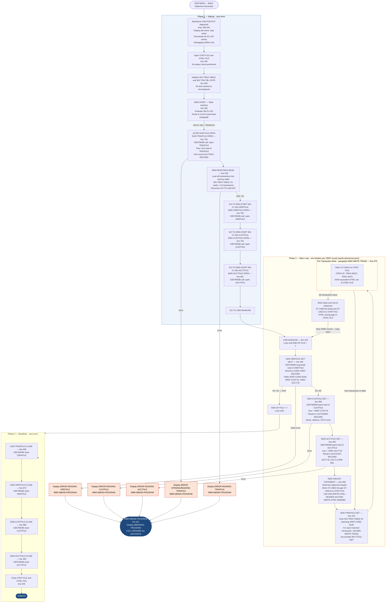

# CBSTM03A — Account Statement Generator (Plain Text and HTML)

```
Application : AWS CardDemo
Source File : CBSTM03A.CBL
Type        : Batch COBOL Program
Source Banner: Program : CBSTM03A.CBL / Application : CardDemo / Type : BATCH COBOL Program / Function : Print Account Statements from Transaction data in two formats : 1/plain text and 2/HTML
```

This document describes what the program does in plain English. All files, fields, copybooks, and external programs are named so a developer can trust this document instead of re-reading the COBOL source.

---

## 1. Purpose

CBSTM03A reads four input files — the card-to-account cross-reference file, the customer master file, the account master file, and the transaction file — and for each card/customer pair writes two output files: a plain-text account statement (`STMT-FILE`, DDname `STMTFILE`) and an HTML account statement (`HTML-FILE`, DDname `HTMLFILE`).

**What it reads:**

- **`XREFFILE`** (card cross-reference, INDEXED, sequential access): one record per card, linking card number to customer ID and account ID. Layout: `CARD-XREF-RECORD` from copybook `CVACT03Y`.
- **`CUSTFILE`** (customer master, INDEXED, random access by customer ID): one record per customer with name, address, and credit score. Layout: `CUSTOMER-RECORD` from copybook `CUSTREC`.
- **`ACCTFILE`** (account master, INDEXED, random access by account ID): one record per account with balance, credit limit, and status. Layout: `ACCOUNT-RECORD` from copybook `CVACT01Y`.
- **`TRNXFILE`** (transaction file, INDEXED, sequential access): one record per transaction keyed by card number + transaction ID. Layout: `TRNX-RECORD` from copybook `COSTM01`.

**What it writes:**

- **`STMT-FILE` (DDname `STMTFILE`)**: a fixed-80-byte-per-line plain-text account statement for each customer. One statement per customer containing header, address, account details, transaction lines, and a totals footer.
- **`HTML-FILE` (DDname `HTMLFILE`)**: a 100-bytes-per-line HTML account statement for each customer, formatted as an HTML table with the same information as the text statement.

**External program called:** `CBSTM03B` — a COBOL subroutine (described in Appendix B) that performs all file I/O for `TRNXFILE`, `XREFFILE`, `CUSTFILE`, and `ACCTFILE`. CBSTM03A never issues its own file-open, file-read, or file-close calls for these four files; it delegates entirely to CBSTM03B.

**Architectural note:** This program uses two unusual mainframe techniques:
1. `ALTER ... GO TO` statements to implement a state machine for multi-step startup (opening four files in sequence before entering the main loop).
2. Mainframe control block addressing (PSA → TCB → TIOT) to enumerate DD names from the JCL TIOT (Task I/O Table), used only for a diagnostic dump of DD names to the job log at startup.

**Hardcoded test data:** The HTML output includes hardcoded bank address and name: `'Bank of XYZ'`, `'410 Terry Ave N'`, `'Seattle WA 99999'` (lines 168, 170–171, 540–542). These are demonstration placeholders, not real business data.

---

## 2. Program Flow

The program's `PROCEDURE DIVISION` does not start with a named paragraph. Execution begins with mainframe control-block address setup, then a TIOT enumeration loop, then opens `STMT-FILE` and `HTML-FILE` directly, then enters paragraph `0000-START`.

### 2.1 Startup

**Step 1 — Mainframe TIOT diagnostic dump** *(lines 266–291).*
The program navigates the mainframe control-block chain starting from the PSA (Prefixed Save Area) pointer `PSAPTR`. It loads the address of the PSA-BLOCK, then follows the `TCB-POINT` pointer to the TCB-BLOCK, then follows `TIOT-POINT` to the TIOT-BLOCK. It displays `'Running JCL : ' TIOTNJOB ' Step ' TIOTJSTP` (job name and step name from the TIOT).

It then iterates through TIOT entries, displaying each DDname (`TIOCDDNM`) and whether its UCB (Unit Control Block) address is null or valid. This diagnostic is a debugging artifact and produces no output relevant to the statement-generation function.

**Step 2 — Open output files** *(line 293).*
`STMT-FILE` and `HTML-FILE` are opened for output directly (not via CBSTM03B). No status check is performed on this open — if either file fails to open, the program will abend on the first write attempt.

**Step 3 — Initialize in-memory tables** *(line 294).*
`WS-TRNX-TABLE` (a 51-element card table, each with up to 10 transactions) and `WS-TRN-TBL-CNTR` (per-card transaction counts) are initialized to zero/spaces.

**Step 4 — Open TRNXFILE via CBSTM03B** *(paragraph `8100-TRNXFILE-OPEN`, line 730 — reached via `0000-START` / `ALTER` / `GO TO`).*
The startup state machine routes to `8100-TRNXFILE-OPEN` on the first call. CBSTM03B is called with operation code `'O'` (open) for DDname `'TRNXFILE'`. If return code is `'00'` or `'04'`, continues; otherwise displays `'ERROR OPENING TRNXFILE'` and abends.

After the open, a first read is immediately performed: CBSTM03B is called again with operation `'R'` (read) for `'TRNXFILE'`. The first transaction record is read into `TRNX-RECORD`. `WS-SAVE-CARD` is set to the first card number, `CR-CNT` is set to 1, `TR-CNT` is set to 0, `WS-FL-DD` is set to `'READTRNX'`, and control falls through to `0000-START` again.

**Step 5 — Load all transactions into memory** *(paragraph `8500-READTRNX-READ`, line 818 — reached via `0000-START` with `WS-FL-DD = 'READTRNX'`).*
The program reads the entire TRNXFILE into the in-memory 2D table `WS-TRNX-TABLE`. For each record:
- If the card number matches `WS-SAVE-CARD`, increment `TR-CNT` (same card group).
- Otherwise, save the current card's transaction count `WS-TRCT(CR-CNT) = TR-CNT`, increment `CR-CNT` (new card), reset `TR-CNT` to 1.
- Store `TRNX-CARD-NUM` in `WS-CARD-NUM(CR-CNT)`, `TRNX-ID` in `WS-TRAN-NUM(CR-CNT, TR-CNT)`, and `TRNX-REST` in `WS-TRAN-REST(CR-CNT, TR-CNT)`.

This continues (recursive `GO TO 8500-READTRNX-READ`) until CBSTM03B returns `'10'` (end-of-file). At EOF, the last card's count is saved and `WS-FL-DD` is set to `'XREFFILE'`, then `GO TO 0000-START`.

**Step 6 — Open XREFFILE** *(paragraph `8200-XREFFILE-OPEN`, line 765).* CBSTM03B opens `'XREFFILE'`. On success, `WS-FL-DD` is set to `'CUSTFILE'` and `GO TO 0000-START`.

**Step 7 — Open CUSTFILE** *(paragraph `8300-CUSTFILE-OPEN`, line 783).* CBSTM03B opens `'CUSTFILE'`. On success, `WS-FL-DD` is set to `'ACCTFILE'` and `GO TO 0000-START`.

**Step 8 — Open ACCTFILE** *(paragraph `8400-ACCTFILE-OPEN`, line 801).* CBSTM03B opens `'ACCTFILE'`. On success, `GO TO 1000-MAINLINE`.

### 2.2 Per-Record Loop

**Step 9 — Main loop begins** *(paragraph `1000-MAINLINE`, line 316).* Loops until `END-OF-FILE = 'Y'`. Note: the inner guard `IF END-OF-FILE = 'N'` is redundant (same as CBACT01C).

**Step 10 — Read next XREF record** *(paragraph `1000-XREFFILE-GET-NEXT`, line 345).* CBSTM03B is called with operation `'R'` (sequential read) for `'XREFFILE'`. The result is placed into `CARD-XREF-RECORD`. This yields `XREF-CARD-NUM`, `XREF-CUST-ID`, and `XREF-ACCT-ID`.

| Return code | Action |
|---|---|
| `'00'` | Continue |
| `'10'` | Sets `END-OF-FILE = 'Y'` — loop exits |
| Other | Displays `'ERROR READING XREFFILE'` and `'RETURN CODE: ' WS-M03B-RC`, then abends |

**Step 11 — Read customer record** *(paragraph `2000-CUSTFILE-GET`, line 368).* CBSTM03B is called with operation `'K'` (keyed random read) for `'CUSTFILE'`, key = `XREF-CUST-ID`. Result placed in `CUSTOMER-RECORD`. On any non-`'00'` return code, displays `'ERROR READING CUSTFILE'` and abends. **Note: there is no handling for customer-not-found; a non-zero return code unconditionally abends.**

**Step 12 — Read account record** *(paragraph `3000-ACCTFILE-GET`, line 392).* CBSTM03B is called with operation `'K'` (keyed random read) for `'ACCTFILE'`, key = `XREF-ACCT-ID`. Result placed in `ACCOUNT-RECORD`. On any non-`'00'` return code, displays `'ERROR READING ACCTFILE'` and abends.

**Step 13 — Create plain-text statement header** *(paragraph `5000-CREATE-STATEMENT`, line 458).* Builds the text statement header in `STATEMENT-LINES` and writes lines to `STMT-FILE`:
- `ST-LINE0`: a banner line of asterisks around `'START OF STATEMENT'`.
- `ST-LINE1`: customer full name (`CUST-FIRST-NAME` + `CUST-MIDDLE-NAME` + `CUST-LAST-NAME` joined with spaces via `STRING`).
- `ST-LINE2`: `CUST-ADDR-LINE-1`.
- `ST-LINE3`: `CUST-ADDR-LINE-2`.
- `ST-LINE4`: `CUST-ADDR-LINE-3` + `CUST-ADDR-STATE-CD` + `CUST-ADDR-COUNTRY-CD` + `CUST-ADDR-ZIP` joined with spaces.
- Separator lines and headers through `ST-LINE13`.

Also calls `5100-WRITE-HTML-HEADER` (line 506) and `5200-WRITE-HTML-NMADBS` (line 558) to write the equivalent HTML output.

**Step 14 — Process transactions for this card** *(paragraph `4000-TRNXFILE-GET`, line 416).* Sets `CR-JMP` to 1 and `WS-TOTAL-AMT` to zero before this call. Inside `4000-TRNXFILE-GET`, the program scans the in-memory `WS-TRNX-TABLE`:
- Starting at `CR-JMP = 1`, iterates until `CR-JMP > CR-CNT` or `WS-CARD-NUM(CR-JMP) > XREF-CARD-NUM`.
- When `WS-CARD-NUM(CR-JMP) = XREF-CARD-NUM`, processes each transaction in that card's slot: copies `WS-TRAN-NUM` to `TRNX-ID`, `WS-TRAN-REST` to `TRNX-REST`, calls `6000-WRITE-TRANS` for each, and accumulates the amount in `WS-TOTAL-AMT`.

**Step 15 — Write a transaction line** *(paragraph `6000-WRITE-TRANS`, line 675).* For each transaction: copies `TRNX-ID` to `ST-TRANID`, `TRNX-DESC` to `ST-TRANDT`, `TRNX-AMT` to `ST-TRANAMT`, and writes `ST-LINE14` to `STMT-FILE`. Also writes the equivalent HTML row to `HTML-FILE`.

**Step 16 — Write statement footer** *(lines 433–454 in `4000-TRNXFILE-GET`).* After all transactions are processed, writes the total amount line (`ST-LINE14A`) and end-of-statement banner (`ST-LINE15`) to `STMT-FILE`. Writes HTML closing tags to `HTML-FILE`.

The loop returns to step 10 to process the next XREF record.

### 2.3 Shutdown

**Step 17 — Close all four CBSTM03B-managed files** *(paragraphs `9100-TRNXFILE-CLOSE` through `9400-ACCTFILE-CLOSE`, lines 856–919).* Each close call sends operation `'C'` to CBSTM03B for the respective DDname. On return code other than `'00'` or `'04'`, displays an error and abends.

**Step 18 — Close output files and return** *(line 339).* `STMT-FILE` and `HTML-FILE` are closed directly. Then `GOBACK`.

---

## 3. Error Handling

### 3.1 Abend Routine — `9999-ABEND-PROGRAM` (line 921)

Any file error triggers this routine. It displays `'ABENDING PROGRAM'` and calls `CEE3ABD` with no arguments (note: no `ABCODE` or `TIMING` parameters are passed in this program — the `CALL 'CEE3ABD'` is a bare call, unlike other CardDemo programs that pass `ABCODE` and `TIMING`). This may produce unpredictable abend codes depending on the LE runtime default behavior.

### 3.2 TRNXFILE open error (line 739)

Displays `'ERROR OPENING TRNXFILE'` and `'RETURN CODE: ' WS-M03B-RC`, then calls `9999-ABEND-PROGRAM`.

### 3.3 TRNXFILE first-read error (line 751)

Displays `'ERROR READING TRNXFILE'` and `'RETURN CODE: ' WS-M03B-RC`, then calls `9999-ABEND-PROGRAM`.

### 3.4 XREFFILE sequential read error (line 359)

Displays `'ERROR READING XREFFILE'` and `'RETURN CODE: ' WS-M03B-RC`, then calls `9999-ABEND-PROGRAM`.

### 3.5 CUSTFILE keyed read error (line 383)

Displays `'ERROR READING CUSTFILE'` and `'RETURN CODE: ' WS-M03B-RC`, then calls `9999-ABEND-PROGRAM`.

### 3.6 ACCTFILE keyed read error (line 407)

Displays `'ERROR READING ACCTFILE'` and `'RETURN CODE: ' WS-M03B-RC`, then calls `9999-ABEND-PROGRAM`.

---

## 4. Migration Notes

1. **`ALTER ... GO TO` is a deprecated, non-structured COBOL construct.** The startup sequence uses `ALTER 8100-FILE-OPEN TO PROCEED TO 8100-TRNXFILE-OPEN` to redirect a `GO TO`. This makes the control flow non-deterministic unless you trace all possible ALTER targets. In Java, replace the entire startup state machine with a simple sequential initialization method.

2. **The entire transaction file is loaded into a fixed-size 51-card × 10-transaction in-memory array.** If the input contains more than 51 distinct card numbers, or more than 10 transactions per card, the program will silently overwrite array bounds. There is no bounds check. This is a critical capacity defect: real production data likely exceeds these limits.

3. **`STMT-FILE` and `HTML-FILE` are opened without a status check (line 293).** If either file fails to open, there is no error message — the program will abend with a non-descriptive I/O error on the first write.

4. **`CEE3ABD` is called without parameters (line 923).** All other CardDemo abend routines pass `ABCODE = 999` and `TIMING = 0`. This bare call relies on Language Environment defaults for the abend code and may produce a different completion code than expected.

5. **Mainframe TIOT address arithmetic at lines 266–291 is non-portable.** The PSA/TCB/TIOT chain navigation is specific to z/OS memory layout and has no equivalent in a Java environment. The entire block should be removed in migration; it produces only a diagnostic dump.

6. **`WS-SAVE-CARD` (PIC `X(16)`) initialized to `SPACES` (line 69) is used to detect card-number changes during the bulk transaction load.** If the transaction file starts with a card number of all spaces, this comparison will immediately appear to match, potentially corrupting the first card's entry.

7. **`CR-JMP` is reset to 1 at the start of every call to `4000-TRNXFILE-GET` (line 324 — `MOVE 1 TO CR-JMP`), meaning the in-memory table scan always starts from slot 1.** For large card arrays, this is O(N) per XREF record processed. The total complexity is O(N²) in the number of cards.

8. **`TRNX-AMT` in `COSTM01` is `PIC S9(09)V99`** — display signed decimal. `WS-TOTAL-AMT` in the program is `PIC S9(9)V99 COMP-3` (packed decimal). The implicit conversion when accumulating amounts is handled by COBOL at runtime but must be explicit (`BigDecimal`) in Java. Both fields are flagged: `WS-TOTAL-AMT` is COMP-3 — use BigDecimal in Java.

9. **There is no handling for a card number in XREFFILE that has no matching card group in the in-memory transaction table.** The scan in `4000-TRNXFILE-GET` will simply find no match and write a statement with zero transactions and a zero total — silently.

10. **`CUST-PHONE-NUM-1`, `CUST-PHONE-NUM-2`, `CUST-SSN`, `CUST-GOVT-ISSUED-ID`, `CUST-DOB-YYYYMMDD`, `CUST-EFT-ACCOUNT-ID`, `CUST-PRI-CARD-HOLDER-IND` from `CUSTREC` are never used** in the statement output. Customer date-of-birth and SSN are present in memory but never referenced.

11. **The `CUSTREC.cpy` copybook (CBSTM03A's version) uses `CUST-DOB-YYYYMMDD`** while `CVCUS01Y.cpy` (the other customer copybook) uses `CUST-DOB-YYYY-MM-DD`. These are two differently named fields for the same data. A migration must reconcile which is authoritative.

12. **`ACCT-ADDR-ZIP`, `ACCT-CASH-CREDIT-LIMIT`, `ACCT-OPEN-DATE`, `ACCT-EXPIRAION-DATE` (typo), `ACCT-REISSUE-DATE`, `ACCT-CURR-CYC-CREDIT`, `ACCT-CURR-CYC-DEBIT`, `ACCT-GROUP-ID` from `CVACT01Y` are never used** in the statement output — only `ACCT-ID` and `ACCT-CURR-BAL` are output.

---

## Appendix A — Files

| Logical Name | DDname | Organization | Recording | Key Field | Direction | Contents |
|---|---|---|---|---|---|---|
| `STMT-FILE` | `STMTFILE` | Sequential | Fixed 80 bytes | N/A | Output | Plain-text account statements, one per customer. |
| `HTML-FILE` | `HTMLFILE` | Sequential | Fixed 100 bytes | N/A | Output | HTML account statements, one per customer. |
| `TRNX-FILE` (via CBSTM03B) | `TRNXFILE` | INDEXED, sequential read | 350 bytes | `FD-TRNXS-ID` (card num + tran ID, PIC X(32)) | Input | Transaction records. Entire file loaded into memory before main loop. |
| `XREF-FILE` (via CBSTM03B) | `XREFFILE` | INDEXED, sequential read | 50 bytes | `FD-XREF-CARD-NUM` PIC X(16) | Input | Card-to-customer-to-account cross reference. Read sequentially in main loop. |
| `CUST-FILE` (via CBSTM03B) | `CUSTFILE` | INDEXED, random read | 500 bytes | `FD-CUST-ID` PIC X(09) | Input | Customer master. Keyed read by `XREF-CUST-ID` for each XREF record. |
| `ACCT-FILE` (via CBSTM03B) | `ACCTFILE` | INDEXED, random read | 300 bytes | `FD-ACCT-ID` PIC 9(11) | Input | Account master. Keyed read by `XREF-ACCT-ID` for each XREF record. |

---

## Appendix B — Copybooks and External Programs

### Copybook `COSTM01` (WORKING-STORAGE, line 51 — defines `TRNX-RECORD`)

Source file: `COSTM01.CPY`.

| Field | PIC | Bytes | Notes |
|---|---|---|---|
| `TRNX-KEY` (group) | — | 32 | Composite key for TRNXFILE KSDS |
| `TRNX-CARD-NUM` | `X(16)` | 16 | Card number — part of key |
| `TRNX-ID` | `X(16)` | 16 | Transaction ID — part of key |
| `TRNX-REST` (group) | — | 318 | All non-key transaction fields |
| `TRNX-TYPE-CD` | `X(02)` | 2 | Transaction type code. **Not referenced in output.** |
| `TRNX-CAT-CD` | `9(04)` | 4 | Transaction category code. **Not referenced in output.** |
| `TRNX-SOURCE` | `X(10)` | 10 | Transaction source. **Not referenced in output.** |
| `TRNX-DESC` | `X(100)` | 100 | Transaction description. Written to `ST-TRANDT`. |
| `TRNX-AMT` | `S9(09)V99` | 11 | Transaction amount. Written to `ST-TRANAMT` and accumulated in `WS-TOTAL-AMT`. |
| `TRNX-MERCHANT-ID` | `9(09)` | 9 | Merchant ID. **Not referenced in output.** |
| `TRNX-MERCHANT-NAME` | `X(50)` | 50 | Merchant name. **Not referenced in output.** |
| `TRNX-MERCHANT-CITY` | `X(50)` | 50 | Merchant city. **Not referenced in output.** |
| `TRNX-MERCHANT-ZIP` | `X(10)` | 10 | Merchant ZIP. **Not referenced in output.** |
| `TRNX-ORIG-TS` | `X(26)` | 26 | Original timestamp. **Not referenced in output.** |
| `TRNX-PROC-TS` | `X(26)` | 26 | Processing timestamp. **Not referenced in output.** |
| `FILLER` | `X(20)` | 20 | Padding. Not referenced. |

### Copybook `CVACT03Y` (WORKING-STORAGE, line 53 — defines `CARD-XREF-RECORD`)

Source file: `CVACT03Y.cpy`. Total record length: 50 bytes.

| Field | PIC | Bytes | Notes |
|---|---|---|---|
| `XREF-CARD-NUM` | `X(16)` | 16 | Card number — KSDS key for XREFFILE. Used to drive main loop and look up transactions. |
| `XREF-CUST-ID` | `9(09)` | 9 | Customer ID. Used as key for CUSTFILE random read. |
| `XREF-ACCT-ID` | `9(11)` | 11 | Account ID. Used as key for ACCTFILE random read and written to HTML statement. |
| `FILLER` | `X(14)` | 14 | Padding. Not referenced. |

### Copybook `CUSTREC` (WORKING-STORAGE, line 55 — defines `CUSTOMER-RECORD`)

Source file: `CUSTREC.cpy`. Total record length: 500 bytes.

| Field | PIC | Bytes | Notes |
|---|---|---|---|
| `CUST-ID` | `9(09)` | 9 | Customer ID. **Not directly referenced in output.** |
| `CUST-FIRST-NAME` | `X(25)` | 25 | First name. Used in `ST-NAME` via `STRING`. |
| `CUST-MIDDLE-NAME` | `X(25)` | 25 | Middle name. Used in `ST-NAME` via `STRING`. |
| `CUST-LAST-NAME` | `X(25)` | 25 | Last name. Used in `ST-NAME` via `STRING`. |
| `CUST-ADDR-LINE-1` | `X(50)` | 50 | Address line 1. Written to `ST-ADD1`. |
| `CUST-ADDR-LINE-2` | `X(50)` | 50 | Address line 2. Written to `ST-ADD2`. |
| `CUST-ADDR-LINE-3` | `X(50)` | 50 | Address line 3. Used in `ST-ADD3` via `STRING`. |
| `CUST-ADDR-STATE-CD` | `X(02)` | 2 | State code. Used in `ST-ADD3` via `STRING`. |
| `CUST-ADDR-COUNTRY-CD` | `X(03)` | 3 | Country code. Used in `ST-ADD3` via `STRING`. |
| `CUST-ADDR-ZIP` | `X(10)` | 10 | ZIP code. Used in `ST-ADD3` via `STRING`. |
| `CUST-PHONE-NUM-1` | `X(15)` | 15 | Phone 1. **Never referenced by this program.** |
| `CUST-PHONE-NUM-2` | `X(15)` | 15 | Phone 2. **Never referenced by this program.** |
| `CUST-SSN` | `9(09)` | 9 | Social security number. **Never referenced by this program.** |
| `CUST-GOVT-ISSUED-ID` | `X(20)` | 20 | Government-issued ID. **Never referenced by this program.** |
| `CUST-DOB-YYYYMMDD` | `X(10)` | 10 | Date of birth (note: field name format differs from `CVCUS01Y.cpy` which uses `CUST-DOB-YYYY-MM-DD`). **Never referenced by this program.** |
| `CUST-EFT-ACCOUNT-ID` | `X(10)` | 10 | EFT account ID. **Never referenced by this program.** |
| `CUST-PRI-CARD-HOLDER-IND` | `X(01)` | 1 | Primary card holder indicator. **Never referenced by this program.** |
| `CUST-FICO-CREDIT-SCORE` | `9(03)` | 3 | FICO credit score. Written to `ST-FICO-SCORE`. |
| `FILLER` | `X(168)` | 168 | Padding to 500 bytes. Not referenced. |

### Copybook `CVACT01Y` (WORKING-STORAGE, line 57 — defines `ACCOUNT-RECORD`)

Source file: `CVACT01Y.cpy`. Total record length: 300 bytes.

| Field | PIC | Bytes | Notes |
|---|---|---|---|
| `ACCT-ID` | `9(11)` | 11 | Account number. Written to `ST-ACCT-ID` and `L11-ACCT` (HTML). |
| `ACCT-ACTIVE-STATUS` | `X(01)` | 1 | Active/inactive flag. **Never referenced in output.** |
| `ACCT-CURR-BAL` | `S9(10)V99` | 12 | Current balance. Written to `ST-CURR-BAL`. |
| `ACCT-CREDIT-LIMIT` | `S9(10)V99` | 12 | Credit limit. **Never referenced in output.** |
| `ACCT-CASH-CREDIT-LIMIT` | `S9(10)V99` | 12 | Cash advance limit. **Never referenced in output.** |
| `ACCT-OPEN-DATE` | `X(10)` | 10 | Open date. **Never referenced in output.** |
| `ACCT-EXPIRAION-DATE` | `X(10)` | 10 | Expiry date *(typo in source: "EXPIRAION" — preserved)*. **Never referenced in output.** |
| `ACCT-REISSUE-DATE` | `X(10)` | 10 | Reissue date. **Never referenced in output.** |
| `ACCT-CURR-CYC-CREDIT` | `S9(10)V99` | 12 | Cycle credits. **Never referenced in output.** |
| `ACCT-CURR-CYC-DEBIT` | `S9(10)V99` | 12 | Cycle debits. **Never referenced in output.** |
| `ACCT-ADDR-ZIP` | `X(10)` | 10 | Account ZIP. **Never referenced in output.** |
| `ACCT-GROUP-ID` | `X(10)` | 10 | Group ID. **Never referenced in output.** |
| `FILLER` | `X(178)` | 178 | Padding. Not referenced. |

### External Program `CBSTM03B`

| Item | Detail |
|---|---|
| Type | COBOL subroutine; called as a static subprogram |
| Called from | `1000-XREFFILE-GET-NEXT` (line 351), `2000-CUSTFILE-GET` (line 377), `3000-ACCTFILE-GET` (line 401), `8100-TRNXFILE-OPEN` (lines 734, 746), `8200-XREFFILE-OPEN` (line 769), `8300-CUSTFILE-OPEN` (line 787), `8400-ACCTFILE-OPEN` (line 805), `8500-READTRNX-READ` (line 835), `9100-TRNXFILE-CLOSE` (line 860), `9200-XREFFILE-CLOSE` (line 877), `9300-CUSTFILE-CLOSE` (line 894), `9400-ACCTFILE-CLOSE` (line 910) |
| Input passed | `WS-M03B-AREA`: `WS-M03B-DD` (DDname), `WS-M03B-OPER` (operation: `'O'`=open, `'C'`=close, `'R'`=sequential read, `'K'`=keyed read), `WS-M03B-KEY` (key for keyed reads), `WS-M03B-KEY-LN` (key length) |
| Output returned | `WS-M03B-RC` (two-byte file status), `WS-M03B-FLDT` (1000-byte record data) |
| Error handling gap | The caller checks `WS-M03B-RC` only for `'00'` and `'10'`. Status codes `'02'` (duplicate key — non-unique read for indexed), `'22'` (duplicate key on write), `'23'` (record not found on keyed read), and all other codes trigger the generic abend. There is no distinction between "record not found" and "hard I/O error" for customer and account reads. |

### External Service `CEE3ABD`

| Item | Detail |
|---|---|
| Type | IBM Language Environment forced abend |
| Called from | `9999-ABEND-PROGRAM`, line 923 |
| Parameters | **None passed** — bare `CALL 'CEE3ABD'` without `ABCODE` or `TIMING` parameters. This differs from all other CardDemo programs. The LE runtime will use default parameters (typically abend code `U4038` or similar). |

---

## Appendix C — Hardcoded Literals

| Paragraph | Line | Value | Usage | Classification |
|---|---|---|---|---|
| `HTML-LINES` data definition | 168 | `'Bank of XYZ'` | Bank name in HTML header | Test data — not a real institution name |
| `HTML-LINES` data definition | 170 | `'410 Terry Ave N'` | Bank address line in HTML | Test data |
| `HTML-LINES` data definition | 171 | `'Seattle WA 99999'` | Bank city/state/ZIP in HTML | Test data |
| `MISC-VARIABLES` | 67 | `'TRNXFILE'` | Initial value of `WS-FL-DD` — first file to open in state machine | System constant |
| `8100-TRNXFILE-OPEN` | 736, 748 | `'00'`, `'04'` | Acceptable return codes for open and first-read | System constants |
| `WS-TRNX-TABLE` | 226 | `51` (OCCURS) | Max number of distinct card numbers held in memory | Capacity limit — likely too small for production data |
| `WS-TRAN-TBL` | 228 | `10` (OCCURS) | Max number of transactions per card held in memory | Capacity limit — likely too small for production data |

---

## Appendix D — Internal Working Fields

| Field | PIC | Bytes | Purpose |
|---|---|---|---|
| `CR-CNT` | `S9(4) COMP` | 2 | Count of distinct card numbers loaded into `WS-TRNX-TABLE`. Maximum 51. |
| `TR-CNT` | `S9(4) COMP` | 2 | Count of transactions for the card currently being loaded. Maximum 10 per card. |
| `CR-JMP` | `S9(4) COMP` | 2 | Loop index for scanning `WS-TRNX-TABLE` in `4000-TRNXFILE-GET`. Reset to 1 each call. |
| `TR-JMP` | `S9(4) COMP` | 2 | Inner loop index for iterating transactions within a card slot in `4000-TRNXFILE-GET`. |
| `WS-TOTAL-AMT` | `S9(9)V99 COMP-3` | 6 | Running total of transaction amounts for the current card/customer. COMP-3 — use BigDecimal in Java. |
| `WS-FL-DD` | `X(8)` | 8 | State-machine variable driving `0000-START`. Values: `'TRNXFILE'`, `'XREFFILE'`, `'CUSTFILE'`, `'ACCTFILE'`, `'READTRNX'`. |
| `WS-TRN-AMT` | `S9(9)V99` | 11 | Copy of `WS-TOTAL-AMT` transferred to `ST-TOTAL-TRAMT` for the text statement footer. |
| `WS-SAVE-CARD` | `X(16)` | 16 | Holds the card number of the transaction currently being loaded, to detect card-number transitions. |
| `END-OF-FILE` | `X(01)` | 1 | Set to `'Y'` when XREFFILE returns `'10'` (end-of-file). Controls main loop exit. |
| `WS-M03B-DD` | `X(08)` | 8 | DDname parameter passed to CBSTM03B. |
| `WS-M03B-OPER` | `X(01)` | 1 | Operation code for CBSTM03B. 88-levels: `M03B-OPEN='O'`, `M03B-CLOSE='C'`, `M03B-READ='R'`, `M03B-READ-K='K'`, `M03B-WRITE='W'`, `M03B-REWRITE='Z'`. |
| `WS-M03B-RC` | `X(02)` | 2 | Return/status code from CBSTM03B. Two-byte file status. |
| `WS-M03B-KEY` | `X(25)` | 25 | Key value for keyed reads passed to CBSTM03B. |
| `WS-M03B-KEY-LN` | `S9(4)` | 2 | Length of the key in `WS-M03B-KEY`, computed as `LENGTH OF XREF-CUST-ID` or similar. |
| `WS-M03B-FLDT` | `X(1000)` | 1000 | Record data buffer. CBSTM03B writes the read record into this field; caller then moves it to the appropriate record layout. |
| `PSAPTR` | POINTER | 4/8 | Address of the mainframe PSA. Used for TIOT diagnostic dump only. |
| `BUMP-TIOT` | `S9(08) BINARY` | 4 | Address arithmetic register for TIOT entry iteration. |
| `TIOT-INDEX` | POINTER (REDEFINES `BUMP-TIOT`) | 4/8 | Pointer alias over `BUMP-TIOT` for `SET ADDRESS OF` operations. |

---

## Appendix E — Execution at a Glance



---

*Source: `CBSTM03A.CBL`, CardDemo, Apache 2.0 license. Copybooks: `COSTM01.CPY`, `CVACT03Y.cpy`, `CUSTREC.cpy`, `CVACT01Y.cpy`. External programs: `CBSTM03B` (COBOL subroutine), `CEE3ABD` (IBM Language Environment). All field names, paragraph names, and literal values are taken directly from the source files.*
