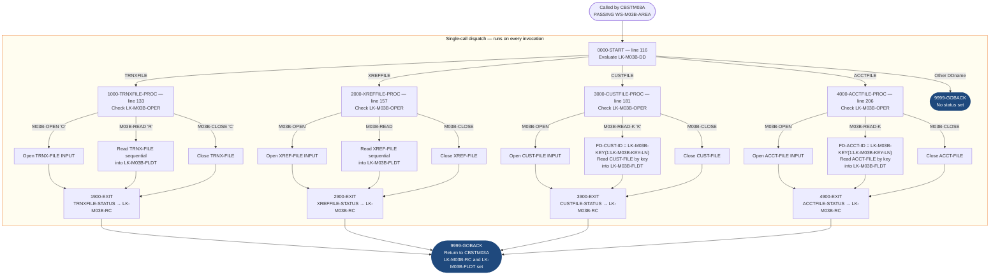

# CBSTM03B — Statement File I/O Subroutine

```
Application : AWS CardDemo
Source File : CBSTM03B.CBL
Type        : Batch COBOL Subroutine
Source Banner: Program : CBSTM03B.CBL / Application : CardDemo / Type : BATCH COBOL Subroutine / Function : Does file processing related to Transact Report
```

This document describes what the subroutine does in plain English. All files, fields, and calling conventions are documented so a developer can trust this document instead of re-reading the COBOL source.

---

## 1. Purpose

CBSTM03B is a reusable file I/O subroutine called exclusively by CBSTM03A. It abstracts all file-open, file-read, and file-close operations for four VSAM files used in the account statement generation process:

- **`TRNXFILE`** — the transaction file (INDEXED, sequential access). Read sequentially to load all transactions into CBSTM03A's in-memory table.
- **`XREFFILE`** — the card cross-reference file (INDEXED, sequential access). Read sequentially to drive the main statement loop.
- **`CUSTFILE`** — the customer master file (INDEXED, random access). Read by customer ID key for each card processed.
- **`ACCTFILE`** — the account master file (INDEXED, random access). Read by account ID key for each card processed.

The caller (`CBSTM03A`) passes a communication area `WS-M03B-AREA` specifying which DDname to operate on, what operation to perform (open/close/sequential read/keyed read), and optionally a key value and length for keyed reads. The subroutine performs the requested I/O and returns the two-byte file status code and, for read operations, the 1000-byte record data.

**This program writes nothing** — no output files. It does not transform data; it is purely a file-I/O dispatcher.

**External programs called:** none.

---

## 2. Program Flow

### 2.1 Startup (called from CBSTM03A)

CBSTM03B has no initialization logic. Each invocation is a fresh dispatch through `0000-START`.

### 2.2 Per-Call Dispatch

**Step 1 — Dispatch by DDname** *(paragraph `0000-START`, line 116).* On each call, `LK-M03B-DD` is evaluated:

| `LK-M03B-DD` value | Target paragraph |
|---|---|
| `'TRNXFILE'` | `1000-TRNXFILE-PROC` |
| `'XREFFILE'` | `2000-XREFFILE-PROC` |
| `'CUSTFILE'` | `3000-CUSTFILE-PROC` |
| `'ACCTFILE'` | `4000-ACCTFILE-PROC` |
| Any other | `9999-GOBACK` — returns immediately with no status set |

**Step 2 — TRNXFILE processing** *(paragraph `1000-TRNXFILE-PROC`, line 133).* Three operation branches:

- If `M03B-OPEN` (`LK-M03B-OPER = 'O'`): opens `TRNX-FILE` for input and jumps to `1900-EXIT` to capture status.
- If `M03B-READ` (`LK-M03B-OPER = 'R'`): reads the next record from `TRNX-FILE` sequentially into `LK-M03B-FLDT` and jumps to `1900-EXIT`.
- If `M03B-CLOSE` (`LK-M03B-OPER = 'C'`): closes `TRNX-FILE` and jumps to `1900-EXIT`.

At `1900-EXIT` (line 151): `TRNXFILE-STATUS` is copied to `LK-M03B-RC` before returning to caller. Execution then falls through to `1999-EXIT`.

**Step 3 — XREFFILE processing** *(paragraph `2000-XREFFILE-PROC`, line 157).* Same three-branch pattern:

- `M03B-OPEN`: opens `XREF-FILE` for input.
- `M03B-READ`: reads the next record sequentially into `LK-M03B-FLDT`.
- `M03B-CLOSE`: closes `XREF-FILE`.

At `2900-EXIT` (line 175): `XREFFILE-STATUS` is copied to `LK-M03B-RC`.

**Step 4 — CUSTFILE processing** *(paragraph `3000-CUSTFILE-PROC`, line 181).* Three-branch pattern:

- `M03B-OPEN`: opens `CUST-FILE` for input.
- `M03B-READ-K` (`LK-M03B-OPER = 'K'`): copies `LK-M03B-KEY(1:LK-M03B-KEY-LN)` to `FD-CUST-ID`, then reads `CUST-FILE` by key into `LK-M03B-FLDT`.
- `M03B-CLOSE`: closes `CUST-FILE`.

At `3900-EXIT` (line 200): `CUSTFILE-STATUS` is copied to `LK-M03B-RC`.

**Step 5 — ACCTFILE processing** *(paragraph `4000-ACCTFILE-PROC`, line 206).* Three-branch pattern:

- `M03B-OPEN`: opens `ACCT-FILE` for input.
- `M03B-READ-K`: copies `LK-M03B-KEY(1:LK-M03B-KEY-LN)` to `FD-ACCT-ID`, then reads `ACCT-FILE` by key into `LK-M03B-FLDT`.
- `M03B-CLOSE`: closes `ACCT-FILE`.

At `4900-EXIT` (line 225): `ACCTFILE-STATUS` is copied to `LK-M03B-RC`.

### 2.3 Shutdown

**Step 6 — Return to caller** *(paragraph `9999-GOBACK`, line 130).* Issues `GOBACK` to return control to CBSTM03A. Files are left open between calls — each file persists its open state because `TRNX-FILE`, `XREF-FILE`, `CUST-FILE`, and `ACCT-FILE` are defined in CBSTM03B's FILE SECTION (not in the caller) and remain open between invocations.

---

## 3. Error Handling

CBSTM03B has **no error handling of its own**. It performs the requested I/O, captures the resulting file status into `LK-M03B-RC`, and returns. All error detection and abend logic is the responsibility of the caller (CBSTM03A).

If an unrecognized DDname is passed in `LK-M03B-DD`, the subroutine falls through to `9999-GOBACK` without setting `LK-M03B-RC`. The caller will read whatever was previously in that field (typically `SPACES` because the caller initializes it to zero before each call). The caller may misinterpret this as a `'  '` (space-space) status, which is not a standard file status value — it is not `'00'` (success) nor `'10'` (EOF). In practice, the CBSTM03A caller checks for `'00'` and `'04'` on open, and `'00'` or `'10'` on read; an unknown DDname would return `'  '` and be treated as neither success nor EOF, triggering the generic abend.

---

## 4. Migration Notes

1. **No file status is set when `LK-M03B-DD` does not match any of the four known DDnames (line 128).** The `GO TO 9999-GOBACK` bypasses all status-setting code. `LK-M03B-RC` retains whatever value the caller put in it before the call. This is a silent no-op that the caller may not handle correctly.

2. **`M03B-WRITE` (`'W'`) and `M03B-REWRITE` (`'Z'`) operation codes are defined in the LINKAGE SECTION (lines 107–108) but no processing branch exists for them.** If the caller requests a write or rewrite, the subroutine will fall through all the `IF` chains without performing any I/O, then capture the last status code (which may be from a previous operation) and return it. This is dead code that could silently corrupt data if ever invoked.

3. **`LK-M03B-KEY-LN` is declared `PIC S9(4)` (signed display numeric) in both the caller and the subroutine linkage.** The reference-modification syntax `LK-M03B-KEY(1:LK-M03B-KEY-LN)` requires a non-negative integer. No validation is performed to ensure `LK-M03B-KEY-LN > 0` before the keyed read. If the caller passes 0 or a negative value, behavior is undefined.

4. **`LK-M03B-FLDT` is 1000 bytes.** The largest record read is `CUST-FILE` (491 bytes of data + 9-byte key = 500 bytes total). The 1000-byte buffer is large enough for all four files. However, if future files with records larger than 1000 bytes were added, this would silently truncate. The Java equivalent should use the actual record sizes.

5. **All four files are opened `INPUT` only.** No update operations are ever performed by CBSTM03B on any file. `M03B-WRITE` and `M03B-REWRITE` code paths are dead (see note 2).

6. **File state is persistent across calls because files are in CBSTM03B's FILE SECTION.** The caller (CBSTM03A) cannot close a file from its own context; it must call CBSTM03B with `M03B-CLOSE`. If CBSTM03A abends without calling the close paragraphs, all four VSAM files remain open — they will be closed implicitly by the runtime.

7. **ACCTFILE key `FD-ACCT-ID` is `PIC 9(11)` (numeric display).** When CBSTM03A sets `LK-M03B-KEY = XREF-ACCT-ID` (which is `PIC 9(11)`) and `LK-M03B-KEY-LN = LENGTH OF XREF-ACCT-ID` (= 11), the move `FD-ACCT-ID = LK-M03B-KEY(1:11)` copies 11 characters from the key area into a numeric field. This works correctly when the key contains display digits, but would produce an invalid numeric value if spaces or non-digit characters were passed. No validation is performed.

---

## Appendix A — Files

| Logical Name | DDname | Organization | Recording | Key Field | Direction | Contents |
|---|---|---|---|---|---|---|
| `TRNX-FILE` | `TRNXFILE` | INDEXED | 350 bytes | `FD-TRNXS-ID` (PIC X(32): card num + tran ID) | Input (sequential read) | Transaction records. Read sequentially to fill CBSTM03A's in-memory table. |
| `XREF-FILE` | `XREFFILE` | INDEXED | 50 bytes | `FD-XREF-CARD-NUM` PIC X(16) | Input (sequential read) | Card cross-reference. Read sequentially in CBSTM03A's main loop. |
| `CUST-FILE` | `CUSTFILE` | INDEXED | 500 bytes | `FD-CUST-ID` PIC X(09) | Input (random read by key) | Customer master. Keyed random read using customer ID. |
| `ACCT-FILE` | `ACCTFILE` | INDEXED | 300 bytes | `FD-ACCT-ID` PIC 9(11) | Input (random read by key) | Account master. Keyed random read using account ID. |

---

## Appendix B — Copybooks and External Programs

CBSTM03B copies no external copybooks. All layouts are defined inline in the FILE SECTION and LINKAGE SECTION.

**FILE SECTION layouts (inline FD definitions):**

**`TRNX-FILE` FD:**

| Field | PIC | Bytes | Notes |
|---|---|---|---|
| `FD-TRNXS-ID` (group, composite key) | — | 32 | KSDS key for TRNXFILE |
| `FD-TRNX-CARD` | `X(16)` | 16 | Card number portion of key |
| `FD-TRNX-ID` | `X(16)` | 16 | Transaction ID portion of key |
| `FD-ACCT-DATA` | `X(318)` | 318 | Remaining transaction fields |

**`XREF-FILE` FD:**

| Field | PIC | Bytes | Notes |
|---|---|---|---|
| `FD-XREF-CARD-NUM` | `X(16)` | 16 | Card number — KSDS key |
| `FD-XREF-DATA` | `X(34)` | 34 | Customer ID, account ID, and filler |

**`CUST-FILE` FD:**

| Field | PIC | Bytes | Notes |
|---|---|---|---|
| `FD-CUST-ID` | `X(09)` | 9 | Customer ID — KSDS key (note: defined as `X(09)` here, but `CVCUS01Y.cpy` defines it as `9(09)` — type mismatch between subroutine FD and copybook) |
| `FD-CUST-DATA` | `X(491)` | 491 | Remaining customer fields |

**`ACCT-FILE` FD:**

| Field | PIC | Bytes | Notes |
|---|---|---|---|
| `FD-ACCT-ID` | `9(11)` | 11 | Account number — KSDS key |
| `FD-ACCT-DATA` | `X(289)` | 289 | Remaining account fields |

**LINKAGE SECTION `LK-M03B-AREA` (the caller's communication area):**

| Field | PIC | Bytes | Notes |
|---|---|---|---|
| `LK-M03B-DD` | `X(08)` | 8 | DDname to operate on. Valid values: `'TRNXFILE'`, `'XREFFILE'`, `'CUSTFILE'`, `'ACCTFILE'`. |
| `LK-M03B-OPER` | `X(01)` | 1 | Operation code. 88-levels: `M03B-OPEN='O'`, `M03B-CLOSE='C'`, `M03B-READ='R'`, `M03B-READ-K='K'`, `M03B-WRITE='W'` (unused), `M03B-REWRITE='Z'` (unused). |
| `LK-M03B-RC` | `X(02)` | 2 | Return code (output). Set to the two-byte file status after I/O. Not set if DDname is unrecognized. |
| `LK-M03B-KEY` | `X(25)` | 25 | Key value for keyed reads (input). Only used when `M03B-READ-K`. |
| `LK-M03B-KEY-LN` | `S9(4)` | 2 | Length of key in `LK-M03B-KEY` (input). Used as reference-modification length. |
| `LK-M03B-FLDT` | `X(1000)` | 1000 | Record data buffer (output). Receives the full record on read operations. |

**No external programs are called.**

---

## Appendix C — Hardcoded Literals

There are no hardcoded literals in the PROCEDURE DIVISION beyond the `WHEN` values in the dispatch evaluation. All DDname string values (`'TRNXFILE'`, `'XREFFILE'`, `'CUSTFILE'`, `'ACCTFILE'`) are passed in by the caller, not hardcoded in this subroutine.

| Paragraph | Line | Value | Usage | Classification |
|---|---|---|---|---|
| `0000-START` | 118–127 | `'TRNXFILE'`, `'XREFFILE'`, `'CUSTFILE'`, `'ACCTFILE'` | DDname dispatch table values | System constants |

---

## Appendix D — Internal Working Fields

| Field | PIC | Bytes | Purpose |
|---|---|---|---|
| `TRNXFILE-STATUS` / `TRNXFILE-STAT1` / `TRNXFILE-STAT2` | `X(02)` | 2 | File status for `TRNX-FILE`. Copied to `LK-M03B-RC` at `1900-EXIT`. |
| `XREFFILE-STATUS` / `XREFFILE-STAT1` / `XREFFILE-STAT2` | `X(02)` | 2 | File status for `XREF-FILE`. Copied to `LK-M03B-RC` at `2900-EXIT`. |
| `CUSTFILE-STATUS` / `CUSTFILE-STAT1` / `CUSTFILE-STAT2` | `X(02)` | 2 | File status for `CUST-FILE`. Copied to `LK-M03B-RC` at `3900-EXIT`. |
| `ACCTFILE-STATUS` / `ACCTFILE-STAT1` / `ACCTFILE-STAT2` | `X(02)` | 2 | File status for `ACCT-FILE`. Copied to `LK-M03B-RC` at `4900-EXIT`. |

---

## Appendix E — Execution at a Glance



---

*Source: `CBSTM03B.CBL`, CardDemo, Apache 2.0 license. No external copybooks copied. No external programs called. All field names, paragraph names, and operation codes are taken directly from the source file.*
