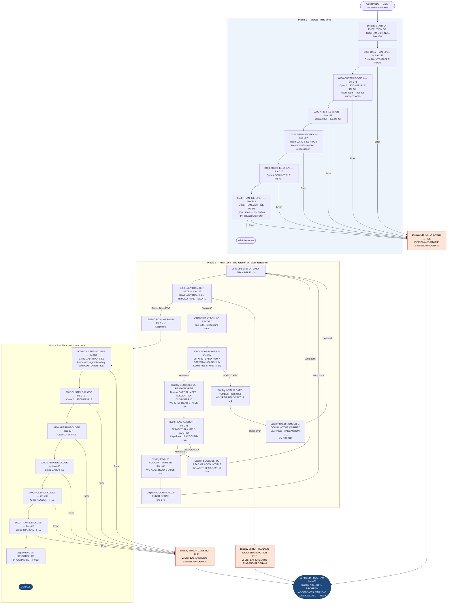

# CBTRN01C — Daily Transaction Validation and Cross-Reference Lookup

```
Application : AWS CardDemo
Source File : CBTRN01C.cbl
Type        : Batch COBOL Program
Source Banner: Program : CBTRN01C.CBL / Application : CardDemo / Type : BATCH COBOL Program / Function : Post the records from daily transaction file.
```

This document describes what the program does in plain English. All files, fields, copybooks, and external programs are named so a developer can trust this document instead of re-reading the COBOL source.

---

## 1. Purpose

CBTRN01C reads the **Daily Transaction File** (`DALYTRAN-FILE`, DDname `DALYTRAN`) sequentially, and for each transaction record:

1. Looks up the card number in the **Card Cross-Reference File** (`XREF-FILE`, DDname `XREFFILE`) to find the associated account ID and customer ID.
2. If the cross-reference lookup succeeds, reads the **Account Master File** (`ACCOUNT-FILE`, DDname `ACCTFILE`) to retrieve the account record.
3. Displays the transaction, cross-reference, and account data to the job log.

**Important: this program is a diagnostic stub.** Despite its header saying "Post the records from daily transaction file," CBTRN01C does **not** post, update, or write anything. It opens `CUSTOMER-FILE`, `CARD-FILE`, and `TRANSACT-FILE` but **never reads or writes any of them**. The program's sole effect is to display transaction and account data to the job log. The actual transaction posting is done by `CBTRN02C`.

**What it reads:**
- **`DALYTRAN-FILE`** (DDname `DALYTRAN`): sequential flat file of daily transactions. Layout: `DALYTRAN-RECORD` from copybook `CVTRA06Y`.
- **`XREF-FILE`** (DDname `XREFFILE`): indexed VSAM file, card-number keyed. Layout: `CARD-XREF-RECORD` from copybook `CVACT03Y`.
- **`ACCOUNT-FILE`** (DDname `ACCTFILE`): indexed VSAM file, account-ID keyed. Layout: `ACCOUNT-RECORD` from copybook `CVACT01Y`.

**Files opened but never accessed beyond the open/close:**
- **`CUSTOMER-FILE`** (DDname `CUSTFILE`): opened and closed but never read. Layout: `CUSTOMER-RECORD` from copybook `CVCUS01Y`. (Not referenced.)
- **`CARD-FILE`** (DDname `CARDFILE`): opened and closed but never read. Layout: `CARD-RECORD` from copybook `CVACT02Y`. (Not referenced.)
- **`TRANSACT-FILE`** (DDname `TRANFILE`): opened and closed but never read or written. Layout: `TRAN-RECORD` from copybook `CVTRA05Y`. (Not referenced.)

**External programs called:** `CEE3ABD` (IBM Language Environment abend service).

---

## 2. Program Flow

### 2.1 Startup

All six files are opened in sequence. Each open uses the same pattern: set `APPL-RESULT` to 8, open the file, check file status — if `'00'` set `APPL-RESULT` to 0, otherwise set it to 12; if not `APPL-AOK`, display an error message and abend.

**Step 1 — Open Daily Transaction File** *(paragraph `0000-DALYTRAN-OPEN`, line 252).* Opens `DALYTRAN-FILE` for input. On failure, displays `'ERROR OPENING DAILY TRANSACTION FILE'`, formats the status via `Z-DISPLAY-IO-STATUS`, and abends.

**Step 2 — Open Customer File** *(paragraph `0100-CUSTFILE-OPEN`, line 271).* Opens `CUSTOMER-FILE` for input. On failure, displays `'ERROR OPENING CUSTOMER FILE'`.

**Step 3 — Open Cross-Reference File** *(paragraph `0200-XREFFILE-OPEN`, line 289).* Opens `XREF-FILE` for input. On failure, displays `'ERROR OPENING CROSS REF FILE'`.

**Step 4 — Open Card File** *(paragraph `0300-CARDFILE-OPEN`, line 307).* Opens `CARD-FILE` for input. On failure, displays `'ERROR OPENING CARD FILE'`.

**Step 5 — Open Account File** *(paragraph `0400-ACCTFILE-OPEN`, line 325).* Opens `ACCOUNT-FILE` for input. On failure, displays `'ERROR OPENING ACCOUNT FILE'`.

**Step 6 — Open Transaction Archive File** *(paragraph `0500-TRANFILE-OPEN`, line 343).* Opens `TRANSACT-FILE` for input. On failure, displays `'ERROR OPENING TRANSACTION FILE'`. **Note: all other CardDemo programs open `TRANSACT-FILE` for output or I-O; opening it as input here is a further sign this program is incomplete or diagnostic only.**

The startup banner `'START OF EXECUTION OF PROGRAM CBTRN01C'` is displayed at line 156 before the opens.

### 2.2 Per-Transaction Loop

The program loops until `END-OF-DAILY-TRANS-FILE = 'Y'`. The same redundant inner guard `IF END-OF-DAILY-TRANS-FILE = 'N'` appears inside the loop.

**Step 7 — Read next daily transaction** *(paragraph `1000-DALYTRAN-GET-NEXT`, line 202).* Reads the next record from `DALYTRAN-FILE` into `DALYTRAN-RECORD`.

| Status | Action |
|---|---|
| `'00'` | `APPL-RESULT = 0` (success) |
| `'10'` | `APPL-RESULT = 16` (EOF) → sets `END-OF-DAILY-TRANS-FILE = 'Y'` |
| Other | Displays `'ERROR READING DAILY TRANSACTION FILE'` and abends |

**Step 8 — Display the transaction record** *(line 168).* If not EOF, the raw 350-byte `DALYTRAN-RECORD` is written to the job log. This is a diagnostic dump.

**Step 9 — Look up card cross-reference** *(paragraph `2000-LOOKUP-XREF`, line 227).* `DALYTRAN-CARD-NUM` is moved to `XREF-CARD-NUM` (the search key), then a keyed random read is issued against `XREF-FILE`.

| Result | Action |
|---|---|
| Key found | Displays `'SUCCESSFUL READ OF XREF'`, `'CARD NUMBER: ' XREF-CARD-NUM`, `'ACCOUNT ID : ' XREF-ACCT-ID`, `'CUSTOMER ID: ' XREF-CUST-ID`. Sets `WS-XREF-READ-STATUS = 0`. |
| Key not found (`INVALID KEY`) | Displays `'INVALID CARD NUMBER FOR XREF'`. Sets `WS-XREF-READ-STATUS = 4`. |

Note: `WS-XREF-READ-STATUS` is only set for the not-found case via `MOVE 4 TO WS-XREF-READ-STATUS`; the found case sets `WS-XREF-READ-STATUS = 0` in the calling paragraph (line 170), not inside `2000-LOOKUP-XREF`.

**Step 10 — Read account record** *(paragraph `3000-READ-ACCOUNT`, line 241).* Only executed if `WS-XREF-READ-STATUS = 0`. `XREF-ACCT-ID` is moved to `ACCT-ID`, then a keyed random read is issued against `ACCOUNT-FILE`.

| Result | Action |
|---|---|
| Key found | Displays `'SUCCESSFUL READ OF ACCOUNT FILE'`. Sets `WS-ACCT-READ-STATUS = 0` (already 0 from line 174). |
| Key not found (`INVALID KEY`) | Displays `'INVALID ACCOUNT NUMBER FOUND'`. Sets `WS-ACCT-READ-STATUS = 4`. |

If `WS-ACCT-READ-STATUS != 0` after the read, the main loop displays `'ACCOUNT ' ACCT-ID ' NOT FOUND'` (line 178).

If `WS-XREF-READ-STATUS != 0` (card not found), the main loop displays `'CARD NUMBER ' DALYTRAN-CARD-NUM ' COULD NOT BE VERIFIED. SKIPPING TRANSACTION ID-' DALYTRAN-ID` (lines 181–183).

### 2.3 Shutdown

All six files are closed after the loop exits, using the arithmetic-idiom pattern (`ADD 8 TO ZERO GIVING APPL-RESULT`).

**Step 11 — Close DALYTRAN-FILE** *(paragraph `9000-DALYTRAN-CLOSE`, line 361).* Note: on close failure, the error message says `'ERROR CLOSING CUSTOMER FILE'` and uses `CUSTFILE-STATUS` to format the status — both are wrong copy-paste artifacts; the actual file being closed is `DALYTRAN-FILE` (see Migration Note 1).

**Step 12 — Close CUSTOMER-FILE** *(paragraph `9100-CUSTFILE-CLOSE`, line 379).*

**Step 13 — Close XREF-FILE** *(paragraph `9200-XREFFILE-CLOSE`, line 397).*

**Step 14 — Close CARD-FILE** *(paragraph `9300-CARDFILE-CLOSE`, line 415).*

**Step 15 — Close ACCOUNT-FILE** *(paragraph `9400-ACCTFILE-CLOSE`, line 433).*

**Step 16 — Close TRANSACT-FILE** *(paragraph `9500-TRANFILE-CLOSE`, line 451).*

**Step 17 — Return** *(line 197).* Displays `'END OF EXECUTION OF PROGRAM CBTRN01C'` and issues `GOBACK`.

---

## 3. Error Handling

### 3.1 Status Display — `Z-DISPLAY-IO-STATUS` (line 476)

Formats the two-byte `IO-STATUS` field for display. If the status is non-numeric or starts with `'9'` (system-level error), the first byte is kept as-is and the second byte is converted from binary (0–255) to a 3-digit decimal using the `TWO-BYTES-BINARY` / `TWO-BYTES-RIGHT` overlay. The formatted 4-character result is stored in `IO-STATUS-04` and displayed with the prefix `'FILE STATUS IS: NNNN'`.

### 3.2 Abend Routine — `Z-ABEND-PROGRAM` (line 469)

Displays `'ABENDING PROGRAM'`, sets `TIMING = 0` and `ABCODE = 999`, then calls `CEE3ABD` to terminate with completion code `U999`.

---

## 4. Migration Notes

1. **`9000-DALYTRAN-CLOSE` (line 361) displays `'ERROR CLOSING CUSTOMER FILE'` and uses `CUSTFILE-STATUS` instead of `DALYTRAN-STATUS`.** The close paragraph closes `DALYTRAN-FILE` but was copy-pasted from `9100-CUSTFILE-CLOSE` without updating the error message or status variable. The reported file name and status code will be wrong if this close ever fails.

2. **`CUSTOMER-FILE`, `CARD-FILE`, and `TRANSACT-FILE` are opened and closed but never read or written.** Three of the six files are entirely unused beyond open/close. The program's declared function ("Post the records") suggests this is an incomplete version or a diagnostic stub. In a Java migration, these three file operations should be removed or flagged for review before any business logic is built on them.

3. **`TRANSACT-FILE` is opened for INPUT (line 345)** via `OPEN INPUT TRANSACT-FILE`. CBTRN02C opens the same DDname (`TRANFILE`) for OUTPUT. These two programs have conflicting access modes for what is presumably the same physical file. Running CBTRN01C against a freshly created (or non-existent) `TRANFILE` will fail with a non-zero status code.

4. **The inner guard `IF END-OF-DAILY-TRANS-FILE = 'N'` (line 165) inside the `PERFORM UNTIL END-OF-DAILY-TRANS-FILE = 'Y'` loop is redundant** — the condition can never be false while the loop is running.

5. **`DALYTRAN-RECORD` is displayed to the job log as a raw 350-byte record (line 168)** before any cross-reference lookup. This is a debugging artifact that will produce non-printable characters in the job log for COMP/COMP-3 fields.

6. **Fields from `CVCUS01Y` (`CUSTOMER-RECORD`), `CVACT02Y` (`CARD-RECORD`), and `CVTRA05Y` (`TRAN-RECORD`) are entirely unused.** All fields in these three copybooks are never referenced anywhere in the procedure division.

7. **`WS-MISC-VARIABLES` holds `WS-XREF-READ-STATUS` and `WS-ACCT-READ-STATUS` as `PIC 9(04)`.** These status fields are set to 4 on not-found and 0 on success. The values 4 and 0 are local conventions, not standard file status codes. In a Java migration, replace with a proper boolean `found` flag.

8. **All COMP-3 fields in `ACCOUNT-RECORD` are `S9(10)V99` display format** — no COMP-3 fields are actually present in `CVACT01Y`. However, `DALYTRAN-AMT` in `CVTRA06Y` is `PIC S9(09)V99` (display), not COMP-3. Neither copybook has COMP-3 monetary fields in this program's context.

---

## Appendix A — Files

| Logical Name | DDname | Organization | Recording | Key Field | Direction | Contents |
|---|---|---|---|---|---|---|
| `DALYTRAN-FILE` | `DALYTRAN` | Sequential | Fixed 350 bytes | N/A | Input | Daily transaction records. One per card transaction. |
| `CUSTOMER-FILE` | `CUSTFILE` | INDEXED | 500 bytes | `FD-CUST-ID` PIC 9(09) | Input | Customer master. **Opened and closed but never read.** |
| `XREF-FILE` | `XREFFILE` | INDEXED | 50 bytes | `FD-XREF-CARD-NUM` PIC X(16) | Input | Card cross-reference. Keyed random read by card number. |
| `CARD-FILE` | `CARDFILE` | INDEXED | 150 bytes | `FD-CARD-NUM` PIC X(16) | Input | Card master. **Opened and closed but never read.** |
| `ACCOUNT-FILE` | `ACCTFILE` | INDEXED | 300 bytes | `FD-ACCT-ID` PIC 9(11) | Input | Account master. Keyed random read by account ID. |
| `TRANSACT-FILE` | `TRANFILE` | INDEXED | 350 bytes | `FD-TRANS-ID` PIC X(16) | Input | Transaction archive. **Opened as INPUT and closed but never read.** |

---

## Appendix B — Copybooks and External Programs

### Copybook `CVTRA06Y` (WORKING-STORAGE, line 99 — defines `DALYTRAN-RECORD`)

Source file: `CVTRA06Y.cpy`. Total record length: 350 bytes.

| Field | PIC | Bytes | Notes |
|---|---|---|---|
| `DALYTRAN-ID` | `X(16)` | 16 | Transaction ID. Displayed in card-not-found message. |
| `DALYTRAN-TYPE-CD` | `X(02)` | 2 | Transaction type code. **Never referenced in processing logic.** |
| `DALYTRAN-CAT-CD` | `9(04)` | 4 | Transaction category code. **Never referenced in processing logic.** |
| `DALYTRAN-SOURCE` | `X(10)` | 10 | Transaction source. **Never referenced in processing logic.** |
| `DALYTRAN-DESC` | `X(100)` | 100 | Transaction description. **Never referenced in processing logic.** |
| `DALYTRAN-AMT` | `S9(09)V99` | 11 | Transaction amount. **Never referenced in processing logic.** |
| `DALYTRAN-MERCHANT-ID` | `9(09)` | 9 | Merchant ID. **Never referenced in processing logic.** |
| `DALYTRAN-MERCHANT-NAME` | `X(50)` | 50 | Merchant name. **Never referenced in processing logic.** |
| `DALYTRAN-MERCHANT-CITY` | `X(50)` | 50 | Merchant city. **Never referenced in processing logic.** |
| `DALYTRAN-MERCHANT-ZIP` | `X(10)` | 10 | Merchant ZIP. **Never referenced in processing logic.** |
| `DALYTRAN-CARD-NUM` | `X(16)` | 16 | Card number. Used as XREF lookup key and in card-not-found message. |
| `DALYTRAN-ORIG-TS` | `X(26)` | 26 | Original transaction timestamp. **Never referenced in processing logic.** |
| `DALYTRAN-PROC-TS` | `X(26)` | 26 | Processing timestamp. **Never referenced in processing logic.** |
| `FILLER` | `X(20)` | 20 | Padding. Not referenced. |

### Copybook `CVCUS01Y` (WORKING-STORAGE, line 104 — defines `CUSTOMER-RECORD`)

Source file: `CVCUS01Y.cpy`. Total record length: 500 bytes. **All fields are unused by this program.**

| Field | PIC | Bytes | Notes |
|---|---|---|---|
| `CUST-ID` | `9(09)` | 9 | Customer ID. **Never referenced.** |
| `CUST-FIRST-NAME` | `X(25)` | 25 | First name. **Never referenced.** |
| `CUST-MIDDLE-NAME` | `X(25)` | 25 | Middle name. **Never referenced.** |
| `CUST-LAST-NAME` | `X(25)` | 25 | Last name. **Never referenced.** |
| `CUST-ADDR-LINE-1` | `X(50)` | 50 | Address line 1. **Never referenced.** |
| `CUST-ADDR-LINE-2` | `X(50)` | 50 | Address line 2. **Never referenced.** |
| `CUST-ADDR-LINE-3` | `X(50)` | 50 | Address line 3. **Never referenced.** |
| `CUST-ADDR-STATE-CD` | `X(02)` | 2 | State code. **Never referenced.** |
| `CUST-ADDR-COUNTRY-CD` | `X(03)` | 3 | Country code. **Never referenced.** |
| `CUST-ADDR-ZIP` | `X(10)` | 10 | ZIP code. **Never referenced.** |
| `CUST-PHONE-NUM-1` | `X(15)` | 15 | Phone 1. **Never referenced.** |
| `CUST-PHONE-NUM-2` | `X(15)` | 15 | Phone 2. **Never referenced.** |
| `CUST-SSN` | `9(09)` | 9 | Social security number. **Never referenced.** |
| `CUST-GOVT-ISSUED-ID` | `X(20)` | 20 | Government ID. **Never referenced.** |
| `CUST-DOB-YYYY-MM-DD` | `X(10)` | 10 | Date of birth. **Never referenced.** |
| `CUST-EFT-ACCOUNT-ID` | `X(10)` | 10 | EFT account ID. **Never referenced.** |
| `CUST-PRI-CARD-HOLDER-IND` | `X(01)` | 1 | Primary card holder flag. **Never referenced.** |
| `CUST-FICO-CREDIT-SCORE` | `9(03)` | 3 | FICO score. **Never referenced.** |
| `FILLER` | `X(168)` | 168 | Padding. Not referenced. |

### Copybook `CVACT03Y` (WORKING-STORAGE, line 109 — defines `CARD-XREF-RECORD`)

Source file: `CVACT03Y.cpy`. Total record length: 50 bytes.

| Field | PIC | Bytes | Notes |
|---|---|---|---|
| `XREF-CARD-NUM` | `X(16)` | 16 | Card number — KSDS key. Set from `DALYTRAN-CARD-NUM` before keyed read. Displayed in success message. |
| `XREF-CUST-ID` | `9(09)` | 9 | Customer ID. Displayed in success message but not otherwise used. |
| `XREF-ACCT-ID` | `9(11)` | 11 | Account ID. Used as `ACCT-ID` for subsequent account read. Displayed in success message. |
| `FILLER` | `X(14)` | 14 | Padding. Not referenced. |

### Copybook `CVACT02Y` (WORKING-STORAGE, line 114 — defines `CARD-RECORD`)

Source file: `CVACT02Y.cpy`. Total record length: 150 bytes. **All fields unused.**

| Field | PIC | Bytes | Notes |
|---|---|---|---|
| `CARD-NUM` | `X(16)` | 16 | Card number. **Never referenced.** |
| `CARD-ACCT-ID` | `9(11)` | 11 | Account ID. **Never referenced.** |
| `CARD-CVV-CD` | `9(03)` | 3 | CVV code. **Never referenced.** |
| `CARD-EMBOSSED-NAME` | `X(50)` | 50 | Embossed name. **Never referenced.** |
| `CARD-EXPIRAION-DATE` | `X(10)` | 10 | Expiry date *(typo: "EXPIRAION" — preserved)*. **Never referenced.** |
| `CARD-ACTIVE-STATUS` | `X(01)` | 1 | Active status. **Never referenced.** |
| `FILLER` | `X(59)` | 59 | Padding. Not referenced. |

### Copybook `CVACT01Y` (WORKING-STORAGE, line 119 — defines `ACCOUNT-RECORD`)

Source file: `CVACT01Y.cpy`. Total record length: 300 bytes.

| Field | PIC | Bytes | Notes |
|---|---|---|---|
| `ACCT-ID` | `9(11)` | 11 | Account number. Set from `XREF-ACCT-ID`, used as key for ACCOUNT-FILE read, displayed in account-not-found message. |
| `ACCT-ACTIVE-STATUS` | `X(01)` | 1 | Active flag. **Read from disk but never referenced.** |
| `ACCT-CURR-BAL` | `S9(10)V99` | 12 | Current balance. **Read from disk but never referenced.** |
| `ACCT-CREDIT-LIMIT` | `S9(10)V99` | 12 | Credit limit. **Read from disk but never referenced.** |
| `ACCT-CASH-CREDIT-LIMIT` | `S9(10)V99` | 12 | Cash-advance limit. **Read from disk but never referenced.** |
| `ACCT-OPEN-DATE` | `X(10)` | 10 | Open date. **Read from disk but never referenced.** |
| `ACCT-EXPIRAION-DATE` | `X(10)` | 10 | Expiry date *(typo: "EXPIRAION" — preserved)*. **Read from disk but never referenced.** |
| `ACCT-REISSUE-DATE` | `X(10)` | 10 | Reissue date. **Read from disk but never referenced.** |
| `ACCT-CURR-CYC-CREDIT` | `S9(10)V99` | 12 | Cycle credits. **Read from disk but never referenced.** |
| `ACCT-CURR-CYC-DEBIT` | `S9(10)V99` | 12 | Cycle debits. **Read from disk but never referenced.** |
| `ACCT-ADDR-ZIP` | `X(10)` | 10 | ZIP code. **Read from disk but never referenced.** |
| `ACCT-GROUP-ID` | `X(10)` | 10 | Group ID. **Read from disk but never referenced.** |
| `FILLER` | `X(178)` | 178 | Padding. Not referenced. |

### Copybook `CVTRA05Y` (WORKING-STORAGE, line 124 — defines `TRAN-RECORD`)

Source file: `CVTRA05Y.cpy`. Total record length: 350 bytes. **All fields unused.**

| Field | PIC | Bytes | Notes |
|---|---|---|---|
| `TRAN-ID` | `X(16)` | 16 | Transaction ID. **Never referenced.** |
| `TRAN-TYPE-CD` | `X(02)` | 2 | Type code. **Never referenced.** |
| `TRAN-CAT-CD` | `9(04)` | 4 | Category code. **Never referenced.** |
| `TRAN-SOURCE` | `X(10)` | 10 | Source. **Never referenced.** |
| `TRAN-DESC` | `X(100)` | 100 | Description. **Never referenced.** |
| `TRAN-AMT` | `S9(09)V99` | 11 | Amount. **Never referenced.** |
| `TRAN-MERCHANT-ID` | `9(09)` | 9 | Merchant ID. **Never referenced.** |
| `TRAN-MERCHANT-NAME` | `X(50)` | 50 | Merchant name. **Never referenced.** |
| `TRAN-MERCHANT-CITY` | `X(50)` | 50 | Merchant city. **Never referenced.** |
| `TRAN-MERCHANT-ZIP` | `X(10)` | 10 | Merchant ZIP. **Never referenced.** |
| `TRAN-CARD-NUM` | `X(16)` | 16 | Card number. **Never referenced.** |
| `TRAN-ORIG-TS` | `X(26)` | 26 | Original timestamp. **Never referenced.** |
| `TRAN-PROC-TS` | `X(26)` | 26 | Processing timestamp. **Never referenced.** |
| `FILLER` | `X(20)` | 20 | Padding. Not referenced. |

### External Service `CEE3ABD`

| Item | Detail |
|---|---|
| Type | IBM Language Environment forced abend service |
| Called from | `Z-ABEND-PROGRAM`, line 473 |
| `ABCODE` | `PIC S9(9) BINARY`, set to `999` — produces `U999` |
| `TIMING` | `PIC S9(9) BINARY`, set to `0` — immediate abend |

---

## Appendix C — Hardcoded Literals

| Paragraph | Line | Value | Usage | Classification |
|---|---|---|---|---|
| `MAIN-PARA` | 156 | `'START OF EXECUTION OF PROGRAM CBTRN01C'` | Startup banner | Display message |
| `MAIN-PARA` | 195 | `'END OF EXECUTION OF PROGRAM CBTRN01C'` | Shutdown banner | Display message |
| `2000-LOOKUP-XREF` | 233 | `4` | `WS-XREF-READ-STATUS` value for XREF not found | Internal convention |
| `3000-READ-ACCOUNT` | 247 | `4` | `WS-ACCT-READ-STATUS` value for account not found | Internal convention |
| Open paragraphs | 253, 272, 290, 308, 326, 344 | `8`, `0`, `12` | `APPL-RESULT` progress/result codes | Internal convention |
| Close paragraphs | 362, 380, 398, 416, 434, 452 | `8`, `0`, `12` | Same convention | Internal convention |
| `Z-ABEND-PROGRAM` | 472 | `0`, `999` | `TIMING` and `ABCODE` for `CEE3ABD` | System constant |

---

## Appendix D — Internal Working Fields

| Field | PIC | Bytes | Purpose |
|---|---|---|---|
| `END-OF-DAILY-TRANS-FILE` | `X(01)` | 1 | Set to `'Y'` when `DALYTRAN-FILE` returns status `'10'` (EOF). Controls main loop. |
| `APPL-RESULT` | `S9(9) COMP` | 4 | Numeric result code. 88-levels: `APPL-AOK = 0`, `APPL-EOF = 16`. |
| `WS-XREF-READ-STATUS` | `9(04)` | 4 | 0 = XREF found, 4 = XREF not found. Used to gate the account read. |
| `WS-ACCT-READ-STATUS` | `9(04)` | 4 | 0 = account found, 4 = account not found. Used to display "not found" message. |
| `IO-STATUS` / `IO-STAT1` / `IO-STAT2` | `X(02)` | 2 | Two-byte file status passed to `Z-DISPLAY-IO-STATUS`. |
| `IO-STATUS-04` / `IO-STATUS-0401` / `IO-STATUS-0403` | `9` + `999` | 4 | Four-character formatted display of status code. |
| `TWO-BYTES-BINARY` / `TWO-BYTES-ALPHA` | `9(4) BINARY` / `X + X` | 2 | Overlay used to convert binary status byte to 3-digit decimal. |
| `ABCODE` | `S9(9) BINARY` | 4 | Abend code parameter for `CEE3ABD`. Set to 999. |
| `TIMING` | `S9(9) BINARY` | 4 | Timing parameter for `CEE3ABD`. Set to 0. |

---

## Appendix E — Execution at a Glance



---

*Source: `CBTRN01C.cbl`, CardDemo, Apache 2.0 license. Copybooks: `CVTRA06Y.cpy`, `CVCUS01Y.cpy`, `CVACT03Y.cpy`, `CVACT02Y.cpy`, `CVACT01Y.cpy`, `CVTRA05Y.cpy`. External programs: `CEE3ABD` (IBM Language Environment). Version stamp: `CardDemo_v2.0-25-gdb72e6b-235 Date: 2025-04-29 11:01:28 CDT`. All field names, paragraph names, and literal values are taken directly from the source files.*
