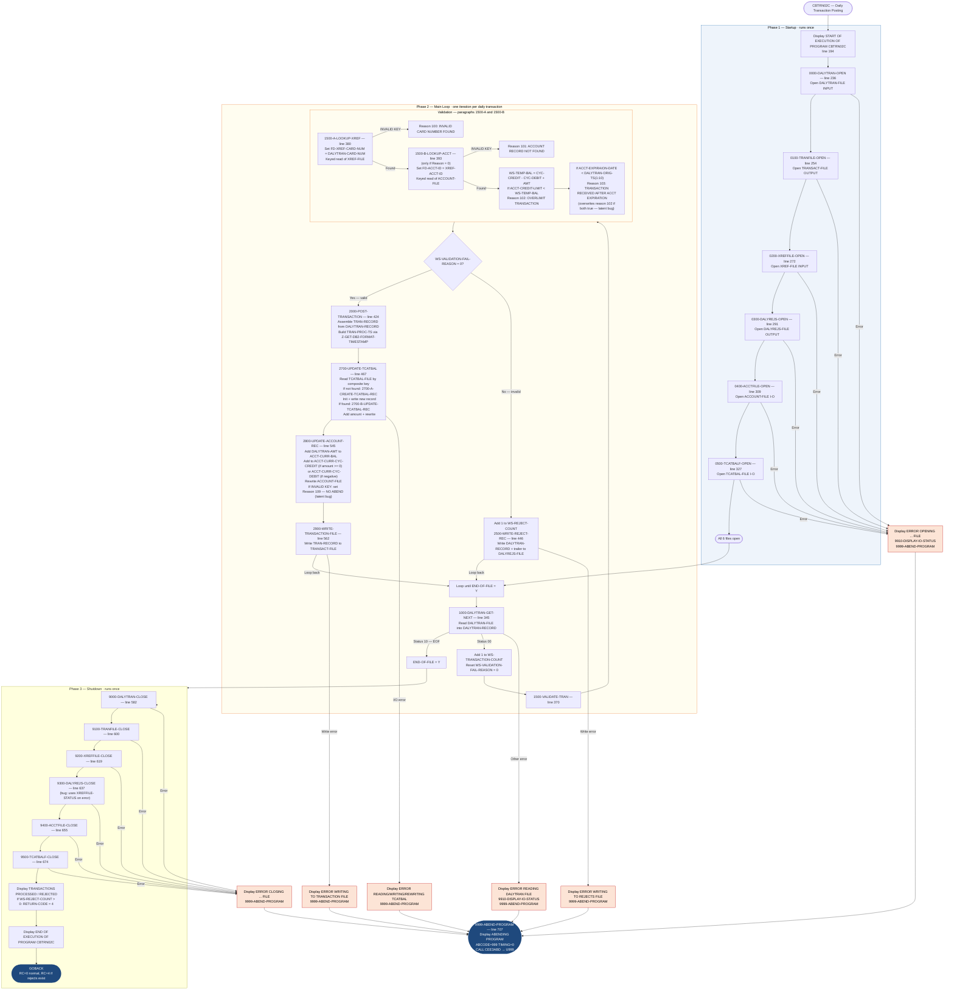

# CBTRN02C — Daily Transaction Posting

```
Application : AWS CardDemo
Source File : CBTRN02C.cbl
Type        : Batch COBOL Program
Source Banner: Program : CBTRN02C.CBL / Application : CardDemo / Type : BATCH COBOL Program / Function : Post the records from daily transaction file.
```

This document describes what the program does in plain English. All files, fields, copybooks, and external programs are named so a developer can trust this document instead of re-reading the COBOL source.

---

## 1. Purpose

CBTRN02C reads the **Daily Transaction File** (`DALYTRAN-FILE`, DDname `DALYTRAN`) sequentially and processes each transaction through a validation and posting workflow. This is the primary transaction-posting program in the CardDemo system.

For each transaction:
1. **Validates** the card number against the cross-reference file and checks credit limit and account expiration.
2. If valid, **posts** the transaction: updates the transaction-category balance file, updates the account master balance, and writes the transaction to the permanent transaction archive.
3. If invalid, **rejects** the transaction: writes it to a reject file with a reason code and description.

**What it reads:**
- **`DALYTRAN-FILE`** (DDname `DALYTRAN`): sequential flat file of daily transactions. Layout: `DALYTRAN-RECORD` from copybook `CVTRA06Y`.
- **`XREF-FILE`** (DDname `XREFFILE`): indexed VSAM card cross-reference. Layout: `CARD-XREF-RECORD` from copybook `CVACT03Y`.
- **`ACCOUNT-FILE`** (DDname `ACCTFILE`): indexed VSAM account master, opened I-O (read and update). Layout: `ACCOUNT-RECORD` from copybook `CVACT01Y`.
- **`TCATBAL-FILE`** (DDname `TCATBALF`): indexed VSAM transaction-category balance file, opened I-O (read/write/update). Layout: `TRAN-CAT-BAL-RECORD` from copybook `CVTRA01Y`.

**What it writes:**
- **`TRANSACT-FILE`** (DDname `TRANFILE`): indexed VSAM permanent transaction archive. One record written per validated transaction. Layout: `TRAN-RECORD` from copybook `CVTRA05Y`.
- **`DALYREJS-FILE`** (DDname `DALYREJS`): sequential reject file. One record written per failed transaction, containing the original transaction data plus a 4-digit reason code and 76-byte description.

**External programs called:** `CEE3ABD` (IBM Language Environment abend service).

**End-of-job behavior:** If any transactions were rejected (`WS-REJECT-COUNT > 0`), the program sets `RETURN-CODE` to 4 before `GOBACK`. This allows JCL `COND` logic to detect rejection.

---

## 2. Program Flow

### 2.1 Startup

All six files are opened using the same pattern: set `APPL-RESULT = 8`, open, check status, abend on failure.

**Step 1 — Open DALYTRAN-FILE for input** *(paragraph `0000-DALYTRAN-OPEN`, line 236).* On failure, displays `'ERROR OPENING DALYTRAN'` and abends.

**Step 2 — Open TRANSACT-FILE for output** *(paragraph `0100-TRANFILE-OPEN`, line 254).* On failure, displays `'ERROR OPENING TRANSACTION FILE'` and abends.

**Step 3 — Open XREF-FILE for input** *(paragraph `0200-XREFFILE-OPEN`, line 272).* On failure, displays `'ERROR OPENING CROSS REF FILE'` and abends.

**Step 4 — Open DALYREJS-FILE for output** *(paragraph `0300-DALYREJS-OPEN`, line 291).* On failure, displays `'ERROR OPENING DALY REJECTS FILE'` and abends.

**Step 5 — Open ACCOUNT-FILE for I-O** *(paragraph `0400-ACCTFILE-OPEN`, line 309).* Opened `I-O` to allow both reading and rewriting account records. On failure, displays `'ERROR OPENING ACCOUNT MASTER FILE'` and abends.

**Step 6 — Open TCATBAL-FILE for I-O** *(paragraph `0500-TCATBALF-OPEN`, line 327).* Opened `I-O` to allow reading, writing, and rewriting category balance records. On failure, displays `'ERROR OPENING TRANSACTION BALANCE FILE'` and abends.

Startup banner `'START OF EXECUTION OF PROGRAM CBTRN02C'` is displayed at line 194.

### 2.2 Per-Transaction Loop

The program loops until `END-OF-FILE = 'Y'`. The redundant inner guard `IF END-OF-FILE = 'N'` appears inside the loop (same template pattern as other CardDemo programs).

**Step 7 — Read next daily transaction** *(paragraph `1000-DALYTRAN-GET-NEXT`, line 345).* Reads the next record from `DALYTRAN-FILE` into `DALYTRAN-RECORD`. On status `'00'`, continues. On `'10'` (EOF), sets `END-OF-FILE = 'Y'`. On other status, displays `'ERROR READING DALYTRAN FILE'` and abends.

**Step 8 — Increment transaction counter and reset validation fields** *(lines 206–209).* `WS-TRANSACTION-COUNT` is incremented. `WS-VALIDATION-FAIL-REASON` is set to 0 and `WS-VALIDATION-FAIL-REASON-DESC` is set to spaces.

**Step 9 — Validate the transaction** *(paragraph `1500-VALIDATE-TRAN`, line 370).* Two validation sub-steps are performed in sequence:

**Step 9a — Cross-reference lookup** *(paragraph `1500-A-LOOKUP-XREF`, line 380).* `DALYTRAN-CARD-NUM` is moved to `FD-XREF-CARD-NUM` and a keyed read is issued against `XREF-FILE` into `CARD-XREF-RECORD`.
- If `INVALID KEY`: sets `WS-VALIDATION-FAIL-REASON = 100` and `WS-VALIDATION-FAIL-REASON-DESC = 'INVALID CARD NUMBER FOUND'`.
- If key found: continues.

**Step 9b — Account lookup and balance validation** *(paragraph `1500-B-LOOKUP-ACCT`, line 393).* Only performed if `WS-VALIDATION-FAIL-REASON = 0`. `XREF-ACCT-ID` is moved to `FD-ACCT-ID` and a keyed read is issued against `ACCOUNT-FILE` into `ACCOUNT-RECORD`.

If `INVALID KEY`: sets `WS-VALIDATION-FAIL-REASON = 101` and `WS-VALIDATION-FAIL-REASON-DESC = 'ACCOUNT RECORD NOT FOUND'`.

If found, two checks are made:

*Credit limit check:* Computes `WS-TEMP-BAL = ACCT-CURR-CYC-CREDIT - ACCT-CURR-CYC-DEBIT + DALYTRAN-AMT`. If `ACCT-CREDIT-LIMIT < WS-TEMP-BAL` (i.e., the posting would exceed the credit limit): sets reason code 102, description `'OVERLIMIT TRANSACTION'`.

*Expiration date check:* Compares `ACCT-EXPIRAION-DATE` (note typo preserved) against `DALYTRAN-ORIG-TS(1:10)` (the first 10 bytes of the original timestamp, which is the date portion). If `ACCT-EXPIRAION-DATE < DALYTRAN-ORIG-TS(1:10)` (account expired before the transaction date): sets reason code 103, description `'TRANSACTION RECEIVED AFTER ACCT EXPIRATION'`.

**Note:** Both validation checks are always executed independently — the expiration check does not short-circuit if the overlimit check already set a reason code. **The last check wins.** If both conditions are true, the final `WS-VALIDATION-FAIL-REASON` will be 103 (expiration) and reason 102 (overlimit) is silently overwritten.

**Step 10 — Branch: post or reject** *(lines 211–216).* If `WS-VALIDATION-FAIL-REASON = 0`, the transaction is valid → perform `2000-POST-TRANSACTION`. Otherwise, increment `WS-REJECT-COUNT` and perform `2500-WRITE-REJECT-REC`.

**Step 11 — Write reject record** *(paragraph `2500-WRITE-REJECT-REC`, line 446).* Copies `DALYTRAN-RECORD` to `REJECT-TRAN-DATA` and `WS-VALIDATION-TRAILER` to `VALIDATION-TRAILER` in the `REJECT-RECORD` structure. Writes `FD-REJS-RECORD` from `REJECT-RECORD` to `DALYREJS-FILE`. On status other than `'00'`, displays `'ERROR WRITING TO REJECTS FILE'` and abends.

**Step 12 — Post valid transaction** *(paragraph `2000-POST-TRANSACTION`, line 424).* Assembles `TRAN-RECORD` from `DALYTRAN-RECORD` fields (all 13 transaction fields are copied directly). Calls `Z-GET-DB2-FORMAT-TIMESTAMP` to build a DB2-format processing timestamp from `FUNCTION CURRENT-DATE`, then stores it in `TRAN-PROC-TS`. Then performs three sub-steps in order:

**Step 12a — Update transaction-category balance** *(paragraph `2700-UPDATE-TCATBAL`, line 467).* Sets the composite key `FD-TRAN-CAT-KEY` from `XREF-ACCT-ID` + `DALYTRAN-TYPE-CD` + `DALYTRAN-CAT-CD` and reads `TCATBAL-FILE`. If `INVALID KEY` (status `'23'`), sets flag `WS-CREATE-TRANCAT-REC = 'Y'`. If found, clears the flag.

- If create flag is `'Y'`: calls `2700-A-CREATE-TCATBAL-REC` — initializes `TRAN-CAT-BAL-RECORD`, sets key fields from `XREF-ACCT-ID` / `DALYTRAN-TYPE-CD` / `DALYTRAN-CAT-CD`, adds `DALYTRAN-AMT` to `TRAN-CAT-BAL`, and writes a new record to `TCATBAL-FILE`. On write failure, displays `'ERROR WRITING TRANSACTION BALANCE FILE'` and abends.
- If existing record found: calls `2700-B-UPDATE-TCATBAL-REC` — adds `DALYTRAN-AMT` to `TRAN-CAT-BAL` and rewrites the record. On rewrite failure, displays `'ERROR REWRITING TRANSACTION BALANCE FILE'` and abends.

**Step 12b — Update account balance** *(paragraph `2800-UPDATE-ACCOUNT-REC`, line 545).* Adds `DALYTRAN-AMT` to `ACCT-CURR-BAL`. If `DALYTRAN-AMT >= 0`, also adds it to `ACCT-CURR-CYC-CREDIT`; if negative, adds it (which reduces) `ACCT-CURR-CYC-DEBIT`. Then rewrites `FD-ACCTFILE-REC` from `ACCOUNT-RECORD`. If `INVALID KEY` on the rewrite: sets `WS-VALIDATION-FAIL-REASON = 109` and description `'ACCOUNT RECORD NOT FOUND'` — but **does not abend or reject the transaction**. The failed rewrite is silently ignored (see Migration Note 1).

**Step 12c — Write permanent transaction record** *(paragraph `2900-WRITE-TRANSACTION-FILE`, line 562).* Writes `FD-TRANFILE-REC` from `TRAN-RECORD` to `TRANSACT-FILE`. On status other than `'00'`, displays `'ERROR WRITING TO TRANSACTION FILE'` and abends.

### 2.3 Shutdown

All six files are explicitly closed after the loop.

**Steps 13–18 — Close all files** *(paragraphs `9000-DALYTRAN-CLOSE` through `9500-TCATBALF-CLOSE`, lines 582–690).*

Each close displays an error message and abends on failure. **One bug:** `9300-DALYREJS-CLOSE` (line 637) on failure uses `XREFFILE-STATUS` instead of `DALYREJS-STATUS` to format the error — the status code logged will be from the cross-reference file, not the rejects file (see Migration Note 2).

**Step 19 — Display final counts** *(lines 227–231).* Displays:
```
TRANSACTIONS PROCESSED :<WS-TRANSACTION-COUNT>
TRANSACTIONS REJECTED  :<WS-REJECT-COUNT>
```
If `WS-REJECT-COUNT > 0`, sets `RETURN-CODE = 4`.

**Step 20 — Return** *(line 233).* Displays `'END OF EXECUTION OF PROGRAM CBTRN02C'` and issues `GOBACK`.

---

## 3. Error Handling

### 3.1 Status Display — `9910-DISPLAY-IO-STATUS` (line 714)

Same two-byte status formatter as CBTRN01C / CBACT01C: formats numeric statuses as `0000`-padded, and system-level binary statuses via the `TWO-BYTES-BINARY` overlay. Displays with prefix `'FILE STATUS IS: NNNN'`.

### 3.2 Abend Routine — `9999-ABEND-PROGRAM` (line 707)

Displays `'ABENDING PROGRAM'`, sets `TIMING = 0` and `ABCODE = 999`, calls `CEE3ABD` → `U999`.

### 3.3 Timestamp Builder — `Z-GET-DB2-FORMAT-TIMESTAMP` (line 692)

Not an error handler, but called during posting. Reads `FUNCTION CURRENT-DATE` (a 21-character string: `YYYYMMDDHHmmsscc...`) into `COBOL-TS`, then assembles `DB2-FORMAT-TS` in the format `YYYY-MM-DD-HH.MM.SS.CC0000`. The six separator characters (`-`, `-`, `-`, `.`, `.`, `.`) are set inline. The `DB2-REST` field is hardcoded to `'0000'`. This 26-byte result becomes `TRAN-PROC-TS` in the transaction record.

---

## 4. Migration Notes

1. **Account rewrite failure in `2800-UPDATE-ACCOUNT-REC` is silently ignored (line 554–559).** When `REWRITE FD-ACCTFILE-REC` returns `INVALID KEY`, the program sets `WS-VALIDATION-FAIL-REASON = 109` but does not abend, does not increment `WS-REJECT-COUNT`, and does not write a reject record. The transaction is written to `TRANSACT-FILE` as if fully posted, but the account balance was not updated. This is a critical data-consistency defect: a transaction can be permanently recorded as posted even though the account record was not updated.

2. **`9300-DALYREJS-CLOSE` (line 649) uses `XREFFILE-STATUS` instead of `DALYREJS-STATUS`** when reporting a close error for `DALYREJS-FILE`. The file status logged will be from the last operation on `XREF-FILE`, not from the `DALYREJS-FILE` close.

3. **Both validation checks in `1500-B-LOOKUP-ACCT` always execute; the last one wins (lines 407–420).** If both overlimit (102) and expired (103) conditions are true, reason code 103 overwrites reason code 102, and the reason code 102 is lost. The reject record will contain only reason 103. A Java migration should collect all violations or stop at the first one — the COBOL behavior must be explicitly preserved or changed by design decision.

4. **`DALYTRAN-PROC-TS` in `CVTRA06Y` is never set or used.** The daily transaction record has a `DALYTRAN-PROC-TS` field (26 bytes), but CBTRN02C never reads it. The processing timestamp written to `TRAN-PROC-TS` in the output is built freshly from `FUNCTION CURRENT-DATE` in `Z-GET-DB2-FORMAT-TIMESTAMP`, not from the input file.

5. **The `DB2-FORMAT-TS` / `COBOL-TS` fields have inline comments on the redefines (lines 161–174): `E`, `-`, `M`, `-`, `D`, `-`, `U`, etc.** These are column-A debugging annotations embedded in the source that produce strange artifacts in listing prints. They are harmless but confusing.

6. **`WS-TEMP-BAL` is declared `PIC S9(09)V99`** (line 187). `ACCT-CURR-CYC-CREDIT` and `ACCT-CURR-CYC-DEBIT` are both `PIC S9(10)V99` (10 integer digits). The computation `ACCT-CURR-CYC-CREDIT - ACCT-CURR-CYC-DEBIT + DALYTRAN-AMT` assigns the result to a 9-integer-digit field. If the sum requires 10 digits, there is a silent overflow that truncates the leading digit. Java migration must use `BigDecimal` throughout.

7. **`TRAN-CAT-BAL` in `CVTRA01Y` is `PIC S9(09)V99`** — display signed, no COMP-3. However, `DALYTRAN-AMT` (which is added to it) is also `PIC S9(09)V99`. These are not COMP-3 fields; no BigDecimal concern exists for `TRAN-CAT-BAL` itself, but see note 6 above for the `WS-TEMP-BAL` overflow risk.

8. **`ACCT-EXPIRAION-DATE` is a typo** in `CVACT01Y.cpy` (preserved from the copybook). The expiration date comparison at line 414 uses this misspelled field name. Any search in a migration for `ACCT-EXPIRATION-DATE` (correctly spelled) will miss this reference.

9. **`COBOL-TS` has `COB-MIL` (PIC X(02), milliseconds) but the `FUNCTION CURRENT-DATE` intrinsic function returns hundredths of seconds in positions 15–16.** The field is labeled "milliseconds" (implied by `MIL`) but the source is actually centiseconds. The label is misleading.

10. **The redundant inner guard `IF END-OF-FILE = 'N'` (line 203)** is always true while the loop runs. Same template pattern as other programs.

---

## Appendix A — Files

| Logical Name | DDname | Organization | Recording | Key Field | Direction | Contents |
|---|---|---|---|---|---|---|
| `DALYTRAN-FILE` | `DALYTRAN` | Sequential | Fixed 350 bytes | N/A | Input | Daily transaction records. One per transaction. |
| `TRANSACT-FILE` | `TRANFILE` | INDEXED | 350 bytes | `FD-TRANS-ID` PIC X(16) | Output | Permanent transaction archive. One record written per valid transaction. |
| `XREF-FILE` | `XREFFILE` | INDEXED | 50 bytes | `FD-XREF-CARD-NUM` PIC X(16) | Input | Card cross-reference. Random read by card number during validation. |
| `DALYREJS-FILE` | `DALYREJS` | Sequential | 430 bytes (350 + 80) | N/A | Output | Transaction reject file. One record per failed validation, with reason code + description. |
| `ACCOUNT-FILE` | `ACCTFILE` | INDEXED | 300 bytes | `FD-ACCT-ID` PIC 9(11) | I-O (read + rewrite) | Account master. Random read for validation; rewrite to update balances after posting. |
| `TCATBAL-FILE` | `TCATBALF` | INDEXED | 50 bytes | `FD-TRAN-CAT-KEY` (11+2+4 = 17 bytes) | I-O (read + write + rewrite) | Transaction category balance. Random read, create, or update per transaction category per account. |

---

## Appendix B — Copybooks and External Programs

### Copybook `CVTRA06Y` (WORKING-STORAGE, line 102 — defines `DALYTRAN-RECORD`)

Source file: `CVTRA06Y.cpy`. Total record length: 350 bytes.

| Field | PIC | Bytes | Notes |
|---|---|---|---|
| `DALYTRAN-ID` | `X(16)` | 16 | Transaction ID. Copied to `TRAN-ID` when posting. |
| `DALYTRAN-TYPE-CD` | `X(02)` | 2 | Type code. Used as part of `TCATBAL-FILE` composite key. Copied to `TRAN-TYPE-CD`. |
| `DALYTRAN-CAT-CD` | `9(04)` | 4 | Category code. Used as part of `TCATBAL-FILE` composite key. Copied to `TRAN-CAT-CD`. |
| `DALYTRAN-SOURCE` | `X(10)` | 10 | Source. Copied to `TRAN-SOURCE`. |
| `DALYTRAN-DESC` | `X(100)` | 100 | Description. Copied to `TRAN-DESC`. |
| `DALYTRAN-AMT` | `S9(09)V99` | 11 | Amount. Used in credit-limit validation and balance updates. Copied to `TRAN-AMT`. |
| `DALYTRAN-MERCHANT-ID` | `9(09)` | 9 | Merchant ID. Copied to `TRAN-MERCHANT-ID`. |
| `DALYTRAN-MERCHANT-NAME` | `X(50)` | 50 | Merchant name. Copied to `TRAN-MERCHANT-NAME`. |
| `DALYTRAN-MERCHANT-CITY` | `X(50)` | 50 | Merchant city. Copied to `TRAN-MERCHANT-CITY`. |
| `DALYTRAN-MERCHANT-ZIP` | `X(10)` | 10 | Merchant ZIP. Copied to `TRAN-MERCHANT-ZIP`. |
| `DALYTRAN-CARD-NUM` | `X(16)` | 16 | Card number. Used as XREF lookup key. Copied to `TRAN-CARD-NUM`. |
| `DALYTRAN-ORIG-TS` | `X(26)` | 26 | Original timestamp. First 10 bytes used in expiration check. Copied to `TRAN-ORIG-TS`. |
| `DALYTRAN-PROC-TS` | `X(26)` | 26 | Processing timestamp from source. **Never read — `TRAN-PROC-TS` is set from `FUNCTION CURRENT-DATE` instead.** |
| `FILLER` | `X(20)` | 20 | Padding. Not referenced. |

### Copybook `CVTRA05Y` (WORKING-STORAGE, line 107 — defines `TRAN-RECORD`)

Source file: `CVTRA05Y.cpy`. Total record length: 350 bytes.

| Field | PIC | Bytes | Notes |
|---|---|---|---|
| `TRAN-ID` | `X(16)` | 16 | Transaction ID. Set from `DALYTRAN-ID`. Written to TRANFILE key. |
| `TRAN-TYPE-CD` | `X(02)` | 2 | Type code. Set from `DALYTRAN-TYPE-CD`. |
| `TRAN-CAT-CD` | `9(04)` | 4 | Category code. Set from `DALYTRAN-CAT-CD`. |
| `TRAN-SOURCE` | `X(10)` | 10 | Source. Set from `DALYTRAN-SOURCE`. |
| `TRAN-DESC` | `X(100)` | 100 | Description. Set from `DALYTRAN-DESC`. |
| `TRAN-AMT` | `S9(09)V99` | 11 | Amount. Set from `DALYTRAN-AMT`. |
| `TRAN-MERCHANT-ID` | `9(09)` | 9 | Merchant ID. Set from `DALYTRAN-MERCHANT-ID`. |
| `TRAN-MERCHANT-NAME` | `X(50)` | 50 | Merchant name. Set from `DALYTRAN-MERCHANT-NAME`. |
| `TRAN-MERCHANT-CITY` | `X(50)` | 50 | Merchant city. Set from `DALYTRAN-MERCHANT-CITY`. |
| `TRAN-MERCHANT-ZIP` | `X(10)` | 10 | Merchant ZIP. Set from `DALYTRAN-MERCHANT-ZIP`. |
| `TRAN-CARD-NUM` | `X(16)` | 16 | Card number. Set from `DALYTRAN-CARD-NUM`. |
| `TRAN-ORIG-TS` | `X(26)` | 26 | Original timestamp. Set from `DALYTRAN-ORIG-TS`. |
| `TRAN-PROC-TS` | `X(26)` | 26 | Processing timestamp. Set from `DB2-FORMAT-TS` (built at time of posting). |
| `FILLER` | `X(20)` | 20 | Padding. Set implicitly. |

### Copybook `CVACT03Y` (WORKING-STORAGE, line 112 — defines `CARD-XREF-RECORD`)

Source file: `CVACT03Y.cpy`. Total record length: 50 bytes.

| Field | PIC | Bytes | Notes |
|---|---|---|---|
| `XREF-CARD-NUM` | `X(16)` | 16 | Card number key. Set from `DALYTRAN-CARD-NUM` before keyed read. |
| `XREF-CUST-ID` | `9(09)` | 9 | Customer ID. **Read from disk but never used after validation.** |
| `XREF-ACCT-ID` | `9(11)` | 11 | Account ID. Used as key for account lookup and for `FD-TRANCAT-ACCT-ID`. |
| `FILLER` | `X(14)` | 14 | Padding. Not referenced. |

### Copybook `CVACT01Y` (WORKING-STORAGE, line 121 — defines `ACCOUNT-RECORD`)

Source file: `CVACT01Y.cpy`. Total record length: 300 bytes.

| Field | PIC | Bytes | Notes |
|---|---|---|---|
| `ACCT-ID` | `9(11)` | 11 | Account number. **Not referenced — `FD-ACCT-ID` is set directly from `XREF-ACCT-ID`.** |
| `ACCT-ACTIVE-STATUS` | `X(01)` | 1 | Active flag. **Read from disk but never checked.** |
| `ACCT-CURR-BAL` | `S9(10)V99` | 12 | Current balance. Updated in `2800-UPDATE-ACCOUNT-REC`. |
| `ACCT-CREDIT-LIMIT` | `S9(10)V99` | 12 | Credit limit. Used in overlimit check. |
| `ACCT-CASH-CREDIT-LIMIT` | `S9(10)V99` | 12 | Cash-advance limit. **Read from disk but never checked.** |
| `ACCT-OPEN-DATE` | `X(10)` | 10 | Open date. **Read from disk but never referenced.** |
| `ACCT-EXPIRAION-DATE` | `X(10)` | 10 | Expiry date *(typo: "EXPIRAION" — preserved)*. Used in expiration check. |
| `ACCT-REISSUE-DATE` | `X(10)` | 10 | Reissue date. **Read from disk but never referenced.** |
| `ACCT-CURR-CYC-CREDIT` | `S9(10)V99` | 12 | Cycle credits. Used in `WS-TEMP-BAL` computation and updated in `2800`. |
| `ACCT-CURR-CYC-DEBIT` | `S9(10)V99` | 12 | Cycle debits. Used in `WS-TEMP-BAL` computation and updated in `2800`. |
| `ACCT-ADDR-ZIP` | `X(10)` | 10 | ZIP code. **Read from disk but never referenced.** |
| `ACCT-GROUP-ID` | `X(10)` | 10 | Group ID. **Read from disk but never referenced.** |
| `FILLER` | `X(178)` | 178 | Padding. Not referenced. |

### Copybook `CVTRA01Y` (WORKING-STORAGE, line 126 — defines `TRAN-CAT-BAL-RECORD`)

Source file: `CVTRA01Y.cpy`. Total record length: 50 bytes.

| Field | PIC | Bytes | Notes |
|---|---|---|---|
| `TRAN-CAT-KEY` (group) | — | 17 | Composite KSDS key for TCATBAL-FILE |
| `TRANCAT-ACCT-ID` | `9(11)` | 11 | Account ID portion of key. Set from `XREF-ACCT-ID`. |
| `TRANCAT-TYPE-CD` | `X(02)` | 2 | Transaction type code portion of key. Set from `DALYTRAN-TYPE-CD`. |
| `TRANCAT-CD` | `9(04)` | 4 | Category code portion of key. Set from `DALYTRAN-CAT-CD`. |
| `TRAN-CAT-BAL` | `S9(09)V99` | 11 | Running balance for this account/type/category combination. Incremented by `DALYTRAN-AMT`. |
| `FILLER` | `X(22)` | 22 | Padding. Not referenced. |

### External Service `CEE3ABD`

| Item | Detail |
|---|---|
| Type | IBM Language Environment forced abend service |
| Called from | `9999-ABEND-PROGRAM`, line 711 |
| `ABCODE` | `PIC S9(9) BINARY`, set to `999` — produces `U999` |
| `TIMING` | `PIC S9(9) BINARY`, set to `0` — immediate abend |

---

## Appendix C — Hardcoded Literals

| Paragraph | Line | Value | Usage | Classification |
|---|---|---|---|---|
| `MAIN-PARA` | 194 | `'START OF EXECUTION OF PROGRAM CBTRN02C'` | Startup banner | Display message |
| `MAIN-PARA` | 232 | `'END OF EXECUTION OF PROGRAM CBTRN02C'` | Shutdown banner | Display message |
| `1500-A-LOOKUP-XREF` | 385 | `100` | Reason code: invalid card number | Business rule |
| `1500-B-LOOKUP-ACCT` | 397 | `101` | Reason code: account not found | Business rule |
| `1500-B-LOOKUP-ACCT` | 410 | `102` | Reason code: overlimit transaction | Business rule |
| `1500-B-LOOKUP-ACCT` | 417 | `103` | Reason code: expired account | Business rule |
| `2800-UPDATE-ACCOUNT-REC` | 556 | `109` | Internal failure code: account rewrite not found | Internal convention |
| `MAIN-PARA` | 230 | `4` | `RETURN-CODE` value when rejects exist | System constant |
| `Z-GET-DB2-FORMAT-TIMESTAMP` | 701 | `'0000'` | Appended to DB2 timestamp to fill `DB2-REST` | System constant |
| All open/close paragraphs | Various | `8`, `0`, `12` | `APPL-RESULT` progress codes | Internal convention |
| `9999-ABEND-PROGRAM` | 709, 710 | `0`, `999` | `TIMING` and `ABCODE` for `CEE3ABD` | System constant |

---

## Appendix D — Internal Working Fields

| Field | PIC | Bytes | Purpose |
|---|---|---|---|
| `END-OF-FILE` | `X(01)` | 1 | Set to `'Y'` when `DALYTRAN-FILE` returns EOF. Controls main loop. |
| `APPL-RESULT` | `S9(9) COMP` | 4 | Numeric result. 88-levels: `APPL-AOK = 0`, `APPL-EOF = 16`. |
| `WS-TRANSACTION-COUNT` | `9(09)` | 5 | Total transactions read from `DALYTRAN-FILE`. Displayed at shutdown. |
| `WS-REJECT-COUNT` | `9(09)` | 5 | Count of failed validation transactions. Displayed at shutdown; sets `RETURN-CODE = 4` if > 0. |
| `WS-TEMP-BAL` | `S9(09)V99` | 11 | Temporary balance: `ACCT-CURR-CYC-CREDIT - ACCT-CURR-CYC-DEBIT + DALYTRAN-AMT`. Used in overlimit check. Risk of overflow for 10-digit account fields. |
| `WS-VALIDATION-FAIL-REASON` | `9(04)` | 4 | 0 = valid; 100/101/102/103 = specific failure code. |
| `WS-VALIDATION-FAIL-REASON-DESC` | `X(76)` | 76 | Plain-text reason for validation failure. Written to reject record. |
| `WS-CREATE-TRANCAT-REC` | `X(01)` | 1 | `'Y'` if `TCATBAL-FILE` key was not found (new record needed); `'N'` if existing. |
| `REJECT-RECORD` / `REJECT-TRAN-DATA` (X(350)) / `VALIDATION-TRAILER` (X(80)) | 430 bytes | — | Reject record written to `DALYREJS-FILE`. Combines raw input data + trailer. |
| `WS-VALIDATION-TRAILER` / `WS-VALIDATION-FAIL-REASON` / `WS-VALIDATION-FAIL-REASON-DESC` | 80 bytes | — | Structured trailer appended to reject records. |
| `COBOL-TS` | 19 bytes | — | Receives `FUNCTION CURRENT-DATE` output. Parsed into year/month/day/hour/min/sec/centisecond parts. |
| `DB2-FORMAT-TS` | `X(26)` | 26 | DB2 timestamp string assembled in `Z-GET-DB2-FORMAT-TIMESTAMP`. Format: `YYYY-MM-DD-HH.MM.SS.CC0000`. |
| `IO-STATUS` / `IO-STAT1` / `IO-STAT2` | `X(02)` | 2 | Two-byte file status passed to `9910-DISPLAY-IO-STATUS`. |
| `IO-STATUS-04` | 4 bytes | — | Formatted 4-character status display. |
| `TWO-BYTES-BINARY` / `TWO-BYTES-ALPHA` | `9(4) BINARY` / `X + X` | 2 | Binary-to-decimal conversion overlay for binary status bytes. |
| `ABCODE` | `S9(9) BINARY` | 4 | Abend code: 999. |
| `TIMING` | `S9(9) BINARY` | 4 | Timing: 0 (immediate). |

---

## Appendix E — Execution at a Glance



---

*Source: `CBTRN02C.cbl`, CardDemo, Apache 2.0 license. Copybooks: `CVTRA06Y.cpy`, `CVTRA05Y.cpy`, `CVACT03Y.cpy`, `CVACT01Y.cpy`, `CVTRA01Y.cpy`. External programs: `CEE3ABD` (IBM Language Environment). Version stamp: `CardDemo_v2.0-25-gdb72e6b-235 Date: 2025-04-29 11:01:29 CDT`. All field names, paragraph names, reason codes, and literal values are taken directly from the source files.*
