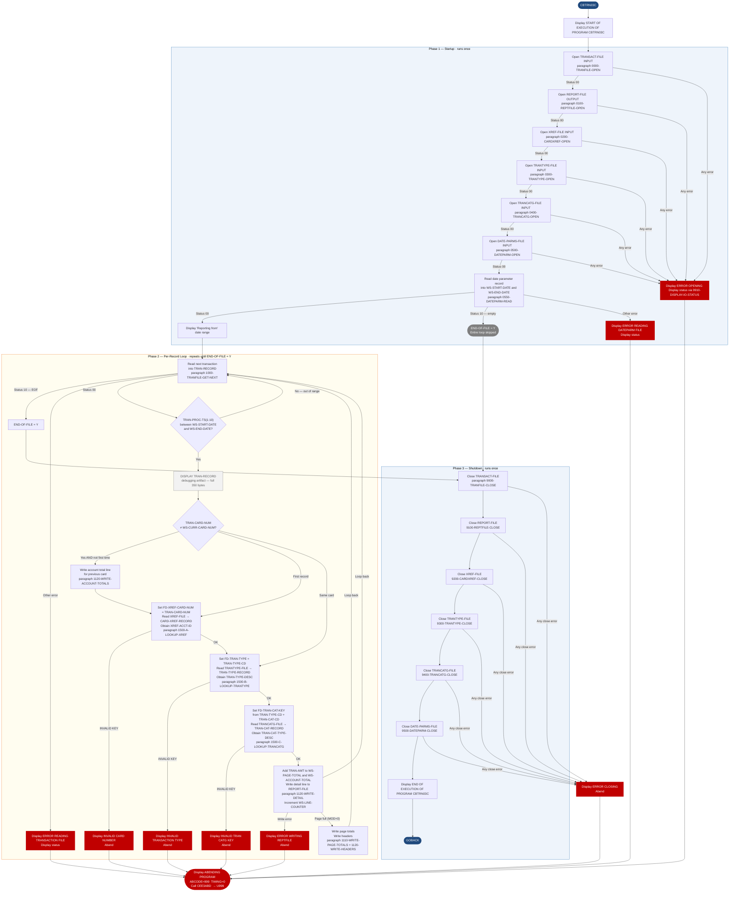

Application : AWS CardDemo
Source File : CBTRN03C.cbl
Type        : Batch COBOL
Source Banner: Program: CBTRN03C.CBL / Application: CardDemo / Type: BATCH COBOL Program / Function: Print the transaction detail report.

# CBTRN03C — Transaction Detail Report

This document describes what the program does in plain English. It treats the program as a sequence of data actions and names every file, field, copybook, and external program so a Java developer can trust this document instead of re-reading the COBOL source.

---

## 1. Purpose

CBTRN03C reads a sequential transaction file (`TRANSACT-FILE`, DDname `TRANFILE`) and produces a formatted transaction detail report (`REPORT-FILE`, DDname `TRANREPT`). For each transaction, it performs three random-access lookups — one against a card cross-reference KSDS to find the account linked to the card, one against a transaction-type KSDS to find the human-readable type description, and one against a transaction-category KSDS to find the category description. The program also reads a one-record date-parameter file (`DATE-PARMS-FILE`, DDname `DATEPARM`) at startup to obtain the start and end dates of the reporting window; only transactions whose processing timestamp falls within that window are included in the report.

The report groups transactions by card number, writing a per-card account total line each time the card number changes. It also writes running page totals every 20 lines and a single grand total at the end.

No external programs are called by name in the PROCEDURE DIVISION (only IBM Language Environment service `CEE3ABD` for abend handling).

---

## 2. Program Flow

### 2.1 Startup

**Step 1 — Open six files** *(lines 161–165).* The program opens `TRANSACT-FILE`, `REPORT-FILE`, `XREF-FILE`, `TRANTYPE-FILE`, `TRANCATG-FILE`, and `DATE-PARMS-FILE` in sequence. Each open is performed by a dedicated paragraph (`0000-TRANFILE-OPEN` through `0500-DATEPARM-OPEN`, lines 376–482). Each paragraph initialises `APPL-RESULT` to `8`, opens the file, then checks the status: `'00'` sets `APPL-RESULT` to `0` (`APPL-AOK`); anything else sets it to `12`. On failure, each paragraph logs one of the following messages and abends:
- `'ERROR OPENING TRANFILE'`
- `'ERROR OPENING REPTFILE'`
- `'ERROR OPENING CROSS REF FILE'`
- `'ERROR OPENING TRANSACTION TYPE FILE'`
- `'ERROR OPENING TRANSACTION CATG FILE'`
- `'ERROR OPENING DATE PARM FILE'`

**Step 2 — Read the date parameter record** *(paragraph `0550-DATEPARM-READ`, line 220).* Reads one record from `DATE-PARMS-FILE` into `WS-DATEPARM-RECORD` which overlays the 80-byte FD record as `WS-START-DATE` (X(10), positions 1–10) and `WS-END-DATE` (X(10), positions 12–21; a 1-byte filler separator sits at position 11). Status `'00'` proceeds; status `'10'` (empty file) sets `END-OF-FILE` to `'Y'`, meaning the entire transaction loop is skipped; any other status logs `'ERROR READING DATEPARM FILE'` and abends.

**Step 3 — Display the date range** *(line 232).* If the date read was successful, displays `'Reporting from '` + `WS-START-DATE` + `' to '` + `WS-END-DATE`.

### 2.2 Per-Record Loop

The main loop iterates `PERFORM UNTIL END-OF-FILE = 'Y'`. An inner guard `IF END-OF-FILE = 'N'` is redundant (the outer test already ensures this; see Migration Note 1).

**Step 4 — Read the next transaction** *(paragraph `1000-TRANFILE-GET-NEXT`, line 248).* Reads from `TRANSACT-FILE` into `TRAN-RECORD` (defined by copybook `CVTRA05Y`). Status `'00'` → success; `'10'` → sets `END-OF-FILE = 'Y'`; other → logs `'ERROR READING TRANSACTION FILE'` and abends.

**Step 5 — Date-range filter** *(lines 173–178).* The first ten bytes of `TRAN-PROC-TS` (the processing timestamp, `YYYY-MM-DD`) are compared to `WS-START-DATE` and `WS-END-DATE`. If the transaction's date falls outside the window, `NEXT SENTENCE` skips all further processing for this record and the loop reads the next transaction. Transactions within the window continue to step 6.

**Step 6 — Display raw record to job log** *(line 180).* `DISPLAY TRAN-RECORD` writes the entire 350-byte `TRAN-RECORD` to the job log. This is a debugging artifact left in the code (see Migration Note 2).

**Step 7 — Detect card-number change** *(lines 181–188).* If `TRAN-CARD-NUM` differs from `WS-CURR-CARD-NUM` (the card number of the previous record), the program:
  - If this is not the first transaction (`WS-FIRST-TIME = 'N'`), writes the per-card account total by calling `1120-WRITE-ACCOUNT-TOTALS` (line 306).
  - Saves `TRAN-CARD-NUM` into `WS-CURR-CARD-NUM` and into `FD-XREF-CARD-NUM` (the KSDS key field).
  - Calls `1500-A-LOOKUP-XREF` (line 484) to fetch the cross-reference record for this card number.

**Step 8 — Look up transaction type** *(line 189–190).* The `TRAN-TYPE-CD` from the current transaction is moved to `FD-TRAN-TYPE` (the type-file key field). Paragraph `1500-B-LOOKUP-TRANTYPE` (line 494) performs a random read of `TRANTYPE-FILE` into `TRAN-TYPE-RECORD`, giving `TRAN-TYPE-DESC` (50 bytes).

**Step 9 — Look up transaction category** *(lines 191–195).* Both `TRAN-TYPE-CD` and `TRAN-CAT-CD` from the current transaction are moved into the composite key `FD-TRAN-CAT-KEY`. Paragraph `1500-C-LOOKUP-TRANCATG` (line 504) performs a random read of `TRANCATG-FILE` into `TRAN-CAT-RECORD`, giving `TRAN-CAT-TYPE-DESC` (50 bytes).

**Step 10 — Write the detail line** *(paragraph `1100-WRITE-TRANSACTION-REPORT`, line 274).* On the very first transaction (`WS-FIRST-TIME = 'Y'`), the start and end dates from the parameter record are placed into `REPT-START-DATE` and `REPT-END-DATE` within `REPORT-NAME-HEADER`, and `1120-WRITE-HEADERS` writes the report header and column headings. `WS-FIRST-TIME` is then set to `'N'`. Every 20 lines (when `WS-LINE-COUNTER MOD WS-PAGE-SIZE = 0`), page totals and a new header are written. The transaction amount `TRAN-AMT` is added to both `WS-PAGE-TOTAL` and `WS-ACCOUNT-TOTAL`. Paragraph `1120-WRITE-DETAIL` (line 361) initialises `TRANSACTION-DETAIL-REPORT`, populates it from the current transaction and the two lookup results, and writes it to the report file.

**Step 11 — Post-EOF dead code** *(lines 197–203).* After the inner `END-OF-FILE = 'N'` check, there is an `ELSE` branch that runs when `END-OF-FILE = 'Y'` but the outer loop has not yet exited. This branch displays `TRAN-AMT` and `WS-PAGE-TOTAL` debug messages, adds `TRAN-AMT` to totals, and calls `1110-WRITE-PAGE-TOTALS` and `1110-WRITE-GRAND-TOTALS`. In practice `END-OF-FILE` is only set by the read paragraph, and the loop guard prevents entry after EOF is set, so this branch is unreachable in normal execution (see Migration Note 3).

### 2.3 Shutdown

**Step 12 — Close all six files** *(paragraphs `9000-TRANFILE-CLOSE` through `9500-DATEPARM-CLOSE`, lines 514–621).* Each file is closed in its own paragraph using the arithmetic-idiom pattern (`ADD 8 TO ZERO GIVING APPL-RESULT` on entry, `SUBTRACT APPL-RESULT FROM APPL-RESULT` on success). On failure, each logs one of the following messages and abends:
- `'ERROR CLOSING POSTED TRANSACTION FILE'`
- `'ERROR CLOSING REPORT FILE'`
- `'ERROR CLOSING CROSS REF FILE'`
- `'ERROR CLOSING TRANSACTION TYPE FILE'`
- `'ERROR CLOSING TRANSACTION CATG FILE'`
- `'ERROR CLOSING DATE PARM FILE'`

**Step 13 — Display end banner and return** *(line 215).* Displays `'END OF EXECUTION OF PROGRAM CBTRN03C'` then issues `GOBACK`.

---

## 3. Error Handling

### 3.1 File Open Errors

Each of the six open paragraphs (lines 376–482) follows the same pattern: display an error message naming the file, move the file-status variable to `IO-STATUS`, call `9910-DISPLAY-IO-STATUS`, then call `9999-ABEND-PROGRAM`.

### 3.2 Status Decoder — `9910-DISPLAY-IO-STATUS` (line 633)

Same decoder as in the exemplar CBACT01C. Two-byte file status codes are formatted as a four-digit string held in `IO-STATUS-04`. For system-level errors (`IO-STAT1 = '9'`), the binary second byte is converted to decimal. Displays `'FILE STATUS IS: NNNN'` + the formatted code.

### 3.3 Abend Routine — `9999-ABEND-PROGRAM` (line 626)

Displays `'ABENDING PROGRAM'`, sets `TIMING` to `0` and `ABCODE` to `999`, then calls `CEE3ABD USING ABCODE, TIMING`. Produces job completion code `U999`.

### 3.4 Invalid Key Lookups (lines 487–512)

All three lookup paragraphs use `READ ... INVALID KEY`. On an invalid key:
- `1500-A-LOOKUP-XREF`: displays `'INVALID CARD NUMBER : '` + `FD-XREF-CARD-NUM`, then abends.
- `1500-B-LOOKUP-TRANTYPE`: displays `'INVALID TRANSACTION TYPE : '` + `FD-TRAN-TYPE`, then abends.
- `1500-C-LOOKUP-TRANCATG`: displays `'INVALID TRAN CATG KEY : '` + `FD-TRAN-CAT-KEY`, then abends.

All three invalid-key handlers set `IO-STATUS` to `23` (a synthetic value meaning "not found") before calling `9910-DISPLAY-IO-STATUS`.

### 3.5 Report Write Error — paragraph `1111-WRITE-REPORT-REC` (line 343)

After every write to `REPORT-FILE`, status `'00'` sets `APPL-RESULT` to `0`; anything else sets it to `12` and causes `'ERROR WRITING REPTFILE'` to be displayed followed by abend.

---

## 4. Migration Notes

1. **The inner guard `IF END-OF-FILE = 'N'` (line 171) is redundant.** While the outer `PERFORM UNTIL END-OF-FILE = 'Y'` loop is running, `END-OF-FILE` is by definition `'N'`. This inner check adds no logic and should not be replicated in Java.

2. **`DISPLAY TRAN-RECORD` at line 180 is a debugging artifact.** Every in-range transaction record is printed in its entirety (350 bytes including filler) to the job log before any report line is written. This doubles logging volume and was not removed before production promotion.

3. **The `ELSE` branch at lines 197–203 is dead code.** This branch is supposed to execute when `END-OF-FILE = 'Y'` inside the loop body, but `END-OF-FILE` is only ever set to `'Y'` inside `1000-TRANFILE-GET-NEXT`, and the loop guard prevents re-entry once it is set. The `DISPLAY 'TRAN-AMT' TRAN-AMT` and the call to `1110-WRITE-GRAND-TOTALS` inside this branch never execute. The grand totals line is therefore **never written** — this is a functional bug (see Migration Note 4 below).

4. **Grand total line is never written.** `1110-WRITE-GRAND-TOTALS` (line 318) is only called from the dead-code branch described above. It never executes. The final report does not include a grand total line. If a grand total is a business requirement, this must be added as an explicit step after the loop exits.

5. **Account totals for the last card number are not written.** `1120-WRITE-ACCOUNT-TOTALS` is called only when the card number changes to a new value. The final card number never triggers a change event, so its running `WS-ACCOUNT-TOTAL` is never flushed to the report.

6. **`WS-LINE-COUNTER` and `WS-PAGE-SIZE` are COMP-3 packed decimal (lines 129–132).** In Java these should be plain `int`. Their use in `FUNCTION MOD(WS-LINE-COUNTER, WS-PAGE-SIZE)` at line 282 is safe mathematically but the COMP-3 storage hint is irrelevant for a counter.

7. **The date-range filter compares string bytes, not parsed dates (lines 173–174).** `TRAN-PROC-TS (1:10)` is a substring of the 26-byte processing timestamp. The comparison relies on the timestamp being stored with a `YYYY-MM-DD` prefix so that lexicographic ordering equals chronological ordering. If any timestamp is not in this format, records will be silently mis-filtered.

8. **An empty `DATE-PARMS-FILE` (status `'10'`) sets `END-OF-FILE = 'Y'` at line 236, causing the entire transaction loop to be skipped.** No warning is issued when this happens. The report will be empty.

9. **No page-break logic on the last page.** Page totals are triggered by the `MOD` check in `1100-WRITE-TRANSACTION-REPORT`. The final page's partial total is accumulated in `WS-PAGE-TOTAL` but is never written unless it happens to land exactly on a page boundary. Combined with Migration Note 3, this means neither the last page subtotal nor the grand total appears in the report for typical runs.

10. **`WS-CURR-CARD-NUM` is initialised to SPACES (line 137).** On the first transaction, `TRAN-CARD-NUM` will always differ from SPACES, triggering the card-change branch. `WS-FIRST-TIME = 'Y'` prevents the account-total write on this first change, which is the intended behaviour.

---

## Appendix A — Files

| Logical Name | DDname | Organization | Recording | Key Field | Direction | Contents |
|---|---|---|---|---|---|---|
| `TRANSACT-FILE` | `TRANFILE` | SEQUENTIAL | Fixed; FD defines `FD-TRANS-DATA` X(304) + `FD-TRAN-PROC-TS` X(26) + `FD-FILLER` X(20) = 350 bytes | N/A | INPUT | Transaction records read sequentially. Each record is mapped into `TRAN-RECORD` via copybook `CVTRA05Y`. |
| `XREF-FILE` | `CARDXREF` | INDEXED (KSDS), RANDOM access | Fixed; FD = `FD-XREF-CARD-NUM` X(16) + `FD-XREF-DATA` X(34) = 50 bytes | `FD-XREF-CARD-NUM` X(16) | INPUT | Card-to-account cross-reference. Looked up by card number to obtain `XREF-ACCT-ID`. |
| `TRANTYPE-FILE` | `TRANTYPE` | INDEXED (KSDS), RANDOM access | Fixed; FD = `FD-TRAN-TYPE` X(2) + `FD-TRAN-DATA` X(58) = 60 bytes | `FD-TRAN-TYPE` X(2) | INPUT | Transaction type reference table. Looked up by type code to obtain `TRAN-TYPE-DESC`. |
| `TRANCATG-FILE` | `TRANCATG` | INDEXED (KSDS), RANDOM access | Fixed; FD = composite key `FD-TRAN-CAT-KEY` (type X(2) + category 9(4)) + `FD-TRAN-CAT-DATA` X(54) = 60 bytes | `FD-TRAN-CAT-KEY` | INPUT | Transaction category reference table. Looked up by type+category composite key to obtain `TRAN-CAT-TYPE-DESC`. |
| `REPORT-FILE` | `TRANREPT` | SEQUENTIAL | Fixed, 133 bytes | N/A | OUTPUT | Formatted transaction detail report. 133-byte lines. |
| `DATE-PARMS-FILE` | `DATEPARM` | SEQUENTIAL | Fixed, 80 bytes | N/A | INPUT | Single-record date parameter file. Positions 1–10: `WS-START-DATE` (`YYYY-MM-DD`); position 11: separator; positions 12–21: `WS-END-DATE` (`YYYY-MM-DD`). |

---

## Appendix B — Copybooks and External Programs

### Copybook `CVTRA05Y` (WORKING-STORAGE SECTION, line 93)

Defines `TRAN-RECORD` — the working-storage layout for transaction records read from `TRANFILE`.

| Field | PIC | Bytes | Notes |
|---|---|---|---|
| `TRAN-ID` | `X(16)` | 16 | Transaction ID |
| `TRAN-TYPE-CD` | `X(02)` | 2 | Transaction type code; used as key for `TRANTYPE-FILE` lookup |
| `TRAN-CAT-CD` | `9(04)` | 4 | Category code; combined with `TRAN-TYPE-CD` for `TRANCATG-FILE` lookup |
| `TRAN-SOURCE` | `X(10)` | 10 | Source system or channel |
| `TRAN-DESC` | `X(100)` | 100 | Description |
| `TRAN-AMT` | `S9(09)V99` | 11 | Transaction amount, display signed — **not COMP-3 here, but see COMP-3 note in CVEXPORT** |
| `TRAN-MERCHANT-ID` | `9(09)` | 9 | Merchant ID |
| `TRAN-MERCHANT-NAME` | `X(50)` | 50 | Merchant name |
| `TRAN-MERCHANT-CITY` | `X(50)` | 50 | Merchant city |
| `TRAN-MERCHANT-ZIP` | `X(10)` | 10 | Merchant ZIP |
| `TRAN-CARD-NUM` | `X(16)` | 16 | Card number; used as key for `XREF-FILE` lookup |
| `TRAN-ORIG-TS` | `X(26)` | 26 | Original transaction timestamp |
| `TRAN-PROC-TS` | `X(26)` | 26 | Processing timestamp; first 10 bytes (`YYYY-MM-DD`) used for date-range filter |
| FILLER | `X(20)` | 20 | Padding to 350 bytes — **not used by this program** |

### Copybook `CVACT03Y` (WORKING-STORAGE SECTION, line 98)

Defines `CARD-XREF-RECORD` — populated by `1500-A-LOOKUP-XREF`.

| Field | PIC | Bytes | Notes |
|---|---|---|---|
| `XREF-CARD-NUM` | `X(16)` | 16 | Card number (also the KSDS key `FD-XREF-CARD-NUM`) |
| `XREF-CUST-ID` | `9(09)` | 9 | Customer ID — **never used by this program; only `XREF-ACCT-ID` is referenced** |
| `XREF-ACCT-ID` | `9(11)` | 11 | Account ID written to report detail line as `TRAN-REPORT-ACCOUNT-ID` |
| FILLER | `X(14)` | 14 | Padding — unused |

**Unused field note:** `XREF-CUST-ID` is defined in the copybook and populated from disk on each xref lookup but is never read or written by this program.

### Copybook `CVTRA03Y` (WORKING-STORAGE SECTION, line 103)

Defines `TRAN-TYPE-RECORD` — populated by `1500-B-LOOKUP-TRANTYPE`.

| Field | PIC | Bytes | Notes |
|---|---|---|---|
| `TRAN-TYPE` | `X(02)` | 2 | Transaction type code (same as KSDS key) — **read by program** |
| `TRAN-TYPE-DESC` | `X(50)` | 50 | Human-readable type description; written to `TRAN-REPORT-TYPE-DESC` in report |
| FILLER | `X(08)` | 8 | Padding — **never referenced** |

### Copybook `CVTRA04Y` (WORKING-STORAGE SECTION, line 108)

Defines `TRAN-CAT-RECORD` — populated by `1500-C-LOOKUP-TRANCATG`.

| Field | PIC | Bytes | Notes |
|---|---|---|---|
| `TRAN-CAT-KEY` | Group | 6 | Composite key: `TRAN-TYPE-CD` X(2) + `TRAN-CAT-CD` 9(4) |
| `TRAN-CAT-TYPE-DESC` | `X(50)` | 50 | Category description; written to `TRAN-REPORT-CAT-DESC` in report |
| FILLER | `X(04)` | 4 | Padding — **never referenced** |

### Copybook `CVTRA07Y` (WORKING-STORAGE SECTION, line 113)

Defines report formatting structures.

| Record | Key fields | Notes |
|---|---|---|
| `REPORT-NAME-HEADER` | `REPT-SHORT-NAME` X(38) value `'DALYREPT'`; `REPT-LONG-NAME` X(41) value `'Daily Transaction Report'`; `REPT-START-DATE` X(10); `REPT-END-DATE` X(10) | Written as first line of every page header |
| `TRANSACTION-DETAIL-REPORT` | 7 fields: `TRAN-REPORT-TRANS-ID`, `TRAN-REPORT-ACCOUNT-ID`, `TRAN-REPORT-TYPE-CD`, `TRAN-REPORT-TYPE-DESC`, `TRAN-REPORT-CAT-CD`, `TRAN-REPORT-CAT-DESC`, `TRAN-REPORT-SOURCE`, `TRAN-REPORT-AMT` | One line per transaction |
| `TRANSACTION-HEADER-1` | Column heading labels | Written after `REPORT-NAME-HEADER` |
| `TRANSACTION-HEADER-2` | All dashes, X(133) | Separator line |
| `REPORT-PAGE-TOTALS` | `REPT-PAGE-TOTAL` PIC `+ZZZ,ZZZ,ZZZ.ZZ` | Page subtotal line |
| `REPORT-ACCOUNT-TOTALS` | `REPT-ACCOUNT-TOTAL` PIC `+ZZZ,ZZZ,ZZZ.ZZ` | Per-card account total line |
| `REPORT-GRAND-TOTALS` | `REPT-GRAND-TOTAL` PIC `+ZZZ,ZZZ,ZZZ.ZZ` | Grand total line — **never written due to bug** |

### External Service `CEE3ABD`

| Item | Detail |
|---|---|
| Called from | `9999-ABEND-PROGRAM`, line 630 |
| Parameters | `ABCODE` PIC S9(9) BINARY set to `999`; `TIMING` PIC S9(9) BINARY set to `0` |
| Effect | Immediate job abend, completion code `U999` |

---

## Appendix C — Hardcoded Literals

| Paragraph | Line | Value | Usage | Classification |
|---|---|---|---|---|
| `PROCEDURE DIVISION` | 160 | `'START OF EXECUTION OF PROGRAM CBTRN03C'` | Start banner | Display message |
| `0550-DATEPARM-READ` | 232 | `'Reporting from '` | Date range display | Display message |
| `0550-DATEPARM-READ` | 233 | `' to '` | Date range separator | Display message |
| `0550-DATEPARM-READ` | 238 | `'ERROR READING DATEPARM FILE'` | Error message | Display message |
| `0000-TRANFILE-OPEN` | 387 | `'ERROR OPENING TRANFILE'` | Error message | Display message |
| `0100-REPTFILE-OPEN` | 405 | `'ERROR OPENING REPTFILE'` | Error message | Display message |
| `0200-CARDXREF-OPEN` | 423 | `'ERROR OPENING CROSS REF FILE'` | Error message | Display message |
| `0300-TRANTYPE-OPEN` | 441 | `'ERROR OPENING TRANSACTION TYPE FILE'` | Error message | Display message |
| `0400-TRANCATG-OPEN` | 459 | `'ERROR OPENING TRANSACTION CATG FILE'` | Error message | Display message |
| `0500-DATEPARM-OPEN` | 477 | `'ERROR OPENING DATE PARM FILE'` | Error message | Display message |
| `1000-TRANFILE-GET-NEXT` | 267 | `'ERROR READING TRANSACTION FILE'` | Error message | Display message |
| `1111-WRITE-REPORT-REC` | 354 | `'ERROR WRITING REPTFILE'` | Error message | Display message |
| `1500-A-LOOKUP-XREF` | 487 | `'INVALID CARD NUMBER : '` | Error message | Display message |
| `1500-B-LOOKUP-TRANTYPE` | 497 | `'INVALID TRANSACTION TYPE : '` | Error message | Display message |
| `1500-C-LOOKUP-TRANCATG` | 507 | `'INVALID TRAN CATG KEY : '` | Error message | Display message |
| `9000-TRANFILE-CLOSE` | 525 | `'ERROR CLOSING POSTED TRANSACTION FILE'` | Error message | Display message |
| `9100-REPTFILE-CLOSE` | 543 | `'ERROR CLOSING REPORT FILE'` | Error message | Display message |
| `9200-CARDXREF-CLOSE` | 562 | `'ERROR CLOSING CROSS REF FILE'` | Error message | Display message |
| `9300-TRANTYPE-CLOSE` | 579 | `'ERROR CLOSING TRANSACTION TYPE FILE'` | Error message | Display message |
| `9400-TRANCATG-CLOSE` | 598 | `'ERROR CLOSING TRANSACTION CATG FILE'` | Error message | Display message |
| `9500-DATEPARM-CLOSE` | 616 | `'ERROR CLOSING DATE PARM FILE'` | Error message | Display message |
| `9999-ABEND-PROGRAM` | 629 | `'ABENDING PROGRAM'` | Abend banner | Display message |
| `9999-ABEND-PROGRAM` | 629–630 | `0` and `999` | `TIMING` and `ABCODE` for `CEE3ABD` | System constant |
| `WS-REPORT-VARS` | 131 | `20` | `WS-PAGE-SIZE` — lines per page | Business rule |
| `REPORT-NAME-HEADER` (CVTRA07Y) | — | `'DALYREPT'` and `'Daily Transaction Report'` | Report name header | System constant |
| `TRANSACTION-HEADER-2` (CVTRA07Y) | — | ALL `'-'`, 133 bytes | Column separator | Display constant |

---

## Appendix D — Internal Working Fields

| Field | PIC | Bytes | Purpose |
|---|---|---|---|
| `END-OF-FILE` | `X(01)` | 1 | Loop control; set to `'Y'` on EOF or empty date-parm file |
| `APPL-RESULT` | `S9(9) COMP` | 4 | Numeric result code; 88: `APPL-AOK` = 0, `APPL-EOF` = 16 |
| `WS-FIRST-TIME` | `X` | 1 | Set `'Y'` initially; `'N'` after first valid transaction is printed |
| `WS-LINE-COUNTER` | `9(09) COMP-3` | 5 | **(COMP-3)** Running count of report lines written |
| `WS-PAGE-SIZE` | `9(03) COMP-3` | 2 | **(COMP-3)** Lines per page, hardcoded to 20 |
| `WS-BLANK-LINE` | `X(133)` | 133 | All-spaces line used in page headers |
| `WS-PAGE-TOTAL` | `S9(09)V99` | 11 | Running page amount subtotal |
| `WS-ACCOUNT-TOTAL` | `S9(09)V99` | 11 | Running per-card amount subtotal |
| `WS-GRAND-TOTAL` | `S9(09)V99` | 11 | Running grand total — **never written to report** |
| `WS-CURR-CARD-NUM` | `X(16)` | 16 | Card number of the most recently processed transaction |
| `WS-START-DATE` | `X(10)` | 10 | Report start date from parameter file |
| `WS-END-DATE` | `X(10)` | 10 | Report end date from parameter file |
| `IO-STATUS` with `IO-STAT1`, `IO-STAT2` | `X(02)` | 2 | Two-byte file status passed to `9910-DISPLAY-IO-STATUS` |
| `IO-STATUS-04` with sub-fields | `9` + `999` | 4 | Formatted status display area |
| `TWO-BYTES-BINARY` / `TWO-BYTES-ALPHA` | `9(4) BINARY` / `X + X` | 2 | Overlay for binary status byte conversion |
| `ABCODE` | `S9(9) BINARY` | 4 | Abend code parameter for `CEE3ABD` |
| `TIMING` | `S9(9) BINARY` | 4 | Timing parameter for `CEE3ABD` |
| `TRANFILE-STATUS` | `X + X` | 2 | File status for `TRANSACT-FILE` |
| `CARDXREF-STATUS` | `X + X` | 2 | File status for `XREF-FILE` |
| `TRANTYPE-STATUS` | `X + X` | 2 | File status for `TRANTYPE-FILE` |
| `TRANCATG-STATUS` | `X + X` | 2 | File status for `TRANCATG-FILE` |
| `TRANREPT-STATUS` | `X + X` | 2 | File status for `REPORT-FILE` |
| `DATEPARM-STATUS` | `X + X` | 2 | File status for `DATE-PARMS-FILE` |

---

## Appendix E — Execution at a Glance

---

*Source: `CBTRN03C.cbl`, CardDemo, Apache 2.0 license. Copybooks: `CVTRA05Y.cpy`, `CVACT03Y.cpy`, `CVTRA03Y.cpy`, `CVTRA04Y.cpy`, `CVTRA07Y.cpy`. External programs: `CEE3ABD` (IBM Language Environment). Version tag: CardDemo_v2.0-25-gdb72e6b-235 Date: 2025-04-29 11:01:29 CDT.*
