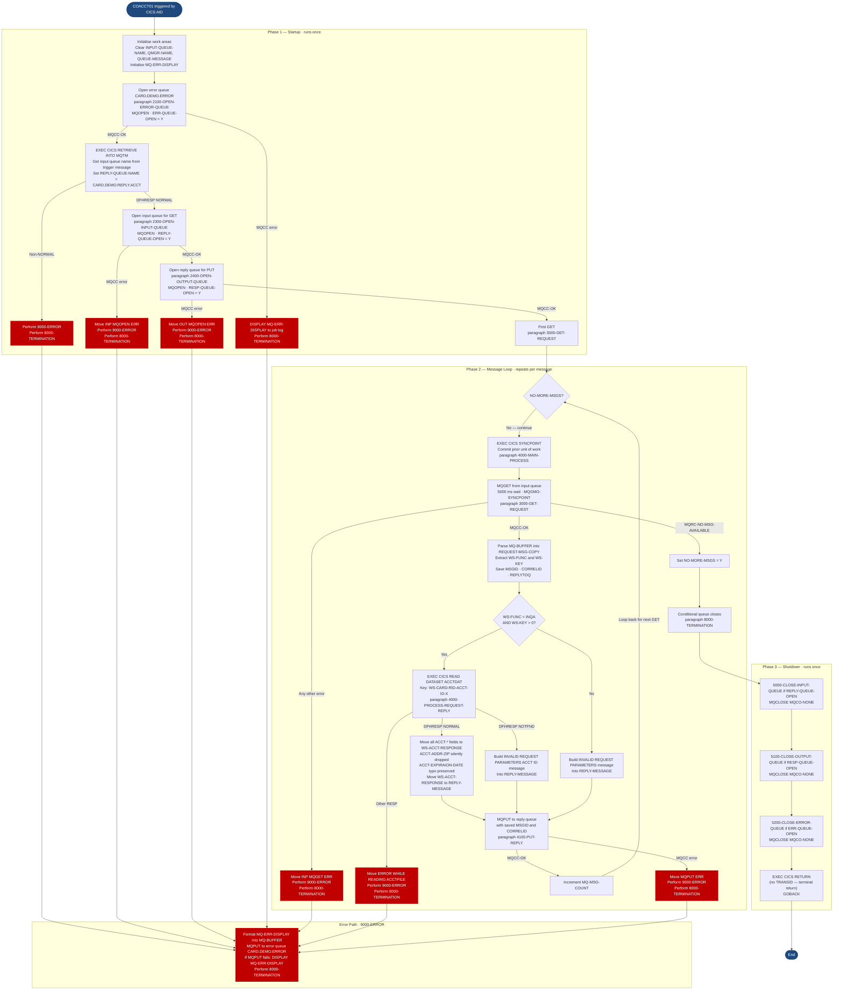

# COACCT01 — Account Inquiry Service (IBM MQ Bridge)

```
Application : AWS CardDemo
Source File : COACCT01.cbl
Type        : Online CICS COBOL (MQ-driven service program)
Source Banner: (no explicit banner comment; PROGRAM-ID COACCT01 IS INITIAL, DATE-WRITTEN 03/21)
```

This document describes what the program does in plain English. It treats the program as an event-driven CICS service that consumes account-inquiry requests from an IBM MQ queue and returns account detail responses to a reply queue. The reader does not need to know COBOL.

---

## 1. Purpose

COACCT01 is an **IBM MQ–driven CICS service program** that acts as a request/reply bridge between an MQ-based message bus and the CardDemo VSAM account master file. It is declared `IS INITIAL`, meaning CICS allocates a fresh working-storage area on every invocation — there is no cross-invocation state.

**What it reads:**

- **Input MQ queue** — the queue name is retrieved at startup from a CICS trigger message (MQTM). Each message carries a 4-byte function code (`WS-FUNC`) and an 11-digit account key (`WS-KEY`). The program processes the function code `'INQA'` (account inquiry).
- **Account master file** — accessed via `EXEC CICS READ` against the CICS dataset named `'ACCTDAT '` (8 bytes, right-padded with a space). The record layout is defined by copybook `CVACT01Y`, which provides `ACCOUNT-RECORD` and all `ACCT-*` fields.
- **Card cross-reference file** and other VSAM files — **not read by this program**. The card xref, customer, and transaction files that appear in other CardDemo programs are absent here.

**What it writes:**

- **Reply MQ queue** (`'CARD.DEMO.REPLY.ACCT'`) — on a successful read, the program formats an 1,000-byte reply message (`WS-ACCT-RESPONSE`) containing labelled account fields and places it on this queue.
- **Error MQ queue** (`'CARD.DEMO.ERROR'`) — on any error condition (failed queue operations, invalid input, unexpected CICS response codes), a formatted error description (`MQ-ERR-DISPLAY`) is placed on this queue.

**Hardcoded queue name:** `'CARD.DEMO.REPLY.ACCT'` is embedded at line 198. This is a configuration artifact that should become an externally configurable parameter during migration.

**External programs called:** The IBM MQ API programs `MQOPEN`, `MQGET`, `MQPUT`, and `MQCLOSE` are called as static external programs. No other application programs are called.

---

## 2. Program Flow

COACCT01 follows a startup-driven loop pattern shaped by the IBM MQ API. There is no CICS RETURN/XCTL loop in the usual sense; instead the program opens queues once, loops consuming messages until the queue is drained, then issues `EXEC CICS RETURN` as part of its termination sequence. The program is triggered by CICS Automatic Initiation Descriptor (AID) fired by the arrival of a message on the input queue.

### 2.1 Startup

**Step 1 — Initialize working storage** *(paragraph `1000-CONTROL`, line 178).* Spaces are moved to `INPUT-QUEUE-NAME`, `QMGR-NAME`, and `QUEUE-MESSAGE`. The `MQ-ERR-DISPLAY` composite error area is initialised.

**Step 2 — Open the error queue** *(paragraph `2100-OPEN-ERROR-QUEUE`, line 289).* Before anything else, the program opens the hardcoded error queue `'CARD.DEMO.ERROR'`. It calls `MQOPEN` with `MQOO-OUTPUT + MQOO-PASS-ALL-CONTEXT + MQOO-FAIL-IF-QUIESCING` options. On success it sets `ERR-QUEUE-OPEN` to true and saves the queue handle in `ERROR-QUEUE-HANDLE`. On failure it displays `MQ-ERR-DISPLAY` to the job log and performs `8000-TERMINATION` — it does **not** attempt to place the error on the error queue (there is no error queue yet).

**Step 3 — Retrieve trigger message** *(inside `1000-CONTROL`, line 191).* A `EXEC CICS RETRIEVE INTO(MQTM)` call obtains the trigger message that caused CICS to start this program. The trigger message contains the input queue name in `MQTM-QNAME`, which is moved to `INPUT-QUEUE-NAME`. The reply queue name is hardcoded to `'CARD.DEMO.REPLY.ACCT'` and moved to `REPLY-QUEUE-NAME`. If the RETRIEVE fails (non-NORMAL response), the program sets error fields, performs `9000-ERROR` (writes to the error queue), then performs `8000-TERMINATION`.

**Step 4 — Open the input queue for GET** *(paragraph `2300-OPEN-INPUT-QUEUE`, line 222).* Calls `MQOPEN` with `MQOO-INPUT-SHARED + MQOO-SAVE-ALL-CONTEXT + MQOO-FAIL-IF-QUIESCING`. On success saves the handle in `INPUT-QUEUE-HANDLE` and sets `REPLY-QUEUE-OPEN` to true. On failure moves `'INP MQOPEN ERR'` to `MQ-APPL-RETURN-MESSAGE`, performs `9000-ERROR`, then `8000-TERMINATION`.

**Step 5 — Open the output (reply) queue for PUT** *(paragraph `2400-OPEN-OUTPUT-QUEUE`, line 255).* Calls `MQOPEN` with `MQOO-OUTPUT + MQOO-PASS-ALL-CONTEXT + MQOO-FAIL-IF-QUIESCING`. On success saves the handle in `OUTPUT-QUEUE-HANDLE` and sets `RESP-QUEUE-OPEN` to true. On failure moves `'OUT MQOPEN ERR'` to `MQ-APPL-RETURN-MESSAGE`, performs `9000-ERROR`, then `8000-TERMINATION`.

**Step 6 — First GET of the request queue** *(paragraph `3000-GET-REQUEST`, line 334).* Called once before the loop begins. See the main processing section for the GET logic.

### 2.2 Main Processing

After startup the program enters a `PERFORM 4000-MAIN-PROCESS UNTIL NO-MORE-MSGS` loop. Each iteration issues a CICS SYNCPOINT, then calls `3000-GET-REQUEST` again. The processing follows this sequence for each message:

**Step 7 — Issue CICS SYNCPOINT** *(paragraph `4000-MAIN-PROCESS`, line 325).* A `EXEC CICS SYNCPOINT` is issued before each GET to commit any prior unit of work. This is the only explicit syncpoint in the program; it ensures MQ acknowledgement and CICS resource updates are committed together.

**Step 8 — GET the next message** *(paragraph `3000-GET-REQUEST`, line 334).* The GET waits up to 5,000 milliseconds (`MQGMO-WAITINTERVAL` = `5000`). The GET options are `MQGMO-SYNCPOINT + MQGMO-FAIL-IF-QUIESCING + MQGMO-CONVERT + MQGMO-WAIT`. A successful GET (`MQCC-OK`) returns the message body into `MQ-BUFFER` (1,000 bytes), which is then copied into `REQUEST-MESSAGE` and parsed into `REQUEST-MSG-COPY` giving `WS-FUNC` (4 bytes) and `WS-KEY` (11 digits). The message ID, correlation ID, and reply-to queue name are saved in `SAVE-MSGID`, `SAVE-CORELID`, and `SAVE-REPLY2Q`. Processing then continues with paragraph `4000-PROCESS-REQUEST-REPLY`.

If the GET returns reason code `MQRC-NO-MSG-AVAILABLE`, `NO-MORE-MSGS` is set to true and the loop exits. Any other error code triggers `9000-ERROR` and then `8000-TERMINATION`.

**Step 9 — Process the request** *(paragraph `4000-PROCESS-REQUEST-REPLY`, line 390).* The reply buffer is cleared. The program checks whether `WS-FUNC = 'INQA'` and `WS-KEY > ZEROES`. If both conditions are true it moves `WS-KEY` to `WS-CARD-RID-ACCT-ID` and issues a `EXEC CICS READ DATASET('ACCTDAT ')` using `WS-CARD-RID-ACCT-ID-X` as the key. The READ response is evaluated:

- `DFHRESP(NORMAL)` — all account fields from `ACCOUNT-RECORD` are moved into the corresponding fields of `WS-ACCT-RESPONSE` (including the typo-named `ACCT-EXPIRAION-DATE` → `WS-ACCT-EXPIRAION-DATE`). `WS-ACCT-RESPONSE` is moved to `REPLY-MESSAGE` and paragraph `4100-PUT-REPLY` is performed.
- `DFHRESP(NOTFND)` — a text message `'INVALID REQUEST PARAMETERS ACCT ID : '` followed by `WS-KEY` is built into `REPLY-MESSAGE` and `4100-PUT-REPLY` is performed.
- Any other response — the CICS response and reason codes are placed into the MQ error structure as condition and reason codes, `'ERROR WHILE READING ACCTFILE'` is moved to `MQ-APPL-RETURN-MESSAGE`, `9000-ERROR` and `8000-TERMINATION` are performed.

If the precondition check fails (function is not `'INQA'` or key is zero), a message `'INVALID REQUEST PARAMETERS ACCT ID : <key> FUNCTION : <func>'` is built into `REPLY-MESSAGE` and `4100-PUT-REPLY` is performed.

**Step 10 — PUT the reply** *(paragraph `4100-PUT-REPLY`, line 462).* The 1,000-byte `REPLY-MESSAGE` is placed into `MQ-BUFFER`. The message descriptor is updated: `MQMD-MSGID` is set from `SAVE-MSGID`, `MQMD-CORRELID` from `SAVE-CORELID`, `MQMD-FORMAT` is set to `MQFMT-STRING`, and the character set ID is set to `MQCCSI-Q-MGR`. The PUT options are `MQPMO-SYNCPOINT + MQPMO-DEFAULT-CONTEXT + MQPMO-FAIL-IF-QUIESCING`. On failure, `'MQPUT ERR'` is set in `MQ-APPL-RETURN-MESSAGE`, `9000-ERROR` and `8000-TERMINATION` are performed.

After the PUT, the message count `MQ-MSG-COUNT` is incremented by 1 and the loop repeats.

### 2.3 Shutdown / Return

**Step 11 — Termination** *(paragraph `8000-TERMINATION`, line 538).* The program closes queues selectively based on open-status flags: if `REPLY-QUEUE-OPEN` is true, `5000-CLOSE-INPUT-QUEUE` is performed; if `RESP-QUEUE-OPEN` is true, `5100-CLOSE-OUTPUT-QUEUE` is performed; if `ERR-QUEUE-OPEN` is true, `5200-CLOSE-ERROR-QUEUE` is performed. Each close calls `MQCLOSE` with `MQCO-NONE` options. Close failures trigger nested calls to `8000-TERMINATION` which can cause infinite recursion (see Migration Note 2).

After all closes, an `EXEC CICS RETURN END-EXEC` is issued followed by `GOBACK`. The CICS RETURN does not specify a TRANSID — this is a terminal invocation, not a pseudo-conversational return.

---

## 3. Error Handling

### 3.1 Error Queue Writer — `9000-ERROR` (line 501)

This paragraph is the common error-reporting routine. It moves `MQ-ERR-DISPLAY` (the composite error structure containing `MQ-ERROR-PARA`, `MQ-APPL-RETURN-MESSAGE`, condition code, reason code, and queue name) into `ERROR-MESSAGE` and thence into `MQ-BUFFER`. It then sets `MQMD-FORMAT` to `MQFMT-STRING`, sets `MQMD-CODEDCHARSETID`, and calls `MQPUT` using `ERROR-QUEUE-HANDLE` to place the error message on `'CARD.DEMO.ERROR'`. If this MQPUT also fails, `DISPLAY MQ-ERR-DISPLAY` writes to the job log and `8000-TERMINATION` is performed.

### 3.2 Close Failure within MQCLOSE Paragraphs

Paragraphs `5000-CLOSE-INPUT-QUEUE`, `5100-CLOSE-OUTPUT-QUEUE`, and `5200-CLOSE-ERROR-QUEUE` each call `MQCLOSE` and evaluate the condition code. On a non-OK condition they set error fields and call `8000-TERMINATION` recursively. Since `8000-TERMINATION` calls back into close paragraphs, a repeated close failure can produce unlimited recursion until CICS terminates the task with an abend.

### 3.3 Error Queue Open Failure in `2100-OPEN-ERROR-QUEUE`

If the error queue itself cannot be opened (line 320), the program issues `DISPLAY MQ-ERR-DISPLAY` to the job log and then calls `8000-TERMINATION`. Because the error queue is not open at this point, `8000-TERMINATION` will skip the error queue close and proceed directly to the CICS RETURN. Error information is available only in the job log.

---

## 4. Migration Notes

1. **`ACCOUNT-RECORD` fields `ACCT-ADDR-ZIP` and `ACCT-GROUP-ID` are read from disk but never placed in the reply message.** `WS-ACCT-RESPONSE` has `WS-ACCT-GROUP-ID` and would include the group ID, but `ACCT-ADDR-ZIP` has no corresponding slot in `WS-ACCT-RESPONSE`. ZIP code data is silently dropped exactly as in CBACT01C. Line 155 defines `WS-ACCT-EXPIRAION-DATE` in `WS-ACCT-RESPONSE` (preserving the source typo).

2. **Mutual recursion between close paragraphs and `8000-TERMINATION` can produce infinite recursion.** `5000-CLOSE-INPUT-QUEUE` calls `8000-TERMINATION` on failure; `8000-TERMINATION` calls `5000-CLOSE-INPUT-QUEUE`. Under a persistent close error, CICS will terminate the task with an abend (ASRA or storage violation) rather than an orderly return. A migrated service must break this cycle with a simple flag or exception hierarchy.

3. **`MQMD-CORRELID` and `MQMD-MSGID` propagation logic.** At line 470 `SAVE-MSGID` is moved to `MQMD-MSGID` and `SAVE-CORELID` to `MQMD-CORRELID` for the reply. This is the correct request/reply pattern. However, if the GET delivers a message with an all-zeros correlation ID the requester may not be able to match the reply.

4. **`WS-FUNC = 'INQA'` is the only supported function code.** Any other function code produces an error reply message rather than an abend or error-queue message. There is no routing to other handlers — the program is single-function. During migration, ensure downstream consumers understand the reply format for the not-supported case.

5. **`MQ-MSG-COUNT` is a PIC 9(09) counter incremented after every successful GET, but it is never written to the reply, the error queue, or the job log.** Its value is lost when the program returns. Migrated code should expose a metric for messages processed.

6. **`IS INITIAL` declaration ensures no cross-invocation sharing, but it also means every invocation re-opens and re-closes all queues.** For a high-frequency trigger pattern this is expensive. Java replacements should use persistent connections managed by a connection pool.

7. **`WS-ABS-TIME` (COMP-3, 15 digits) and `WS-MMDDYYYY` / `WS-TIME` are declared in `WS-DATE-TIME` but are never populated or used.** They are dead fields, likely template artifacts.

8. **The `RETRIEVE` mechanism is legacy CICS MQ trigger processing.** Modern CICS MQ integration uses the CICS MQ Adapter with defined trigger monitors. A Java replacement should use a JMS listener or IBM MQ Spring Boot starter rather than replicating the trigger/retrieve pattern.

9. **Reply queue name `'CARD.DEMO.REPLY.ACCT'` is hardcoded at line 198.** All other queue names come from the trigger message or from the hardcoded error queue name. The reply queue name must be externalised in a migrated service.

10. **`ACCT-CURR-BAL`, `ACCT-CREDIT-LIMIT`, `ACCT-CASH-CREDIT-LIMIT`, `ACCT-CURR-CYC-CREDIT`, and `ACCT-CURR-CYC-DEBIT` are copied into `WS-ACCT-RESPONSE` as PIC S9(10)V99 display numeric fields.** On the wire they appear as zoned decimal (12-character strings with embedded sign). The Java deserialiser must handle zoned-decimal sign bytes or treat these as `BigDecimal` strings.

---

## Appendix A — Files

| Logical Name | DDname | Organization | Recording | Key Field | Direction | Contents |
|---|---|---|---|---|---|---|
| `ACCTDAT ` (CICS dataset name) | `ACCTDAT ` | VSAM KSDS — accessed by key | Fixed 300 bytes | `WS-CARD-RID-ACCT-ID-X` PIC X(11) | Input — read-only | Account master records, one per account |
| Input MQ queue | Provided via CICS trigger message (`MQTM-QNAME`) | IBM MQ queue | Variable up to 1,000 bytes | N/A | Input — MQGET | Account inquiry request messages containing function code and account key |
| Reply MQ queue `'CARD.DEMO.REPLY.ACCT'` | N/A (MQ) | IBM MQ queue | Fixed 1,000 bytes | N/A | Output — MQPUT | Account detail response messages |
| Error MQ queue `'CARD.DEMO.ERROR'` | N/A (MQ) | IBM MQ queue | Variable up to 1,000 bytes | N/A | Output — MQPUT | Error messages from failed operations |

---

## Appendix B — Copybooks and External Programs

### Copybook `CVACT01Y` (WORKING-STORAGE SECTION, inside `WS-ACCT-RESPONSE` group definition area, line 171)

Defines `ACCOUNT-RECORD` — the 300-byte layout for an account record read from `ACCTDAT`. Total length 300 bytes.

| Field | PIC | Bytes | Notes |
|---|---|---|---|
| `ACCT-ID` | `9(11)` | 11 | Account number; KSDS primary key. Copied to `WS-ACCT-ID`. |
| `ACCT-ACTIVE-STATUS` | `X(01)` | 1 | Active/inactive flag (`'Y'`/`'N'`). Copied to `WS-ACCT-ACTIVE-STATUS`. |
| `ACCT-CURR-BAL` | `S9(10)V99` | 12 | Current balance, zoned-decimal display signed. Copied to `WS-ACCT-CURR-BAL`. |
| `ACCT-CREDIT-LIMIT` | `S9(10)V99` | 12 | Approved credit limit. Copied to `WS-ACCT-CREDIT-LIMIT`. |
| `ACCT-CASH-CREDIT-LIMIT` | `S9(10)V99` | 12 | Cash-advance sub-limit. Copied to `WS-ACCT-CASH-CREDIT-LIMIT`. |
| `ACCT-OPEN-DATE` | `X(10)` | 10 | Date account opened (YYYY-MM-DD). Copied to `WS-ACCT-OPEN-DATE`. |
| `ACCT-EXPIRAION-DATE` | `X(10)` | 10 | Card expiry date — **misspelled in source and copybook; spelling must be preserved**. Copied to `WS-ACCT-EXPIRAION-DATE` (typo preserved). |
| `ACCT-REISSUE-DATE` | `X(10)` | 10 | Most recent card reissue date (YYYY-MM-DD). Copied to `WS-ACCT-REISSUE-DATE`. |
| `ACCT-CURR-CYC-CREDIT` | `S9(10)V99` | 12 | Credits posted this billing cycle. Copied to `WS-ACCT-CURR-CYC-CREDIT`. |
| `ACCT-CURR-CYC-DEBIT` | `S9(10)V99` | 12 | Debits posted this billing cycle. Copied to `WS-ACCT-CURR-CYC-DEBIT`. |
| `ACCT-ADDR-ZIP` | `X(10)` | 10 | Account ZIP code — **present in every record read but never included in the reply message; silently dropped**. |
| `ACCT-GROUP-ID` | `X(10)` | 10 | Rate/disclosure group code. Copied to `WS-ACCT-GROUP-ID`. |
| `FILLER` | `X(178)` | 178 | Padding to 300-byte record length; never referenced. |

### Copybook `CMQGMOV` (01-level `MQ-GET-MESSAGE-OPTIONS`, line 71)

IBM MQ Get-Message Options structure (`MQGMO`). This program uses the following fields:
- `MQGMO-WAITINTERVAL` — set to `5000` (5 seconds wait).
- `MQGMO-OPTIONS` — computed as `MQGMO-SYNCPOINT + MQGMO-FAIL-IF-QUIESCING + MQGMO-CONVERT + MQGMO-WAIT`.

All other fields in `CMQGMOV` are **not used** by this program and retain default values.

### Copybook `CMQPMOV` (01-level `MQ-PUT-MESSAGE-OPTIONS`, line 75)

IBM MQ Put-Message Options structure (`MQPMO`). This program uses:
- `MQPMO-OPTIONS` — computed as `MQPMO-SYNCPOINT + MQPMO-DEFAULT-CONTEXT + MQPMO-FAIL-IF-QUIESCING`.

All other fields are **not used**.

### Copybook `CMQMDV` (01-level `MQ-MESSAGE-DESCRIPTOR`, line 79)

IBM MQ Message Descriptor (`MQMD`). Fields used:
- `MQMD-MSGID` — set from `SAVE-MSGID` before PUT; set from `MQMI-NONE` before GET.
- `MQMD-CORRELID` — set from `SAVE-CORELID` before PUT; set from `MQCI-NONE` before GET.
- `MQMD-REPLYTOQ` — read from received message into `MQ-QUEUE-REPLY`.
- `MQMD-FORMAT` — set to `MQFMT-STRING` for PUT.
- `MQMD-CODEDCHARSETID` — computed as `MQCCSI-Q-MGR`.

All other `MQMD` fields are **not explicitly set** by this program and hold default/initialised values.

### Copybook `CMQODV` (01-level `MQ-OBJECT-DESCRIPTOR`, line 83)

IBM MQ Object Descriptor (`MQOD`). Fields used:
- `MQOD-OBJECTQMGRNAME` — set to SPACES.
- `MQOD-OBJECTNAME` — set to the queue name before each `MQOPEN`.

All other `MQOD` fields are **not used**.

### Copybook `CMQV` (01-level `MQ-CONSTANTS`, line 87)

IBM MQ symbolic constants (e.g., `MQOO-INPUT-SHARED`, `MQCC-OK`, `MQRC-NO-MSG-AVAILABLE`, etc.). All are read-only constants referenced throughout the program.

### Copybook `CMQTML` (01-level `MQ-GET-QUEUE-MESSAGE`, line 90)

IBM MQ Trigger Message structure (`MQTM`). Field used:
- `MQTM-QNAME` — the name of the queue to process, retrieved from CICS RETRIEVE at startup.

### External Program `MQOPEN`

| Item | Detail |
|---|---|
| Called from | `2300-OPEN-INPUT-QUEUE` (line 233), `2400-OPEN-OUTPUT-QUEUE` (line 267), `2100-OPEN-ERROR-QUEUE` (line 302) |
| Input | `QMGR-HANDLE-CONN`, `MQ-OBJECT-DESCRIPTOR` (queue name), `MQ-OPTIONS` |
| Output | `MQ-HOBJ` (queue handle), `MQ-CONDITION-CODE`, `MQ-REASON-CODE` |
| Unchecked fields | Connection handle `MQ-HCONN` is set to zero at definition and never explicitly populated via `MQCONN` — the program relies on CICS MQ adapter implicit connection |

### External Program `MQGET`

| Item | Detail |
|---|---|
| Called from | `3000-GET-REQUEST` (line 352) |
| Input | `MQ-HCONN`, `MQ-HOBJ` (input queue handle), `MQ-MESSAGE-DESCRIPTOR`, `MQ-GET-MESSAGE-OPTIONS`, `MQ-BUFFER-LENGTH` (1000) |
| Output | `MQ-BUFFER` (message body), `MQ-DATA-LENGTH`, `MQ-CONDITION-CODE`, `MQ-REASON-CODE` |
| Unchecked fields | `MQ-DATA-LENGTH` — the actual message length is returned but never checked; the program always treats the entire 1,000-byte buffer as the message |

### External Program `MQPUT`

| Item | Detail |
|---|---|
| Called from | `4100-PUT-REPLY` (line 479), `9000-ERROR` (line 516) |
| Input | `MQ-HCONN`, output/error queue handle, `MQ-MESSAGE-DESCRIPTOR`, `MQ-PUT-MESSAGE-OPTIONS`, `MQ-BUFFER-LENGTH` (1000), `MQ-BUFFER` |
| Output | `MQ-CONDITION-CODE`, `MQ-REASON-CODE` |
| Unchecked fields | None of the returned fields beyond condition/reason code are checked |

### External Program `MQCLOSE`

| Item | Detail |
|---|---|
| Called from | `5000-CLOSE-INPUT-QUEUE` (line 557), `5100-CLOSE-OUTPUT-QUEUE` (line 579), `5200-CLOSE-ERROR-QUEUE` (line 602) |
| Input | `MQ-HCONN`, `MQ-HOBJ`, `MQ-OPTIONS` (MQCO-NONE) |
| Output | `MQ-CONDITION-CODE`, `MQ-REASON-CODE` |
| Unchecked fields | None beyond condition/reason code |

---

## Appendix C — Hardcoded Literals

| Paragraph | Line | Value | Usage | Classification |
|---|---|---|---|---|
| `1000-CONTROL` | 198 | `'CARD.DEMO.REPLY.ACCT'` | Hardcoded reply queue name | System constant — must be externalised |
| `2100-OPEN-ERROR-QUEUE` | 294 | `'CARD.DEMO.ERROR'` | Hardcoded error queue name | System constant — must be externalised |
| `3000-GET-REQUEST` | 337 | `5000` | MQ GET wait interval in milliseconds (5 seconds) | System constant |
| `3000-GET-REQUEST` | 342 | `1000` | MQ buffer length in bytes | System constant |
| `4100-PUT-REPLY` | 468 | `1000` | MQ buffer length for PUT | System constant |
| `4000-PROCESS-REQUEST-REPLY` | 393 | `'INQA'` | Account inquiry function code | Business rule — only supported function |

---

## Appendix D — Internal Working Fields

| Field | PIC | Bytes | Purpose |
|---|---|---|---|
| `WS-MQ-MSG-FLAG` with `NO-MORE-MSGS` = `'Y'` | `X(01)` | 1 | Loop-exit flag; set when MQ returns MQRC-NO-MSG-AVAILABLE |
| `WS-RESP-QUEUE-STS` with `RESP-QUEUE-OPEN` = `'Y'` | `X(01)` | 1 | Tracks whether reply queue is open for conditional close |
| `WS-ERR-QUEUE-STS` with `ERR-QUEUE-OPEN` = `'Y'` | `X(01)` | 1 | Tracks whether error queue is open for conditional close |
| `WS-REPLY-QUEUE-STS` with `REPLY-QUEUE-OPEN` = `'Y'` | `X(01)` | 1 | Tracks whether input queue is open for conditional close (note: flag name says "reply" but protects input queue handle) |
| `WS-CICS-RESP1-CD` / `WS-CICS-RESP2-CD` | `S9(08) COMP` | 4 each | CICS response codes from RETRIEVE command |
| `WS-CICS-RESP1-CD-D` / `WS-CICS-RESP2-CD-D` | `9(08)` | 4 each | Display-format copy of CICS response codes for error message STRING |
| `WS-ABS-TIME` | `S9(15) COMP-3` | 8 | **Declared but never populated or used** — dead field (COMP-3 — use BigDecimal in Java if retained) |
| `WS-MMDDYYYY` | `X(10)` | 10 | **Declared but never populated or used** — dead field |
| `WS-TIME` | `X(8)` | 8 | **Declared but never populated or used** — dead field |
| `MQ-HCONN` | `S9(09) BINARY` | 4 | MQ connection handle — initialised to zero, never explicitly connected via MQCONN; CICS adapter provides the connection implicitly |
| `MQ-CONDITION-CODE` | `S9(09) BINARY` | 4 | Return code from each MQ API call |
| `MQ-REASON-CODE` | `S9(09) BINARY` | 4 | Reason code from each MQ API call |
| `MQ-HOBJ` | `S9(09) BINARY` | 4 | Temporary queue handle reused for each MQOPEN |
| `MQ-OPTIONS` | `S9(09) BINARY` | 4 | Computed option bitmask for MQOPEN/MQCLOSE |
| `MQ-BUFFER-LENGTH` | `S9(09) BINARY` | 4 | Set to 1000 before each MQGET/MQPUT |
| `MQ-BUFFER` | `X(1000)` | 1000 | Message body for GET and PUT |
| `MQ-DATA-LENGTH` | `S9(09) BINARY` | 4 | Actual data length returned by MQGET — **checked only for MQCC-OK, value is otherwise ignored** |
| `MQ-CORRELID` / `SAVE-CORELID` | `X(24)` | 24 each | Correlation ID from received message; saved for reply |
| `MQ-MSG-ID` / `SAVE-MSGID` | `X(24)` | 24 each | Message ID from received message; saved for reply |
| `SAVE-REPLY2Q` | `X(48)` | 48 | Reply-to queue from received message (saved but not actually used to route the PUT — route is hardcoded) |
| `MQ-MSG-COUNT` | `9(09)` | 9 | Count of messages successfully processed — never reported |
| `INPUT-QUEUE-HANDLE` / `OUTPUT-QUEUE-HANDLE` / `ERROR-QUEUE-HANDLE` | `S9(09) BINARY` | 4 each | Persistent queue handles from MQOPEN |
| `REQUEST-MSG-COPY` with `WS-FUNC` X(4), `WS-KEY` 9(11), `WS-FILLER` X(985) | 1000 bytes total | — | Parsed overlay of the received request message |
| `WS-ACCT-RESPONSE` | ~180 bytes | — | Formatted reply containing labelled account fields; placed in REPLY-MESSAGE for PUT |

---

## Appendix E — Execution at a Glance


