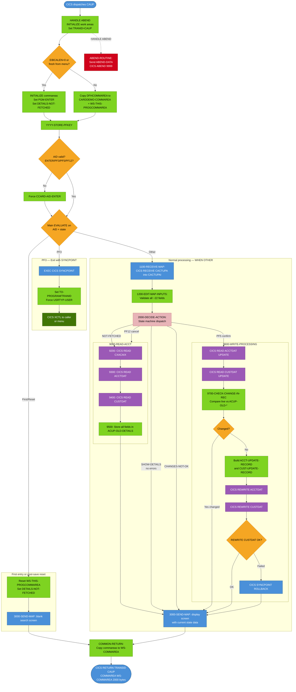

# BIZ-COACTUPC — Account Update Screen

| Attribute | Value |
|-----------|-------|
| **Program** | COACTUPC |
| **Type** | CICS Online — Pseudo-Conversational |
| **Transaction ID** | CAUP |
| **BMS Map** | CACTUPA / Mapset COACTUP |
| **Language** | COBOL |
| **Source File** | `source/cobol/COACTUPC.cbl` |
| **Lines** | 4237 |
| **Date Written** | July 2022 |
| **Version Tag** | CardDemo_v1.0-15-g27d6c6f-68 · 2022-07-19 |

---

## 1. Business Purpose

COACTUPC provides an operator-facing screen for viewing and updating both account-level and customer-level data simultaneously. The operator enters an 11-digit account number; the program reads the card cross-reference (CXACAIX), account master (ACCTDAT), and customer master (CUSTDAT) files to populate the screen. After reviewing the loaded data, the operator modifies any field and presses Enter to trigger validation. If all edits pass, the screen changes to a confirmation state and instructs the operator to press PF5 to save or PF12 to cancel changes. On PF5, the program re-reads both records with CICS UPDATE locks, verifies no concurrent modification occurred, and issues two sequential CICS REWRITE calls.

The program manages a multi-step interaction state machine through the `ACUP-CHANGE-ACTION` field in `WS-THIS-PROGCOMMAREA` (persisted in the commarea between screen interactions). This is the most complex interactive program in the CardDemo system.

---

## 2. Program Flow

### 2.1 Startup

`0000-MAIN` is the sole entry point.

1. `EXEC CICS HANDLE ABEND LABEL(ABEND-ROUTINE)` is registered.
2. `CC-WORK-AREA`, `WS-MISC-STORAGE`, and `WS-COMMAREA` are initialized.
3. `WS-TRANID` is set to `'CAUP'`.
4. `WS-RETURN-MSG-OFF` (SPACES) is set true.
5. Commarea handling: if `EIBCALEN = 0` or the caller is the menu and this is a first entry (`CDEMO-FROM-PROGRAM = 'COMEN01C' AND NOT CDEMO-PGM-REENTER`), both `CARDDEMO-COMMAREA` and `WS-THIS-PROGCOMMAREA` are initialized; `CDEMO-PGM-ENTER` and `ACUP-DETAILS-NOT-FETCHED` are set. Otherwise, the full commarea is split and restored.

6. `YYYY-STORE-PFKEY` maps `EIBAID` to `CCARD-AID-*` (including PF13–PF24 → PF01–PF12).

7. AID validation:
   - Valid AIDs: ENTER, PFK03, PFK05 (only when `ACUP-CHANGES-OK-NOT-CONFIRMED`), PFK12 (only when data already fetched).
   - Any other AID is forced to ENTER.

### 2.2 Main Processing

The main EVALUATE selects one of five dispatch cases:

**PF3 — Exit**

Before issuing XCTL, the program issues `EXEC CICS SYNCPOINT` (a commit of any outstanding CICS unit of work). Then it sets up `CDEMO-TO-PROGRAM`/`CDEMO-TO-TRANID` from `CDEMO-FROM-*` or defaults to the main menu, forces `CDEMO-USRTYP-USER` to TRUE, sets `CDEMO-PGM-ENTER`, and issues XCTL with `CARDDEMO-COMMAREA`.

**First entry (ACUP-DETAILS-NOT-FETCHED AND CDEMO-PGM-ENTER, OR fresh from menu)**

Initializes `WS-THIS-PROGCOMMAREA`, calls `3000-SEND-MAP` to display the blank search screen, sets `CDEMO-PGM-REENTER` and `ACUP-DETAILS-NOT-FETCHED`, then returns.

**After successful save (ACUP-CHANGES-OKAYED-AND-DONE or ACUP-CHANGES-FAILED)**

Resets `WS-THIS-PROGCOMMAREA`, `WS-MISC-STORAGE`, and `CDEMO-ACCT-ID`. Shows a fresh search screen with the relevant info message (success or failure), then returns.

**All other cases (WHEN OTHER)**

Calls `1000-PROCESS-INPUTS` → `2000-DECIDE-ACTION` → `3000-SEND-MAP`. The detailed logic follows.

**`1000-PROCESS-INPUTS`**

Calls `1100-RECEIVE-MAP` to receive the screen, then `1200-EDIT-MAP-INPUTS` to validate all fields.

`1100-RECEIVE-MAP` receives all input fields from `CACTUPAI` into `ACUP-NEW-DETAILS` and `CC-ACCT-ID`. If `ACUP-DETAILS-NOT-FETCHED` at this point (first receive — no data yet), only the account ID is relevant and the paragraph exits early.

`1200-EDIT-MAP-INPUTS` validates either search-key-only mode or full field editing mode:

- **Search-key mode** (`ACUP-DETAILS-NOT-FETCHED`): validates account ID (11-digit non-zero number) using `1210-EDIT-ACCOUNT`.
- **Full edit mode** (data already fetched): calls `1205-COMPARE-OLD-NEW` to detect whether anything changed. If no changes detected, or if changes were already confirmed/done, `WS-NON-KEY-FLAGS` is cleared and editing is skipped. If changes were found, the following validations run in sequence (all use `WS-RETURN-MSG-OFF` to capture only the first error):
  - **Account Status** (1220-EDIT-YESNO): must be `'Y'` or `'N'`
  - **Open Date** (EDIT-DATE-CCYYMMDD from CSUTLDWY): valid calendar date CCYYMMDD
  - **Credit Limit** (1250-EDIT-SIGNED-9V2): numeric; uses FUNCTION TEST-NUMVAL-C
  - **Expiry Date** (EDIT-DATE-CCYYMMDD): valid calendar date
  - **Cash Credit Limit** (1250-EDIT-SIGNED-9V2): numeric
  - **Reissue Date** (EDIT-DATE-CCYYMMDD): valid calendar date
  - **Current Balance** (1250-EDIT-SIGNED-9V2): numeric
  - **Current Cycle Credit** (1250-EDIT-SIGNED-9V2): numeric
  - **Current Cycle Debit** (1250-EDIT-SIGNED-9V2): numeric
  - **SSN** (1265-EDIT-US-SSN): 3 parts; part 1 must not be 000, 666, or 900–999; all parts numeric non-zero
  - **Date of Birth** (EDIT-DATE-CCYYMMDD + EDIT-DATE-OF-BIRTH): valid calendar date plus age range check
  - **FICO Score** (1245-EDIT-NUM-REQD + 1275-EDIT-FICO-SCORE): numeric, must be 300–850
  - **First Name** (1225-EDIT-ALPHA-REQD): required, alphabets only
  - **Middle Name** (1235-EDIT-ALPHA-OPT): optional, alphabets only if supplied
  - **Last Name** (1225-EDIT-ALPHA-REQD): required, alphabets only
  - **Address Line 1** (1215-EDIT-MANDATORY): required, any characters
  - **State** (1225-EDIT-ALPHA-REQD + 1270-EDIT-US-STATE-CD): required, valid US state code
  - **ZIP** (1245-EDIT-NUM-REQD): required, 5-digit numeric
  - **City** (1225-EDIT-ALPHA-REQD): required, alphabets only (ADDR-LINE-3 used as city)
  - **Country** (1225-EDIT-ALPHA-REQD): required, 3-char alpha
  - **Phone 1 and Phone 2** (1260-EDIT-US-PHONE-NUM): format (NPA)NXX-XXXX; area code validated via CSLKPCDY lookup for valid NANP codes; phone is optional (all-blank passes)
  - **EFT Account ID** (1245-EDIT-NUM-REQD): required, numeric non-zero
  - **Primary Card Holder** (1220-EDIT-YESNO): must be `'Y'` or `'N'`
  - **Cross-field**: if state and zip are both valid, `1280-EDIT-US-STATE-ZIP-CD` checks the state+first-2-of-ZIP combination for US USPS zip range validity
  - If no errors: `ACUP-CHANGES-OK-NOT-CONFIRMED` is set

**`2000-DECIDE-ACTION` state machine**

Dispatches on `ACUP-CHANGE-ACTION` state and current AID:

| State | AID | Action |
|-------|-----|--------|
| `ACUP-DETAILS-NOT-FETCHED` | any | Call `9000-READ-ACCT` to fetch data; if successful, set `ACUP-SHOW-DETAILS` |
| `ACUP-CHANGES-MADE` (with PFK12) | PFK12 | Re-read account from files; if customer found, set `ACUP-SHOW-DETAILS` (cancel changes) |
| `ACUP-SHOW-DETAILS` | any | If INPUT-ERROR or NO-CHANGES-DETECTED: stay; else set `ACUP-CHANGES-OK-NOT-CONFIRMED` |
| `ACUP-CHANGES-NOT-OK` | any | Stay (redisplay with errors) |
| `ACUP-CHANGES-OK-NOT-CONFIRMED` | PFK05 | Call `9600-WRITE-PROCESSING`; evaluate write result → set next state |
| `ACUP-CHANGES-OK-NOT-CONFIRMED` | non-PFK05 | Stay (redisplay confirmation prompt) |
| `ACUP-CHANGES-OKAYED-AND-DONE` | any | Set `ACUP-SHOW-DETAILS`; if no caller tranid, clear account/card/status |
| `OTHER` | any | Call `ABEND-ROUTINE` with code `'0001'` |

`ACUP-CHANGE-ACTION` state values:
- LOW-VALUES or SPACES = `ACUP-DETAILS-NOT-FETCHED`
- `'S'` = `ACUP-SHOW-DETAILS`
- `'E'` = `ACUP-CHANGES-NOT-OK`
- `'N'` = `ACUP-CHANGES-OK-NOT-CONFIRMED`
- `'C'` = `ACUP-CHANGES-OKAYED-AND-DONE`
- `'L'` = `ACUP-CHANGES-OKAYED-LOCK-ERROR`
- `'F'` = `ACUP-CHANGES-OKAYED-BUT-FAILED`

Values `'E'`, `'N'`, `'C'`, `'L'`, `'F'` all satisfy `ACUP-CHANGES-MADE`.

**`9000-READ-ACCT`** — Three sequential reads identical in structure to COACTVWC:

1. `9200-GETCARDXREF-BYACCT`: CICS READ on CXACAIX by `WS-CARD-RID-ACCT-ID-X`. On NORMAL: extract `CDEMO-CUST-ID` and `CDEMO-CARD-NUM` from XREF.
2. `9300-GETACCTDATA-BYACCT`: CICS READ on ACCTDAT by account ID. On NORMAL: `FOUND-ACCT-IN-MASTER`.
3. `9400-GETCUSTDATA-BYCUST`: CICS READ on CUSTDAT by `WS-CARD-RID-CUST-ID-X`. On NORMAL: `FOUND-CUST-IN-MASTER`.
4. `9500-STORE-FETCHED-DATA`: Copies all account and customer fields from the read records into `ACUP-OLD-DETAILS` (the baseline snapshot for change detection and optimistic locking). Also updates `CARDDEMO-COMMAREA` customer name fields.

**`9600-WRITE-PROCESSING`** — Two-phase optimistic update:

1. CICS READ ACCTDAT with UPDATE (locks record). If RESP non-normal: set `COULD-NOT-LOCK-ACCT-FOR-UPDATE`, exit.
2. CICS READ CUSTDAT with UPDATE (locks record). If RESP non-normal: set `COULD-NOT-LOCK-CUST-FOR-UPDATE`, exit.
3. `9700-CHECK-CHANGE-IN-REC`: Compares each field in the freshly-locked records against the `ACUP-OLD-*` snapshot captured at read time. If any field differs, set `DATA-WAS-CHANGED-BEFORE-UPDATE` and exit (optimistic lock conflict).
4. Build `ACCT-UPDATE-RECORD` from `ACUP-NEW-*` fields. Dates are reassembled as `YYYY-MM-DD` strings.
5. Build `CUST-UPDATE-RECORD` from `ACUP-NEW-*` fields. Phone numbers are reassembled as `(NPA)NXX-XXXX` strings.
6. CICS REWRITE ACCTDAT from `ACCT-UPDATE-RECORD`. If RESP non-normal: set `LOCKED-BUT-UPDATE-FAILED`, exit.
7. CICS REWRITE CUSTDAT from `CUST-UPDATE-RECORD`. If RESP non-normal: set `LOCKED-BUT-UPDATE-FAILED`, issue `EXEC CICS SYNCPOINT ROLLBACK`, exit.
8. If both REWRITEs succeed: normal exit (no explicit success flag set — the caller `2000-DECIDE-ACTION` evaluates WHEN OTHER → `ACUP-CHANGES-OKAYED-AND-DONE`).

**`3000-SEND-MAP`** — Screen preparation and display:

1. `3100-SCREEN-INIT`: Initialize `CACTUPAO` to LOW-VALUES; set date/time/title/tranid/pgmname header fields (calls FUNCTION CURRENT-DATE twice — redundant).
2. `3200-SETUP-SCREEN-VARS`: Depending on `ACUP-CHANGE-ACTION`, shows initial (all LOW-VALUES), original (from `ACUP-OLD-*`), or updated values (from `ACUP-NEW-*`). Currency fields are formatted through `WS-EDIT-CURRENCY-9-2-F` (PIC +ZZZ,ZZZ,ZZZ.99). Phone numbers in the original values are sliced as substrings: characters 2–4 = area code, 6–8 = prefix, 10–13 = line number.
3. `3250-SETUP-INFOMSG`: Sets `WS-INFO-MSG` based on current state: "Enter or update id of account to update" / "Update account details presented above." / "Changes validated. Press F5 to save" / "Changes committed to database" / "Changes unsuccessful. Please try again".
4. `3300-SETUP-SCREEN-ATTRS`:
   - `3310-PROTECT-ALL-ATTRS`: Sets `DFHBMPRF` (protected) on all input fields and the info message.
   - `3320-UNPROTECT-FEW-ATTRS`: When data is shown (`ACUP-SHOW-DETAILS` or `ACUP-CHANGES-NOT-OK`), sets `DFHBMFSE` on all editable fields except customer ID (`ACSTNUMA`) and country (`ACSCTRYA`), which remain protected (all edits are US-specific).
   - Cursor is positioned to the first invalid field, working through all 40+ field flag variables in order.
   - CSSETATY copybook (via COPY REPLACING) generates per-field attribute code for red/green colouring of each validated field.
5. `3400-SEND-SCREEN`: CICS `SEND MAP CACTUPA MAPSET COACTUP FROM CACTUPAO CURSOR ERASE FREEKB RESP(WS-RESP-CD)`.

### 2.3 Shutdown

`COMMON-RETURN` assembles `WS-COMMAREA` (PIC X(2000)) from `CARDDEMO-COMMAREA` and `WS-THIS-PROGCOMMAREA`, then issues `EXEC CICS RETURN TRANSID('CAUP') COMMAREA(WS-COMMAREA) LENGTH(LENGTH OF WS-COMMAREA)`.

---

## 3. Error Handling

| Condition | Detection | Response |
|-----------|-----------|----------|
| No commarea / fresh from menu | `EIBCALEN = 0` or menu first entry | Initialize all state; show blank search screen |
| Account ID blank or non-numeric | `1210-EDIT-ACCOUNT` | "Account number not provided" or "Account Number...must be a 11 digit Non-Zero Number" |
| Any field validation failure | 1215–1280 paragraphs | First failing field's error in `WS-RETURN-MSG`; cursor positioned to that field; screen redisplayed |
| FICO out of range 300–850 | `1275-EDIT-FICO-SCORE` | "FICO Score: should be between 300 and 850" |
| Invalid US area code | `1260-EDIT-US-PHONE-NUM` + CSLKPCDY | "Not valid North America general purpose area code" |
| Invalid state+ZIP combination | `1280-EDIT-US-STATE-ZIP-CD` | "Invalid zip code for state" |
| CXACAIX READ not found | `DFHRESP(NOTFND)` in 9200 | "Account: `<id>` not found in Cross ref file. Resp:..." |
| ACCTDAT READ not found | `DFHRESP(NOTFND)` in 9300 | "Account: `<id>` not found in Acct Master file. Resp:..." |
| CUSTDAT READ not found | `DFHRESP(NOTFND)` in 9400 | "CustId: `<id>` not found in customer master. Resp:..." |
| Could not lock account for UPDATE | RESP non-normal in 9600 step 1 | `COULD-NOT-LOCK-ACCT-FOR-UPDATE`; "Could not lock account record for update" |
| Could not lock customer for UPDATE | RESP non-normal in 9600 step 2 | `COULD-NOT-LOCK-CUST-FOR-UPDATE`; "Could not lock customer record for update" |
| Record changed by another user | `9700-CHECK-CHANGE-IN-REC` detects mismatch | `DATA-WAS-CHANGED-BEFORE-UPDATE`; "Record changed by some one else. Please review" — re-reads and shows fresh data |
| ACCTDAT REWRITE failed | RESP non-normal in 9600 step 6 | `LOCKED-BUT-UPDATE-FAILED`; "Update of record failed" |
| CUSTDAT REWRITE failed | RESP non-normal in 9600 step 7 | `LOCKED-BUT-UPDATE-FAILED` + `CICS SYNCPOINT ROLLBACK`; "Update of record failed" |
| Unexpected AID or state | WHEN OTHER in `2000-DECIDE-ACTION` | Calls `ABEND-ROUTINE` (CICS ABEND `'9999'`) |
| Any unhandled CICS exception | HANDLE ABEND | `ABEND-ROUTINE`: sends `ABEND-DATA` text, then `CICS ABEND ABCODE('9999')` |

---

## 4. Migration Notes

1. **`ACUP-CHANGE-ACTION` state machine**: This is the central architectural construct. In Java, represent the state as an enum (`DETAILS_NOT_FETCHED`, `SHOW_DETAILS`, `CHANGES_NOT_OK`, `CHANGES_PENDING_CONFIRMATION`, `CHANGES_DONE`, `LOCK_ERROR`, `UPDATE_FAILED`) stored in the HTTP session or JWT. The transition rules in `2000-DECIDE-ACTION` become a state-machine pattern (State pattern or explicit switch/case in the controller).

2. **Optimistic locking via `9700-CHECK-CHANGE-IN-REC`**: The COBOL program reads with UPDATE lock, then byte-compares the live record against the snapshot taken at view time. Java/JPA should use `@Version` optimistic locking on both `AccountEntity` and `CustomerEntity`. The `ACUP-OLD-*` snapshot fields correspond to the version number: if `@Version` incremented between view and save, reject with the "Record changed by someone else" message.

3. **Two separate CICS REWRITE calls for account and customer**: These happen within the same CICS unit of work. If the second REWRITE fails, `SYNCPOINT ROLLBACK` rolls back both. In Spring, wrap both saves in a single `@Transactional` method. If the customer save fails, let the transaction roll back automatically.

4. **`CICS SYNCPOINT` before PF3 XCTL**: The unconditional `EXEC CICS SYNCPOINT` before navigating away (line 952–954) commits any outstanding work. In Java this is implicit at the end of `@Transactional` — no explicit action needed, but document the behavior.

5. **Currency field format**: `WS-EDIT-CURRENCY-9-2-F PIC +ZZZ,ZZZ,ZZZ.99` formats amounts with sign, comma separators, and 2 decimal places for display. Java should use `NumberFormat` with `Locale.US` for formatting and `BigDecimal.parse()` for input. Never use `double` or `float` for `ACCT-CURR-BAL`, `ACCT-CREDIT-LIMIT`, `ACCT-CASH-CREDIT-LIMIT`, `ACCT-CURR-CYC-CREDIT`, or `ACCT-CURR-CYC-DEBIT`.

6. **SSN storage format**: The screen splits SSN into three separate fields (3+2+4 digits). They are stored in the CUSTDAT record as a single 9-digit integer `CUST-SSN PIC 9(09)`. Java must reconstruct the 9-digit integer from the three parts when saving. For display, format as XXX-XX-XXXX.

7. **Phone number storage format**: The phone `(NPA)NXX-XXXX` in the CUSTDAT record is the formatted string (15 chars). The program splits it back for display by taking characters 2–4, 6–8, and 10–13. Java should store in E.164 format or a structured `PhoneNumber` value object and format on display.

8. **Date format in VSAM**: Open date, expiry date, and reissue date are stored as `YYYY-MM-DD` (10-char strings with literal hyphens). Date of birth is also `YYYY-MM-DD`. Java should use `LocalDate` for all date fields and store as ISO-8601 strings when writing to the VSAM-equivalent store.

9. **Country field protected**: `ACSCTRYA` is always set to `DFHBMPRF` (protected) when editing. The comment says "most edits are USA specific." Java should make the country field read-only in the update form.

10. **CSSETATY COPY REPLACING**: The CSSETATY copybook generates the BMS attribute-setting code for each field by substitution of field names. Java replaces this with CSS class binding on each form field — a `fieldState` enum drives the CSS class (`valid`, `invalid`, `blank`).

11. **`CDEMO-USRTYP-USER` forced to TRUE on PF3**: Same security defect as in COACTVWC. The Java implementation must not change user type during navigation.

12. **`WS-EDIT-DATE-X` double-redefinition**: At lines 367–368, `WS-EDIT-DATE-X` is redefined as itself with a different PIC. This is a COBOL redefinition defect. The numeric version is never actually used in the program. Java need only represent this as a `String` date field.

---

## Appendix A — ACUP-CHANGE-ACTION State Machine

`ACUP-CHANGE-ACTION` (PIC X(1)) in `WS-THIS-PROGCOMMAREA`:

| Value | 88-level Name | Meaning |
|-------|---------------|---------|
| LOW-VALUES or SPACES | `ACUP-DETAILS-NOT-FETCHED` | No account data loaded yet |
| `'S'` | `ACUP-SHOW-DETAILS` | Account data shown; awaiting edits |
| `'E'` | `ACUP-CHANGES-NOT-OK` | Edits made but validation failed |
| `'N'` | `ACUP-CHANGES-OK-NOT-CONFIRMED` | Edits valid; awaiting PF5 confirmation |
| `'C'` | `ACUP-CHANGES-OKAYED-AND-DONE` | Save succeeded |
| `'L'` | `ACUP-CHANGES-OKAYED-LOCK-ERROR` | Lock failure on save |
| `'F'` | `ACUP-CHANGES-OKAYED-BUT-FAILED` | Unexpected save failure |

88-level groups:
- `ACUP-CHANGES-MADE` = `'E'`, `'N'`, `'C'`, `'L'`, `'F'`
- `ACUP-CHANGES-FAILED` = `'L'`, `'F'`

---

## Appendix B — Key Working Storage Groups

### WS-THIS-PROGCOMMAREA (persisted in commarea)

Contains `ACUP-CHANGE-ACTION`, `ACUP-OLD-DETAILS`, and `ACUP-NEW-DETAILS`. This is the program's private state and is appended to `CARDDEMO-COMMAREA` in the WS-COMMAREA (PIC X(2000)) passed on each RETURN.

`ACUP-OLD-DETAILS` holds the verbatim copy of all account and customer fields read from VSAM at `9000-READ-ACCT` time. It is the "before image" used for change detection and optimistic lock verification.

`ACUP-NEW-DETAILS` holds the screen input values (received in `1100-RECEIVE-MAP`). Numeric fields have dual forms: character (e.g., `ACUP-NEW-CREDIT-LIMIT-X PIC X(12)`) and numeric (e.g., `ACUP-NEW-CREDIT-LIMIT-N PIC S9(10)V99`). The numeric form is populated only after FUNCTION NUMVAL-C conversion during receive.

### WS-NON-KEY-FLAGS

A group of 22 single-character edit-result flags, each with three 88-levels:
- `LOW-VALUES` = valid
- `'0'` = invalid (failed content check)
- `'B'` = blank (field not supplied)

The group covers: `ACCT-STATUS`, `CREDIT-LIMIT`, `CASH-CREDIT-LIMIT`, `CURR-BAL`, `CURR-CYC-CREDIT`, `CURR-CYC-DEBIT`, plus date flags for OPEN-DATE, EXPIRY-DATE, REISSUE-DATE, DT-OF-BIRTH (each split into YEAR/MONTH/DAY), plus FICO-SCORE, names (FIRST/MIDDLE/LAST), address (LINE-1, LINE-2, CITY, STATE, ZIP, COUNTRY), phone parts (1A/1B/1C, 2A/2B/2C), EFT-ACCOUNT-ID, and PRI-CARDHOLDER.

`WS-NON-KEY-FLAGS` is cleared (`MOVE LOW-VALUES`) before the change-detection step to ensure flag state from a prior cycle doesn't leak into the current validation pass.

### ACCT-UPDATE-RECORD and CUST-UPDATE-RECORD

Inline record layouts (not from copybooks) that mirror ACCOUNT-RECORD and CUSTOMER-RECORD respectively, used as FROM buffers for the REWRITE calls. Key difference: `ACCT-UPDATE-RECORD` omits `ACCT-ADDR-ZIP` (that field is in ACCOUNT-RECORD/CVACT01Y but not in `ACCT-UPDATE-RECORD`). This means the account ZIP is overwritten to spaces on every REWRITE — this is a latent data loss bug.

### WS-GENERIC-EDITS

Common editing scratch-pad fields shared by all validation paragraphs:
- `WS-EDIT-VARIABLE-NAME` (PIC X(25)): human-readable field name for error messages
- `WS-EDIT-ALPHANUM-ONLY` (PIC X(256)): input buffer for alpha/alphanumeric/numeric checks
- `WS-EDIT-ALPHANUM-LENGTH` (PIC S9(4) COMP-3): length prefix for substring operations
- `WS-EDIT-SIGNED-NUMBER-9V2-X` (PIC X(15)): currency input buffer
- `WS-EDIT-US-PHONE-NUM` (PIC X(15)) with overlay `WS-EDIT-US-PHONE-NUM-X` for area code / prefix / line number components

---

## Appendix C — File Access Summary

| Dataset | Access Mode | Key | Purpose |
|---------|-------------|-----|---------|
| CXACAIX (`'CXACAIX '`) | CICS READ (key) | Account ID (11 char) | Lookup card number and customer ID |
| ACCTDAT (`'ACCTDAT '`) | CICS READ (key), CICS READ UPDATE | Account ID (11 char) | Fetch/lock/update account record |
| CUSTDAT (`'CUSTDAT '`) | CICS READ (key), CICS READ UPDATE | Customer ID (9 char) | Fetch/lock/update customer record |

CARDDAT (`'CARDDAT '`) and CARDAIX (`'CARDAIX '`) are declared as literals but never used in this program.

---

## Appendix D — Known Issues and Latent Bugs

1. **`ACCT-ADDR-ZIP` lost on every REWRITE**: `ACCT-UPDATE-RECORD` (line 417–432) does not include `ACCT-ADDR-ZIP` or `ACCT-ADDR-COUNTRY-CD` from `ACCOUNT-RECORD`. On every successful save, these fields are overwritten with spaces (INITIALIZE zeroes out the FILLER area). In COACTVWC, the account ZIP is present in the VSAM record but not displayed — here in COACTUPC it is not carried through `ACCT-UPDATE-RECORD` either, so it will be blanked on every account update. Java migration must explicitly carry all ACCOUNT-RECORD fields in the update entity.

2. **`CDEMO-USRTYP-USER` forced to TRUE on PF3 exit (line 947)**: Same defect as COACTVWC. User type is overwritten to regular user regardless of actual role when navigating away.

3. **`FUNCTION CURRENT-DATE` called twice in `3100-SCREEN-INIT`** (lines 3671 and 3678): Same redundancy as in COACTVWC. Both calls overwrite `WS-CURDATE-DATA` identically.

4. **`WS-EDIT-DATE-X` self-redefines** (lines 367–368): `WS-EDIT-DATE-X PIC X(10)` is redefined as `WS-EDIT-DATE-X PIC 9(10)` — a numeric redefinition of itself. The numeric form is declared but never used. This is a coding defect; Java should just use a `String` variable for dates.

5. **`9700-CHECK-CHANGE-IN-REC` DOB offset mismatch** (lines 4174–4179): The stale-read check compares `CUST-DOB-YYYY-MM-DD(6:2)` (bytes 6–7 of the live record, which are MM in `YYYY-MM-DD`) against `ACUP-OLD-CUST-DOB-YYYY-MM-DD(5:2)` (bytes 5–6 of the snapshot, which is also MM in the same format). But the snapshot `ACUP-OLD-CUST-DOB-PARTS` uses YYYY(4)+MM(2)+DD(2) = 8 bytes without separators, while the VSAM record uses YYYY-MM-DD with separators (positions: YYYY=1–4, `-`=5, MM=6–7, `-`=8, DD=9–10). The live record positions 6:2 and 9:2 correctly target MM and DD in the 10-char format. However, the snapshot positions `(5:2)` and `(7:2)` target bytes 5 and 7 of the 8-byte compact form — `ACUP-OLD-CUST-DOB-PARTS` is `YEAR(4) + MON(2) + DAY(2)` = bytes 1–4 YEAR, 5–6 MON, 7–8 DAY. So the comparison is `live_MM` vs `old_MM` and `live_DD` vs `old_DD`, but using offset 5 for old_MM (correct — bytes 5–6 of compact form = MON) and offset 7 for old_DD (correct — bytes 7–8). This actually works correctly given the different formats. However, the year comparison at line 4174 compares `CUST-DOB-YYYY-MM-DD(1:4)` (live YYYY) against `ACUP-OLD-CUST-DOB-YYYY-MM-DD(1:4)` (old YYYY in compact form — also bytes 1–4 = YEAR). So the change detection is consistent.

6. **`3390-SETUP-INFOMSG-ATTRS` CSSETATY swap**: The comments at lines 3428 and 3432 are swapped — the COPY for `TESTVAR1=PRI-CARDHOLDER` sets screen variable `ACSPFLG`, while the COPY for `TESTVAR1=EFT-ACCOUNT-ID` sets screen variable `ACSEFTC`. The variable names and field names are swapped in the two COPY REPLACING statements. The generated code will set the EFT Account ID's attribute from the Pri-Cardholder flags and vice versa. This is a latent bug in field colouring for these two fields.

7. **`CICS SYNCPOINT` before PF3 XCTL**: This commits any pending unit of work before navigating away. If a READ UPDATE was issued but no REWRITE followed (e.g., error after lock), the SYNCPOINT will release the ENQUEUE lock without updating the record. CICS automatically unlocks UPDATE locks at SYNCPOINT, which is the correct behavior — but it means a partial-save scenario with an orphaned lock will silently release. Java's `@Transactional` handles this correctly via rollback.

---

## Appendix E — Mermaid Flow Diagram

