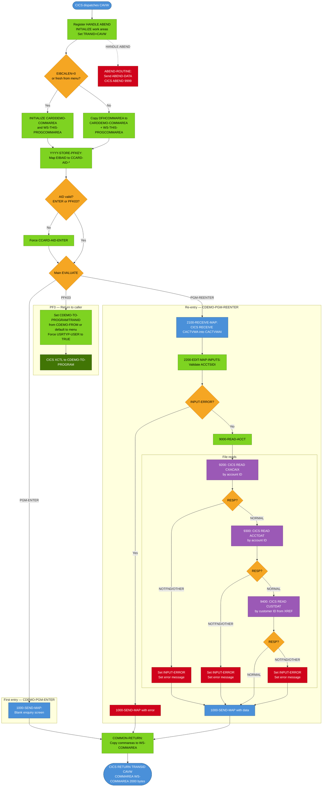

# BIZ-COACTVWC — Account View Screen

| Attribute | Value |
|-----------|-------|
| **Program** | COACTVWC |
| **Type** | CICS Online — Pseudo-Conversational |
| **Transaction ID** | CAVW |
| **BMS Map** | CACTVWA / Mapset COACTVW |
| **Language** | COBOL |
| **Source File** | `source/cobol/COACTVWC.cbl` |
| **Lines** | 942 |
| **Date Written** | May 2022 |
| **Version Tag** | CardDemo_v1.0-15-g27d6c6f-68 · 2022-07-19 |

---

## 1. Business Purpose

COACTVWC displays the complete account and customer profile for a credit card account. The user enters an 11-digit account number; the program performs three sequential VSAM reads — the card cross-reference alternate index (CXACAIX), the account master file (ACCTDAT), and the customer master file (CUSTDAT) — and paints all retrieved data onto a single enquiry screen.

The screen is read-only. The user cannot modify any field. PF3 returns to the calling program (typically the main menu, COMEN01C). No other navigation keys are active; any other key is silently remapped to ENTER and treated as a re-display request.

---

## 2. Program Flow

### 2.1 Startup

`0000-MAIN` is the sole entry point. On arrival:

1. `EXEC CICS HANDLE ABEND LABEL(ABEND-ROUTINE)` is registered. Any unhandled CICS exception from this point will transfer control to the abend handler.
2. `CC-WORK-AREA`, `WS-MISC-STORAGE`, and `WS-COMMAREA` are initialized.
3. `WS-TRANID` is set to `LIT-THISTRANID` (`'CAVW'`).
4. `WS-RETURN-MSG-OFF` (SPACES) is set true, clearing any prior error text.
5. Commarea handling: if `EIBCALEN = 0` **or** the caller is the main menu (`CDEMO-FROM-PROGRAM = 'COMEN01C'`) and this is the first entry (`NOT CDEMO-PGM-REENTER`), both `CARDDEMO-COMMAREA` and `WS-THIS-PROGCOMMAREA` are initialized to LOW-VALUES. Otherwise, `DFHCOMMAREA` bytes 1–N are copied into `CARDDEMO-COMMAREA`, and the immediately following bytes into `WS-THIS-PROGCOMMAREA`. The combined commarea passed on RETURN is `WS-COMMAREA` (PIC X(2000)).

6. `YYYY-STORE-PFKEY` (inline from CSSTRPFY) maps `EIBAID` to the `CCARD-AID-*` 88-level values. PF13–PF24 are mapped to PF01–PF12 respectively (keyboard shift row equivalence).

7. AID validation: if `CCARD-AID-ENTER` or `CCARD-AID-PFK03` is true, `PFK-VALID` is set; all other AIDs are forced to `CCARD-AID-ENTER` (the program treats any unrecognized key as ENTER).

### 2.2 Main Processing

The main EVALUATE dispatches on three mutually exclusive conditions:

**CCARD-AID-PFK03 (PF3 — Exit)**

The program routes back to the caller:
- If `CDEMO-FROM-TRANID` is blank/LOW-VALUES, `CDEMO-TO-TRANID` is set to `LIT-MENUTRANID` (`'CM00'`); otherwise the caller's tranid is used.
- If `CDEMO-FROM-PROGRAM` is blank/LOW-VALUES, `CDEMO-TO-PROGRAM` is set to `LIT-MENUPGM` (`'COMEN01C'`); otherwise the caller's program name is used.
- `CDEMO-FROM-TRANID` is set to `'CAVW'` and `CDEMO-FROM-PROGRAM` to `'COACTVWC'`.
- `CDEMO-USRTYP-USER` is forced to `TRUE` (the program overrides the user type to Regular User regardless of what was in the commarea — this is a potential security issue).
- `CDEMO-PGM-ENTER` is set (context = 0, first entry for the next program).
- `CDEMO-LAST-MAPSET` and `CDEMO-LAST-MAP` are set to this program's map identifiers.
- CICS `XCTL` is issued to `CDEMO-TO-PROGRAM` with `CARDDEMO-COMMAREA`.

**CDEMO-PGM-ENTER (first entry, context = 0)**

`1000-SEND-MAP` is called to display the blank/initial enquiry screen. `GO TO COMMON-RETURN` follows — the CICS RETURN is issued at `COMMON-RETURN` with `TRANSID CAVW`.

**CDEMO-PGM-REENTER (subsequent entry, context = 1)**

`2000-PROCESS-INPUTS` is called:
1. `2100-RECEIVE-MAP` — CICS RECEIVE MAP CACTVWA into `CACTVWAI`.
2. `2200-EDIT-MAP-INPUTS` — validates the account number field:
   - If `ACCTSIDI` is `'*'` or spaces, `CC-ACCT-ID` is set to LOW-VALUES and `FLG-ACCTFILTER-BLANK` is set. Error: "Account number not provided".
   - If `CC-ACCT-ID` is non-numeric or equals zero: error "Account Filter must be a non-zero 11 digit number".
   - If valid: `CC-ACCT-ID` is moved to `CDEMO-ACCT-ID`, `FLG-ACCTFILTER-ISVALID` is set.
   - Cross-field check: if blank, `NO-SEARCH-CRITERIA-RECEIVED` message is set.
3. After editing, if `INPUT-ERROR`, `1000-SEND-MAP` is called and the program returns without doing file I/O.
4. If valid, `9000-READ-ACCT` is called (see below), then `1000-SEND-MAP` is called to display results.

**`9000-READ-ACCT` — Three sequential reads:**

1. **`9200-GETCARDXREF-BYACCT`**: CICS READ on `CXACAIX` (alternate index on `LIT-CARDXREFNAME-ACCT-PATH` = `'CXACAIX '`), key = `WS-CARD-RID-ACCT-ID-X` (PIC X(11) — account ID as character). On NORMAL: `XREF-CUST-ID` → `CDEMO-CUST-ID`; `XREF-CARD-NUM` → `CDEMO-CARD-NUM`. On NOTFND: detailed error message; sets `INPUT-ERROR` and `FLG-ACCTFILTER-NOT-OK`. On OTHER: generic file error message.

2. **`9300-GETACCTDATA-BYACCT`** (skipped if step 1 failed): CICS READ on `ACCTDAT` (`'ACCTDAT '`), key = `WS-CARD-RID-ACCT-ID-X`. On NORMAL: `FOUND-ACCT-IN-MASTER` is set. On NOTFND / OTHER: error message, flags set.

3. **`9400-GETCUSTDATA-BYCUST`** (skipped if step 2 failed): CICS READ on `CUSTDAT` (`'CUSTDAT '`), key = `WS-CARD-RID-CUST-ID-X` (PIC X(09) — customer ID as character, obtained from XREF). On NORMAL: `FOUND-CUST-IN-MASTER` is set. On NOTFND / OTHER: error message.

**`1000-SEND-MAP`** prepares and sends the screen:
1. `1100-SCREEN-INIT` — initializes `CACTVWAO` to LOW-VALUES, calls `FUNCTION CURRENT-DATE` twice (redundant), populates title/tranid/pgmname/date/time header fields.
2. `1200-SETUP-SCREEN-VARS` — moves account fields (`ACCT-ACTIVE-STATUS`, `ACCT-CURR-BAL`, `ACCT-CREDIT-LIMIT`, `ACCT-CASH-CREDIT-LIMIT`, `ACCT-CURR-CYC-CREDIT`, `ACCT-CURR-CYC-DEBIT`, `ACCT-OPEN-DATE`, `ACCT-EXPIRAION-DATE`, `ACCT-REISSUE-DATE`, `ACCT-GROUP-ID`) to map output fields; formats SSN as `XXX-XX-XXXX`; moves all customer name/address/phone/demographic fields to map. If `WS-NO-INFO-MESSAGE`, sets `WS-PROMPT-FOR-INPUT` ("Enter or update id of account to display"). Moves `WS-RETURN-MSG` to `ERRMSGO` and `WS-INFO-MSG` to `INFOMSGO`.
3. `1300-SETUP-SCREEN-ATTRS` — sets `ACCTSIDA` to `DFHBMFSE` (field-send extended, forces field to be sent); positions cursor to `ACCTSID` field with length -1 in all cases (both WHEN branches of the EVALUATE are identical — cursor always goes to account ID field). Sets `ACCTSIDC` to default colour; red if invalid. If blank and REENTER: puts `'*'` as placeholder and turns field red.
4. `1400-SEND-SCREEN` — CICS `SEND MAP CACTVWA MAPSET COACTVW FROM CACTVWAO CURSOR ERASE FREEKB RESP(WS-RESP-CD)`.

### 2.3 Shutdown

`COMMON-RETURN` always executes at the end of every non-XCTL path:

1. `WS-RETURN-MSG` is moved to `CCARD-ERROR-MSG`.
2. `CARDDEMO-COMMAREA` is copied into `WS-COMMAREA(1:N)` and `WS-THIS-PROGCOMMAREA` into the bytes immediately after.
3. `EXEC CICS RETURN TRANSID('CAVW') COMMAREA(WS-COMMAREA) LENGTH(LENGTH OF WS-COMMAREA)` is issued.

The `WS-COMMAREA` (PIC X(2000)) acts as a superset commarea carrying both `CARDDEMO-COMMAREA` (the standard cross-program commarea) and `WS-THIS-PROGCOMMAREA` (the local `CA-FROM-PROGRAM`/`CA-FROM-TRANID` fields).

---

## 3. Error Handling

| Condition | Detection | Response |
|-----------|-----------|----------|
| Account ID blank or `'*'` | `CC-ACCT-ID = LOW-VALUES/SPACES` | `WS-PROMPT-FOR-ACCT`: "Account number not provided"; INPUT-ERROR set |
| Account ID non-numeric or zero | Inline test | "Account Filter must be a non-zero 11 digit number"; INPUT-ERROR set |
| CXACAIX READ — not found | `WS-RESP-CD = DFHRESP(NOTFND)` | Formatted message with account ID and RESP codes |
| CXACAIX READ — other error | `WS-RESP-CD` other | Generic "File Error: READ on CXACAIX returned RESP..." |
| ACCTDAT READ — not found | `WS-RESP-CD = DFHRESP(NOTFND)` | "Account: `<id>` not found in Acct Master file. Resp:..." |
| ACCTDAT READ — other error | `WS-RESP-CD` other | Generic file error message |
| CUSTDAT READ — not found | `WS-RESP-CD = DFHRESP(NOTFND)` | "CustId: `<id>` not found in customer master. Resp:..." |
| CUSTDAT READ — other error | `WS-RESP-CD` other | Generic file error message |
| Unexpected AID/context | WHEN OTHER in main EVALUATE | `ABEND-CODE = '0001'`, plain-text error to terminal, CICS RETURN (not ABEND) |
| Any unhandled CICS exception | HANDLE ABEND | `ABEND-ROUTINE`: sends ABEND-DATA to terminal, then issues `CICS ABEND ABCODE('9999')` |

The `SEND-PLAIN-TEXT` and `SEND-LONG-TEXT` routines both issue a plain `EXEC CICS RETURN` (no TRANSID) after sending text, which terminates the task. `SEND-LONG-TEXT` is never called (all calls to it are commented out); it is dead code.

---

## 4. Migration Notes

1. **Duplicate `0000-MAIN-EXIT` label (lines 408 and 411)**: The EXIT paragraph is defined twice. This is harmless in COBOL (the second is unreachable dead code) but is a code defect. Java should have a single exit path.

2. **`FUNCTION CURRENT-DATE` called twice in `1100-SCREEN-INIT`** (lines 434 and 441): Both calls write to `WS-CURDATE-DATA`. The second call overwrites the first with the same data (both executed within milliseconds). One call is redundant. Java should call `LocalDateTime.now()` once.

3. **`CDEMO-USRTYP-USER` forced to TRUE on PF3 exit** (line 344): When the user presses PF3 to leave this screen, the program unconditionally sets the user type to `'U'` (Regular User) before issuing XCTL. If the signed-in user was an Administrator, the commarea passed to the next program will show them as a regular user. This is a latent security defect. Java must preserve the original user type through navigation.

4. **Cursor positioning EVALUATE has identical WHEN branches** (lines 547–551): Both `WHEN FLG-ACCTFILTER-NOT-OK` and `WHEN FLG-ACCTFILTER-BLANK` move `-1` to `ACCTSIDL`; the WHEN OTHER branch also moves `-1`. The cursor always goes to the account ID field regardless of state. The conditional structure adds no value; Java should just always focus the account ID input field.

5. **ACCT-ADDR-ZIP field**: `ACCOUNT-RECORD` contains `ACCT-ADDR-ZIP PIC X(10)` (from CVACT01Y) but this field is never moved to any map output field in `1200-SETUP-SCREEN-VARS`. It exists in the VSAM record but is not displayed. Java should include it in the account DTO for completeness, even if the UI does not initially display it.

6. **SSN formatting**: `CUST-SSN` (PIC 9(09)) is formatted as `XXX-XX-XXXX` using STRING before display. Java must not store the formatted SSN; apply formatting only in the view layer. The underlying value is a 9-digit integer.

7. **ACCT-CURR-BAL, ACCT-CREDIT-LIMIT, etc.**: These are PIC S9(10)V99 — signed numeric with 2 implied decimal places. Java must use `BigDecimal` with scale 2. Never use `double` or `float`.

8. **`WS-COMMAREA PIC X(2000)`**: The combined commarea is 2000 bytes — larger than the standard `CARDDEMO-COMMAREA`. CICS may impose a maximum commarea size. The Java design should replace commarea passing with a session bean or JWT claims.

9. **ACCT-EXPIRAION-DATE**: The field name misspells "EXPIRATION" as "EXPIRAION" consistently in CVACT01Y and COACTVWC. The Java entity field must replicate this spelling in any VSAM-mapped record but should use the correct spelling (`expirationDate`) in the business layer.

10. **`SEND-LONG-TEXT` dead code**: All calls to `SEND-LONG-TEXT` are commented out. The paragraph compiles but is never reached. Do not generate an equivalent in Java.

---

## Appendix A — Working Storage Fields

### WS-MISC-STORAGE

| Field | PIC | Notes |
|-------|-----|-------|
| `WS-RESP-CD` | S9(09) COMP | CICS RESP code from MAP/FILE operations |
| `WS-REAS-CD` | S9(09) COMP | CICS RESP2 code |
| `WS-TRANID` | X(04) | Set to `'CAVW'` at startup |
| `WS-INPUT-FLAG` | X(01) | 88 `INPUT-OK` = `'0'`; `INPUT-ERROR` = `'1'`; `INPUT-PENDING` = LOW-VALUES |
| `WS-PFK-FLAG` | X(01) | 88 `PFK-VALID` = `'0'`; `PFK-INVALID` = `'1'`; `INPUT-PENDING` = LOW-VALUES (note: `INPUT-PENDING` appears on both flags — duplicate 88-level name) |
| `WS-EDIT-ACCT-FLAG` | X(01) | 88 `FLG-ACCTFILTER-NOT-OK` = `'0'`; `FLG-ACCTFILTER-ISVALID` = `'1'`; `FLG-ACCTFILTER-BLANK` = `' '` |
| `WS-EDIT-CUST-FLAG` | X(01) | 88 `FLG-CUSTFILTER-NOT-OK` = `'0'`; `FLG-CUSTFILTER-ISVALID` = `'1'`; `FLG-CUSTFILTER-BLANK` = `' '` — declared but never set |
| `WS-XREF-RID` | composite | 36-byte VSAM key structure: card number (16) + customer ID numeric/char (9/9) + account ID numeric/char (11/11) |
| `WS-ACCOUNT-MASTER-READ-FLAG` | X(01) | 88 `FOUND-ACCT-IN-MASTER` = `'1'` |
| `WS-CUST-MASTER-READ-FLAG` | X(01) | 88 `FOUND-CUST-IN-MASTER` = `'1'` |
| `WS-FILE-ERROR-MESSAGE` | composite 80 chars | Template: `'File Error: <opname> on <filename> returned RESP <resp>,RESP2 <resp2>'` |
| `WS-LONG-MSG` | X(500) | Debug message buffer — never used in production |
| `WS-INFO-MSG` | X(40) | 88 `WS-NO-INFO-MESSAGE` = SPACES/LOW-VALUES; `WS-PROMPT-FOR-INPUT` = `'Enter or update id of account to display'`; `WS-INFORM-OUTPUT` = `'Displaying details of given Account'` |
| `WS-RETURN-MSG` | X(75) | Error/status message; 88 levels for each known error condition |

### WS-LITERALS

| Literal | Value | Purpose |
|---------|-------|---------|
| `LIT-THISPGM` | `'COACTVWC'` | Own program name |
| `LIT-THISTRANID` | `'CAVW'` | Own transaction ID |
| `LIT-THISMAPSET` | `'COACTVW '` | Own mapset |
| `LIT-THISMAP` | `'CACTVWA'` | Own map |
| `LIT-MENUPGM` | `'COMEN01C'` | Main menu program |
| `LIT-MENUTRANID` | `'CM00'` | Main menu transaction |
| `LIT-ACCTFILENAME` | `'ACCTDAT '` | Account VSAM dataset |
| `LIT-CUSTFILENAME` | `'CUSTDAT '` | Customer VSAM dataset |
| `LIT-CARDFILENAME` | `'CARDDAT '` | Card VSAM dataset (declared but not used in any file READ) |
| `LIT-CARDFILENAME-ACCT-PATH` | `'CARDAIX '` | Card alternate index (declared but not used in any file READ) |
| `LIT-CARDXREFNAME-ACCT-PATH` | `'CXACAIX '` | Card cross-reference alternate index (used for XREF read) |
| `LIT-CCLISTPGM` | `'COCRDLIC'` | Credit card list program (declared, not used) |
| `LIT-CARDUPDATEPGM` | `'COCRDUPC'` | Card update program (declared, not used) |
| `LIT-CARDDTLPGM` | `'COCRDSLC'` | Card detail program (declared, not used) |

### CC-WORK-AREA (from CVCRD01Y)

| Field | PIC | Notes |
|-------|-----|-------|
| `CCARD-AID` | X(05) | AID value set by CSSTRPFY; 88-levels: `CCARD-AID-ENTER` = `'ENTER'`; `CCARD-AID-CLEAR` = `'CLEAR'`; `CCARD-AID-PA1` = `'PA1  '`; `CCARD-AID-PFK01`–`CCARD-AID-PFK12` = `'PFK01'`–`'PFK12'` |
| `CCARD-NEXT-PROG` | X(08) | Next program name (set in `2000-PROCESS-INPUTS`) |
| `CCARD-NEXT-MAPSET` | X(07) | Next mapset |
| `CCARD-NEXT-MAP` | X(07) | Next map |
| `CCARD-ERROR-MSG` | X(75) | Error message passed via COMMON-RETURN |
| `CCARD-RETURN-MSG` | X(75) | Return message; 88 `CCARD-RETURN-MSG-OFF` = LOW-VALUES |
| `CC-ACCT-ID` | X(11) / redefined as 9(11) | Account ID from screen input |
| `CC-CARD-NUM` | X(16) / redefined as 9(16) | Card number (not used for input here) |
| `CC-CUST-ID` | X(09) / redefined as 9(09) | Customer ID (not used for input here) |

### WS-THIS-PROGCOMMAREA

| Field | PIC | Notes |
|-------|-----|-------|
| `CA-FROM-PROGRAM` | X(08) | Program context local to COACTVWC (separate from CARDDEMO-COMMAREA `CDEMO-FROM-PROGRAM`) |
| `CA-FROM-TRANID` | X(04) | Transaction context local to COACTVWC |

### ABEND-DATA (from CSMSG02Y)

| Field | PIC | Notes |
|-------|-----|-------|
| `ABEND-CODE` | X(04) | Abend code set by program; `'9999'` used in CICS ABEND call |
| `ABEND-CULPRIT` | X(08) | Set to `LIT-THISPGM` |
| `ABEND-REASON` | X(50) | Reason text |
| `ABEND-MSG` | X(72) | Abend message |

---

## Appendix B — File and Data Structure Layouts

### CARD-XREF-RECORD (from CVACT03Y) — CXACAIX dataset

| Field | PIC | Notes |
|-------|-----|-------|
| `XREF-CARD-NUM` | X(16) | Card number |
| `XREF-CUST-ID` | 9(09) | Customer ID |
| `XREF-ACCT-ID` | 9(11) | Account ID — the alternate index key |
| `FILLER` | X(14) | Padding to 50-byte record length |

### ACCOUNT-RECORD (from CVACT01Y) — ACCTDAT dataset

| Field | PIC | Notes |
|-------|-----|-------|
| `ACCT-ID` | 9(11) | Primary key |
| `ACCT-ACTIVE-STATUS` | X(01) | Account status code |
| `ACCT-CURR-BAL` | S9(10)V99 | Current balance — use BigDecimal in Java |
| `ACCT-CREDIT-LIMIT` | S9(10)V99 | Credit limit — use BigDecimal in Java |
| `ACCT-CASH-CREDIT-LIMIT` | S9(10)V99 | Cash advance limit — use BigDecimal in Java |
| `ACCT-OPEN-DATE` | X(10) | Date account was opened |
| `ACCT-EXPIRAION-DATE` | X(10) | Expiration date (misspelled; preserve in VSAM mapping) |
| `ACCT-REISSUE-DATE` | X(10) | Reissue date |
| `ACCT-CURR-CYC-CREDIT` | S9(10)V99 | Current cycle credits — use BigDecimal in Java |
| `ACCT-CURR-CYC-DEBIT` | S9(10)V99 | Current cycle debits — use BigDecimal in Java |
| `ACCT-ADDR-ZIP` | X(10) | Account ZIP code — present in record but NOT displayed on screen |
| `ACCT-GROUP-ID` | X(10) | Account group/product code |
| `FILLER` | X(178) | Padding to 300-byte record |

### CUSTOMER-RECORD (from CVCUS01Y) — CUSTDAT dataset

| Field | PIC | Notes |
|-------|-----|-------|
| `CUST-ID` | 9(09) | Primary key |
| `CUST-FIRST-NAME` | X(25) | First name |
| `CUST-MIDDLE-NAME` | X(25) | Middle name |
| `CUST-LAST-NAME` | X(25) | Last name |
| `CUST-ADDR-LINE-1` | X(50) | Address line 1 |
| `CUST-ADDR-LINE-2` | X(50) | Address line 2 |
| `CUST-ADDR-LINE-3` | X(50) | Address line 3 / city |
| `CUST-ADDR-STATE-CD` | X(02) | State code |
| `CUST-ADDR-COUNTRY-CD` | X(03) | Country code |
| `CUST-ADDR-ZIP` | X(10) | ZIP code |
| `CUST-PHONE-NUM-1` | X(15) | Primary phone |
| `CUST-PHONE-NUM-2` | X(15) | Secondary phone |
| `CUST-SSN` | 9(09) | Social Security Number — formatted XXX-XX-XXXX for display |
| `CUST-GOVT-ISSUED-ID` | X(20) | Government-issued ID number |
| `CUST-DOB-YYYY-MM-DD` | X(10) | Date of birth |
| `CUST-EFT-ACCOUNT-ID` | X(10) | EFT bank account ID |
| `CUST-PRI-CARD-HOLDER-IND` | X(01) | Primary card holder indicator |
| `CUST-FICO-CREDIT-SCORE` | 9(03) | FICO score 000–999 |
| `FILLER` | X(168) | Padding to 500-byte record |

---

## Appendix C — BMS Map Fields (CACTVWA / COACTVW)

| Map Field (Output) | Source | Notes |
|--------------------|--------|-------|
| `TITLE01O` | `CCDA-TITLE01` | Screen title line 1 |
| `TITLE02O` | `CCDA-TITLE02` | Screen title line 2 |
| `TRNNAMEO` | `LIT-THISTRANID` (`'CAVW'`) | Transaction ID |
| `PGMNAMEO` | `LIT-THISPGM` (`'COACTVWC'`) | Program name |
| `CURDATEO` | `WS-CURDATE-MM-DD-YY` | Date (MM/DD/YY) |
| `CURTIMEO` | `WS-CURTIME-HH-MM-SS` | Time (HH:MM:SS) |
| `ACCTSIDO` | `CC-ACCT-ID` | Account ID field (also placeholder `'*'` when blank+REENTER) |
| `ACCTSIDC` | `DFHDFCOL`/`DFHRED` | Account ID colour attribute |
| `ACCTSIDA` | `DFHBMFSE` | Account ID extended attributes |
| `ACCTSIDL` | -1 | Cursor length (always -1 → position cursor here) |
| `ACSTTUSO` | `ACCT-ACTIVE-STATUS` | Account status |
| `ACURBALO` | `ACCT-CURR-BAL` | Current balance |
| `ACRDLIMO` | `ACCT-CREDIT-LIMIT` | Credit limit |
| `ACSHLIMO` | `ACCT-CASH-CREDIT-LIMIT` | Cash credit limit |
| `ACRCYCRO` | `ACCT-CURR-CYC-CREDIT` | Current cycle credits |
| `ACRCYDBO` | `ACCT-CURR-CYC-DEBIT` | Current cycle debits |
| `ADTOPENO` | `ACCT-OPEN-DATE` | Open date |
| `AEXPDTO` | `ACCT-EXPIRAION-DATE` | Expiration date |
| `AREISDTO` | `ACCT-REISSUE-DATE` | Reissue date |
| `AADDGRPO` | `ACCT-GROUP-ID` | Group ID |
| `ACSTNUMO` | `CUST-ID` | Customer number |
| `ACSTSSNO` | STRING of `CUST-SSN` | SSN formatted XXX-XX-XXXX |
| `ACSTFCOO` | `CUST-FICO-CREDIT-SCORE` | FICO score |
| `ACSTDOBO` | `CUST-DOB-YYYY-MM-DD` | Date of birth |
| `ACSFNAMO` | `CUST-FIRST-NAME` | First name |
| `ACSMNAMO` | `CUST-MIDDLE-NAME` | Middle name |
| `ACSLNAMO` | `CUST-LAST-NAME` | Last name |
| `ACSADL1O` | `CUST-ADDR-LINE-1` | Address line 1 |
| `ACSADL2O` | `CUST-ADDR-LINE-2` | Address line 2 |
| `ACSCITYO` | `CUST-ADDR-LINE-3` | City |
| `ACSSTTEO` | `CUST-ADDR-STATE-CD` | State |
| `ACSZIPCO` | `CUST-ADDR-ZIP` | ZIP code |
| `ACSCTRYO` | `CUST-ADDR-COUNTRY-CD` | Country |
| `ACSPHN1O` | `CUST-PHONE-NUM-1` | Phone 1 |
| `ACSPHN2O` | `CUST-PHONE-NUM-2` | Phone 2 |
| `ACSGOVTO` | `CUST-GOVT-ISSUED-ID` | Government ID |
| `ACSEFTCO` | `CUST-EFT-ACCOUNT-ID` | EFT account |
| `ACSPFLGO` | `CUST-PRI-CARD-HOLDER-IND` | Primary holder flag |
| `ERRMSGO` | `WS-RETURN-MSG` | Error message |
| `INFOMSGO` | `WS-INFO-MSG` | Informational message |
| `INFOMSGC` | `DFHBMDAR`/`DFHNEUTR` | Info message colour |

| Map Field (Input) | Purpose |
|-------------------|---------|
| `ACCTSIDI` | Account number entered by user |

---

## Appendix D — Known Issues and Latent Bugs

1. **Duplicate `0000-MAIN-EXIT` label (lines 408–412)**: The paragraph name `0000-MAIN-EXIT` appears twice with `EXIT` statements. COBOL compilers will accept the first; the second is unreachable. This is a code defect — remove the duplicate in Java.

2. **`CDEMO-USRTYP-USER` forced on PF3 exit (line 344)**: The program unconditionally sets user type to Regular User when navigating away via PF3. If the logged-in user is an administrator, the next program will receive incorrect access type. This is a security defect. The Java equivalent must preserve `CDEMO-USER-TYPE` unchanged on navigation.

3. **`FUNCTION CURRENT-DATE` called twice (lines 434 and 441)**: Both calls are in `1100-SCREEN-INIT` and both write to `WS-CURDATE-DATA`. The first call (line 434) is immediately overwritten by the second (line 441). This is a harmless redundancy but should be cleaned up.

4. **Identical cursor-position EVALUATE branches (lines 547–551)**: Both `WHEN FLG-ACCTFILTER-NOT-OK` and `WHEN FLG-ACCTFILTER-BLANK` perform the same MOVE. The conditional adds no logic. Java should simplify to an unconditional focus on the account ID field.

5. **`WS-EDIT-CUST-FLAG` never set**: `WS-EDIT-CUST-FLAG` and its 88-levels (`FLG-CUSTFILTER-NOT-OK`, `FLG-CUSTFILTER-ISVALID`, `FLG-CUSTFILTER-BLANK`) are declared but the customer filter validation paragraph (`2210-EDIT-ACCOUNT` equivalent for customers) does not exist. The program always accepts the customer ID returned from XREF without user input validation. Java needs no customer ID input field for this screen.

6. **`ACCT-ADDR-ZIP` not displayed**: The account record contains `ACCT-ADDR-ZIP PIC X(10)` but it is never moved to any map output field. The Java DTO should carry this field even if the initial UI does not render it.

7. **`LIT-CARDFILENAME` and `LIT-CARDFILENAME-ACCT-PATH` unused**: The dataset names for `CARDDAT` and `CARDAIX` are declared as literals but neither is ever used in a CICS READ or WRITE. These are template artifacts. Java must not generate file I/O for `CARDDAT` or `CARDAIX` in this program.

8. **`SEND-LONG-TEXT` dead code**: All calls to `PERFORM SEND-LONG-TEXT` are commented out. The paragraph exists but is never reached. Do not generate an equivalent.

---

## Appendix E — Mermaid Flow Diagram

