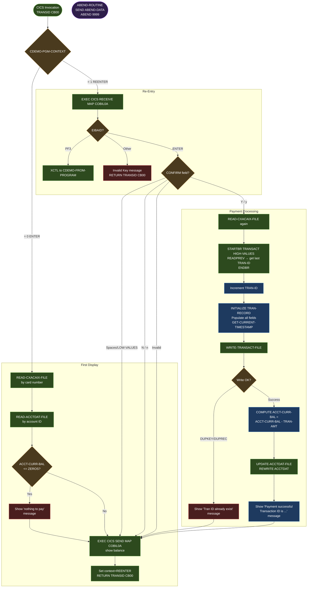

# BIZ-COBIL00C

| Field | Value |
|---|---|
| **Application** | AWS CardDemo |
| **Source File** | `source/cobol/COBIL00C.cbl` |
| **Program Type** | CICS online — credit card bill payment |
| **Transaction ID** | `CB00` |
| **Map / Mapset** | `COBIL0A` / `COBIL00` |
| **Last Updated** | 2026-04-28 |

---

> **Purpose Banner** — COBIL00C is the CardDemo online bill payment screen. It allows a cardholder to pay their current credit card balance in full. The operator first views the current balance; entering `Y` in the CONFIRM field triggers the payment. The program retrieves the highest existing transaction ID, increments it, writes a new transaction record to TRANSACT, recalculates the account balance, and updates ACCTDAT. A latent bug exists: if the TRANSACT write fails with DUPREC/DUPKEY, the balance update has already been applied to the in-memory record but is never committed — creating a discrepancy between what the user sees and what is stored.

---

## Section 1 — Business Purpose

COBIL00C processes a full-balance payment against a cardholder's account. The operator supplies a credit card number on the screen; the program:

1. Looks up the card number in the card cross-reference file (CXACAIX) to obtain the account ID.
2. Reads the account record from ACCTDAT.
3. Displays the current outstanding balance.
4. If the operator confirms with `Y`, creates a new debit transaction in TRANSACT and reduces the account balance to zero.

The payment transaction is hardcoded as a POS terminal bill payment: type code `'02'`, category `2`, source `'POS TERM'`, description `'BILL PAYMENT - ONLINE'`, merchant `'BILL PAYMENT'` (ID `999999999`), city/zip `'N/A'`. The amount equals the full current balance.

---

## Section 2 — Program Flow

COBIL00C follows the CICS pseudo-conversational pattern. `CDEMO-PGM-CONTEXT` in the COMMAREA distinguishes first-time entry from re-entry.

### 2.1 Startup

1. Entered via XCTL from a calling program (typically the main menu) or by direct transaction `CB00`.
2. On entry, the existing COMMAREA is mapped to `WS-COMMAREA`. If `EIBCALEN = 0`, working storage is used as-is (no explicit init — risk of stale data if called without COMMAREA).
3. The AID key from EIBAID is decoded by the inline EVALUATE (equivalent to `YYYY-STORE-PFKEY`).
4. `MAIN-PARA` checks `CDEMO-PGM-CONTEXT`:
   - Context = ENTER (0): calls `SEND-BILL-SCREEN` without processing input (first display).
   - Context = REENTER (1): calls `RECEIVE-BILL-SCREEN` to read map input and process.

### 2.2 Main Processing

**First display — `SEND-BILL-SCREEN`:**

1. `GET-CURRENT-DATETIME` issues `EXEC CICS ASKTIME` / `FORMATTIME` to populate `WS-DATE-TIME` fields for the screen header.
2. Calls `READ-CXACAIX-FILE` using the card number from `CDEMO-CARD-NUM` in the COMMAREA. This EXEC CICS READ against the alternate-index file `CXACAIX` returns `CARD-XREF-RECORD` (`CVACT03Y`): `XREF-ACCT-ID`, `XREF-CUST-ID`.
3. Calls `READ-ACCTDAT-FILE` using `XREF-ACCT-ID`. Returns `ACCOUNT-RECORD` (`CVACT01Y`) with the current balance `ACCT-CURR-BAL` (COMP-3 — use BigDecimal in Java).
4. If `ACCT-CURR-BAL <= ZEROS` (no outstanding balance), moves the message 'You have nothing to pay...' to the screen message field and issues `EXEC CICS SEND MAP` with that message.
5. Otherwise, `ACCT-CURR-BAL` is moved to the screen's balance-display field (`CBALO`) and the screen is sent.
6. `CDEMO-PGM-CONTEXT` is set to REENTER. `EXEC CICS RETURN TRANSID('CB00') COMMAREA(...)` suspends the task.

**Re-entry — `RECEIVE-BILL-SCREEN`:**

1. `EXEC CICS RECEIVE MAP('COBIL0A') MAPSET('COBIL00')` reads the map into working storage. The key input field is `CONFIRMI` (the CONFIRM field).
2. AID key dispatch:
   - **PF3**: `RETURN-TO-PREV-SCREEN` — sets `CDEMO-TO-PROGRAM` to `CDEMO-FROM-PROGRAM` (caller) and issues `EXEC CICS XCTL`.
   - **ENTER**: `PROCESS-ENTER-KEY` — validates the CONFIRM field and processes the payment.
   - **Any other key**: 'Invalid key pressed' message sent; task returns with TRANSID.

**Payment processing — `PROCESS-ENTER-KEY`:**

CONFIRM field validation:
- Spaces or LOW-VALUES → `SEND-BILL-SCREEN` (display only, no action).
- `'Y'` or `'y'` → `CONFIRM-PAYMENT-PROCESSING` — execute the payment.
- `'N'` or `'n'` → `INITIALIZE-COBIL-FIELDS` (clears confirm field) then `SEND-BILL-SCREEN`.
- Any other value → error message 'Invalid value. Valid values are (Y/N)...' then `SEND-BILL-SCREEN`.

**`CONFIRM-PAYMENT-PROCESSING` — the payment execution sequence:**

Step 1 — Establish the next transaction ID:
1. `READ-CXACAIX-FILE` — re-reads card xref to get `XREF-ACCT-ID`.
2. `STARTBR-TRANSACT-FILE` — starts a backward browse on TRANSACT with key `HIGH-VALUES` to position at the last (highest-key) transaction record.
3. `READPREV-TRANSACT-FILE` — reads the previous (i.e., the last committed transaction) record to obtain the most recently assigned `TRAN-ID`.
4. `ENDBR-TRANSACT-FILE` — ends the browse.
5. Increments `TRAN-ID` by 1 to produce the new transaction ID.

Step 2 — Build the transaction record:
1. `INITIALIZE TRAN-RECORD` — zeroes and spaces the full `TRAN-RECORD` (`CVTRA05Y`).
2. Populates fields:
   - `TRAN-ID` — incremented value.
   - `TRAN-TYPE-CD` = `'02'` (bill payment type code).
   - `TRAN-CAT-CD` = `2` (payment category).
   - `TRAN-SOURCE` = `'POS TERM'`.
   - `TRAN-DESC` = `'BILL PAYMENT - ONLINE'`.
   - `TRAN-AMT` = `ACCT-CURR-BAL` (the full outstanding balance; COMP-3 — use BigDecimal in Java).
   - `TRAN-MERCHANT-ID` = `999999999`.
   - `TRAN-MERCHANT-NAME` = `'BILL PAYMENT'`.
   - `TRAN-MERCHANT-CITY` = `'N/A'`.
   - `TRAN-MERCHANT-ZIP` = `'N/A'`.
   - `TRAN-CARD-NUM` = card number from COMMAREA.
3. `GET-CURRENT-TIMESTAMP` — issues `EXEC CICS ASKTIME` / `FORMATTIME` to build `WS-TIMESTAMP`. This timestamp is moved to both `TRAN-ORIG-TS` and `TRAN-PROC-TS`.

Step 3 — Write transaction:
1. `WRITE-TRANSACT-FILE` — `EXEC CICS WRITE FILE('TRANSACT') FROM(TRAN-RECORD)`. On success, sets a success flag.
2. If `DUPKEY` or `DUPREC` condition fires: moves 'Tran ID already exist...' to error message. **The balance computation in Step 4 has not yet run, so the account is not corrupted in this branch.**
3. If any other file error: similar error message.

Step 4 — Update account balance:
1. `COMPUTE ACCT-CURR-BAL = ACCT-CURR-BAL - TRAN-AMT` (i.e., sets balance to zero, since TRAN-AMT = ACCT-CURR-BAL).
2. `UPDATE-ACCTDAT-FILE` — `EXEC CICS REWRITE FILE('ACCTDAT') FROM(ACCOUNT-RECORD)`.
3. On success: moves 'Payment successful.  Your Transaction ID is ' + `TRAN-ID` to the screen message.

**Latent bug — partial write on DUPREC/DUPKEY:** The COMPUTE in Step 4 applies the balance reduction to the `ACCOUNT-RECORD` working-storage copy before `UPDATE-ACCTDAT-FILE` is called. However, in the current code path, Step 4 only executes if Step 3 (write transaction) succeeded. If `DUPKEY`/`DUPREC` fires and the write is rejected, Step 4 is not reached, so ACCTDAT is not updated — this is safe. However, if the TRANSACT write succeeds but the subsequent ACCTDAT REWRITE fails (file error), the transaction record is committed but the balance is not reduced. This leaves the account over-charged relative to TRANSACT.

### 2.3 Shutdown / Return

After any screen send, the program issues `EXEC CICS RETURN TRANSID('CB00') COMMAREA(...)`. On PF3, it issues `EXEC CICS XCTL` to the previous program. `ABEND-ROUTINE` populates `ABEND-DATA` and issues `EXEC CICS ABEND ABCODE('9999')`.

---

## Section 3 — Error Handling

| Condition | Trigger | Response |
|---|---|---|
| Zero balance | `ACCT-CURR-BAL <= ZEROS` | 'You have nothing to pay...' displayed; no payment |
| CONFIRM invalid value | Not Y/y/N/n/spaces/LOW-VALUES | 'Invalid value. Valid values are (Y/N)...' displayed |
| Card not found | NOTFND on `READ-CXACAIX-FILE` | Error message set; map resent |
| Account not found | NOTFND on `READ-ACCTDAT-FILE` | Error message set; map resent |
| TRANSACT DUPKEY / DUPREC | Duplicate transaction ID on write | 'Tran ID already exist...' displayed; ACCTDAT not updated |
| TRANSACT write failure (other) | EXEC CICS WRITE error | File error message; ACCTDAT not updated |
| ACCTDAT REWRITE failure | EXEC CICS REWRITE error | File error message; transaction already committed — data inconsistency (latent bug) |
| Invalid AID key | Any key other than ENTER, PF3 | 'Invalid key pressed' sent; RETURN TRANSID |
| ABEND | Any unexpected CICS ABEND | `ABEND-DATA` sent; `ABEND ABCODE('9999')` |

---

## Section 4 — Migration Notes

1. **`ACCT-CURR-BAL` and `TRAN-AMT` are COMP-3 signed decimal fields — use `BigDecimal` in Java.** `ACCT-CURR-BAL` is `S9(10)V99 COMP-3`; `TRAN-AMT` is `S9(09)V99`. Both must be mapped to `BigDecimal` with scale 2. Use `compareTo()` for the zero-balance check, not `equals()` or `==`.

2. **Transaction atomicity is absent.** COBIL00C writes the TRANSACT record and then REWRITEs ACCTDAT in two separate CICS commands with no encompassing transaction bracket beyond CICS task-level unit of work. If the REWRITE fails after the WRITE succeeds, the data is inconsistent. The Java migration must wrap both operations in a single database transaction (JPA/Hibernate `@Transactional`) to ensure atomicity.

3. **Transaction ID generation is non-atomic.** The STARTBR → READPREV → ENDBR → increment sequence reads the last record and adds 1. Under concurrent load, two tasks executing this sequence simultaneously will derive the same ID. The Java replacement must use a database sequence (`GENERATED ALWAYS AS IDENTITY`) for transaction IDs, not an application-level increment.

4. **Backward browse to find max TRAN-ID is a VSAM idiom.** Java replaces this with `SELECT MAX(tran_id) FROM transactions WHERE ...` or, preferably, a database sequence.

5. **Payment amount is always the full balance.** There is no partial payment capability. If the business requires partial payments in the Java system, this is a new feature that must be separately designed and approved.

6. **All transaction metadata is hardcoded.** `TRAN-TYPE-CD='02'`, `TRAN-CAT-CD=2`, `TRAN-SOURCE='POS TERM'`, `TRAN-DESC='BILL PAYMENT - ONLINE'`, `TRAN-MERCHANT-ID=999999999`, `TRAN-MERCHANT-NAME='BILL PAYMENT'`, `TRAN-MERCHANT-CITY='N/A'`, `TRAN-MERCHANT-ZIP='N/A'`. In Java, define these as named constants with COBOL-origin comments.

7. **`TRAN-ORIG-TS` and `TRAN-PROC-TS` are set to the same timestamp.** In COBIL00C both fields receive the same `WS-TIMESTAMP` value from a single ASKTIME call. In the Java replacement, `orig_ts` should be the moment the payment was initiated; `proc_ts` should be the moment the database write was committed.

8. **CONFIRM field is a single character typed by the operator.** In a web UI this becomes a checkbox or confirmation button. The Y/N parsing logic is not needed.

9. **`TRAN-CARD-NUM` is set from the COMMAREA `CDEMO-CARD-NUM`.** The card number is not re-validated or masked before being written to TRANSACT. The Java replacement must apply PCI-DSS masking/truncation rules before storing or logging card numbers.

10. **`ACCT-CURR-BAL` is read without a READ FOR UPDATE lock.** A concurrent update between the initial READ and the REWRITE could overwrite an intervening change. The Java replacement should use optimistic locking (version column) or pessimistic locking (`SELECT ... FOR UPDATE`) on the account row.

---

## Appendix A — Files and Queues

| File | CICS DDname | Record Structure | Access Method | Notes |
|---|---|---|---|---|
| Card cross-reference (alt index) | `CXACAIX` | `CARD-XREF-RECORD` (CVACT03Y) | READ by card number | Alternate index on CARDXREF keyed by card number |
| Account master | `ACCTDAT` | `ACCOUNT-RECORD` (CVACT01Y) | READ; REWRITE | Balance updated on payment |
| Transaction history | `TRANSACT` | `TRAN-RECORD` (CVTRA05Y) | STARTBR; READPREV; ENDBR; WRITE | Browse for max ID; then new record written |

---

## Appendix B — Copybooks and External Programs

### Copybooks

**`COCOM01Y`** — `CARDDEMO-COMMAREA`. The program uses the standard COMMAREA plus an inline `CDEMO-CB00-INFO` extension block defined within COBIL00C's own working storage (not from a separate copybook):

| Field | Picture | Notes |
|---|---|---|
| `CDEMO-CARD-NUM` | `PIC X(16)` | Card number from COMMAREA, used as CXACAIX key |
| `CDEMO-FROM-PROGRAM` | `PIC X(8)` | Caller program name; used for PF3 back-navigation |
| `CDEMO-TO-PROGRAM` | `PIC X(8)` | Set to `CDEMO-FROM-PROGRAM` on PF3 exit |
| `CDEMO-PGM-CONTEXT` | `PIC X(1)` | `'0'` = ENTER, `'1'` = REENTER |
| `CDEMO-CB00-INFO` | Working-storage extension | Holds screen confirm value and payment state |

**`CVACT01Y`** — `ACCOUNT-RECORD` (300 bytes):

| Field | Picture | Used? | Notes |
|---|---|---|---|
| `ACCT-ID` | `PIC 9(11)` | Yes | Account identifier |
| `ACCT-ACTIVE-STATUS` | `PIC X(1)` | No | Not checked before payment |
| `ACCT-CURR-BAL` | `S9(10)V99 COMP-3` | Yes | Current balance; full amount becomes payment amount. COMP-3 — use BigDecimal |
| `ACCT-CREDIT-LIMIT` | `S9(10)V99 COMP-3` | No | Not used in payment flow |
| `ACCT-CASH-CREDIT-LIMIT` | `S9(10)V99 COMP-3` | No | Not used |
| `ACCT-OPEN-DATE` | `PIC X(10)` | No | Not used |
| `ACCT-EXPIRAION-DATE` | `PIC X(10)` | No | Not used (typo in field name preserved) |
| `ACCT-REISSUE-DATE` | `PIC X(10)` | No | Not used |
| `ACCT-CURR-CYC-CREDIT` | `S9(10)V99 COMP-3` | No | Not used |
| `ACCT-CURR-CYC-DEBIT` | `S9(10)V99 COMP-3` | No | Not used |
| `ACCT-ADDR-ZIP` | `PIC X(10)` | No | Not used |
| `ACCT-GROUP-ID` | `PIC X(10)` | No | Not used |
| FILLER | `PIC X(178)` | No | Pad to 300 bytes |

**`CVACT03Y`** — `CARD-XREF-RECORD` (50 bytes):

| Field | Picture | Used? | Notes |
|---|---|---|---|
| `XREF-CARD-NUM` | `PIC X(16)` | Yes | Card number key for alternate index lookup |
| `XREF-CUST-ID` | `PIC 9(09)` | No | Customer ID; not used in payment flow |
| `XREF-ACCT-ID` | `PIC 9(11)` | Yes | Account ID used to read ACCTDAT |
| FILLER | `PIC X(14)` | No | Padding |

**`CVTRA05Y`** — `TRAN-RECORD` (350 bytes):

| Field | Picture | Used? | Notes |
|---|---|---|---|
| `TRAN-ID` | `PIC X(16)` | Yes | Incremented from last record; written as new record key |
| `TRAN-TYPE-CD` | `PIC X(02)` | Yes | Hardcoded `'02'` |
| `TRAN-CAT-CD` | `PIC 9(04)` | Yes | Hardcoded `2` |
| `TRAN-SOURCE` | `PIC X(10)` | Yes | Hardcoded `'POS TERM'` |
| `TRAN-DESC` | `PIC X(100)` | Yes | Hardcoded `'BILL PAYMENT - ONLINE'` |
| `TRAN-AMT` | `S9(09)V99 COMP-3` | Yes | Full current balance amount. COMP-3 — use BigDecimal |
| `TRAN-MERCHANT-ID` | `PIC 9(09)` | Yes | Hardcoded `999999999` |
| `TRAN-MERCHANT-NAME` | `PIC X(50)` | Yes | Hardcoded `'BILL PAYMENT'` |
| `TRAN-MERCHANT-CITY` | `PIC X(50)` | Yes | Hardcoded `'N/A'` |
| `TRAN-MERCHANT-ZIP` | `PIC X(10)` | Yes | Hardcoded `'N/A'` |
| `TRAN-CARD-NUM` | `PIC X(16)` | Yes | Card number from COMMAREA |
| `TRAN-ORIG-TS` | `PIC X(26)` | Yes | Set to current timestamp (same as PROC-TS) |
| `TRAN-PROC-TS` | `PIC X(26)` | Yes | Set to current timestamp (same as ORIG-TS) |
| FILLER | `PIC X(20)` | No | Pad to 350 bytes |

**`COTTL01Y`** — Screen titles. `CCDA-TITLE01` and `CCDA-TITLE02` used in header; `CCDA-THANK-YOU` not used.

**`CSDAT01Y`** — Date/time working storage. `WS-CURDATE-MM-DD-YY` and `WS-CURTIME-HH-MM-SS` displayed in header. `WS-TIMESTAMP` used for transaction timestamps.

**`CSMSG01Y`** — `CCDA-MSG-INVALID-KEY` used for invalid AID response. `CCDA-MSG-THANK-YOU` not used.

**`CSMSG02Y`** — `ABEND-DATA` structure; used in ABEND-ROUTINE only.

**`DFHAID`** — AID key constants. `DFHENTER`, `DFHPF3`, `DFHCLEAR`, `DFHPA1`, `DFHPA2`, `DFHPF1`–`DFHPF24` referenced in EVALUATE.

**`DFHBMSCA`** — BMS screen attribute constants.

**`COBIL00`** — BMS mapset copybook for `COBIL00` / `COBIL0A`. Provides map field names: `CONFIRMI`/`CONFIRMO` (confirm entry), `CBALO`/`CBALI` (balance display), error message and header fields.

### External Programs / Services Called

| Name | Mechanism | When |
|---|---|---|
| CICS `ASKTIME` / `FORMATTIME` | EXEC CICS | Timestamp generation at screen build and at payment time |
| CICS `SEND MAP` / `RECEIVE MAP` | EXEC CICS BMS | Screen I/O |
| Previous program (`CDEMO-FROM-PROGRAM`) | EXEC CICS XCTL | PF3 back-navigation |

---

## Appendix C — Hardcoded Literals

| Location | Literal | Meaning |
|---|---|---|
| `EXEC CICS RETURN TRANSID` | `'CB00'` | Re-entry transaction ID |
| `TRAN-TYPE-CD` | `'02'` | Bill payment transaction type |
| `TRAN-CAT-CD` | `2` | Payment category code |
| `TRAN-SOURCE` | `'POS TERM'` | Transaction source label |
| `TRAN-DESC` | `'BILL PAYMENT - ONLINE'` | Transaction description |
| `TRAN-MERCHANT-ID` | `999999999` | Synthetic merchant ID for bill payments |
| `TRAN-MERCHANT-NAME` | `'BILL PAYMENT'` | Merchant name |
| `TRAN-MERCHANT-CITY` | `'N/A'` | Merchant city |
| `TRAN-MERCHANT-ZIP` | `'N/A'` | Merchant ZIP code |
| Balance check | `ZEROS` | Sentinel for zero balance check |
| `EXEC CICS ABEND ABCODE` | `'9999'` | ABEND diagnostic code |

---

## Appendix D — Internal Working Fields

| Field | Picture | Usage | Notes |
|---|---|---|---|
| `WS-CONFIRM-FIELD` | `PIC X(1)` | Receives user's Y/N input from BMS CONFIRMI field | Validated against Y/y/N/n/spaces |
| `WS-CARD-RID-CARDNUM` | `PIC X(16)` | Card number used as CXACAIX file key | Set from `CDEMO-CARD-NUM` |
| `WS-ACCT-ID` | `PIC 9(11)` | Account ID used as ACCTDAT key | Set from `XREF-ACCT-ID` |
| `WS-TRAN-ID-NUM` | `PIC 9(16)` | Numeric overlay of `TRAN-ID` for increment arithmetic | REDEFINES or separate numeric field |
| `ACCOUNT-RECORD` | COPY `CVACT01Y` | Account master record in working storage | Read from ACCTDAT; REWRITTEN after balance update |
| `CARD-XREF-RECORD` | COPY `CVACT03Y` | Card cross-reference record | Read from CXACAIX |
| `TRAN-RECORD` | COPY `CVTRA05Y` | Transaction record to be written | INITIALIZEd then fully populated before write |
| `WS-TIMESTAMP` | `PIC X(26)` (from CSDAT01Y) | Current timestamp for TRAN-ORIG-TS and TRAN-PROC-TS | Built by CICS FORMATTIME |
| `CARDDEMO-COMMAREA` | COPY `COCOM01Y` | Full navigation/session COMMAREA | Passed on every RETURN TRANSID |
| `ABEND-DATA` | COPY `CSMSG02Y` | ABEND diagnostic structure | Only populated in ABEND-ROUTINE |

---

## Appendix E — Control Flow Diagram

