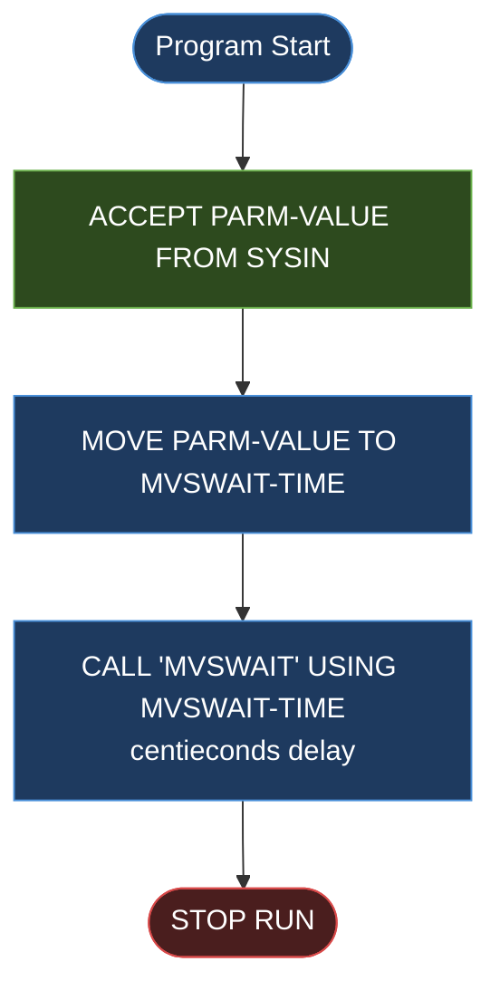

# BIZ-COBSWAIT

| Field | Value |
|---|---|
| **Application** | AWS CardDemo |
| **Source File** | `source/cobol/COBSWAIT.cbl` |
| **Program Type** | Batch utility — JCL sleep / delay |
| **Last Updated** | 2026-04-28 |

---

> **Purpose Banner** — COBSWAIT is a minimal, single-purpose batch delay utility. It reads a numeric wait-time value from SYSIN, passes that value to the IBM z/OS system service routine `MVSWAIT`, and then terminates. It has no business logic, no file I/O, no CICS, and no copybook dependencies.

---

## Section 1 — Business Purpose

COBSWAIT exists solely to introduce a timed pause in a JCL job stream. It is called when a downstream step must wait for an upstream batch job, data feed, or system event to complete before proceeding. The wait duration is expressed in centiseconds and is supplied at run time through the JCL SYSIN DD statement, making the delay configurable without recompiling the program.

Typical use cases include:
- Waiting for VSAM file batch updates to propagate before an online subsystem resumes access.
- Introducing a delay between dependent job steps in a multi-step JCL stream.
- Acting as a placeholder step during system testing to simulate latency.

The program has no knowledge of what it is waiting for; it is a pure delay primitive.

---

## Section 2 — Program Flow

Because this is a batch program with no CICS, there is no pseudo-conversational state machine. The program executes linearly and terminates.

### 2.1 Startup

The program begins at the implicit `PROCEDURE DIVISION` entry point. There are no initialisation paragraphs, no `OPEN` statements, and no environment setup.

### 2.2 Main Processing

1. `ACCEPT PARM-VALUE FROM SYSIN` — reads up to 8 characters from the SYSIN data stream provided in the JCL. The value is expected to be an 8-digit numeric string representing the delay in centiseconds.
2. `MOVE PARM-VALUE TO MVSWAIT-TIME` — moves the alphanumeric SYSIN input into the binary `MVSWAIT-TIME` field. Because `PARM-VALUE` is `PIC X(8)` and `MVSWAIT-TIME` is `PIC 9(8) COMP` (binary), COBOL performs an implicit alphanumeric-to-numeric conversion here. If the SYSIN value is non-numeric, the result is undefined.
3. `CALL 'MVSWAIT' USING MVSWAIT-TIME` — invokes the IBM z/OS system service `MVSWAIT`, passing the centisecond count as an argument. `MVSWAIT` suspends the task for the requested duration and returns control when the interval expires. This is a static CALL; the program must be linked with the MVSWAIT stub or the module must be available in the LINKLIST.

### 2.3 Shutdown

`STOP RUN` immediately follows the `CALL`. There is no error checking on the CALL return code, no cleanup, and no conditional logic.

---

## Section 3 — Error Handling

COBSWAIT has no error handling. Specifically:

- There is no `ON EXCEPTION` or `ON OVERFLOW` clause on the `CALL` statement. If `MVSWAIT` ABENDs or returns an error code, the program proceeds to `STOP RUN` without capturing or reporting the condition.
- There is no validation that `PARM-VALUE` contains a valid numeric string before it is moved to `MVSWAIT-TIME`. A non-numeric SYSIN value will produce a data exception (`S0C7`) ABEND at runtime.
- There is no check that the wait time is within a reasonable range. A value of `99999999` centiseconds (approximately 277 hours) would cause the job to hang for nearly 12 days with no diagnostic.

---

## Section 4 — Migration Notes

1. **No business logic to preserve.** The entire program translates to a single `Thread.sleep()` call in Java. There are no business rules, no data transformations, and no file interactions.

2. **SYSIN input is unsafe.** The COBOL program performs no validation on the SYSIN value. The Java replacement must validate that the input is a positive integer within an acceptable range before invoking the sleep, or it should accept the delay as a JCL parameter passed through environment variable or command-line argument.

3. **Unit of time is centiseconds, not milliseconds.** `MVSWAIT-TIME` is in centiseconds (1/100th of a second). Java's `Thread.sleep()` takes milliseconds. The migration must multiply the input value by 10: `Thread.sleep(waitTimeCentiseconds * 10L)`.

4. **`MVSWAIT-TIME` is `PIC 9(8) COMP` (binary, 4 bytes).** The maximum representable value is 99,999,999 centiseconds ≈ 277 hours. The Java replacement should use a `long` to hold the sleep duration in milliseconds after conversion.

5. **`PARM-VALUE` is `PIC X(8)`.** The SYSIN field holds only 8 characters. If the JCL SYSIN contains leading spaces or trailing characters, the implicit MOVE will include them in the binary field, likely producing a data exception. The Java replacement should trim input before parsing.

6. **No error code from MVSWAIT is checked.** The Java replacement should catch `InterruptedException` from `Thread.sleep()` and log it (or re-interrupt the thread per Java convention) rather than silently ignoring it.

7. **Static CALL.** The dependency on `MVSWAIT` is a z/OS system service with no portable equivalent. In the Java migration, this program is simply replaced with a utility class that sleeps and then exits.

---

## Appendix A — Files and Queues

This program accesses no files, VSAM datasets, databases, or message queues.

| Resource | Type | Access | Notes |
|---|---|---|---|
| SYSIN | JCL DD (stream) | Read | 8-byte numeric centisecond wait time |

---

## Appendix B — Copybooks and External Programs

**Copybooks:** None. No `COPY` statements appear in COBSWAIT.

**External Programs Called:**

| Name | Type | Purpose | Return Value Checked? |
|---|---|---|---|
| `MVSWAIT` | IBM z/OS system service | Suspends the task for `MVSWAIT-TIME` centiseconds | No |

---

## Appendix C — Hardcoded Literals

| Location | Literal | Meaning |
|---|---|---|
| `CALL 'MVSWAIT'` | `'MVSWAIT'` | IBM system routine name; not configurable |

---

## Appendix D — Internal Working Fields

| Field | Picture | Usage | Notes |
|---|---|---|---|
| `PARM-VALUE` | `PIC X(8)` | Alphanumeric | Receives raw SYSIN input; no numeric validation performed |
| `MVSWAIT-TIME` | `PIC 9(8) COMP` | Binary integer | Centisecond delay passed to `MVSWAIT`; COMP = binary 4-byte integer in Java |

---

## Appendix E — Control Flow Diagram

