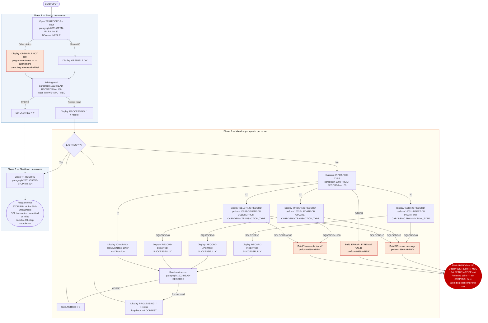

# COBTUPDT — Transaction Type Table Updater

```
Application  : AWS CardDemo
Source File  : COBTUPDT.cbl
Type         : Batch COBOL program
Source Banner: Program: COBTUPDT.CBL / Layer: Business logic / Function: Update Transaction type based on user input
```

This document describes what COBTUPDT does in plain English. It treats the program as a sequence of data actions and names every file, field, copybook, and external program so a developer can find each piece in the source without reading COBOL.

---

## 1. Purpose

COBTUPDT reads a flat sequential input file (`TR-RECORD`, DDname `INPFILE`) that contains transaction-type maintenance records — one record per row, each 53 bytes wide — and applies them as INSERT, UPDATE, or DELETE operations against the `CARDDEMO.TRANSACTION_TYPE` DB2 table. It is the only program in the batch that writes to that table.

Each input record carries three fields: a one-character operation code (`INPUT-REC-TYPE`), a two-character transaction-type code (`INPUT-REC-NUMBER`), and a fifty-character description (`INPUT-REC-DESC`). The program loops through every record in the file, routes each one to the appropriate SQL paragraph based on the operation code, checks `SQLCODE` after every statement, and either confirms success to the job log or terminates with `RETURN-CODE 4`.

The program does **not** call any external sub-programs. There is no sort, no lookup file, and no output file other than the DB2 table itself.

---

## 2. Program Flow

### 2.1 Startup

**Step 1 — Open the input file** *(paragraph `0001-OPEN-FILES`, line 82).* The program opens `TR-RECORD` for input. If the file status (`WS-INF-STATUS`) is `'00'`, the message `'OPEN FILE OK'` is displayed on the job log. Any other status produces `'OPEN FILE NOT OK'` on the job log, but the program **does not abend at this point** — it falls through to the read loop regardless (see Migration Note 1). After the open, `LASTREC` is at its initialised value of spaces and no SQL has been issued.

### 2.2 Per-Record Loop

The program performs a priming read via `1002-READ-RECORDS` before entering the loop, then loops until `LASTREC = 'Y'`. Inside each iteration it processes the current record and then reads the next one.

**Step 2 — Priming read** *(paragraph `1002-READ-RECORDS`, line 100).* Reads the next sequential record from `TR-RECORD` into `WS-INPUT-REC`. On end-of-file, `LASTREC` is set to `'Y'`. If the read is successful and `LASTREC` is not `'Y'`, the full 53-byte record is displayed to the job log with the label `'PROCESSING   '`. The loop then checks `LASTREC` and, if it is `'Y'`, skips the processing body and exits.

**Step 3 — Route by operation code** *(paragraph `1003-TREAT-RECORD`, line 109).* Examines `INPUT-REC-TYPE`:

| `INPUT-REC-TYPE` value | Action |
|---|---|
| `'A'` — Add | Displays `'ADDING RECORD'`, then performs `10031-INSERT-DB` |
| `'U'` — Update | Displays `'UPDATING RECORD'`, then performs `10032-UPDATE-DB` |
| `'D'` — Delete | Displays `'DELETING RECORD'`, then performs `10033-DELETE-DB` |
| `'*'` — Comment | Displays `'IGNORING COMMENTED LINE'` and takes no DB action |
| Any other value | Builds message `'ERROR: TYPE NOT VALID'` into `WS-RETURN-MSG` and calls `9999-ABEND` |

**Step 4 — Insert** *(paragraph `10031-INSERT-DB`, line 132).* Issues an SQL INSERT into `CARDDEMO.TRANSACTION_TYPE`, populating `TR_TYPE` from `INPUT-REC-NUMBER` and `TR_DESCRIPTION` from `INPUT-REC-DESC`. After the INSERT, `SQLCODE` is moved to `WS-VAR-SQLCODE` for display formatting. Result handling:
- `SQLCODE = 0`: displays `'RECORD INSERTED SUCCESSFULLY'`.
- `SQLCODE < 0`: builds the message `'Error accessing: TRANSACTION_TYPE table. SQLCODE:'` concatenated with the formatted `WS-VAR-SQLCODE`, then calls `9999-ABEND`.

**Step 5 — Update** *(paragraph `10032-UPDATE-DB`, line 166).* Issues an SQL UPDATE against `CARDDEMO.TRANSACTION_TYPE`, setting `TR_DESCRIPTION = INPUT-REC-DESC` where `TR_TYPE = INPUT-REC-NUMBER`. Result handling:
- `SQLCODE = 0`: displays `'RECORD UPDATED SUCCESSFULLY'`.
- `SQLCODE = +100` (not found): builds `'No records found.'` and calls `9999-ABEND`.
- `SQLCODE < 0`: builds `'Error accessing: TRANSACTION_TYPE table. SQLCODE:'` plus formatted code and calls `9999-ABEND`.

**Step 6 — Delete** *(paragraph `10033-DELETE-DB`, line 196).* Issues an SQL DELETE from `CARDDEMO.TRANSACTION_TYPE` where `TR_TYPE = INPUT-REC-NUMBER`. Result handling mirrors the update: success displays `'RECORD DELETED SUCCESSFULLY'`; `SQLCODE = +100` and `SQLCODE < 0` both call `9999-ABEND` with the same messages as step 5.

**Step 7 — Read next record** *(paragraph `1002-READ-RECORDS`, line 100).* After every processed record, the loop performs another read (same paragraph as the priming read). If end-of-file is reached, `LASTREC` is set `'Y'` and the loop exits at the next iteration test.

### 2.3 Shutdown

**Step 8 — Close the input file** *(paragraph `2001-CLOSE-STOP`, line 234).* After the loop exits, the program closes `TR-RECORD`. No final totals are written.

**Step 9 — End of program.** Control falls off the end of `1001-READ-NEXT-RECORDS`. The `STOP RUN` at line 99 is unreachable (see Migration Note 4). The program terminates; DB2 commits or rolls back depending on the calling JCL step's completion code and DB2 bind settings.

---

## 3. Error Handling

### 3.1 Abend Routine — `9999-ABEND` (line 230)

This routine is called for: invalid operation codes, SQL negative return codes, and the SQL not-found condition on UPDATE and DELETE. It performs two actions:

1. Displays the contents of `WS-RETURN-MSG` (which must have been pre-populated by the caller with a human-readable error string).
2. Moves the literal `4` to `RETURN-CODE`, causing the job step to end with condition code 4.

The routine does **not** issue `STOP RUN` directly — it simply sets the return code and exits back to the caller. For the SQL error cases this means the caller's `PERFORM 9999-ABEND` returns and the paragraph continues, falling to the `EXIT` statement. In the `WHEN OTHER` case in `1003-TREAT-RECORD`, execution also falls through to the `EXIT`. In practice the job ends at the next `STOP RUN` statement — but because `STOP RUN` is after `PERFORM 2001-CLOSE-STOP` and that statement is never reached (see Migration Note 4), DB2 and file cleanup behaviour depends on operator/JCL handling of the non-zero return code.

### 3.2 Open Error (line 84)

The open-error path logs `'OPEN FILE NOT OK'` to the job log but does not set `RETURN-CODE` and does not call `9999-ABEND`. If the file fails to open, the subsequent read will fail with a non-`'00'` status, but the program does not check the read status — it only checks the `AT END` condition. A failed open will most likely cause an unhandled runtime exception on the first read (see Migration Note 1).

---

## 4. Migration Notes

1. **An open failure does not abort the program.** At line 84, if `WS-INF-STATUS` is not `'00'`, the program prints `'OPEN FILE NOT OK'` but continues. The next `READ` at line 101 will fail with a non-zero file status that the program never checks, likely causing a runtime abend with no meaningful diagnostic output. A Java migration must treat a failed open as fatal.

2. **`WS-INPUT-VARS` (FD level-01) is never used.** The file's FD declares a level-01 group `WS-INPUT-VARS` with fields `INPUT-TYPE`, `INPUT-TR-NUMBER`, and `INPUT-TR-DESC` (lines 40–46). The `READ ... INTO WS-INPUT-REC` statement at line 101 reads into the separate working-storage group `WS-INPUT-REC` instead. `WS-INPUT-VARS` is never read or written by any paragraph. This is a template artifact — the FD layout was never aligned with the actual working-storage layout used.

3. **`LASTREC` is not checked after the open.** If the file opens but is empty, the priming read will hit end-of-file immediately, set `LASTREC = 'Y'`, and the loop body never executes. This is correct behaviour, but the log will show only `'OPEN FILE OK'` with no indication that zero records were processed.

4. **`STOP RUN` at line 99 is unreachable.** The instruction sequence in `1001-READ-NEXT-RECORDS` is: `PERFORM 2001-CLOSE-STOP`, then `EXIT`, then `STOP RUN`. The `EXIT` statement terminates paragraph execution and returns control to the caller; `STOP RUN` never executes. The program terminates only because there is no further code to execute after the fall-through from `0000-MAIN`. In the migrated Java version, explicit termination logic should replace this dead code.

5. **No SQL ROLLBACK or COMMIT is issued.** All DB2 operations run inside the implicit transaction started by the job step. The program never issues a COMMIT or ROLLBACK verb. Partial completion is possible if `9999-ABEND` is called mid-file: some rows will have been committed to DB2 (subject to autocommit settings) while others will not. A Java migration should implement explicit transaction boundaries, ideally one per input record.

6. **`WS-VAR-SQLCODE` is PIC `----9` (edited display).** This means it is a five-position signed-display field suitable for printing but not for numeric comparison. `SQLCODE` is moved to it at lines 149, 176, and 205. The sign handling of this edited picture clause may produce unexpected display on some platforms when `SQLCODE` is large. In Java, use `int` for the raw SQL code and format it separately for logging.

7. **The SQL INCLUDE for `DCLTRTYP` at line 54.** This pre-compiler INCLUDE brings in the DCLGEN-generated host-variable declarations for the `TRANSACTION_TYPE` table. At runtime these declarations govern host variable binding. The Java migration must match column types: `TR_TYPE` maps to `CHAR(2)` (from `INPUT-REC-NUMBER PIC X(2)`) and `TR_DESCRIPTION` maps to `CHAR(50)` (from `INPUT-REC-DESC PIC X(50)`).

8. **Read status is never explicitly checked for non-EOF errors.** `1002-READ-RECORDS` only checks the `AT END` condition. If a mid-file I/O error occurs (e.g., media failure), the program will silently skip it and continue processing subsequent records. A Java migration must check `ResultSet` read errors explicitly.

---

## Appendix A — Files

| Logical Name | DDname | Organization | Recording | Key Field | Direction | Contents |
|---|---|---|---|---|---|---|
| `TR-RECORD` | `INPFILE` | Sequential | Fixed — 53 bytes per record (`INPUT-REC-TYPE` 1 + `INPUT-REC-NUMBER` 2 + `INPUT-REC-DESC` 50) | N/A | Input | Transaction-type maintenance records. Each record instructs the program to add, update, or delete one row in `CARDDEMO.TRANSACTION_TYPE`. |

---

## Appendix B — Copybooks and External Programs

### SQL Include `SQLCA` (WORKING-STORAGE, line 50)

Standard IBM DB2 SQL Communication Area. Provides `SQLCODE` (binary integer updated after every SQL statement), `SQLSTATE` (5-char), `SQLERRM` (70-char error message token), and related fields. This program reads only `SQLCODE`.

| Field | PIC / Type | Notes |
|---|---|---|
| `SQLCODE` | `PIC S9(9) COMP` | Set by DB2 after every SQL statement: 0 = success, +100 = not found, negative = error. |
| `SQLSTATE` | `PIC X(5)` | ANSI-standard 5-char condition code — **never read by this program** |
| `SQLERRM` | `PIC X(70)` | DB2 error message token — **never read by this program** |
| Other SQLCA fields | various | **None are read by this program** |

### SQL Include `DCLTRTYP` (WORKING-STORAGE, line 54)

DCLGEN-generated host-variable declarations for the `CARDDEMO.TRANSACTION_TYPE` table. Not a physical `.cpy` file in the source tree — resolved by the DB2 precompiler from the DB2 catalog at compile time.

| Column / Host Variable | Type | Notes |
|---|---|---|
| `TR_TYPE` / `:INPUT-REC-NUMBER` | `CHAR(2)` | Transaction type code — primary key |
| `TR_DESCRIPTION` / `:INPUT-REC-DESC` | `CHAR(50)` | Description of the transaction type |

### No external programs called

COBTUPDT issues no `CALL` statements. All processing is through embedded SQL and sequential file I/O.

---

## Appendix C — Hardcoded Literals

| Paragraph | Line | Value | Usage | Classification |
|---|---|---|---|---|
| `0001-OPEN-FILES` | 85 | `'OPEN FILE OK'` | Logged on successful file open | Display message |
| `0001-OPEN-FILES` | 87 | `'OPEN FILE NOT OK'` | Logged on failed file open | Display message |
| `1002-READ-RECORDS` | 105 | `'PROCESSING   '` | Label before each input record dump to job log | Display message |
| `1003-TREAT-RECORD` | 112 | `'ADDING RECORD'` | Logged before each INSERT operation | Display message |
| `1003-TREAT-RECORD` | 115 | `'UPDATING RECORD'` | Logged before each UPDATE operation | Display message |
| `1003-TREAT-RECORD` | 118 | `'DELETING RECORD'` | Logged before each DELETE operation | Display message |
| `1003-TREAT-RECORD` | 121 | `'IGNORING COMMENTED LINE'` | Logged for `'*'` type records | Display message |
| `1003-TREAT-RECORD` | 124 | `'ERROR: TYPE NOT VALID'` | Error message for unknown operation code | Display message |
| `10031-INSERT-DB` | 138 | `'CARDDEMO.TRANSACTION_TYPE'` | DB2 table name for INSERT | System constant |
| `10031-INSERT-DB` | 153 | `'RECORD INSERTED SUCCESSFULLY'` | Logged on successful INSERT | Display message |
| `10031-INSERT-DB` | 156–157 | `'Error accessing: TRANSACTION_TYPE table. SQLCODE:'` | SQL error message prefix | Display message |
| `10032-UPDATE-DB` | 179 | `'RECORD UPDATED SUCCESSFULLY'` | Logged on successful UPDATE | Display message |
| `10032-UPDATE-DB` | 181 | `'No records found.'` | Error when UPDATE finds no matching row | Display message |
| `10032-UPDATE-DB` | 187–188 | `'Error accessing: TRANSACTION_TYPE table. SQLCODE:'` | SQL error message prefix | Display message |
| `10033-DELETE-DB` | 209 | `'RECORD DELETED SUCCESSFULLY'` | Logged on successful DELETE | Display message |
| `10033-DELETE-DB` | 211 | `'No records found.'` | Error when DELETE finds no matching row | Display message |
| `10033-DELETE-DB` | 218–219 | `'Error accessing: TRANSACTION_TYPE table. SQLCODE:'` | SQL error message prefix | Display message |
| `9999-ABEND` | 232 | `4` | Value placed in `RETURN-CODE` on any error | Business rule — signals failure to JCL |

---

## Appendix D — Internal Working Fields

| Field | PIC | Bytes | Purpose |
|---|---|---|---|
| `LASTREC` | `X(1)` | 1 | End-of-file flag. Initialised to spaces; set to `'Y'` when `AT END` fires on the sequential read. Controls the main processing loop. |
| `WS-RETURN-MSG` | `X(80)` | 80 | Error message staging area. Built by STRING statements before calling `9999-ABEND`. Displayed to job log by the abend routine. |
| `WS-VAR-SQLCODE` | `----9` | 5 | Edited display rendering of `SQLCODE`. Used only for job-log display; not used for comparison. |
| `WS-INF-STATUS` | `X(2)` composed of `WS-INF-STAT1 X(1)` + `WS-INF-STAT2 X(1)` | 2 | File status code for `TR-RECORD`. Set by the runtime on OPEN and READ operations. |
| `WS-INPUT-REC` (with `INPUT-REC-TYPE X(1)`, `INPUT-REC-NUMBER X(2)`, `INPUT-REC-DESC X(50)`) | Total 53 bytes | 53 | Working-storage receive area for each input record. Populated by `READ ... INTO`. The fields are used as SQL host variables. |
| `WS-INPUT-VARS` (FD level-01: `INPUT-TYPE X(1)`, `INPUT-TR-NUMBER X(2)`, `INPUT-TR-DESC X(50)`) | Total 53 bytes | 53 | FD-level record area — **never referenced in the PROCEDURE DIVISION**. Dead code / template artifact. |

---

## Appendix E — Execution at a Glance



---

*Source: `COBTUPDT.cbl`, CardDemo, Apache 2.0 license. SQL includes: `SQLCA` (IBM DB2 standard), `DCLTRTYP` (DB2 catalog DCLGEN). No external CALL programs.*
