# COCRDLIC — Credit Card List Screen

```
Application  : AWS CardDemo
Source File  : COCRDLIC.cbl
Type         : Online CICS COBOL program
Source Banner: Program: COCRDLIC.CBL / Layer: Business logic / Function: List Credit Cards
```

This document describes what COCRDLIC does in plain English. It treats the program as a sequence of data and screen actions and names every file, field, copybook, and external program so a developer can find each piece in the source without reading COBOL.

---

## 1. Purpose

COCRDLIC is the **Credit Card List screen** for the AWS CardDemo CICS application. Its CICS transaction ID is `CCLI`. When a user selects option 3 ("Credit Card List") from the main menu, this program is invoked via an XCTL transfer from `COMEN01C`.

The program's job is to display a paginated list of credit card records from the VSAM KSDS file `CARDDAT` (CICS DDname/resource name `CARDDAT`). The list may be filtered by account number and/or card number. Up to seven card rows appear per page. From this list the user can navigate pages (PF7 for page up, PF8 for page down) or select a single card row to either **view** (entering `S`) or **update** (entering `U`), which transfers control to `COCRDSLC` (detail view) or `COCRDUPC` (update) respectively.

External programs referenced:
- `COCRDSLC` (transaction `CCDL`) — card detail view, launched on `S` selection.
- `COCRDUPC` (transaction `CCUP`) — card update screen, launched on `U` selection.
- `COMEN01C` (transaction `CM00`) — main menu, returned to on PF3.

No files are written by this program. All VSAM access is read-only using CICS STARTBR / READNEXT / READPREV / ENDBR verbs against `CARDDAT`.

---

## 2. Program Flow

### 2.1 Startup

**Step 1 — Entry and initialisation** *(paragraph `0000-MAIN`, line 298).* On every invocation, `CC-WORK-AREA`, `WS-MISC-STORAGE`, and `WS-COMMAREA` are initialised. `WS-TRANID` is set to `'CCLI'`. The error-message flag is cleared.

**Step 2 — Commarea handling** *(lines 315–343).* If `EIBCALEN = 0` (first invocation, no commarea), `CARDDEMO-COMMAREA` and `WS-THIS-PROGCOMMAREA` are initialised; the program is marked as entering from transaction `CCLI` by program `COCRDLIC`, user type is set to User, and paging state is reset to first page / last-page-not-shown. If a commarea exists, it is split: the first `LENGTH OF CARDDEMO-COMMAREA` bytes populate `CARDDEMO-COMMAREA`, and the remainder fills `WS-THIS-PROGCOMMAREA` (which holds the paging state: first/last card keys, screen number, and next-page indicator). If the program is being re-entered from a different program (e.g., returning from the detail or update screen), `WS-THIS-PROGCOMMAREA` is re-initialised to clear stale paging state.

**Step 3 — PF key mapping** *(inline call to `YYYY-STORE-PFKEY`, line 349).* CICS `EIBAID` is translated into the five-character `CCARD-AID` field using the `CSSTRPFY` copybook code. Valid keys at this screen are: Enter, PF3 (exit), PF7 (page up), PF8 (page down).

**Step 4 — Receive map if re-entering from self** *(lines 357–362).* If the commarea is present and `CDEMO-FROM-PROGRAM` equals `'COCRDLIC'`, the input map `CCRDLIAI` is received via `2000-RECEIVE-MAP`.

### 2.2 Main Processing

The program evaluates the combination of PF key pressed and current state to decide which action to take:

**PF3 pressed while in this program** *(lines 384–406):* Sets navigation fields to point to the menu program `COMEN01C`, sets the error message to `'PF03 PRESSED.EXITING'`, and issues a CICS XCTL to `COMEN01C` passing `CARDDEMO-COMMAREA`. This is a non-returning transfer.

**PF8 not pressed — reset last-page flag** *(lines 410–414):* Any key other than PF8 resets `CA-LAST-PAGE-NOT-SHOWN` to indicate the last page has not been seen. This prevents stale "no more pages" messages.

**Input-error state** *(lines 418–438):* If `INPUT-ERROR` is set (from map validation), the error message `WS-ERROR-MSG` is placed on the screen, provided no filter fields are in error; a forward read is re-performed, and the screen is sent again.

**PF7 on page 1** *(lines 439–454):* Two consecutive WHEN clauses for PF7 on first page are present; the second is reachable. The first-card key is placed in the browse RID field, a forward read is performed, and the screen is sent. This is a duplicate guard (see Migration Note 1).

**PF3 re-entry from another program** *(lines 458–482):* Resets state, performs a forward read, sends the screen.

**PF8 with next page available** *(lines 486–497):* Advances `WS-CA-SCREEN-NUM` by 1, uses the last-seen card key as the new browse start, performs a forward read, and sends the screen.

**PF7 (page up, not on page 1)** *(lines 501–513):* Decrements `WS-CA-SCREEN-NUM` by 1, uses the first-seen card key as the browse start, performs a backward read (`9100-READ-BACKWARDS`), and sends the screen.

**Enter + 'S' selected + from this program** *(lines 517–541):* Transfers to `COCRDSLC` (card detail), passing the selected row's account number and card number in `CDEMO-ACCT-ID` and `CDEMO-CARD-NUM` via XCTL with `CARDDEMO-COMMAREA`.

**Enter + 'U' selected + from this program** *(lines 545–569):* Transfers to `COCRDUPC` (card update), same mechanism.

**OTHERWISE** *(lines 572–582):* Resets to first-card key, performs forward read, sends screen.

**Forward read — `9000-READ-FORWARD`** *(line 1123):* Issues CICS STARTBR on `CARDDAT` using `WS-CARD-RID-CARDNUM` as the RIDFLD with GTEQ. Then loops using CICS READNEXT, collecting up to `WS-MAX-SCREEN-LINES` (7) qualifying card records into the `WS-SCREEN-ROWS` array. Each record is passed through `9500-FILTER-RECORDS` to apply account/card filter conditions. When 7 rows are collected, an extra READNEXT is attempted to detect whether a next page exists; the result sets `CA-NEXT-PAGE-EXISTS` or `CA-NEXT-PAGE-NOT-EXISTS`. On `DFHRESP(ENDFILE)`, no more records are available. On any other error, the file-error message template `WS-FILE-ERROR-MESSAGE` is built and placed in `WS-ERROR-MSG`. The browse session is ended with CICS ENDBR.

**Backward read — `9100-READ-BACKWARDS`** *(line 1264):* Issues CICS STARTBR, then uses CICS READPREV to walk backward through the card file. It fills the `WS-SCREEN-ROWS` array from slot 8 downward to slot 1, so after the backward walk the array holds the 7 rows of the previous page in correct top-to-bottom order.

**Filter — `9500-FILTER-RECORDS`** *(line 1382):* If `FLG-ACCTFILTER-ISVALID` is true, the record is excluded unless `CARD-ACCT-ID` equals `CC-ACCT-ID`. If `FLG-CARDFILTER-ISVALID` is true, the record is excluded unless `CARD-NUM` equals `CC-CARD-NUM-N`. Records that pass both checks set `WS-DONOT-EXCLUDE-THIS-RECORD`.

**Input validation — `2200-EDIT-INPUTS`** *(line 985):* Called from `2000-RECEIVE-MAP`. Validates the account ID field (`CC-ACCT-ID`) in `2210-EDIT-ACCOUNT`: if non-blank it must be entirely numeric; any non-numeric character sets `INPUT-ERROR` and `FLG-ACCTFILTER-NOT-OK`. Validates the card number field (`CC-CARD-NUM`) in `2220-EDIT-CARD`: same rules applied to a 16-digit numeric. Validates the selection array in `2250-EDIT-ARRAY`: counts 'S' and 'U' entries; if more than one is found, sets `WS-MORE-THAN-1-ACTION` and marks affected rows in `WS-EDIT-SELECT-ERROR-FLAGS`; any character other than blank, 'S', or 'U' is flagged as `WS-INVALID-ACTION-CODE`.

**Screen build — `1000-SEND-MAP`** *(line 624):* Calls `1100-SCREEN-INIT` (clears map, fills header: titles from `COTTL01Y`, current date/time from `CSDAT01Y`, transaction ID, program name, page number), then `1200-SCREEN-ARRAY-INIT` (populates the 7 screen rows from `WS-SCREEN-ROWS` array — only rows where the card slot is not LOW-VALUES), then `1250-SETUP-ARRAY-ATTRIBS` (sets CICS field attributes: empty/protected rows use `DFHBMPRF`/`DFHBMPRO`; selection-error rows are highlighted red; editable rows use `DFHBMFSE`), then `1300-SETUP-SCREEN-ATTRS` (reflects filter criteria back to output fields), then `1400-SETUP-MESSAGE` (determines the correct informational message), then `1500-SEND-SCREEN` (issues CICS SEND MAP with ERASE and FREEKB).

### 2.3 Shutdown / Return

**`COMMON-RETURN`** *(line 604):* Before every CICS RETURN call, the from-transaction and from-program fields are updated to `CCLI`/`COCRDLIC`, the combined commarea (`CARDDEMO-COMMAREA` followed by `WS-THIS-PROGCOMMAREA`) is assembled into `WS-COMMAREA`, and CICS RETURN is issued with `TRANSID('CCLI')` and the 2000-byte commarea. XCTL transfers to `COCRDSLC` and `COCRDUPC` pass only `CARDDEMO-COMMAREA` (not the full 2000-byte area).

---

## 3. Error Handling

### 3.1 File Browse Errors (paragraphs `9000-READ-FORWARD` and `9100-READ-BACKWARDS`)

Any CICS response code other than `DFHRESP(NORMAL)`, `DFHRESP(DUPREC)`, or `DFHRESP(ENDFILE)` on STARTBR, READNEXT, or READPREV causes the error-message template `WS-FILE-ERROR-MESSAGE` to be built and copied into `WS-ERROR-MSG`. `WS-FILE-ERROR-MESSAGE` is a structured 80-byte message formatted as: `'File Error: '` + operation name (`ERROR-OPNAME`, 8 bytes) + `' on '` + file name (`ERROR-FILE`, 9 bytes) + `' returned RESP '` + RESP code (`ERROR-RESP`, 10 bytes) + `',RESP2 '` + RESP2 code (`ERROR-RESP2`, 10 bytes). This message is displayed on the screen at the next SEND MAP. The browse session is ended with CICS ENDBR before returning. No abend is issued for file errors.

### 3.2 Page Navigation Messages

Informational/navigation messages set in `1400-SETUP-MESSAGE`:
- `'NO PREVIOUS PAGES TO DISPLAY'` — PF7 pressed on page 1.
- `'NO MORE PAGES TO DISPLAY'` — PF8 pressed when already on last page and last-page was already shown.
- `'NO MORE RECORDS TO SHOW'` — end of file reached during forward browse.
- `'TYPE S FOR DETAIL, U TO UPDATE ANY RECORD'` — shown when records are displayed and more pages exist or when on the last page for the first time.

### 3.3 Input Validation Messages (field `WS-ERROR-MSG`)

- `'ACCOUNT FILTER,IF SUPPLIED MUST BE A 11 DIGIT NUMBER'` — account filter field is non-blank and non-numeric.
- `'CARD ID FILTER,IF SUPPLIED MUST BE A 16 DIGIT NUMBER'` — card filter field is non-blank and non-numeric.
- `'PLEASE SELECT ONLY ONE RECORD TO VIEW OR UPDATE'` — more than one selection character entered.
- `'INVALID ACTION CODE'` — selection character other than S, U, or blank.

### 3.4 Debug Paragraphs (never called in normal flow)

`SEND-PLAIN-TEXT` (line 1422) and `SEND-LONG-TEXT` (line 1441) are dead code — neither is called from any reachable paragraph. They issue CICS SEND TEXT followed by CICS RETURN. They are explicitly commented as "Dont use in production" (see Migration Note 3).

---

## 4. Migration Notes

1. **Duplicate WHEN clause for PF7 on first page (lines 439–445).** The EVALUATE block contains two consecutive `WHEN CCARD-AID-PFK07 AND CA-FIRST-PAGE` clauses (lines 439 and 444). The first clause has no processing body and falls through to the second. This is harmless in COBOL EVALUATE semantics — only the first matching clause executes — but the duplicate is confusing and the first clause body is effectively dead. In Java, a single case handles this.

2. **`WS-CA-LAST-CARD-ACCT-ID` set but XCTL never passes it.** On page-down, the code sets `WS-CA-LAST-CARD-ACCT-ID` and `WS-CA-FIRST-CARD-ACCT-ID` in working storage, but several commented-out lines (e.g., lines 449, 476, 492) show that moving these to the browse RID `WS-CARD-RID-ACCT-ID` was intentionally removed. The browse always uses only `WS-CARD-RID-CARDNUM` as the RID field. This means the alternate-index account path (`CARDAIX`) is defined in constants but never actually used for browsing in this program. The account filter is applied post-read in `9500-FILTER-RECORDS` instead.

3. **`SEND-PLAIN-TEXT` and `SEND-LONG-TEXT` are dead code.** Both paragraphs (lines 1422 and 1441) are present in the source but unreachable in normal program flow. They contain comments explicitly discouraging production use. They should be removed in the Java migration.

4. **Filtering is done in memory, not in the CICS browse key.** When an account or card filter is supplied, the program still browses forward/backward through all card records and discards non-matching rows in `9500-FILTER-RECORDS`. For accounts with few cards but a large card file, this can consume significant CICS resources. In Java, a direct keyed read on the account index would be more efficient.

5. **`WS-EDIT-SELECT-COUNTER` (COMP-3) is defined but never used.** The field at line 69 is declared with `USAGE COMP-3` and initialised to zero, but no paragraph ever increments or reads it. The `I` counter inside the loop at line 1080 is a separate field. This is a dead field — flag for BigDecimal if retained.

6. **`CC-CARD-NUM-N` redefinition.** `CC-CARD-NUM` is `PIC X(16)` and `CC-CARD-NUM-N` is `PIC 9(16)` redefining the same storage. The filter check at line 1397 compares `CARD-NUM` to `CC-CARD-NUM-N`, meaning the numeric redefine of the user's card-filter input is used for comparison. If the card number contains non-digits (which should be caught by `2220-EDIT-CARD`), the comparison could produce unexpected results. In Java use a `String` comparison after validation.

7. **No commarea length guard on the composite commarea.** The combined commarea is assembled into `WS-COMMAREA` (2000 bytes) at `COMMON-RETURN`. The `CARDDEMO-COMMAREA` plus `WS-THIS-PROGCOMMAREA` must fit within 2000 bytes; if future fields expand either structure beyond 2000 bytes total, data will be silently truncated. A Java migration should use a properly serialised session object rather than a fixed-length byte array.

8. **`WS-SCRN-COUNTER` starts at zero but `WS-CA-SCREEN-NUM` can reach 0 from prior navigation.** The guard at line 1177 increments `WS-CA-SCREEN-NUM` from 0 to 1 only on the first record of a fresh browse. If `WS-CA-SCREEN-NUM` is already 1 or more, it is not touched during the forward read. This means the displayed page number is only accurate if the user navigates in a simple linear sequence.

---

## Appendix A — Files

| Logical Name | DDname / CICS Resource | Organization | Recording | Key Field | Direction | Contents |
|---|---|---|---|---|---|---|
| `CARDDAT` | `CARDDAT` | VSAM KSDS | Fixed, 150 bytes | `CARD-NUM PIC X(16)` — 16-character card number | Input — CICS STARTBR / READNEXT / READPREV / ENDBR (read-only browse) | Card master records. One 150-byte record per card as defined in copybook `CVACT02Y`. |
| `CARDAIX` | `CARDAIX` | VSAM AIX (Alternate Index on `CARDDAT`) | Fixed | Account-number path | Input — defined in constants but **never actually used** by this program at runtime | Account-based alternate index over CARDDAT — unused here |

---

## Appendix B — Copybooks and External Programs

### Copybook `CVCRD01Y` (WORKING-STORAGE, line 221)

Defines `CC-WORK-AREAS` / `CC-WORK-AREA` — the cross-program communication work area. Source file: `CVCRD01Y.cpy`.

| Field | PIC | Bytes | Notes |
|---|---|---|---|
| `CCARD-AID` | `X(5)` | 5 | Current attention identifier mapped to a symbolic name. 88-levels: `CCARD-AID-ENTER` = `'ENTER'`, `CCARD-AID-CLEAR` = `'CLEAR'`, `CCARD-AID-PA1` = `'PA1  '`, `CCARD-AID-PA2` = `'PA2  '`, `CCARD-AID-PFK01`–`CCARD-AID-PFK12` = `'PFK01'`–`'PFK12'` |
| `CCARD-NEXT-PROG` | `X(8)` | 8 | Program name to XCTL to on next action |
| `CCARD-NEXT-MAPSET` | `X(7)` | 7 | Mapset name for next SEND |
| `CCARD-NEXT-MAP` | `X(7)` | 7 | Map name for next SEND |
| `CCARD-ERROR-MSG` | `X(75)` | 75 | Error message passed between programs |
| `CCARD-RETURN-MSG` | `X(75)` | 75 | Return message; 88-level `CCARD-RETURN-MSG-OFF` = LOW-VALUES |
| `CC-ACCT-ID` | `X(11)` | 11 | Account ID filter entered by user |
| `CC-ACCT-ID-N` | REDEFINES `CC-ACCT-ID` — `9(11)` | 11 | Numeric overlay for account validation |
| `CC-CARD-NUM` | `X(16)` | 16 | Card number filter entered by user |
| `CC-CARD-NUM-N` | REDEFINES `CC-CARD-NUM` — `9(16)` | 16 | Numeric overlay for card validation |
| `CC-CUST-ID` | `X(9)` | 9 | Customer ID — **defined but never used by this program** |
| `CC-CUST-ID-N` | REDEFINES — `9(9)` | 9 | **Never used** |

### Copybook `COCOM01Y` (WORKING-STORAGE, line 227)

Defines `CARDDEMO-COMMAREA` — the application-wide commarea. Source file: `COCOM01Y.cpy`.

| Field | PIC | Bytes | Notes |
|---|---|---|---|
| `CDEMO-FROM-TRANID` | `X(4)` | 4 | Transaction ID of the calling program |
| `CDEMO-FROM-PROGRAM` | `X(8)` | 8 | Program name of the calling program |
| `CDEMO-TO-TRANID` | `X(4)` | 4 | Target transaction ID for next XCTL |
| `CDEMO-TO-PROGRAM` | `X(8)` | 8 | Target program name for next XCTL |
| `CDEMO-USER-ID` | `X(8)` | 8 | Signed-on user ID — **never written or read by COCRDLIC** |
| `CDEMO-USER-TYPE` | `X(1)` | 1 | 88-level: `CDEMO-USRTYP-ADMIN` = `'A'`, `CDEMO-USRTYP-USER` = `'U'` |
| `CDEMO-PGM-CONTEXT` | `9(1)` | 1 | 88-level: `CDEMO-PGM-ENTER` = `0`, `CDEMO-PGM-REENTER` = `1` |
| `CDEMO-CUST-ID` | `9(9)` | 9 | **Never used by this program** |
| `CDEMO-CUST-FNAME/MNAME/LNAME` | `X(25)` each | 25 each | **Never used by this program** |
| `CDEMO-ACCT-ID` | `9(11)` | 11 | Account ID passed to COCRDSLC or COCRDUPC on selection |
| `CDEMO-ACCT-STATUS` | `X(1)` | 1 | **Never used by this program** |
| `CDEMO-CARD-NUM` | `9(16)` | 16 | Card number passed to COCRDSLC or COCRDUPC on selection |
| `CDEMO-LAST-MAP` | `X(7)` | 7 | Last map name used |
| `CDEMO-LAST-MAPSET` | `X(7)` | 7 | Last mapset name used |

### Copybook `CVACT02Y` (WORKING-STORAGE, line 290)

Defines `CARD-RECORD` — the layout of each record read from `CARDDAT`. Source file: `CVACT02Y.cpy`.

| Field | PIC | Bytes | Notes |
|---|---|---|---|
| `CARD-NUM` | `X(16)` | 16 | Card number — VSAM KSDS primary key |
| `CARD-ACCT-ID` | `9(11)` | 11 | Account number linked to this card |
| `CARD-CVV-CD` | `9(3)` | 3 | CVV security code — **read from file but never displayed on the list screen** |
| `CARD-EMBOSSED-NAME` | `X(50)` | 50 | Name as it appears on the card — **read from file but never displayed on the list screen** |
| `CARD-EXPIRAION-DATE` | `X(10)` | 10 | Expiry date stored as `YYYY-MM-DD` — **read from file but never displayed on the list screen** — note: "EXPIRAION" is a typo in the copybook (preserved) |
| `CARD-ACTIVE-STATUS` | `X(1)` | 1 | Active/inactive flag — displayed in the list screen status column |
| `FILLER` | `X(59)` | 59 | Padding to 150-byte record length — never used |

### Copybook `COCRDLI` (WORKING-STORAGE, line 276)

Defines the BMS map structures `CCRDLIAI` (input) and `CCRDLIAO` (output) for the credit card list screen. Source file: `COCRDLI.CPY`. Provides fields such as `ACCTSIDI`/`ACCTSIDO` (account filter), `CARDSIDI`/`CARDSIDO` (card filter), `CRDSEL1I`–`CRDSEL7I` (selection inputs), `ACCTNO1O`–`ACCTNO7O` (account number outputs for 7 rows), `CRDNUM1O`–`CRDNUM7O` (card number outputs), `CRDSTS1O`–`CRDSTS7O` (status outputs), `PAGENOO` (page number), `INFOMSGO`/`INFOMSGA`/`INFOMSGC` (info message with attribute and colour), `ERRMSGO` (error message), `TITLE01O`/`TITLE02O` (screen titles), `TRNNAMEO`/`PGMNAMEO` (transaction/program name), `CURDATEO`/`CURTIMEO` (date/time). The `DFHBMSCA` and `DFHAID` IBM system copybooks are also included.

### Copybook `COTTL01Y` (WORKING-STORAGE, line 272)

Defines `CCDA-SCREEN-TITLE` with `CCDA-TITLE01 PIC X(40)` = `'      AWS Mainframe Modernization       '` and `CCDA-TITLE02 PIC X(40)` = `'              CardDemo                  '`. Both are displayed in the screen header.

### Copybook `CSDAT01Y` (WORKING-STORAGE, line 279)

Defines `WS-DATE-TIME` — current date and time fields populated by `FUNCTION CURRENT-DATE`. Key subfields used by this program: `WS-CURDATE-YEAR` (4 digits), `WS-CURDATE-MONTH` (2), `WS-CURDATE-DAY` (2), `WS-CURTIME-HOURS` (2), `WS-CURTIME-MINUTE` (2), `WS-CURTIME-SECOND` (2); formatted output fields `WS-CURDATE-MM-DD-YY` (MM/DD/YY display) and `WS-CURTIME-HH-MM-SS` (HH:MM:SS display).

### Copybook `CSMSG01Y` (WORKING-STORAGE, line 281)

Defines `CCDA-COMMON-MESSAGES` with `CCDA-MSG-THANK-YOU` and `CCDA-MSG-INVALID-KEY`. Neither is directly referenced by COCRDLIC.

### Copybook `CSUSR01Y` (WORKING-STORAGE, line 285)

Defines `SEC-USER-DATA` (`SEC-USR-ID`, `SEC-USR-FNAME`, `SEC-USR-LNAME`, `SEC-USR-PWD`, `SEC-USR-TYPE`, `SEC-USR-FILLER`). **None of these fields are read or written by COCRDLIC.**

### Copybook `CSSTRPFY` (inline at line 1416)

Contains paragraph `YYYY-STORE-PFKEY` and `YYYY-STORE-PFKEY-EXIT`. Maps CICS `EIBAID` values (including PF13–PF24 which alias to PF1–PF12) to symbolic 5-character `CCARD-AID` values. This is inline source code, not a data layout.

### External Program `COCRDSLC` (XCTL, lines 538–541)

| Item | Detail |
|---|---|
| Invoked via | CICS XCTL (non-returning transfer) |
| Triggered when | Enter pressed with `VIEW-REQUESTED-ON(I-SELECTED)` |
| Input passed in commarea | `CDEMO-ACCT-ID` = account number of selected row; `CDEMO-CARD-NUM` = card number of selected row; `CDEMO-FROM-PROGRAM` = `'COCRDLIC'`; `CDEMO-PGM-CONTEXT` = `CDEMO-PGM-ENTER` (0) |

### External Program `COCRDUPC` (XCTL, lines 566–569)

| Item | Detail |
|---|---|
| Invoked via | CICS XCTL (non-returning transfer) |
| Triggered when | Enter pressed with `UPDATE-REQUESTED-ON(I-SELECTED)` |
| Input passed in commarea | Same as COCRDSLC but with `CCARD-NEXT-PROG` = `'COCRDUPC'` |

### External Program `COMEN01C` (XCTL, lines 402–405)

| Item | Detail |
|---|---|
| Invoked via | CICS XCTL (non-returning transfer) |
| Triggered when | PF3 pressed while `CDEMO-FROM-PROGRAM` = `'COCRDLIC'` |
| Input passed | `CARDDEMO-COMMAREA` only |

---

## Appendix C — Hardcoded Literals

| Paragraph | Line | Value | Usage | Classification |
|---|---|---|---|---|
| `WS-CONSTANTS` | 178 | `7` | Maximum rows per screen page (`WS-MAX-SCREEN-LINES`) | Business rule — screen capacity |
| `WS-CONSTANTS` | 180 | `'COCRDLIC'` | This program's name (`LIT-THISPGM`) | System constant |
| `WS-CONSTANTS` | 182 | `'CCLI'` | This program's transaction ID (`LIT-THISTRANID`) | System constant |
| `WS-CONSTANTS` | 184 | `'COCRDLI'` | This program's mapset name (`LIT-THISMAPSET`) | System constant |
| `WS-CONSTANTS` | 186 | `'CCRDLIA'` | This program's map name (`LIT-THISMAP`) | System constant |
| `WS-CONSTANTS` | 188 | `'COMEN01C'` | Menu program name (`LIT-MENUPGM`) | System constant |
| `WS-CONSTANTS` | 190 | `'CM00'` | Menu transaction ID (`LIT-MENUTRANID`) | System constant |
| `WS-CONSTANTS` | 196 | `'COCRDSLC'` | Card detail program (`LIT-CARDDTLPGM`) | System constant |
| `WS-CONSTANTS` | 198 | `'CCDL'` | Card detail transaction ID (`LIT-CARDDTLTRANID`) | System constant |
| `WS-CONSTANTS` | 203 | `'COCRDUPC'` | Card update program (`LIT-CARDUPDPGM`) | System constant |
| `WS-CONSTANTS` | 205 | `'CCUP'` | Card update transaction ID (`LIT-CARDUPDTRANID`) | System constant |
| `WS-CONSTANTS` | 213 | `'CARDDAT '` | CICS VSAM resource name for cards (`LIT-CARD-FILE`) | System constant |
| `WS-CONSTANTS` | 217 | `'CARDAIX '` | CICS VSAM AIX resource name (`LIT-CARD-FILE-ACCT-PATH`) — defined but unused | System constant |
| `1400-SETUP-MESSAGE` | 903 | `'NO PREVIOUS PAGES TO DISPLAY'` | Displayed when PF7 on page 1 | Display message |
| `1400-SETUP-MESSAGE` | 908 | `'NO MORE PAGES TO DISPLAY'` | Displayed when PF8 beyond last page | Display message |
| `9000-READ-FORWARD` | 1219 | `'NO MORE RECORDS TO SHOW'` | End of file reached during forward browse | Display message |
| `9000-READ-FORWARD` | 1239 | `'NO MORE RECORDS TO SHOW'` | End of file at browse start | Display message |
| `2210-EDIT-ACCOUNT` | 1022 | `'ACCOUNT FILTER,IF SUPPLIED MUST BE A 11 DIGIT NUMBER'` | Validation error message | Display message |
| `2220-EDIT-CARD` | 1058 | `'CARD ID FILTER,IF SUPPLIED MUST BE A 16 DIGIT NUMBER'` | Validation error message | Display message |
| `WS-ERROR-MSG` 88-level | 120 | `'PF03 PRESSED.EXITING'` | Exit message | Display message |
| `WS-ERROR-MSG` 88-level | 122 | `'NO RECORDS FOUND FOR THIS SEARCH CONDITION.'` | No-results message | Display message |
| `WS-ERROR-MSG` 88-level | 124 | `'PLEASE SELECT ONLY ONE RECORD TO VIEW OR UPDATE'` | Multi-select error | Display message |
| `WS-ERROR-MSG` 88-level | 126 | `'INVALID ACTION CODE'` | Bad selection character | Display message |

---

## Appendix D — Internal Working Fields

| Field | PIC | Bytes | Purpose |
|---|---|---|---|
| `WS-RESP-CD` | `S9(9) COMP` | 4 | CICS RESP code from last CICS command |
| `WS-REAS-CD` | `S9(9) COMP` | 4 | CICS RESP2 reason code from last CICS command |
| `WS-TRANID` | `X(4)` | 4 | Current transaction ID, set to `'CCLI'` at startup |
| `WS-INPUT-FLAG` | `X(1)` | 1 | Overall input validity flag. 88: `INPUT-OK` = `'0'` or space or LOW-VALUES; `INPUT-ERROR` = `'1'` |
| `WS-EDIT-ACCT-FLAG` | `X(1)` | 1 | Account filter validity. 88: `FLG-ACCTFILTER-NOT-OK` = `'0'`, `FLG-ACCTFILTER-ISVALID` = `'1'`, `FLG-ACCTFILTER-BLANK` = `' '` |
| `WS-EDIT-CARD-FLAG` | `X(1)` | 1 | Card filter validity. Same 88-level pattern |
| `WS-EDIT-SELECT-COUNTER` | `S9(4) COMP-3` | 3 | Selection counter — **defined but never used** (COMP-3 — would need BigDecimal in Java if used) |
| `WS-EDIT-SELECT-FLAGS` | `X(7)` | 7 | 7-byte string of selection characters from the screen |
| `WS-EDIT-SELECT-ARRAY` | REDEFINES `WS-EDIT-SELECT-FLAGS` as OCCURS 7 `WS-EDIT-SELECT X(1)` | 7 | 88-levels: `SELECT-OK` = `'S'` or `'U'`, `VIEW-REQUESTED-ON` = `'S'`, `UPDATE-REQUESTED-ON` = `'U'`, `SELECT-BLANK` = space or LOW-VALUES |
| `WS-EDIT-SELECT-ERROR-FLAGS` | `X(7)` | 7 | Parallel error flag array; `'1'` in any position marks that row's selection as invalid |
| `I` | `S9(4) COMP` | 2 | Loop counter / tally counter for selection characters |
| `I-SELECTED` | `S9(4) COMP` | 2 | Index of the selected row (1–7). 88: `DETAIL-WAS-REQUESTED` = 1 through 7 |
| `CARD-ACCT-ID-X` / `CARD-ACCT-ID-N` | `X(11)` / `9(11)` | 11 | Temporary display/numeric overlay for account output formatting |
| `CARD-CVV-CD-X` / `CARD-CVV-CD-N` | `X(3)` / `9(3)` | 3 | Temporary display/numeric overlay for CVV — unused in list screen |
| `FLG-PROTECT-SELECT-ROWS` | `X(1)` | 1 | 88: `FLG-PROTECT-SELECT-ROWS-NO` = `'0'`, `FLG-PROTECT-SELECT-ROWS-YES` = `'1'`. Set to YES when a filter field is in error, protecting all selection columns |
| `WS-LONG-MSG` | `X(500)` | 500 | Debug message buffer — **used only by dead-code `SEND-LONG-TEXT` paragraph** |
| `WS-INFO-MSG` | `X(45)` | 45 | Informational message displayed above the error line |
| `WS-ERROR-MSG` | `X(75)` | 75 | Error message line; various 88-level values for common messages |
| `WS-PFK-FLAG` | `X(1)` | 1 | 88: `PFK-VALID` = `'0'`, `PFK-INVALID` = `'1'` |
| `WS-CONTEXT-FLAG` | `X(1)` | 1 | 88: `WS-CONTEXT-FRESH-START` = `'0'`, `WS-CONTEXT-FRESH-START-NO` = `'1'` — **defined but never set after initialisation** |
| `WS-CARD-RID` | composite | 27 | Browse RID: `WS-CARD-RID-CARDNUM X(16)` + `WS-CARD-RID-ACCT-ID 9(11)` (with X(11) redefinition) |
| `WS-SCRN-COUNTER` | `S9(4) COMP` | 2 | Count of rows collected in current browse pass |
| `WS-FILTER-RECORD-FLAG` | `X(1)` | 1 | 88: `WS-EXCLUDE-THIS-RECORD` = `'0'`, `WS-DONOT-EXCLUDE-THIS-RECORD` = `'1'` |
| `WS-RECORDS-TO-PROCESS-FLAG` | `X(1)` | 1 | 88: `READ-LOOP-EXIT` = `'0'`, `MORE-RECORDS-TO-READ` = `'1'` |
| `WS-FILE-ERROR-MESSAGE` | composite 80 bytes | 80 | Pre-formatted file error message template (see Section 3.1) |
| `WS-ALL-ROWS` / `WS-SCREEN-ROWS` | `X(196)` / OCCURS 7 of `WS-EACH-ROW` | 196 | Screen data buffer. Each `WS-EACH-ROW` = `WS-ROW-ACCTNO X(11)` + `WS-ROW-CARD-NUM X(16)` + `WS-ROW-CARD-STATUS X(1)` = 28 bytes × 7 = 196 |
| `WS-COMMAREA` | `X(2000)` | 2000 | Assembly buffer for the full commarea passed on CICS RETURN |
| `WS-CA-LAST-CARDKEY` | `WS-CA-LAST-CARD-NUM X(16)` + `WS-CA-LAST-CARD-ACCT-ID 9(11)` | 27 | Key of the last card on the current page — used as start key for next-page browse |
| `WS-CA-FIRST-CARDKEY` | `WS-CA-FIRST-CARD-NUM X(16)` + `WS-CA-FIRST-CARD-ACCT-ID 9(11)` | 27 | Key of the first card on the current page — used as start key for prev-page browse |
| `WS-CA-SCREEN-NUM` | `9(1)` | 1 | Current page number. 88: `CA-FIRST-PAGE` = 1 |
| `WS-CA-LAST-PAGE-DISPLAYED` | `9(1)` | 1 | 88: `CA-LAST-PAGE-SHOWN` = 0, `CA-LAST-PAGE-NOT-SHOWN` = 9 |
| `WS-CA-NEXT-PAGE-IND` | `X(1)` | 1 | 88: `CA-NEXT-PAGE-NOT-EXISTS` = LOW-VALUES, `CA-NEXT-PAGE-EXISTS` = `'Y'` |
| `WS-RETURN-FLAG` | `X(1)` | 1 | 88: `WS-RETURN-FLAG-OFF` = LOW-VALUES, `WS-RETURN-FLAG-ON` = `'1'` — **never set to ON by this program** |

---

## Appendix E — Execution at a Glance

```mermaid
flowchart TD
    START([COCRDLIC  TRANSID CCLI]) --> INIT

    subgraph PH1 ["Phase 1 — Startup  ·  per CICS invocation"]
        INIT["Initialise CC-WORK-AREA\nWS-MISC-STORAGE  WS-COMMAREA\nSet WS-TRANID = 'CCLI'"]
        INIT --> COMM
        COMM{"EIBCALEN = 0?"}
        COMM -->|"Yes — first entry"| CINIT["Initialise CARDDEMO-COMMAREA\nWS-THIS-PROGCOMMAREA\nSet page = 1  last-page-not-shown"]
        COMM -->|"No — re-entry"| CSPLIT["Split commarea\ninto CARDDEMO-COMMAREA\n+ WS-THIS-PROGCOMMAREA"]
        CSPLIT --> CFRSH
        CFRSH{"Re-entry from\ndifferent program?"}
        CFRSH -->|"Yes"| CRSRT["Re-init WS-THIS-PROGCOMMAREA\nreset page state"]
        CFRSH -->|"No"| PFKEY
        CINIT --> PFKEY
        CRSRT --> PFKEY
        PFKEY["Map EIBAID to CCARD-AID\nvia YYYY-STORE-PFKEY"]
        PFKEY --> RCVMAP
        RCVMAP{"EIBCALEN > 0\nAND from COCRDLIC?"}
        RCVMAP -->|"Yes"| RECV["2000-RECEIVE-MAP\n2100-RECEIVE-SCREEN: CICS RECEIVE MAP CCRDLIAI\n2200-EDIT-INPUTS: validate acct / card / selections"]
        RCVMAP -->|"No"| DECIDE
        RECV --> DECIDE
    end

    subgraph PH2 ["Phase 2 — Main Processing  ·  action routing"]
        DECIDE{"Evaluate\nPF key + state"}
        DECIDE -->|"PF3 from this pgm"| PF3["Set nav to COMEN01C\nSet exit message\nCICS XCTL → COMEN01C"]
        DECIDE -->|"Input error"| ERRSEND["Copy error to screen\nIf filters OK: 9000-READ-FORWARD\n1000-SEND-MAP\nGO TO COMMON-RETURN"]
        DECIDE -->|"PF7 on page 1"| PF7A["Use first card key\n9000-READ-FORWARD\n1000-SEND-MAP"]
        DECIDE -->|"PF3 or re-entry from other"| PF3B["Reset state\n9000-READ-FORWARD\n1000-SEND-MAP"]
        DECIDE -->|"PF8 + next page exists"| PF8["Advance screen num\nUse last card key\n9000-READ-FORWARD\n1000-SEND-MAP"]
        DECIDE -->|"PF7 not page 1"| PF7B["Decrement screen num\nUse first card key\n9100-READ-BACKWARDS\n1000-SEND-MAP"]
        DECIDE -->|"Enter + S selected"| VIEWX["Set nav to COCRDSLC\nSet CDEMO-ACCT-ID  CDEMO-CARD-NUM\nCICS XCTL → COCRDSLC"]
        DECIDE -->|"Enter + U selected"| UPDX["Set nav to COCRDUPC\nSet CDEMO-ACCT-ID  CDEMO-CARD-NUM\nCICS XCTL → COCRDUPC"]
        DECIDE -->|"OTHER"| OTHER["Reset to first card key\n9000-READ-FORWARD\n1000-SEND-MAP"]

        subgraph BR ["9000-READ-FORWARD (or 9100-READ-BACKWARDS)"]
            STBR["CICS STARTBR CARDDAT\nRIDFLD = WS-CARD-RID-CARDNUM  GTEQ"]
            STBR --> RLOOP["CICS READNEXT / READPREV\ninto CARD-RECORD"]
            RLOOP --> FILTER["9500-FILTER-RECORDS\nExclude if acct filter ≠ CARD-ACCT-ID\nor card filter ≠ CARD-NUM"]
            FILTER -->|"Include"| ADDROW["Add to WS-SCREEN-ROWS\n(up to 7 rows)"]
            FILTER -->|"Exclude"| RLOOP
            ADDROW -->|"Fewer than 7"| RLOOP
            ADDROW -->|"7 rows full"| PEEK["Peek one more READNEXT\nto check next-page existence"]
            PEEK -->|"Normal"| SETNXT["CA-NEXT-PAGE-EXISTS = Y"]
            PEEK -->|"ENDFILE"| SETLST["CA-NEXT-PAGE-NOT-EXISTS"]
            RLOOP -->|"ENDFILE"| ENDFL["CA-NEXT-PAGE-NOT-EXISTS\nCheck if zero rows → WS-NO-RECORDS-FOUND"]
            RLOOP -->|"Error"| FILERR["Build WS-FILE-ERROR-MESSAGE\ninto WS-ERROR-MSG"]
            SETNXT & SETLST & ENDFL & FILERR --> ENDBR["CICS ENDBR CARDDAT"]
        end

        subgraph SM ["1000-SEND-MAP"]
            SMINIT["1100-SCREEN-INIT\nFill header: titles  date  time  page num"]
            SMINIT --> SMARR["1200-SCREEN-ARRAY-INIT\nCopy 7 screen rows to map output fields"]
            SMARR --> SMATT["1250-SETUP-ARRAY-ATTRIBS\nSet protect/editable/red attrs per row"]
            SMATT --> SMSCR["1300-SETUP-SCREEN-ATTRS\nReflect filter criteria to output fields"]
            SMSCR --> SMMSG["1400-SETUP-MESSAGE\nSet info message based on state"]
            SMMSG --> SMSEND["1500-SEND-SCREEN\nCICS SEND MAP CCRDLIA\nMAPSET COCRDLI  ERASE  FREEKB"]
        end
    end

    subgraph PH3 ["Phase 3 — Shutdown / Return"]
        COMMON["COMMON-RETURN\nUpdate CDEMO-FROM-TRANID / FROM-PROGRAM\nAssemble WS-COMMAREA\nCICS RETURN TRANSID(CCLI)\nCOMAREA(WS-COMMAREA) LENGTH(2000)"]
    end

    PF7A & PF7B & PF8 & PF3B & ERRSEND & OTHER --> COMMON
    STBR -->|triggered from PH2| RLOOP

    classDef startup fill:#EEF4FB,stroke:#2E74B5,color:#000
    classDef loop fill:#FFFDF0,stroke:#ED7D31,color:#000
    classDef shutdown fill:#EEF4FB,stroke:#2E74B5,color:#000
    classDef error fill:#C00000,color:#fff,stroke:none
    classDef xctl fill:#1F497D,color:#fff,stroke:none
    class PH1 startup
    class PH2 loop
    class PH3 shutdown
    class PF3,VIEWX,UPDX xctl
    class FILERR error
```



---

*Source: `COCRDLIC.cbl`, CardDemo, Apache 2.0 license. Copybooks: `CVCRD01Y.cpy`, `COCOM01Y.cpy`, `CVACT02Y.cpy`, `COCRDLI.CPY`, `COTTL01Y.cpy`, `CSDAT01Y.cpy`, `CSMSG01Y.cpy`, `CSUSR01Y.cpy`, `CSSTRPFY.cpy`, `DFHBMSCA` (IBM), `DFHAID` (IBM). External programs: `COCRDSLC` (XCTL), `COCRDUPC` (XCTL), `COMEN01C` (XCTL).*
