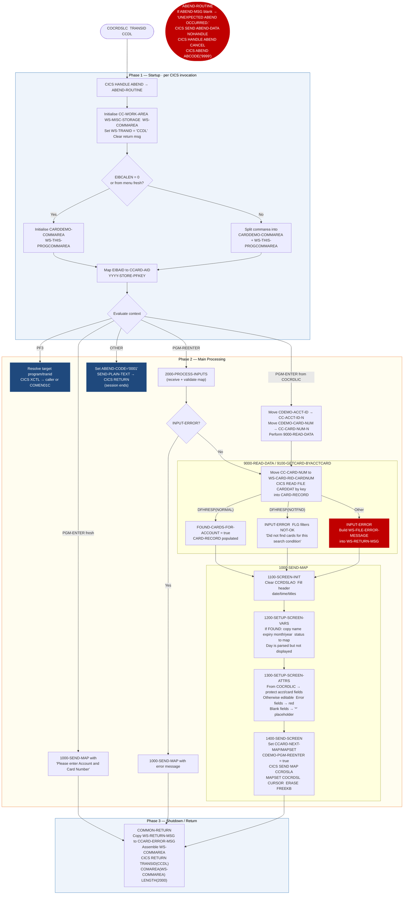

# COCRDSLC — Credit Card Detail View Screen

```
Application  : AWS CardDemo
Source File  : COCRDSLC.cbl
Type         : Online CICS COBOL program
Source Banner: Program: COCRDSLC.CBL / Layer: Business logic / Function: Accept and process credit card detail request
```

This document describes what COCRDSLC does in plain English. It treats the program as a sequence of CICS screen and data actions and names every file, field, copybook, and external program so a developer can trust this document instead of re-reading COBOL.

---

## 1. Purpose

COCRDSLC is the **Credit Card Detail View** screen for the AWS CardDemo CICS application. Its transaction ID is `CCDL`. The program accepts an account number and card number (either from the card list screen `COCRDLIC` or directly from the user), reads the corresponding card record from the VSAM file `CARDDAT`, and displays the card's details — embossed name, expiry month, expiry year, and active status — on a CICS BMS map (`CCRDSLA` in mapset `COCRDSL`).

The program is **read-only**: it never writes to `CARDDAT` or any other file. It also reads `CVCUS01Y` layout fields from the commarea but does **not** read or display any customer record from a customer file (the customer VSAM file reference is commented out in the source).

External programs called:
- `COMEN01C` (transaction `CM00`) — returned to via XCTL on PF3, or on unknown context.
- `COCRDLIC` (transaction `CCLI`) — returned to via XCTL on PF3 if the calling program was the card list.

---

## 2. Program Flow

### 2.1 Startup

**Step 1 — Abend handler** *(line 250).* A CICS HANDLE ABEND is registered pointing to `ABEND-ROUTINE`. This catches any CICS abend that occurs after this point and routes it to the structured abend handler rather than producing a raw transaction dump.

**Step 2 — Initialise working storage** *(lines 254–256).* `CC-WORK-AREA`, `WS-MISC-STORAGE`, and `WS-COMMAREA` are initialised. `WS-TRANID` is set to `'CCDL'`. The return message is cleared.

**Step 3 — Commarea handling** *(lines 268–279).* If `EIBCALEN` is zero, or if the calling program is the menu (`CDEMO-FROM-PROGRAM = 'COMEN01C'`) and this is not a re-entry, both `CARDDEMO-COMMAREA` and `WS-THIS-PROGCOMMAREA` are initialised to zeroes/spaces. Otherwise the commarea is split: bytes 1 through `LENGTH OF CARDDEMO-COMMAREA` populate `CARDDEMO-COMMAREA`, and the remaining bytes fill `WS-THIS-PROGCOMMAREA` (which holds only `CA-FROM-PROGRAM X(8)` and `CA-FROM-TRANID X(4)`).

**Step 4 — PF key mapping** *(line 284).* `YYYY-STORE-PFKEY` maps `EIBAID` to `CCARD-AID`. Valid keys for this screen are Enter and PF3 only.

### 2.2 Main Processing

**PF key guard** *(lines 291–299).* Any AID other than Enter or PF3 is treated as Enter, so the screen is always re-displayed regardless of accidental function key presses.

**EVALUATE on context** *(lines 304–381):*

**PF3 — Exit** *(lines 305–334):* The program resolves the target: if `CDEMO-FROM-TRANID` is blank, the menu transaction `CM00` is the target; otherwise the calling transaction is re-used. Same logic for `CDEMO-FROM-PROGRAM`. The program then issues a CICS XCTL to the target program passing `CARDDEMO-COMMAREA`.

**Entering from card list (`CDEMO-PGM-ENTER` AND `CDEMO-FROM-PROGRAM = 'COCRDLIC'`)** *(lines 339–348):* The account number and card number already validated by COCRDLIC are taken from `CDEMO-ACCT-ID` and `CDEMO-CARD-NUM` and placed into `CC-ACCT-ID-N` and `CC-CARD-NUM-N`. `9000-READ-DATA` is performed to fetch the card record, then `1000-SEND-MAP` is called to display the result. Control goes to `COMMON-RETURN`.

**Entering from some other context (fresh entry, `CDEMO-PGM-ENTER`)** *(lines 349–356):* The map is sent immediately with a prompt for the user to supply account and card number. The screen fields are left at their initialised values.

**Re-entry (user just submitted the form, `CDEMO-PGM-REENTER`)** *(lines 357–370):* `2000-PROCESS-INPUTS` is performed to receive and validate the map. If `INPUT-ERROR` is set, the map is re-sent showing the error. Otherwise `9000-READ-DATA` is called followed by `1000-SEND-MAP`.

**Unexpected scenario (WHEN OTHER)** *(lines 373–380):* Sets `ABEND-CULPRIT` = `'COCRDSLC'`, `ABEND-CODE` = `'0001'`, places `'UNEXPECTED DATA SCENARIO'` in `WS-RETURN-MSG`, and calls `SEND-PLAIN-TEXT` which sends the raw message and issues CICS RETURN (terminal return without TRANSID).

**Input processing — `2000-PROCESS-INPUTS`** *(line 582):* Calls `2100-RECEIVE-MAP` (CICS RECEIVE MAP into `CCRDSLAI`) then `2200-EDIT-MAP-INPUTS`. The edit routine normalises `*` and spaces to LOW-VALUES in both `CC-ACCT-ID` and `CC-CARD-NUM`, then validates:
- `2210-EDIT-ACCOUNT`: if blank/zeroes, `INPUT-ERROR` = true and message `'Account number not provided'` is set; if non-numeric, message `'Account number must be a non zero 11 digit number'` is set (note: the 88-level values `SEARCHED-ACCT-ZEROES` and `SEARCHED-ACCT-NOT-NUMERIC` share identical text).
- `2220-EDIT-CARD`: if blank/zeroes, `INPUT-ERROR` = true and message `'Card number not provided'` is set; if non-numeric, message `'Card number if supplied must be a 16 digit number'` is set.
- Cross-field: if both account and card are blank, message `'No input received'` is set.

**Data read — `9000-READ-DATA` / `9100-GETCARD-BYACCTCARD`** *(lines 726–776):* Moves `CC-CARD-NUM` to `WS-CARD-RID-CARDNUM` and issues a CICS READ FILE `CARDDAT` by key. Responses:
- `DFHRESP(NORMAL)`: sets `FOUND-CARDS-FOR-ACCOUNT` = true; `CARD-RECORD` (from `CVACT02Y`) is now populated.
- `DFHRESP(NOTFND)`: sets `INPUT-ERROR`, `FLG-ACCTFILTER-NOT-OK`, `FLG-CARDFILTER-NOT-OK`, and message `'Did not find cards for this search condition'`.
- Other: sets `INPUT-ERROR`, `FLG-ACCTFILTER-NOT-OK`, builds file-error message in `WS-RETURN-MSG`.

There is also an alternate-index read paragraph `9150-GETCARD-BYACCT` *(line 779)* that reads `CARDAIX` by `WS-CARD-RID-ACCT-ID`. This paragraph is **defined but never called** from any reachable path in this program (see Migration Note 1).

**Screen send — `1000-SEND-MAP`** *(line 412):* Calls:
- `1100-SCREEN-INIT`: clears `CCRDSLAO`, fills header (titles from `COTTL01Y`, date/time from `CSDAT01Y`, transaction name, program name).
- `1200-SETUP-SCREEN-VARS`: if `EIBCALEN > 0`, reflects `CC-ACCT-ID` and `CC-CARD-NUM` back to the output map fields. If `FOUND-CARDS-FOR-ACCOUNT` is true, copies `CARD-EMBOSSED-NAME` to `CRDNAMEO`, splits `CARD-EXPIRAION-DATE` into month (`CARD-EXPIRY-MONTH`) and year (`CARD-EXPIRY-YEAR`) and moves them to `EXPMONO` and `EXPYEARO`, and copies `CARD-ACTIVE-STATUS` to `CRDSTCDO`.
- `1300-SETUP-SCREEN-ATTRS`: if coming from COCRDLIC (`CDEMO-LAST-MAPSET = 'COCRDSL '` and `CDEMO-FROM-PROGRAM = 'COCRDLIC'`), both account and card fields are protected on screen (`DFHBMPRF`); otherwise they are editable (`DFHBMFSE`). Error fields are highlighted red. If a field was blank on re-entry, `'*'` is placed in the corresponding output field as a placeholder.
- `1400-SEND-SCREEN`: sets `CCARD-NEXT-MAP` / `CCARD-NEXT-MAPSET` to this screen's values, marks the program as `CDEMO-PGM-REENTER`, then issues CICS SEND MAP with CURSOR, ERASE, FREEKB.

### 2.3 Shutdown / Return

**`COMMON-RETURN`** *(line 394):* Before every CICS RETURN, `WS-RETURN-MSG` is copied to `CCARD-ERROR-MSG`. The combined commarea is assembled and CICS RETURN is issued with `TRANSID('CCDL')` and the 2000-byte commarea.

---

## 3. Error Handling

### 3.1 ABEND-ROUTINE (line 857)

Registered via CICS HANDLE ABEND at program startup. Triggered by any CICS abend condition after line 250. Actions:
- If `ABEND-MSG` is LOW-VALUES, moves the default message `'UNEXPECTED ABEND OCCURRED.'` into it.
- Copies `'COCRDSLC'` to `ABEND-CULPRIT`.
- Issues CICS SEND FROM `ABEND-DATA` (which contains `ABEND-CODE`, `ABEND-CULPRIT`, `ABEND-REASON`, `ABEND-MSG`) with NOHANDLE to display the abend information on the terminal.
- Issues CICS HANDLE ABEND CANCEL to de-register the handler.
- Issues CICS ABEND with code `'9999'`, forcing an abnormal termination with CICS abend code `9999`.

### 3.2 File Read Errors (paragraph `9100-GETCARD-BYACCTCARD`)

Not-found (`DFHRESP(NOTFND)`) sets `INPUT-ERROR` and the message `'Did not find cards for this search condition'` in `WS-RETURN-MSG`. Any other response builds `WS-FILE-ERROR-MESSAGE` (operation `'READ'`, file `'CARDDAT '`, RESP/RESP2 codes) into `WS-RETURN-MSG`. No CICS abend is issued for file errors; the error message appears on the next map send.

### 3.3 `SEND-PLAIN-TEXT` (line 838)

Used for the `WHEN OTHER` unexpected-context case. Sends the raw text of `WS-RETURN-MSG` to the terminal via CICS SEND TEXT with ERASE and FREEKB, then issues CICS RETURN with no TRANSID (session ends). This is distinct from `ABEND-ROUTINE` — it is a graceful plain-text terminal response.

### 3.4 Input Validation Messages

| Trigger | Message text |
|---|---|
| Account blank | `'Account number not provided'` |
| Account non-numeric | `'Account number must be a non zero 11 digit number'` |
| Account = zeros | `'Account number must be a non zero 11 digit number'` (same text as non-numeric — 88-levels share the same value) |
| Card blank | `'Card number not provided'` |
| Card non-numeric | `'Card number if supplied must be a 16 digit number'` |
| Both blank | `'No input received'` |
| Card not found | `'Did not find cards for this search condition'` |
| Account not found (via AIX, never called) | `'Did not find this account in cards database'` |
| File error | `'Error reading Card Data File'` (88-level label; actual message is constructed from `WS-FILE-ERROR-MESSAGE`) |

---

## 4. Migration Notes

1. **`9150-GETCARD-BYACCT` is defined but never called.** Paragraph at line 779 reads `CARDAIX` by account ID. No reachable path in the PROCEDURE DIVISION calls it. The commented-out `*COPY CVACT03Y` at line 237 suggests a cross-reference lookup was planned but never completed. In the Java migration this alternate-index path should either be implemented or removed.

2. **`CARD-EXPIRY-DAY` is parsed but never displayed.** In `1200-SETUP-SCREEN-VARS` (line 478), `CARD-EXPIRAION-DATE` is moved to `CARD-EXPIRAION-DATE-X` which overlays the day subfield `CARD-EXPIRY-DAY`. The screen map receives only `CARD-EXPIRY-MONTH` and `CARD-EXPIRY-YEAR`; the day is extracted but silently discarded. A Java migration may wish to expose the full expiry date.

3. **Account number is read from the card but not verified against the filter.** The card is fetched by card number only (`WS-CARD-RID-CARDNUM`). The account ID associated with the card (`CARD-ACCT-ID`) is never compared to the user-supplied `CC-ACCT-ID`. A user who supplies a valid card number but the wrong account number will see the card's real details without an error. In Java, add a cross-check: confirm `CARD-ACCT-ID` equals the user-entered account number after the read.

4. **`CVCUS01Y` is copied but never used.** The `COPY CVCUS01Y` at line 240 brings `CUSTOMER-RECORD` with all its fields into working storage, but no paragraph in COCRDSLC reads or writes any customer field. This is dead storage — 500 bytes of working-storage allocated for no purpose. The corresponding `*COPY CVACT01Y` (account layout) at line 231 is also commented out.

5. **`WS-RETURN-MSG` 88-level values `SEARCHED-ACCT-ZEROES` and `SEARCHED-ACCT-NOT-NUMERIC` share identical text.** Both resolve to `'Account number must be a non zero 11 digit number'`. The zero-check path at line 653 sets `FLG-ACCTFILTER-BLANK` and `INPUT-ERROR`, while the non-numeric path sets `FLG-ACCTFILTER-NOT-OK`. The screen rendering differs (blank highlights differently from not-ok), but the error text is the same. Java should preserve this distinction.

6. **`CARD-EXPIRAION-DATE` typo is preserved from `CVACT02Y`.** The field name contains the misspelling `EXPIRAION` (missing the letter `T`). This spelling is carried from the VSAM record layout copybook into all referencing programs. The migrated Java field should be named `cardExpirationDate` (corrected spelling) with a Javadoc note referencing the source spelling.

7. **`LIT-THISMAPSET` is declared as `PIC X(8)` with value `'COCRDSL '` (8 chars).** Other programs declare similar literals as `PIC X(7)`. The extra byte is a trailing space. The CICS RETURN commarea uses the 8-char field in the comparison at line 505 (`CDEMO-LAST-MAPSET EQUAL LIT-CCLISTMAPSET`). Since `CDEMO-LAST-MAPSET` is only 7 bytes (from `COCOM01Y`), the comparison truncates to 7 characters; the trailing space has no effect. However, the inconsistency could cause confusion during maintenance.

8. **`SEND-LONG-TEXT` is dead code.** Paragraph at line 820 is present in the source but never called from any reachable path. It is explicitly commented "primarily for debugging and should not be used in regular course."

---

## Appendix A — Files

| Logical Name | DDname / CICS Resource | Organization | Recording | Key Field | Direction | Contents |
|---|---|---|---|---|---|---|
| `CARDDAT` | `CARDDAT` | VSAM KSDS | Fixed, 150 bytes | `CARD-NUM PIC X(16)` | Input — CICS READ by key (read-only, no UPDATE) | Card master records. One 150-byte record per card. |
| `CARDAIX` | `CARDAIX` | VSAM AIX | Fixed | `WS-CARD-RID-ACCT-ID 9(11)` (alternate index by account) | Input — defined in `9150-GETCARD-BYACCT` but **never called** | Account-based alternate index — unused at runtime |

---

## Appendix B — Copybooks and External Programs

### Copybook `CVCRD01Y` (WORKING-STORAGE, line 194)

Same definition as documented in the COCRDLIC document. Fields used by this program: `CCARD-AID` (PF-key routing), `CCARD-NEXT-PROG/MAPSET/MAP` (screen navigation), `CCARD-ERROR-MSG` (error pass-through), `CC-ACCT-ID` / `CC-ACCT-ID-N` (account input), `CC-CARD-NUM` / `CC-CARD-NUM-N` (card input). Fields **not used**: `CCARD-RETURN-MSG`, `CC-CUST-ID`, `CC-CUST-ID-N`.

### Copybook `COCOM01Y` (WORKING-STORAGE, line 198)

Same `CARDDEMO-COMMAREA` definition as in COCRDLIC. Fields used: `CDEMO-FROM-TRANID/PROGRAM`, `CDEMO-TO-TRANID/PROGRAM`, `CDEMO-USER-TYPE`, `CDEMO-PGM-CONTEXT`, `CDEMO-ACCT-ID`, `CDEMO-CARD-NUM`, `CDEMO-LAST-MAP`, `CDEMO-LAST-MAPSET`. Fields **not used**: `CDEMO-USER-ID`, all customer fields, `CDEMO-ACCT-STATUS`.

### Copybook `CVACT02Y` (WORKING-STORAGE, line 234)

Defines `CARD-RECORD` — card record read from `CARDDAT`. (Full field table in COCRDLIC document.) Fields used by this program: `CARD-NUM`, `CARD-ACCT-ID` (read but not validated against user input), `CARD-EMBOSSED-NAME`, `CARD-EXPIRAION-DATE` (typo preserved), `CARD-ACTIVE-STATUS`. Fields **not used by this screen**: `CARD-CVV-CD`, `FILLER`.

### Copybook `CVCUS01Y` (WORKING-STORAGE, line 240)

Defines `CUSTOMER-RECORD` (500 bytes). **No fields from this copybook are used by COCRDSLC.** Entire copybook is dead weight — see Migration Note 4.

| Field | PIC | Bytes | Notes |
|---|---|---|---|
| `CUST-ID` | `9(9)` | 9 | Customer ID — **never used** |
| `CUST-FIRST-NAME` | `X(25)` | 25 | **Never used** |
| `CUST-MIDDLE-NAME` | `X(25)` | 25 | **Never used** |
| `CUST-LAST-NAME` | `X(25)` | 25 | **Never used** |
| `CUST-ADDR-LINE-1/2/3` | `X(50)` each | 50 each | **Never used** |
| `CUST-ADDR-STATE-CD` | `X(2)` | 2 | **Never used** |
| `CUST-ADDR-COUNTRY-CD` | `X(3)` | 3 | **Never used** |
| `CUST-ADDR-ZIP` | `X(10)` | 10 | **Never used** |
| `CUST-PHONE-NUM-1/2` | `X(15)` each | 15 each | **Never used** |
| `CUST-SSN` | `9(9)` | 9 | **Never used** |
| `CUST-GOVT-ISSUED-ID` | `X(20)` | 20 | **Never used** |
| `CUST-DOB-YYYY-MM-DD` | `X(10)` | 10 | **Never used** |
| `CUST-EFT-ACCOUNT-ID` | `X(10)` | 10 | **Never used** |
| `CUST-PRI-CARD-HOLDER-IND` | `X(1)` | 1 | **Never used** |
| `CUST-FICO-CREDIT-SCORE` | `9(3)` | 3 | **Never used** |
| `FILLER` | `X(168)` | 168 | Padding — **never used** |

### Copybook `COCRDSL` (WORKING-STORAGE, line 215)

Defines BMS map structures `CCRDSLAI` (input) and `CCRDSLAO` (output) for the card detail screen. Source file: `COCRDSL.CPY`. Key fields: `ACCTSIDI`/`ACCTSIDO` (account number), `CARDSIDI`/`CARDSIDO` (card number), `CRDNAMEO` (embossed name), `EXPMONO`/`EXPYEARO` (expiry month/year — day is not displayed), `CRDSTCDO` (active status), `ERRMSGO` (error message), `INFOMSGO`/`INFOMSGC` (info message and colour), `TITLE01O`/`TITLE02O`, `TRNNAMEO`/`PGMNAMEO`, `CURDATEO`/`CURTIMEO`.

### Copybook `CSMSG02Y` (WORKING-STORAGE, line 224)

Defines `ABEND-DATA` with subfields `ABEND-CODE X(4)`, `ABEND-CULPRIT X(8)`, `ABEND-REASON X(50)`, `ABEND-MSG X(72)`. Used by `ABEND-ROUTINE` to send diagnostic information before issuing CICS ABEND.

### Copybook `COTTL01Y`, `CSDAT01Y`, `CSMSG01Y`, `CSUSR01Y`, `DFHBMSCA`, `DFHAID`, `CSSTRPFY`

Same as documented in COCRDLIC. `CSUSR01Y` fields (`SEC-USER-DATA`) are **never used by COCRDSLC**.

### External Program `COMEN01C` / `COCRDLIC` (XCTL)

On PF3, XCTL is issued to whichever program originally invoked this screen (resolved from `CDEMO-FROM-PROGRAM`/`CDEMO-FROM-TRANID`). If these fields are blank, the menu is the default target.

---

## Appendix C — Hardcoded Literals

| Paragraph | Line | Value | Usage | Classification |
|---|---|---|---|---|
| `WS-LITERALS` | 164 | `'COCRDSLC'` | This program's name | System constant |
| `WS-LITERALS` | 166 | `'CCDL'` | This program's transaction ID | System constant |
| `WS-LITERALS` | 168 | `'COCRDSL '` | This program's mapset name (8 bytes with trailing space) | System constant |
| `WS-LITERALS` | 170 | `'CCRDSLA'` | This program's map name | System constant |
| `WS-LITERALS` | 172 | `'COCRDLIC'` | Card list program | System constant |
| `WS-LITERALS` | 174 | `'CCLI'` | Card list transaction ID | System constant |
| `WS-LITERALS` | 176 | `'COCRDLI'` | Card list mapset | System constant |
| `WS-LITERALS` | 178 | `'CCRDSLA'` | Card list map — note same value as `LIT-THISMAP` (same map used) | System constant |
| `WS-LITERALS` | 180 | `'COMEN01C'` | Menu program | System constant |
| `WS-LITERALS` | 182 | `'CM00'` | Menu transaction ID | System constant |
| `WS-LITERALS` | 184 | `'COMEN01'` | Menu mapset | System constant |
| `WS-LITERALS` | 186 | `'COMEN1A'` | Menu map | System constant |
| `WS-LITERALS` | 188 | `'CARDDAT '` | CICS VSAM card file resource name | System constant |
| `WS-LITERALS` | 190 | `'CARDAIX '` | CICS VSAM card AIX resource name — dead code path | System constant |
| `0000-MAIN WHEN OTHER` | 375 | `'0001'` | Abend code for unexpected data scenario | System constant |
| `ABEND-ROUTINE` | 876 | `'9999'` | CICS ABEND code | System constant |

---

## Appendix D — Internal Working Fields

| Field | PIC | Bytes | Purpose |
|---|---|---|---|
| `WS-RESP-CD` | `S9(9) COMP` | 4 | CICS RESP code from last command |
| `WS-REAS-CD` | `S9(9) COMP` | 4 | CICS RESP2 reason code |
| `WS-TRANID` | `X(4)` | 4 | Set to `'CCDL'` at startup |
| `WS-INPUT-FLAG` | `X(1)` | 1 | 88: `INPUT-OK` = `'0'`, `INPUT-ERROR` = `'1'`, `INPUT-PENDING` = LOW-VALUES |
| `WS-EDIT-ACCT-FLAG` | `X(1)` | 1 | Account filter validity: `FLG-ACCTFILTER-NOT-OK` = `'0'`, `FLG-ACCTFILTER-ISVALID` = `'1'`, `FLG-ACCTFILTER-BLANK` = `' '` |
| `WS-EDIT-CARD-FLAG` | `X(1)` | 1 | Card filter validity: same pattern as account |
| `WS-RETURN-FLAG` | `X(1)` | 1 | 88: `WS-RETURN-FLAG-OFF` = LOW-VALUES, `WS-RETURN-FLAG-ON` = `'1'` — **never set to ON** |
| `WS-PFK-FLAG` | `X(1)` | 1 | 88: `PFK-VALID` = `'0'`, `PFK-INVALID` = `'1'` |
| `CARD-ACCT-ID-X` / `CARD-ACCT-ID-N` | `X(11)` / `9(11)` | 11 | Temp overlay for account output formatting |
| `CARD-CVV-CD-X` / `CARD-CVV-CD-N` | `X(3)` / `9(3)` | 3 | Temp CVV overlay — **never used in display** |
| `CARD-CARD-NUM-X` / `CARD-CARD-NUM-N` | `X(16)` / `9(16)` | 16 | Temp card number overlay for formatting |
| `CARD-NAME-EMBOSSED-X` | `X(50)` | 50 | Temp embossed name buffer |
| `CARD-STATUS-X` | `X(1)` | 1 | Temp status buffer |
| `CARD-EXPIRAION-DATE-X` (with REDEFINES year/month/day) | `X(10)` | 10 | Overlay for parsing `CARD-EXPIRAION-DATE`; subfields: `CARD-EXPIRY-YEAR X(4)`, `CARD-EXPIRY-MONTH X(2)`, `CARD-EXPIRY-DAY X(2)` (day parsed but never displayed) |
| `CARD-EXPIRAION-DATE-N` | REDEFINES — `9(10)` | 10 | Numeric overlay for expiry date |
| `WS-CARD-RID` | `WS-CARD-RID-CARDNUM X(16)` + `WS-CARD-RID-ACCT-ID 9(11)` | 27 | CICS READ RID field for card file access |
| `WS-FILE-ERROR-MESSAGE` | composite 80 bytes | 80 | File error message template (same structure as COCRDLIC) |
| `WS-LONG-MSG` | `X(500)` | 500 | Debug message buffer — dead code only |
| `WS-INFO-MSG` | `X(40)` | 40 | Info message display. 88: `WS-NO-INFO-MESSAGE` = spaces/LOW-VALUES, `FOUND-CARDS-FOR-ACCOUNT` = `'   Displaying requested details'`, `WS-PROMPT-FOR-INPUT` = `'Please enter Account and Card Number'` |
| `WS-RETURN-MSG` | `X(75)` | 75 | Error / return message; multiple 88-levels as documented in Section 3.4 |
| `WS-THIS-PROGCOMMAREA` | `CA-FROM-PROGRAM X(8)` + `CA-FROM-TRANID X(4)` | 12 | Per-program commarea extension holding caller identity |
| `WS-COMMAREA` | `X(2000)` | 2000 | Assembly buffer for CICS RETURN commarea |

---

## Appendix E — Execution at a Glance



---

*Source: `COCRDSLC.cbl`, CardDemo, Apache 2.0 license. Copybooks: `CVCRD01Y.cpy`, `COCOM01Y.cpy`, `CVACT02Y.cpy`, `CVCUS01Y.cpy` (unused), `COCRDSL.CPY`, `CSMSG02Y.cpy`, `COTTL01Y.cpy`, `CSDAT01Y.cpy`, `CSMSG01Y.cpy`, `CSUSR01Y.cpy`, `CSSTRPFY.cpy`, `DFHBMSCA` (IBM), `DFHAID` (IBM). External programs: `COMEN01C` or `COCRDLIC` (XCTL on PF3).*
