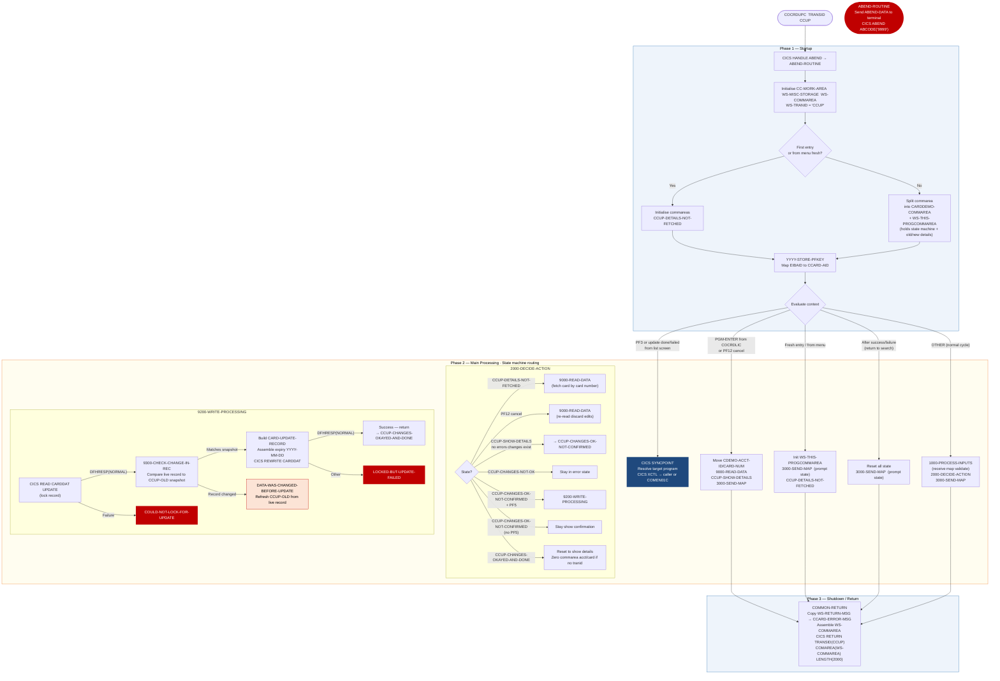

# COCRDUPC — Credit Card Update Screen

```
Application  : AWS CardDemo
Source File  : COCRDUPC.cbl
Type         : Online CICS COBOL program
Source Banner: Program: COCRDUPC.CBL / Layer: Business logic / Function: Accept and process credit card detail request
```

This document describes what COCRDUPC does in plain English. It treats the program as a sequence of CICS screen and VSAM update actions and names every file, field, copybook, and external program so a developer can trust this document instead of re-reading COBOL.

---

## 1. Purpose

COCRDUPC is the **Credit Card Update** screen for the AWS CardDemo CICS application. Its transaction ID is `CCUP`. The program implements a three-step optimistic-lock update pattern: it first fetches and displays the card record, then validates user changes, and finally rewrites the card record to `CARDDAT` using CICS READ with UPDATE followed by CICS REWRITE. Before writing, it compares the current file contents to the snapshot captured at fetch time to detect concurrent modifications.

Editable fields are: embossed name (`CARD-EMBOSSED-NAME`), active status (`CARD-ACTIVE-STATUS`), expiry month and year. The CVV code, card number, and account ID are display-only and are never changed by this program. The expiry day field is shown but protected and not editable (see Migration Note 1).

External programs:
- `COMEN01C` (transaction `CM00`) — returned to on PF3 or after a successful or failed update if the calling program was the card list.
- `COCRDLIC` (transaction `CCLI`) — returned to on PF3 if the calling program was the card list.

---

## 2. Program Flow

### 2.1 Startup

**Step 1 — Abend handler** *(line 370).* CICS HANDLE ABEND points to `ABEND-ROUTINE` (identical pattern to COCRDSLC).

**Step 2 — Initialise working storage** *(lines 374–376).* `CC-WORK-AREA`, `WS-MISC-STORAGE`, and `WS-COMMAREA` are initialised. `WS-TRANID` = `'CCUP'`.

**Step 3 — Commarea handling** *(lines 388–401).* Same split pattern as COCRDSLC. If first entry or from menu without re-entry, `CARDDEMO-COMMAREA` and `WS-THIS-PROGCOMMAREA` are initialised and `CCUP-DETAILS-NOT-FETCHED` is set. `WS-THIS-PROGCOMMAREA` carries the full update state machine across CICS invocations, including: `CCUP-CHANGE-ACTION` (the state flag), `CCUP-OLD-DETAILS` (the snapshot of the card when it was first read), `CCUP-NEW-DETAILS` (the new values entered by the user), and `CARD-UPDATE-RECORD` (the record format for CICS REWRITE).

**Step 4 — PF key mapping** *(line 406).* `YYYY-STORE-PFKEY` maps `EIBAID` to `CCARD-AID`. Valid keys: Enter, PF3 (exit), PF5 (confirm save — only valid when `CCUP-CHANGES-OK-NOT-CONFIRMED`), PF12 (cancel/refresh — only valid when details have been fetched).

### 2.2 Main Processing

**EVALUATE on context — main routing** *(lines 429–543):*

**PF3, or update done/failed from list screen** *(lines 435–476):* Issues a CICS SYNCPOINT before the XCTL (ensuring any uncommitted work is committed or rolled back). Resolves the target program. If the last mapset was the list screen's mapset, resets `CDEMO-ACCT-ID` and `CDEMO-CARD-NUM` to zeros. Issues CICS XCTL to the target.

**Entering from card list, or PF12 cancel** *(lines 482–497):* Account and card numbers are already validated. Moves `CDEMO-ACCT-ID` and `CDEMO-CARD-NUM` to the edit variables. Calls `9000-READ-DATA` to fetch the card. Sets `CCUP-SHOW-DETAILS` and calls `3000-SEND-MAP` to display the card details. On PF12 cancel, the record is re-read fresh, discarding any pending edits.

**Fresh entry / entry from menu** *(lines 502–511):* Initialises `WS-THIS-PROGCOMMAREA`, sends the map with a blank/prompt state, sets `CDEMO-PGM-REENTER` and `CCUP-DETAILS-NOT-FETCHED`.

**After successful or failed update — back to search** *(lines 517–528):* Resets state completely (clears `WS-THIS-PROGCOMMAREA`, `WS-MISC-STORAGE`, `CDEMO-ACCT-ID`, `CDEMO-CARD-NUM`), sends the map in prompt state, and marks the program as waiting for a new search.

**All other cases (WHEN OTHER)** *(lines 535–543):* Processes user inputs, decides the next action, and sends the map.

**`1000-PROCESS-INPUTS`** *(line 564):* Receives the map into `CCRDUPAI` via CICS RECEIVE MAP. Normalises `*` and spaces in all input fields to LOW-VALUES. Populates `CCUP-NEW-DETAILS` from the received fields:
- `CC-ACCT-ID` / `CCUP-NEW-ACCTID` from `ACCTSIDI`
- `CC-CARD-NUM` / `CCUP-NEW-CARDID` from `CARDSIDI`
- `CCUP-NEW-CRDNAME` from `CRDNAMEI`
- `CCUP-NEW-CRDSTCD` from `CRDSTCDI`
- `CCUP-NEW-EXPDAY` always from `EXPDAYI` (no normalisation — day is not user-editable)
- `CCUP-NEW-EXPMON` and `CCUP-NEW-EXPYEAR` from `EXPMONI` and `EXPYEARI`

**`1200-EDIT-MAP-INPUTS`** *(line 641):* Branches on whether details have been fetched yet:
- If `CCUP-DETAILS-NOT-FETCHED`: validates account number in `1210-EDIT-ACCOUNT` and card number in `1220-EDIT-CARD`. If both are blank, sets `NO-SEARCH-CRITERIA-RECEIVED`.
- If already fetched: restores old values to the `CARD-*` display fields from `CCUP-OLD-DETAILS`. Checks if new data equals old data — if so, sets `NO-CHANGES-DETECTED`. If no changes, or if confirmation state, or if update just completed, skips field edits and exits. Otherwise, validates:
  - `1230-EDIT-NAME`: name must not be blank; must contain only alphabetic characters and spaces. Validation is done by copying the name to `CARD-NAME-CHECK`, converting all letters to spaces using INSPECT CONVERTING, then trimming — if anything remains it is a non-alpha character.
  - `1240-EDIT-CARDSTATUS`: must be `'Y'` or `'N'` (validated via `FLG-YES-NO-VALID` — 88-level on `FLG-YES-NO-CHECK`).
  - `1250-EDIT-EXPIRY-MON`: must be numeric and 1–12 (88-level `VALID-MONTH` on `CARD-MONTH-CHECK-N`).
  - `1260-EDIT-EXPIRY-YEAR`: must be numeric and 1950–2099 (88-level `VALID-YEAR` on `CARD-YEAR-CHECK-N`).
  - If all edits pass, sets `CCUP-CHANGES-OK-NOT-CONFIRMED`.

**`2000-DECIDE-ACTION`** *(line 948):* Decides what to do based on the current state:
- `CCUP-DETAILS-NOT-FETCHED`: no card shown yet — fetch it.
- `CCARD-AID-PFK12`: user is cancelling — re-read the card from the file.
- `CCUP-SHOW-DETAILS`: card is shown; if no errors and changes exist, move to `CCUP-CHANGES-OK-NOT-CONFIRMED`.
- `CCUP-CHANGES-NOT-OK`: stay in error state, no action.
- `CCUP-CHANGES-OK-NOT-CONFIRMED` AND PF5 pressed: call `9200-WRITE-PROCESSING` to attempt the save. Evaluate the outcome — lock error → `CCUP-CHANGES-OKAYED-LOCK-ERROR`, write failure → `CCUP-CHANGES-OKAYED-BUT-FAILED`, concurrent change detected → `CCUP-SHOW-DETAILS` (show refreshed data), otherwise → `CCUP-CHANGES-OKAYED-AND-DONE`.
- `CCUP-CHANGES-OK-NOT-CONFIRMED` (PF5 not pressed): stay on confirmation screen.
- `CCUP-CHANGES-OKAYED-AND-DONE`: reset state to show details again. If calling transaction was blank, zero the account and card commarea fields.
- `WHEN OTHER`: calls `ABEND-ROUTINE` with code `'0001'` and message `'UNEXPECTED DATA SCENARIO'`.

**Write processing — `9200-WRITE-PROCESSING`** *(line 1420):*
1. Issues CICS READ FILE `CARDDAT` with UPDATE, using `CC-CARD-NUM` as the RID field. This locks the record.
2. If lock fails, sets `COULD-NOT-LOCK-FOR-UPDATE` and returns.
3. Calls `9300-CHECK-CHANGE-IN-REC` to compare the freshly locked record to `CCUP-OLD-DETAILS`. The comparison covers: `CARD-CVV-CD`, `CARD-EMBOSSED-NAME` (uppercased before comparison), `CARD-EXPIRAION-DATE` bytes 1–4 (year), 6–2 (month), 9–2 (day), and `CARD-ACTIVE-STATUS`. If any field differs, sets `DATA-WAS-CHANGED-BEFORE-UPDATE`, refreshes `CCUP-OLD-DETAILS` from the locked record, and returns.
4. If the record matches the snapshot, builds `CARD-UPDATE-RECORD`: card number from `CCUP-NEW-CARDID`, account ID from `CC-ACCT-ID-N`, CVV from the locked record's CVV (the old CVV is preserved — it is not changeable), embossed name from `CCUP-NEW-CRDNAME`, expiry date assembled as `CCUP-NEW-EXPYEAR + '-' + CCUP-NEW-EXPMON + '-' + CCUP-NEW-EXPDAY`, active status from `CCUP-NEW-CRDSTCD`.
5. Issues CICS REWRITE FILE `CARDDAT` FROM `CARD-UPDATE-RECORD`. If response is not `DFHRESP(NORMAL)`, sets `LOCKED-BUT-UPDATE-FAILED`.

**Screen send — `3000-SEND-MAP`** *(line 1035):* Calls `3100-SCREEN-INIT` (header), `3200-SETUP-SCREEN-VARS` (field display based on state: show old values, new values, or blanks), `3250-SETUP-INFOMSG` (informational message based on state), `3300-SETUP-SCREEN-ATTRS` (protect/unprotect fields based on state; error fields highlighted red), `3400-SEND-SCREEN` (CICS SEND MAP `CCRDUPA` in mapset `COCRDUP` with CURSOR, ERASE, FREEKB).

### 2.3 Shutdown / Return

**`COMMON-RETURN`** *(line 546):* `WS-RETURN-MSG` is copied to `CCARD-ERROR-MSG`. The full commarea is assembled and CICS RETURN is issued with `TRANSID('CCUP')` and the 2000-byte commarea.

---

## 3. Error Handling

### 3.1 Abend Routine — `ABEND-ROUTINE` (line 1531)

Identical to COCRDSLC's `ABEND-ROUTINE` except the `ABEND-ROUTINE-EXIT` label is explicit (line 1554). Registered via CICS HANDLE ABEND. Sends `ABEND-DATA` to terminal, then issues CICS ABEND `'9999'`.

### 3.2 Concurrent Modification Detection (paragraph `9300-CHECK-CHANGE-IN-REC`, line 1498)

After locking the record with CICS READ UPDATE, `9300-CHECK-CHANGE-IN-REC` compares six field positions from the live locked record to the snapshot stored in `CCUP-OLD-DETAILS`. If any mismatch is found:
- `DATA-WAS-CHANGED-BEFORE-UPDATE` is set (88-level on `WS-RETURN-MSG` with text `'Record changed by some one else. Please review'`).
- The old-details snapshot in `CCUP-OLD-DETAILS` is refreshed to the current file values (so the user sees the latest data).
- Control returns to `9200-WRITE-PROCESSING` which exits without writing.
- The screen is re-sent in `CCUP-SHOW-DETAILS` state with the refreshed data.

### 3.3 Input Validation Error Messages (88-level values on `WS-RETURN-MSG`)

| Condition | Message text |
|---|---|
| Account blank | `'Account number not provided'` |
| Account non-numeric | `'Account number must be a non zero 11 digit number'` |
| Card blank | `'Card number not provided'` |
| Card non-numeric | `'Card number if supplied must be a 16 digit number'` |
| Name blank | `'Card name not provided'` |
| Name contains non-alpha | `'Card name can only contain alphabets and spaces'` |
| No changes detected | `'No change detected with respect to values fetched.'` |
| Status not Y or N | `'Card Active Status must be Y or N'` |
| Expiry month invalid | `'Card expiry month must be between 1 and 12'` |
| Expiry year invalid | `'Invalid card expiry year'` |
| Card not found | `'Did not find cards for this search condition'` |
| Lock failure | `'Could not lock record for update'` |
| Concurrent change | `'Record changed by some one else. Please review'` |
| Rewrite failure | `'Update of record failed'` |
| File read error | `'Error reading Card Data File'` (file error message built from template) |

### 3.4 Informational Messages (88-level values on `WS-INFO-MSG`)

| State | Message |
|---|---|
| Fresh entry / no details fetched | `'Please enter Account and Card Number'` |
| Details shown successfully | `'Details of selected card shown above'` |
| Changes not OK (validation errors) | `'Update card details presented above.'` |
| Changes validated, awaiting confirmation | `'Changes validated.Press F5 to save'` |
| Update committed | `'Changes committed to database'` |
| Update failed (lock or write error) | `'Changes unsuccessful. Please try again'` |

---

## 4. Migration Notes

1. **Expiry day is shown on screen but cannot be edited.** The screen map (`COCRDUP.CPY`) includes `EXPDAYO`/`EXPDAYI` fields. In `3300-SETUP-SCREEN-ATTRS`, the day attribute setting (`EXPDAYA`) is commented out in every WHEN clause (lines 1178, 1185, 1197, 1205). The day field always receives `DFHBMDAR` (dark/no-display) at line 1285, making it invisible to the user. The day value is taken from `CCUP-OLD-EXPDAY` when building the REWRITE record. A Java migration must carry the original expiry day through the update path — it cannot be set by the user.

2. **CVV code is never changed.** `CARD-CVV-CD` is read from the card file at fetch time, stored in `CCUP-OLD-CVV-CD`, and used verbatim when constructing `CARD-UPDATE-RECORD` (line 1464–1465: the new CVV is taken from `CCUP-NEW-CVV-CD` which was placed into `CARD-CVV-CD-X`, then `CARD-CVV-CD-N` is copied to `CARD-UPDATE-CVV-CD`). There is no screen field for CVV update. However, `CCUP-NEW-CVV-CD` is initialised as part of `CCUP-NEW-DETAILS` on each RECEIVE MAP (line 586). Since `CCRDUPAI` presumably does not expose a CVV input field, `CCUP-NEW-CVV-CD` will always be LOW-VALUES/spaces, and the value written will be whatever `CARD-CVV-CD-N` evaluates to from that blank input — **this is a potential data corruption bug**. In `9200-WRITE-PROCESSING`, the locked record's CVV should be used directly, not routed through the potentially-blank `CCUP-NEW-CVV-CD` staging field (see line 1464).

3. **`CVCUS01Y` is copied but never used.** Same as COCRDSLC — `CUSTOMER-RECORD` is in working storage but no field is referenced. Dead weight.

4. **`LIT-CCLISTMAP` at line 233 is `'CCRDSLA'`.** This is the detail screen's map name, not the list screen's map. The list map is `CCRDLIA`. This appears to be a copy-paste error in the constant definition — the list mapset `LIT-CCLISTMAPSET = 'COCRDLI'` is correct, but the map name points to the wrong map. The constant `LIT-CCLISTMAP` is never actually used in the PROCEDURE DIVISION, so it has no runtime effect.

5. **Name validation uses INSPECT CONVERTING as an alpha-only check.** At line 823–836, `CARD-NAME-CHECK` is loaded with the name, then all 52 alphabetic characters (A–Z, a–z) are converted to spaces. If `FUNCTION TRIM` of the result has length zero, the name is purely alphabetic+spaces. Non-alpha characters (digits, punctuation) cause a validation error. This means numeric-only names fail — a Java migration using `String.matches("[A-Za-z ]+")` would be equivalent.

6. **CICS SYNCPOINT is issued before XCTL on PF3** *(line 470).* This ensures that a CICS REWRITE that was committed in the current UoW is flushed before the program transfers control. In Java, the equivalent is ensuring the JPA/JDBC transaction is committed before returning from the service method.

7. **No rollback on partial failure.** If CICS REWRITE fails after READ UPDATE, the lock is held until the CICS task ends (or a SYNCPOINT). There is no explicit CICS UNLOCK statement. If `LOCKED-BUT-UPDATE-FAILED` is set, the error message is displayed on the screen but the record remains locked until CICS RETURN releases the task's resources. A Java migration should explicitly roll back the JPA transaction on write failure.

8. **`CCUP-OLD-EXPIRAION-DATE` uses field name `CCUP-OLD-EXPIRAION-DATE` with the same "EXPIRAION" typo** *(lines 297–300).* The typo is inherited from `CVACT02Y`. Java field should be named `oldExpirationDate`.

9. **The `WS-RETURN-MSG` 88-level `CODING-TO-BE-DONE` = `'Looks Good.... so far'` at line 213–214 is a placeholder never set by any paragraph.** Dead code — remove in Java migration.

---

## Appendix A — Files

| Logical Name | DDname / CICS Resource | Organization | Recording | Key Field | Direction | Contents |
|---|---|---|---|---|---|---|
| `CARDDAT` | `CARDDAT` | VSAM KSDS | Fixed, 150 bytes | `CARD-NUM PIC X(16)` | Input/Output — CICS READ (initial fetch), CICS READ with UPDATE (lock for rewrite), CICS REWRITE (update) | Card master records. One 150-byte record per card. |

---

## Appendix B — Copybooks and External Programs

### Copybook `CVCRD01Y` (WORKING-STORAGE, line 268)

Same `CC-WORK-AREAS` definition. Fields used: `CCARD-AID`, `CCARD-NEXT-PROG/MAPSET/MAP`, `CCARD-ERROR-MSG`, `CC-ACCT-ID`/`CC-ACCT-ID-N`, `CC-CARD-NUM`/`CC-CARD-NUM-N`. Fields not used: `CCARD-RETURN-MSG`, `CC-CUST-ID`.

### Copybook `COCOM01Y` (WORKING-STORAGE, line 272)

Same `CARDDEMO-COMMAREA` definition. Fields used: all navigation/identity fields, `CDEMO-ACCT-ID`, `CDEMO-CARD-NUM`, `CDEMO-LAST-MAPSET`, `CDEMO-ACCT-STATUS` (zeroed on success). `CDEMO-USER-ID` and customer fields are **not used**.

### Copybook `CVACT02Y` (WORKING-STORAGE, line 353)

Defines `CARD-RECORD`. Fields used: `CARD-NUM`, `CARD-ACCT-ID`, `CARD-CVV-CD`, `CARD-EMBOSSED-NAME`, `CARD-EXPIRAION-DATE` (typo preserved), `CARD-ACTIVE-STATUS`. `FILLER` is not used.

### Copybook `CVCUS01Y` (WORKING-STORAGE, line 359)

Defines `CUSTOMER-RECORD` (500 bytes). **No fields from this copybook are used.** (Full field table in COCRDSLC document.)

### Copybook `COCRDUP` (WORKING-STORAGE, line 334)

Defines BMS map structures `CCRDUPAI` (input) and `CCRDUPAO` (output) for the card update screen. Source file: `COCRDUP.CPY`. Key fields include `ACCTSIDI`/`ACCTSIDO` (account ID), `CARDSIDI`/`CARDSIDO` (card number), `CRDNAMEI`/`CRDNAMEO` (embossed name), `CRDSTCDI`/`CRDSTCDO` (active status), `EXPDAYI`/`EXPDAYO` (expiry day — input received but field hidden on screen), `EXPMONI`/`EXPMONO` (expiry month), `EXPYEARI`/`EXPYEARO` (expiry year), `INFOMSGO`/`INFOMSGA` (info message), `ERRMSGO` (error message), `FKEYSCA` (PF key instruction bar attribute), `TITLE01O`/`TITLE02O`, `TRNNAMEO`/`PGMNAMEO`, `CURDATEO`/`CURTIMEO`.

### Copybook `CSMSG02Y` (WORKING-STORAGE, line 343)

Same `ABEND-DATA` definition as COCRDSLC. Used by `ABEND-ROUTINE`.

### Copybook `COTTL01Y`, `CSDAT01Y`, `CSMSG01Y`, `CSUSR01Y`, `DFHBMSCA`, `DFHAID`, `CSSTRPFY`

Same as documented in COCRDLIC and COCRDSLC. `CSUSR01Y` (`SEC-USER-DATA`) is **never used**.

### External Program `COMEN01C` / `COCRDLIC` (XCTL)

On PF3 or after update completion, XCTL is issued to the resolved target (calling program, or menu by default). A CICS SYNCPOINT is issued before the XCTL.

---

## Appendix C — Hardcoded Literals

| Paragraph | Line | Value | Usage | Classification |
|---|---|---|---|---|
| `WS-LITERALS` | 220 | `'COCRDUPC'` | This program's name | System constant |
| `WS-LITERALS` | 222 | `'CCUP'` | This program's transaction ID | System constant |
| `WS-LITERALS` | 224 | `'COCRDUP '` | This program's mapset (8 bytes) | System constant |
| `WS-LITERALS` | 226 | `'CCRDUPA'` | This program's map | System constant |
| `WS-LITERALS` | 228 | `'COCRDLIC'` | Card list program | System constant |
| `WS-LITERALS` | 235 | `'COMEN01C'` | Menu program | System constant |
| `WS-LITERALS` | 237 | `'CM00'` | Menu transaction ID | System constant |
| `WS-LITERALS` | 243 | `'COCRDSLC'` | Card detail program | System constant |
| `WS-LITERALS` | 251 | `'CARDDAT '` | CICS VSAM card file resource name | System constant |
| `WS-LITERALS` | 253 | `'CARDAIX '` | CICS VSAM AIX — defined but never used | System constant |
| `WS-LITERALS` | 255–257 | `'ABCDEFGHIJKLMNOPQRSTUVWXYZabcdefghijklmnopqrstuvwxyz'` | Alpha-from string for INSPECT CONVERTING name validation | Business rule — character set |
| `WS-LITERALS` | 259 | SPACES (52 chars) | Alpha-to string for INSPECT CONVERTING | Business rule |
| `WS-LITERALS` | 261 | `'ABCDEFGHIJKLMNOPQRSTUVWXYZ'` | Upper-case letters for INSPECT CONVERTING name to upper | Business rule |
| `WS-LITERALS` | 263 | `'abcdefghijklmnopqrstuvwxyz'` | Lower-case letters for upper-case conversion | Business rule |
| `CARD-MONTH-CHECK-N` 88-level | 95 | VALUES 1 THRU 12 | Valid month range | Business rule |
| `CARD-YEAR-CHECK-N` 88-level | 99 | VALUES 1950 THRU 2099 | Valid year range | Business rule |
| `9200-WRITE-PROCESSING` | 1468–1472 | `'-'` (twice) | Separator characters in the assembled expiry date string `YYYY-MM-DD` | Business rule — date format |
| `2000-DECIDE-ACTION WHEN OTHER` | 1021 | `'0001'` | Abend code for unexpected scenario | System constant |
| `ABEND-ROUTINE` | 1551 | `'9999'` | CICS ABEND code | System constant |

---

## Appendix D — Internal Working Fields

| Field | PIC | Bytes | Purpose |
|---|---|---|---|
| `WS-RESP-CD` | `S9(9) COMP` | 4 | CICS RESP code |
| `WS-REAS-CD` | `S9(9) COMP` | 4 | CICS RESP2 code |
| `WS-TRANID` | `X(4)` | 4 | Set to `'CCUP'` |
| `WS-UCTRANS` | `X(4)` | 4 | Defined but **never used** |
| `WS-INPUT-FLAG` | `X(1)` | 1 | 88: `INPUT-OK` = `'0'`, `INPUT-ERROR` = `'1'`, `INPUT-PENDING` = LOW-VALUES |
| `WS-EDIT-ACCT-FLAG` / `WS-EDIT-CARD-FLAG` | `X(1)` each | 1 each | Same pattern as COCRDSLC |
| `WS-EDIT-CARDNAME-FLAG` | `X(1)` | 1 | 88: `FLG-CARDNAME-NOT-OK` = `'0'`, `FLG-CARDNAME-ISVALID` = `'1'`, `FLG-CARDNAME-BLANK` = `' '` |
| `WS-EDIT-CARDSTATUS-FLAG` | `X(1)` | 1 | 88: `FLG-CARDSTATUS-NOT-OK` = `'0'`, `FLG-CARDSTATUS-ISVALID` = `'1'`, `FLG-CARDSTATUS-BLANK` = `' '` |
| `WS-EDIT-CARDEXPMON-FLAG` | `X(1)` | 1 | 88: `FLG-CARDEXPMON-NOT-OK` = `'0'`, `FLG-CARDEXPMON-ISVALID` = `'1'`, `FLG-CARDEXPMON-BLANK` = `' '` |
| `WS-EDIT-CARDEXPYEAR-FLAG` | `X(1)` | 1 | 88: `FLG-CARDEXPYEAR-NOT-OK` = `'0'`, `FLG-CARDEXPYEAR-ISVALID` = `'1'`, `FLG-CARDEXPYEAR-BLANK` = `' '` |
| `CARD-NAME-CHECK` | `X(50)` | 50 | Working copy of card name used during INSPECT CONVERTING alpha validation |
| `FLG-YES-NO-CHECK` | `X(1)` | 1 | 88: `FLG-YES-NO-VALID` = `'Y'` or `'N'`. Loaded from `CCUP-NEW-CRDSTCD` before status validation |
| `CARD-MONTH-CHECK` / `CARD-MONTH-CHECK-N` | `X(2)` / `9(2)` | 2 | Overlay pair for month validation; 88: `VALID-MONTH` = 1 THRU 12 |
| `CARD-YEAR-CHECK` / `CARD-YEAR-CHECK-N` | `X(4)` / `9(4)` | 4 | Overlay pair for year validation; 88: `VALID-YEAR` = 1950 THRU 2099 |
| `CARD-ACCT-ID-X` / `CARD-ACCT-ID-N` | `X(11)` / `9(11)` | 11 | Output formatting overlay |
| `CARD-CVV-CD-X` / `CARD-CVV-CD-N` | `X(3)` / `9(3)` | 3 | CVV routing overlay (see Migration Note 2) |
| `CARD-CARD-NUM-X` / `CARD-CARD-NUM-N` | `X(16)` / `9(16)` | 16 | Card number formatting overlay |
| `CARD-EXPIRAION-DATE-X` with subfields | `X(10)` | 10 | Expiry date parse overlay: year (4), separator (1), month (2), separator (1), day (2) |
| `WS-CARD-RID` | composite 27 bytes | 27 | CICS READ/REWRITE RID |
| `WS-FILE-ERROR-MESSAGE` | composite 80 bytes | 80 | File error message template |
| `WS-LONG-MSG` | `X(500)` | 500 | Debug buffer — dead code only |
| `WS-INFO-MSG` | `X(40)` | 40 | Informational message; 88-level values documented in Section 3.4 |
| `WS-RETURN-MSG` | `X(75)` | 75 | Error/return message; 88-level values documented in Section 3.3 |
| `CCUP-CHANGE-ACTION` | `X(1)` | 1 | State machine flag. 88-levels: `CCUP-DETAILS-NOT-FETCHED` = LOW-VALUES/spaces; `CCUP-SHOW-DETAILS` = `'S'`; `CCUP-CHANGES-MADE` = `'E'`/`'N'`/`'C'`/`'L'`/`'F'`; `CCUP-CHANGES-NOT-OK` = `'E'`; `CCUP-CHANGES-OK-NOT-CONFIRMED` = `'N'`; `CCUP-CHANGES-OKAYED-AND-DONE` = `'C'`; `CCUP-CHANGES-OKAYED-LOCK-ERROR` = `'L'`; `CCUP-CHANGES-OKAYED-BUT-FAILED` = `'F'` |
| `CCUP-OLD-DETAILS` | composite | 84 | Snapshot of card at last fetch: `CCUP-OLD-ACCTID X(11)`, `CCUP-OLD-CARDID X(16)`, `CCUP-OLD-CVV-CD X(3)`, `CCUP-OLD-CRDNAME X(50)`, `CCUP-OLD-EXPYEAR X(4)`, `CCUP-OLD-EXPMON X(2)`, `CCUP-OLD-EXPDAY X(2)`, `CCUP-OLD-CRDSTCD X(1)` = 89 bytes total |
| `CCUP-NEW-DETAILS` | composite | similar | New values from map input: same structure as OLD |
| `CARD-UPDATE-RECORD` | composite 150 bytes | 150 | Record buffer for CICS REWRITE: `CARD-UPDATE-NUM X(16)`, `CARD-UPDATE-ACCT-ID 9(11)`, `CARD-UPDATE-CVV-CD 9(3)`, `CARD-UPDATE-EMBOSSED-NAME X(50)`, `CARD-UPDATE-EXPIRAION-DATE X(10)` (typo preserved), `CARD-UPDATE-ACTIVE-STATUS X(1)`, `FILLER X(59)` |
| `WS-COMMAREA` | `X(2000)` | 2000 | Assembly buffer for CICS RETURN commarea |

---

## Appendix E — Execution at a Glance



---

*Source: `COCRDUPC.cbl`, CardDemo, Apache 2.0 license. Copybooks: `CVCRD01Y.cpy`, `COCOM01Y.cpy`, `CVACT02Y.cpy`, `CVCUS01Y.cpy` (unused), `COCRDUP.CPY`, `CSMSG02Y.cpy`, `COTTL01Y.cpy`, `CSDAT01Y.cpy`, `CSMSG01Y.cpy`, `CSUSR01Y.cpy`, `CSSTRPFY.cpy`, `DFHBMSCA` (IBM), `DFHAID` (IBM). External programs: `COMEN01C` or `COCRDLIC` (XCTL on exit/completion).*
