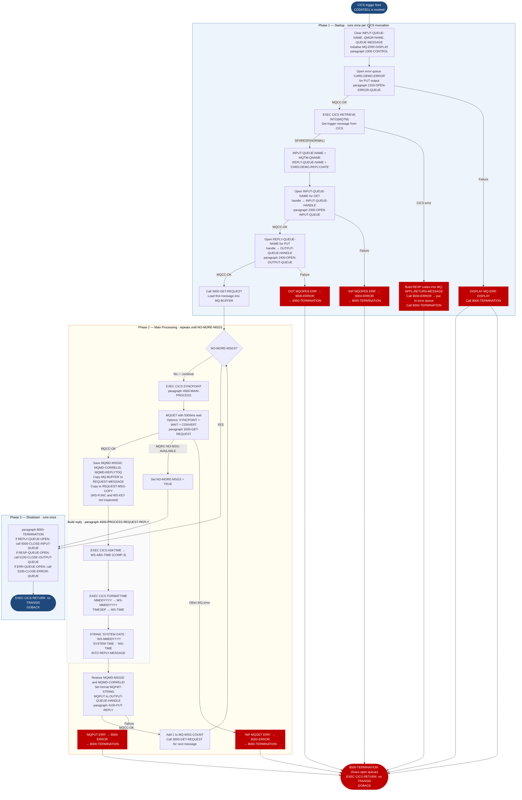

Application : AWS CardDemo
Source File : CODATE01.cbl
Type        : Online CICS COBOL (MQ-bridge date utility)
Source Banner: IDENTIFICATION DIVISION. PROGRAM-ID. CODATE01 IS INITIAL.

# CODATE01 — CICS MQ Date/Time Service

This document describes what the program does in plain English. It treats the program as a sequence of data actions and names every field, queue, and external program so a Java developer can trust this document instead of re-reading the COBOL source.

---

## 1. Purpose

CODATE01 is a CICS-resident date and time service that listens on an IBM MQ input queue. When a request message arrives on the queue, it retrieves the current system date and time using CICS ASKTIME and CICS FORMATTIME, formats them as `'SYSTEM DATE : MM-DD-YYYY SYSTEM TIME : HH:MM:SS'`, and puts the formatted string back onto a reply queue. After processing all available messages in one invocation, it closes queues and issues `EXEC CICS RETURN` (not `STOP RUN`).

The program is invoked by CICS via a trigger mechanism (`EXEC CICS RETRIEVE`) that delivers the name of the input queue through a trigger message (`MQTM` structure). The reply queue name is hardcoded to `'CARD.DEMO.REPLY.DATE'`. The error queue name is hardcoded to `'CARD.DEMO.ERROR'`.

No files (VSAM or otherwise) are accessed. No external COBOL programs are called. The only external linkages are IBM MQ API calls (`MQOPEN`, `MQGET`, `MQPUT`, `MQCLOSE`) and standard CICS commands.

The field `LIT-ACCTFILENAME` (PIC X(8) VALUE `'ACCTDAT '`) is defined in working storage but is **never referenced by any logic** — it is a leftover from a template and serves no purpose in this program (see Migration Note 1).

---

## 2. Program Flow

### 2.1 Startup

**Step 1 — Initialise and open error queue** *(paragraph `1000-CONTROL`, line 127).*
The program clears `INPUT-QUEUE-NAME`, `QMGR-NAME`, and `QUEUE-MESSAGE` to spaces, and initialises `MQ-ERR-DISPLAY`. It then calls `2100-OPEN-ERROR-QUEUE` (line 238) to open the hardcoded error queue `'CARD.DEMO.ERROR'` for output using `MQOPEN` with options `MQOO-OUTPUT + MQOO-PASS-ALL-CONTEXT + MQOO-FAIL-IF-QUIESCING`. On success, `ERR-QUEUE-OPEN` is set to `TRUE` and the handle is saved in `ERROR-QUEUE-HANDLE`. On failure the error is displayed via `DISPLAY MQ-ERR-DISPLAY` and the program calls `8000-TERMINATION`.

**Step 2 — Retrieve the trigger message** *(lines 140–159).* `EXEC CICS RETRIEVE INTO(MQTM)` fetches the trigger message that CICS placed when the trigger condition fired. If the CICS response (`WS-CICS-RESP1-CD`) is `DFHRESP(NORMAL)`, the input queue name is read from `MQTM-QNAME` and saved into `INPUT-QUEUE-NAME`. The reply queue name `'CARD.DEMO.REPLY.DATE'` is hardcoded into `REPLY-QUEUE-NAME`. On any CICS error, the program builds an error message containing the CICS RESP codes and calls `9000-ERROR` followed by `8000-TERMINATION`.

**Step 3 — Open input and output queues** *(paragraphs `2300-OPEN-INPUT-QUEUE` and `2400-OPEN-OUTPUT-QUEUE`, lines 171–236).* Both queues are opened using `MQOPEN`. The input queue opens with `MQOO-INPUT-SHARED + MQOO-SAVE-ALL-CONTEXT + MQOO-FAIL-IF-QUIESCING`; the handle goes to `INPUT-QUEUE-HANDLE` and `REPLY-QUEUE-OPEN` is set `TRUE`. The output (reply) queue opens with `MQOO-OUTPUT + MQOO-PASS-ALL-CONTEXT + MQOO-FAIL-IF-QUIESCING`; the handle goes to `OUTPUT-QUEUE-HANDLE` and `RESP-QUEUE-OPEN` is set `TRUE`. Either failure logs an error and calls `8000-TERMINATION`.

**Step 4 — Prime the message loop** *(line 163).* `3000-GET-REQUEST` is called once before the main loop begins.

### 2.2 Main Processing

The loop `PERFORM 4000-MAIN-PROCESS UNTIL NO-MORE-MSGS` (lines 164–165) iterates until `NO-MORE-MSGS` is `TRUE`. Inside `4000-MAIN-PROCESS`:

**Step 5 — Issue CICS SYNCPOINT** *(lines 275–277).* A sync point is taken before each message get to ensure clean unit-of-work boundaries.

**Step 6 — Get next request message** *(paragraph `3000-GET-REQUEST`, line 283).* Calls `MQGET` on the input queue with a 5000-millisecond wait interval (`MQGMO-WAITINTERVAL = 5000`). The get options are `MQGMO-SYNCPOINT + MQGMO-FAIL-IF-QUIESCING + MQGMO-CONVERT + MQGMO-WAIT`. The message is received into `MQ-BUFFER` (up to 1000 bytes). On `MQCC-OK`:
- The MQ message ID, correlation ID, and reply-to queue are captured into `SAVE-MSGID`, `SAVE-CORELID`, and `SAVE-REPLY2Q`.
- `MQ-BUFFER` is copied into `REQUEST-MESSAGE` and then into `REQUEST-MSG-COPY` (which overlays it as `WS-FUNC` X(4) + `WS-KEY` 9(11) + `WS-FILLER` X(985)).
- `4000-PROCESS-REQUEST-REPLY` is called.
- `MQ-MSG-COUNT` is incremented.

If `MQ-REASON-CODE` equals `MQRC-NO-MSG-AVAILABLE`, `NO-MORE-MSGS` is set to `TRUE` and the loop exits. Any other MQ error sends an error message and calls `8000-TERMINATION`.

**Step 7 — Build the reply** *(paragraph `4000-PROCESS-REQUEST-REPLY`, line 339).* Clears `REPLY-MESSAGE` and `WS-DATE-TIME`. Calls `EXEC CICS ASKTIME ABSTIME(WS-ABS-TIME)` to obtain the current system time as a packed-decimal absolute time in `WS-ABS-TIME` (PIC S9(15) COMP-3). Then calls `EXEC CICS FORMATTIME` with `MMDDYYYY`, `DATESEP('-')`, and `TIMESEP` to produce:
- `WS-MMDDYYYY` (PIC X(10)) — date formatted as `MM-DD-YYYY`
- `WS-TIME` (PIC X(8)) — time formatted with colon separators

The two values are concatenated into `REPLY-MESSAGE` using a STRING statement: `'SYSTEM DATE : '` + `WS-MMDDYYYY` + `'SYSTEM TIME : '` + `WS-TIME`. The result occupies the first 47 characters of the 1000-byte `REPLY-MESSAGE` field. Paragraph `4100-PUT-REPLY` is then called.

**Step 8 — Put the reply** *(paragraph `4100-PUT-REPLY`, line 366).* Copies `REPLY-MESSAGE` into `MQ-BUFFER` and sets `MQ-BUFFER-LENGTH` to 1000. Restores the saved message and correlation IDs into `MQMD-MSGID` and `MQMD-CORRELID`. Sets `MQMD-FORMAT` to `MQFMT-STRING` and `MQMD-CODEDCHARSETID` to `MQCCSI-Q-MGR`. The put options are `MQPMO-SYNCPOINT + MQPMO-DEFAULT-CONTEXT + MQPMO-FAIL-IF-QUIESCING`. Calls `MQPUT` on `OUTPUT-QUEUE-HANDLE`. On failure, sends error details and calls `8000-TERMINATION`.

### 2.3 Shutdown

**Step 9 — Close queues conditionally** *(paragraph `8000-TERMINATION`, line 442).* Only closes queues whose open-status flags are `TRUE`:
- If `REPLY-QUEUE-OPEN` (input queue): calls `5000-CLOSE-INPUT-QUEUE` (line 456).
- If `RESP-QUEUE-OPEN` (output/reply queue): calls `5100-CLOSE-OUTPUT-QUEUE` (line 478).
- If `ERR-QUEUE-OPEN` (error queue): calls `5200-CLOSE-ERROR-QUEUE` (line 501).

Each close uses `MQCLOSE` with `MQCO-NONE`. Failure causes a recursive call to `8000-TERMINATION` (see Migration Note 4).

**Step 10 — Return to CICS** *(line 453).* `EXEC CICS RETURN END-EXEC` followed by `GOBACK`. Because no `TRANSID` is specified in the RETURN, CICS does not re-queue the transaction.

---

## 3. Error Handling

### 3.1 MQ Queue-Open Errors

- `2100-OPEN-ERROR-QUEUE` failure (line 269): `DISPLAY MQ-ERR-DISPLAY` then calls `8000-TERMINATION`. Notably does **not** call `9000-ERROR` first (error queue itself is not open yet).
- `2300-OPEN-INPUT-QUEUE` failure (line 200): moves `'INP MQOPEN ERR'` to `MQ-APPL-RETURN-MESSAGE`, calls `9000-ERROR` then `8000-TERMINATION`.
- `2400-OPEN-OUTPUT-QUEUE` failure (line 233): moves `'OUT MQOPEN ERR'` to `MQ-APPL-RETURN-MESSAGE`, calls `9000-ERROR` then `8000-TERMINATION`.

### 3.2 MQ Get Error — paragraph `3000-GET-REQUEST` (line 283)

`'INP MQGET ERR:'` → `9000-ERROR` → `8000-TERMINATION`.

### 3.3 MQ Put Error — paragraph `4100-PUT-REPLY` (line 366)

`'MQPUT ERR'` → `9000-ERROR` → `8000-TERMINATION`.

### 3.4 MQ Close Errors — paragraphs `5000`, `5100`, `5200`

`'MQCLOSE ERR'` → recursive call to `8000-TERMINATION` (for 5000 and 5100); for `5200-CLOSE-ERROR-QUEUE` failure: `9000-ERROR` then `8000-TERMINATION`.

### 3.5 Error Router — paragraph `9000-ERROR` (line 405)

Copies `MQ-ERR-DISPLAY` into `ERROR-MESSAGE`, moves it into `MQ-BUFFER`, sets format to `MQFMT-STRING`, and calls `MQPUT` on `ERROR-QUEUE-HANDLE` to write the error description to the error queue. On MQPUT failure, displays `MQ-ERR-DISPLAY` to the job log and calls `8000-TERMINATION`.

### 3.6 CICS Trigger Retrieve Error

If `EXEC CICS RETRIEVE` returns anything other than `DFHRESP(NORMAL)`, the program builds a STRING of `'CICS RETRIEVE'` + RESP codes into `MQ-APPL-RETURN-MESSAGE`, calls `9000-ERROR`, then `8000-TERMINATION`.

---

## 4. Migration Notes

1. **`LIT-ACCTFILENAME` (PIC X(8) VALUE `'ACCTDAT '`) at line 115 is never used.** It is defined in `WS-VARIABLES` but is not referenced anywhere in the PROCEDURE DIVISION. This is a template copy artifact from another program and has no meaning in CODATE01.

2. **`WS-ABS-TIME` (PIC S9(15) COMP-3) stores the CICS absolute time (line 36).** This is a COMP-3 packed-decimal value. In Java, the equivalent is obtained via JCICS `Task.getCurrent().getAbsoluteTime()` or simply `java.time.LocalDateTime.now()`. Do not attempt to interpret the raw packed-decimal bytes outside of CICS context.

3. **`REQUEST-MSG-COPY` overlays `REQUEST-MESSAGE` (lines 109–112) as `WS-FUNC` X(4) + `WS-KEY` 9(11) + padding, but neither `WS-FUNC` nor `WS-KEY` is ever used.** The program does not actually inspect the content of the incoming request — it returns the current date/time regardless of what the message contains.

4. **Recursive call to `8000-TERMINATION` on close failure.** If `5000-CLOSE-INPUT-QUEUE` or `5100-CLOSE-OUTPUT-QUEUE` fails, it calls `8000-TERMINATION` again from inside `8000-TERMINATION`. CICS does not support deep recursion in this way; this will likely cause an abend or unexpected behaviour. The Java equivalent should use a try-finally pattern instead.

5. **The error-queue open flag is `ERR-QUEUE-OPEN` (88-level VALUE `'Y'`) but `2100-OPEN-ERROR-QUEUE` sets `ERR-QUEUE-OPEN TO TRUE` on success (line 263).** However the close check at line 450 checks `ERR-QUEUE-OPEN` correctly. This is consistent.

6. **The program label `4000-MAIN-PROCESS` (line 274) and `4000-PROCESS-REQUEST-REPLY` (line 339) share the same numeric prefix `4000`.** This is not a compilation error in COBOL (paragraph names must be unique but the number prefix is decorative) but can confuse text searches and Java class naming.

7. **No business logic resides in this program** — it is purely a date/time service shim. In a Java migration, this is best replaced by a REST endpoint or a message-driven bean that calls `java.time.LocalDateTime.now()` and returns the formatted date/time string.

8. **`WS-CICS-RESP1-CD` and `WS-CICS-RESP2-CD` are declared twice** — once as `PIC S9(08) COMP` (lines 27–28) and once as display `PIC 9(08)` counterparts `WS-CICS-RESP1-CD-D` and `WS-CICS-RESP2-CD-D` (lines 29–30). The STRING at line 152 uses the display fields — `WS-CICS-RESP1-CD` (binary) is first moved to `WS-CICS-RESP1-CD-D` (display) to make it printable.

9. **MQ constants (`MQCC-OK`, `MQRC-NO-MSG-AVAILABLE`, `MQFMT-STRING`, etc.) come from the IBM-supplied copybooks `CMQGMOV`, `CMQPMOV`, `CMQMDV`, `CMQODV`, `CMQV`, and `CMQTML`**, which are not present in this repository. These define all the numeric literals used for MQ option fields. The Java equivalent is the `com.ibm.mq` client library.

---

## Appendix A — Files

This program accesses no VSAM files or sequential datasets. All I/O is through IBM MQ queues.

| Queue Name | Type | Direction | Contents |
|---|---|---|---|
| Name from `MQTM-QNAME` (trigger) | MQ input queue | GET | Request messages. Content not inspected; any message triggers a date/time reply. |
| `'CARD.DEMO.REPLY.DATE'` | MQ output queue | PUT | Reply messages containing formatted date and time string. |
| `'CARD.DEMO.ERROR'` | MQ error queue | PUT | Error messages from `9000-ERROR` routine. |

---

## Appendix B — Copybooks and External Programs

### IBM MQ Copybooks (not in repository)

| Copybook | Group name | Purpose |
|---|---|---|
| `CMQGMOV` | `MQ-GET-MESSAGE-OPTIONS` | GET message options structure (MQGMO) |
| `CMQPMOV` | `MQ-PUT-MESSAGE-OPTIONS` | PUT message options structure (MQPMO) |
| `CMQMDV` | `MQ-MESSAGE-DESCRIPTOR` | Message descriptor structure (MQMD) |
| `CMQODV` | `MQ-OBJECT-DESCRIPTOR` | Object descriptor structure (MQOD) |
| `CMQV` | `MQ-CONSTANTS` | All named MQ constants (MQCC-*, MQRC-*, MQOO-*, etc.) |
| `CMQTML` | `MQ-GET-QUEUE-MESSAGE` / `MQTM` | Trigger message structure |

None of these copybooks are present in this repository. Their field names appear throughout the program and must be resolved using the IBM MQ COBOL documentation.

### IBM MQ API Functions (called as COBOL CALL statements)

| Function | Called from | Purpose |
|---|---|---|
| `MQOPEN` | `2100-OPEN-ERROR-QUEUE`, `2300-OPEN-INPUT-QUEUE`, `2400-OPEN-OUTPUT-QUEUE` | Open MQ queue and obtain handle |
| `MQGET` | `3000-GET-REQUEST` | Get next message from input queue |
| `MQPUT` | `4100-PUT-REPLY`, `9000-ERROR` | Put message onto output or error queue |
| `MQCLOSE` | `5000-CLOSE-INPUT-QUEUE`, `5100-CLOSE-OUTPUT-QUEUE`, `5200-CLOSE-ERROR-QUEUE` | Close MQ queue handle |

For `MQGET`: input fields set — `MQ-HCONN`, `MQ-HOBJ`, `MQ-MESSAGE-DESCRIPTOR`, `MQ-GET-MESSAGE-OPTIONS`, `MQ-BUFFER-LENGTH`. Output fields read — `MQ-BUFFER`, `MQ-DATA-LENGTH`, `MQ-CONDITION-CODE`, `MQ-REASON-CODE`, `MQMD-MSGID`, `MQMD-CORRELID`, `MQMD-REPLYTOQ`. `MQ-DATA-LENGTH` (actual bytes received) is **never checked** after the GET.

For `MQPUT`: input fields set — `MQ-HCONN`, output queue handle, `MQ-MESSAGE-DESCRIPTOR`, `MQ-PUT-MESSAGE-OPTIONS`, `MQ-BUFFER-LENGTH`, `MQ-BUFFER`. Output fields — `MQ-CONDITION-CODE`, `MQ-REASON-CODE`. The message ID assigned by MQ to the put message is **not captured**.

---

## Appendix C — Hardcoded Literals

| Paragraph | Line | Value | Usage | Classification |
|---|---|---|---|---|
| `2100-OPEN-ERROR-QUEUE` | 243 | `'CARD.DEMO.ERROR'` | Error queue name | System constant |
| `1000-CONTROL` | 147 | `'CARD.DEMO.REPLY.DATE'` | Reply queue name | System constant |
| `3000-GET-REQUEST` | 286 | `5000` | MQGMO wait interval in milliseconds (5 seconds) | Business rule / tuning parameter |
| `3000-GET-REQUEST` | 291 | `1000` | `MQ-BUFFER-LENGTH` for GET | System constant |
| `4100-PUT-REPLY` | 372 | `1000` | `MQ-BUFFER-LENGTH` for PUT | System constant |
| `9000-ERROR` | 411 | `1000` | `MQ-BUFFER-LENGTH` for error PUT | System constant |
| `4000-PROCESS-REQUEST-REPLY` | 355 | `'SYSTEM DATE : '` | Reply message prefix | Display message |
| `4000-PROCESS-REQUEST-REPLY` | 356 | `'SYSTEM TIME : '` | Reply message time label | Display message |
| `2100-OPEN-ERROR-QUEUE` | 268 | `'ERR MQOPEN ERR'` | Error return message for error queue open failure | Display message |
| `2300-OPEN-INPUT-QUEUE` | 199 | `'INP MQOPEN ERR'` | Error return message | Display message |
| `2400-OPEN-OUTPUT-QUEUE` | 233 | `'OUT MQOPEN ERR'` | Error return message | Display message |
| `3000-GET-REQUEST` | 333 | `'INP MQGET ERR:'` | Error return message | Display message |
| `4100-PUT-REPLY` | 400 | `'MQPUT ERR'` | Error return message | Display message |
| `9000-ERROR` | 437 | `'MQPUT ERR'` | Error message for error-queue PUT failure | Display message |
| `5000/5100/5200-CLOSE-*` | 475, 497, 520 | `'MQCLOSE ERR'` | Error return message | Display message |
| `WS-VARIABLES` | 116 | `'ACCTDAT '` | **Never used** — template artifact | Test data / artifact |
| `1000-CONTROL` | 149 | `'CICS RETRIEVE'` | Error context identifier | Display message |

---

## Appendix D — Internal Working Fields

| Field | PIC | Bytes | Purpose |
|---|---|---|---|
| `WS-MQ-MSG-FLAG` | `X(01)` | 1 | Loop control; 88: `NO-MORE-MSGS` = `'Y'` — set when MQ returns no-message-available |
| `WS-RESP-QUEUE-STS` | `X(01)` | 1 | Output queue open flag; 88: `RESP-QUEUE-OPEN` = `'Y'` |
| `WS-ERR-QUEUE-STS` | `X(01)` | 1 | Error queue open flag; 88: `ERR-QUEUE-OPEN` = `'Y'` |
| `WS-REPLY-QUEUE-STS` | `X(01)` | 1 | Input queue open flag; 88: `REPLY-QUEUE-OPEN` = `'Y'` (note: flag name says "reply" but tracks input queue open state) |
| `WS-CICS-RESP1-CD` | `S9(08) COMP` | 4 | CICS primary response code (binary) |
| `WS-CICS-RESP2-CD` | `S9(08) COMP` | 4 | CICS secondary response code (binary) |
| `WS-CICS-RESP1-CD-D` | `9(08)` | 8 | Display copy of RESP1 for STRING output |
| `WS-CICS-RESP2-CD-D` | `9(08)` | 8 | Display copy of RESP2 for STRING output |
| `WS-ABS-TIME` | `S9(15) COMP-3` | 8 | **(COMP-3)** CICS absolute time ticks from ASKTIME |
| `WS-MMDDYYYY` | `X(10)` | 10 | Formatted date from CICS FORMATTIME (`MM-DD-YYYY`) |
| `WS-TIME` | `X(8)` | 8 | Formatted time from CICS FORMATTIME (`HH:MM:SS`) |
| `MQ-HCONN` | `S9(09) BINARY` | 4 | MQ queue manager connection handle |
| `MQ-CONDITION-CODE` | `S9(09) BINARY` | 4 | MQ API return code (`MQCC-OK` = 0) |
| `MQ-REASON-CODE` | `S9(09) BINARY` | 4 | MQ API reason code |
| `MQ-HOBJ` | `S9(09) BINARY` | 4 | MQ object handle (reused for each open) |
| `MQ-OPTIONS` | `S9(09) BINARY` | 4 | Computed open/close options |
| `MQ-BUFFER-LENGTH` | `S9(09) BINARY` | 4 | Buffer length for GET/PUT |
| `MQ-BUFFER` | `X(1000)` | 1000 | Raw message buffer |
| `MQ-DATA-LENGTH` | `S9(09) BINARY` | 4 | Actual message length from GET — **never read** |
| `MQ-CORRELID` | `X(24)` | 24 | Correlation ID from received message |
| `MQ-MSG-ID` | `X(24)` | 24 | Message ID from received message |
| `MQ-MSG-COUNT` | `9(09)` | 9 | Count of messages processed in this invocation |
| `SAVE-CORELID` | `X(24)` | 24 | Saved correlation ID for reply |
| `SAVE-MSGID` | `X(24)` | 24 | Saved message ID for reply |
| `SAVE-REPLY2Q` | `X(48)` | 48 | Saved reply-to queue name (from `MQMD-REPLYTOQ`) — captured but never used to route the reply |
| `QUEUE-MESSAGE` | `X(1000)` | 1000 | Cleared at startup; not used for GET/PUT operations (uses `MQ-BUFFER` directly) |
| `REQUEST-MESSAGE` | `X(1000)` | 1000 | Copy of `MQ-BUFFER` after successful GET |
| `REPLY-MESSAGE` | `X(1000)` | 1000 | Formatted reply string placed here before PUT |
| `ERROR-MESSAGE` | `X(1000)` | 1000 | Copy of `MQ-ERR-DISPLAY` formatted for error queue PUT |
| `REQUEST-MSG-COPY` | Group 1000 bytes | 1000 | Overlay: `WS-FUNC` X(4) + `WS-KEY` 9(11) + `WS-FILLER` X(985) — **neither WS-FUNC nor WS-KEY is ever read** |
| `INPUT-QUEUE-NAME` | `X(48)` | 48 | Queue name from trigger message |
| `REPLY-QUEUE-NAME` | `X(48)` | 48 | Reply queue name — hardcoded to `'CARD.DEMO.REPLY.DATE'` |
| `ERROR-QUEUE-NAME` | `X(48)` | 48 | Error queue name — hardcoded to `'CARD.DEMO.ERROR'` |
| `INPUT-QUEUE-HANDLE` | `S9(09) BINARY` | 4 | MQ handle for the input queue |
| `OUTPUT-QUEUE-HANDLE` | `S9(09) BINARY` | 4 | MQ handle for the reply queue |
| `ERROR-QUEUE-HANDLE` | `S9(09) BINARY` | 4 | MQ handle for the error queue |
| `QMGR-HANDLE-CONN` | `S9(09) BINARY` | 4 | Queue manager connection handle |
| `WS-RESP-CD` | `S9(09) COMP` | 4 | CICS RESP code storage |
| `WS-REAS-CD` | `S9(09) COMP` | 4 | CICS RESP2 code storage |
| `LIT-ACCTFILENAME` | `X(8)` | 8 | VALUE `'ACCTDAT '` — **never used; template artifact** |

---

## Appendix E — Execution at a Glance

---

*Source: `CODATE01.cbl`, CardDemo, Apache 2.0 license. Copybooks: `CMQGMOV` (IBM), `CMQPMOV` (IBM), `CMQMDV` (IBM), `CMQODV` (IBM), `CMQV` (IBM), `CMQTML` (IBM) — not in repository. External programs: `MQOPEN`, `MQGET`, `MQPUT`, `MQCLOSE` (IBM MQ API).*
