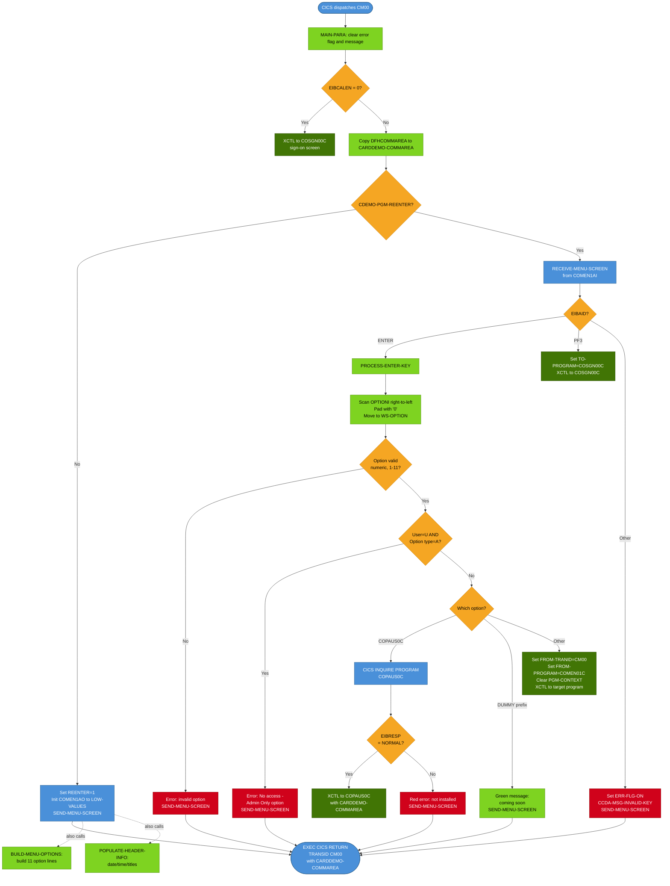

# BIZ-COMEN01C — CardDemo Main Menu

| Attribute | Value |
|-----------|-------|
| **Program** | COMEN01C |
| **Type** | CICS Online — Pseudo-Conversational |
| **Transaction ID** | CM00 |
| **BMS Map** | COMEN1A / Mapset COMEN01 |
| **Language** | COBOL |
| **Source File** | `source/cobol/COMEN01C.cbl` |
| **Lines** | 309 |
| **Version Tag** | CardDemo_v1.0-15-g27d6c6f-68 · 2022-07-19 |

---

## 1. Business Purpose

COMEN01C is the central navigation hub for regular users of the CardDemo credit card management system. It presents an 11-option menu that routes the authenticated user to every functional sub-system: account view and update, credit card management, transaction browsing and reporting, bill payment, and pending authorization review.

The program enforces two important access-control rules. First, if the caller arrives without a commarea (`EIBCALEN = 0`) it immediately transfers control back to the sign-on screen (COSGN00C), preventing unauthenticated entry. Second, it inspects the user type stored in the commarea and blocks regular users (`CDEMO-USRTYP-USER`) from any menu option whose access flag is `'A'` (Admin Only). Only one standard option carries that flag: none in the current table — all 11 options are flagged `'U'` — but the enforcement logic exists to support future Admin-restricted additions.

A special case handles option 11 (Pending Authorization View, COPAUS0C): before issuing XCTL, the program issues a CICS `INQUIRE PROGRAM` to verify that COPAUS0C is actually installed. If it is not installed, the user sees an error message rather than a failed XCTL. All other options transfer control directly via XCTL without availability checking.

---

## 2. Program Flow

### 2.1 Startup

When CICS dispatches transaction CM00, the program enters `MAIN-PARA`.

1. `WS-ERR-FLG` is set to `'N'` (OFF) and `WS-MESSAGE` is cleared.
2. `EIBCALEN` is tested:
   - If **zero**: the program sets `CDEMO-FROM-PROGRAM` to `'COSGN00C'` and immediately calls `RETURN-TO-SIGNON-SCREEN`. No screen is painted. This guard prevents a user from launching CM00 directly without going through sign-on.
   - If **non-zero**: the commarea bytes are copied from `DFHCOMMAREA(1:EIBCALEN)` into `CARDDEMO-COMMAREA`. The `CDEMO-PGM-REENTER` flag (88-level value `1` on `CDEMO-PGM-CONTEXT`) is then checked:
     - If **not REENTER** (first pass, value `0`): the flag is set to `1`, the map output area `COMEN1AO` is initialized to `LOW-VALUES`, and `SEND-MENU-SCREEN` is called to display the menu for the first time.
     - If **REENTER** (subsequent passes): `RECEIVE-MENU-SCREEN` is called to collect the user's input, followed by key dispatch.

### 2.2 Main Processing

After receiving the screen (`RECEIVE-MENU-SCREEN`), the program evaluates `EIBAID`:

| AID | Action |
|-----|--------|
| `DFHENTER` | Call `PROCESS-ENTER-KEY` |
| `DFHPF3` | Set `CDEMO-TO-PROGRAM` to `'COSGN00C'`, call `RETURN-TO-SIGNON-SCREEN` |
| Any other key | Set `WS-ERR-FLG` to `'Y'`, load `CCDA-MSG-INVALID-KEY` into `WS-MESSAGE`, redisplay menu |

**`PROCESS-ENTER-KEY`** performs option parsing, access control, and routing:

1. The OPTIONI field from the received map is scanned from right to left to strip trailing spaces, left-justified into `WS-OPTION-X` (PIC X(02)), spaces are replaced with `'0'`, and the result is moved to the numeric `WS-OPTION` (PIC 9(02)).

2. If `WS-OPTION` is non-numeric, greater than `CDEMO-MENU-OPT-COUNT` (11), or zero, an error "Please enter a valid option number..." is displayed and the menu is re-sent.

3. If the user type is `'U'` (regular user) and the selected option's `CDEMO-MENU-OPT-USRTYPE` is `'A'`, the error "No access - Admin Only option..." is displayed.

4. If no error, an EVALUATE dispatches on three conditions:
   - **COPAUS0C check**: CICS `INQUIRE PROGRAM` is called with `NOHANDLE`. If `EIBRESP = DFHRESP(NORMAL)` (program known), XCTL is issued. Otherwise, a red error message "This option `<name>` is not installed..." is set in `WS-MESSAGE`.
   - **DUMMY prefix**: If the selected program name starts with `'DUMMY'`, a green "This option `<name>` is coming soon ..." message is set. No XCTL is issued.
   - **All other options**: `CDEMO-FROM-TRANID` is set to `WS-TRANID` (`'CM00'`), `CDEMO-FROM-PROGRAM` is set to `WS-PGMNAME` (`'COMEN01C'`), `CDEMO-PGM-CONTEXT` is cleared to 0, and CICS `XCTL` is issued with `CARDDEMO-COMMAREA`.

Note: there is a duplicate `MOVE WS-PGMNAME TO CDEMO-FROM-PROGRAM` at lines 179–180 in the WHEN OTHER branch. This is a harmless code defect — the move is idempotent — but indicates a leftover edit or copy/paste mistake. Two commented-out lines (181–182) suggest the original intent was also to copy `WS-USER-ID` and `SEC-USR-TYPE` into the commarea, but those moves were never implemented.

**`BUILD-MENU-OPTIONS`** is called as part of `SEND-MENU-SCREEN`. It iterates from 1 to `CDEMO-MENU-OPT-COUNT` (11), building a formatted string for each option as `"NN. Option Name"` and placing it into the corresponding map output field `OPTN001O` through `OPTN011O`. The map has capacity for 12 options (`OPTN012O` exists) but only 11 are populated; `OPTN012O` is never written.

**`POPULATE-HEADER-INFO`** uses `FUNCTION CURRENT-DATE` to obtain system date and time, then writes the date as MM/DD/YY to `CURDATEO` and the time as HH:MM:SS to `CURTIMEO`. The application titles from `COTTL01Y` (`CCDA-TITLE01`, `CCDA-TITLE02`) along with the transaction ID and program name are placed in the map header fields.

### 2.3 Shutdown

Every exit path ends with the same unconditional CICS RETURN at the bottom of `MAIN-PARA`:

```
EXEC CICS RETURN
    TRANSID (WS-TRANID)
    COMMAREA (CARDDEMO-COMMAREA)
END-EXEC
```

`WS-TRANID` is hardcoded `'CM00'`, so the next keystroke will re-invoke this same program. `CARDDEMO-COMMAREA` carries the updated state (including `CDEMO-PGM-REENTER = 1`) back to CICS for delivery on the next invocation. XCTL exits bypass this RETURN and transfer control directly; once an XCTL is issued the returning program is responsible for its own shutdown.

---

## 3. Error Handling

| Condition | Detection | Response |
|-----------|-----------|----------|
| No commarea (`EIBCALEN = 0`) | Checked at program entry | XCTL to `COSGN00C` — user must sign in |
| Invalid AID key | `EIBAID NOT DFHENTER/DFHPF3` | `CCDA-MSG-INVALID-KEY` in red error field; menu redisplayed |
| Option not numeric / out of range / zero | Inline test in `PROCESS-ENTER-KEY` | "Please enter a valid option number..." message; menu redisplayed |
| Regular user selects Admin-only option | `CDEMO-USRTYP-USER AND CDEMO-MENU-OPT-USRTYPE = 'A'` | "No access - Admin Only option..." message; menu redisplayed |
| COPAUS0C not installed | CICS INQUIRE; `EIBRESP != DFHRESP(NORMAL)` | Red message "This option `<name>` is not installed..."; no XCTL |
| DUMMY option selected | Program name prefix `'DUMMY'` | Green message "This option `<name>` is coming soon ..."; no XCTL |

The program has no CICS HANDLE CONDITION or NOHANDLE on the SEND/RECEIVE MAP calls. Any CICS error during map send/receive will raise an unhandled exception and terminate the task abnormally.

---

## 4. Migration Notes

1. **Pseudo-conversational state**: `CDEMO-PGM-CONTEXT` (value `0` = first entry, `1` = re-entry) must be preserved across HTTP round-trips in the Java equivalent. Consider a session token or a stateless JWT claim for this flag.

2. **XCTL semantics**: Each XCTL is a permanent transfer — this program loses control. In Java, this becomes a redirect or a controller delegation pattern. The `CDEMO-FROM-PROGRAM` / `CDEMO-FROM-TRANID` fields must be populated before the redirect so the target program knows its caller.

3. **Menu table is static data**: `CARDDEMO-MAIN-MENU-OPTIONS` in `COMEN02Y` is compile-time constant data. In Java this becomes a static enum or configuration bean. The user-type flag per option (`'U'`/`'A'`) maps directly to a Spring Security role check or a custom `@PreAuthorize` annotation.

4. **COPAUS0C availability check**: The `CICS INQUIRE PROGRAM` call is a runtime feature toggle — it gracefully degrades when the program is not deployed. The Java equivalent should check a feature flag or a service health endpoint before enabling the "Pending Authorization" menu item.

5. **Duplicate MOVE at lines 179–180**: The redundant `MOVE WS-PGMNAME TO CDEMO-FROM-PROGRAM` must be de-duplicated in Java. The commented-out `WS-USER-ID` and `SEC-USR-TYPE` moves suggest the original design intended to pass user identity in the commarea; Java should carry these fields in the session/JWT instead.

6. **DFHBMSCA color attributes**: `DFHRED` (error) and `DFHGREEN` (informational) are IBM BMS constants for terminal attribute bytes. In a web UI these map to CSS classes or Bootstrap alert styles (`alert-danger`, `alert-success`).

7. **Two-digit year display**: `WS-CURDATE-YY` is only the last 2 digits of the year (`WS-CURDATE-YEAR(3:2)`). This is a display-only cosmetic; the full 4-digit year is available in `WS-CURDATE-YEAR`. Java should use `java.time.LocalDate` and format with the full year.

8. **USRSEC file**: `WS-USRSEC-FILE` (`'USRSEC  '`) is declared but never opened, read, or used anywhere in this program. It is a leftover template field — do not generate any file-access code for it in Java.

---

## Appendix A — Working Storage Fields

### WS-VARIABLES (program-local)

| Field | PIC | Initial Value | Notes |
|-------|-----|---------------|-------|
| `WS-PGMNAME` | X(08) | `'COMEN01C'` | Own program name, passed to commarea |
| `WS-TRANID` | X(04) | `'CM00'` | Own transaction ID, used in RETURN and XCTL setup |
| `WS-MESSAGE` | X(80) | SPACES | Holds error/informational text for the error map field |
| `WS-USRSEC-FILE` | X(08) | `'USRSEC  '` | Declared but never used — template artifact |
| `WS-ERR-FLG` | X(01) | `'N'` | Error flag; 88 `ERR-FLG-ON` = `'Y'`, `ERR-FLG-OFF` = `'N'` |
| `WS-RESP-CD` | S9(09) COMP | 0 | CICS RESP code from RECEIVE MAP |
| `WS-REAS-CD` | S9(09) COMP | 0 | CICS RESP2 code from RECEIVE MAP |
| `WS-OPTION-X` | X(02) JUST RIGHT | — | Raw option text from screen before numeric conversion |
| `WS-OPTION` | 9(02) | 0 | Numeric option selected by user |
| `WS-IDX` | S9(04) COMP | 0 | Loop index; used both for string scan and menu build loop |
| `WS-MENU-OPT-TXT` | X(40) | SPACES | Formatted option line, e.g. "01. Account View" |

### CARDDEMO-COMMAREA (from COCOM01Y)

The 168-byte commarea passed between all CardDemo programs.

| Field | PIC | Notes |
|-------|-----|-------|
| `CDEMO-FROM-TRANID` | X(04) | Caller's transaction ID — set to `'CM00'` before XCTL |
| `CDEMO-FROM-PROGRAM` | X(08) | Caller's program name — set to `'COMEN01C'` before XCTL |
| `CDEMO-TO-TRANID` | X(04) | Not set by this program |
| `CDEMO-TO-PROGRAM` | X(08) | Set to `'COSGN00C'` when routing to sign-on |
| `CDEMO-USER-ID` | X(08) | User ID carried from sign-on; read but not modified here |
| `CDEMO-USER-TYPE` | X(01) | `'A'` = Admin (88 `CDEMO-USRTYP-ADMIN`); `'U'` = Regular user (88 `CDEMO-USRTYP-USER`) |
| `CDEMO-PGM-CONTEXT` | 9(01) | `0` = first entry (88 `CDEMO-PGM-ENTER`); `1` = re-entry (88 `CDEMO-PGM-REENTER`) |
| `CDEMO-CUST-ID` | 9(09) | Customer ID — carried but not used by this program |
| `CDEMO-CUST-FNAME` | X(25) | Customer first name — carried but not used |
| `CDEMO-CUST-MNAME` | X(25) | Customer middle name — carried but not used |
| `CDEMO-CUST-LNAME` | X(25) | Customer last name — carried but not used |
| `CDEMO-ACCT-ID` | 9(11) | Account ID — carried but not used |
| `CDEMO-ACCT-STATUS` | X(01) | Account status — carried but not used |
| `CDEMO-CARD-NUM` | 9(16) | Card number — carried but not used |
| `CDEMO-LAST-MAP` | X(07) | Last map name — carried but not set |
| `CDEMO-LAST-MAPSET` | X(07) | Last mapset name — carried but not set |

### CARDDEMO-MAIN-MENU-OPTIONS (from COMEN02Y)

Static menu table — compile-time data embedded in the copybook.

| Field | PIC | Notes |
|-------|-----|-------|
| `CDEMO-MENU-OPT-COUNT` | 9(02) | Value `11` — total number of active options |
| `CDEMO-MENU-OPT-NUM(n)` | 9(02) | Option number 1–11 |
| `CDEMO-MENU-OPT-NAME(n)` | X(35) | Display name, e.g. `'Account View'` |
| `CDEMO-MENU-OPT-PGMNAME(n)` | X(08) | Target program name for XCTL |
| `CDEMO-MENU-OPT-USRTYPE(n)` | X(01) | `'U'` = all users; `'A'` = Admin only |

The full 11-row table:

| # | Name | Program | User Type |
|---|------|---------|-----------|
| 1 | Account View | COACTVWC | U |
| 2 | Account Update | COACTUPC | U |
| 3 | Credit Card List | COCRDLIC | U |
| 4 | Credit Card View | COCRDSLC | U |
| 5 | Credit Card Update | COCRDUPC | U |
| 6 | Transaction List | COTRN00C | U |
| 7 | Transaction View | COTRN01C | U |
| 8 | Transaction Add | COTRN02C | U |
| 9 | Transaction Reports | CORPT00C | U |
| 10 | Bill Payment | COBIL00C | U |
| 11 | Pending Authorization View | COPAUS0C | U |

Note: option 8 has a commented-out label `'Transaction Add (Admin Only)'` that was downgraded to `'Transaction Add'` with type `'U'`. The Admin-only enforcement was removed at the data level but the code logic for blocking Admin-only options remains active.

The OCCURS clause is declared for 12 entries but only 11 are populated. Index 12 contains undefined data; `CDEMO-MENU-OPT-COUNT` (11) prevents the loop from accessing it.

### CCDA-SCREEN-TITLE (from COTTL01Y)

| Field | PIC | Value |
|-------|-----|-------|
| `CCDA-TITLE01` | X(40) | `'      AWS Mainframe Modernization       '` |
| `CCDA-TITLE02` | X(40) | `'              CardDemo                  '` |
| `CCDA-THANK-YOU` | X(40) | `'Thank you for using CCDA application... '` — not used by COMEN01C |

### WS-DATE-TIME (from CSDAT01Y)

| Field | PIC | Notes |
|-------|-----|-------|
| `WS-CURDATE-YEAR` | 9(04) | 4-digit year from FUNCTION CURRENT-DATE |
| `WS-CURDATE-MONTH` | 9(02) | Month 01–12 |
| `WS-CURDATE-DAY` | 9(02) | Day 01–31 |
| `WS-CURTIME-HOURS` | 9(02) | Hour 00–23 |
| `WS-CURTIME-MINUTE` | 9(02) | Minute 00–59 |
| `WS-CURTIME-SECOND` | 9(02) | Second 00–59 |
| `WS-CURTIME-MILSEC` | 9(02) | Hundredths of a second (not displayed) |
| `WS-CURDATE-MM-DD-YY` | formatted | Composed display date `MM/DD/YY` (2-digit year) |
| `WS-CURTIME-HH-MM-SS` | formatted | Composed display time `HH:MM:SS` |

### CCDA-COMMON-MESSAGES (from CSMSG01Y)

| Field | PIC | Value |
|-------|-----|-------|
| `CCDA-MSG-INVALID-KEY` | X(50) | `'Invalid key pressed. Please see below...'` |

### SEC-USER-DATA (from CSUSR01Y)

| Field | PIC | Notes |
|-------|-----|-------|
| `SEC-USR-ID` | X(08) | User ID |
| `SEC-USR-FNAME` | X(20) | First name |
| `SEC-USR-LNAME` | X(20) | Last name |
| `SEC-USR-PWD` | X(08) | Password (plaintext — security risk in Java migration) |
| `SEC-USR-TYPE` | X(01) | `'A'` or `'U'` |
| `SEC-USR-FILLER` | X(23) | Padding |

This structure is declared in working storage but never populated or referenced in COMEN01C. It is a template inclusion — do not generate USRSEC file I/O in the Java equivalent.

---

## Appendix B — BMS Map Fields (COMEN1A / COMEN01)

The BMS mapset COMEN01 defines map COMEN1A. Fields follow IBM BMS naming convention: the base name suffixes with `I` (input, from user) or `O` (output, to terminal).

| Map Field (Output) | Purpose | Source |
|--------------------|---------|--------|
| `TITLE01O` | First title line | `CCDA-TITLE01` |
| `TITLE02O` | Second title line | `CCDA-TITLE02` |
| `TRNNAMEO` | Transaction ID | `WS-TRANID` (`'CM00'`) |
| `PGMNAMEO` | Program name | `WS-PGMNAME` (`'COMEN01C'`) |
| `CURDATEO` | Current date (MM/DD/YY) | `WS-CURDATE-MM-DD-YY` |
| `CURTIMEO` | Current time (HH:MM:SS) | `WS-CURTIME-HH-MM-SS` |
| `OPTN001O`–`OPTN011O` | Menu option text (11 lines) | Built by `BUILD-MENU-OPTIONS` |
| `OPTN012O` | 12th option slot — never written | Unused |
| `ERRMSGO` | Error / info message text | `WS-MESSAGE` |
| `ERRMSGC` | Error message colour attribute | `DFHRED` (error) or `DFHGREEN` (info) |

| Map Field (Input) | Purpose |
|-------------------|---------|
| `OPTIONI` | User-typed option number (up to length of field) |

The program scans `OPTIONI` from its maximum length backwards to find the last non-space character, right-justifies it, pads spaces with `'0'`, and then converts to numeric. This handles single-digit entries without a leading zero (e.g., `'1'` → `'01'` → option 1).

---

## Appendix C — File and External Resource Summary

| Resource | Type | Usage |
|----------|------|-------|
| COMEN01 (mapset) / COMEN1A (map) | BMS map | SEND (display menu) and RECEIVE (collect input) |
| CICS RETURN TRANSID CM00 | Pseudo-conversational RETURN | Re-queues transaction for next user input |
| CICS XCTL | Program transfer | Routes to selected sub-program |
| CICS INQUIRE PROGRAM | Runtime probe | Checks COPAUS0C availability before XCTL |
| USRSEC file | VSAM | Declared (`WS-USRSEC-FILE`) but never accessed |

No DB2, no MQ, no VSAM reads in this program. All state is carried in `CARDDEMO-COMMAREA`.

---

## Appendix D — Known Issues and Latent Bugs

1. **Duplicate MOVE (lines 179–180)**: `MOVE WS-PGMNAME TO CDEMO-FROM-PROGRAM` appears twice consecutively in the WHEN OTHER branch of `PROCESS-ENTER-KEY`. The second statement overwrites the result of the first with identical data — harmless but noisy. The two commented-out lines (181–182) reveal the original intent: the second MOVE was supposed to copy `WS-USER-ID` and `SEC-USR-TYPE` but was never implemented, leaving the second `MOVE WS-PGMNAME` as a placeholder artifact.

2. **User identity not forwarded in commarea**: `CDEMO-USER-ID` is read from the incoming commarea but never refreshed or explicitly confirmed before XCTL. If the sign-on program left it set, it passes through; but `COMEN01C` itself never validates or re-reads user identity from USRSEC. The commented-out moves at lines 181–182 show this was planned but skipped.

3. **SEND/RECEIVE MAP with no error handler**: Neither `EXEC CICS SEND MAP` nor `EXEC CICS RECEIVE MAP` specifies `RESP`/`RESP2` or a `HANDLE CONDITION`. Any CICS error (e.g., terminal disconnected) will raise an unhandled exception and produce an abend. The `WS-RESP-CD`/`WS-REAS-CD` fields declared in working storage are only used on the RECEIVE call, and even then their values are never tested after the receive.

4. **WS-USRSEC-FILE declared but unused**: The field `WS-USRSEC-FILE PIC X(08) VALUE 'USRSEC  '` appears in working storage but the program never opens, reads, or otherwise accesses the USRSEC file. This is a template artifact present in most CardDemo programs. Java migration must not generate file I/O for this field.

5. **Two-digit year in display**: `CURDATEO` shows only `MM/DD/YY`. If the system rolls past 2099 (unlikely but architecturally relevant), the display becomes ambiguous. Java should display the full 4-digit year.

6. **OPTN012O never written**: The BMS map has a 12th option slot (`OPTN012O`) and the OCCURS table has 12 entries, but `CDEMO-MENU-OPT-COUNT` is 11 and `BUILD-MENU-OPTIONS` only iterates to 11. The 12th slot is always blank on screen. This is consistent — just a reserved expansion slot.

---

## Appendix E — Mermaid Flow Diagram


