Application : AWS CardDemo
Source File : COPAUA0C.cbl
Type        : Online CICS COBOL (CICS + IMS + MQ hybrid)
Source Banner: Program : COPAUA0C.CBL / Application : CardDemo - Authorization Module / Function : Card Authorization Decision Program

# COPAUA0C — Card Authorization Decision Engine

This document describes what the program does in plain English. It treats the program as a sequence of data actions — reading queues, looking up reference data, computing credit availability, making approval/decline decisions, and writing results — and names every file, field, copybook, external resource, and external program along the way so a developer can still find each piece in the source. The reader does not need to know COBOL.

---

## 1. Purpose

COPAUA0C is the real-time card authorization decision engine for CardDemo. It is a CICS-triggered program that runs as an MQ trigger monitor: it wakes up when a batch of authorization-request messages arrives on an IBM MQ input queue, processes up to 500 messages per invocation, and returns a decision for each one.

For every authorization request the program:

1. Reads the request message from the IBM MQ request queue (queue name passed in the CICS trigger data area `MQTM`).
2. Looks up card-to-account cross-reference, account master data, and customer master data from VSAM files via CICS READ.
3. Reads the pending-authorization summary segment from the IMS database (`PSBPAUTB`, segment `PAUTSUM0`) to obtain real-time credit balance.
4. Computes available credit and makes an approve/decline decision.
5. Writes the authorization response to the MQ reply queue (queue name taken from the requesting message's reply-to field).
6. Writes or updates the pending-authorization summary segment (IMS REPL or ISRT) and inserts a pending-authorization detail segment (IMS ISRT, segment `PAUTDTL1`).
7. Issues a CICS SYNCPOINT after each message to commit both the IMS updates and the MQ reply atomically.

The program never writes to any VSAM files — all VSAM access is read-only. IMS is the only persistent write target (plus MQ for the reply).

**Hardcoded control limit:** The program processes at most 500 messages per CICS task invocation (`WS-REQSTS-PROCESS-LIMIT` = 500 at line 40). This is a configured ceiling, not a dynamic parameter.

---

## 2. Program Flow

### 2.1 Startup

**Step 1 — Retrieve trigger data** *(paragraph `1000-INITIALIZE`, line 230).* On entry, the program checks whether CICS returned `DFHRESP(NORMAL)` from a `CICS RETRIEVE` call that reads the MQ trigger data area `MQTM`. If successful, the request queue name (`MQTM-QNAME`) is stored in `WS-REQUEST-QNAME` and the trigger data string in `WS-TRIGGER-DATA`. A wait interval of 5,000 milliseconds is placed in `WS-WAIT-INTERVAL`.

**Step 2 — Open the MQ request queue** *(paragraph `1100-OPEN-REQUEST-QUEUE`, line 255).* The MQ queue named in `WS-REQUEST-QNAME` is opened for shared input by calling the IBM MQ API function `MQOPEN`. On success, `WS-REQUEST-MQ-OPEN` is set to true. On failure, error details are logged at location `M001` and `9500-LOG-ERROR` is called, which terminates the task because the error is classified as critical.

**Step 3 — Read the first MQ message** *(paragraph `3100-READ-REQUEST-MQ`, line 386).* An `MQGET` call retrieves the first available authorization request message into the 500-byte buffer `W01-GET-BUFFER`. The call uses options `MQGMO-NO-SYNCPOINT + MQGMO-WAIT + MQGMO-CONVERT + MQGMO-FAIL-IF-QUIESCING` with a 5-second wait. The reply-to queue name from the message descriptor (`MQMD-REPLYTOQ`) is saved to `WS-REPLY-QNAME` and the correlation ID to `WS-SAVE-CORRELID`.

### 2.2 Main Processing

The main loop *(paragraph `2000-MAIN-PROCESS`, line 323)* runs until either `NO-MORE-MSG-AVAILABLE` is true (queue is empty) or `WS-LOOP-END` is true (the 500-message cap has been reached). Each iteration:

**Step 4 — Parse the CSV request message** *(paragraph `2100-EXTRACT-REQUEST-MSG`, line 351).* The raw message bytes in `W01-GET-BUFFER` are split by comma delimiter into 18 named fields of `PENDING-AUTH-REQUEST` (from copybook `CCPAURQY`): date, time, card number, auth type, card expiry date, message type, message source, processing code, transaction amount (as alphanumeric `WS-TRANSACTION-AMT-AN`), merchant category code, acquirer country code, POS entry mode, merchant ID, merchant name, merchant city, merchant state, merchant ZIP, and transaction ID. The transaction amount string is converted to numeric using the `NUMVAL` intrinsic function and stored in `WS-TRANSACTION-AMT`.

**Step 5 — Process the authorization** *(paragraph `5000-PROCESS-AUTH`, line 438).* The decision flag `WS-DECLINE-FLG` is pre-set to `APPROVE-AUTH`. The program then:

- 5a. Schedules the IMS PSB `PSBPAUTB` *(paragraph `1200-SCHEDULE-PSB`, line 292)*. If the PSB is already scheduled (`TC` status), it issues an IMS TERM and reschedules. On failure, error location `I001` is logged as critical.
- 5b. Reads the card-to-account cross-reference *(paragraph `5100-READ-XREF-RECORD`, line 472)*. The card number `PA-RQ-CARD-NUM` is used as the RIDFLD to read `CARD-XREF-RECORD` from the CICS dataset `CCXREF`. On `NOTFND`, `CARD-NFOUND-XREF` and `NFOUND-ACCT-IN-MSTR` are set to true and a warning is logged at `A001`. On other errors, a critical error is logged at `C001`.
- 5c. If the card was found, reads the account master *(paragraph `5200-READ-ACCT-RECORD`, line 520)*. `XREF-ACCT-ID` is placed in the RID field `WS-CARD-RID-ACCT-ID-X` and the account record is read from the CICS dataset `ACCTDAT` into `ACCOUNT-RECORD`. On `NOTFND`, `NFOUND-ACCT-IN-MSTR` is set and warning `A002` is logged. On other errors, critical error `C002` is logged.
- 5d. Reads the customer master *(paragraph `5300-READ-CUST-RECORD`, line 568)*. `XREF-CUST-ID` is used to read `CUSTOMER-RECORD` from the CICS dataset `CUSTDAT`. On `NOTFND`, warning `A003` is logged. On other errors, critical error `C003` is logged.
- 5e. Reads the IMS pending-authorization summary segment *(paragraph `5500-READ-AUTH-SUMMRY`, line 616)*. An IMS `GU` (Get Unique) call retrieves `PAUTSUM0` for the account `XREF-ACCT-ID`. On `GE` (segment not found), `NFOUND-PAUT-SMRY-SEG` is set; on other errors, critical error `I002` is logged.
- 5f. Reads profile data *(paragraph `5600-READ-PROFILE-DATA`, line 647)*. This paragraph contains only a `CONTINUE` statement — it is a stub with no actual logic.

**Step 6 — Make the authorization decision** *(paragraph `6000-MAKE-DECISION`, line 657).* Card number, transaction ID, and auth time are copied to the response layout (`PENDING-AUTH-RESPONSE` from copybook `CCPAURLY`).

Available-credit calculation:
- If the IMS summary segment was found: available credit = `PA-CREDIT-LIMIT` minus `PA-CREDIT-BALANCE`. If the transaction amount exceeds this, the decision is DECLINED with reason `INSUFFICIENT-FUND`.
- If the IMS summary was not found but the account record was found: available credit = `ACCT-CREDIT-LIMIT` minus `ACCT-CURR-BAL`. Same threshold test applies.
- If neither the IMS summary nor the account was found: the decision is DECLINED with no specific reason flag.

Response codes:
- Approved: `PA-RL-AUTH-RESP-CODE` = `'00'`, approved amount = transaction amount.
- Declined: `PA-RL-AUTH-RESP-CODE` = `'05'`, approved amount = zero.

Decline reason codes placed in `PA-RL-AUTH-RESP-REASON`:
| Condition | Reason code |
|---|---|
| Card/account/customer not found | `3100` |
| Insufficient funds | `4100` |
| Card not active | `4200` |
| Account closed | `4300` |
| Card fraud | `5100` |
| Merchant fraud | `5200` |
| Other | `9000` |

A default reason of `'0000'` is set before the evaluate, so an approved transaction carries reason `'0000'`. The approved amount (or zero) is formatted in `WS-APPROVED-AMT-DIS` (edited picture `-zzzzzzzzz9.99`) and the response is built into `W02-PUT-BUFFER` as a comma-separated string using a STRING statement.

**Step 7 — Send the authorization response** *(paragraph `7100-SEND-RESPONSE`, line 738).* The reply is placed on the MQ reply queue named in `WS-REPLY-QNAME` via a call to `MQPUT1`. The reply message is marked as non-persistent (`MQPER-NOT-PERSISTENT`) with a 50-unit expiry. The correlation ID `WS-SAVE-CORRELID` is placed in `MQMD-CORRELID` to allow the requester to match the reply. On failure, critical error `M004` is logged.

**Step 8 — Write authorization data to IMS** *(paragraph `8000-WRITE-AUTH-TO-DB`, line 787)*. This step is skipped if the card was not found in XREF. It calls two sub-paragraphs:

- `8400-UPDATE-SUMMARY` (line 798): If the summary segment did not exist, `PENDING-AUTH-SUMMARY` is initialized and the account/customer IDs are set. The account credit limit and cash limit are always refreshed from the account record. For approved authorizations: the approved count and approved amount accumulators are incremented, and the approved amount is added to `PA-CREDIT-BALANCE`. The cash balance is zeroed (note: this unconditionally zeros `PA-CASH-BALANCE` on every approval regardless of whether the transaction was a cash advance). For declined authorizations: the declined count and declined amount accumulators are incremented. If the summary existed, an IMS REPL is issued; if new, an IMS ISRT is issued. On failure, critical error `I003` is logged.

- `8500-INSERT-AUTH` (line 854): The current date and time are obtained via `CICS ASKTIME` / `CICS FORMATTIME`. An inverted time key is computed: `PA-AUTH-DATE-9C` = 99999 minus the YYDDD Julian day, `PA-AUTH-TIME-9C` = 999999999 minus the time-with-milliseconds. This inversion causes IMS to store the most recent authorizations first in segment key sequence. All request and response fields are copied to `PENDING-AUTH-DETAILS`. An IMS ISRT inserts a new detail segment (`PAUTDTL1`) as a child of the summary segment. On failure, critical error `I004` is logged.

**Step 9 — Commit and loop** *(paragraph `2000-MAIN-PROCESS`, line 334).* After `5000-PROCESS-AUTH` returns, the message counter `WS-MSG-PROCESSED` is incremented by 1. A CICS SYNCPOINT is issued to commit the IMS changes and release the IMS PSB (`IMS-PSB-NOT-SCHD` is set to true). If the counter has reached 500, `WS-LOOP-END` is set to true and the loop will exit after this iteration. Otherwise, paragraph `3100-READ-REQUEST-MQ` is called to fetch the next message. When the queue is empty, `MQGET` returns reason code `MQRC-NO-MSG-AVAILABLE`, which sets `NO-MORE-MSG-AVAILABLE` to true and exits the loop.

### 2.3 Shutdown / Return

**Step 10 — Terminate IMS** *(paragraph `9000-TERMINATE`, line 940).* If the IMS PSB is still scheduled, an IMS TERM is issued to release it.

**Step 11 — Close the MQ request queue** *(paragraph `9100-CLOSE-REQUEST-QUEUE`, line 953).* If the queue was successfully opened, `MQCLOSE` is called. On failure, warning error `M005` is logged (not critical — the CICS RETURN still proceeds).

**Step 12 — Return to CICS** *(line 226).* `EXEC CICS RETURN` is issued with no TRANSID or COMMAREA — the program does not re-schedule itself; the next invocation is driven by MQ trigger.

---

## 3. Error Handling

All error handling routes through paragraph `9500-LOG-ERROR` (line 983). Each error sets fields in `ERROR-LOG-RECORD` (from copybook `CCPAUERY`) before calling this paragraph.

### 3.1 `9500-LOG-ERROR` (line 983)

The current CICS absolute time is retrieved and formatted (`YYMMDD` date, time). The transaction ID `WS-CICS-TRANID` (`CP00`) and program name `WS-PGM-AUTH` (`COPAUA0C`) are placed in the log record. The fully populated `ERROR-LOG-RECORD` is written to the CICS transient data queue `CSSL` via `CICS WRITEQ TD`. If `ERR-CRITICAL` is true, the paragraph then calls `9990-END-ROUTINE` which terminates the current processing cycle.

### 3.2 `9990-END-ROUTINE` (line 1016)

Calls `9000-TERMINATE` to release IMS and close MQ, then issues `EXEC CICS RETURN` (no TRANSID) to end the CICS task immediately.

### 3.3 MQ Errors
- `M001` (open request queue failure): Critical — terminates task.
- `M003` (MQGET failure): Critical — terminates task. Distinguished from `MQRC-NO-MSG-AVAILABLE` (which is normal queue-empty, not an error).
- `M004` (MQPUT1 reply failure): Critical — the response was not delivered to the requester.
- `M005` (MQCLOSE failure): Warning — the task still returns normally.

### 3.4 CICS File Errors
- `A001` (card not found in XREF): Warning — processing continues; decision will be DECLINED.
- `A002` (account not found): Warning — processing continues; decision will be DECLINED.
- `A003` (customer not found): Warning — processing continues; decision will not directly cause a decline.
- `C001` / `C002` / `C003` (system-level CICS file errors): Critical — terminate the task.

### 3.5 IMS Errors
- `I001` (PSB schedule failure): Critical.
- `I002` (IMS GU summary failure): Critical.
- `I003` (IMS REPL/ISRT summary failure): Critical.
- `I004` (IMS ISRT detail failure): Critical.

---

## 4. Migration Notes

1. **`5600-READ-PROFILE-DATA` is a stub** *(line 647–653)*. The paragraph body is a single `CONTINUE` statement. Profile-based authorization rules (credit score, risk tier, etc.) are architecturally anticipated but not implemented. Any migration must account for this intentional gap.

2. **`PA-CASH-BALANCE` is unconditionally zeroed on every approval** *(line 818)*. The source sets `PA-CASH-BALANCE` to zero on every approved transaction regardless of whether `PA-RQ-PROCESSING-CODE` indicates a cash advance. Cash balance tracking is effectively broken.

3. **The inverted IMS key scheme for recency ordering** *(lines 874–875)*. `PA-AUTH-DATE-9C` = 99999 minus the YYDDD Julian date; `PA-AUTH-TIME-9C` = 999999999 minus the time-with-milliseconds. This complement technique gives IMS descending sort order by key, showing recent authorizations first. Java equivalents must replicate this by storing a comparable inverted index or using a different sort strategy explicitly.

4. **Hardcoded processing limit of 500 messages** *(line 40, `WS-REQSTS-PROCESS-LIMIT`)*. This value is embedded in working storage — there is no parameterization via CICS program properties or an external configuration file. Java migration should externalize this as a configurable property.

5. **`WS-AVAILABLE-AMT` is COMP-3 packed decimal** *(line 62)*. `PA-CREDIT-LIMIT`, `PA-CREDIT-BALANCE`, `PA-TRANSACTION-AMT`, `PA-APPROVED-AUTH-AMT`, `PA-DECLINED-AUTH-AMT`, `PA-CASH-LIMIT`, `PA-CASH-BALANCE`, `PA-TRANSACTION-AMT`, `PA-APPROVED-AMT` in `CIPAUSMY`/`CIPAUDTY` are all COMP-3. Java must use `BigDecimal` for all these fields.

6. **The reply message is non-persistent with a 50-unit expiry** *(line 749–750)*. `MQPER-NOT-PERSISTENT` and `MQMD-EXPIRY = 50` mean that if the requesting system is unavailable when the reply arrives, the reply will be lost after 50 MQ time units (5 seconds if the queue manager uses milliseconds). This is a deliberate design choice but represents a potential lost-response scenario for the caller.

7. **MQ header copybooks (`CMQODV`, `CMQMDV`, `CMQV`, `CMQTML`, `CMQPMOV`, `CMQGMOV`) are IBM MQ system copybooks** not present in the CardDemo source tree. They must be sourced from the IBM MQ client library.

8. **Error location codes are the only diagnostic identifiers** *(e.g., `M001`, `A001`, `C001`, `I001`)*. A single generic log record is produced per error. The migrated system should surface structured diagnostics keyed on account/card number and request timestamp.

9. **`PA-RQ-MERCHANT-CATAGORY-CODE` contains a misspelling** *(line 28, CCPAURQY.cpy)*. The word "CATAGORY" is misspelled (should be "CATEGORY") throughout both the request copybook and the details segment. This misspelling propagates into the IMS segment and the DB2 insert in COPAUS2C. Java field names must preserve or document the original spelling for VSAM/IMS compatibility.

10. **No card active-status or account closed-status check is implemented** *(lines 700–713)*. The decline-reason evaluate block lists `CARD-NOT-ACTIVE` (reason `4200`) and `ACCOUNT-CLOSED` (reason `4300`) as possible codes, but the program never sets `WS-DECLINE-REASON-FLG` to `CARD-NOT-ACTIVE` or `ACCOUNT-CLOSED` anywhere in the code. Those decline paths are defined but unreachable. The logic to check `ACCT-ACTIVE-STATUS` or equivalent is absent.

---

## Appendix A — Files

| Logical Name | DDname | Organization | Recording | Key Field | Direction | Contents |
|---|---|---|---|---|---|---|
| `CCXREF` (CICS dataset name) | `CCXREF  ` (8 chars, padded) | VSAM KSDS — indexed | Fixed | `XREF-CARD-NUM` PIC X(16) | Input — read-only | Card-to-customer-to-account cross-reference. One 50-byte row per card number. |
| `ACCTDAT` (CICS dataset name) | `ACCTDAT ` (8 chars, padded) | VSAM KSDS — indexed | Fixed | `WS-CARD-RID-ACCT-ID-X` PIC X(11) | Input — read-only | Account master records. One 300-byte row per account. Layout from `CVACT01Y`. |
| `CUSTDAT` (CICS dataset name) | `CUSTDAT ` (8 chars, padded) | VSAM KSDS — indexed | Fixed | `WS-CARD-RID-CUST-ID-X` PIC X(9) | Input — read-only | Customer master records. One 500-byte row per customer. Layout from `CVCUS01Y`. |
| IMS database via PSB `PSBPAUTB` | N/A — IMS DL/I | IMS hierarchical database | N/A | `PA-ACCT-ID` (root segment key) | Input and Output — read, insert, replace | Pending authorization summary (`PAUTSUM0`) and detail (`PAUTDTL1`) segments. |
| MQ request queue | Queue name from `MQTM-QNAME` | IBM MQ — point-to-point | N/A | N/A | Input — destructive read (MQGET) | Comma-delimited authorization request messages, up to 500 bytes each. |
| MQ reply queue | Queue name from `MQMD-REPLYTOQ` | IBM MQ — point-to-point | N/A | N/A | Output — MQPUT1 | Comma-delimited authorization response messages. |
| CICS TDQ `CSSL` | `CSSL` | CICS extra-partition transient data queue | N/A | N/A | Output — CICS WRITEQ TD | Error log records. One record per error event. |

---

## Appendix B — Copybooks and External Programs

### Copybook `CCPAURQY` (WORKING-STORAGE SECTION, line 178)

Defines the request layout within `PENDING-AUTH-REQUEST`. Fields are sourced by parsing the comma-delimited MQ message via UNSTRING.

| Field | PIC | Bytes | Notes |
|---|---|---|---|
| `PA-RQ-AUTH-DATE` | `X(06)` | 6 | Authorization date (YYMMDD format, 6 chars) |
| `PA-RQ-AUTH-TIME` | `X(06)` | 6 | Authorization time (HHMMSS) |
| `PA-RQ-CARD-NUM` | `X(16)` | 16 | 16-digit card number |
| `PA-RQ-AUTH-TYPE` | `X(04)` | 4 | Authorization type code |
| `PA-RQ-CARD-EXPIRY-DATE` | `X(04)` | 4 | Card expiry (MMYY) |
| `PA-RQ-MESSAGE-TYPE` | `X(06)` | 6 | ISO 8583 message type indicator |
| `PA-RQ-MESSAGE-SOURCE` | `X(06)` | 6 | Source system identifier |
| `PA-RQ-PROCESSING-CODE` | `9(06)` | 6 | ISO 8583 processing code (purchase, cash advance, etc.) |
| `PA-RQ-TRANSACTION-AMT` | `+9(10).99` | 13 | Transaction amount; computed from alphanumeric `WS-TRANSACTION-AMT-AN` using NUMVAL |
| `PA-RQ-MERCHANT-CATAGORY-CODE` | `X(04)` | 4 | Merchant category code — **"CATAGORY" is a misspelling, preserved from source** |
| `PA-RQ-ACQR-COUNTRY-CODE` | `X(03)` | 3 | Acquirer country code |
| `PA-RQ-POS-ENTRY-MODE` | `9(02)` | 2 | POS entry mode |
| `PA-RQ-MERCHANT-ID` | `X(15)` | 15 | Merchant identifier |
| `PA-RQ-MERCHANT-NAME` | `X(22)` | 22 | Merchant name |
| `PA-RQ-MERCHANT-CITY` | `X(13)` | 13 | Merchant city |
| `PA-RQ-MERCHANT-STATE` | `X(02)` | 2 | Merchant state code |
| `PA-RQ-MERCHANT-ZIP` | `X(09)` | 9 | Merchant ZIP code |
| `PA-RQ-TRANSACTION-ID` | `X(15)` | 15 | Unique transaction identifier |

### Copybook `CCPAURLY` (WORKING-STORAGE SECTION, line 182)

Defines the response layout within `PENDING-AUTH-RESPONSE`. Fields are built in paragraph `6000-MAKE-DECISION` and serialized as CSV into `W02-PUT-BUFFER`.

| Field | PIC | Bytes | Notes |
|---|---|---|---|
| `PA-RL-CARD-NUM` | `X(16)` | 16 | Card number echoed from request |
| `PA-RL-TRANSACTION-ID` | `X(15)` | 15 | Transaction ID echoed from request |
| `PA-RL-AUTH-ID-CODE` | `X(06)` | 6 | Authorization ID code; set from `PA-RQ-AUTH-TIME` |
| `PA-RL-AUTH-RESP-CODE` | `X(02)` | 2 | `'00'` = approved; `'05'` = declined |
| `PA-RL-AUTH-RESP-REASON` | `X(04)` | 4 | Decline reason code (see table in Section 2); `'0000'` for approved |
| `PA-RL-APPROVED-AMT` | `+9(10).99` | 13 | Approved amount (transaction amount if approved; zero if declined) |

### Copybook `CCPAUERY` (WORKING-STORAGE SECTION, line 185)

Defines `ERROR-LOG-RECORD` written to CICS TDQ `CSSL`.

| Field | PIC | Bytes | Notes |
|---|---|---|---|
| `ERR-DATE` | `X(06)` | 6 | Date in YYMMDD format from `CICS FORMATTIME` |
| `ERR-TIME` | `X(06)` | 6 | Time in HHMMSS format |
| `ERR-APPLICATION` | `X(08)` | 8 | Set to `WS-CICS-TRANID` (`'CP00'`) |
| `ERR-PROGRAM` | `X(08)` | 8 | Set to `WS-PGM-AUTH` (`'COPAUA0C'`) |
| `ERR-LOCATION` | `X(04)` | 4 | Error location code (e.g. `'M001'`, `'A001'`) |
| `ERR-LEVEL` | `X(01)` | 1 | 88-levels: `ERR-LOG` = `'L'`; `ERR-INFO` = `'I'`; `ERR-WARNING` = `'W'`; `ERR-CRITICAL` = `'C'` |
| `ERR-SUBSYSTEM` | `X(01)` | 1 | 88-levels: `ERR-APP` = `'A'`; `ERR-CICS` = `'C'`; `ERR-IMS` = `'I'`; `ERR-DB2` = `'D'`; `ERR-MQ` = `'M'`; `ERR-FILE` = `'F'` |
| `ERR-CODE-1` | `X(09)` | 9 | Primary error code (MQ COMPCODE or CICS RESP formatted as 9 digits) |
| `ERR-CODE-2` | `X(09)` | 9 | Secondary error code (MQ REASON or CICS RESP2) |
| `ERR-MESSAGE` | `X(50)` | 50 | Free-text error description |
| `ERR-EVENT-KEY` | `X(20)` | 20 | Business key (card number or account ID) associated with the error |

### Copybook `CIPAUSMY` (WORKING-STORAGE SECTION, line 193)

Defines `PENDING-AUTH-SUMMARY` — the root IMS segment `PAUTSUM0`.

| Field | PIC | Bytes | Notes |
|---|---|---|---|
| `PA-ACCT-ID` | `S9(11) COMP-3` | 6 | Account ID — IMS segment root key; **COMP-3 — use BigDecimal in Java** |
| `PA-CUST-ID` | `9(09)` | 9 | Customer ID |
| `PA-AUTH-STATUS` | `X(01)` | 1 | Authorization status — **never set or checked by this program** |
| `PA-ACCOUNT-STATUS` | `X(02) OCCURS 5 TIMES` | 10 | Five status slots — **never set or checked by this program** |
| `PA-CREDIT-LIMIT` | `S9(09)V99 COMP-3` | 6 | Credit limit snapshot from account master; **COMP-3 — use BigDecimal** |
| `PA-CASH-LIMIT` | `S9(09)V99 COMP-3` | 6 | Cash advance limit; **COMP-3 — use BigDecimal** |
| `PA-CREDIT-BALANCE` | `S9(09)V99 COMP-3` | 6 | Running credit utilization; updated on each approval; **COMP-3 — use BigDecimal** |
| `PA-CASH-BALANCE` | `S9(09)V99 COMP-3` | 6 | Running cash utilization; zeroed on every approval (latent bug); **COMP-3 — use BigDecimal** |
| `PA-APPROVED-AUTH-CNT` | `S9(04) COMP` | 2 | Count of approved authorizations |
| `PA-DECLINED-AUTH-CNT` | `S9(04) COMP` | 2 | Count of declined authorizations |
| `PA-APPROVED-AUTH-AMT` | `S9(09)V99 COMP-3` | 6 | Total approved amount; **COMP-3 — use BigDecimal** |
| `PA-DECLINED-AUTH-AMT` | `S9(09)V99 COMP-3` | 6 | Total declined amount; **COMP-3 — use BigDecimal** |
| `FILLER` | `X(34)` | 34 | Padding — unused |

### Copybook `CIPAUDTY` (WORKING-STORAGE SECTION, line 197)

Defines `PENDING-AUTH-DETAILS` — the child IMS segment `PAUTDTL1`.

| Field | PIC | Bytes | Notes |
|---|---|---|---|
| `PA-AUTHORIZATION-KEY` | group | 7 | Composite inverted-time key for IMS sequencing |
| `PA-AUTH-DATE-9C` | `S9(05) COMP-3` | 3 | 99999 minus YYDDD Julian day; **COMP-3** |
| `PA-AUTH-TIME-9C` | `S9(09) COMP-3` | 5 | 999999999 minus time-with-milliseconds; **COMP-3** |
| `PA-AUTH-ORIG-DATE` | `X(06)` | 6 | Original auth date from request (YYMMDD) |
| `PA-AUTH-ORIG-TIME` | `X(06)` | 6 | Original auth time from request (HHMMSS) |
| `PA-CARD-NUM` | `X(16)` | 16 | 16-digit card number |
| `PA-AUTH-TYPE` | `X(04)` | 4 | Auth type code |
| `PA-CARD-EXPIRY-DATE` | `X(04)` | 4 | Card expiry (MMYY) |
| `PA-MESSAGE-TYPE` | `X(06)` | 6 | ISO 8583 message type |
| `PA-MESSAGE-SOURCE` | `X(06)` | 6 | Source system |
| `PA-AUTH-ID-CODE` | `X(06)` | 6 | Auth ID code (echoed from request time) |
| `PA-AUTH-RESP-CODE` | `X(02)` | 2 | `'00'` = approved (88-level `PA-AUTH-APPROVED`); other = declined |
| `PA-AUTH-RESP-REASON` | `X(04)` | 4 | Decline reason code |
| `PA-PROCESSING-CODE` | `9(06)` | 6 | ISO 8583 processing code |
| `PA-TRANSACTION-AMT` | `S9(10)V99 COMP-3` | 7 | Transaction amount; **COMP-3 — use BigDecimal** |
| `PA-APPROVED-AMT` | `S9(10)V99 COMP-3` | 7 | Approved amount; **COMP-3 — use BigDecimal** |
| `PA-MERCHANT-CATAGORY-CODE` | `X(04)` | 4 | Merchant category code — **"CATAGORY" misspelling preserved** |
| `PA-ACQR-COUNTRY-CODE` | `X(03)` | 3 | Acquirer country code |
| `PA-POS-ENTRY-MODE` | `9(02)` | 2 | POS entry mode |
| `PA-MERCHANT-ID` | `X(15)` | 15 | Merchant ID |
| `PA-MERCHANT-NAME` | `X(22)` | 22 | Merchant name |
| `PA-MERCHANT-CITY` | `X(13)` | 13 | Merchant city |
| `PA-MERCHANT-STATE` | `X(02)` | 2 | Merchant state |
| `PA-MERCHANT-ZIP` | `X(09)` | 9 | Merchant ZIP |
| `PA-TRANSACTION-ID` | `X(15)` | 15 | Transaction ID |
| `PA-MATCH-STATUS` | `X(01)` | 1 | 88-levels: `PA-MATCH-PENDING` = `'P'`; `PA-MATCH-AUTH-DECLINED` = `'D'`; `PA-MATCH-PENDING-EXPIRED` = `'E'`; `PA-MATCHED-WITH-TRAN` = `'M'` |
| `PA-AUTH-FRAUD` | `X(01)` | 1 | 88-levels: `PA-FRAUD-CONFIRMED` = `'F'`; `PA-FRAUD-REMOVED` = `'R'` |
| `PA-FRAUD-RPT-DATE` | `X(08)` | 8 | Date fraud was reported — spaces when no fraud flag |
| `FILLER` | `X(17)` | 17 | Padding — unused |

### Copybook `CVACT03Y` (WORKING-STORAGE SECTION, line 203)

Defines `CARD-XREF-RECORD` — card-to-account cross-reference, 50 bytes total.

| Field | PIC | Bytes | Notes |
|---|---|---|---|
| `XREF-CARD-NUM` | `X(16)` | 16 | Card number — primary KSDS key for `CCXREF` |
| `XREF-CUST-ID` | `9(09)` | 9 | Customer ID linked to this card |
| `XREF-ACCT-ID` | `9(11)` | 11 | Account ID linked to this card |
| `FILLER` | `X(14)` | 14 | Padding — unused |

### Copybook `CVACT01Y` (WORKING-STORAGE SECTION, line 206)

Defines `ACCOUNT-RECORD` — account master, 300 bytes.

| Field | PIC | Bytes | Notes |
|---|---|---|---|
| `ACCT-ID` | `9(11)` | 11 | Account number — KSDS primary key for `ACCTDAT` |
| `ACCT-ACTIVE-STATUS` | `X(01)` | 1 | Active/inactive flag — **read into memory but never checked by this program; card active-status decline path is unreachable** |
| `ACCT-CURR-BAL` | `S9(10)V99` | 12 | Current outstanding balance — used as fallback when IMS summary not found |
| `ACCT-CREDIT-LIMIT` | `S9(10)V99` | 12 | Approved credit limit — used for available-credit calculation and copied to IMS summary |
| `ACCT-CASH-CREDIT-LIMIT` | `S9(10)V99` | 12 | Cash advance limit — copied to IMS summary `PA-CASH-LIMIT` |
| `ACCT-OPEN-DATE` | `X(10)` | 10 | Account open date — **read but never used by this program** |
| `ACCT-EXPIRAION-DATE` | `X(10)` | 10 | Card expiry date — **read but never used by this program; "EXPIRAION" is a typo in the copybook** |
| `ACCT-REISSUE-DATE` | `X(10)` | 10 | Card reissue date — **read but never used by this program** |
| `ACCT-CURR-CYC-CREDIT` | `S9(10)V99` | 12 | Current cycle credits — **read but never used by this program** |
| `ACCT-CURR-CYC-DEBIT` | `S9(10)V99` | 12 | Current cycle debits — **read but never used by this program** |
| `ACCT-ADDR-ZIP` | `X(10)` | 10 | ZIP code — **read but never used by this program** |
| `ACCT-GROUP-ID` | `X(10)` | 10 | Rate/disclosure group — **read but never used by this program** |
| `FILLER` | `X(178)` | 178 | Padding to 300-byte record length |

### Copybook `CVCUS01Y` (WORKING-STORAGE SECTION, line 209)

Defines `CUSTOMER-RECORD` — customer master, 500 bytes.

| Field | PIC | Bytes | Notes |
|---|---|---|---|
| `CUST-ID` | `9(09)` | 9 | Customer ID — KSDS primary key for `CUSTDAT` |
| `CUST-FIRST-NAME` | `X(25)` | 25 | First name — **read but never used by this program** |
| `CUST-MIDDLE-NAME` | `X(25)` | 25 | Middle name — **read but never used by this program** |
| `CUST-LAST-NAME` | `X(25)` | 25 | Last name — **read but never used by this program** |
| `CUST-ADDR-LINE-1` | `X(50)` | 50 | Address line 1 — **unused** |
| `CUST-ADDR-LINE-2` | `X(50)` | 50 | Address line 2 — **unused** |
| `CUST-ADDR-LINE-3` | `X(50)` | 50 | Address line 3 — **unused** |
| `CUST-ADDR-STATE-CD` | `X(02)` | 2 | State code — **unused** |
| `CUST-ADDR-COUNTRY-CD` | `X(03)` | 3 | Country code — **unused** |
| `CUST-ADDR-ZIP` | `X(10)` | 10 | ZIP code — **unused** |
| `CUST-PHONE-NUM-1` | `X(15)` | 15 | Primary phone — **unused** |
| `CUST-PHONE-NUM-2` | `X(15)` | 15 | Secondary phone — **unused** |
| `CUST-SSN` | `9(09)` | 9 | Social Security Number — **unused** |
| `CUST-GOVT-ISSUED-ID` | `X(20)` | 20 | Government ID — **unused** |
| `CUST-DOB-YYYY-MM-DD` | `X(10)` | 10 | Date of birth — **unused** |
| `CUST-EFT-ACCOUNT-ID` | `X(10)` | 10 | EFT account — **unused** |
| `CUST-PRI-CARD-HOLDER-IND` | `X(01)` | 1 | Primary card holder flag — **unused** |
| `CUST-FICO-CREDIT-SCORE` | `9(03)` | 3 | FICO score — **unused** |
| `FILLER` | `X(168)` | 168 | Padding to 500 bytes |

**Note:** The entire `CUSTOMER-RECORD` is read into memory but not a single field from it is used by this program. The customer record read exists only to detect whether a customer record exists (and log a warning if not), but even that does not affect the approval/decline decision.

### External Programs / APIs

#### IBM MQ API — `MQOPEN`, `MQGET`, `MQPUT1`, `MQCLOSE`
| Item | Detail |
|---|---|
| Type | IBM MQ runtime API calls |
| `MQOPEN` called from | Paragraph `1100-OPEN-REQUEST-QUEUE`, line 262 |
| `MQGET` called from | Paragraph `3100-READ-REQUEST-MQ`, line 400 |
| `MQPUT1` called from | Paragraph `7100-SEND-RESPONSE`, line 758 |
| `MQCLOSE` called from | Paragraph `9100-CLOSE-REQUEST-QUEUE`, line 956 |
| Unchecked output | `MQGET` does not check `WS-REAS-CD` when `WS-COMPCODE = MQCC-OK`; only failures are inspected |

#### IMS DL/I — `SCHD`, `GU`, `GNP`, `ISRT`, `REPL`, `TERM`
| Item | Detail |
|---|---|
| PSB | `PSBPAUTB` — scheduled at paragraph `1200-SCHEDULE-PSB` |
| Segments used | `PAUTSUM0` (summary, root), `PAUTDTL1` (detail, child) |
| Status codes checked | `STATUS-OK` (`'  '` or `'FW'`), `SEGMENT-NOT-FOUND` (`'GE'`) |
| Unchecked status codes | `WRONG-PARENTAGE` (`'GP'`), `DUPLICATE-SEGMENT-FOUND` (`'II'`), `END-OF-DB` (`'GB'`) on write operations |

---

## Appendix C — Hardcoded Literals

| Paragraph | Line | Value | Usage | Classification |
|---|---|---|---|---|
| `WS-VARIABLES` | 33 | `'COPAUA0C'` | Program name in error logs | System constant |
| `WS-VARIABLES` | 34 | `'CP00'` | CICS transaction ID in error logs | System constant |
| `WS-VARIABLES` | 35 | `'ACCTDAT '` | CICS dataset name for account master | System constant |
| `WS-VARIABLES` | 36 | `'CUSTDAT '` | CICS dataset name for customer master | System constant |
| `WS-VARIABLES` | 37 | `'CARDDAT '` | CICS dataset name for card file — **declared but never used in any EXEC CICS READ** | System constant (unused) |
| `WS-VARIABLES` | 38 | `'CARDAIX '` | Alternate index name for card file — **declared but never used** | System constant (unused) |
| `WS-VARIABLES` | 39 | `'CCXREF  '` | CICS dataset name for card-to-account cross-reference | System constant |
| `WS-VARIABLES` | 40 | `500` | Maximum messages per invocation | Business rule / configuration |
| `1000-INITIALIZE` | 242 | `5000` | MQ wait interval in milliseconds | System constant |
| `7100-SEND-RESPONSE` | 750 | `50` | MQ message expiry for reply | System constant |
| `6000-MAKE-DECISION` | 688 | `'05'` | Decline response code | Business rule |
| `6000-MAKE-DECISION` | 693 | `'00'` | Approval response code | Business rule |
| `6000-MAKE-DECISION` | 698 | `'0000'` | Default (approved) reason code | Business rule |
| `6000-MAKE-DECISION` | 704 | `'3100'` | Decline reason: card/account not found | Business rule |
| `6000-MAKE-DECISION` | 706 | `'4100'` | Decline reason: insufficient funds | Business rule |
| `6000-MAKE-DECISION` | 708 | `'4200'` | Decline reason: card not active | Business rule |
| `6000-MAKE-DECISION` | 710 | `'4300'` | Decline reason: account closed | Business rule |
| `6000-MAKE-DECISION` | 712 | `'5100'` | Decline reason: card fraud | Business rule |
| `6000-MAKE-DECISION` | 714 | `'5200'` | Decline reason: merchant fraud | Business rule |
| `6000-MAKE-DECISION` | 716 | `'9000'` | Decline reason: unknown/other | Business rule |
| `8500-INSERT-AUTH` | 874 | `99999` | Complement base for inverted date key | System constant |
| `8500-INSERT-AUTH` | 875 | `999999999` | Complement base for inverted time key | System constant |
| `9500-LOG-ERROR` (via `CICS WRITEQ`)  | 1001–1006 | `'CSSL'` | CICS TDQ name for error logging | System constant |
| `WS-IMS-VARIABLES` | 82 | `'PSBPAUTB'` | IMS PSB name | System constant |

---

## Appendix D — Internal Working Fields

| Field | PIC | Bytes | Purpose |
|---|---|---|---|
| `WS-PGM-AUTH` | `X(08)` | 8 | Program name literal `'COPAUA0C'`; written to error logs |
| `WS-CICS-TRANID` | `X(04)` | 4 | Transaction ID `'CP00'`; written to error logs and MQ |
| `WS-ACCTFILENAME` | `X(8)` | 8 | Dataset name `'ACCTDAT '` for CICS READ |
| `WS-CUSTFILENAME` | `X(8)` | 8 | Dataset name `'CUSTDAT '` for CICS READ |
| `WS-CARDFILENAME` | `X(8)` | 8 | Dataset name `'CARDDAT '` — declared but never used |
| `WS-CARDFILENAME-ACCT-PATH` | `X(8)` | 8 | Dataset name `'CARDAIX '` — declared but never used |
| `WS-CCXREF-FILE` | `X(08)` | 8 | Dataset name `'CCXREF  '` for CICS READ |
| `WS-REQSTS-PROCESS-LIMIT` | `S9(4) COMP` | 2 | Maximum messages per invocation (500) |
| `WS-MSG-PROCESSED` | `S9(4) COMP` | 2 | Count of messages processed in current invocation |
| `WS-REQUEST-QNAME` | `X(48)` | 48 | MQ request queue name from trigger data |
| `WS-REPLY-QNAME` | `X(48)` | 48 | MQ reply queue name from incoming message descriptor |
| `WS-SAVE-CORRELID` | `X(24)` | 24 | Saved MQ correlation ID for matching reply to request |
| `WS-RESP-LENGTH` | `S9(4)` | 2 | Length of response string built in `W02-PUT-BUFFER`; used as POINTER in STRING |
| `WS-RESP-CD` | `S9(09) COMP` | 4 | CICS RESP code from file reads |
| `WS-REAS-CD` | `S9(09) COMP` | 4 | CICS RESP2 code from file reads |
| `WS-ABS-TIME` | `S9(15) COMP-3` | 8 | CICS absolute time from ASKTIME; **COMP-3** |
| `WS-CUR-DATE-X6` | `X(06)` | 6 | Current date formatted YYMMDD |
| `WS-CUR-TIME-X6` | `X(06)` | 6 | Current time formatted HHMMSS |
| `WS-CUR-TIME-N6` | `9(06)` | 6 | Current time as numeric HHMMSS |
| `WS-CUR-TIME-MS` | `S9(08) COMP` | 4 | Milliseconds component from FORMATTIME |
| `WS-YYDDD` | `9(05)` | 5 | Julian date YYDDD for inverted key computation |
| `WS-TIME-WITH-MS` | `S9(09) COMP-3` | 5 | Time combined with milliseconds for key; **COMP-3** |
| `WS-OPTIONS` | `S9(9) BINARY` | 4 | MQ MQOPEN options |
| `WS-COMPCODE` | `S9(9) BINARY` | 4 | MQ completion code |
| `WS-REASON` | `S9(9) BINARY` | 4 | MQ reason code |
| `WS-WAIT-INTERVAL` | `S9(9) BINARY` | 4 | MQ wait interval (5000 ms) |
| `WS-CODE-DISPLAY` | `9(9)` | 9 | Display conversion of binary MQ codes for error records |
| `WS-AVAILABLE-AMT` | `S9(09)V99 COMP-3` | 6 | Computed available credit for threshold check; **COMP-3** |
| `WS-TRANSACTION-AMT-AN` | `X(13)` | 13 | Transaction amount as alphanumeric string from UNSTRING |
| `WS-TRANSACTION-AMT` | `S9(10)V99` | 12 | Transaction amount converted to numeric via NUMVAL |
| `WS-APPROVED-AMT` | `S9(10)V99` | 12 | Approved amount (equals transaction or zero) |
| `WS-APPROVED-AMT-DIS` | `-zzzzzzzzz9.99` | 13 | Edited approved amount for CSV response string |
| `WS-TRIGGER-DATA` | `X(64)` | 64 | Raw MQ trigger data from CICS RETRIEVE |
| `WS-XREF-RID` | group | 36 | RIDFLD composite for CICS READ operations; subfields: `WS-CARD-RID-CARDNUM` X(16), `WS-CARD-RID-CUST-ID` 9(09) / `WS-CARD-RID-CUST-ID-X` X(09) REDEFINES, `WS-CARD-RID-ACCT-ID` 9(11) / `WS-CARD-RID-ACCT-ID-X` X(11) REDEFINES |
| `W01-HCONN-REQUEST` | `S9(9) BINARY` | 4 | MQ connection handle for request queue |
| `W01-HOBJ-REQUEST` | `S9(9) BINARY` | 4 | MQ object handle for request queue |
| `W01-BUFFLEN` | `S9(9) BINARY` | 4 | Buffer length for MQGET |
| `W01-DATALEN` | `S9(9) BINARY` | 4 | Actual message length returned by MQGET |
| `W01-GET-BUFFER` | `X(500)` | 500 | Raw MQ message receive buffer |
| `W02-HCONN-REPLY` | `S9(9) BINARY` | 4 | MQ connection handle for reply (always zero — MQPUT1 does not need a pre-opened handle) |
| `W02-BUFFLEN` | `S9(9) BINARY` | 4 | Length of reply buffer for MQPUT1 |
| `W02-DATALEN` | `S9(9) BINARY` | 4 | Actual data length for reply (unused in MQPUT1 path) |
| `W02-PUT-BUFFER` | `X(200)` | 200 | Reply message buffer containing CSV response |

---

## Appendix E — Execution at a Glance

```mermaid
flowchart TD
    START([COPAUA0C triggered by MQ]) --> INIT

    subgraph PH1 ["Phase 1 — Startup  ·  runs once per task invocation"]
        INIT["1000-INITIALIZE\nRetrieve MQ trigger data\nGet request queue name from MQTM-QNAME\nSet wait interval 5000 ms"]
        INIT --> OPENQ["1100-OPEN-REQUEST-QUEUE\nCall MQOPEN on request queue\nSet WS-REQUEST-MQ-OPEN"]
        OPENQ -->|"MQCC-OK"| FIRSTREAD["3100-READ-REQUEST-MQ\nCall MQGET with 5s wait\nSave MQMD-CORRELID and MQMD-REPLYTOQ"]
        OPENQ -->|"Error"| LOGERR["9500-LOG-ERROR M001 Critical\nLog to CSSL TDQ"]
        FIRSTREAD -->|"MQRC-NO-MSG-AVAILABLE"| NOMOREMSG(["NO-MORE-MSG-AVAILABLE = true"])
        FIRSTREAD -->|"MQCC-OK"| READY(["First message in W01-GET-BUFFER"])
        FIRSTREAD -->|"Other MQ error"| LOGERR
    end

    LOGERR --> TERMINATE

    subgraph PH2 ["Phase 2 — Authorization Loop  ·  up to 500 messages"]
        READY --> PARSE["2100-EXTRACT-REQUEST-MSG\nUNSTRING CSV message by comma\nPopulate 18 PA-RQ-* fields\nConvert amount via NUMVAL → WS-TRANSACTION-AMT"]
        PARSE --> PROC

        subgraph PH2A ["5000-PROCESS-AUTH  ·  per message"]
            PROC["Set APPROVE-AUTH = true\n(default approve before checks)"]
            PROC --> SCHD["1200-SCHEDULE-PSB\nSchedule IMS PSB PSBPAUTB\nHandle TC double-schedule"]
            SCHD -->|"IMS STATUS-OK"| XREF["5100-READ-XREF-RECORD\nCICS READ CCXREF by PA-RQ-CARD-NUM\nGet XREF-ACCT-ID and XREF-CUST-ID"]
            SCHD -->|"Error"| LOGERR2["9500-LOG-ERROR I001 Critical"]
            XREF -->|"NOTFND"| ACCTNOTFND["Set CARD-NFOUND-XREF\nSet NFOUND-ACCT-IN-MSTR\nLog A001 Warning"]
            XREF -->|"NORMAL"| ACCT["5200-READ-ACCT-RECORD\nCICS READ ACCTDAT by XREF-ACCT-ID\nGet ACCOUNT-RECORD"]
            XREF -->|"Other"| LOGERR2
            ACCT -->|"NOTFND"| ACCTLOG["Log A002 Warning\nSet NFOUND-ACCT-IN-MSTR"]
            ACCT -->|"NORMAL"| CUST["5300-READ-CUST-RECORD\nCICS READ CUSTDAT by XREF-CUST-ID\nGet CUSTOMER-RECORD (all fields unused)"]
            ACCT -->|"Other"| LOGERR2
            CUST -->|"NOTFND"| CUSTLOG["Log A003 Warning\nSet NFOUND-CUST-IN-MSTR"]
            CUST -->|"NORMAL"| IMSRD["5500-READ-AUTH-SUMMRY\nIMS GU PAUTSUM0\nWHERE ACCNTID = XREF-ACCT-ID"]
            CUSTLOG --> IMSRD
            IMSRD -->|"STATUS-OK"| SMRYFND["FOUND-PAUT-SMRY-SEG = true\nRead PA-CREDIT-LIMIT, PA-CREDIT-BALANCE"]
            IMSRD -->|"SEGMENT-NOT-FOUND"| SMRYNOTFND["NFOUND-PAUT-SMRY-SEG = true\nFall back to ACCT-CREDIT-LIMIT / ACCT-CURR-BAL"]
            IMSRD -->|"Other"| LOGERR2
        end

        SMRYFND --> DECIDE
        SMRYNOTFND --> DECIDE
        ACCTNOTFND --> DECIDE
        ACCTLOG --> DECIDE
        LOGERR2 --> TERMINATE

        DECIDE["6000-MAKE-DECISION\nCompute available credit\nSet approve / decline flag\nBuild PA-RL-* response fields\nSerialize to W02-PUT-BUFFER as CSV"]
        DECIDE -->|"Insufficient funds"| DECL_INSUFF["Decline: code 05, reason 4100"]
        DECIDE -->|"Data not found"| DECL_NFND["Decline: code 05, reason 3100"]
        DECIDE -->|"Available credit sufficient"| APPROV["Approve: code 00, reason 0000\nPA-RL-APPROVED-AMT = PA-RQ-TRANSACTION-AMT"]
        DECL_INSUFF --> REPLY
        DECL_NFND --> REPLY
        APPROV --> REPLY

        REPLY["7100-SEND-RESPONSE\nCall MQPUT1 on WS-REPLY-QNAME\nNon-persistent, expiry 50 units\nCorrelate via WS-SAVE-CORRELID"]
        REPLY -->|"MQCC-OK"| IMSWR["8000-WRITE-AUTH-TO-DB\n(skipped if CARD-NFOUND-XREF)"]
        REPLY -->|"Error"| LOGERR3["9500-LOG-ERROR M004 Critical"]

        subgraph PH2B ["8000-WRITE-AUTH-TO-DB"]
            IMSWR --> SMRYUPD["8400-UPDATE-SUMMARY\nRefresh credit limit/cash limit\nIncrement approved/declined counts and amounts\nUpdate PA-CREDIT-BALANCE\nIMS REPL (existing) or ISRT (new) PAUTSUM0"]
            SMRYUPD --> DTLINS["8500-INSERT-AUTH\nCICS ASKTIME → compute inverted key\nPA-AUTH-DATE-9C = 99999 - YYDDD\nPA-AUTH-TIME-9C = 999999999 - time-ms\nCopy all request/response fields\nIMS ISRT PAUTDTL1 as child of PAUTSUM0"]
        end

        DTLINS --> SYNC["CICS SYNCPOINT\nCommit IMS changes\nSet IMS-PSB-NOT-SCHD = true"]
        LOGERR3 --> TERMINATE
        SYNC --> CNTCHK{"WS-MSG-PROCESSED > 500?"}
        CNTCHK -->|"Yes — limit reached"| LOOPEXIT(["WS-LOOP-END = true"])
        CNTCHK -->|"No"| NEXTMSG["3100-READ-REQUEST-MQ\nGet next message from queue"]
        NEXTMSG -->|"MQCC-OK"| PARSE
        NEXTMSG -->|"MQRC-NO-MSG-AVAILABLE"| NOMOREMSG
        NEXTMSG -->|"Other MQ error"| LOGERR3
    end

    NOMOREMSG --> TERMINATE
    LOOPEXIT --> TERMINATE

    subgraph PH3 ["Phase 3 — Shutdown  ·  runs once"]
        TERMINATE["9000-TERMINATE\nIf IMS-PSB-SCHD: IMS TERM\nCall 9100-CLOSE-REQUEST-QUEUE"]
        TERMINATE --> MQCLS["9100-CLOSE-REQUEST-QUEUE\nIf WS-REQUEST-MQ-OPEN: call MQCLOSE\nOn error: log M005 Warning (non-fatal)"]
        MQCLS --> RET(["EXEC CICS RETURN\n(no TRANSID — task ends)"])
    end

    classDef startup fill:#1F497D,color:#fff,stroke:none
    classDef loop fill:#E2EFDA,stroke:#70AD47,color:#000
    classDef decision fill:#FFF2CC,stroke:#ED7D31,color:#000
    classDef error fill:#C00000,color:#fff,stroke:none
    classDef shutdown fill:#2E74B5,color:#fff,stroke:none
    classDef stub fill:#F2F2F2,stroke:#7F7F7F,color:#595959

    style START fill:#1F497D,color:#fff,stroke:none
    style PH1 fill:#EEF4FB,stroke:#2E74B5,color:#000
    style PH2 fill:#FFFDF0,stroke:#ED7D31,color:#000
    style PH2A fill:#FAFAFA,stroke:#BFBFBF,color:#000
    style PH2B fill:#FAFAFA,stroke:#BFBFBF,color:#000
    style PH3 fill:#EEF4FB,stroke:#2E74B5,color:#000
    style LOGERR fill:#C00000,color:#fff,stroke:none
    style LOGERR2 fill:#C00000,color:#fff,stroke:none
    style LOGERR3 fill:#C00000,color:#fff,stroke:none
    style TERMINATE fill:#2E74B5,color:#fff,stroke:none
    style RET fill:#1F497D,color:#fff,stroke:none
    style NOMOREMSG fill:#7F7F7F,color:#fff,stroke:none
    style LOOPEXIT fill:#7F7F7F,color:#fff,stroke:none
```

---

*Source: `COPAUA0C.cbl`, CardDemo, Apache 2.0 license. Copybooks: `CCPAURQY.cpy`, `CCPAURLY.cpy`, `CCPAUERY.cpy`, `CIPAUSMY.cpy`, `CIPAUDTY.cpy`, `CVACT03Y.cpy`, `CVACT01Y.cpy`, `CVCUS01Y.cpy`. IBM MQ copybooks (CMQODV, CMQMDV, CMQV, CMQTML, CMQPMOV, CMQGMOV) are IBM proprietary and not reproduced here. All field names, paragraph names, PIC clauses, and literal values are taken directly from the source files.*
