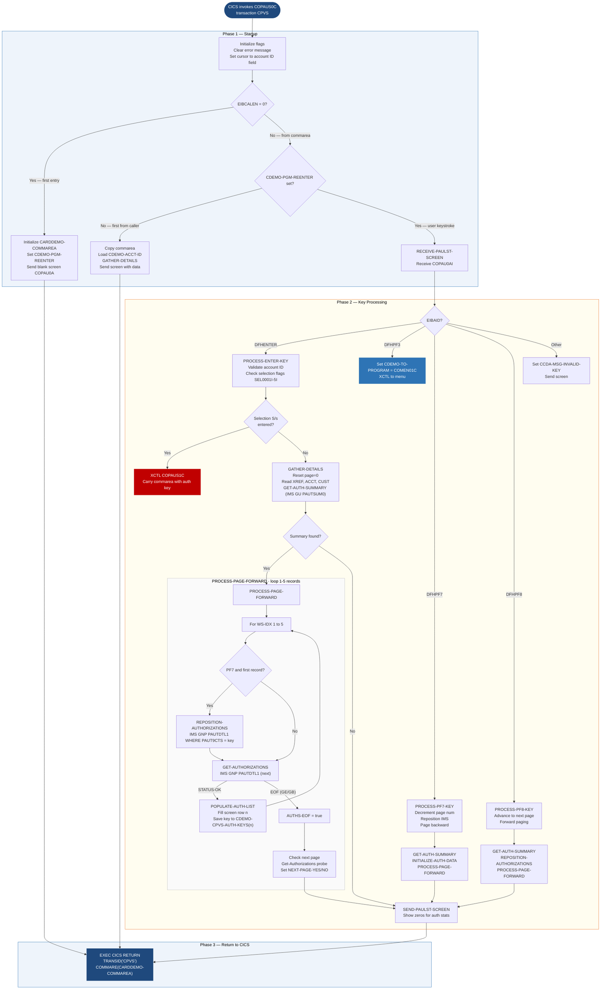

Application : AWS CardDemo
Source File : COPAUS0C.cbl
Type        : Online CICS COBOL
Source Banner: Program : COPAUS0C.CBL / Application : CardDemo - Authorization Module / Function : Summary View of Authoriation Messages

# COPAUS0C — Pending Authorization Summary Screen

This document describes what the program does in plain English. It treats the program as a sequence of screen and data interactions — displaying, receiving, validating, reading, and navigating — and names every file, field, copybook, and external resource along the way so a developer can still find each piece in the source. The reader does not need to know COBOL.

---

## 1. Purpose

COPAUS0C presents a paginated list of pending authorization records for a given account. The operator enters an 11-digit account ID, and the program retrieves and displays up to 5 pending authorization detail records per page, along with account and customer header information. The operator can:

- Press Enter to look up an account or select one of the 5 displayed authorization records for drill-down.
- Press PF7 to page backward.
- Press PF8 to page forward.
- Press PF3 to return to the main menu (`COMEN01C`).
- Press Enter with a selection flag of `'S'` to transfer to the authorization detail program `COPAUS1C`.

The program reads three VSAM files (card cross-reference, account master, customer master) and one IMS database (pending authorization summary and detail segments). It never writes to any VSAM file; IMS is read-only in this program.

The BMS map used is `COPAU0A` from mapset `COPAU00` (copybook `COPAU00`).

---

## 2. Program Flow

### 2.1 Startup

**Step 1 — Initialize flags** *(paragraph `MAIN-PARA`, line 178).* Error flag, EOF flag, next-page flag, and erase flag are all reset to their inactive values. The error message area on the output map and `WS-MESSAGE` are cleared to spaces.

**Step 2 — Check EIBCALEN** *(line 190).*

- **First entry (EIBCALEN = 0):** The shared COMMAREA `CARDDEMO-COMMAREA` is initialized. The current program name `COPAUS0C` is stored in `CDEMO-TO-PROGRAM`. The program-reenter context flag is set to `CDEMO-PGM-REENTER`. The output map `COPAU0AO` is filled with low-values. The cursor is positioned at the account ID field. `SEND-PAULST-SCREEN` is called to display the blank screen.

- **Subsequent entry from COMMAREA:** The commarea is moved from `DFHCOMMAREA`. If `CDEMO-PGM-REENTER` is not yet set (first time arriving from another program), the program reads the account ID from the commarea (`CDEMO-ACCT-ID`), gathers account/auth data, and sends the populated screen. Otherwise (re-entering from a user keystroke), the program receives the screen and processes the key.

### 2.2 Main Processing

**Key handling after `RECEIVE-PAULST-SCREEN`:**

**Enter key — `PROCESS-ENTER-KEY`** *(line 261):*

1. If the account ID field (`ACCTIDI` from `COPAU0AI`) is blank, the error message `'Please enter Acct Id...'` is set and the screen is re-sent.
2. If the field is not numeric, the error message `'Acct Id must be Numeric ...'` is set and the screen is re-sent.
3. If valid: the account ID is stored in `WS-ACCT-ID` and `CDEMO-ACCT-ID`. The selection fields `SEL0001I` through `SEL0005I` are checked in sequence; the first non-blank/non-low-values entry is taken as the selection flag, with its corresponding key saved from `CDEMO-CPVS-AUTH-KEYS(n)` into `CDEMO-CPVS-PAU-SELECTED`.
4. If a selection flag of `'S'` or `'s'` is entered, the program transfers to `COPAUS1C` via `EXEC CICS XCTL` carrying the commarea. Any other non-blank selection flag produces the message `'Invalid selection. Valid value is S'`.
5. After selection processing, `GATHER-DETAILS` is called.

**PF3 key:** Sets `CDEMO-TO-PROGRAM` to `COMEN01C` and calls `RETURN-TO-PREV-SCREEN`, which does an `EXEC CICS XCTL` to the menu program.

**PF7 key — `PROCESS-PF7-KEY`** *(line 362):*
- If the current page number (`CDEMO-CPVS-PAGE-NUM`) is greater than 1, the page number is decremented by 1. The key saved for the previous page (`CDEMO-CPVS-PAUKEY-PREV-PG` at the new page number) is put into `WS-AUTH-KEY-SAVE`. `GET-AUTH-SUMMARY` is called to re-schedule the PSB and re-read the IMS summary. The auth data display is re-initialized and `PROCESS-PAGE-FORWARD` is called.
- If already on page 1: the message `'You are already at the top of the page...'` is set and the screen is re-sent without erasing.

**PF8 key — `PROCESS-PF8-KEY`** *(line 388):*
- If `CDEMO-CPVS-PAUKEY-LAST` is blank/low-values, the position key is set to low-values.
- Otherwise, the last key displayed is placed in `WS-AUTH-KEY-SAVE`. `GET-AUTH-SUMMARY` is called, then `REPOSITION-AUTHORIZATIONS` is called to position IMS to that key. If the next page flag is still true, `PROCESS-PAGE-FORWARD` fills the next page; otherwise the message `'You are already at the bottom of the page...'` is set.

**Other keys:** The error message `CCDA-MSG-INVALID-KEY` (`'Invalid key pressed. Please see below...'`) is set and the screen is re-sent.

**`GATHER-DETAILS` *(line 342):***
Resets the page number to 0. If the account ID is not low-values: reads card cross-reference, account master, and customer data (`GATHER-ACCOUNT-DETAILS`), initializes the 5-slot auth display to spaces (`INITIALIZE-AUTH-DATA`), retrieves the IMS auth summary (`GET-AUTH-SUMMARY`), and if the summary was found, calls `PROCESS-PAGE-FORWARD` to load and display the first page of auth records.

**`GATHER-ACCOUNT-DETAILS` *(line 750):***
Reads card cross-reference via CICS dataset `CXACAIX` (alternate index path by account ID) into `CARD-XREF-RECORD`. On `NOTFND`: a message is built (`'Account: ... not found in XREF file. Resp:... Reas:...'`) and the screen is re-sent. On other errors: `WS-ERR-FLG` is set and a message built. Then reads account data from `ACCTDAT` via `WS-CARD-RID-ACCT-ID-X` into `ACCOUNT-RECORD`. Then reads customer data from `CUSTDAT` via `WS-CARD-RID-CUST-ID-X` into `CUSTOMER-RECORD`. The customer name is built into the `CNAMEO` map field by concatenating first name, initial of middle name, and last name. Address lines are built into `ADDR001O` and `ADDR002O`. Phone, credit limit, and cash limit are placed in their map output fields. The IMS auth summary is then read by calling `GET-AUTH-SUMMARY`. If found, approved/declined counts and amounts plus balances are placed on the screen; if not found, all are set to zero.

**`GET-AUTH-SUMMARY` *(line 966):***
Calls `SCHEDULE-PSB` to schedule IMS PSB `PSBPAUTB`. Then issues an IMS `GU` for segment `PAUTSUM0` where `ACCNTID` equals `CDEMO-ACCT-ID` (note: a commented-out alternative uses `XREF-ACCT-ID`). On success, `FOUND-PAUT-SMRY-SEG` is set; on `GE`, `NFOUND-PAUT-SMRY-SEG` is set; on other errors, `WS-ERR-FLG` is set and a system error message is sent.

**`PROCESS-PAGE-FORWARD` *(line 415):***
If no error, loops up to 5 iterations (index `WS-IDX` from 1 to 5): on PF7 first iteration, calls `REPOSITION-AUTHORIZATIONS`; otherwise calls `GET-AUTHORIZATIONS` (IMS `GNP` for `PAUTDTL1`). If a record is returned, `POPULATE-AUTH-LIST` fills the corresponding screen row. The key of the record is saved to `CDEMO-CPVS-PAUKEY-LAST`. At the second record, the page number is incremented and the key is saved to `CDEMO-CPVS-PAUKEY-PREV-PG(page-num)`. After the 5-slot loop, a further `GET-AUTHORIZATIONS` is attempted to determine if more pages exist; if it succeeds, `NEXT-PAGE-YES` is set; if EOF, `NEXT-PAGE-NO` is set.

**`POPULATE-AUTH-LIST` *(line 522):***
For each of the 5 screen rows, populates: transaction ID, date (reformatted as `MM/DD/YY`), time (reformatted as `HH:MM:SS`), auth type, approval status (`'A'` if response code is `'00'`, else `'D'`), match status, and approved amount. The selection column attribute is set to `DFHBMUNP` (unprotected) to allow user input.

**`SEND-PAULST-SCREEN` *(line 681):***
Before sending, if the IMS PSB is still scheduled, a CICS SYNCPOINT is issued and `IMS-PSB-NOT-SCHD` is set. The header info is populated (application titles, transaction ID `CPVS`, program name, current date/time). The error message is placed in `ERRMSGO`. If `SEND-ERASE-YES`, the map is sent with ERASE; otherwise without.

### 2.3 Shutdown / Return

**Step — CICS RETURN** *(line 254–257).*
`EXEC CICS RETURN TRANSID('CPVS') COMMAREA(CARDDEMO-COMMAREA)` is issued at the end of every path through `MAIN-PARA`. The commarea carries the page navigation state (`CDEMO-CPVS-INFO`) and the current account/user context for the next invocation.

---

## 3. Error Handling

This program does not use a central error log like `COPAUA0C`. All errors result in a user-visible message placed in `WS-MESSAGE` and sent to the screen via `SEND-PAULST-SCREEN`.

### 3.1 CICS File Error — `GETCARDXREF-BYACCT` (line 812)

- `NOTFND`: message `'Account: <acctid> not found in XREF file. Resp:<resp> Reas:<reas>'` is built and the screen is re-sent. No error flag is set.
- Other: `WS-ERR-FLG` is set to `'Y'`. Message: `'Account: <acctid> System error while reading XREF file. Resp:<resp> Reas:<reas>'`.

### 3.2 CICS File Error — `GETACCTDATA-BYACCT` (line 865)

- `NOTFND`: message `'Account: <acctid> not found in ACCT file. Resp:<resp> Reas:<reas>'`, screen re-sent.
- Other: `WS-ERR-FLG` = `'Y'`, message `'Account: <acctid> System error while reading ACCT file. Resp:<resp> Reas:<reas>'`.

### 3.3 CICS File Error — `GETCUSTDATA-BYCUST` (line 915)

- `NOTFND`: message `'Customer: <custid> not found in CUST file. Resp:<resp> Reas:<reas>'`.
- Other: `WS-ERR-FLG` = `'Y'`, message `'Customer: <custid> System error while reading CUST file. Resp:<resp> Reas:<reas>'`.

### 3.4 IMS Error — `GET-AUTH-SUMMARY` (line 966)

- `SEGMENT-NOT-FOUND`: silent — `NFOUND-PAUT-SMRY-SEG` is set; screen shows zeros for all authorization statistics.
- Other: `WS-ERR-FLG` = `'Y'`, message `' System error while reading AUTH Summary: Code:<code>'`.

### 3.5 IMS Error — `GET-AUTHORIZATIONS` (line 459)

- `GE` / `GB`: `AUTHS-EOF` is set — normal end of detail records.
- Other: `WS-ERR-FLG` = `'Y'`, message `' System error while reading AUTH Details: Code:<code>'`. Screen is re-sent from within the error branch.

### 3.6 IMS Error — `REPOSITION-AUTHORIZATIONS` (line 488)

- `GE` / `GB`: `AUTHS-EOF` is set.
- Other: `WS-ERR-FLG` = `'Y'`, message `' System error while repos. AUTH Details: Code:<code>'`.

### 3.7 IMS Schedule Error — `SCHEDULE-PSB` (line 1001)

- Status not `STATUS-OK`: `WS-ERR-FLG` = `'Y'`, message `' System error while scheduling PSB: Code:<code>'`, screen re-sent.

---

## 4. Migration Notes

1. **`CXACAIX` vs `CCXREF`** *(line 41–42 vs. line 819)*. The summary screen uses the alternate-index path `CXACAIX` (keyed by account ID) to look up cards, whereas the authorization engine `COPAUA0C` uses the primary-key path `CCXREF` (keyed by card number). These are two different access paths to the same underlying data; migration must map both.

2. **The commented-out XREF-ACCT-ID reference in `GET-AUTH-SUMMARY`** *(line 972)*. The source has a commented-out line `*    MOVE XREF-ACCT-ID TO PA-ACCT-ID` directly above the active `MOVE CDEMO-ACCT-ID TO PA-ACCT-ID`. The program uses the COMMAREA account ID rather than the XREF-derived one. This means if the COMMAREA account ID has not been set correctly by the caller, the IMS lookup will use whatever was in `CDEMO-ACCT-ID` from the previous session.

3. **IMS PSB is re-scheduled on every `GET-AUTH-SUMMARY` call** *(line 1001–1030)*. The `SCHEDULE-PSB` paragraph is called from `GET-AUTH-SUMMARY`, which is called from `GATHER-DETAILS`, `PROCESS-PF7-KEY`, and `PROCESS-PF8-KEY`. Each call re-schedules the PSB (handling the `'TC'` double-schedule by issuing TERM/re-SCHD). This adds IMS scheduling overhead on every key press that requires data access.

4. **`CDEMO-CPVS-PAUKEY-PREV-PG` only saves up to 20 page keys** *(line 120)*. The table has `OCCURS 20 TIMES`, so backward navigation can only go back 20 pages. A very active account with hundreds of authorizations will silently lose backward navigation past page 20.

5. **`CDEMO-CPVS-AUTH-KEYS` holds only 5 keys** *(line 126)*. Keys for the 5 displayed records are saved in the commarea for use by `COPAUS1C`. If a user somehow enters more than 5 records on a page (impossible in current code), keys 6+ would be lost.

6. **Authorization amount display uses `WS-AUTH-AMT` (`-zzzzzzz9.99`)** *(line 55)*. For declined authorizations, `PA-APPROVED-AMT` is zero (set by `COPAUA0C`), so the amount displayed is always zero for declines. There is no display of the original requested amount for declined transactions.

7. **`CVACT02Y` (card record layout) is copied** *(line 147)* but the `CARD-RECORD` fields are never referenced by this program. The copybook occupies memory but contributes nothing to any data path.

8. **`ACCT-ADDR-ZIP`, `ACCT-REISSUE-DATE`, `ACCT-OPEN-DATE`, `ACCT-EXPIRAION-DATE` (typo)** from `CVACT01Y` are all read into memory but never displayed or used by this program.

9. **`CUST-SSN`, `CUST-GOVT-ISSUED-ID`, `CUST-DOB-YYYY-MM-DD`, `CUST-FICO-CREDIT-SCORE`, `CUST-EFT-ACCOUNT-ID`** from `CVCUS01Y` are all read into memory. The `CUSTOMER-RECORD` is 500 bytes; only name, address, and one phone number are actually displayed on screen. PII fields (SSN, DOB, government ID) are in memory but not protected by any explicit masking in this program.

10. **"Authoriation" is a typo in the source banner** *(line 5)*. The function description reads "Summary View of Authoriation Messages" — the word "Authorization" is misspelled.

---

## Appendix A — Files

| Logical Name | DDname | Organization | Recording | Key Field | Direction | Contents |
|---|---|---|---|---|---|---|
| `CXACAIX` (CICS dataset) | `CXACAIX ` | VSAM KSDS alternate index by account ID | Fixed | `WS-CARD-RID-ACCT-ID-X` PIC X(11) | Input — read-only | Card cross-reference accessed via account-ID alternate index |
| `ACCTDAT` (CICS dataset) | `ACCTDAT ` | VSAM KSDS | Fixed | `WS-CARD-RID-ACCT-ID-X` PIC X(11) | Input — read-only | Account master, 300-byte records, layout from `CVACT01Y` |
| `CUSTDAT` (CICS dataset) | `CUSTDAT ` | VSAM KSDS | Fixed | `WS-CARD-RID-CUST-ID-X` PIC X(9) | Input — read-only | Customer master, 500-byte records, layout from `CVCUS01Y` |
| IMS via PSB `PSBPAUTB` | N/A | IMS hierarchical | N/A | `PA-ACCT-ID` S9(11) COMP-3 | Input — read-only | Pending authorization summary (`PAUTSUM0`) and detail (`PAUTDTL1`) |

---

## Appendix B — Copybooks and External Programs

### Copybook `COCOM01Y` (WORKING-STORAGE SECTION, line 116)

Defines `CARDDEMO-COMMAREA`. Used to pass context between CICS programs.

| Field | PIC | Bytes | Notes |
|---|---|---|---|
| `CDEMO-FROM-TRANID` | `X(04)` | 4 | Transaction ID of the calling program |
| `CDEMO-FROM-PROGRAM` | `X(08)` | 8 | Name of the calling program |
| `CDEMO-TO-TRANID` | `X(04)` | 4 | Target transaction ID — **not set by this program** |
| `CDEMO-TO-PROGRAM` | `X(08)` | 8 | Name of the target program for XCTL |
| `CDEMO-USER-ID` | `X(08)` | 8 | Signed-on user ID |
| `CDEMO-USER-TYPE` | `X(01)` | 1 | `'A'` = admin (`CDEMO-USRTYP-ADMIN`); `'U'` = regular user (`CDEMO-USRTYP-USER`) |
| `CDEMO-PGM-CONTEXT` | `9(01)` | 1 | `0` = first entry (`CDEMO-PGM-ENTER`); `1` = re-entry (`CDEMO-PGM-REENTER`) |
| `CDEMO-CUST-ID` | `9(09)` | 9 | Customer ID; set from `XREF-CUST-ID` on XREF read |
| `CDEMO-CUST-FNAME` | `X(25)` | 25 | Customer first name — **not set by this program** |
| `CDEMO-CUST-MNAME` | `X(25)` | 25 | Customer middle name — **not set by this program** |
| `CDEMO-CUST-LNAME` | `X(25)` | 25 | Customer last name — **not set by this program** |
| `CDEMO-ACCT-ID` | `9(11)` | 11 | Account ID used for all IMS and file lookups |
| `CDEMO-ACCT-STATUS` | `X(01)` | 1 | Account status — **not set by this program** |
| `CDEMO-CARD-NUM` | `9(16)` | 16 | Card number; set from `XREF-CARD-NUM` on XREF read |
| `CDEMO-LAST-MAP` | `X(7)` | 7 | Last map name — **not set by this program** |
| `CDEMO-LAST-MAPSET` | `X(7)` | 7 | Last mapset name — **not set by this program** |

**Program-specific extension in COMMAREA** *(lines 117–126, defined inline after the COPY):*

| Field | PIC | Notes |
|---|---|---|
| `CDEMO-CPVS-PAU-SEL-FLG` | `X(01)` | Selection flag entered by user (`'S'` = select for detail) |
| `CDEMO-CPVS-PAU-SELECTED` | `X(08)` | Authorization key of the selected record |
| `CDEMO-CPVS-PAUKEY-PREV-PG` | `X(08) OCCURS 20` | Stack of first-record keys for backward page navigation |
| `CDEMO-CPVS-PAUKEY-LAST` | `X(08)` | Key of the last authorization record on the current page |
| `CDEMO-CPVS-PAGE-NUM` | `S9(04) COMP` | Current page number |
| `CDEMO-CPVS-NEXT-PAGE-FLG` | `X(01)` | `'Y'` = more pages exist (`NEXT-PAGE-YES`); `'N'` = last page (`NEXT-PAGE-NO`) |
| `CDEMO-CPVS-AUTH-KEYS` | `X(08) OCCURS 5` | Keys of the 5 currently displayed authorization records (passed to `COPAUS1C`) |

### Copybook `COPAU00` (WORKING-STORAGE SECTION, line 129)

Defines the BMS map structures `COPAU0AI` (input) and `COPAU0AO` (output) for the authorization summary screen. Key fields:

| Map field | Direction | Notes |
|---|---|---|
| `ACCTIDI` / `ACCTIDO` / `ACCTIDL` | I/O/Length | Account ID entry and display; cursor positioned here on errors |
| `ERRMSGO` / `ERRMSGC` | Output | Error message text and color attribute |
| `CUSTIDO` | Output | Customer ID |
| `CNAMEO` | Output | Full customer name |
| `ADDR001O`, `ADDR002O` | Output | Address lines |
| `PHONE1O` | Output | Primary phone number |
| `CREDLIMO`, `CASHLIMO` | Output | Credit and cash limits (formatted as `-zzzzzzz9.99`) |
| `APPRCNTO`, `DECLCNTO` | Output | Approved and declined authorization counts |
| `CREDBALO`, `CASHBALO` | Output | Credit and cash balances |
| `APPRAMTO`, `DECLAMTO` | Output | Approved and declined amounts |
| `SEL0001I` through `SEL0005I` | Input | Selection input fields (1 character each) |
| `SEL0001A` through `SEL0005A` | Attribute | Row selection field attributes (set to `DFHBMPRO` to protect, `DFHBMUNP` to unprotect) |
| `TRNID01I`–`TRNID05I` | Input | Transaction IDs for each of 5 rows |
| `PDATE01I`–`PDATE05I` | Input | Auth dates |
| `PTIME01I`–`PTIME05I` | Input | Auth times |
| `PTYPE01I`–`PTYPE05I` | Input | Auth types |
| `PAPRV01I`–`PAPRV05I` | Input | Approval status (`A` or `D`) |
| `PSTAT01I`–`PSTAT05I` | Input | Match status |
| `PAMT001I`–`PAMT005I` | Input | Approved amounts |
| `TITLE01O`, `TITLE02O` | Output | Screen title lines from `COTTL01Y` |
| `TRNNAMEO`, `PGMNAMEO` | Output | Transaction ID `CPVS` and program name |
| `CURDATEO`, `CURTIMEO` | Output | Current date and time |

### Copybook `COTTL01Y` (WORKING-STORAGE SECTION, line 132)

Defines `CCDA-SCREEN-TITLE` with two 40-character title strings (`CCDA-TITLE01` = `'      AWS Mainframe Modernization       '` and `CCDA-TITLE02` = `'              CardDemo                  '`) and a thank-you message. `CCDA-THANK-YOU` is present but not used by this program.

### Copybook `CSDAT01Y` (WORKING-STORAGE SECTION, line 135)

Defines `WS-DATE-TIME` — date/time working fields populated by `FUNCTION CURRENT-DATE`. Used in `POPULATE-HEADER-INFO` to fill `CURDATEO` and `CURTIMEO`.

| Field group | Notes |
|---|---|
| `WS-CURDATE-YEAR` / `WS-CURDATE-MONTH` / `WS-CURDATE-DAY` | Components of current date |
| `WS-CURDATE-N` | 8-digit date redefinition (used in CORPT00C monthly date arithmetic) |
| `WS-CURTIME-HOURS` / `WS-CURTIME-MINUTE` / `WS-CURTIME-SECOND` | Components of current time |
| `WS-CURDATE-MM-DD-YY` | Formatted date `MM/DD/YY` for `CURDATEO` |
| `WS-CURTIME-HH-MM-SS` | Formatted time `HH:MM:SS` for `CURTIMEO` |
| `WS-TIMESTAMP` | Full timestamp — **not used by this program** |

### Copybook `CSMSG01Y` (WORKING-STORAGE SECTION, line 138)

Defines `CCDA-COMMON-MESSAGES`: `CCDA-MSG-THANK-YOU` (50 bytes) and `CCDA-MSG-INVALID-KEY` (50 bytes, `'Invalid key pressed. Please see below...'`). Only `CCDA-MSG-INVALID-KEY` is used by this program.

### Copybook `CSMSG02Y` (WORKING-STORAGE SECTION, line 141)

Defines `ABEND-DATA` with fields `ABEND-CODE` X(4), `ABEND-CULPRIT` X(8), `ABEND-REASON` X(50), `ABEND-MSG` X(72). **None of these fields are referenced by this program** — the copybook is included but entirely unused.

### Copybook `CVACT01Y` (WORKING-STORAGE SECTION, line 144)

See `COPAUA0C` Appendix B for full field table. In this program, only `ACCT-CREDIT-LIMIT` and `ACCT-CASH-CREDIT-LIMIT` are displayed on screen; `ACCT-ID`, `ACCT-ACTIVE-STATUS`, `ACCT-CURR-BAL`, `ACCT-OPEN-DATE`, `ACCT-EXPIRAION-DATE` (typo), `ACCT-REISSUE-DATE`, `ACCT-CURR-CYC-CREDIT`, `ACCT-CURR-CYC-DEBIT`, `ACCT-ADDR-ZIP`, `ACCT-GROUP-ID`, and `FILLER` are all **read but not displayed or used further**.

### Copybook `CVACT02Y` (WORKING-STORAGE SECTION, line 147)

Defines `CARD-RECORD` (150 bytes): `CARD-NUM` X(16), `CARD-ACCT-ID` 9(11), `CARD-CVV-CD` 9(03), `CARD-EMBOSSED-NAME` X(50), `CARD-EXPIRAION-DATE` X(10) (typo), `CARD-ACTIVE-STATUS` X(01), `FILLER` X(59). **No field from `CARD-RECORD` is ever referenced by this program.** The copybook is included but entirely unused.

### Copybook `CVACT03Y` (WORKING-STORAGE SECTION, line 150)

See `COPAUA0C` Appendix B. `XREF-CUST-ID` and `XREF-CARD-NUM` are used (saved to commarea). `XREF-ACCT-ID` is used as the RIDFLD for account lookup. `FILLER` X(14) is unused.

### Copybook `CVCUS01Y` (WORKING-STORAGE SECTION, line 153)

See `COPAUA0C` Appendix B. Fields used for display: `CUST-ID`, `CUST-FIRST-NAME`, `CUST-MIDDLE-NAME` (initial only), `CUST-LAST-NAME`, `CUST-ADDR-LINE-1`, `CUST-ADDR-LINE-2`, `CUST-ADDR-LINE-3`, `CUST-ADDR-STATE-CD`, `CUST-ADDR-ZIP` (first 5 chars), `CUST-PHONE-NUM-1`. Fields never used: `CUST-ADDR-COUNTRY-CD`, `CUST-PHONE-NUM-2`, `CUST-SSN`, `CUST-GOVT-ISSUED-ID`, `CUST-DOB-YYYY-MM-DD`, `CUST-EFT-ACCOUNT-ID`, `CUST-PRI-CARD-HOLDER-IND`, `CUST-FICO-CREDIT-SCORE`, `FILLER`.

### Copybook `CIPAUSMY` and `CIPAUDTY`

See `COPAUA0C` Appendix B for full field tables.

In this program, from `CIPAUSMY`: `PA-ACCT-ID` is used for IMS key, `PA-CREDIT-LIMIT`/`PA-CASH-LIMIT`/`PA-CREDIT-BALANCE`/`PA-CASH-BALANCE`/`PA-APPROVED-AUTH-CNT`/`PA-DECLINED-AUTH-CNT`/`PA-APPROVED-AUTH-AMT`/`PA-DECLINED-AUTH-AMT` are displayed. `PA-AUTH-STATUS` and `PA-ACCOUNT-STATUS(5)` are **never read or used**.

From `CIPAUDTY`: `PA-AUTHORIZATION-KEY` (for pagination), `PA-AUTH-ORIG-DATE`, `PA-AUTH-ORIG-TIME`, `PA-TRANSACTION-ID`, `PA-AUTH-TYPE`, `PA-AUTH-RESP-CODE`, `PA-MATCH-STATUS`, `PA-APPROVED-AMT` are displayed. `PA-AUTH-DATE-9C`, `PA-AUTH-TIME-9C`, `PA-CARD-NUM`, `PA-CARD-EXPIRY-DATE`, `PA-MESSAGE-TYPE`, `PA-MESSAGE-SOURCE`, `PA-AUTH-ID-CODE`, `PA-AUTH-RESP-REASON`, `PA-PROCESSING-CODE`, `PA-TRANSACTION-AMT`, `PA-MERCHANT-CATAGORY-CODE`, `PA-ACQR-COUNTRY-CODE`, `PA-POS-ENTRY-MODE`, `PA-MERCHANT-ID`, `PA-MERCHANT-NAME`, `PA-MERCHANT-CITY`, `PA-MERCHANT-STATE`, `PA-MERCHANT-ZIP`, `PA-AUTH-FRAUD`, `PA-FRAUD-RPT-DATE`, `FILLER` are **read into memory but not displayed on this summary screen**.

### External Programs Called

#### `COPAUS1C` — Authorization Detail View
| Item | Detail |
|---|---|
| Called via | `EXEC CICS XCTL PROGRAM(CDEMO-TO-PROGRAM) COMMAREA(CARDDEMO-COMMAREA)` in `PROCESS-ENTER-KEY`, line 322 |
| Input set in commarea | `CDEMO-TO-PROGRAM` = `'COPAUS1C'`; `CDEMO-FROM-TRANID` = `'CPVS'`; `CDEMO-FROM-PROGRAM` = `'COPAUS0C'`; `CDEMO-PGM-CONTEXT` = 0; `CDEMO-CPVS-PAU-SEL-FLG` = selection flag; `CDEMO-CPVS-PAU-SELECTED` = selected auth key; `CDEMO-CPVS-AUTH-KEYS(1-5)` = all displayed keys |
| Output expected | None — XCTL transfers control; COPAUS0C does not resume |

#### `COMEN01C` — Main Menu
| Item | Detail |
|---|---|
| Called via | `EXEC CICS XCTL` in `RETURN-TO-PREV-SCREEN` when PF3 is pressed |
| Input | `CARDDEMO-COMMAREA` |

---

## Appendix C — Hardcoded Literals

| Paragraph | Line | Value | Usage | Classification |
|---|---|---|---|---|
| `WS-VARIABLES` | 33 | `'COPAUS0C'` | Program name | System constant |
| `WS-VARIABLES` | 34 | `'COPAUS1C'` | Target detail program | System constant |
| `WS-VARIABLES` | 35 | `'COMEN01C'` | Menu program | System constant |
| `WS-VARIABLES` | 36 | `'CPVS'` | CICS transaction ID | System constant |
| `WS-VARIABLES` | 38 | `'ACCTDAT '` | Dataset name | System constant |
| `WS-VARIABLES` | 39 | `'CUSTDAT '` | Dataset name | System constant |
| `WS-VARIABLES` | 40 | `'CARDDAT '` | Dataset name — **declared but never used** | System constant (unused) |
| `WS-VARIABLES` | 41 | `'CXACAIX '` | Alternate index dataset | System constant |
| `WS-VARIABLES` | 42 | `'CCXREF  '` | Card XREF dataset — **declared but never used in this program's CICS READ calls** | System constant (unused) |
| `WS-VARIABLES` | 59 | `'00/00/00'` | Default auth date display | Display default |
| `WS-VARIABLES` | 60 | `'00:00:00'` | Default auth time display | Display default |
| `PROCESS-ENTER-KEY` | 269 | `'Please enter Acct Id...'` | Validation message | Display message |
| `PROCESS-ENTER-KEY` | 278 | `'Acct Id must be Numeric ...'` | Validation message | Display message |
| `PROCESS-ENTER-KEY` | 327 | `'Invalid selection. Valid value is S'` | Validation message | Display message |
| `PROCESS-PF7-KEY` | 381 | `'You are already at the top of the page...'` | Navigation boundary message | Display message |
| `PROCESS-PF8-KEY` | 409 | `'You are already at the bottom of the page...'` | Navigation boundary message | Display message |
| `POPULATE-AUTH-LIST` | 537 | `'A'` | Approved auth status display | Business rule |
| `POPULATE-AUTH-LIST` | 539 | `'D'` | Declined auth status display | Business rule |
| `RETURN-TO-PREV-SCREEN` | 669 | `'COSGN00C'` | Default fallback program when `CDEMO-TO-PROGRAM` is empty | System constant |
| `WS-IMS-VARIABLES` | 75 | `'PSBPAUTB'` | IMS PSB name | System constant |

---

## Appendix D — Internal Working Fields

| Field | PIC | Bytes | Purpose |
|---|---|---|---|
| `WS-PGM-AUTH-SMRY` | `X(08)` | 8 | This program's name `'COPAUS0C'` for header display and commarea |
| `WS-PGM-AUTH-DTL` | `X(08)` | 8 | Detail program name `'COPAUS1C'` for XCTL |
| `WS-PGM-MENU` | `X(08)` | 8 | Menu program name `'COMEN01C'` for PF3 return |
| `WS-CICS-TRANID` | `X(04)` | 4 | Transaction ID `'CPVS'` for CICS RETURN |
| `WS-MESSAGE` | `X(80)` | 80 | Current error/status message for `ERRMSGO` |
| `WS-ACCT-ID` | `X(11)` | 11 | Account ID entered by user |
| `WS-AUTH-KEY-SAVE` | `X(08)` | 8 | Saved IMS key for page repositioning (PF7/PF8) |
| `WS-AUTH-APRV-STAT` | `X(01)` | 1 | `'A'` or `'D'` for display per row |
| `WS-RESP-CD` / `WS-REAS-CD` | `S9(09) COMP` / `S9(09) COMP` | 4+4 | CICS RESP and RESP2 from file reads |
| `WS-RESP-CD-DIS` / `WS-REAS-CD-DIS` | `9(09)` / `9(09)` | 9+9 | Display-numeric conversions for error messages |
| `WS-REC-COUNT` | `S9(04) COMP` | 2 | Record counter — **declared but never used** |
| `WS-IDX` | `S9(04) COMP` | 2 | Loop index for 5-slot auth list |
| `WS-PAGE-NUM` | `S9(04) COMP` | 2 | Local page counter — **never used; paging uses `CDEMO-CPVS-PAGE-NUM` in commarea** |
| `WS-AUTH-AMT` | `-zzzzzzz9.99` | 12 | Formatted auth amount for display |
| `WS-DISPLAY-AMT12` | `-zzzzzzz9.99` | 12 | Formatted amount for credit/balance display |
| `WS-DISPLAY-AMT9` | `-zzzz9.99` | 8 | Formatted amount for cash limit display |
| `WS-DISPLAY-COUNT` | `9(03)` | 3 | Formatted count for approved/declined display |
| `WS-AUTH-DATE` | `X(08)` | 8 | Auth date reformatted as `MM/DD/YY` |
| `WS-AUTH-TIME` | `X(08)` | 8 | Auth time reformatted as `HH:MM:SS` |
| `WS-XREF-RID` | group | 36 | RIDFLD area for CICS READ by card or account |

---

## Appendix E — Execution at a Glance

---

*Source: `COPAUS0C.cbl`, CardDemo, Apache 2.0 license. Copybooks: `COCOM01Y.cpy`, `COPAU00.cpy`, `COTTL01Y.cpy`, `CSDAT01Y.cpy`, `CSMSG01Y.cpy`, `CSMSG02Y.cpy`, `CVACT01Y.cpy`, `CVACT02Y.cpy`, `CVACT03Y.cpy`, `CVCUS01Y.cpy`, `CIPAUSMY.cpy`, `CIPAUDTY.cpy`, `DFHAID`, `DFHBMSCA`. All field names, paragraph names, PIC clauses, and literal values are taken directly from the source files.*
