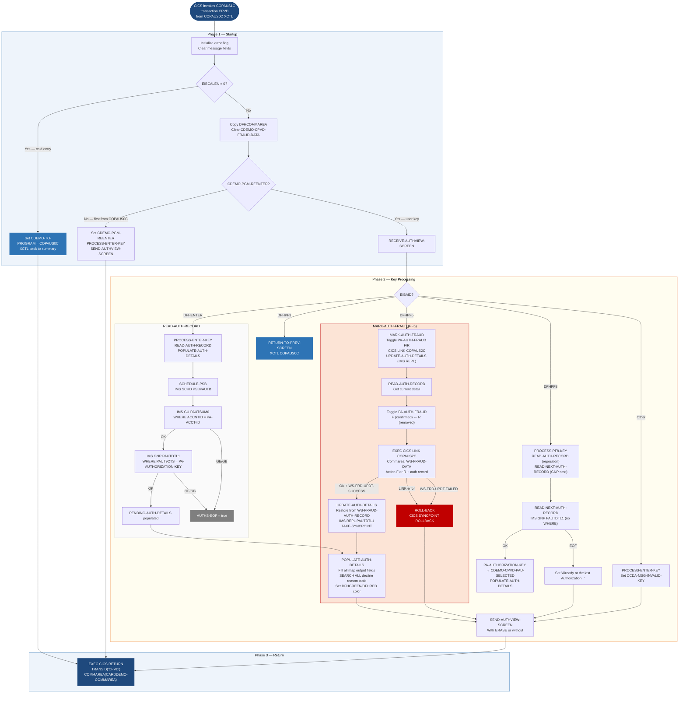

Application : AWS CardDemo
Source File : COPAUS1C.cbl
Type        : Online CICS COBOL
Source Banner: Program : COPAUS1C.CBL / Application : CardDemo - Authorization Module / Function : Detail View of Authorization Message

# COPAUS1C — Pending Authorization Detail Screen

This document describes what the program does in plain English. It treats the program as a sequence of screen and data interactions and names every file, field, copybook, and external resource so a developer can find each piece in the source without reading COBOL.

---

## 1. Purpose

COPAUS1C displays the full details of a single pending authorization record. It is reached from the summary screen `COPAUS0C` when the operator selects one of the five displayed authorization rows. The detail screen shows all fields of the authorization: card number, date, time, approved amount, response code, reason code (decoded to a description), processing code, POS entry mode, message source, merchant category code, card expiry, auth type, transaction ID, match status, fraud flag, and all merchant fields.

The operator can:
- Press Enter to refresh or re-display the current record.
- Press PF3 to return to the summary screen `COPAUS0C`.
- Press PF5 to toggle the fraud flag on the current authorization record (mark as fraud or remove fraud marking). This calls the fraud recording sub-program `COPAUS2C` via `EXEC CICS LINK`.
- Press PF8 to advance to the next authorization record for the same account.
- Press any other key to re-display with the message `CCDA-MSG-INVALID-KEY`.

The program reads and conditionally updates the IMS database (`PSBPAUTB`, segment `PAUTDTL1`). All VSAM file access from this program is indirect (via data already in the commarea from the summary screen). No VSAM reads are performed by this program.

The BMS map used is `COPAU1A` from mapset `COPAU01` (copybook `COPAU01`).

---

## 2. Program Flow

### 2.1 Startup

**Step 1 — Initialize flags** *(paragraph `MAIN-PARA`, line 157).* Error flag is set off, erase flag is set to yes. Error message fields are cleared.

**Step 2 — Check EIBCALEN** *(line 165).*

- **First entry (EIBCALEN = 0):** The COMMAREA is initialized and `CDEMO-TO-PROGRAM` is set to `COPAUS0C`. The program immediately transfers back to `COPAUS0C` via `RETURN-TO-PREV-SCREEN` using `EXEC CICS XCTL`. This means COPAUS1C cannot be entered cold — it requires a commarea from the summary screen.

- **Subsequent entry from COMMAREA:** The commarea is copied. `CDEMO-CPVD-FRAUD-DATA` is cleared to spaces. If `CDEMO-PGM-REENTER` is not set (first time from COPAUS0C), the reenter flag is set and `PROCESS-ENTER-KEY` is called immediately followed by `SEND-AUTHVIEW-SCREEN`. If already in re-entry mode (user keystroke), the screen is received first, then keyed.

### 2.2 Main Processing

**Enter key and initial display — `PROCESS-ENTER-KEY`** *(line 208):*

1. The output map `COPAU1AO` is cleared to low-values.
2. If `CDEMO-ACCT-ID` is numeric and `CDEMO-CPVD-PAU-SELECTED` is not blank/low-values (a valid auth key is in the commarea), the account ID is moved to `WS-ACCT-ID` and the selected auth key to `WS-AUTH-KEY`.
3. `READ-AUTH-RECORD` is called to retrieve the IMS summary segment and then the specific detail segment.
4. If IMS PSB is still scheduled after the read, `TAKE-SYNCPOINT` is called to commit and release it.
5. `POPULATE-AUTH-DETAILS` is called to fill the output map.

**PF3 key:** Sets `CDEMO-TO-PROGRAM` = `COPAUS0C` and calls `RETURN-TO-PREV-SCREEN`, which issues `EXEC CICS XCTL` to the summary screen.

**PF5 key — `MARK-AUTH-FRAUD`** *(line 230):*

1. The account ID and auth key are loaded from the commarea.
2. `READ-AUTH-RECORD` is called to get the current IMS detail record.
3. The current fraud status is toggled:
   - If `PA-FRAUD-CONFIRMED` (`'F'`) is true: sets `PA-FRAUD-REMOVED` (`'R'`) and `WS-REMOVE-FRAUD`.
   - Otherwise: sets `PA-FRAUD-CONFIRMED` (`'F'`) and `WS-REPORT-FRAUD`.
4. The full `PENDING-AUTH-DETAILS` segment is saved to `WS-FRAUD-AUTH-RECORD`.
5. The account ID and customer ID are placed in `WS-FRD-ACCT-ID` and `WS-FRD-CUST-ID`.
6. `EXEC CICS LINK PROGRAM(COPAUS2C) COMMAREA(WS-FRAUD-DATA)` is called. The link uses the local `WS-FRAUD-DATA` structure (not the main CARDDEMO-COMMAREA).
7. If the LINK returned `DFHRESP(NORMAL)` and `WS-FRD-UPDT-SUCCESS` is true, `UPDATE-AUTH-DETAILS` is called to write the updated segment back to IMS. Otherwise, `ROLL-BACK` is called (CICS SYNCPOINT ROLLBACK).
8. The auth key is refreshed from `PA-AUTHORIZATION-KEY` and `POPULATE-AUTH-DETAILS` is called.

**PF8 key — `PROCESS-PF8-KEY`** *(line 268):*

1. Account ID and auth key are loaded from the commarea.
2. `READ-AUTH-RECORD` re-positions IMS to the current record.
3. `READ-NEXT-AUTH-RECORD` issues an IMS `GNP` (without a WHERE clause) to read the next detail segment under the same parent.
4. If `AUTHS-EOF` is true: the message `'Already at the last Authorization...'` is set and the screen is re-sent with `SEND-ERASE-NO`.
5. If not EOF: the new auth key from `PA-AUTHORIZATION-KEY` is stored in `CDEMO-CPVD-PAU-SELECTED` and `POPULATE-AUTH-DETAILS` is called.

**`POPULATE-AUTH-DETAILS` *(line 291):***

If no error flag, the following fields are populated on the output map from `PENDING-AUTH-DETAILS`:
- Card number, date (reformatted `MM/DD/YY`), time (reformatted `HH:MM:SS`), approved amount, response code with color attribute (`DFHGREEN` if approved, `DFHRED` if declined).
- The response reason code is looked up in the inline table `WS-DECLINE-REASON-TAB` using `SEARCH ALL` (binary search on `DECL-CODE`). The matching 16-character description (`DECL-DESC`) is appended after a dash. If no match, `'9999-ERROR'` is displayed.
- Processing code, POS entry mode, message source, merchant category code.
- Card expiry date (formatted as `MM/YY` with a slash inserted).
- Auth type, transaction ID, match status.
- Fraud indicator: if `PA-FRAUD-CONFIRMED` or `PA-FRAUD-REMOVED`, the fraud code, a dash, and the fraud report date are shown; otherwise a single dash.
- Merchant name, ID, city, state, ZIP.

**`READ-AUTH-RECORD` *(line 431):***

1. Calls `SCHEDULE-PSB` to schedule IMS PSB `PSBPAUTB`.
2. Issues IMS `GU` for `PAUTSUM0` (summary segment) WHERE `ACCNTID = PA-ACCT-ID`. This positions IMS at the root.
3. If the GU succeeds, issues IMS `GNP` for `PAUTDTL1` WHERE `PAUT9CTS = PA-AUTHORIZATION-KEY`. This retrieves the specific child detail segment.
4. On any IMS error, `WS-ERR-FLG` is set and an error message is sent.

**`UPDATE-AUTH-DETAILS` *(line 520):***

1. Restores `PENDING-AUTH-DETAILS` from `WS-FRAUD-AUTH-RECORD` (the version modified by `MARK-AUTH-FRAUD`).
2. Displays the field `PA-FRAUD-RPT-DATE` to the operator log (a `DISPLAY` statement — diagnostic trace).
3. Issues IMS `REPL` on `PAUTDTL1` to replace the segment.
4. On success, calls `TAKE-SYNCPOINT` and sets the success message (`'AUTH FRAUD REMOVED...'` or `'AUTH MARKED FRAUD...'`).
5. On failure, calls `ROLL-BACK` and sets an error message.

### 2.3 Shutdown / Return

**Step — CICS RETURN** *(line 202–205).*
`EXEC CICS RETURN TRANSID('CPVD') COMMAREA(CARDDEMO-COMMAREA)` is issued at the bottom of `MAIN-PARA`. Every display path leads back here after `SEND-AUTHVIEW-SCREEN`.

---

## 3. Error Handling

### 3.1 IMS Errors — `READ-AUTH-RECORD` and `READ-NEXT-AUTH-RECORD`

For both the GU (summary) and GNP (detail) reads:
- `GE` or `GB`: `AUTHS-EOF` is set to true — treated as normal end of records.
- Other: `WS-ERR-FLG` is set to `'Y'`, an error message is built (`' System error while reading Auth Summary: Code: <code>'` or `' System error while reading Auth Details: Code: <code>'` or `' System error while reading next Auth: Code: <code>'`), and `SEND-AUTHVIEW-SCREEN` is called.

### 3.2 IMS Error — `UPDATE-AUTH-DETAILS`

On IMS REPL failure:
- `ROLL-BACK` is called (CICS SYNCPOINT ROLLBACK).
- `WS-ERR-FLG` is set.
- Message: `' System error while FRAUD Tagging, ROLLBACK|| <code>'`.
- `SEND-AUTHVIEW-SCREEN` is called.

### 3.3 IMS Error — `SCHEDULE-PSB`

On failure: `WS-ERR-FLG` = `'Y'`, message `' System error while scheduling PSB: Code: <code>'`, screen sent.

### 3.4 LINK to `COPAUS2C` failure

If `EIBRESP` is not `DFHRESP(NORMAL)` after the LINK call: `ROLL-BACK` is called. No message is set beyond the rollback.

### 3.5 `COPAUS2C` Update Failure

If `WS-FRD-UPDT-FAILED` is true after LINK returns successfully: `WS-FRD-ACT-MSG` (from `COPAUS2C`) is moved to `WS-MESSAGE` and `ROLL-BACK` is called.

---

## 4. Migration Notes

1. **`POPULATE-AUTH-DETAILS` is not guarded for missing data when `AUTHS-EOF`** *(line 291–357)*. If `READ-NEXT-AUTH-RECORD` in `PROCESS-PF8-KEY` returns EOF, the code sets a message and skips `POPULATE-AUTH-DETAILS`. However, if `READ-AUTH-RECORD` sets `AUTHS-EOF` (no summary found), `PROCESS-ENTER-KEY` still calls `POPULATE-AUTH-DETAILS` unconditionally; the method is guarded only by `ERR-FLG-OFF`, not by `AUTHS-NOT-EOF`. Fields from `PENDING-AUTH-DETAILS` will have stale values from a prior read.

2. **`CDEMO-CPVD-FRAUD-DATA` PIC X(100) in the commarea** *(line 120)* but `WS-FRAUD-DATA` passed to `COPAUS2C` is structured as account ID (11) + customer ID (9) + auth record (200) + status record (52) = 272 bytes. The commarea field is only 100 bytes and is used only to clear the fraud data before processing; the actual data is passed via `WS-FRAUD-DATA` in the LINK COMMAREA, not in `CARDDEMO-COMMAREA`. No data overflow occurs.

3. **The decline reason lookup table** *(lines 57–73)* is hardcoded in working storage with 10 entries: `0000` (APPROVED), `3100` (INVALID CARD), `4100` (INSUFFICNT FUND), `4200` (CARD NOT ACTIVE), `4300` (ACCOUNT CLOSED), `4400` (EXCED DAILY LMT — note: `COPAUA0C` never generates code `4400`), `5100` (CARD FRAUD), `5200` (MERCHANT FRAUD), `5300` (LOST CARD — never generated by `COPAUA0C`), `9000` (UNKNOWN). Codes `4400` and `5300` are in the display table but cannot be produced by the current authorization engine.

4. **A `DISPLAY` statement remains in `UPDATE-AUTH-DETAILS`** *(line 523)*. The line `DISPLAY 'RPT DT: ' PA-FRAUD-RPT-DATE` writes to the CICS console/job log. This is a debugging trace that was not removed.

5. **`TAKE-SYNCPOINT` and `ROLL-BACK` are minimal stubs** *(lines 557–568)*. `TAKE-SYNCPOINT` is simply `EXEC CICS SYNCPOINT END-EXEC`. `ROLL-BACK` is `EXEC CICS SYNCPOINT ROLLBACK END-EXEC`. Neither checks EIBRESP after the syncpoint. A SYNCPOINT failure (e.g., IMS backout error) would be silently ignored.

6. **All COMP-3 monetary fields** in `CIPAUDTY` (`PA-TRANSACTION-AMT`, `PA-APPROVED-AMT`, `PA-AUTH-DATE-9C`, `PA-AUTH-TIME-9C`) require `BigDecimal` in Java. See COPAUA0C Migration Note 5 for details.

7. **`WS-DECLINE-REASON-TABLE` uses `ASCENDING KEY IS DECL-CODE`** *(line 70–71)* which enables `SEARCH ALL` (binary search). The table is defined in ascending code order (`0000`, `3100`, `4100`, etc.), which is correct. Java migration must implement the equivalent binary search or use a `Map<String, String>` lookup.

8. **`CSMSG02Y` (`ABEND-DATA`) is copied but never used** — identical to the situation in COPAUS0C.

---

## Appendix A — Files

| Logical Name | DDname | Organization | Recording | Key Field | Direction | Contents |
|---|---|---|---|---|---|---|
| IMS database via PSB `PSBPAUTB` | N/A | IMS hierarchical | N/A | `PA-ACCT-ID` (root), `PA-AUTHORIZATION-KEY` (child) | Input and Output — GU, GNP (read); REPL (update fraud flag) | Pending authorization summary (`PAUTSUM0`) and detail (`PAUTDTL1`) |

---

## Appendix B — Copybooks and External Programs

### Copybook `COCOM01Y` (WORKING-STORAGE SECTION, line 109)

See COPAUS0C Appendix B for base `CARDDEMO-COMMAREA` field table.

**Program-specific extension in COMMAREA** *(lines 110–120):*

| Field | PIC | Notes |
|---|---|---|
| `CDEMO-CPVD-PAU-SEL-FLG` | `X(01)` | Selection flag from summary screen |
| `CDEMO-CPVD-PAU-SELECTED` | `X(08)` | Authorization key of the currently displayed record |
| `CDEMO-CPVD-PAUKEY-PREV-PG` | `X(08) OCCURS 20` | Page backward key stack — **not used for navigation within this program; inherited from commarea** |
| `CDEMO-CPVD-PAUKEY-LAST` | `X(08)` | Last key — **not used by this program** |
| `CDEMO-CPVD-PAGE-NUM` | `S9(04) COMP` | Page number — **not used by this program** |
| `CDEMO-CPVD-NEXT-PAGE-FLG` | `X(01)` | `NEXT-PAGE-YES` / `NEXT-PAGE-NO` — used to control PF8 message |
| `CDEMO-CPVD-AUTH-KEYS` | `X(08) OCCURS 5` | Five keys from summary screen — **not used by this program** |
| `CDEMO-CPVD-FRAUD-DATA` | `X(100)` | Cleared to spaces on entry; not used for actual data transport |

### Copybook `COPAU01` (WORKING-STORAGE SECTION, line 122)

Defines BMS map structures `COPAU1AI` and `COPAU1AO` for the detail view screen.

| Map field | Direction | Notes |
|---|---|---|
| `CARDNUMO` / `CARDNUML` | Output/Length | Card number; cursor positioned here |
| `AUTHDTO` | Output | Auth date formatted `MM/DD/YY` |
| `AUTHTMO` | Output | Auth time formatted `HH:MM:SS` |
| `AUTHAMTO` | Output | Approved amount formatted `-zzzzzzz9.99` |
| `AUTHRSPO` / `AUTHRSPC` | Output/Color | `'A'` or `'D'`; green for approved, red for declined |
| `AUTHRSNO` | Output | Reason code + dash + description (e.g. `4100-INSUFFICNT FUND`) |
| `AUTHCDO` | Output | Processing code |
| `POSEMDO` | Output | POS entry mode |
| `AUTHSRCO` | Output | Message source |
| `MCCCDO` | Output | Merchant category code |
| `CRDEXPO` | Output | Card expiry formatted `MM/YY` |
| `AUTHTYPO` | Output | Auth type |
| `TRNIDO` | Output | Transaction ID |
| `AUTHMTCO` | Output | Match status |
| `AUTHFRDO` | Output | Fraud flag + date (or single dash) |
| `MERNAMEO` | Output | Merchant name |
| `MERIDO` | Output | Merchant ID |
| `MERCITYO` | Output | Merchant city |
| `MERSTO` | Output | Merchant state |
| `MERZIPO` | Output | Merchant ZIP |
| `ERRMSGO` | Output | Error/status message |
| `TITLE01O`, `TITLE02O` | Output | Screen titles |
| `TRNNAMEO`, `PGMNAMEO` | Output | Transaction ID `CPVD`, program name |
| `CURDATEO`, `CURTIMEO` | Output | Current date and time |

### Copybook `COTTL01Y`, `CSDAT01Y`, `CSMSG01Y`, `CSMSG02Y`

See COPAUS0C Appendix B. `CSMSG02Y` (`ABEND-DATA`) is included but **entirely unused**.

### Copybook `CIPAUSMY` (WORKING-STORAGE SECTION, line 142)

See COPAUA0C Appendix B. Only `PA-ACCT-ID` and `PA-CUST-ID` are referenced from this segment in this program. All other summary fields are populated but not used after the GU — this program only uses the summary to establish IMS parentage for the GNP.

### Copybook `CIPAUDTY` (WORKING-STORAGE SECTION, line 146)

See COPAUA0C Appendix B. All displayable fields are used in `POPULATE-AUTH-DETAILS`. The inverted key fields `PA-AUTH-DATE-9C` and `PA-AUTH-TIME-9C` are read but never displayed — they are used only as IMS keys. `PA-CUST-ID` (in `CIPAUSMY`) and `PA-MATCH-STATUS` are displayed as-is.

### External Programs

#### `COPAUS2C` — Fraud Recording Sub-program
| Item | Detail |
|---|---|
| Called via | `EXEC CICS LINK PROGRAM(WS-PGM-AUTH-FRAUD) COMMAREA(WS-FRAUD-DATA) NOHANDLE` at line 248 |
| Commarea passed | `WS-FRAUD-DATA`: `WS-FRD-ACCT-ID` (9(11)), `WS-FRD-CUST-ID` (9(9)), `WS-FRAUD-AUTH-RECORD` (X(200) — contains `PENDING-AUTH-DETAILS`), `WS-FRAUD-STATUS-RECORD` (`WS-FRD-ACTION` X(1), `WS-FRD-UPDATE-STATUS` X(1), `WS-FRD-ACT-MSG` X(50)) |
| Input to COPAUS2C | `WS-FRD-ACTION` = `'F'` (report fraud) or `'R'` (remove fraud); modified `PENDING-AUTH-DETAILS` in `WS-FRAUD-AUTH-RECORD` |
| Output from COPAUS2C | `WS-FRD-UPDATE-STATUS` = `'S'` (success) or `'F'` (failed); `WS-FRD-ACT-MSG` contains result message |
| Unchecked | `EIBRESP` is checked only for `DFHRESP(NORMAL)`; specific CICS error codes are not inspected |

#### `COPAUS0C` — Authorization Summary (return via XCTL)
| Item | Detail |
|---|---|
| Called via | `EXEC CICS XCTL PROGRAM(CDEMO-TO-PROGRAM) COMMAREA(CARDDEMO-COMMAREA)` |
| When | PF3 or first-entry (EIBCALEN = 0) |

---

## Appendix C — Hardcoded Literals

| Paragraph | Line | Value | Usage | Classification |
|---|---|---|---|---|
| `WS-VARIABLES` | 33 | `'COPAUS1C'` | This program's name | System constant |
| `WS-VARIABLES` | 34 | `'COPAUS0C'` | Summary program name | System constant |
| `WS-VARIABLES` | 35 | `'COPAUS2C'` | Fraud program name | System constant |
| `WS-VARIABLES` | 36 | `'CPVD'` | CICS transaction ID | System constant |
| `WS-VARIABLES` | 53 | `'00/00/00'` | Default auth date | Display default |
| `WS-VARIABLES` | 54 | `'00:00:00'` | Default auth time | Display default |
| `WS-TABLES` | 58–67 | 10 rows of decline reason table | Reason code to description mapping | Business rule |
| `POPULATE-AUTH-DETAILS` | 311 | `'00'` | Auth approved response code | Business rule |
| `POPULATE-AUTH-DETAILS` | 313 | `DFHGREEN` | Color attribute for approved | Display constant |
| `POPULATE-AUTH-DETAILS` | 316 | `DFHRED` | Color attribute for declined | Display constant |
| `POPULATE-AUTH-DETAILS` | 321 | `'9999'`, `'-'`, `'ERROR'` | Fallback for unknown reason code | Display message |
| `POPULATE-AUTH-DETAILS` | 337 | `'/'` | Separator in card expiry `MM/YY` | Display constant |
| `POPULATE-AUTH-DETAILS` | 349 | `'-'` | Separator in fraud display | Display constant |
| `POPULATE-AUTH-DETAILS` | 349 | `'-'` | No-fraud placeholder | Display constant |
| `PROCESS-PF8-KEY` | 283 | `'Already at the last Authorization...'` | Navigation boundary message | Display message |
| `UPDATE-AUTH-DETAILS` | 535 | `'AUTH FRAUD REMOVED...'` | Success message for fraud removal | Display message |
| `UPDATE-AUTH-DETAILS` | 537 | `'AUTH MARKED FRAUD...'` | Success message for fraud flag | Display message |
| `WS-IMS-VARIABLES` | 76 | `'PSBPAUTB'` | IMS PSB name | System constant |

---

## Appendix D — Internal Working Fields

| Field | PIC | Bytes | Purpose |
|---|---|---|---|
| `WS-PGM-AUTH-DTL` | `X(08)` | 8 | This program's name `'COPAUS1C'` |
| `WS-PGM-AUTH-SMRY` | `X(08)` | 8 | Summary program `'COPAUS0C'` for return XCTL |
| `WS-PGM-AUTH-FRAUD` | `X(08)` | 8 | Fraud program `'COPAUS2C'` for LINK |
| `WS-CICS-TRANID` | `X(04)` | 4 | `'CPVD'` for CICS RETURN |
| `WS-MESSAGE` | `X(80)` | 80 | Current screen message |
| `WS-ERR-FLG` | `X(01)` | 1 | Error flag; 88-levels `ERR-FLG-ON` / `ERR-FLG-OFF` |
| `WS-AUTHS-EOF` | `X(01)` | 1 | IMS EOF flag; 88-levels `AUTHS-EOF` / `AUTHS-NOT-EOF` |
| `WS-SEND-ERASE-FLG` | `X(01)` | 1 | `'Y'` = send with ERASE; `'N'` = send without |
| `WS-RESP-CD` / `WS-REAS-CD` | `S9(09) COMP` | 4+4 | CICS RESP codes for LINK — not inspected beyond DFHRESP(NORMAL) |
| `WS-ACCT-ID` | `9(11)` | 11 | Account ID from commarea; used for IMS GU |
| `WS-AUTH-KEY` | `X(08)` | 8 | Auth key from commarea; used for IMS GNP WHERE clause |
| `WS-AUTH-AMT` | `-zzzzzzz9.99` | 12 | Formatted approved amount for `AUTHAMTO` |
| `WS-AUTH-DATE` | `X(08)` | 8 | Reformatted date `MM/DD/YY` |
| `WS-AUTH-TIME` | `X(08)` | 8 | Reformatted time `HH:MM:SS` |
| `WS-DECLINE-REASON-TABLE` | group | 200 | 10 x 20-byte inline table; redefines as `WS-DECLINE-REASON-TAB` with OCCURS/ASCENDING KEY |
| `WS-DECL-RSN-IDX` | INDEX | — | Index for `SEARCH ALL` over `WS-DECLINE-REASON-TAB` |
| `WS-FRD-ACCT-ID` | `9(11)` | 11 | Account ID in LINK commarea to COPAUS2C |
| `WS-FRD-CUST-ID` | `9(9)` | 9 | Customer ID in LINK commarea |
| `WS-FRAUD-AUTH-RECORD` | `X(200)` | 200 | Copy of `PENDING-AUTH-DETAILS` passed to COPAUS2C |
| `WS-FRD-ACTION` | `X(01)` | 1 | `'F'` = report fraud (`WS-REPORT-FRAUD`); `'R'` = remove (`WS-REMOVE-FRAUD`) |
| `WS-FRD-UPDATE-STATUS` | `X(01)` | 1 | `'S'` = success (`WS-FRD-UPDT-SUCCESS`); `'F'` = failed |
| `WS-FRD-ACT-MSG` | `X(50)` | 50 | Result message from COPAUS2C |

---

## Appendix E — Execution at a Glance

---

*Source: `COPAUS1C.cbl`, CardDemo, Apache 2.0 license. Copybooks: `COCOM01Y.cpy`, `COPAU01.cpy`, `COTTL01Y.cpy`, `CSDAT01Y.cpy`, `CSMSG01Y.cpy`, `CSMSG02Y.cpy`, `CIPAUSMY.cpy`, `CIPAUDTY.cpy`, `DFHAID`, `DFHBMSCA`. All field names, paragraph names, PIC clauses, and literal values are taken directly from the source files.*
