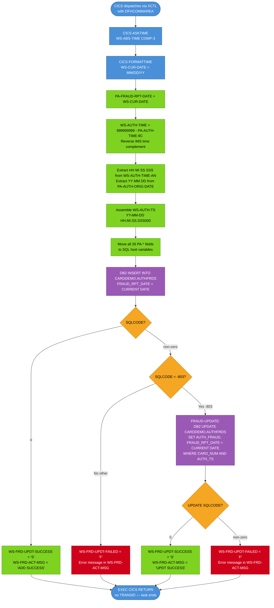

# BIZ-COPAUS2C — Fraud Authorization Marker

| Attribute | Value |
|-----------|-------|
| **Program** | COPAUS2C |
| **Type** | CICS Online Subroutine — no BMS map |
| **Transaction ID** | None (called via XCTL from COPAUS0C or similar) |
| **Language** | COBOL with embedded DB2 SQL |
| **Source File** | `source/cobol/COPAUS2C.cbl` |
| **DB2 Table** | `CARDDEMO.AUTHFRDS` |
| **Lines** | 244 |
| **Version Tag** | CardDemo_v1.0-15-g27d6c6f-68 · 2022-07-19 |

---

## 1. Business Purpose

COPAUS2C marks or clears the fraud flag on a pending authorization record stored in the DB2 table `CARDDEMO.AUTHFRDS`. It is a back-end subroutine with no screen of its own. The entire exchange with its caller happens through `DFHCOMMAREA`: the caller passes a pending authorization record plus the desired action (`'F'` = report fraud, `'R'` = remove fraud flag), and the program returns a status indicator and a message string in the same commarea.

The program supports two business operations:

1. **Flag as fraud**: A suspected fraudulent pending authorization is inserted as a new row in `CARDDEMO.AUTHFRDS` with `AUTH_FRAUD = 'F'` and `FRAUD_RPT_DATE` set to today's date. If the row already exists (DB2 SQLCODE -803, unique-key violation), the program falls through to an update instead.
2. **Remove fraud flag**: The same path applies — an INSERT is attempted first, and if the record exists, an UPDATE changes `AUTH_FRAUD` and `FRAUD_RPT_DATE`. There is no separate code path for removal versus flagging; the `WS-FRD-ACTION` value (`'F'` or `'R'`) flows straight into `AUTH_FRAUD` regardless.

Because COPAUS2C issues a plain `EXEC CICS RETURN` (no `TRANSID`), control returns to CICS and the task ends. The calling program must be responsible for resuming conversation with the user.

---

## 2. Program Flow

### 2.1 Startup

COPAUS2C has a single entry point, `MAIN-PARA`. There is no commarea-length check (no `EIBCALEN` test). The program assumes it is always invoked with a correctly populated `DFHCOMMAREA`. If invoked directly without a commarea, field references to `DFHCOMMAREA` will produce unpredictable results — there is no guard.

The first action is to obtain the current timestamp:

1. `EXEC CICS ASKTIME NOHANDLE ABSTIME(WS-ABS-TIME)` — obtains the number of milliseconds since 00:00:00 on 1 January 1900 as a COMP-3 packed decimal into `WS-ABS-TIME` (PIC S9(15) COMP-3).
2. `EXEC CICS FORMATTIME ABSTIME(WS-ABS-TIME) MMDDYY(WS-CUR-DATE) DATESEP NOHANDLE` — formats the absolute time as an 8-character `MM/DD/YY` string into `WS-CUR-DATE`.
3. `WS-CUR-DATE` is immediately moved to `PA-FRAUD-RPT-DATE` in the commarea IMS segment, recording the date the fraud report was filed.

### 2.2 Main Processing

**Timestamp conversion** — The original authorization time is stored in `PA-AUTH-TIME-9C` (PIC S9(09) COMP-3) as a time complement: a value obtained by subtracting the actual time from 999999999, so that most-recent records sort first in an IMS key sequence. COPAUS2C must reverse this to obtain the actual time. The reversal is:

```
COMPUTE WS-AUTH-TIME = 999999999 - PA-AUTH-TIME-9C
```

The result is a 9-digit numeric string `HHMMSSMMM` (hours, minutes, seconds, milliseconds as 3 digits). This numeric value is redefined as `WS-AUTH-TIME-AN PIC X(09)`, and individual substrings are extracted by character position:
- `WS-AUTH-TIME-AN(1:2)` → `WS-AUTH-HH` (hours)
- `WS-AUTH-TIME-AN(3:2)` → `WS-AUTH-MI` (minutes)
- `WS-AUTH-TIME-AN(5:2)` → `WS-AUTH-SS` (seconds)
- `WS-AUTH-TIME-AN(7:3)` → `WS-AUTH-SSS` (milliseconds / microseconds — 3 digits)

The authorization date is extracted from `PA-AUTH-ORIG-DATE` (PIC X(06), format `YYMMDD`):
- Characters 1–2 → `WS-AUTH-YY`
- Characters 3–4 → `WS-AUTH-MM`
- Characters 5–6 → `WS-AUTH-DD`

These pieces are assembled in `WS-AUTH-TS` (a formatted timestamp string) using literal separator fillers: `YY-MM-DD HH.MI.SS.SSS000`. The trailing `000` is a hardcoded FILLER at the end of `WS-AUTH-SSS` — the 6-digit fractional seconds field in the DB2 TIMESTAMP type is only partially populated (3 digits from the source, 3 fixed zeros).

**Field mapping** — All 23 authorization fields are moved from the `PA-*` commarea fields (IMS segment CIPAUDTY) into the SQL host variables from the `AUTHFRDS` INCLUDE:

| Source Field (`PA-*`) | Target Host Variable | Notes |
|-----------------------|----------------------|-------|
| `PA-CARD-NUM` | `CARD-NUM` | 16-char card number |
| `WS-AUTH-TS` | `AUTH-TS` | Reconstructed timestamp string |
| `PA-AUTH-TYPE` | `AUTH-TYPE` | 4-char auth type code |
| `PA-CARD-EXPIRY-DATE` | `CARD-EXPIRY-DATE` | 4-char MMYY |
| `PA-MESSAGE-TYPE` | `MESSAGE-TYPE` | 6-char message type |
| `PA-MESSAGE-SOURCE` | `MESSAGE-SOURCE` | 6-char source identifier |
| `PA-AUTH-ID-CODE` | `AUTH-ID-CODE` | 6-char authorization code |
| `PA-AUTH-RESP-CODE` | `AUTH-RESP-CODE` | 2-char response code; `'00'` = approved |
| `PA-AUTH-RESP-REASON` | `AUTH-RESP-REASON` | 4-char decline reason |
| `PA-PROCESSING-CODE` | `PROCESSING-CODE` | 6-digit processing code |
| `PA-TRANSACTION-AMT` | `TRANSACTION-AMT` | S9(10)V99 COMP-3 — use BigDecimal in Java |
| `PA-APPROVED-AMT` | `APPROVED-AMT` | S9(10)V99 COMP-3 — use BigDecimal in Java |
| `PA-MERCHANT-CATAGORY-CODE` | `MERCHANT-CATAGORY-CODE` | 4-char MCC (note: "CATAGORY" is a misspelling in source) |
| `PA-ACQR-COUNTRY-CODE` | `ACQR-COUNTRY-CODE` | 3-char ISO country code |
| `PA-POS-ENTRY-MODE` | `POS-ENTRY-MODE` | 2-digit POS mode |
| `PA-MERCHANT-ID` | `MERCHANT-ID` | 15-char merchant ID |
| `PA-MERCHANT-NAME` (length) | `MERCHANT-NAME-LEN` | Populated with `LENGTH OF PA-MERCHANT-NAME` (22) |
| `PA-MERCHANT-NAME` | `MERCHANT-NAME-TEXT` | 22-char merchant name |
| `PA-MERCHANT-CITY` | `MERCHANT-CITY` | 13-char city |
| `PA-MERCHANT-STATE` | `MERCHANT-STATE` | 2-char state |
| `PA-MERCHANT-ZIP` | `MERCHANT-ZIP` | 9-char ZIP |
| `PA-TRANSACTION-ID` | `TRANSACTION-ID` | 15-char transaction ID |
| `PA-MATCH-STATUS` | `MATCH-STATUS` | 1-char status (`P`/`D`/`E`/`M`) |
| `WS-FRD-ACTION` | `AUTH-FRAUD` | `'F'` = fraud, `'R'` = remove |
| `WS-ACCT-ID` (commarea) | `ACCT-ID` | 11-digit account ID |
| `WS-CUST-ID` (commarea) | `CUST-ID` | 9-digit customer ID |

**DB2 INSERT** — The program attempts to insert a new row:

```sql
INSERT INTO CARDDEMO.AUTHFRDS
  (CARD_NUM, AUTH_TS, AUTH_TYPE, CARD_EXPIRY_DATE, MESSAGE_TYPE,
   MESSAGE_SOURCE, AUTH_ID_CODE, AUTH_RESP_CODE, AUTH_RESP_REASON,
   PROCESSING_CODE, TRANSACTION_AMT, APPROVED_AMT,
   MERCHANT_CATAGORY_CODE, ACQR_COUNTRY_CODE, POS_ENTRY_MODE,
   MERCHANT_ID, MERCHANT_NAME, MERCHANT_CITY, MERCHANT_STATE,
   MERCHANT_ZIP, TRANSACTION_ID, MATCH_STATUS, AUTH_FRAUD,
   FRAUD_RPT_DATE, ACCT_ID, CUST_ID)
VALUES
  (:CARD-NUM, TIMESTAMP_FORMAT(:AUTH-TS,'YY-MM-DD HH24.MI.SSNNNNNN'),
   :AUTH-TYPE, :CARD-EXPIRY-DATE, ...)
```

`AUTH_TS` is inserted using `TIMESTAMP_FORMAT` with the pattern `'YY-MM-DD HH24.MI.SSNNNNNN'`. This converts the 20-character `WS-AUTH-TS` string into a DB2 TIMESTAMP column. `FRAUD_RPT_DATE` uses the DB2 built-in `CURRENT DATE`, not the COBOL-formatted `WS-CUR-DATE`. The value moved to `PA-FRAUD-RPT-DATE` earlier is stored in the commarea segment but is not used in the SQL INSERT; `FRAUD_RPT_DATE` in the DB2 row comes from `CURRENT DATE`.

**SQLCODE evaluation** after INSERT:
- `SQLCODE = 0`: Success. `WS-FRD-UPDT-SUCCESS` is set to `'S'` and `WS-FRD-ACT-MSG` is set to `'ADD SUCCESS'`.
- `SQLCODE = -803` (unique-key violation): The record already exists. `FRAUD-UPDATE` paragraph is performed.
- Any other non-zero SQLCODE: `WS-FRD-UPDT-FAILED` is set to `'F'`. `SQLCODE` and `SQLSTATE` are formatted into `WS-FRD-ACT-MSG` as `' SYSTEM ERROR DB2: CODE:nnnnnn, STATE: nnnnnnnnn'`.

**`FRAUD-UPDATE` paragraph** — Issues an UPDATE:

```sql
UPDATE CARDDEMO.AUTHFRDS
   SET AUTH_FRAUD     = :AUTH-FRAUD,
       FRAUD_RPT_DATE = CURRENT DATE
 WHERE CARD_NUM = :CARD-NUM
   AND AUTH_TS  = TIMESTAMP_FORMAT(:AUTH-TS,'YY-MM-DD HH24.MI.SSNNNNNN')
```

The primary key lookup uses both `CARD_NUM` and `AUTH_TS`. `SQLCODE` is evaluated the same way: `0` → `WS-FRD-UPDT-SUCCESS + 'UPDT SUCCESS'`, non-zero → `WS-FRD-UPDT-FAILED + error message`.

### 2.3 Shutdown

After all processing (INSERT or INSERT+UPDATE), COPAUS2C issues:

```
EXEC CICS RETURN
END-EXEC
```

There is no `TRANSID` on this RETURN. The task terminates. The calling program — which had issued XCTL — has already ended. The status and message in `WS-FRD-UPDATE-STATUS` and `WS-FRD-ACT-MSG` within `DFHCOMMAREA` are the caller's only feedback mechanism; however, since XCTL transfers control rather than calling like a subprogram, the original caller cannot inspect these values after the fact. The commarea fields serve as inter-program state at the moment of the XCTL chain — any program that reads them must do so before calling COPAUS2C (or must be the program that COPAUS2C itself returns to, but COPAUS2C issues a plain RETURN with no TRANSID, so there is no resumption).

---

## 3. Error Handling

| Condition | Detection | Response |
|-----------|-----------|----------|
| INSERT succeeds | `SQLCODE = 0` | `WS-FRD-UPDT-SUCCESS = 'S'`, `WS-FRD-ACT-MSG = 'ADD SUCCESS'` |
| Record already exists | `SQLCODE = -803` | Perform `FRAUD-UPDATE` (UPDATE existing row) |
| UPDATE succeeds | `SQLCODE = 0` in `FRAUD-UPDATE` | `WS-FRD-UPDT-SUCCESS = 'S'`, `WS-FRD-ACT-MSG = 'UPDT SUCCESS'` |
| UPDATE fails | Non-zero SQLCODE in `FRAUD-UPDATE` | `WS-FRD-UPDT-FAILED = 'F'`, error text in `WS-FRD-ACT-MSG` |
| INSERT fails with non-(-803) SQLCODE | Non-zero SQLCODE (not -803) | `WS-FRD-UPDT-FAILED = 'F'`, error text in `WS-FRD-ACT-MSG` |
| No commarea on entry | `EIBCALEN = 0` | No guard — undefined behavior; fields reference uninitialized memory |

The program does not abend explicitly or issue CICS ABEND. All error signalling is through the commarea output fields. CICS errors (e.g., ASKTIME, FORMATTIME failures) are suppressed with `NOHANDLE` — any CICS error during time retrieval is silently ignored.

---

## 4. Migration Notes

1. **Plain EXEC CICS RETURN (no TRANSID)**: This program is a one-shot service. In Java, the equivalent is a `@Service` method or a REST endpoint that accepts the authorization record and returns a status DTO. There is no session or conversational state to manage.

2. **Time complement reversal**: `WS-AUTH-TIME = 999999999 - PA-AUTH-TIME-9C` is an IMS key inversion technique. In Java, the input field `PA-AUTH-TIME-9C` must be subtracted from `999999999` to recover the actual time before constructing a `LocalDateTime`. Document this in Javadoc: `// IMS time complement: actual_time_ms = 999_999_999 - paAuthTime9C`.

3. **COMP-3 monetary amounts**: `PA-TRANSACTION-AMT` and `PA-APPROVED-AMT` are PIC S9(10)V99 COMP-3 — packed decimal with 2 implied decimal places. Java must map these to `BigDecimal` with scale 2. Never use `double` or `float`.

4. **MERCHANT-NAME as variable-length**: The program captures `LENGTH OF PA-MERCHANT-NAME` (always 22 — a fixed-length PIC X field, so this is a compile-time constant) and moves it to `MERCHANT-NAME-LEN`. The DB2 host variable `MERCHANT-NAME` is likely a VARCHAR structure. In Java, the field can be a `String` of maximum 22 characters.

5. **FRAUD_RPT_DATE discrepancy**: `WS-CUR-DATE` is formatted by `CICS FORMATTIME` as `MM/DD/YY` (8 characters with separators) and moved to `PA-FRAUD-RPT-DATE` in the commarea. However, the SQL INSERT uses `CURRENT DATE` for `FRAUD_RPT_DATE` in the DB2 row — the commarea value is never used in the SQL. The Java implementation should use `LocalDate.now()` for the DB2 column and can expose the formatted date in the response DTO if needed, but these are logically independent.

6. **AUTHFRDS DB2 INCLUDE**: `EXEC SQL INCLUDE AUTHFRDS END-EXEC` refers to a DB2 table declaration (DCLGEN output) not present in the repository. Java must define a JPA entity or JDBC parameter class matching all 26 columns of `CARDDEMO.AUTHFRDS`.

7. **SQLCA**: `EXEC SQL INCLUDE SQLCA END-EXEC` brings in the standard DB2 SQL Communication Area. In Java/JDBC, `SQLCODE` maps to `SQLException.getErrorCode()` and `SQLSTATE` maps to `SQLException.getSQLState()`. The -803 duplicate-key check maps to catching `SQLException` where `getErrorCode() == -803` (DB2) or handling `DataIntegrityViolationException` in Spring.

8. **"CATAGORY" misspelling**: `PA-MERCHANT-CATAGORY-CODE` / `MERCHANT_CATAGORY_CODE` is consistently misspelled as "CATAGORY" rather than "CATEGORY" throughout the copybook, the COBOL source, and presumably the DB2 table DDL. Java field names and DB2 column names must preserve this spelling to match the existing schema.

9. **No EIBCALEN guard**: The Java equivalent must validate that all required input fields are non-null before proceeding. The COBOL program's lack of an entry guard is a latent bug.

10. **DFHBMSCA commented out**: Line 61 shows `*COPY DFHBMSCA.` — the BMS attribute constants copybook is commented out. This confirms no BMS map interaction; all communication is via commarea.

---

## Appendix A — Working Storage Fields

### WS-VARIABLES

| Field | PIC | Initial | Notes |
|-------|-----|---------|-------|
| `WS-PGMNAME` | X(08) | `'COPAUS2C'` | Own program name; not used in logic |
| `WS-LENGTH` | S9(04) COMP | 0 | Declared but never used |
| `WS-AUTH-TIME` | 9(09) | — | Holds reversed time complement value |
| `WS-AUTH-TIME-AN` | X(09) | — | REDEFINES `WS-AUTH-TIME`; used for character substring extraction |
| `WS-AUTH-TS` | composite | — | Formatted timestamp `YY-MM-DD HH.MI.SS.SSS000` for SQL |
| `WS-AUTH-YY` | X(02) | — | Year component of `WS-AUTH-TS` |
| `WS-AUTH-MM` | X(02) | — | Month component |
| `WS-AUTH-DD` | X(02) | — | Day component |
| `WS-AUTH-HH` | X(02) | — | Hour component |
| `WS-AUTH-MI` | X(02) | — | Minute component |
| `WS-AUTH-SS` | X(02) | — | Second component |
| `WS-AUTH-SSS` | X(03) | — | Millisecond component (3 digits) |
| `WS-ERR-FLG` | X(01) | `'N'` | 88 `ERR-FLG-ON` = `'Y'`; `ERR-FLG-OF` = `'N'` (note: typo — should be `ERR-FLG-OFF`) |
| `WS-SQLCODE` | +9(06) | — | Copy of `SQLCODE` for error message formatting |
| `WS-SQLSTATE` | +9(09) | — | Copy of `SQLSTATE` for error message formatting |
| `WS-ABS-TIME` | S9(15) COMP-3 | 0 | CICS absolute time in milliseconds since 1900 |
| `WS-CUR-DATE` | X(08) | SPACES | Current date from CICS FORMATTIME, format MM/DD/YY |

---

## Appendix B — DFHCOMMAREA Layout

The commarea is fully defined in the `LINKAGE SECTION`. The layout is:

| Field | PIC | Notes |
|-------|-----|-------|
| `WS-ACCT-ID` | 9(11) | Account ID passed by caller |
| `WS-CUST-ID` | 9(09) | Customer ID passed by caller |
| `WS-FRAUD-AUTH-RECORD` | (CIPAUDTY) | IMS segment with pending authorization details — see Appendix C |
| `WS-FRD-ACTION` | X(01) | 88 `WS-REPORT-FRAUD` = `'F'`; 88 `WS-REMOVE-FRAUD` = `'R'` |
| `WS-FRD-UPDATE-STATUS` | X(01) | 88 `WS-FRD-UPDT-SUCCESS` = `'S'`; 88 `WS-FRD-UPDT-FAILED` = `'F'` |
| `WS-FRD-ACT-MSG` | X(50) | Human-readable result message; `'ADD SUCCESS'`, `'UPDT SUCCESS'`, or error text |

---

## Appendix C — CIPAUDTY Copybook (IMS Pending Authorization Segment)

The `WS-FRAUD-AUTH-RECORD` in DFHCOMMAREA expands to the CIPAUDTY copybook fields:

| Field | PIC | Notes |
|-------|-----|-------|
| `PA-AUTH-DATE-9C` | S9(05) COMP-3 | IMS key: date complement (days from epoch, reversed for descending sort) |
| `PA-AUTH-TIME-9C` | S9(09) COMP-3 | IMS key: time complement; actual time = 999999999 − this value |
| `PA-AUTH-ORIG-DATE` | X(06) | Original authorization date, format `YYMMDD` |
| `PA-AUTH-ORIG-TIME` | X(06) | Original authorization time, format `HHMMSS` (not used in time reversal) |
| `PA-CARD-NUM` | X(16) | Card number — part of DB2 primary key |
| `PA-AUTH-TYPE` | X(04) | Authorization type code |
| `PA-CARD-EXPIRY-DATE` | X(04) | Card expiry, format `MMYY` |
| `PA-MESSAGE-TYPE` | X(06) | ISO 8583 message type |
| `PA-MESSAGE-SOURCE` | X(06) | Source system identifier |
| `PA-AUTH-ID-CODE` | X(06) | Authorization code from network |
| `PA-AUTH-RESP-CODE` | X(02) | Response code; 88 `PA-AUTH-APPROVED` = `'00'` |
| `PA-AUTH-RESP-REASON` | X(04) | Decline reason code |
| `PA-PROCESSING-CODE` | 9(06) | ISO 8583 processing code |
| `PA-TRANSACTION-AMT` | S9(10)V99 COMP-3 | Transaction amount — COMP-3, use BigDecimal in Java |
| `PA-APPROVED-AMT` | S9(10)V99 COMP-3 | Approved amount — COMP-3, use BigDecimal in Java |
| `PA-MERCHANT-CATAGORY-CODE` | X(04) | Merchant Category Code (MCC); "CATAGORY" is a persistent misspelling |
| `PA-ACQR-COUNTRY-CODE` | X(03) | Acquirer country code (ISO 3166-1 alpha-3) |
| `PA-POS-ENTRY-MODE` | 9(02) | Point of Sale entry mode |
| `PA-MERCHANT-ID` | X(15) | Merchant identifier |
| `PA-MERCHANT-NAME` | X(22) | Merchant name |
| `PA-MERCHANT-CITY` | X(13) | Merchant city |
| `PA-MERCHANT-STATE` | X(02) | Merchant state |
| `PA-MERCHANT-ZIP` | X(09) | Merchant ZIP code |
| `PA-TRANSACTION-ID` | X(15) | Transaction identifier |
| `PA-MATCH-STATUS` | X(01) | 88 `PA-MATCH-PENDING` = `'P'`; `PA-MATCH-AUTH-DECLINED` = `'D'`; `PA-MATCH-PENDING-EXPIRED` = `'E'`; `PA-MATCHED-WITH-TRAN` = `'M'` |
| `PA-AUTH-FRAUD` | X(01) | 88 `PA-FRAUD-CONFIRMED` = `'F'`; `PA-FRAUD-REMOVED` = `'R'` |
| `PA-FRAUD-RPT-DATE` | X(08) | Fraud report date; written here by CICS FORMATTIME but not used in SQL |
| `FILLER` | X(17) | Padding bytes |

---

## Appendix D — Known Issues and Latent Bugs

1. **No EIBCALEN guard**: The program does not check `EIBCALEN` before referencing `DFHCOMMAREA`. If invoked directly (without XCTL passing a commarea), references to `WS-ACCT-ID`, `PA-AUTH-TIME-9C`, and all other commarea fields will access undefined storage, causing unpredictable results or an abend.

2. **WS-FRD-UPDATE-STATUS output never inspected by caller**: Because COPAUS2C uses `EXEC CICS RETURN` (not a CALL), and its caller used XCTL (not a CALL), the original calling task has already ended. The `WS-FRD-UPDATE-STATUS` and `WS-FRD-ACT-MSG` fields are written but are not accessible after the RETURN. The Java design must explicitly return success/failure to the caller, either through a response body or a database status field.

3. **WS-ERR-FLG typo**: The 88-level condition for "error off" is named `ERR-FLG-OF` (missing trailing F) instead of the conventional `ERR-FLG-OFF`. The flag is declared but never actually tested or set in this program — it is unused. This is a template artifact.

4. **WS-LENGTH declared but unused**: `WS-LENGTH PIC S9(4) COMP` is initialized to zero and never referenced. Template artifact.

5. **FRAUD_RPT_DATE dual population**: `WS-CUR-DATE` (formatted by CICS FORMATTIME as `MM/DD/YY`) is moved to `PA-FRAUD-RPT-DATE` in the commarea. However, the DB2 INSERT and UPDATE both use `CURRENT DATE` for `FRAUD_RPT_DATE` — the commarea value is never used in SQL. In nearly all circumstances these will be the same date, but on a midnight boundary they could differ. The Java implementation should use a single `LocalDate.now()` call for both.

6. **Time reconstruction precision**: `PA-AUTH-ORIG-TIME` (PIC X(06), format `HHMMSS`) is present in the IMS segment but is never used. Instead, the program reconstructs time from `PA-AUTH-TIME-9C` (the IMS complement key). The two should be consistent, but the COBOL program trusts the key over the display field. Java should do the same and document this explicitly.

7. **"CATAGORY" misspelling propagated to DB2**: `MERCHANT_CATAGORY_CODE` is misspelled in the copybook, COBOL source, and presumably the DB2 DDL. The Java entity class and any Spring Data repository must use the exact misspelled column name.

8. **Timestamp format 6-digit microseconds**: `TIMESTAMP_FORMAT` uses `'YY-MM-DD HH24.MI.SSNNNNNN'` where `NNNNNN` is 6 digits. `WS-AUTH-SSS` provides only 3 significant digits; the trailing `000` FILLER pads to 6. DB2 will accept this, but the microsecond precision is effectively 3 digits. Java `LocalDateTime` has nanosecond precision; when writing to DB2, scale the milliseconds appropriately.

---

## Appendix E — Mermaid Flow Diagram


