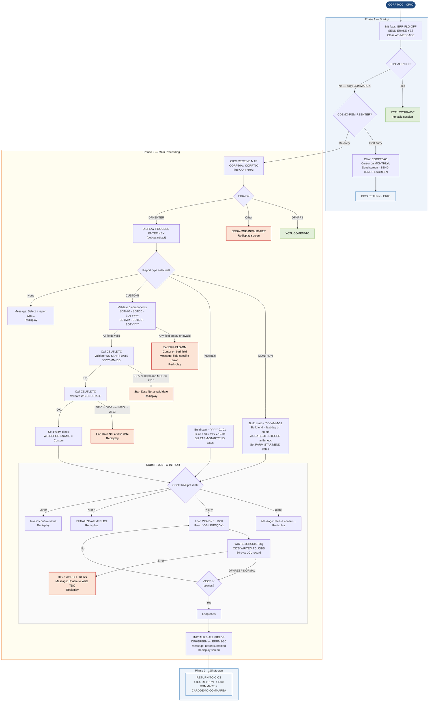

# CORPT00C — Transaction Report Submission

```
Application : AWS CardDemo
Source File : CORPT00C.cbl
Type        : Online CICS COBOL
Source Banner: Program : CORPT00C.CBL / Application : CardDemo / Type : CICS COBOL Program / Function : Print Transaction reports by submitting batch job from online using extra partition TDQ.
```

This document describes what CORPT00C does in plain English. It presents a report-selection screen to an authenticated CardDemo operator, lets the operator choose a monthly, yearly, or custom date-range transaction report, validates the date inputs, and submits JCL to an internal reader via the extra-partition Transient Data Queue (TDQ) named `JOBS` to trigger a batch report job.

---

## 1. Purpose

CORPT00C accepts operator input specifying which kind of transaction report to generate (monthly, yearly, or custom date range), validates the date inputs, builds a complete JCL job stream in working storage, and writes each JCL card as an 80-byte record to the `JOBS` TDQ. The batch subsystem picks up records from `JOBS` and submits them as a batch job that executes the `TRANREPT` procedure.

The program reads no external files. It calls the external date-validation service `CSUTLDTC` (custom date validate) for the custom date range path only. The `JOBS` TDQ is the only output.

The JCL job stream is embedded as hardcoded literals in working-storage (`JOB-DATA-1`), with two variable slots (`PARM-START-DATE-1`, `PARM-END-DATE-1`, `PARM-START-DATE-2`, `PARM-END-DATE-2`) that are populated with the operator-selected dates before submission.

The program uses transaction ID `CR00` and map `CORPT0A` / mapset `CORPT00`.

---

## 2. Program Flow

### 2.1 Startup

**Step 1 — Initialize flags** *(paragraph `MAIN-PARA`, line 163).*
At entry, `WS-ERR-FLG` is set to `'N'` (`ERR-FLG-OFF`), `WS-TRANSACT-EOF` to `'N'` (`TRANSACT-NOT-EOF`), and `WS-SEND-ERASE-FLG` to `'Y'` (`SEND-ERASE-YES`). `WS-MESSAGE` and `ERRMSGO` on `CORPT0AO` are cleared to spaces.

**Step 2 — No COMMAREA (`EIBCALEN = 0`)** *(line 172).*
If there is no COMMAREA the program was invoked incorrectly (not from within a CardDemo session). It sets `CDEMO-TO-PROGRAM` to `'COSGN00C'` and transfers to `RETURN-TO-PREV-SCREEN`, which issues CICS XCTL back to the signon screen.

**Step 3 — First entry within a session (`CDEMO-PGM-REENTER` is false)** *(line 177).*
The program copies the COMMAREA, sets `CDEMO-PGM-REENTER` to true, clears the map output area (`CORPT0AO`) to low values, sets cursor on `MONTHLYL`, and sends the report selection screen via `SEND-TRNRPT-SCREEN`.

### 2.2 Main Processing

**Step 4 — Re-entry: receive screen** *(line 183).*
On subsequent invocations `RECEIVE-TRNRPT-SCREEN` issues CICS RECEIVE MAP for `CORPT0A` / `CORPT00` into `CORPT0AI`.

**Step 5 — Evaluate attention key** *(line 184).*
- `DFHENTER` — perform `PROCESS-ENTER-KEY` (full validation and submission logic).
- `DFHPF3` — set `CDEMO-TO-PROGRAM` to `'COMEN01C'` and transfer to previous screen.
- Any other AID — set error flag, cursor on `MONTHLYL`, message from `CCDA-MSG-INVALID-KEY`, redisplay screen.

**Step 6 — Process Enter key** *(paragraph `PROCESS-ENTER-KEY`, line 208).*
Displays `'PROCESS ENTER KEY'` to the CICS job log (diagnostic). Evaluates the three report-type checkboxes:

**Monthly report path (line 213):**
The program obtains the current date via `FUNCTION CURRENT-DATE` into `WS-CURDATE-DATA`. It builds `WS-START-DATE` as `YYYY-MM-01` (first of the current month) and copies it to `PARM-START-DATE-1` and `PARM-START-DATE-2`. It then advances the month by 1 (rolling the year if month exceeds 12), uses `FUNCTION DATE-OF-INTEGER` / `FUNCTION INTEGER-OF-DATE` to subtract one day, and builds `WS-END-DATE` as the last day of the current month. Both date parameters are copied to `PARM-END-DATE-1` and `PARM-END-DATE-2`. Calls `SUBMIT-JOB-TO-INTRDR`.

**Yearly report path (line 239):**
Start date is `YYYY-01-01` and end date is `YYYY-12-31` for the current year. Both parameter slots populated. Calls `SUBMIT-JOB-TO-INTRDR`.

**Custom date range path (line 256):**
Validates each of six date components in sequence (start month, start day, start year, end month, end day, end year): empty check first, then numeric, then range. Any failure sets the error flag and redisplays the screen with a specific message and cursor position. If all fields pass individual edits, the six components are assembled into `WS-START-DATE` and `WS-END-DATE` and both are passed to `CSUTLDTC` for calendar validation (once for start, once for end). A non-zero severity code from `CSUTLDTC` (other than message number `'2513'`) triggers a date-invalid error. If no errors exist, calls `SUBMIT-JOB-TO-INTRDR`.

**No type selected (line 437):**
Message `'Select a report type to print report...'` is displayed.

**Step 7 — Submit job to internal reader** *(paragraph `SUBMIT-JOB-TO-INTRDR`, line 462).*
First checks that the `CONFIRMI` field is not blank — if blank, prompts `'Please confirm to print the <report-name> report...'` and returns. If confirmation is present but not `'Y'` or `'y'`, reports an error if `'N'`/`'n'` (displays screen and re-initializes), or displays `'"<value>" is not a valid value to confirm...'` for any other value.

Once confirmation is valid, the program iterates `WS-IDX` from 1 to 1000, reading each 80-byte `JOB-LINES(WS-IDX)` element from `JOB-DATA-2` (the OCCURS redefine of the hardcoded JCL data). For each line it calls `WIRTE-JOBSUB-TDQ`. The loop stops when a line equals `'/*EOF'`, spaces, or low values — whichever comes first.

**Step 8 — Write one JCL record to TDQ** *(paragraph `WIRTE-JOBSUB-TDQ`, line 515).*
Issues CICS WRITEQ TD to queue `'JOBS'` with `JCL-RECORD` (80 bytes). On non-normal response, displays `'RESP:' WS-RESP-CD 'REAS:' WS-REAS-CD`, sets error flag, and displays message `'Unable to Write TDQ (JOBS)...'`.

**Step 9 — Success path** *(line 445).*
After `SUBMIT-JOB-TO-INTRDR` returns without error, the program calls `INITIALIZE-ALL-FIELDS`, sets the error message color to green (`DFHGREEN` into `ERRMSGC`), builds the message `'<report-name> report submitted for printing ...'` into `WS-MESSAGE`, and redisplays the screen.

### 2.3 Shutdown

**Step 10 — CICS RETURN** *(paragraph `RETURN-TO-CICS`, line 585).*
All paths culminate in a CICS RETURN with `TRANSID = 'CR00'` and `COMMAREA = CARDDEMO-COMMAREA`. There is also `SEND-TRNRPT-SCREEN` which ends with `GO TO RETURN-TO-CICS`, ensuring all screen-send paths funnel to the same return.

**Step 11 — XCTL to previous program** *(paragraph `RETURN-TO-PREV-SCREEN`, line 540).*
Sets `CDEMO-FROM-TRANID` to `'CR00'`, `CDEMO-FROM-PROGRAM` to `'CORPT00C'`, `CDEMO-PGM-CONTEXT` to zero, then issues CICS XCTL to `CDEMO-TO-PROGRAM` with the COMMAREA.

---

## 3. Error Handling

### 3.1 Empty date components — inline in `PROCESS-ENTER-KEY` (lines 259–300)
For each of the six custom date fields, a blank check produces a message of the form `'Start Date - Month can NOT be empty...'` (or Day/Year/End variants). Sets `WS-ERR-FLG = 'Y'` and redisplays with cursor on the offending field's length indicator.

### 3.2 Non-numeric date components — inline in `PROCESS-ENTER-KEY` (lines 329–379)
After numeric conversion of each field, a non-numeric result produces messages: `'Start Date - Not a valid Month...'`, `'Start Date - Not a valid Day...'`, `'Start Date - Not a valid Year...'`, `'End Date - Not a valid Month...'`, `'End Date - Not a valid Day...'`, `'End Date - Not a valid Year...'`.

### 3.3 `CSUTLDTC` calendar validation failure — inline (lines 396–426)
If `CSUTLDTC-RESULT-SEV-CD` is not `'0000'` and message number is not `'2513'`, displays `'Start Date - Not a valid date...'` or `'End Date - Not a valid date...'` and sets the error flag.

### 3.4 Confirmation missing — `SUBMIT-JOB-TO-INTRDR` (line 464)
Message `'Please confirm to print the <name> report...'` (built with STRING), cursor on `CONFIRML`.

### 3.5 Confirmation value invalid — `SUBMIT-JOB-TO-INTRDR` (line 484)
Message built as `'"<value>" is not a valid value to confirm...'`, cursor on `CONFIRML`.

### 3.6 TDQ write failure — `WIRTE-JOBSUB-TDQ` (line 529)
Displays the raw numeric response codes to CICS job log: `'RESP:' WS-RESP-CD 'REAS:' WS-REAS-CD`. Sets `WS-ERR-FLG = 'Y'`. Displays `'Unable to Write TDQ (JOBS)...'` with cursor on `MONTHLYL`.

---

## 4. Migration Notes

1. **`WIRTE-JOBSUB-TDQ` is a typo in the paragraph name (line 515).** The correct English spelling is `WRITE-JOBSUB-TDQ`. Any Java method mapped to this paragraph should document the original misspelling.

2. **Hardcoded JCL in working storage (`JOB-DATA-1`, lines 82–125).** The entire JCL job stream — including job name `TRNRPT00`, class `A`, message class `0`, JCLLIB reference `AWS.M2.CARDDEMO.PROC`, procedure `TRANREPT`, SYMNAMES definitions, and job card — is embedded as FILLER literals in working storage. These are environment-specific values that will need to be externalized or replaced in a migrated system. They are not runtime-configurable.

3. **`DISPLAY 'PROCESS ENTER KEY'` is a debugging artifact (line 210).** This statement writes to the CICS job log on every Enter key press. It should be removed in migration.

4. **Month arithmetic does not validate against calendar (lines 223–230).** For the monthly path, the program increments `WS-CURDATE-MONTH` by 1 and uses `FUNCTION INTEGER-OF-DATE` / `FUNCTION DATE-OF-INTEGER` to back-calculate the month-end. This is arithmetically correct for COBOL but the Java equivalent must use a proper calendar/date-time API rather than reproducing the integer-of-date idiom.

5. **CSUTLDTC message `'2513'` is silently ignored (lines 399, 419).** When `CSUTLDTC` returns severity non-zero but message number `'2513'`, the validation failure is suppressed and processing continues. The meaning of message 2513 from `CSUTLDTC` is not documented in this program. A migrated Java date validator should not replicate this silent exception without understanding what 2513 represents.

6. **`CSUTLDTC-RESULT` (COMP-3 fields) — migration note.** `CSUTLDTC-RESULT-SEV-CD` is `X(04)` (display character), but is compared to `'0000'` as a string. `CSUTLDTC-RESULT-MSG-NUM` is `X(04)` compared to `'2513'`. These are character comparisons, not numeric. No COMP-3 issue for these specific fields.

7. **`WS-REC-COUNT` and `WS-IDX` are declared COMP but `WS-IDX` iterates to 1000.** The `JOB-DATA-2 REDEFINES JOB-DATA-1` provides 1000 80-byte occurrences. The loop stops at `/*EOF` so in practice fewer than 20 records are written. The 1000-slot OCCURS is oversized but harmless.

8. **`WS-TRANSACT-FILE` (`'TRANSACT'`) and `WS-TRANSACT-EOF` are defined but never used (lines 40–46).** These fields appear to be template artifacts from a program that originally read a transaction file. They are dead code in this program.

9. **`WS-TRAN-AMT` and `WS-TRAN-DATE` are defined but never used (lines 77–78).** Additional dead fields — template remnants. `WS-TRAN-DATE` has a hardcoded initial value of `'00/00/00'`, which is a spurious non-blank default.

10. **`CVTRA05Y` copybook is copied but none of its fields are used (line 146).** `TRAN-RECORD` and all its sub-fields (`TRAN-ID`, `TRAN-TYPE-CD`, `TRAN-CAT-CD`, etc.) are defined but never referenced. This is a template artifact.

---

## Appendix A — Files

| Logical Name | DDname | Organization | Recording | Key Field | Direction | Contents |
|---|---|---|---|---|---|---|
| `JOBS` TDQ | `JOBS` (extra-partition TDQ) | Sequential — extra-partition Transient Data Queue | Fixed 80 bytes | N/A | Output — write only | JCL job stream records; each record is one 80-byte JCL card. Consumed by the internal reader to submit the `TRANREPT` batch procedure. |

---

## Appendix B — Copybooks and External Programs

### Copybook `COCOM01Y` (WORKING-STORAGE SECTION, line 138)

Defines `CARDDEMO-COMMAREA`. See COSGN00C Appendix B for full field table. Fields set by this program before XCTL or RETURN:

- `CDEMO-TO-PROGRAM` — set to `'COSGN00C'` (no COMMAREA path) or `'COMEN01C'` (PF3 path)
- `CDEMO-FROM-TRANID` — set to `'CR00'`
- `CDEMO-FROM-PROGRAM` — set to `'CORPT00C'`
- `CDEMO-PGM-CONTEXT` — set to `0`
- `CDEMO-PGM-REENTER` — set to `1` on first entry

### Copybook `CORPT00` (WORKING-STORAGE SECTION, line 140)

Defines the BMS map structures `CORPT0AI` (input) and `CORPT0AO` (output, REDEFINES input) for the transaction report screen. Map `CORPT0A`, mapset `CORPT00`.

**Key input fields used by this program:**

| Field | PIC | Bytes | Notes |
|---|---|---|---|
| `MONTHLYI` | `X(1)` | 1 | Monthly report selector — non-blank/non-low-values triggers monthly path |
| `YEARLYI` | `X(1)` | 1 | Yearly report selector |
| `CUSTOMI` | `X(1)` | 1 | Custom date range selector |
| `SDTMMI` | `X(2)` | 2 | Start date month |
| `SDTDDI` | `X(2)` | 2 | Start date day |
| `SDTYYYYI` | `X(4)` | 4 | Start date year |
| `EDTMMI` | `X(2)` | 2 | End date month |
| `EDTDDI` | `X(2)` | 2 | End date day |
| `EDTYYYYI` | `X(4)` | 4 | End date year |
| `CONFIRMI` | `X(1)` | 1 | Submission confirmation flag — `'Y'`/`'y'` to proceed |
| `ERRMSGI` | `X(78)` | 78 | Error message — not read on input |

Length (`*L`), flag (`*F`), attribute (`*A`) sub-fields exist for BMS control but are not individually used in business logic.

**Output fields written (`CORPT0AO`):**
- `ERRMSGC` — set to `DFHGREEN` on success
- `ERRMSGO` — populated from `WS-MESSAGE`
- `MONTHLYL` — set to `-1` for cursor positioning
- `TITLE01O`, `TITLE02O`, `TRNNAMEO`, `PGMNAMEO`, `CURDATEO`, `CURTIMEO` — screen header fields

### Copybook `COTTL01Y` (WORKING-STORAGE SECTION, line 142)

Defines `CCDA-SCREEN-TITLE`. See COSGN00C Appendix B.

### Copybook `CSDAT01Y` (WORKING-STORAGE SECTION, line 143)

Defines `WS-DATE-TIME`. See COSGN00C Appendix B. Additional sub-fields used by CORPT00C: `WS-CURDATE-YEAR`, `WS-CURDATE-MONTH`, `WS-CURDATE-DAY`, `WS-CURDATE-N` (numeric redefine used in INTEGER-OF-DATE calculation).

### Copybook `CSMSG01Y` (WORKING-STORAGE SECTION, line 144)

Defines `CCDA-COMMON-MESSAGES`. `CCDA-MSG-INVALID-KEY` is used on invalid AID. `CCDA-MSG-THANK-YOU` is **not used** by this program.

### Copybook `CVTRA05Y` (WORKING-STORAGE SECTION, line 146)

Defines `TRAN-RECORD` — transaction record layout (RECLN = 350).

| Field | PIC | Bytes | Notes |
|---|---|---|---|
| `TRAN-ID` | `X(16)` | 16 | Transaction ID — **never referenced by this program** |
| `TRAN-TYPE-CD` | `X(02)` | 2 | Transaction type code — **never referenced** |
| `TRAN-CAT-CD` | `9(04)` | 4 | Category code — **never referenced** |
| `TRAN-SOURCE` | `X(10)` | 10 | Source — **never referenced** |
| `TRAN-DESC` | `X(100)` | 100 | Description — **never referenced** |
| `TRAN-AMT` | `S9(09)V99` | 11 | Amount — **never referenced** |
| `TRAN-MERCHANT-ID` | `9(09)` | 9 | Merchant ID — **never referenced** |
| `TRAN-MERCHANT-NAME` | `X(50)` | 50 | Merchant name — **never referenced** |
| `TRAN-MERCHANT-CITY` | `X(50)` | 50 | Merchant city — **never referenced** |
| `TRAN-MERCHANT-ZIP` | `X(10)` | 10 | Merchant ZIP — **never referenced** |
| `TRAN-CARD-NUM` | `X(16)` | 16 | Card number — **never referenced** |
| `TRAN-ORIG-TS` | `X(26)` | 26 | Origination timestamp — **never referenced** |
| `TRAN-PROC-TS` | `X(26)` | 26 | Processing timestamp — **never referenced** |
| FILLER | `X(20)` | 20 | Padding — **never referenced** |

**All 14 fields in `CVTRA05Y` are unused by this program.** The entire copybook is a template artifact.

### Copybook `DFHAID` and `DFHBMSCA`

IBM-supplied CICS copybooks providing `DFHENTER`, `DFHPF3`, `DFHRESP(NORMAL)`, `DFHGREEN`, `DFHBMDAR`, etc. Used for AID and attribute comparisons throughout the program.

### External Program `CSUTLDTC` — Date Validation Service

| Item | Detail |
|---|---|
| Called from | Paragraph `PROCESS-ENTER-KEY`, lines 392–394 (start date) and lines 412–414 (end date) |
| Nature | CICS-linked utility; called via COBOL CALL statement |
| Input passed | `CSUTLDTC-DATE` (PIC X(10)) — the `YYYY-MM-DD` formatted date; `CSUTLDTC-DATE-FORMAT` (PIC X(10)) — set to `'YYYY-MM-DD'`; `CSUTLDTC-RESULT` cleared to spaces before each call |
| Output read | `CSUTLDTC-RESULT-SEV-CD` (PIC X(04)) — `'0000'` means valid; `CSUTLDTC-RESULT-MSG-NUM` (PIC X(04)) — message identifier |
| Fields NOT checked | `CSUTLDTC-RESULT-MSG` (PIC X(61)) — the actual error message text is never read or displayed |

---

## Appendix C — Hardcoded Literals

| Paragraph | Line | Value | Usage | Classification |
|---|---|---|---|---|
| `WS-VARIABLES` | 37 | `'CORPT00C'` | `WS-PGMNAME` | System constant |
| `WS-VARIABLES` | 38 | `'CR00'` | `WS-TRANID` | System constant |
| `WS-VARIABLES` | 40 | `'TRANSACT'` | `WS-TRANSACT-FILE` — **unused** | Template artifact |
| `WS-VARIABLES` | 72 | `'YYYY-MM-DD'` | `WS-DATE-FORMAT` — passed to `CSUTLDTC` | Business rule |
| `WS-VARIABLES` | 78 | `'00/00/00'` | Initial value of `WS-TRAN-DATE` — **unused field** | Template artifact |
| `JOB-DATA-1` | 83 | `"//TRNRPT00 JOB 'TRAN REPORT',CLASS=A,MSGCLASS=0,"` | JCL job card | System constant — environment-specific |
| `JOB-DATA-1` | 85 | `"// NOTIFY=&SYSUID"` | JCL notify | System constant |
| `JOB-DATA-1` | 90 | `"//JOBLIB JCLLIB ORDER=('AWS.M2.CARDDEMO.PROC')"` | JCL JCLLIB | System constant — environment-specific |
| `JOB-DATA-1` | 94 | `"//STEP10 EXEC PROC=TRANREPT"` | JCL EXEC | System constant |
| `JOB-DATA-1` | 99 | `"TRAN-CARD-NUM,263,16,ZD"` | SYMNAMES entry | System constant |
| `JOB-DATA-1` | 101 | `"TRAN-PROC-DT,305,10,CH"` | SYMNAMES entry | System constant |
| `PROCESS-ENTER-KEY` | 219 | `'01'` | Start date day set to first of month | Business rule |
| `PROCESS-ENTER-KEY` | 250 | `'12'` | End date month for yearly report | Business rule |
| `PROCESS-ENTER-KEY` | 251 | `'31'` | End date day for yearly report | Business rule |
| `SUBMIT-JOB-TO-INTRDR` | 518 | `'JOBS'` | TDQ name | System constant |
| `MAIN-PARA` | 173 | `'COSGN00C'` | Fallback target when no COMMAREA | Business rule |
| `MAIN-PARA` | 188 | `'COMEN01C'` | PF3 return target | Business rule |
| `PROCESS-ENTER-KEY` | 210 | `'PROCESS ENTER KEY'` | Debug display message | Template artifact |

---

## Appendix D — Internal Working Fields

| Field | PIC | Bytes | Purpose |
|---|---|---|---|
| `WS-PGMNAME` | `X(08)` | 8 | Own program name `'CORPT00C'` |
| `WS-TRANID` | `X(04)` | 4 | Own transaction ID `'CR00'` |
| `WS-MESSAGE` | `X(80)` | 80 | Error or status message buffer |
| `WS-TRANSACT-FILE` | `X(08)` | 8 | **Unused** — `'TRANSACT'`, template artifact |
| `WS-ERR-FLG` | `X(01)` | 1 | Error flag; 88 `ERR-FLG-ON` = `'Y'`; `ERR-FLG-OFF` = `'N'` |
| `WS-TRANSACT-EOF` | `X(01)` | 1 | **Unused** — `'N'`; 88 `TRANSACT-EOF` = `'Y'`; `TRANSACT-NOT-EOF` = `'N'` |
| `WS-SEND-ERASE-FLG` | `X(01)` | 1 | Erase flag for CICS SEND; 88 `SEND-ERASE-YES` = `'Y'`; `SEND-ERASE-NO` = `'N'` |
| `WS-END-LOOP` | `X(01)` | 1 | Loop termination flag for JCL submission loop; 88 `END-LOOP-YES` = `'Y'`; `END-LOOP-NO` = `'N'` |
| `WS-RESP-CD` | `S9(09) COMP` | 4 | CICS primary response code |
| `WS-REAS-CD` | `S9(09) COMP` | 4 | CICS secondary reason code |
| `WS-REC-COUNT` | `S9(04) COMP` | 2 | **Unused** — record counter, never incremented |
| `WS-IDX` | `S9(04) COMP` | 2 | Loop index for JCL line iteration (1–1000) |
| `WS-REPORT-NAME` | `X(10)` | 10 | Report type name: `'Monthly'`, `'Yearly'`, or `'Custom'` — used in success message |
| `WS-START-DATE` | composite X(10) | 10 | Start date in `YYYY-MM-DD` format; sub-fields `WS-START-DATE-YYYY` (4), separator `'-'` (1), `WS-START-DATE-MM` (2), separator (1), `WS-START-DATE-DD` (2) |
| `WS-END-DATE` | composite X(10) | 10 | End date in `YYYY-MM-DD` format; same structure as start |
| `WS-DATE-FORMAT` | `X(10)` | 10 | `'YYYY-MM-DD'` — passed to `CSUTLDTC` |
| `WS-NUM-99` | `99` | 2 | Intermediate for `FUNCTION NUMVAL-C` conversion of 2-digit date components |
| `WS-NUM-9999` | `9999` | 4 | Intermediate for `FUNCTION NUMVAL-C` conversion of 4-digit year |
| `WS-TRAN-AMT` | `+99999999.99` | 13 | **Unused** — template artifact |
| `WS-TRAN-DATE` | `X(08)` | 8 | **Unused** — initial value `'00/00/00'`; template artifact |
| `JCL-RECORD` | `X(80)` | 80 | Working buffer holding one JCL line for TDQ write |
| `PARM-START-DATE-1` | `X(10)` | 10 | Embedded in `JOB-DATA-1` SYMNAMES statement — overwritten with start date |
| `PARM-END-DATE-1` | `X(10)` | 10 | Embedded in `JOB-DATA-1` SYMNAMES statement — overwritten with end date |
| `PARM-START-DATE-2` | `X(10)` | 10 | Embedded in `JOB-DATA-1` DATEPARM statement — overwritten with start date |
| `PARM-END-DATE-2` | `X(10)` | 10 | Embedded in `JOB-DATA-1` DATEPARM statement — overwritten with end date |
| `CSUTLDTC-DATE` | `X(10)` | 10 | Date passed to `CSUTLDTC` |
| `CSUTLDTC-DATE-FORMAT` | `X(10)` | 10 | Format mask `'YYYY-MM-DD'` passed to `CSUTLDTC` |
| `CSUTLDTC-RESULT-SEV-CD` | `X(04)` | 4 | Severity code from `CSUTLDTC`; `'0000'` = valid |
| `CSUTLDTC-RESULT-MSG-NUM` | `X(04)` | 4 | Message number from `CSUTLDTC`; `'2513'` is silently ignored |
| `CSUTLDTC-RESULT-MSG` | `X(61)` | 61 | Error message text from `CSUTLDTC` — **never read by this program** |

---

## Appendix E — Execution at a Glance



---

*Source: `CORPT00C.cbl`, CardDemo, Apache 2.0 license. Copybooks: `COCOM01Y.cpy`, `CORPT00.cpy`, `COTTL01Y.cpy`, `CSDAT01Y.cpy`, `CSMSG01Y.cpy`, `CVTRA05Y.cpy`, `DFHAID`, `DFHBMSCA`. External programs: `CSUTLDTC` (CALL — date validation). All field names, paragraph names, PIC clauses, and literal values are taken directly from the source files.*
