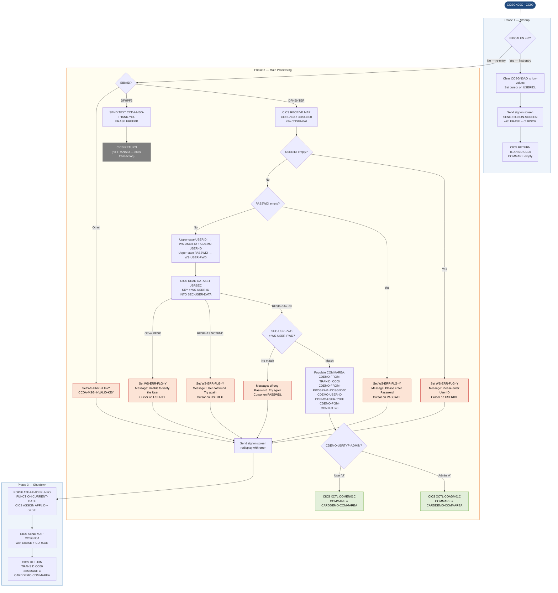

# COSGN00C — CardDemo Signon Screen

```
Application : AWS CardDemo
Source File : COSGN00C.cbl
Type        : Online CICS COBOL
Source Banner: Program : COSGN00C.CBL / Application : CardDemo / Type : CICS COBOL Program / Function : Signon Screen for the CardDemo Application
```

This document describes what COSGN00C does in plain English. It is the entry-point signon screen for the CardDemo application. Developers migrating to Java do not need to read the COBOL source; all field names, logic paths, and security decisions are recorded here.

---

## 1. Purpose

COSGN00C presents a signon screen to the user, collects a user ID and password, and authenticates the credentials against the VSAM user-security file (CICS dataset name `USRSEC`). It is the first program invoked when transaction `CC00` is started with no prior communication area.

On successful authentication the program transfers control via CICS XCTL to one of two programs, depending on the user type stored in the security file:

- **Administrator users** (`SEC-USR-TYPE = 'A'`) — control passes to `COADM01C` (administration menu).
- **Regular users** (`SEC-USR-TYPE = 'U'`) — control passes to `COMEN01C` (main menu).

The program does not read any batch files and writes nothing to any permanent dataset. Its only persistent interaction is the CICS READ of the `USRSEC` file.

The COMMAREA passed to the next program contains the authenticated user ID (`CDEMO-USER-ID`), user type (`CDEMO-USER-TYPE`), the originating transaction ID (`CDEMO-FROM-TRANID`), and the originating program name (`CDEMO-FROM-PROGRAM`). The `CDEMO-PGM-CONTEXT` field is set to zero (entry mode) in the outbound COMMAREA.

---

## 2. Program Flow

### 2.1 Startup

**Step 1 — Entry point check** *(paragraph `MAIN-PARA`, line 73).*
On each invocation the program clears the error flag (`WS-ERR-FLG` set to `'N'` via `ERR-FLG-OFF`) and clears `WS-MESSAGE` and `ERRMSGO` in the output map `COSGN0AO`.

**Step 2 — First-time entry (`EIBCALEN = 0`)** *(line 80).*
When the transaction is started fresh — no COMMAREA — the program clears the output map to low values, sets cursor on the `USERIDL` field, and sends the signon screen via `SEND-SIGNON-SCREEN`. It then returns to CICS with `TRANSID = 'CC00'` and an empty COMMAREA.

**Step 3 — Re-entry (`EIBCALEN > 0`)** *(line 85).*
On every subsequent invocation the program examines the attention identifier (`EIBAID`):
- `DFHENTER` — perform `PROCESS-ENTER-KEY` (validate and authenticate).
- `DFHPF3` — display the thank-you message and terminate the transaction.
- Any other key — set error flag, display `'Invalid key pressed. Please see below...'`, redisplay the signon screen.

### 2.2 Main Processing

**Step 4 — Receive map and validate fields** *(paragraph `PROCESS-ENTER-KEY`, line 108).*
The program issues a CICS RECEIVE MAP for map `COSGN0A` / mapset `COSGN00`, placing input into `COSGN0AI`. It checks:

- If `USERIDI` is spaces or low values: set error flag, message `'Please enter User ID ...'`, cursor on `USERIDL`, redisplay screen.
- If `PASSWDI` is spaces or low values: set error flag, message `'Please enter Password ...'`, cursor on `PASSWDL`, redisplay screen.

Both fields are then upper-cased using the `FUNCTION UPPER-CASE` intrinsic and stored simultaneously in `WS-USER-ID` / `CDEMO-USER-ID` (for user ID) and `WS-USER-PWD` (for password). Only `CDEMO-USER-ID` is carried in the COMMAREA; `WS-USER-PWD` is a local working-storage field.

**Step 5 — Read user security file** *(paragraph `READ-USER-SEC-FILE`, line 209).*
A CICS READ is issued against dataset `USRSEC` with the 8-byte `WS-USER-ID` as the key. The response code drives three branches:

- **Response 0 (normal, record found):** The password stored in `SEC-USR-PWD` is compared byte-for-byte to `WS-USER-PWD`. A match populates the outbound COMMAREA fields (`CDEMO-FROM-TRANID`, `CDEMO-FROM-PROGRAM`, `CDEMO-USER-ID`, `CDEMO-USER-TYPE`, `CDEMO-PGM-CONTEXT = 0`) and issues CICS XCTL to the appropriate next program. A mismatch displays `'Wrong Password. Try again ...'` with cursor on `PASSWDL`.
- **Response 13 (NOTFND, no matching record):** Displays `'User not found. Try again ...'` with cursor on `USERIDL`.
- **Any other response:** Displays `'Unable to verify the User ...'` with cursor on `USERIDL`.

### 2.3 Shutdown

**Step 6 — CICS RETURN** *(line 98).*
After sending any screen (error or initial display) the program issues CICS RETURN with `TRANSID = 'CC00'` and the current `CARDDEMO-COMMAREA`. The LENGTH clause is explicitly coded (`LENGTH OF CARDDEMO-COMMAREA`). The program never issues a STOP RUN; all exit paths go through CICS RETURN or XCTL.

**Step 7 — PF3 exit** *(paragraph `SEND-PLAIN-TEXT`, line 162).*
When the user presses PF3, the program sends the text message from `CCDA-MSG-THANK-YOU` as plain text (free format, no map) with ERASE and FREEKB, then immediately issues a bare CICS RETURN with no TRANSID, ending the transaction.

---

## 3. Error Handling

### 3.1 Missing user ID — inline in `PROCESS-ENTER-KEY` (line 118)
Triggered when `USERIDI` equals spaces or low values. Sets `WS-ERR-FLG` to `'Y'`. Displays message `'Please enter User ID ...'`. Cursor positioned on `USERIDL`. Screen redisplayed via `SEND-SIGNON-SCREEN`.

### 3.2 Missing password — inline in `PROCESS-ENTER-KEY` (line 123)
Triggered when `PASSWDI` equals spaces or low values. Sets `WS-ERR-FLG` to `'Y'`. Displays message `'Please enter Password ...'`. Cursor on `PASSWDL`. Screen redisplayed.

### 3.3 Wrong password — inline in `READ-USER-SEC-FILE` (line 242)
Triggered when the stored `SEC-USR-PWD` does not match `WS-USER-PWD`. Displays message `'Wrong Password. Try again ...'`. Cursor on `PASSWDL`. Does not set `WS-ERR-FLG`.

### 3.4 User not found — inline in `READ-USER-SEC-FILE` (line 248)
Triggered by CICS response code 13 (NOTFND). Sets `WS-ERR-FLG` to `'Y'`. Displays message `'User not found. Try again ...'`. Cursor on `USERIDL`.

### 3.5 USRSEC file unavailable — inline in `READ-USER-SEC-FILE` (line 252)
Triggered by any CICS response code other than 0 or 13. Sets `WS-ERR-FLG` to `'Y'`. Displays message `'Unable to verify the User ...'`. Cursor on `USERIDL`. There is no abend and no further diagnostics are written; the error is silently absorbed after displaying the message.

### 3.6 Invalid attention key — inline in `MAIN-PARA` (line 92)
Triggered by any `EIBAID` other than `DFHENTER` or `DFHPF3`. Sets `WS-ERR-FLG` to `'Y'`. Displays `CCDA-MSG-INVALID-KEY` (`'Invalid key pressed. Please see below...'`).

---

## 4. Migration Notes

1. **Plaintext password comparison (line 223).** The password stored in `SEC-USR-PWD` (PIC X(08) in `CSUSR01Y`) is compared as a plain 8-character string. There is no hashing, salting, or encryption anywhere in this program or the security file layout. A Java replacement must not replicate plaintext password storage; this must be upgraded to a secure credential store.

2. **Password value carried in working storage only (line 135).** `WS-USER-PWD` holds the entered password for the duration of one CICS task and is never placed in the COMMAREA. However, the COMMAREA is an in-memory structure shared across program-to-program transfers; care should be taken in Java that credential values are not inadvertently serialized or logged.

3. **No lockout mechanism.** The program provides no account lockout after repeated bad passwords. Each invocation is stateless — the transaction ends and restarts on each CICS RETURN. A Java migration should implement lockout policy.

4. **USRSEC file error is silently swallowed (line 252).** Response codes other than 0 and 13 produce a user-visible message but no operator alert, no CICS abend, and no structured error code. The `WS-REAS-CD` secondary response code is captured in working storage but never displayed or logged. An operator has no way to diagnose a file-unavailable condition from this program's output alone.

5. **`CDEMO-CUST-ID`, `CDEMO-ACCT-ID`, `CDEMO-CARD-NUM` in COMMAREA are never populated (COCOM01Y fields).** The COMMAREA fields for customer ID, account ID, and card number in `CARDDEMO-COMMAREA` (from `COCOM01Y`) are zero-initialized and never set by this program. Downstream programs that check these must be aware they will be zero on first entry from signon.

6. **`CDEMO-LAST-MAP` and `CDEMO-LAST-MAPSET` are never set.** The two navigation fields in `CDEMO-MORE-INFO` (from `COCOM01Y`) are carried over from whatever was in COMMAREA (nothing on first entry). This could confuse downstream programs that use these fields for back-navigation.

7. **Version comment at line 259** (`Ver: CardDemo_v1.0-15-g27d6c6f-68 Date: 2022-07-19 23:12:33 CDT`) indicates this program is at the original v1.0 baseline and has not been updated alongside programs that carry a v2.0 banner.

---

## Appendix A — Files

| Logical Name | DDname | Organization | Recording | Key Field | Direction | Contents |
|---|---|---|---|---|---|---|
| `USRSEC` (CICS dataset) | `USRSEC  ` (8 bytes, trailing spaces) | VSAM KSDS — accessed via CICS READ | Fixed | `WS-USER-ID` PIC X(08) | Input — read-only, direct key access | User security records; one record per registered user. Layout defined by `CSUSR01Y`: user ID, first name, last name, password, user type, filler. |

---

## Appendix B — Copybooks and External Programs

### Copybook `COCOM01Y` (WORKING-STORAGE SECTION, line 48)

Defines `CARDDEMO-COMMAREA` — the application-level communication area passed between all CardDemo programs.

| Field | PIC | Bytes | Notes |
|---|---|---|---|
| `CDEMO-FROM-TRANID` | `X(04)` | 4 | Transaction ID of calling program. Set to `'CC00'` by this program before XCTL. |
| `CDEMO-FROM-PROGRAM` | `X(08)` | 8 | Program name of calling program. Set to `'COSGN00C'` before XCTL. |
| `CDEMO-TO-TRANID` | `X(04)` | 4 | Target transaction ID. **Not set by this program.** |
| `CDEMO-TO-PROGRAM` | `X(08)` | 8 | Target program name. Set to `'COADM01C'` or `'COMEN01C'` before XCTL. |
| `CDEMO-USER-ID` | `X(08)` | 8 | Authenticated user ID (upper-cased). Set at line 133. |
| `CDEMO-USER-TYPE` | `X(01)` | 1 | User type from security file. 88-level `CDEMO-USRTYP-ADMIN` = `'A'`; 88-level `CDEMO-USRTYP-USER` = `'U'`. Set at line 227. |
| `CDEMO-PGM-CONTEXT` | `9(01)` | 1 | Program context. 88-level `CDEMO-PGM-ENTER` = `0`; 88-level `CDEMO-PGM-REENTER` = `1`. Set to `0` (ENTER) at line 228. |
| `CDEMO-CUST-ID` | `9(09)` | 9 | Customer ID. **Never set by this program — remains zero.** |
| `CDEMO-CUST-FNAME` | `X(25)` | 25 | Customer first name. **Never set by this program.** |
| `CDEMO-CUST-MNAME` | `X(25)` | 25 | Customer middle name. **Never set by this program.** |
| `CDEMO-CUST-LNAME` | `X(25)` | 25 | Customer last name. **Never set by this program.** |
| `CDEMO-ACCT-ID` | `9(11)` | 11 | Account ID. **Never set by this program — remains zero.** |
| `CDEMO-ACCT-STATUS` | `X(01)` | 1 | Account status. **Never set by this program.** |
| `CDEMO-CARD-NUM` | `9(16)` | 16 | Card number. **Never set by this program — remains zero.** |
| `CDEMO-LAST-MAP` | `X(7)` | 7 | Last map name. **Never set by this program.** |
| `CDEMO-LAST-MAPSET` | `X(7)` | 7 | Last mapset name. **Never set by this program.** |

### Copybook `COSGN00` (WORKING-STORAGE SECTION, line 50)

Defines the BMS map structures `COSGN0AI` (input) and `COSGN0AO` (output, REDEFINES input) for the signon screen. Map name `COSGN0A`, mapset `COSGN00`.

**Input fields used by this program (`COSGN0AI`):**

| Field | PIC | Bytes | Notes |
|---|---|---|---|
| `TRNNAMEI` | `X(4)` | 4 | Transaction name — displayed only, not used in logic |
| `TITLE01I` | `X(40)` | 40 | Screen title line 1 — **not read by program logic** |
| `CURDATEI` | `X(8)` | 8 | Current date display — **not read by program logic** |
| `PGMNAMEI` | `X(8)` | 8 | Program name display — **not read by program logic** |
| `TITLE02I` | `X(40)` | 40 | Screen title line 2 — **not read by program logic** |
| `CURTIMEI` | `X(9)` | 9 | Current time display — **not read by program logic** |
| `APPLIDI` | `X(8)` | 8 | CICS APPLID — populated by CICS ASSIGN, displayed only |
| `SYSIDI` | `X(8)` | 8 | CICS SYSID — populated by CICS ASSIGN, displayed only |
| `USERIDI` | `X(8)` | 8 | User ID entered by operator. Validated and upper-cased. |
| `PASSWDI` | `X(8)` | 8 | Password entered by operator. Validated and upper-cased. **Security-sensitive.** |
| `ERRMSGI` | `X(78)` | 78 | Error message area — **not read on input** |

Each data field in the BMS map has associated length (`*L` suffix, `S9(4) COMP`), flag (`*F`), attribute (`*A`), and output (`*O`) sub-fields for BMS control. These are not individually used by the program logic.

**Output fields written (`COSGN0AO`):**
- `TITLE01O`, `TITLE02O` — populated from `CCDA-TITLE01`, `CCDA-TITLE02`
- `TRNNAMEO` — populated from `WS-TRANID`
- `PGMNAMEO` — populated from `WS-PGMNAME`
- `CURDATEO` — populated from `WS-CURDATE-MM-DD-YY`
- `CURTIMEO` — populated from `WS-CURTIME-HH-MM-SS`
- `APPLIDO` — populated by CICS ASSIGN APPLID
- `SYSIDO` — populated by CICS ASSIGN SYSID
- `ERRMSGO` — populated from `WS-MESSAGE`

### Copybook `COTTL01Y` (WORKING-STORAGE SECTION, line 52)

Defines `CCDA-SCREEN-TITLE` with three fields.

| Field | PIC | Bytes | Notes |
|---|---|---|---|
| `CCDA-TITLE01` | `X(40)` | 40 | `'      AWS Mainframe Modernization       '` — written to `TITLE01O` |
| `CCDA-TITLE02` | `X(40)` | 40 | `'              CardDemo                  '` — written to `TITLE02O` |
| `CCDA-THANK-YOU` | `X(40)` | 40 | `'Thank you for using CCDA application... '` — **not used by COSGN00C** |

### Copybook `CSDAT01Y` (WORKING-STORAGE SECTION, line 53)

Defines `WS-DATE-TIME` — current-date and current-time working storage. All sub-fields are populated by `FUNCTION CURRENT-DATE` in `POPULATE-HEADER-INFO`.

| Field | PIC | Bytes | Notes |
|---|---|---|---|
| `WS-CURDATE-YEAR` | `9(04)` | 4 | 4-digit year |
| `WS-CURDATE-MONTH` | `9(02)` | 2 | Month |
| `WS-CURDATE-DAY` | `9(02)` | 2 | Day |
| `WS-CURDATE-N` | `9(08)` REDEFINES | 8 | Numeric overlay of date |
| `WS-CURTIME-HOURS` | `9(02)` | 2 | Hours |
| `WS-CURTIME-MINUTE` | `9(02)` | 2 | Minutes |
| `WS-CURTIME-SECOND` | `9(02)` | 2 | Seconds |
| `WS-CURTIME-MILSEC` | `9(02)` | 2 | Milliseconds — **captured but not displayed** |
| `WS-CURDATE-MM-DD-YY` | composite | 8 | MM/DD/YY formatted date for screen header |
| `WS-CURTIME-HH-MM-SS` | composite | 8 | HH:MM:SS formatted time for screen header |
| `WS-TIMESTAMP` | composite | 23 | Full timestamp — **defined but not used by this program** |

### Copybook `CSMSG01Y` (WORKING-STORAGE SECTION, line 54)

Defines `CCDA-COMMON-MESSAGES`.

| Field | PIC | Bytes | Notes |
|---|---|---|---|
| `CCDA-MSG-THANK-YOU` | `X(50)` | 50 | `'Thank you for using CardDemo application...      '` — sent as plain text on PF3 |
| `CCDA-MSG-INVALID-KEY` | `X(50)` | 50 | `'Invalid key pressed. Please see below...         '` — displayed on invalid AID |

### Copybook `CSUSR01Y` (WORKING-STORAGE SECTION, line 55)

Defines `SEC-USER-DATA` — the record layout for the USRSEC security file.

| Field | PIC | Bytes | Notes |
|---|---|---|---|
| `SEC-USR-ID` | `X(08)` | 8 | User ID — VSAM key field used for direct read |
| `SEC-USR-FNAME` | `X(20)` | 20 | First name — **read from file but never used or displayed by this program** |
| `SEC-USR-LNAME` | `X(20)` | 20 | Last name — **read from file but never used or displayed by this program** |
| `SEC-USR-PWD` | `X(08)` | 8 | Stored password (plaintext). Compared byte-for-byte to `WS-USER-PWD`. Security-critical. |
| `SEC-USR-TYPE` | `X(01)` | 1 | User type: `'A'` = administrator, `'U'` = regular user. Copied to `CDEMO-USER-TYPE`. |
| `SEC-USR-FILLER` | `X(23)` | 23 | Padding — **never referenced** |

### External Programs Called

#### `COADM01C` — Administration Menu

| Item | Detail |
|---|---|
| Called from | Paragraph `READ-USER-SEC-FILE`, line 231 — CICS XCTL (not a CALL) |
| Condition | `CDEMO-USRTYP-ADMIN` is true (i.e., `SEC-USR-TYPE = 'A'`) |
| Input passed in COMMAREA | `CDEMO-FROM-TRANID = 'CC00'`, `CDEMO-FROM-PROGRAM = 'COSGN00C'`, `CDEMO-USER-ID` = upper-cased user ID, `CDEMO-USER-TYPE = 'A'`, `CDEMO-PGM-CONTEXT = 0` |
| Output fields read | None — XCTL transfers control; COSGN00C does not regain control |
| Fields not checked | `CDEMO-CUST-ID`, `CDEMO-ACCT-ID`, `CDEMO-CARD-NUM`, `CDEMO-LAST-MAP`, `CDEMO-LAST-MAPSET` — all zero/spaces in the outbound COMMAREA |

#### `COMEN01C` — Main Menu

| Item | Detail |
|---|---|
| Called from | Paragraph `READ-USER-SEC-FILE`, line 236 — CICS XCTL |
| Condition | `CDEMO-USRTYP-USER` is true (i.e., `SEC-USR-TYPE = 'U'`) |
| Input passed in COMMAREA | Same fields as COADM01C except `CDEMO-USER-TYPE = 'U'` |
| Output fields read | None — XCTL |
| Fields not checked | Same as above |

---

## Appendix C — Hardcoded Literals

| Paragraph | Line | Value | Usage | Classification |
|---|---|---|---|---|
| `WS-VARIABLES` | 37 | `'COSGN00C'` | `WS-PGMNAME` — own program name | System constant |
| `WS-VARIABLES` | 38 | `'CC00'` | `WS-TRANID` — own transaction ID | System constant |
| `WS-VARIABLES` | 39 | `'USRSEC  '` | `WS-USRSEC-FILE` — CICS dataset name (8 bytes with trailing spaces) | System constant |
| `READ-USER-SEC-FILE` | 231 | `'COADM01C'` | Target program for admin users | Business rule |
| `READ-USER-SEC-FILE` | 236 | `'COMEN01C'` | Target program for regular users | Business rule |
| `SEND-SIGNON-SCREEN` | 153 | `'COSGN0A'` | BMS map name | System constant |
| `SEND-SIGNON-SCREEN` | 154 | `'COSGN00'` | BMS mapset name | System constant |
| `PROCESS-ENTER-KEY` | 120 | `'Please enter User ID ...'` | Validation message | Display message |
| `PROCESS-ENTER-KEY` | 125 | `'Please enter Password ...'` | Validation message | Display message |
| `READ-USER-SEC-FILE` | 242 | `'Wrong Password. Try again ...'` | Authentication failure message | Display message |
| `READ-USER-SEC-FILE` | 249 | `'User not found. Try again ...'` | User not found message | Display message |
| `READ-USER-SEC-FILE` | 254 | `'Unable to verify the User ...'` | File error message | Display message |

---

## Appendix D — Internal Working Fields

| Field | PIC | Bytes | Purpose |
|---|---|---|---|
| `WS-PGMNAME` | `X(08)` | 8 | Own program name `'COSGN00C'` — written to screen header |
| `WS-TRANID` | `X(04)` | 4 | Own transaction ID `'CC00'` — used in CICS RETURN and screen header |
| `WS-MESSAGE` | `X(80)` | 80 | Message buffer for `ERRMSGO`; cleared at entry, set by validation/authentication errors |
| `WS-USRSEC-FILE` | `X(08)` | 8 | CICS dataset name `'USRSEC  '` (with trailing spaces) — passed to CICS READ |
| `WS-ERR-FLG` | `X(01)` | 1 | Error flag. 88-level `ERR-FLG-ON` = `'Y'`; `ERR-FLG-OFF` = `'N'` |
| `WS-RESP-CD` | `S9(09) COMP` | 4 | CICS primary response code from READ |
| `WS-REAS-CD` | `S9(09) COMP` | 4 | CICS secondary reason code from READ — **captured but never inspected or displayed** |
| `WS-USER-ID` | `X(08)` | 8 | Upper-cased user ID from screen input — used as CICS READ key |
| `WS-USER-PWD` | `X(08)` | 8 | Upper-cased password from screen input — compared to `SEC-USR-PWD`. Security-sensitive; never written to COMMAREA. |

---

## Appendix E — Execution at a Glance



---

*Source: `COSGN00C.cbl`, CardDemo, Apache 2.0 license. Copybooks: `COCOM01Y.cpy`, `COSGN00.cpy`, `COTTL01Y.cpy`, `CSDAT01Y.cpy`, `CSMSG01Y.cpy`, `CSUSR01Y.cpy`. External transfers: `COADM01C` (XCTL), `COMEN01C` (XCTL). All field names, paragraph names, PIC clauses, and literal values are taken directly from the source files.*
