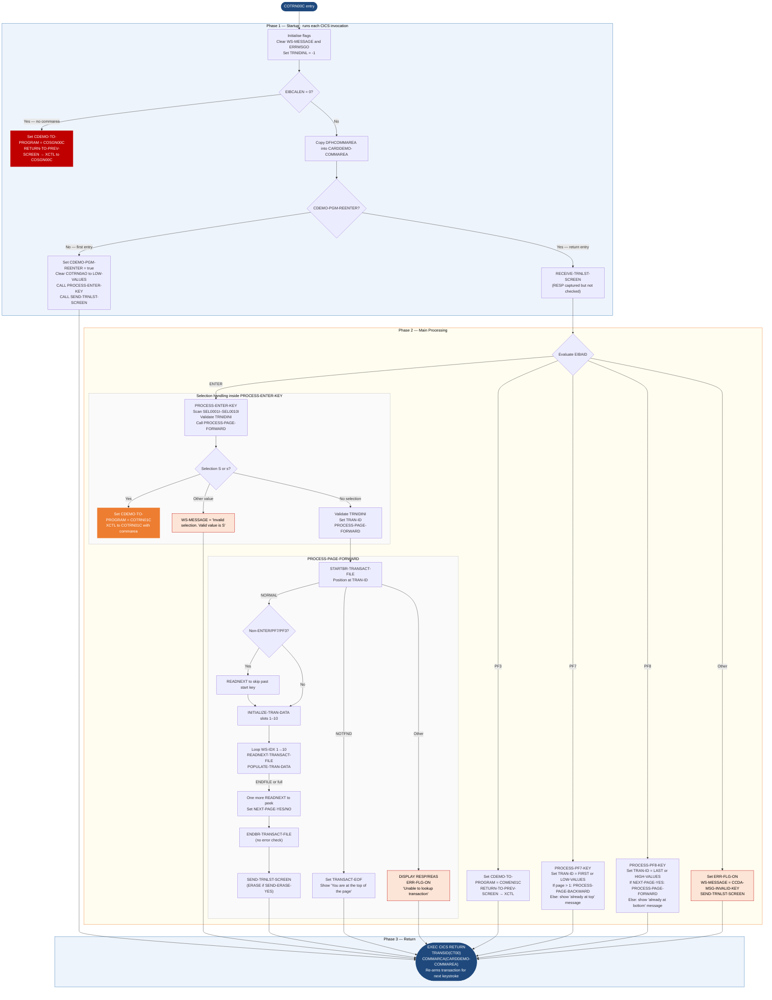

Application : AWS CardDemo
Source File : COTRN00C.cbl
Type        : Online CICS COBOL
Source Banner: Program     : COTRN00C.CBL / Application : CardDemo / Type : CICS COBOL Program / Function    : List Transactions from TRANSACT file

# COTRN00C — Transaction List Screen

This document describes what the program does in plain English. Field names, paragraph names, and copybook identifiers are preserved exactly as they appear in the source so that a developer can trace any statement back to the COBOL without reading the code.

---

## 1. Purpose

COTRN00C is the **Transaction List** online screen for the CardDemo credit-card application. It presents up to ten transaction records at a time from the **TRANSACT** VSAM KSDS file (CICS dataset name `TRANSACT`), supports forward and backward paging through the file, and allows the operator to select one transaction for detailed viewing.

- **Reads from**: `TRANSACT` — the transaction master file, accessed via CICS browse (STARTBR / READNEXT / READPREV / ENDBR). The record layout is supplied by copybook `CVTRA05Y` (`TRAN-RECORD`).
- **Writes to**: No file is updated. All output goes to the CICS map `COTRN0A` in mapset `COTRN00`.
- **External programs called**:
  - `COTRN01C` — launched via `EXEC CICS XCTL` when the operator selects a transaction with code `S` or `s`. Receives the selected transaction ID in `CDEMO-CT00-TRN-SELECTED` inside the commarea.
  - `COMEN01C` — launched via `XCTL` when PF3 is pressed (return to menu).
  - `COSGN00C` — launched via `XCTL` when the commarea length is zero (unauthenticated entry).
- **Transaction ID**: `CT00` (stored in `WS-TRANID`).
- **Commarea**: `CARDDEMO-COMMAREA` defined by `COCOM01Y` plus program-specific `CDEMO-CT00-INFO` fields appended inline after the `COPY COCOM01Y` statement.

---

## 2. Program Flow

### 2.1 Startup

**Step 1 — Initialise flags** *(paragraph `MAIN-PARA`, line 95).* The program sets `ERR-FLG-OFF` (error flag cleared), `TRANSACT-NOT-EOF` (browse not yet exhausted), `NEXT-PAGE-NO` (no next page yet known), and `SEND-ERASE-YES` (next send will erase the screen). It also blanks `WS-MESSAGE` and the map error field `ERRMSGO OF COTRN0AO`, and sets the cursor length indicator `TRNIDINL OF COTRN0AI` to `-1`.

**Step 2 — Check EIBCALEN** *(line 107).* If `EIBCALEN` is zero the session has no commarea; the program sets `CDEMO-TO-PROGRAM` to `COSGN00C` and transfers control there via `RETURN-TO-PREV-SCREEN`. This prevents unauthenticated access.

**Step 3 — Copy commarea** *(line 111).* The incoming `DFHCOMMAREA` bytes (length `EIBCALEN`) are copied into `CARDDEMO-COMMAREA`.

**Step 4 — First-entry check** *(line 112).* If `CDEMO-PGM-REENTER` is false (this is the first time the transaction has been entered in the current session), the program sets `CDEMO-PGM-REENTER` to true, clears the output map `COTRN0AO` to `LOW-VALUES`, and immediately calls `PROCESS-ENTER-KEY` followed by `SEND-TRNLST-SCREEN`. This auto-populates the first page of transactions without waiting for user input.

### 2.2 Main Processing

When `CDEMO-PGM-REENTER` is already true, the program is in a return-entry cycle. It calls `RECEIVE-TRNLST-SCREEN` to capture the user's keystrokes, then evaluates `EIBAID`:

**ENTER key** — calls `PROCESS-ENTER-KEY` (line 121).

`PROCESS-ENTER-KEY` (line 146):
1. Scans the ten selection fields `SEL0001I` through `SEL0010I` of `COTRN0AI` in order. The first non-space / non-low-value entry wins; its value is stored in `CDEMO-CT00-TRN-SEL-FLG` and the matching transaction ID (`TRNID01I` … `TRNID10I`) is stored in `CDEMO-CT00-TRN-SELECTED`.
2. If a selection was made and the flag is `S` or `s`, the program sets `CDEMO-TO-PROGRAM` to `COTRN01C`, copies the transaction context into the commarea, and executes `EXEC CICS XCTL` to transfer to the detail view. Any other selection value shows the message `'Invalid selection. Valid value is S'` in `WS-MESSAGE`.
3. Validates `TRNIDINI OF COTRN0AI` (the optional start-key search box). If blank, it initialises the browse key `TRAN-ID` to `LOW-VALUES`. If non-blank but non-numeric, it sets `ERR-FLG-ON` and sends the screen back with `'Tran ID must be Numeric ...'`.
4. Resets `CDEMO-CT00-PAGE-NUM` to zero and calls `PROCESS-PAGE-FORWARD`.

**PF3 key** — sets `CDEMO-TO-PROGRAM` to `COMEN01C` and calls `RETURN-TO-PREV-SCREEN` to go back to the main menu (line 123).

**PF7 key** — calls `PROCESS-PF7-KEY` (line 125).

`PROCESS-PF7-KEY` (line 234):
- If `CDEMO-CT00-TRNID-FIRST` (the ID of the first record on the current page, persisted in the commarea) is blank, sets `TRAN-ID` to `LOW-VALUES`; otherwise restores it.
- Sets `NEXT-PAGE-YES`.
- If `CDEMO-CT00-PAGE-NUM > 1` calls `PROCESS-PAGE-BACKWARD`; otherwise shows message `'You are already at the top of the page...'`.

**PF8 key** — calls `PROCESS-PF8-KEY` (line 125).

`PROCESS-PF8-KEY` (line 257):
- If `CDEMO-CT00-TRNID-LAST` (the ID of the last record on the current page) is blank, sets `TRAN-ID` to `HIGH-VALUES`; otherwise restores it.
- If `NEXT-PAGE-YES` calls `PROCESS-PAGE-FORWARD`; otherwise shows message `'You are already at the bottom of the page...'` without erasing.

**Any other key** — sets `ERR-FLG-ON` and populates `WS-MESSAGE` with `CCDA-MSG-INVALID-KEY` from copybook `CSMSG01Y` (`'Invalid key pressed. Please see below...'`), then sends the screen without erasing.

`PROCESS-PAGE-FORWARD` (line 279):
1. Calls `STARTBR-TRANSACT-FILE` to position the CICS browse cursor at `TRAN-ID`.
2. On a non-ENTER / non-PF7 / non-PF3 trigger, reads one record past the start key with `READNEXT-TRANSACT-FILE` (skip the key record itself).
3. Clears the ten display slots by calling `INITIALIZE-TRAN-DATA` for index 1 through 10.
4. Loops (`WS-IDX` 1 to 10) calling `READNEXT-TRANSACT-FILE` then `POPULATE-TRAN-DATA` for each record read.
5. After filling up to 10 rows, tries one more `READNEXT-TRANSACT-FILE` to determine whether a next page exists; if a record is returned, `NEXT-PAGE-YES` is set; otherwise `NEXT-PAGE-NO`.
6. Increments `CDEMO-CT00-PAGE-NUM`.
7. Calls `ENDBR-TRANSACT-FILE` and sends the screen.

`PROCESS-PAGE-BACKWARD` (line 333):
- Same structure but uses `READPREV-TRANSACT-FILE` and fills slots from index 10 down to 1, then decrements `CDEMO-CT00-PAGE-NUM`.

`POPULATE-TRAN-DATA` (line 381):
- Copies `TRAN-AMT` into `WS-TRAN-AMT` (the display-formatted amount field PIC `+99999999.99`).
- Copies `TRAN-ORIG-TS` into `WS-TIMESTAMP` and extracts the two-digit year (`WS-TIMESTAMP-DT-YYYY(3:2)`), month, and day into `WS-CURDATE-MM-DD-YY` format for display.
- Populates the correct screen row slot (`TRNID01I`…`TRNID10I`, `TDATE01I`…`TDATE10I`, `TDESC01I`…`TDESC10I`, `TAMT001I`…`TAMT010I`). Slot 1 also saves `TRAN-ID` into `CDEMO-CT00-TRNID-FIRST`; slot 10 saves into `CDEMO-CT00-TRNID-LAST`.

`POPULATE-HEADER-INFO` (line 567):
- Reads the system clock via `FUNCTION CURRENT-DATE` into `WS-CURDATE-DATA`.
- Copies title lines `CCDA-TITLE01` and `CCDA-TITLE02` from `COTTL01Y` into the map header fields.
- Formats and writes the current date (`MM/DD/YY`) and time (`HH:MM:SS`) into `CURDATEO` and `CURTIMEO`.

### 2.3 Shutdown / Return

At the bottom of `MAIN-PARA` (line 138), regardless of the path taken, the program issues:

```
EXEC CICS RETURN TRANSID(WS-TRANID) COMMAREA(CARDDEMO-COMMAREA)
```

This re-arms the transaction `CT00` so the next terminal interaction re-enters the same program with the updated commarea. No file resources are held between invocations.

---

## 3. Error Handling

### 3.1 `STARTBR-TRANSACT-FILE` (line 591)

- `DFHRESP(NORMAL)` — success, continue.
- `DFHRESP(NOTFND)` — the requested key was not found. Sets `TRANSACT-EOF` to true, displays message `'You are at the top of the page...'`, and sends the screen. Processing continues (the loop will immediately exit because `TRANSACT-EOF` is true).
- Any other response — displays the raw codes with `DISPLAY 'RESP:' WS-RESP-CD 'REAS:' WS-REAS-CD`, sets `ERR-FLG-ON`, puts `'Unable to lookup transaction...'` in `WS-MESSAGE`, and sends the screen.

### 3.2 `READNEXT-TRANSACT-FILE` (line 624)

- `DFHRESP(NORMAL)` — success.
- `DFHRESP(ENDFILE)` — end of file. Sets `TRANSACT-EOF` to true and displays `'You have reached the bottom of the page...'`.
- Any other response — `DISPLAY 'RESP:' WS-RESP-CD 'REAS:' WS-REAS-CD`, sets `ERR-FLG-ON`, message `'Unable to lookup transaction...'`.

### 3.3 `READPREV-TRANSACT-FILE` (line 658)

- `DFHRESP(NORMAL)` — success.
- `DFHRESP(ENDFILE)` — beginning of file. Sets `TRANSACT-EOF` and displays `'You have reached the top of the page...'`.
- Any other response — same DISPLAY + error pattern as above.

### 3.4 `ENDBR-TRANSACT-FILE` (line 692)

Issues `EXEC CICS ENDBR DATASET(WS-TRANSACT-FILE)`. No RESP check. A failure here is silently ignored; CICS will clean up the browse at end-of-task.

### 3.5 `RECEIVE-TRNLST-SCREEN` (line 554)

Issues `EXEC CICS RECEIVE` with `RESP(WS-RESP-CD)` and `RESP2(WS-REAS-CD)` but **never checks those fields**. A receive error (e.g. terminal disconnected) is silently ignored.

### 3.6 `RETURN-TO-PREV-SCREEN` (line 510)

If `CDEMO-TO-PROGRAM` is low-values or spaces, defaults to `COSGN00C`. Sets navigation fields and issues `EXEC CICS XCTL`.

---

## 4. Migration Notes

1. **`RECEIVE-TRNLST-SCREEN` never checks `WS-RESP-CD` (line 556–562).** The RESP and RESP2 codes are captured but never evaluated. A CICS receive error would be silently ignored and the program would proceed with whatever stale data is in `COTRN0AI`.

2. **`ENDBR-TRANSACT-FILE` has no error check (line 694–696).** A failed ENDBR leaves the browse open until task end. Under high load this can exhaust browse cursor resources.

3. **The skip-record logic on non-ENTER/PF7/PF3 triggers (line 285–287) is fragile.** The intent is to skip past the key record when browsing forward after positioning. However, this also fires on PF8 (page-down), which positions at `CDEMO-CT00-TRNID-LAST` and is expected to skip that record. The condition `EIBAID NOT = DFHENTER AND DFHPF7 AND DFHPF3` means "not any of those three", so PF8 does correctly skip. But the logic is implicit and easily broken if AID conditions change.

4. **`CDEMO-CT00-PAGE-NUM` is a `PIC 9(08)` but compared against `1` and incremented/decremented arithmetically (lines 306, 317, 364).** If the file is very large and paging wraps beyond 99999999 the counter overflows silently with no protection.

5. **Timestamp year extraction is two-digit only (line 385).** `WS-TIMESTAMP-DT-YYYY(3:2)` extracts characters 3–4 of the four-digit year, giving only the century-tail digits (e.g., `26` from `2026`). The display date is always `MM/DD/YY`. Java migration should extract the full four-digit year for any date logic.

6. **`SEND-TRNLST-SCREEN` (line 527) contains a commented-out `ERASE` in the non-erase branch (line 546, `*ERASE`).** The comment is deliberate — when `SEND-ERASE-NO` is true the screen is refreshed without erasing prior content. Java migration must preserve this "overlay without clear" semantics.

7. **`CDEMO-CT00-INFO` fields are appended to `CARDDEMO-COMMAREA` in working storage after the `COPY COCOM01Y` statement (lines 62–70).** These are NOT part of the `COCOM01Y` copybook itself — they are local additions. The Java migration must include these fields in the commarea DTO.

8. **Unused copybook fields.** From `CVTRA05Y`: `TRAN-TYPE-CD`, `TRAN-CAT-CD`, `TRAN-SOURCE`, `TRAN-MERCHANT-ID`, `TRAN-MERCHANT-NAME`, `TRAN-MERCHANT-CITY`, `TRAN-MERCHANT-ZIP`, `TRAN-CARD-NUM`, `TRAN-PROC-TS`, and the 20-byte `FILLER` are never displayed by this program. Only `TRAN-ID`, `TRAN-AMT`, `TRAN-DESC`, and `TRAN-ORIG-TS` are used.

9. **`WS-TRAN-AMT` is PIC `+99999999.99` (line 56).** This is a COBOL edited numeric field — not a machine-numeric. The Java equivalent is `String` for display or `BigDecimal` for arithmetic. It cannot be parsed directly as a `double`.

10. **No explicit abend handling.** Unlike COTRTLIC/COTRTUPC, this program has no `EXEC CICS HANDLE ABEND` clause. Unexpected CICS exceptions will be handled by CICS default exception handling, which may display a CICS error screen rather than a controlled message.

---

## Appendix A — Files

| Logical Name | DDname | Organization | Recording | Key Field | Direction | Contents |
|---|---|---|---|---|---|---|
| `TRANSACT` (CICS dataset) | `TRANSACT` | VSAM KSDS — indexed, accessed via CICS browse | Fixed | `TRAN-ID` PIC X(16) | Input — read-only browse (STARTBR / READNEXT / READPREV / ENDBR) | Transaction master. One 350-byte record per transaction. Layout from copybook `CVTRA05Y`. |

---

## Appendix B — Copybooks and External Programs

### Copybook `COCOM01Y` (WORKING-STORAGE SECTION, line 61)

Defines `CARDDEMO-COMMAREA` — the shared commarea passed between all CardDemo programs. Source file: `COCOM01Y.cpy`.

| Field | PIC | Bytes | Notes |
|---|---|---|---|
| `CDEMO-FROM-TRANID` | `X(04)` | 4 | Transaction ID of the calling program |
| `CDEMO-FROM-PROGRAM` | `X(08)` | 8 | Program name of the caller |
| `CDEMO-TO-TRANID` | `X(04)` | 4 | Target transaction ID for XCTL |
| `CDEMO-TO-PROGRAM` | `X(08)` | 8 | Target program name for XCTL |
| `CDEMO-USER-ID` | `X(08)` | 8 | Signed-on user ID |
| `CDEMO-USER-TYPE` | `X(01)` | 1 | 88-level `CDEMO-USRTYP-ADMIN` = `'A'`; `CDEMO-USRTYP-USER` = `'U'` |
| `CDEMO-PGM-CONTEXT` | `9(01)` | 1 | 88-level `CDEMO-PGM-ENTER` = `0`; `CDEMO-PGM-REENTER` = `1` |
| `CDEMO-CUST-ID` | `9(09)` | 9 | Customer ID — **not used by COTRN00C** |
| `CDEMO-CUST-FNAME` | `X(25)` | 25 | Customer first name — **not used by COTRN00C** |
| `CDEMO-CUST-MNAME` | `X(25)` | 25 | Customer middle name — **not used by COTRN00C** |
| `CDEMO-CUST-LNAME` | `X(25)` | 25 | Customer last name — **not used by COTRN00C** |
| `CDEMO-ACCT-ID` | `9(11)` | 11 | Account ID — **not used by COTRN00C** |
| `CDEMO-ACCT-STATUS` | `X(01)` | 1 | Account status — **not used by COTRN00C** |
| `CDEMO-CARD-NUM` | `9(16)` | 16 | Card number — **not used by COTRN00C** |
| `CDEMO-LAST-MAP` | `X(7)` | 7 | Last map name — **not used by COTRN00C** |
| `CDEMO-LAST-MAPSET` | `X(7)` | 7 | Last mapset name — **not used by COTRN00C** |

**Program-local commarea extension** (lines 62–70, defined inline after `COPY COCOM01Y`):

| Field | PIC | Bytes | Notes |
|---|---|---|---|
| `CDEMO-CT00-TRNID-FIRST` | `X(16)` | 16 | Transaction ID of the first record on the current page; used to restart browse on PF7 |
| `CDEMO-CT00-TRNID-LAST` | `X(16)` | 16 | Transaction ID of the last record on the current page; used to start next page on PF8 |
| `CDEMO-CT00-PAGE-NUM` | `9(08)` | 8 | Current page number |
| `CDEMO-CT00-NEXT-PAGE-FLG` | `X(01)` | 1 | 88-level `NEXT-PAGE-YES` = `'Y'`; `NEXT-PAGE-NO` = `'N'` |
| `CDEMO-CT00-TRN-SEL-FLG` | `X(01)` | 1 | Selection character entered by operator (e.g., `'S'`) |
| `CDEMO-CT00-TRN-SELECTED` | `X(16)` | 16 | Transaction ID of the row selected by operator |

### Copybook `CVTRA05Y` (WORKING-STORAGE SECTION, line 78)

Defines `TRAN-RECORD` — the transaction record layout, total 350 bytes. Source file: `CVTRA05Y.cpy`.

| Field | PIC | Bytes | Notes |
|---|---|---|---|
| `TRAN-ID` | `X(16)` | 16 | Transaction ID; VSAM KSDS primary key. Used as browse key and displayed in list. |
| `TRAN-TYPE-CD` | `X(02)` | 2 | Transaction type code — **not used by COTRN00C** |
| `TRAN-CAT-CD` | `9(04)` | 4 | Category code — **not used by COTRN00C** |
| `TRAN-SOURCE` | `X(10)` | 10 | Source channel — **not used by COTRN00C** |
| `TRAN-DESC` | `X(100)` | 100 | Description; displayed in `TDESC01I`–`TDESC10I` |
| `TRAN-AMT` | `S9(09)V99` | 11 | Transaction amount (signed display); formatted into `WS-TRAN-AMT` for display |
| `TRAN-MERCHANT-ID` | `9(09)` | 9 | Merchant ID — **not used by COTRN00C** |
| `TRAN-MERCHANT-NAME` | `X(50)` | 50 | Merchant name — **not used by COTRN00C** |
| `TRAN-MERCHANT-CITY` | `X(50)` | 50 | Merchant city — **not used by COTRN00C** |
| `TRAN-MERCHANT-ZIP` | `X(10)` | 10 | Merchant ZIP — **not used by COTRN00C** |
| `TRAN-CARD-NUM` | `X(16)` | 16 | Card number — **not used by COTRN00C** |
| `TRAN-ORIG-TS` | `X(26)` | 26 | Origination timestamp; year/month/day extracted for display date |
| `TRAN-PROC-TS` | `X(26)` | 26 | Processing timestamp — **not used by COTRN00C** |
| `FILLER` | `X(20)` | 20 | Reserved — **not used** |

### Copybook `COTTL01Y` (WORKING-STORAGE SECTION, line 74)

Defines `CCDA-SCREEN-TITLE` with three fields. Source file: `COTTL01Y.cpy`.

| Field | PIC | Bytes | Notes |
|---|---|---|---|
| `CCDA-TITLE01` | `X(40)` | 40 | `'      AWS Mainframe Modernization       '` — copied to map header |
| `CCDA-TITLE02` | `X(40)` | 40 | `'              CardDemo                  '` — copied to map header |
| `CCDA-THANK-YOU` | `X(40)` | 40 | `'Thank you for using CCDA application... '` — **not used by COTRN00C** |

### Copybook `CSDAT01Y` (WORKING-STORAGE SECTION, line 75)

Defines `WS-DATE-TIME` — date and time working areas. Source file: `CSDAT01Y.cpy`.

| Field | PIC | Bytes | Notes |
|---|---|---|---|
| `WS-CURDATE-YEAR` | `9(04)` | 4 | Four-digit year from `FUNCTION CURRENT-DATE` |
| `WS-CURDATE-MONTH` | `9(02)` | 2 | Month |
| `WS-CURDATE-DAY` | `9(02)` | 2 | Day |
| `WS-CURDATE-N` | `9(08)` | 8 | Numeric redefinition of full date |
| `WS-CURTIME-HOURS` | `9(02)` | 2 | Hours |
| `WS-CURTIME-MINUTE` | `9(02)` | 2 | Minutes |
| `WS-CURTIME-SECOND` | `9(02)` | 2 | Seconds |
| `WS-CURTIME-MILSEC` | `9(02)` | 2 | Milliseconds — **not used by COTRN00C** |
| `WS-CURDATE-MM-DD-YY` | formatted | 8 | Display date `MM/DD/YY` with slash separators |
| `WS-CURTIME-HH-MM-SS` | formatted | 8 | Display time `HH:MM:SS` with colon separators |
| `WS-TIMESTAMP` | mixed | 26 | Used to parse `TRAN-ORIG-TS`; subfields `WS-TIMESTAMP-DT-YYYY`, `WS-TIMESTAMP-DT-MM`, `WS-TIMESTAMP-DT-DD` |

### Copybook `CSMSG01Y` (WORKING-STORAGE SECTION, line 76)

Defines `CCDA-COMMON-MESSAGES`. Source file: `CSMSG01Y.cpy`.

| Field | PIC | Bytes | Notes |
|---|---|---|---|
| `CCDA-MSG-THANK-YOU` | `X(50)` | 50 | Thank-you text — **not used by COTRN00C** |
| `CCDA-MSG-INVALID-KEY` | `X(50)` | 50 | `'Invalid key pressed. Please see below...'` — displayed on unrecognised AID |

### Copybook `COTRN00` (WORKING-STORAGE SECTION, line 72)

Defines the BMS map areas `COTRN0AI` (input) and `COTRN0AO` (output) for mapset `COTRN00`, map `COTRN0A`. This is a BMS-generated copybook; its fields correspond directly to the 3270 screen definition. Key fields used:

| Field | Direction | Notes |
|---|---|---|
| `TRNIDINI` / `TRNIDINL` | Input | Search key typed by operator; length attribute set to `-1` to position cursor |
| `TRNIDINO` | Output | Echo of search key |
| `SEL0001I`–`SEL0010I` | Input | Selection character for each of ten transaction rows |
| `TRNID01I`–`TRNID10I` | Input/Output | Transaction ID for each row |
| `TDATE01I`–`TDATE10I` | Output | Formatted transaction date |
| `TDESC01I`–`TDESC10I` | Output | Transaction description |
| `TAMT001I`–`TAMT010I` | Output | Formatted transaction amount |
| `PAGENUMI OF COTRN0AI` | Output | Current page number |
| `ERRMSGO OF COTRN0AO` | Output | Error/status message line |
| `TITLE01O`, `TITLE02O` | Output | Screen title lines |
| `TRNNAMEO` | Output | Transaction ID of this program (`CT00`) |
| `PGMNAMEO` | Output | Program name (`COTRN00C`) |
| `CURDATEO`, `CURTIMEO` | Output | Current date and time |

### Copybook `DFHAID` (WORKING-STORAGE SECTION, line 80)

IBM-supplied. Defines attention identifier constants (`DFHENTER`, `DFHPF3`, `DFHPF7`, `DFHPF8`, etc.) used in `EVALUATE EIBAID`.

### Copybook `DFHBMSCA` (WORKING-STORAGE SECTION, line 81)

IBM-supplied. Defines BMS attribute byte constants. **Not directly referenced in COTRN00C's procedure division** — present for completeness.

---

## Appendix C — Hardcoded Literals

| Paragraph | Line | Value | Usage | Classification |
|---|---|---|---|---|
| `MAIN-PARA` | 108 | `'COSGN00C'` | Default program to transfer to when commarea is empty | System constant |
| `MAIN-PARA` | 123 | `'COMEN01C'` | Menu program target for PF3 | System constant |
| `MAIN-PARA` | 138 | `'CT00'` | Rearm transaction ID on RETURN | System constant — equals `WS-TRANID` |
| `PROCESS-ENTER-KEY` | 188 | `'COTRN01C'` | Detail-view program for `S` selection | System constant |
| `PROCESS-ENTER-KEY` | 199 | `'Invalid selection. Valid value is S'` | User error message | Display message |
| `PROCESS-ENTER-KEY` | 214 | `'Tran ID must be Numeric ...'` | Validation message | Display message |
| `PROCESS-PF7-KEY` | 248 | `'You are already at the top of the page...'` | Navigation boundary message | Display message |
| `PROCESS-PF8-KEY` | 270 | `'You are already at the bottom of the page...'` | Navigation boundary message | Display message |
| `STARTBR-TRANSACT-FILE` | 608 | `'You are at the top of the page...'` | NOTFND response message | Display message |
| `STARTBR-TRANSACT-FILE` | 615 | `'Unable to lookup transaction...'` | Generic browse error | Display message |
| `READNEXT-TRANSACT-FILE` | 643 | `'You have reached the bottom of the page...'` | End-of-file message | Display message |
| `READNEXT-TRANSACT-FILE` | 649 | `'Unable to lookup transaction...'` | Generic browse error | Display message |
| `READPREV-TRANSACT-FILE` | 676 | `'You have reached the top of the page...'` | Beginning-of-file message | Display message |
| `READPREV-TRANSACT-FILE` | 682 | `'Unable to lookup transaction...'` | Generic browse error | Display message |
| `RETURN-TO-PREV-SCREEN` | 513 | `'COSGN00C'` | Fallback target program | System constant |
| `WS-VARIABLES` | 37 | `'CT00'` | This program's CICS transaction ID | System constant |
| `WS-VARIABLES` | 36 | `'COTRN00C'` | This program's name | System constant |
| `WS-VARIABLES` | 39 | `'TRANSACT'` | CICS dataset name for the transaction file | System constant |

---

## Appendix D — Internal Working Fields

| Field | PIC | Bytes | Purpose |
|---|---|---|---|
| `WS-PGMNAME` | `X(08)` | 8 | This program's name, written to map header |
| `WS-TRANID` | `X(04)` | 4 | This program's transaction ID `CT00`, used in CICS RETURN |
| `WS-MESSAGE` | `X(80)` | 80 | Current user-facing message; copied to `ERRMSGO` before each send |
| `WS-TRANSACT-FILE` | `X(08)` | 8 | CICS dataset name `'TRANSACT'` — used in all browse commands |
| `WS-ERR-FLG` | `X(01)` | 1 | Error flag; `ERR-FLG-ON` = `'Y'`; `ERR-FLG-OFF` = `'N'` |
| `WS-TRANSACT-EOF` | `X(01)` | 1 | Browse EOF flag; `TRANSACT-EOF` = `'Y'`; `TRANSACT-NOT-EOF` = `'N'` |
| `WS-SEND-ERASE-FLG` | `X(01)` | 1 | Controls whether SEND uses ERASE; `SEND-ERASE-YES` = `'Y'`; `SEND-ERASE-NO` = `'N'` |
| `WS-RESP-CD` | `S9(09) COMP` | 4 | CICS RESP code |
| `WS-REAS-CD` | `S9(09) COMP` | 4 | CICS RESP2 code |
| `WS-REC-COUNT` | `S9(04) COMP` | 2 | Declared but **never used** |
| `WS-IDX` | `S9(04) COMP` | 2 | Loop index for populating/clearing the 10-row display array |
| `WS-PAGE-NUM` | `S9(04) COMP` | 2 | Declared but **never used** — page number is tracked in `CDEMO-CT00-PAGE-NUM` |
| `WS-TRAN-AMT` | `+99999999.99` | 12 | Edited display format of `TRAN-AMT` |
| `WS-TRAN-DATE` | `X(08)` | 8 | Formatted display date `MM/DD/YY` assembled from `TRAN-ORIG-TS` |

---

## Appendix E — Execution at a Glance



---

*Source: `COTRN00C.cbl`, CardDemo, Apache 2.0 license. Copybooks: `COCOM01Y.cpy`, `COTRN00` (BMS), `COTTL01Y.cpy`, `CSDAT01Y.cpy`, `CSMSG01Y.cpy`, `CVTRA05Y.cpy`, `DFHAID`, `DFHBMSCA`. External programs: `COTRN01C` (transaction detail), `COMEN01C` (main menu), `COSGN00C` (sign-on). All names and values are taken directly from the source files.*
