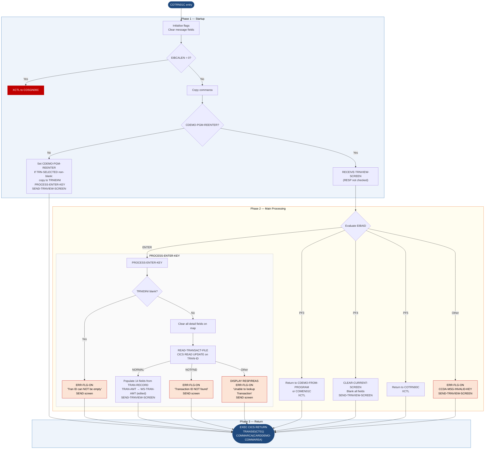

Application : AWS CardDemo
Source File : COTRN01C.cbl
Type        : Online CICS COBOL
Source Banner: Program     : COTRN01C.CBL / Application : CardDemo / Type : CICS COBOL Program / Function    : View a Transaction from TRANSACT file

# COTRN01C — Transaction Detail View Screen

This document describes what the program does in plain English. Field names and paragraph names are preserved exactly as they appear in the COBOL source.

---

## 1. Purpose

COTRN01C is the **Transaction Detail View** screen for the CardDemo application. Given a transaction ID, it reads the matching record from the **TRANSACT** VSAM KSDS file and displays all of its fields on a single screen. The read is issued with the `UPDATE` option, which places an enqueue on the record — **however, the program never writes or rewrites the record**, so the enqueue is released at task end without any modification.

- **Reads from**: `TRANSACT` — the transaction master file accessed by key via `EXEC CICS READ … UPDATE`. Layout from copybook `CVTRA05Y`.
- **Writes to**: No file. All output goes to CICS map `COTRN1A` in mapset `COTRN01`.
- **External programs called**:
  - Returns to the program named in `CDEMO-FROM-PROGRAM` (typically `COTRN00C`) via PF3.
  - `COMEN01C` — used as the PF3 fallback if `CDEMO-FROM-PROGRAM` is blank.
  - `COTRN00C` — explicitly named as PF5 target (line 126).
  - `COSGN00C` — default when commarea length is zero.
- **Transaction ID**: `CT01` (stored in `WS-TRANID`).
- **Commarea**: `CARDDEMO-COMMAREA` (from `COCOM01Y`) plus inline `CDEMO-CT01-INFO` fields.

---

## 2. Program Flow

### 2.1 Startup

**Step 1 — Initialise** *(paragraph `MAIN-PARA`, line 86).* Sets `ERR-FLG-OFF` and `USR-MODIFIED-NO`. Blanks `WS-MESSAGE` and `ERRMSGO OF COTRN1AO`.

**Step 2 — Check EIBCALEN** *(line 94).* Zero commarea means unauthenticated; `XCTL` to `COSGN00C`.

**Step 3 — Copy commarea** *(line 98).* `DFHCOMMAREA(1:EIBCALEN)` copied into `CARDDEMO-COMMAREA`.

**Step 4 — First-entry check** *(line 99).* If `CDEMO-PGM-REENTER` is false:
- Sets `CDEMO-PGM-REENTER` to true.
- Clears `COTRN1AO` to `LOW-VALUES` and sets `TRNIDINL` cursor to `-1`.
- If `CDEMO-CT01-TRN-SELECTED` (the transaction ID passed from `COTRN00C`) is non-blank, copies it into `TRNIDINI OF COTRN1AI` and calls `PROCESS-ENTER-KEY` to immediately fetch and display the record.
- Calls `SEND-TRNVIEW-SCREEN` to render the result.

### 2.2 Main Processing

On re-entry (`CDEMO-PGM-REENTER` true), calls `RECEIVE-TRNVIEW-SCREEN` then evaluates `EIBAID`:

**ENTER key** — calls `PROCESS-ENTER-KEY` (line 113).

`PROCESS-ENTER-KEY` (line 144):
1. If `TRNIDINI OF COTRN1AI` is blank or low-values, sets `ERR-FLG-ON` and shows `'Tran ID can NOT be empty...'`. Otherwise continues.
2. If not in error, clears all detail fields in the input map (`TRNIDI`, `CARDNUMI`, `TTYPCDI`, `TCATCDI`, `TRNSRCI`, `TRNAMTI`, `TDESCI`, `TORIGDTI`, `TPROCDTI`, `MIDI`, `MNAMEI`, `MCITYI`, `MZIPI`), then calls `READ-TRANSACT-FILE` with the entered `TRAN-ID`.
3. If no error after the read, populates the map with all fourteen transaction fields from `TRAN-RECORD` (via `CVTRA05Y`): `TRAN-ID`, `TRAN-CARD-NUM`, `TRAN-TYPE-CD`, `TRAN-CAT-CD`, `TRAN-SOURCE`, formatted `WS-TRAN-AMT`, `TRAN-DESC`, `TRAN-ORIG-TS`, `TRAN-PROC-TS`, `TRAN-MERCHANT-ID`, `TRAN-MERCHANT-NAME`, `TRAN-MERCHANT-CITY`, `TRAN-MERCHANT-ZIP`. Then sends the screen.

**PF3 key** — returns to `CDEMO-FROM-PROGRAM` if set; otherwise to `COMEN01C` (line 116–122).

**PF4 key** — calls `CLEAR-CURRENT-SCREEN` (line 124): calls `INITIALIZE-ALL-FIELDS` to blank all input fields and clears `WS-MESSAGE`, then sends the screen.

**PF5 key** — transfers to `COTRN00C` (the transaction list) via `RETURN-TO-PREV-SCREEN` (line 126).

**Any other key** — sets `ERR-FLG-ON`, `WS-MESSAGE = CCDA-MSG-INVALID-KEY`, and sends the screen.

`READ-TRANSACT-FILE` (line 267):
- Issues `EXEC CICS READ DATASET('TRANSACT') UPDATE` keyed on `TRAN-ID`.
- `DFHRESP(NORMAL)` — success; record is in `TRAN-RECORD`.
- `DFHRESP(NOTFND)` — sets `ERR-FLG-ON`, message `'Transaction ID NOT found...'`, sends screen.
- Any other — `DISPLAY 'RESP:' WS-RESP-CD 'REAS:' WS-REAS-CD`, sets `ERR-FLG-ON`, message `'Unable to lookup Transaction...'`, sends screen.

### 2.3 Shutdown / Return

After all processing at the bottom of `MAIN-PARA` (line 136):

```
EXEC CICS RETURN TRANSID(WS-TRANID) COMMAREA(CARDDEMO-COMMAREA)
```

Re-arms transaction `CT01`.

---

## 3. Error Handling

### 3.1 `READ-TRANSACT-FILE` (line 267)

- `DFHRESP(NORMAL)` — success.
- `DFHRESP(NOTFND)` — message `'Transaction ID NOT found...'`, cursor on `TRNIDINL`.
- Any other — `DISPLAY 'RESP:' WS-RESP-CD 'REAS:' WS-REAS-CD`, message `'Unable to lookup Transaction...'`.

### 3.2 `RECEIVE-TRNVIEW-SCREEN` (line 230)

Issues `EXEC CICS RECEIVE` capturing `RESP` and `RESP2` but **never checks them**. A terminal error would be silently ignored.

### 3.3 `RETURN-TO-PREV-SCREEN` (line 197)

Defaults `CDEMO-TO-PROGRAM` to `COSGN00C` if blank; issues `EXEC CICS XCTL`.

---

## 4. Migration Notes

1. **`READ-TRANSACT-FILE` uses the `UPDATE` option but never rewrites or unlocks the record (line 269–278).** The enqueue on the transaction record is held until the CICS task ends. Under a pseudo-conversational model this is one screen interaction, but if the user leaves the screen open (session idle) the record remains locked. Java migration should use a non-update read for display-only operations.

2. **`RECEIVE-TRNVIEW-SCREEN` never checks `WS-RESP-CD` (line 232–238).** Any CICS receive error is silently ignored and the program proceeds with stale map data.

3. **`WS-USR-MODIFIED` is declared (line 45–47) but never set to `'Y'` anywhere in the program (line 89 sets it to `'N'` at startup).** The field and its 88-levels `USR-MODIFIED-YES` / `USR-MODIFIED-NO` are dead code — never read after being set to `'N'`. This may be a template artifact from a program that does update records.

4. **Unused commarea fields from `COCOM01Y`**: `CDEMO-CUST-ID`, `CDEMO-CUST-FNAME`, `CDEMO-CUST-MNAME`, `CDEMO-CUST-LNAME`, `CDEMO-ACCT-ID`, `CDEMO-ACCT-STATUS`, `CDEMO-CARD-NUM`, `CDEMO-LAST-MAP`, `CDEMO-LAST-MAPSET` are present in the commarea but never read or written by this program.

5. **`CDEMO-CT01-INFO` fields** (`CDEMO-CT01-TRNID-FIRST`, `CDEMO-CT01-TRNID-LAST`, `CDEMO-CT01-PAGE-NUM`, `CDEMO-CT01-NEXT-PAGE-FLG`, `CDEMO-CT01-TRN-SEL-FLG`) are defined after `COPY COCOM01Y` but **never used** in COTRN01C's own logic. They exist to mirror the structure of `CDEMO-CT00-INFO` in `COTRN00C` and to avoid commarea field displacement when the commarea is shared.

6. **`TRAN-AMT` is moved to `WS-TRAN-AMT` (PIC `+99999999.99`) and displayed as `TRNAMTI` (line 183).** This is an edited display string. Java migration must treat transaction amounts as `BigDecimal`, not `double`.

7. **Unused fields from `CVTRA05Y`**: All fields are displayed by this program. There are no unused transaction fields in COTRN01C.

8. **`SEND-TRNVIEW-SCREEN` always sends with `ERASE` (line 219–225).** Unlike `COTRN00C`, there is no conditional erase flag. Every send clears the screen.

---

## Appendix A — Files

| Logical Name | DDname | Organization | Recording | Key Field | Direction | Contents |
|---|---|---|---|---|---|---|
| `TRANSACT` (CICS dataset) | `TRANSACT` | VSAM KSDS — indexed, keyed access | Fixed | `TRAN-ID` PIC X(16) | Input — keyed read with UPDATE enqueue | Transaction master. One 350-byte record. Layout from `CVTRA05Y`. |

---

## Appendix B — Copybooks and External Programs

### Copybook `COCOM01Y` (WORKING-STORAGE SECTION, line 52)

Same as documented in BIZ-COTRN00C.md. Key field used: `CDEMO-FROM-PROGRAM` (to determine PF3 return target), `CDEMO-PGM-REENTER`, `CDEMO-PGM-CONTEXT`.

**Program-local commarea extension** (lines 53–61, inline after `COPY COCOM01Y`):

| Field | PIC | Bytes | Notes |
|---|---|---|---|
| `CDEMO-CT01-TRNID-FIRST` | `X(16)` | 16 | **Not used by COTRN01C** |
| `CDEMO-CT01-TRNID-LAST` | `X(16)` | 16 | **Not used by COTRN01C** |
| `CDEMO-CT01-PAGE-NUM` | `9(08)` | 8 | **Not used by COTRN01C** |
| `CDEMO-CT01-NEXT-PAGE-FLG` | `X(01)` | 1 | **Not used by COTRN01C** |
| `CDEMO-CT01-TRN-SEL-FLG` | `X(01)` | 1 | **Not used by COTRN01C** |
| `CDEMO-CT01-TRN-SELECTED` | `X(16)` | 16 | Transaction ID passed from `COTRN00C`; used on first entry to pre-fill the search key |

### Copybook `CVTRA05Y` (WORKING-STORAGE SECTION, line 69)

Defines `TRAN-RECORD` — 350 bytes. Source file: `CVTRA05Y.cpy`. All fields are displayed by this program.

| Field | PIC | Bytes | Notes |
|---|---|---|---|
| `TRAN-ID` | `X(16)` | 16 | Primary key; used as RIDFLD and displayed |
| `TRAN-TYPE-CD` | `X(02)` | 2 | Transaction type code |
| `TRAN-CAT-CD` | `9(04)` | 4 | Category code |
| `TRAN-SOURCE` | `X(10)` | 10 | Source channel |
| `TRAN-DESC` | `X(100)` | 100 | Description |
| `TRAN-AMT` | `S9(09)V99` | 11 | Amount — moved to `WS-TRAN-AMT` (PIC `+99999999.99`) for display |
| `TRAN-MERCHANT-ID` | `9(09)` | 9 | Merchant ID |
| `TRAN-MERCHANT-NAME` | `X(50)` | 50 | Merchant name |
| `TRAN-MERCHANT-CITY` | `X(50)` | 50 | Merchant city |
| `TRAN-MERCHANT-ZIP` | `X(10)` | 10 | Merchant ZIP |
| `TRAN-CARD-NUM` | `X(16)` | 16 | Card number |
| `TRAN-ORIG-TS` | `X(26)` | 26 | Origination timestamp |
| `TRAN-PROC-TS` | `X(26)` | 26 | Processing timestamp |
| `FILLER` | `X(20)` | 20 | Reserved — **not used** |

### Copybook `COTTL01Y` — see BIZ-COTRN00C.md. `CCDA-THANK-YOU` not used.

### Copybook `CSDAT01Y` — see BIZ-COTRN00C.md. `WS-CURTIME-MILSEC` not used.

### Copybook `CSMSG01Y` — see BIZ-COTRN00C.md. `CCDA-MSG-THANK-YOU` not used.

### Copybook `COTRN01` (WORKING-STORAGE SECTION, line 63)

BMS-generated copybook defining `COTRN1AI` and `COTRN1AO` for map `COTRN1A` / mapset `COTRN01`. Key fields:

| Field | Direction | Notes |
|---|---|---|
| `TRNIDINI` / `TRNIDINL` | Input | Transaction ID search key; cursor position |
| `TRNIDI` | Output | Displayed transaction ID |
| `CARDNUMI` | Output | Card number |
| `TTYPCDI` | Output | Type code |
| `TCATCDI` | Output | Category code |
| `TRNSRCI` | Output | Source |
| `TRNAMTI` | Output | Formatted amount |
| `TDESCI` | Output | Description |
| `TORIGDTI` | Output | Origination timestamp |
| `TPROCDTI` | Output | Processing timestamp |
| `MIDI` | Output | Merchant ID |
| `MNAMEI` | Output | Merchant name |
| `MCITYI` | Output | Merchant city |
| `MZIPI` | Output | Merchant ZIP |
| `ERRMSGO OF COTRN1AO` | Output | Error/status message |

---

## Appendix C — Hardcoded Literals

| Paragraph | Line | Value | Usage | Classification |
|---|---|---|---|---|
| `MAIN-PARA` | 95 | `'COSGN00C'` | Default XCTL target when EIBCALEN = 0 | System constant |
| `MAIN-PARA` | 136 | `'CT01'` | Rearm transaction ID | System constant |
| `PROCESS-ENTER-KEY` | 149 | `'Tran ID can NOT be empty...'` | Validation error | Display message |
| `PROCESS-ENTER-KEY` | 155 | `'Y'` | `WS-ERR-FLG` set value | System constant |
| `RETURN-TO-PREV-SCREEN` | 200 | `'COSGN00C'` | Fallback XCTL target | System constant |
| `PROCESS-ENTER-KEY` | 117 | `'COMEN01C'` | PF3 fallback return target | System constant |
| `MAIN-PARA` | 126 | `'COTRN00C'` | PF5 target — return to list | System constant |
| `READ-TRANSACT-FILE` | 284 | `'Transaction ID NOT found...'` | Not-found message | Display message |
| `READ-TRANSACT-FILE` | 292 | `'Unable to lookup Transaction...'` | Generic read error | Display message |
| `WS-VARIABLES` | 37 | `'CT01'` | This program's transaction ID | System constant |
| `WS-VARIABLES` | 36 | `'COTRN01C'` | This program's name | System constant |
| `WS-VARIABLES` | 39 | `'TRANSACT'` | CICS dataset name | System constant |

---

## Appendix D — Internal Working Fields

| Field | PIC | Bytes | Purpose |
|---|---|---|---|
| `WS-PGMNAME` | `X(08)` | 8 | Program name for map header |
| `WS-TRANID` | `X(04)` | 4 | Transaction ID `CT01` for CICS RETURN |
| `WS-MESSAGE` | `X(80)` | 80 | Current user message; copied to `ERRMSGO` |
| `WS-TRANSACT-FILE` | `X(08)` | 8 | CICS dataset name `'TRANSACT'` |
| `WS-ERR-FLG` | `X(01)` | 1 | Error flag; `'Y'` = error |
| `WS-RESP-CD` | `S9(09) COMP` | 4 | CICS RESP code |
| `WS-REAS-CD` | `S9(09) COMP` | 4 | CICS RESP2 code |
| `WS-USR-MODIFIED` | `X(01)` | 1 | **Dead code** — set to `'N'` at startup and never changed; both 88-levels are unused |
| `WS-TRAN-AMT` | `+99999999.99` | 12 | Edited display amount |
| `WS-TRAN-DATE` | `X(08)` | 8 | Declared but **never populated** in COTRN01C; the timestamp is sent raw |

---

## Appendix E — Execution at a Glance



---

*Source: `COTRN01C.cbl`, CardDemo, Apache 2.0 license. Copybooks: `COCOM01Y.cpy`, `COTRN01` (BMS), `COTTL01Y.cpy`, `CSDAT01Y.cpy`, `CSMSG01Y.cpy`, `CVTRA05Y.cpy`, `DFHAID`, `DFHBMSCA`.*
