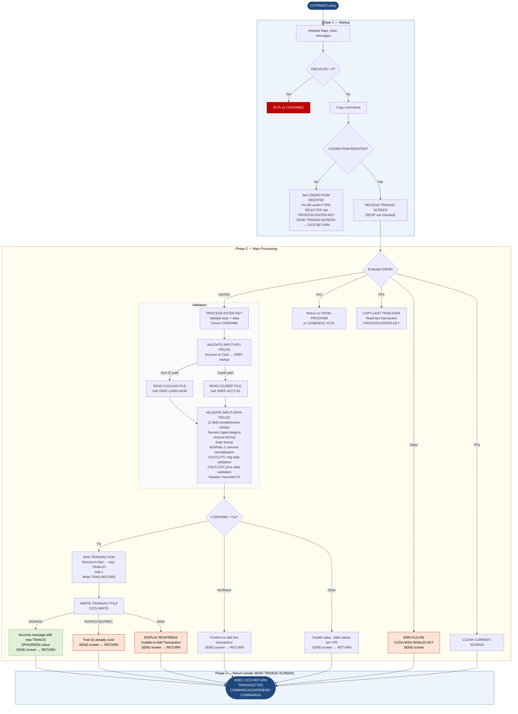

Application : AWS CardDemo
Source File : COTRN02C.cbl
Type        : Online CICS COBOL
Source Banner: Program     : COTRN02C.CBL / Application : CardDemo / Type : CICS COBOL Program / Function    : Add a new Transaction to TRANSACT file

# COTRN02C — Add Transaction Screen

This document describes what the program does in plain English. All field names, paragraph names, and literal strings are reproduced exactly as they appear in the source.

---

## 1. Purpose

COTRN02C is the **Add Transaction** online screen for the CardDemo application. The operator enters either an account ID or a card number, then fills in transaction details (type, category, source, amount, description, dates, merchant information). After validating all inputs and confirming with `Y`, the program generates a new transaction ID by reading the highest existing ID in `TRANSACT` and adding one, then writes the new record.

- **Reads from**:
  - `TRANSACT` (CICS dataset) — browsed in reverse to find the highest existing transaction ID; the new record is also written here.
  - `CXACAIX` (CICS dataset) — the Account-to-Card cross-reference alternate index; keyed by account ID (`XREF-ACCT-ID`) to retrieve the card number.
  - `CCXREF` (CICS dataset) — the Card-to-Account cross-reference; keyed by card number (`XREF-CARD-NUM`) to retrieve the account ID.
- **Writes to**: `TRANSACT` — one new transaction record written with `EXEC CICS WRITE`.
- **External programs called**:
  - `CSUTLDTC` — a date validation sub-program called twice (once for origination date, once for processing date). Parameters are a date string, a format mask, and a result/severity area. The result is checked for severity `'0000'` and message number `'2513'`.
  - `COMEN01C` — PF3 fallback return target.
  - `COSGN00C` — invoked when commarea is empty.
- **Transaction ID**: `CT02`.
- **Commarea**: `CARDDEMO-COMMAREA` (from `COCOM01Y`) plus inline `CDEMO-CT02-INFO`.

---

## 2. Program Flow

### 2.1 Startup

**Step 1 — Initialise** *(paragraph `MAIN-PARA`, line 107).* Sets `ERR-FLG-OFF` and `USR-MODIFIED-NO`. Blanks `WS-MESSAGE` and `ERRMSGO OF COTRN2AO`.

**Step 2 — EIBCALEN check** *(line 115).* Zero → `XCTL` to `COSGN00C`.

**Step 3 — Copy commarea** *(line 119).*

**Step 4 — First-entry check** *(line 120).* If not yet re-entered:
- Sets `CDEMO-PGM-REENTER` to true.
- Clears `COTRN2AO` to `LOW-VALUES`, sets `ACTIDINL` cursor to `-1`.
- If `CDEMO-CT02-TRN-SELECTED` is non-blank, copies it into `CARDNINI OF COTRN2AI` (treated as a card number pre-fill) and calls `PROCESS-ENTER-KEY`.
- Calls `SEND-TRNADD-SCREEN`.

### 2.2 Main Processing

On re-entry, calls `RECEIVE-TRNADD-SCREEN` then evaluates `EIBAID`:

**ENTER key** → `PROCESS-ENTER-KEY`.

**PF3 key** → `RETURN-TO-PREV-SCREEN` to `CDEMO-FROM-PROGRAM` or `COMEN01C`.

**PF4 key** → `CLEAR-CURRENT-SCREEN` (blanks all fields, sends screen).

**PF5 key** → `COPY-LAST-TRAN-DATA`: validates key fields, finds the last transaction in `TRANSACT`, copies its type/category/source/amount/description/dates/merchant fields into the input map, then calls `PROCESS-ENTER-KEY`.

**Any other key** → `ERR-FLG-ON`, `CCDA-MSG-INVALID-KEY`, sends screen.

`PROCESS-ENTER-KEY` (line 164):
1. Calls `VALIDATE-INPUT-KEY-FIELDS`.
2. Calls `VALIDATE-INPUT-DATA-FIELDS`.
3. Evaluates `CONFIRMI OF COTRN2AI`:
   - `'Y'` or `'y'` → calls `ADD-TRANSACTION`.
   - `'N'`, `'n'`, spaces, or low-values → sets `ERR-FLG-ON`, message `'Confirm to add this transaction...'`, cursor on `CONFIRML`, sends screen.
   - Any other → sets `ERR-FLG-ON`, message `'Invalid value. Valid values are (Y/N)...'`, sends screen.

`VALIDATE-INPUT-KEY-FIELDS` (line 193):
- If `ACTIDINI OF COTRN2AI` is non-blank:
  1. Validates it is numeric; if not, message `'Account ID must be Numeric...'`.
  2. Computes numeric value into `WS-ACCT-ID-N`, moves to `XREF-ACCT-ID`.
  3. Calls `READ-CXACAIX-FILE` to look up account in the AIX.
  4. On success, copies `XREF-CARD-NUM` from the cross-reference into `CARDNINI OF COTRN2AI`.
- Else if `CARDNINI OF COTRN2AI` is non-blank:
  1. Validates it is numeric; if not, message `'Card Number must be Numeric...'`.
  2. Computes numeric value into `WS-CARD-NUM-N`, moves to `XREF-CARD-NUM`.
  3. Calls `READ-CCXREF-FILE` to look up card.
  4. On success, copies `XREF-ACCT-ID` into `ACTIDINI OF COTRN2AI`.
- Else → message `'Account or Card Number must be entered...'`.

`VALIDATE-INPUT-DATA-FIELDS` (line 235):
1. If `ERR-FLG-ON`, clears all data fields (`TTYPCDI`, `TCATCDI`, `TRNSRCI`, `TRNAMTI`, `TDESCI`, `TORIGDTI`, `TPROCDTI`, `MIDI`, `MNAMEI`, `MCITYI`, `MZIPI`).
2. Checks each of the eleven data fields is non-blank; stops at the first empty field with a specific message.
3. Validates `TTYPCDI` and `TCATCDI` are numeric.
4. Validates amount format: `TRNAMTI(1:1)` must be `'-'` or `'+'`; characters 2–9 numeric; character 10 must be `'.'`; characters 11–12 numeric. If any condition fails, message `'Amount should be in format -99999999.99'`.
5. Validates origination date `TORIGDTI` character by character: positions 1–4 numeric, position 5 = `'-'`, positions 6–7 numeric, position 8 = `'-'`, positions 9–10 numeric. Failure message: `'Orig Date should be in format YYYY-MM-DD'`.
6. Same structural validation for processing date `TPROCDTI`.
7. Normalises the amount: computes `WS-TRAN-AMT-N` from `FUNCTION NUMVAL-C(TRNAMTI)`, formats it into `WS-TRAN-AMT-E` (PIC `+99999999.99`), writes back to `TRNAMTI`.
8. Calls `CSUTLDTC` for origination date with format mask `'YYYY-MM-DD'`. If severity is not `'0000'` and message number is not `'2513'`, message `'Orig Date - Not a valid date...'`.
9. Calls `CSUTLDTC` again for processing date. Same logic.
10. Validates `MIDI OF COTRN2AI` is numeric; if not, message `'Merchant ID must be Numeric...'`.

`ADD-TRANSACTION` (line 442):
1. Sets `TRAN-ID` to `HIGH-VALUES` and calls `STARTBR-TRANSACT-FILE`, `READPREV-TRANSACT-FILE`, `ENDBR-TRANSACT-FILE` to read the last (highest-key) transaction.
2. Copies `TRAN-ID` into `WS-TRAN-ID-N` (PIC `9(16)`), adds 1, then sets that as the new `TRAN-ID`.
3. Initialises `TRAN-RECORD` and populates all fields from the screen map.
4. Calls `WRITE-TRANSACT-FILE`.

`WRITE-TRANSACT-FILE` (line 711):
- `DFHRESP(NORMAL)` — calls `INITIALIZE-ALL-FIELDS`, sets the success message via `STRING`: `'Transaction added successfully. '` + `' Your Tran ID is '` + `TRAN-ID` + `'.'` → `WS-MESSAGE`. Sets `ERRMSGC OF COTRN2AO` to `DFHGREEN`. Sends screen.
- `DFHRESP(DUPKEY)` or `DFHRESP(DUPREC)` — message `'Tran ID already exist...'`.
- Any other — `DISPLAY 'RESP:' WS-RESP-CD 'REAS:' WS-REAS-CD`, message `'Unable to Add Transaction...'`.

### 2.3 Shutdown / Return

`SEND-TRNADD-SCREEN` (line 516) issues **its own** `EXEC CICS RETURN TRANSID(WS-TRANID) COMMAREA(CARDDEMO-COMMAREA)` at line 530–534 after the SEND. This means the program returns to CICS from within `SEND-TRNADD-SCREEN` rather than from the bottom of `MAIN-PARA`. The `EXEC CICS RETURN` at line 156–159 (bottom of `MAIN-PARA`) is only reached if no `SEND-TRNADD-SCREEN` was called, which in practice means `XCTL` paths have already departed.

---

## 3. Error Handling

### 3.1 `READ-CXACAIX-FILE` (line 576)

- `DFHRESP(NORMAL)` — success.
- `DFHRESP(NOTFND)` — `ERR-FLG-ON`, message `'Account ID NOT found...'`, cursor on `ACTIDINL`.
- Any other — `DISPLAY 'RESP:' WS-RESP-CD 'REAS:' WS-REAS-CD`, message `'Unable to lookup Acct in XREF AIX file...'`.

### 3.2 `READ-CCXREF-FILE` (line 609)

- `DFHRESP(NORMAL)` — success.
- `DFHRESP(NOTFND)` — message `'Card Number NOT found...'`, cursor on `CARDNINL`.
- Any other — `DISPLAY 'RESP:' WS-RESP-CD 'REAS:' WS-REAS-CD`, message `'Unable to lookup Card # in XREF file...'`.

### 3.3 `STARTBR-TRANSACT-FILE` (line 642)

- `DFHRESP(NORMAL)` — success.
- `DFHRESP(NOTFND)` — sets `ERR-FLG-ON`, message `'Transaction ID NOT found...'`.
- Any other — `DISPLAY`, `ERR-FLG-ON`, message `'Unable to lookup Transaction...'`.

### 3.4 `READPREV-TRANSACT-FILE` (line 673)

- `DFHRESP(NORMAL)` — success.
- `DFHRESP(ENDFILE)` — sets `TRAN-ID` to `ZEROS` (empty file case).
- Any other — `DISPLAY`, `ERR-FLG-ON`, message `'Unable to lookup Transaction...'`.

### 3.5 `WRITE-TRANSACT-FILE` (line 711)

Described above.

### 3.6 `CSUTLDTC` Call

The external program is called with three parameters: date string (10 bytes), format mask (10 bytes), and result area (`CSUTLDTC-RESULT`). The program only checks `CSUTLDTC-RESULT-SEV-CD` for `'0000'` and `CSUTLDTC-RESULT-MSG-NUM` for `'2513'`. The `CSUTLDTC-RESULT-MSG` (61 bytes) text is **never displayed or logged**.

---

## 4. Migration Notes

1. **The transaction ID generation is not safe for concurrent users (lines 444–451).** The method STARTBR → READPREV (to find highest key) → add 1 is not atomic. Two concurrent users running `ADD-TRANSACTION` simultaneously can compute the same `WS-TRAN-ID-N`. The subsequent WRITE would fail with `DUPREC` for one of them, but the user gets an opaque error message `'Tran ID already exist...'` with no automatic retry. Java migration needs a proper sequence generator (e.g., database sequence, Redis atomic increment).

2. **`SEND-TRNADD-SCREEN` issues `EXEC CICS RETURN` internally (line 530–534).** Any code in `MAIN-PARA` after a call to `SEND-TRNADD-SCREEN` is unreachable. The `EXEC CICS RETURN` at the bottom of `MAIN-PARA` (line 156–159) is only reached on XCTL paths. Java migration must account for this control flow.

3. **Amount validation uses a WHEN clause with four conditions that are all independent WHEN branches (lines 339–348).** In COBOL `EVALUATE TRUE`, each `WHEN` is evaluated independently and the first true one wins. All four format checks are separate `WHEN` branches. This means if the sign character is wrong, the numeric check is not reached. Java migration should consolidate these into a single regex or parsing routine.

4. **The format validation accepts only explicit `'-'` or `'+'` as the sign character (line 340).** A bare unsigned number like `'00000100.00'` would fail. Java migration must document this requirement.

5. **`CSUTLDTC` message number `'2513'` is silently accepted as valid (lines 399–406, 419–426).** The code `!= '2513'` means "if it is not message 2513, report an error". Message 2513 appears to indicate a valid date but some non-zero severity (possibly a warning). The exact meaning of CSUTLDTC message 2513 must be established before migration; silently accepting it could allow dates that are technically problematic.

6. **`CSUTLDTC-RESULT-MSG` (61 bytes) is never displayed (lines 67–69).** If validation fails, only the severity code and message number are checked; the human-readable error text from `CSUTLDTC` is discarded. Java migration should log this for diagnostics.

7. **`WS-ACCTDAT-FILE` (line 40, value `'ACCTDAT '`) is declared but never used.** The program never reads the account master directly; it only uses the cross-reference files. This is a dead field.

8. **Unused fields from `CVACT01Y`**: The `ACCOUNT-RECORD` structure is available via `COPY CVACT01Y` but no fields from it are used in procedure logic. The account data comes from `CARD-XREF-RECORD` (via `CVACT03Y`), not from the account master.

9. **`TRAN-AMT` is `S9(09)V99` (signed, 11 display bytes) — not COMP-3.** Java migration should map to `BigDecimal` scaled to 2 decimal places.

10. **`XREF-CUST-ID` (9 bytes, from `CVACT03Y`) is read as part of `CARD-XREF-RECORD` but never used.** Only `XREF-CARD-NUM` and `XREF-ACCT-ID` are referenced.

11. **The `CDEMO-CT02-INFO` inline fields are mirror structures of `CDEMO-CT00-INFO` and are not used in processing.** They are present to keep the commarea layout consistent across CT00/CT01/CT02 programs.

---

## Appendix A — Files

| Logical Name | DDname | Organization | Recording | Key Field | Direction | Contents |
|---|---|---|---|---|---|---|
| `TRANSACT` (CICS) | `TRANSACT` | VSAM KSDS | Fixed | `TRAN-ID` PIC X(16) | I-O — browse (READPREV to find max key) + WRITE | Transaction master. 350-byte records. |
| `CXACAIX` (CICS) | `CXACAIX` | VSAM AIX on CCXREF, keyed by account ID | Fixed | `XREF-ACCT-ID` PIC 9(11) | Input — keyed read | Account-to-card cross-reference alternate index |
| `CCXREF` (CICS) | `CCXREF` | VSAM KSDS, keyed by card number | Fixed | `XREF-CARD-NUM` PIC X(16) | Input — keyed read | Card-to-account cross-reference |

---

## Appendix B — Copybooks and External Programs

### Copybook `COCOM01Y` (WORKING-STORAGE SECTION, line 71)

See BIZ-COTRN00C.md for full field list. Program-local `CDEMO-CT02-INFO` extension (lines 72–80): mirrors `CDEMO-CT00-INFO` with `CDEMO-CT02-*` names but **none of these fields are used in COTRN02C's logic**.

### Copybook `CVTRA05Y` (WORKING-STORAGE SECTION, line 88)

Defines `TRAN-RECORD` (350 bytes). All fields are populated before the WRITE. See BIZ-COTRN00C.md for full field list. Note: `TRAN-AMT` is `S9(09)V99` — signed display, not COMP-3.

### Copybook `CVACT01Y` (WORKING-STORAGE SECTION, line 89)

Defines `ACCOUNT-RECORD` (300 bytes). Source file: `CVACT01Y.cpy`.

| Field | PIC | Bytes | Notes |
|---|---|---|---|
| `ACCT-ID` | `9(11)` | 11 | Account number — **not used by COTRN02C** |
| `ACCT-ACTIVE-STATUS` | `X(01)` | 1 | **not used by COTRN02C** |
| `ACCT-CURR-BAL` | `S9(10)V99` | 12 | **not used by COTRN02C** |
| `ACCT-CREDIT-LIMIT` | `S9(10)V99` | 12 | **not used by COTRN02C** |
| `ACCT-CASH-CREDIT-LIMIT` | `S9(10)V99` | 12 | **not used by COTRN02C** |
| `ACCT-OPEN-DATE` | `X(10)` | 10 | **not used by COTRN02C** |
| `ACCT-EXPIRAION-DATE` | `X(10)` | 10 | Typo in source — **not used by COTRN02C** |
| `ACCT-REISSUE-DATE` | `X(10)` | 10 | **not used by COTRN02C** |
| `ACCT-CURR-CYC-CREDIT` | `S9(10)V99` | 12 | **not used by COTRN02C** |
| `ACCT-CURR-CYC-DEBIT` | `S9(10)V99` | 12 | **not used by COTRN02C** |
| `ACCT-ADDR-ZIP` | `X(10)` | 10 | **not used by COTRN02C** |
| `ACCT-GROUP-ID` | `X(10)` | 10 | **not used by COTRN02C** |
| `FILLER` | `X(178)` | 178 | **not used by COTRN02C** |

**All fields in `CVACT01Y` are unused by COTRN02C.** The copybook is included but the account record is never read.

### Copybook `CVACT03Y` (WORKING-STORAGE SECTION, line 90)

Defines `CARD-XREF-RECORD` (50 bytes). Source file: `CVACT03Y.cpy`.

| Field | PIC | Bytes | Notes |
|---|---|---|---|
| `XREF-CARD-NUM` | `X(16)` | 16 | Card number; used as RIDFLD for `READ-CCXREF-FILE` and returned after account lookup |
| `XREF-CUST-ID` | `9(09)` | 9 | Customer ID — **not used by COTRN02C** |
| `XREF-ACCT-ID` | `9(11)` | 11 | Account ID; used as RIDFLD for `READ-CXACAIX-FILE` and returned after card lookup |
| `FILLER` | `X(14)` | 14 | **not used** |

### Copybook `COTRN02` (WORKING-STORAGE SECTION, line 82)

BMS-generated. Defines `COTRN2AI` and `COTRN2AO` for map `COTRN2A` / mapset `COTRN02`. Key fields:

| Field | Direction | Notes |
|---|---|---|
| `ACTIDINI` / `ACTIDINL` | Input | Account ID entry field |
| `CARDNINI` / `CARDNINL` | Input | Card number entry field |
| `TTYPCDI` / `TTYPCDL` | Input | Transaction type code |
| `TCATCDI` / `TCATCDL` | Input | Category code |
| `TRNSRCI` / `TRNSRCL` | Input | Source |
| `TRNAMTI` / `TRNAMTL` | Input | Amount (formatted) |
| `TDESCI` / `TDESCL` | Input | Description |
| `TORIGDTI` / `TORIGDTL` | Input | Origination date |
| `TPROCDTI` / `TPROCDTL` | Input | Processing date |
| `MIDI` / `MIDL` | Input | Merchant ID |
| `MNAMEI` / `MNAMEL` | Input | Merchant name |
| `MCITYI` / `MCITYL` | Input | Merchant city |
| `MZIPI` / `MZIPL` | Input | Merchant ZIP |
| `CONFIRMI` / `CONFIRML` | Input | Confirmation field (`Y`/`N`) |
| `ERRMSGO` / `ERRMSGC` | Output | Error message and colour attribute |

### External Program `CSUTLDTC`

| Item | Detail |
|---|---|
| Type | COBOL or assembler utility; called via static `CALL 'CSUTLDTC'` |
| Called from | `VALIDATE-INPUT-DATA-FIELDS`, lines 393 and 413 |
| Input passed | `CSUTLDTC-DATE` (10 bytes — the date string), `CSUTLDTC-DATE-FORMAT` (10 bytes — `'YYYY-MM-DD'`), `CSUTLDTC-RESULT` (80 bytes — cleared before call) |
| Output returned | `CSUTLDTC-RESULT-SEV-CD` (4 bytes — severity, `'0000'` = OK), `CSUTLDTC-RESULT-MSG-NUM` (4 bytes — message number), `CSUTLDTC-RESULT-MSG` (61 bytes — human-readable message) |
| Error handling gap | `CSUTLDTC-RESULT-MSG` is never read or displayed. Message number `'2513'` is silently treated as valid. The exact semantics of message 2513 must be confirmed before migration. |

---

## Appendix C — Hardcoded Literals

| Paragraph | Line | Value | Usage | Classification |
|---|---|---|---|---|
| `MAIN-PARA` | 116 | `'COSGN00C'` | Unauthenticated fallback | System constant |
| `VALIDATE-INPUT-KEY-FIELDS` | 199 | `'Account ID must be Numeric...'` | Validation message | Display message |
| `VALIDATE-INPUT-KEY-FIELDS` | 213 | `'Card Number must be Numeric...'` | Validation message | Display message |
| `VALIDATE-INPUT-KEY-FIELDS` | 226 | `'Account or Card Number must be entered...'` | Validation message | Display message |
| `VALIDATE-INPUT-DATA-FIELDS` | 254 | `'Type CD can NOT be empty...'` | Validation message | Display message |
| `VALIDATE-INPUT-DATA-FIELDS` | 260 | `'Category CD can NOT be empty...'` | Validation message | Display message |
| `VALIDATE-INPUT-DATA-FIELDS` | 265 | `'Source can NOT be empty...'` | Validation message | Display message |
| `VALIDATE-INPUT-DATA-FIELDS` | 271 | `'Description can NOT be empty...'` | Validation message | Display message |
| `VALIDATE-INPUT-DATA-FIELDS` | 277 | `'Amount can NOT be empty...'` | Validation message | Display message |
| `VALIDATE-INPUT-DATA-FIELDS` | 283 | `'Orig Date can NOT be empty...'` | Validation message | Display message |
| `VALIDATE-INPUT-DATA-FIELDS` | 289 | `'Proc Date can NOT be empty...'` | Validation message | Display message |
| `VALIDATE-INPUT-DATA-FIELDS` | 295 | `'Merchant ID can NOT be empty...'` | Validation message | Display message |
| `VALIDATE-INPUT-DATA-FIELDS` | 301 | `'Merchant Name can NOT be empty...'` | Validation message | Display message |
| `VALIDATE-INPUT-DATA-FIELDS` | 307 | `'Merchant City can NOT be empty...'` | Validation message | Display message |
| `VALIDATE-INPUT-DATA-FIELDS` | 313 | `'Merchant Zip can NOT be empty...'` | Validation message | Display message |
| `VALIDATE-INPUT-DATA-FIELDS` | 325 | `'Type CD must be Numeric...'` | Validation message | Display message |
| `VALIDATE-INPUT-DATA-FIELDS` | 330 | `'Category CD must be Numeric...'` | Validation message | Display message |
| `VALIDATE-INPUT-DATA-FIELDS` | 345 | `'Amount should be in format -99999999.99'` | Format error | Display message |
| `VALIDATE-INPUT-DATA-FIELDS` | 360 | `'Orig Date should be in format YYYY-MM-DD'` | Format error | Display message |
| `VALIDATE-INPUT-DATA-FIELDS` | 375 | `'Proc Date should be in format YYYY-MM-DD'` | Format error | Display message |
| `VALIDATE-INPUT-DATA-FIELDS` | 390 | `'YYYY-MM-DD'` | Date format mask passed to CSUTLDTC | Business rule |
| `VALIDATE-INPUT-DATA-FIELDS` | 401 | `'Orig Date - Not a valid date...'` | CSUTLDTC rejection message | Display message |
| `VALIDATE-INPUT-DATA-FIELDS` | 421 | `'Proc Date - Not a valid date...'` | CSUTLDTC rejection message | Display message |
| `VALIDATE-INPUT-DATA-FIELDS` | 431 | `'Merchant ID must be Numeric...'` | Validation message | Display message |
| `PROCESS-ENTER-KEY` | 178 | `'Confirm to add this transaction...'` | Confirmation prompt | Display message |
| `PROCESS-ENTER-KEY` | 184 | `'Invalid value. Valid values are (Y/N)...'` | Validation message | Display message |
| `WRITE-TRANSACT-FILE` | 728–731 | `'Transaction added successfully. '` + `' Your Tran ID is '` + `'.'` | Success message | Display message |
| `WRITE-TRANSACT-FILE` | 738 | `'Tran ID already exist...'` | Duplicate key error | Display message |
| `WRITE-TRANSACT-FILE` | 745 | `'Unable to Add Transaction...'` | Generic write error | Display message |
| `CSUTLDTC-PARM` | 60 | `'YYYY-MM-DD'` | Default date format | Business rule |
| `WS-VARIABLES` | 37 | `'CT02'` | Transaction ID | System constant |
| `WS-VARIABLES` | 36 | `'COTRN02C'` | Program name | System constant |
| `WS-VARIABLES` | 39 | `'TRANSACT'` | CICS dataset name | System constant |
| `WS-VARIABLES` | 40 | `'ACCTDAT '` | Dataset name — **declared but never used** | Dead field |
| `WS-VARIABLES` | 41 | `'CCXREF  '` | Card xref dataset (note trailing spaces) | System constant |
| `WS-VARIABLES` | 42 | `'CXACAIX '` | Account AIX dataset (note trailing spaces) | System constant |

---

## Appendix D — Internal Working Fields

| Field | PIC | Bytes | Purpose |
|---|---|---|---|
| `WS-PGMNAME` | `X(08)` | 8 | Program name for header |
| `WS-TRANID` | `X(04)` | 4 | Transaction ID `'CT02'` |
| `WS-MESSAGE` | `X(80)` | 80 | User message; copied to `ERRMSGO` |
| `WS-TRANSACT-FILE` | `X(08)` | 8 | `'TRANSACT'` dataset name |
| `WS-ACCTDAT-FILE` | `X(08)` | 8 | `'ACCTDAT '` — **declared but never used** |
| `WS-CCXREF-FILE` | `X(08)` | 8 | `'CCXREF  '` dataset name for card cross-reference |
| `WS-CXACAIX-FILE` | `X(08)` | 8 | `'CXACAIX '` dataset name for account AIX |
| `WS-ERR-FLG` | `X(01)` | 1 | Error flag |
| `WS-RESP-CD` | `S9(09) COMP` | 4 | CICS RESP |
| `WS-REAS-CD` | `S9(09) COMP` | 4 | CICS RESP2 |
| `WS-USR-MODIFIED` | `X(01)` | 1 | **Dead code** — set to `'N'` and never changed |
| `WS-TRAN-AMT` | `+99999999.99` | 12 | Display-format amount |
| `WS-TRAN-DATE` | `X(08)` | 8 | **Declared but never used** in this program |
| `WS-ACCT-ID-N` | `9(11)` | 11 | Numeric account ID from screen |
| `WS-CARD-NUM-N` | `9(16)` | 16 | Numeric card number from screen |
| `WS-TRAN-ID-N` | `9(16)` | 16 | New transaction ID computed as last ID + 1 |
| `WS-TRAN-AMT-N` | `S9(9)V99` | 11 | Numeric amount from `NUMVAL-C` |
| `WS-TRAN-AMT-E` | `+99999999.99` | 12 | Edited amount; used to normalise `TRNAMTI` |
| `WS-DATE-FORMAT` | `X(10)` | 10 | `'YYYY-MM-DD'` — date format mask for CSUTLDTC |
| `CSUTLDTC-PARM` | group | 90 | Parameter block for CSUTLDTC calls |

---

## Appendix E — Execution at a Glance

---

*Source: `COTRN02C.cbl`, CardDemo, Apache 2.0 license. Copybooks: `COCOM01Y.cpy`, `COTRN02` (BMS), `COTTL01Y.cpy`, `CSDAT01Y.cpy`, `CSMSG01Y.cpy`, `CVTRA05Y.cpy`, `CVACT01Y.cpy`, `CVACT03Y.cpy`, `DFHAID`, `DFHBMSCA`. External programs: `CSUTLDTC` (date validation), `COMEN01C`, `COSGN00C`.*
