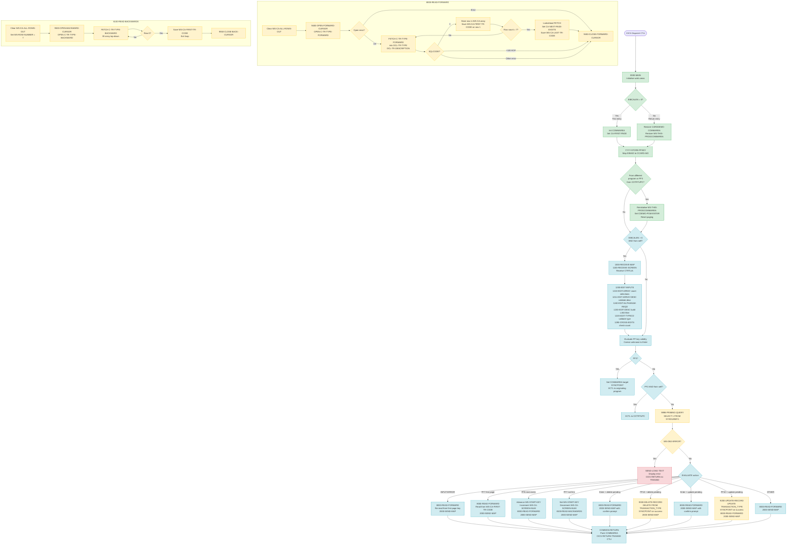

Application : AWS CardDemo
Source File : COTRTLIC.cbl
Type        : Online CICS COBOL
Source Banner: * Program:     COTRTLIC.CBL

---

# BIZ-COTRTLIC — Transaction Type List with DB2 Paging

## Section 1 — Purpose

COTRTLIC presents a pageable list of transaction type codes from the DB2 table `CARDDEMO.TRANSACTION_TYPE`. The operator may optionally filter rows by type code or by a description substring. From the list the operator may select exactly one row and either delete it (action code `D`) or update its description (action code `U`). A two-step confirmation flow is required for both operations: the first Enter press highlights the chosen row and displays a confirmation prompt, and a subsequent PF10 press executes the DB2 `DELETE` or `UPDATE` statement.

**DB2 table accessed:**

| Table | Schema | Access | Purpose |
|---|---|---|---|
| `TRANSACTION_TYPE` | `CARDDEMO` | SELECT / UPDATE / DELETE | Master list of two-digit transaction type codes and their descriptions |

**External programs transferred to:**

| Program | Transaction | Condition |
|---|---|---|
| `COTRTUPC` | `CTTU` | PF2 pressed — transfers to add/update individual type screen |
| `COADM01C` | `CA00` | PF3 pressed with no originating program — returns to admin menu |
| Originating program (from `CDEMO-FROM-PROGRAM`) | `CDEMO-FROM-TRANID` | PF3 pressed when a specific calling program is in COMMAREA |

The program uses the CICS pseudo-conversational pattern. It returns to CICS after every screen interaction with `TRANSID(CTLI)` and passes state via the COMMAREA.

No VSAM files or sequential files are opened by this program. All persistent state is in DB2 and in the COMMAREA.

---

## Section 2 — Program Flow

### 2.1 Startup

1. **`0000-MAIN`** (line 498): PROCEDURE DIVISION entry. `CC-WORK-AREA`, `WS-MISC-STORAGE`, and `WS-COMMAREA` are initialised to LOW-VALUES/zeroes.
2. `WS-TRANID` is set to `'CTLI'` (the literal `LIT-THISTRANID`). The return-message field `WS-RETURN-MSG` is blanked.
3. If `EIBCALEN = 0` (first invocation, no COMMAREA passed): `CARDDEMO-COMMAREA` and `WS-THIS-PROGCOMMAREA` are initialised. `CDEMO-FROM-TRANID` is set to `'CTLI'`, `CDEMO-FROM-PROGRAM` to `'COTRTLIC'`, `CDEMO-USRTYP-ADMIN` is set TRUE, `CDEMO-PGM-ENTER` is set TRUE, `CDEMO-LAST-MAP`/`CDEMO-LAST-MAPSET` are populated, `CA-FIRST-PAGE` and `CA-LAST-PAGE-NOT-SHOWN` are set TRUE.
4. If `EIBCALEN > 0`: the first `LENGTH OF CARDDEMO-COMMAREA` bytes of `DFHCOMMAREA` are moved to `CARDDEMO-COMMAREA`, and the next `LENGTH OF WS-THIS-PROGCOMMAREA` bytes to `WS-THIS-PROGCOMMAREA`.
5. **`YYYY-STORE-PFKEY`** (from CSSTRPFY copybook): the CICS EIB attention identifier (`EIBAID`) is mapped to the 88-level conditions on `CCARD-AID` (ENTER, PFK02, PFK03, PFK07, PFK08, PFK10, etc.).
6. If the program is entered from a different program (not re-entering itself) OR if PF3 was pressed while the originating transaction was `CTTU` (returning from COTRTUPC): `WS-THIS-PROGCOMMAREA` is reinitialised, `CDEMO-PGM-ENTER` set TRUE, `CCARD-AID-ENTER` set TRUE, and paging is reset to page 1.

### 2.2 Main Processing

**Step 1 — Receive user input**

7. If `EIBCALEN > 0` and `CDEMO-FROM-PROGRAM = 'COTRTLIC'` (i.e., this is a return to the same program): **`1000-RECEIVE-MAP`** is called (line 919).
   - **`1100-RECEIVE-SCREEN`** (line 930): CICS RECEIVE MAP `CTRTLIA` / mapset `COTRTLI` reads the BMS map into `CTRTLIAI`. The filter field `TRTYPEI` is moved to `WS-IN-TYPE-CD`; `TRDESCI` is moved to `WS-IN-TYPE-DESC`. A loop of 7 iterations copies `TRTSELI(I)` (selection flag) to `WS-EDIT-SELECT(I)` and `TRTTYPI(I)` (type code) to `WS-ROW-TR-CODE-IN(I)`. For each row description `TRTYPDI(I)`: if it equals `'*'` or spaces the description working-storage field is set to LOW-VALUES; otherwise FUNCTION TRIM is applied and the result is moved to `WS-ROW-TR-DESC-IN(I)`.
   - **`1200-EDIT-INPUTS`** (line 960): orchestrates the four edit paragraphs in sequence:
     - **`1210-EDIT-ARRAY`** (line 982): counts selections (`WS-ACTIONS-REQUESTED`, `WS-DELETES-REQUESTED`, `WS-UPDATES-REQUESTED`, `WS-NO-ACTIONS-SELECTED`, `WS-VALID-ACTIONS-SELECTED`) using INSPECT tallying against `WS-EDIT-SELECT-FLAGS`. If a filter field has changed the selection flags are cleared. For each selected row with action `U`, **`1211-EDIT-ARRAY-DESC`** validates the description. Any action code other than `'D'`, `'U'`, space, or LOW-VALUES sets `INPUT-ERROR`. If more than one valid action is selected, `INPUT-ERROR` is set with message `'Please select only 1 action'`.
     - **`1211-EDIT-ARRAY-DESC`** (line 1060): compares the incoming description for the selected row against the previously displayed value (case-insensitive, trimmed). If unchanged, sets `WS-MESG-NO-CHANGES-DETECTED` and exits. If changed, calls **`1240-EDIT-ALPHANUM-REQD`** to validate the description is non-blank and contains only alphanumerics.
     - **`1240-EDIT-ALPHANUM-REQD`** (line 1181): validates that `WS-EDIT-ALPHANUM-ONLY` (first `WS-EDIT-ALPHANUM-LENGTH` characters) is non-blank and contains only letters, digits, or spaces. Sets `INPUT-ERROR` with a specific message if invalid.
     - **`1230-EDIT-DESC`** (line 1142): validates and processes the description filter field `WS-IN-TYPE-DESC`. If blank, sets `FLG-DESCFILTER-BLANK`. If supplied, wraps the trimmed value in `%` wildcards and assigns the result to `WS-TYPE-DESC-FILTER` for use in the SQL LIKE clause. Detects changes and sets `FLG-DESCFILTER-CHANGED-YES` if the value differs from the previously stored `WS-CA-TYPE-DESC`.
     - **`1220-EDIT-TYPECD`** (line 1096): validates `WS-IN-TYPE-CD`. If blank, sets `FLG-TYPEFILTER-BLANK` and zeros `WS-TYPE-CD-FILTER`. If non-numeric, sets `INPUT-ERROR` with message `'TYPE CODE FILTER,IF SUPPLIED MUST BE A 2 DIGIT NUMBER'` and sets `FLG-PROTECT-SELECT-ROWS-YES`. If numeric, populates `WS-TYPE-CD-FILTER` and sets `FLG-TYPEFILTER-ISVALID`. Detects changes and sets `FLG-TYPEFILTER-CHANGED-YES`.
     - **`1290-CROSS-EDITS`** (line 1239): if any filter is supplied and valid, calls **`9100-CHECK-FILTERS`** to execute a `COUNT(1)` query. If count = 0, sets `INPUT-ERROR`, marks the offending filters `NOT-OK`, protects selection rows, and sets message `'No Records found for these filter conditions'`.

**Step 2 — PF-key routing**

8. The program evaluates `EIBAID` (via `CCARD-AID` 88-levels) to determine which keys are valid. Valid keys: Enter, PF2, PF3, PF7, PF8, PF10 (only if `CA-DELETE-REQUESTED` or `CA-UPDATE-REQUESTED`). Any other key is silently coerced to Enter.

9. **PF3 — Exit** (line 591): the COMMAREA is updated to point to the originating program/transaction (falling back to `COADM01C`/`CA00` if no valid origin). A CICS SYNCPOINT is issued, then XCTL is performed to the target program.

10. **PF2 — Transfer to COTRTUPC** (line 630): only if `CDEMO-FROM-PROGRAM = 'COTRTLIC'`. Sets `CDEMO-USRTYP-USER`, sets exit message `'PF03 pressed. Exiting'`, then XCTL to `COTRTUPC` with the COMMAREA.

11. **PF8 state** (line 657): if PF8 was NOT pressed, `CA-LAST-PAGE-NOT-SHOWN` is reset to TRUE (prevents stale "no more pages" suppression).

12. **PF10 filter-change guard** (line 666): if PF10 was pressed but filter fields or row selection have changed since the last display, the key is coerced to Enter. This prevents unintended deletes/updates after a filter change.

13. **`9998-PRIMING-QUERY`** (inline via CSDB2RPY, logically at line 684): executes `SELECT 1 FROM SYSIBM.SYSDUMMY1` to verify DB2 connectivity. On failure, sets `WS-DB2-ERROR`, formats an error message using `9999-FORMAT-DB2-MESSAGE`, and exits via `SEND-LONG-TEXT` → `COMMON-RETURN` without displaying the list screen.

**Step 3 — Evaluate action and execute**

14. An EVALUATE TRUE block (line 698) dispatches to the appropriate action:

    - **`INPUT-ERROR` case**: sets `WS-START-KEY` from the saved first-page key, re-reads forward if filters are valid, calls `2000-SEND-MAP`, returns.
    - **PF7 on first page**: re-reads forward from `WS-CA-FIRST-TR-CODE`, sends map. (Note: two `WHEN CCARD-AID-PFK07 AND CA-FIRST-PAGE` clauses appear consecutively — the second is unreachable, see Migration Notes.)
    - **PF3 / re-enter from other program**: reinitialises COMMAReas and reads first page forward.
    - **PF8 with next page existing**: advances `WS-START-KEY` to `WS-CA-LAST-TR-CODE`, increments `WS-CA-SCREEN-NUM`, reads forward, clears selection flags, sends map.
    - **PF7 not on first page**: sets `WS-START-KEY` to `WS-CA-FIRST-TR-CODE`, decrements `WS-CA-SCREEN-NUM`, calls **`8100-READ-BACKWARDS`**, clears selection flags, sends map.
    - **Enter with delete pending** (`WS-DELETES-REQUESTED > 0`): re-reads forward from first-page key, sends map with "Delete HIGHLIGHTED row ? Press F10 to confirm" message. Does NOT execute the delete.
    - **PF10 with delete pending** (`WS-DELETES-REQUESTED > 0`): calls **`9300-DELETE-RECORD`**. If succeeded, sets `FLG-DELETED-YES` and reinitialises COMMAREA; if failed, sets `FLG-DELETED-NO`.
    - **Enter with update pending** (`WS-UPDATES-REQUESTED > 0`): re-reads forward, sends map with "Update HIGHLIGHTED row. Press F10 to save" message.
    - **PF10 with update pending** (`WS-UPDATES-REQUESTED > 0`): calls **`9200-UPDATE-RECORD`**. If succeeded, sets `FLG-UPDATE-COMPLETED`. Regardless of outcome, re-reads forward from first-page key and sends map.
    - **WHEN OTHER**: re-reads forward from saved first-page key, sends map.

**Step 4 — Read forward (`8000-READ-FORWARD`, line 1603)**

15. Clears `WS-CA-ALL-ROWS-OUT`. Calls **`9400-OPEN-FORWARD-CURSOR`** to open `C-TR-TYPE-FORWARD`. On failure, exits immediately.
16. Loops fetching from `C-TR-TYPE-FORWARD` (SQL FETCH into `DCL-TR-TYPE`, `DCL-TR-DESCRIPTION`):
    - SQLCODE = 0: stores type code and description into `WS-CA-ROW-TR-CODE-OUT(WS-ROW-NUMBER)` and `WS-CA-ROW-TR-DESC-OUT(WS-ROW-NUMBER)`. On first row, saves `WS-CA-FIRST-TR-CODE`.
    - When `WS-ROW-NUMBER = WS-MAX-SCREEN-LINES` (7): attempts one additional FETCH to determine whether a next page exists. SQLCODE = 0 on the lookahead sets `CA-NEXT-PAGE-EXISTS` and saves `WS-CA-LAST-TR-CODE` to the lookahead row's key; SQLCODE = 100 sets `CA-NEXT-PAGE-NOT-EXISTS`.
    - SQLCODE = +100 on the main fetch: loop exits, sets `CA-NEXT-PAGE-NOT-EXISTS`. If screen 1 and row count = 0, sets `WS-MESG-NO-RECORDS-FOUND`.
    - Any other SQLCODE: sets `WS-DB2-ERROR`, formats message.
17. Calls **`9450-CLOSE-FORWARD-CURSOR`**.

**Step 5 — Read backwards (`8100-READ-BACKWARDS`, line 1727)**

18. Copies `WS-CA-FIRST-TTYPEKEY` to `WS-CA-LAST-TTYPEKEY`. Sets `WS-ROW-NUMBER = WS-MAX-SCREEN-LINES` (fills array from position 7 downward). Calls **`9500-OPEN-BACKWARD-CURSOR`** to open `C-TR-TYPE-BACKWARD`.
19. Loops fetching from `C-TR-TYPE-BACKWARD` (ORDER BY TR_TYPE DESC, WHERE TR_TYPE < current start key):
    - SQLCODE = 0: stores data at `WS-ROW-NUMBER`, decrements row number. When row number reaches 0, saves `WS-CA-FIRST-TR-CODE` and exits loop.
    - Any other SQLCODE: sets `WS-DB2-ERROR`, formats message.
20. Calls **`9550-CLOSE-BACK-CURSOR`**.

**Step 6 — Send map (`2000-SEND-MAP`, line 1274)**

21. **`2100-SCREEN-INIT`** (line 1293): clears `CTRTLIAO` to LOW-VALUES. Obtains current date/time from FUNCTION CURRENT-DATE. Populates header fields: `TITLE01O`, `TITLE02O` (screen titles from COTTL01Y), `TRNNAMEO` = `'CTLI'`, `PGMNAMEO` = `'COTRTLIC'`, `CURDATEO` (MM/DD/YY), `CURTIMEO` (HH:MM:SS), `PAGENOO` = `WS-CA-SCREEN-NUM`. Clears `INFOMSGO`.
22. **`2200-SETUP-ARRAY-ATTRIBS`** (line 1329): iterates all 7 rows setting BMS attributes. `TRTYPDA(I)` is set to `DFHBMPRF` (protected). If the row is blank or `FLG-PROTECT-SELECT-ROWS-YES`, the selection field `TRTSELA(I)` is set to `DFHBMPRO` (protected). For a selected row with an error, selection is highlighted red and cursor is positioned. For a valid delete selection, type and description fields are set to `DFHNEUTR` (neutral). For a valid update pending (not yet completed), description field is made FSET/unprotected; on invalid description, set red. On completed update, neutral.
23. **`2300-SCREEN-ARRAY-INIT`** (line 1383): populates output fields. For each non-blank row, moves `WS-CA-ROW-TR-CODE-OUT(I)` to `TRTTYPO(I)`. For update rows: if update is complete, blanks the selection; otherwise populates `TRTYPDO(I)` from either the changed input value or the saved COMMAREA value. For delete rows: if deleted, blanks the selection; otherwise sets `CA-DELETE-REQUESTED`. Non-update rows always show `WS-CA-ROW-TR-DESC-OUT(I)` in `TRTYPDO(I)`. Selection field `TRTSELO(I)` reflects `WS-EDIT-SELECT(I)`.
24. **`2400-SETUP-SCREEN-ATTRS`** (line 1438): restores the type code filter and description filter fields to the map output area with appropriate attributes (blue when action is in progress, FSET otherwise). On errors, colours the offending filter field red and positions cursor.
25. **`2500-SETUP-MESSAGE`** (line 1504): sets the information message based on current state:
    - Deleted success → `'HIGHLIGHTED row deleted.Hit Enter to continue'`
    - Updated success → `'HIGHLIGHTED row was updated'`
    - Filter error → no info message
    - Enter + valid delete → `'Delete HIGHLIGHTED row ? Press F10 to confirm'`
    - Enter + valid update → `'Update HIGHLIGHTED row. Press F10 to save'`
    - PF7 on first page → `'No previous pages to display'`
    - PF8 on last page (already shown) → `'No more pages to display'`
    - PF8 on last page (first time) → `'Type U to update, D to delete any record'`; sets `CA-LAST-PAGE-SHOWN`
    - Default (records present) → `'Type U to update, D to delete any record'`
    The info message is centre-justified within the 45-character `INFOMSGO` field. `WS-RETURN-MSG` is moved to `ERRMSGO`.
26. **`2600-SEND-SCREEN`** (line 1587): CICS SEND MAP `CTRTLIA` / mapset `COTRTLI` FROM `CTRTLIAO`, CURSOR, ERASE, FREEKB.

**Step 7 — Delete (`9300-DELETE-RECORD`, line 1896)**

27. Moves `WS-ROW-TR-CODE-IN(I-SELECTED)` to `DCL-TR-TYPE`. Executes `DELETE FROM CARDDEMO.TRANSACTION_TYPE WHERE TR_TYPE = :DCL-TR-TYPE`.
28. SQLCODE = 0: issues CICS SYNCPOINT, sets `CA-DELETE-SUCCEEDED`, sets `WS-INFORM-DELETE-SUCCESS`.
29. SQLCODE = -532 (referential integrity violation): retains `CA-DELETE-REQUESTED`, formats message `'Please delete associated child records first:'` via `9999-FORMAT-DB2-MESSAGE`.
30. Any other negative SQLCODE: retains `CA-DELETE-REQUESTED`, formats message `'Delete failed with message:'`.

**Step 8 — Update (`9200-UPDATE-RECORD`, line 1837)**

31. Moves `WS-ROW-TR-CODE-IN(I-SELECTED)` to `DCL-TR-TYPE`. Trims `WS-ROW-TR-DESC-IN(I-SELECTED)` and moves it to `DCL-TR-DESCRIPTION-TEXT`. Computes `DCL-TR-DESCRIPTION-LEN`. Executes `UPDATE CARDDEMO.TRANSACTION_TYPE SET TR_DESCRIPTION = :DCL-TR-DESCRIPTION WHERE TR_TYPE = :DCL-TR-TYPE`.
32. SQLCODE = 0: issues CICS SYNCPOINT, sets `CA-UPDATE-SUCCEEDED`, sets `WS-INFORM-UPDATE-SUCCESS`.
33. SQLCODE = +100 (row vanished): retains `CA-UPDATE-REQUESTED`, formats message `'Record not found. Deleted by others ? '`.
34. SQLCODE = -911 (deadlock): retains `CA-UPDATE-REQUESTED`, sets `INPUT-ERROR`, formats message `'Deadlock. Someone else updating ?'`.
35. Any other negative SQLCODE: retains `CA-UPDATE-REQUESTED`, formats message `'Update failed with'`.

### 2.3 Shutdown

36. **`COMMON-RETURN`** (line 899): sets `CDEMO-FROM-TRANID = 'CTLI'`, `CDEMO-FROM-PROGRAM = 'COTRTLIC'`, `CDEMO-LAST-MAPSET = 'COTRTLI'`, `CDEMO-LAST-MAP = 'CTRTLIA'`. Packs `CARDDEMO-COMMAREA` into `WS-COMMAREA` bytes 1–N, and `WS-THIS-PROGCOMMAREA` into the next M bytes.
37. CICS RETURN with `TRANSID('CTLI')` and the packed `WS-COMMAREA`. Control passes back to CICS. The next user keystroke re-enters at `0000-MAIN`.

---

## Section 3 — Error Handling

### 3.1 DB2 Connectivity Failure — `9998-PRIMING-QUERY` (inline from CSDB2RPY)
Triggered at every program entry (line 684) before any list read. Executes `SELECT 1 FROM SYSIBM.SYSDUMMY1`. If any non-zero SQLCODE is returned, sets `WS-DB2-ERROR` TRUE and calls `9999-FORMAT-DB2-MESSAGE` with `WS-DB2-CURRENT-ACTION = 'Db2 access failure. '`. Then `SEND-LONG-TEXT` displays the 800-character `WS-LONG-MSG` as plain CICS text and returns immediately. The list screen is never displayed.

### 3.2 DB2 Error Message Formatter — `9999-FORMAT-DB2-MESSAGE` (inline from CSDB2RPY)
Called from every DB2 error path. Calls the IBM DB2 utility `DSNTIAC` (literal `'DSNTIAC'`) via CICS CALL with `DFHEIBLK`, `DFHCOMMAREA`, `SQLCA`, `WS-DSNTIAC-FORMATTED`, and `WS-DSNTIAC-LRECL` (72). The return code is placed in `WS-DSNTIAC-ERR-CD`. If non-zero, the error message `'DSNTIAC CD: '` plus the code is placed in the first 72-byte slot of `WS-DSNTIAC-FMTD-TEXT`. A STRING statement concatenates `WS-DB2-CURRENT-ACTION`, `' SQLCODE:'`, `WS-DISP-SQLCODE`, and the formatted DSNTIAC text into `WS-LONG-MSG` (800 bytes) and copies the first 75 characters to `WS-RETURN-MSG`.

### 3.3 Forward Cursor Open Failure — `9400-OPEN-FORWARD-CURSOR` (line 1942)
Any non-zero SQLCODE on `OPEN C-TR-TYPE-FORWARD` sets `WS-DB2-ERROR` and calls `9999-FORMAT-DB2-MESSAGE` with action text `'C-TR-TYPE-FORWARD Open'`. Caller (`8000-READ-FORWARD`) checks `WS-DB2-ERROR` and exits without fetching.

### 3.4 Forward Cursor Close Failure — `9450-CLOSE-FORWARD-CURSOR` (line 1970)
Any non-zero SQLCODE on `CLOSE C-TR-TYPE-FORWARD` sets `WS-DB2-ERROR` and calls `9999-FORMAT-DB2-MESSAGE` with action text `'C-TR-TYPE-FORWARD close'`.

### 3.5 Forward Cursor Fetch Error — `8000-READ-FORWARD` inner EVALUATE (line 1706)
SQLCODE other than 0 or +100 during the main fetch loop sets `WS-DB2-ERROR` and formats action `'C-TR-TYPE-FORWARD close'` (note: the action text says "close" but this occurs on a FETCH — a copy-paste error in the literal). A second error path for the lookahead FETCH uses action text `'C-TR-TYPE-FORWARD fetch'`.

### 3.6 Backward Cursor Open Failure — `9500-OPEN-BACKWARD-CURSOR` (line 1997)
Any non-zero SQLCODE on `OPEN C-TR-TYPE-BACKWARD` sets `WS-DB2-ERROR` and calls `9999-FORMAT-DB2-MESSAGE` with action text `'C-TR-TYPE-BACKWARD Open'`.

### 3.7 Backward Cursor Close Failure — `9550-CLOSE-BACK-CURSOR` (line 2026)
Any non-zero SQLCODE on `CLOSE C-TR-TYPE-BACKWARD` sets `WS-DB2-ERROR` and calls `9999-FORMAT-DB2-MESSAGE` with action text `'C-TR-TYPE-BACKWARD close'`.

### 3.8 Backward Cursor Fetch Error — `8100-READ-BACKWARDS` (line 1777)
Any SQLCODE other than 0 during the backward fetch loop sets `WS-DB2-ERROR` and formats action `'Error on fetch Cursor C-TR-TYPE-BACKWARD'`. Unlike the forward cursor, SQLCODE +100 is NOT handled as an expected end-of-data (it falls into the WHEN OTHER catch). This means reaching the beginning of the table during backward paging triggers an error state.

### 3.9 Filter Validation Failure — `9100-CHECK-FILTERS` (line 1801)
Any non-zero SQLCODE from the `COUNT(1)` query sets `INPUT-ERROR` and formats action `'Error reading TRANSACTION_TYPE table '`.

### 3.10 Update Deadlock — `9200-UPDATE-RECORD` SQLCODE -911
Handled specifically: sets `INPUT-ERROR` so the screen is re-displayed. Formats message `'Deadlock. Someone else updating ?'`. The update flag remains on `CA-UPDATE-REQUESTED`, leaving the row highlighted for retry.

### 3.11 Referential Integrity on Delete — `9300-DELETE-RECORD` SQLCODE -532
The only delete-specific SQLCODE handled. Message: `'Please delete associated child records first:'`. The delete flag remains on `CA-DELETE-REQUESTED`.

### 3.12 Invalid PF-Key
Any unrecognised attention identifier is silently coerced to CCARD-AID-ENTER (line 586). No error message is displayed to the operator.

### 3.13 Debug Paragraph — `SEND-PLAIN-TEXT` (line 2066)
Sends `WS-RETURN-MSG` as plain CICS text and returns immediately. Comment says "Don't use in production". This paragraph is never called by any production code path in the program; it is a test stub.

### 3.14 Debug Paragraph — `SEND-LONG-TEXT` (line 2085)
Sends the 800-character `WS-LONG-MSG` as plain CICS text and returns. Called only when `WS-DB2-ERROR` is set after `9998-PRIMING-QUERY` (line 688–690). The comment says "primarily for debugging and should not be used in regular course", yet it is the only DB2 fatal-error display path.

---

## Section 4 — Migration Notes

1. **Duplicate unreachable WHEN clause** (lines 721–727 and 726–734): Two consecutive `WHEN CCARD-AID-PFK07 AND CA-FIRST-PAGE` branches appear in the EVALUATE. The second is completely unreachable — once the first branch matches and executes its GO TO, CICS EVALUATE never reaches the second. Both branches contain the same logic. In Java this should be a single guard condition.

2. **Backward fetch does not handle SQLCODE +100** (line 1777): the backward-cursor fetch loop only handles SQLCODE = 0 (normal) and WHEN OTHER (error). SQL end-of-data (+100) falls into WHEN OTHER and incorrectly sets `WS-DB2-ERROR`. If the first page of data contains fewer than 7 rows and the user presses PF7, the backward read will hit +100 and display a DB2 error instead of gracefully redisplaying the first page. This is a latent bug.

3. **`WS-CA-LAST-TR-CODE` set to lookahead row key** (line 1673): when the forward cursor determines a next page exists, it advances one extra row and saves that row's `DCL-TR-TYPE` as `WS-CA-LAST-TR-CODE`. When PF8 is pressed, `WS-CA-LAST-TR-CODE` is used as the start key for the next page. This correctly skips the boundary row, but it means the boundary row key is stored and displayed nowhere on the current page — if a filter changes `WS-CA-LAST-TR-CODE` will point to a row the user never saw.

4. **`SEND-LONG-TEXT` used as production error path** (line 688): the comment says this should not be used in production, yet it is the actual error response path when DB2 is unavailable. The raw technical message (SQLCODE, DSNTIAC output) is displayed to the end user. In Java, this should translate to a structured error response.

5. **COMP-3 counters throughout**: `WS-EDIT-ALPHANUM-LENGTH`, `WS-RECORDS-COUNT`, `WS-EDIT-SELECT-COUNTER`, `WS-ACTIONS-REQUESTED`, `WS-DELETES-REQUESTED`, `WS-UPDATES-REQUESTED`, `WS-NO-ACTIONS-SELECTED`, `WS-VALID-ACTIONS-SELECTED`, and `WS-DUMMY-DB2-INT` are all packed decimal COMP-3 fields. The Java equivalent should use `int` for counts. `WS-DISP-SQLCODE` is PIC `----9` (numeric edited display), not COMP-3 — it is display-only.

6. **No optimistic locking on UPDATE**: the `9200-UPDATE-RECORD` paragraph does not verify that the description has not been changed by another user between the time it was displayed and the time PF10 was pressed (beyond SQLCODE +100 for row-not-found and -911 for deadlock). If another user updates the same row concurrently, the update silently overwrites their change.

7. **`9999-FORMAT-DB2-MESSAGE` truncates to 75 characters** (line 207600 in CSDB2RPY): the formatted DB2 message is composed into 800-character `WS-LONG-MSG` but then immediately copied to 75-character `WS-RETURN-MSG`. When the error appears in the BMS `ERRMSGO` field (78 characters), only the first 75 characters of the concatenated string are visible.

8. **`WS-CA-SCREEN-NUM` data type** (PIC 9(1)): screen number is an unsigned single-digit display field. Maximum navigable pages is 9. Beyond that, the display counter rolls back to 0, but DB2 paging continues correctly because the actual page state is held in `WS-CA-FIRST-TR-CODE` and `WS-CA-LAST-TR-CODE`, not in the counter.

9. **PF2 transfer only allowed from self** (line 631): the condition `CDEMO-FROM-PROGRAM EQUAL LIT-THISPGM` means PF2 is silently ignored if the program was entered from the admin menu on first entry (before any screen input). The operator must press Enter once to re-enter from self before PF2 works.

10. **`CA-DELETE-SUCCEEDED` and `CA-UPDATE-SUCCEEDED` both map to LOW-VALUES** (lines 1414 and 1418): both success 88-levels are coded as VALUE LOW-VALUES, the same as `CA-DELETE-NOT-REQUESTED` and `CA-UPDATE-NOT-REQUESTED`. After a successful delete or update the flag is "cleared" by reinitialising the COMMAREA, which incidentally also clears the success indicator. The success states are therefore transient and only meaningful within a single pseudo-conversational cycle.

11. **`LIT-TRANTYPE-TABLE` includes trailing spaces**: the literal is declared as PIC X(30) VALUE `'TRANSACTION_TYPE '` (with trailing space). It is never used in embedded SQL — the table name is hardcoded directly in each SQL statement. `LIT-TRANTYPE-TABLE` is effectively unused.

12. **`CVACT02Y` copybook included but never used**: `COPY CVACT02Y` brings in the `CARD-RECORD` structure (150 bytes). No field from this copybook is referenced anywhere in the PROCEDURE DIVISION.

13. **No HANDLE ABEND**: unlike some programs in this suite, COTRTLIC does not set up a CICS HANDLE ABEND. An unexpected CICS abend will produce a system dump without any application-level cleanup.

---

## Appendix A — Files

COTRTLIC opens no VSAM or sequential files. All data access is via DB2 embedded SQL against `CARDDEMO.TRANSACTION_TYPE`.

| Logical Name | DDname | Organization | Recording | Key Field | Direction | Contents |
|---|---|---|---|---|---|---|
| (none — DB2 only) | N/A | N/A | N/A | N/A | N/A | N/A |

---

## Appendix B — Copybooks and External Programs

### COCOM01Y — CARDDEMO-COMMAREA (level 01)

| Field | PIC | Bytes | Notes |
|---|---|---|---|
| `CDEMO-FROM-TRANID` | X(04) | 4 | Transaction ID of calling screen |
| `CDEMO-FROM-PROGRAM` | X(08) | 8 | Program name of caller |
| `CDEMO-TO-TRANID` | X(04) | 4 | Target transaction ID for XCTL |
| `CDEMO-TO-PROGRAM` | X(08) | 8 | Target program name for XCTL |
| `CDEMO-USER-ID` | X(08) | 8 | Signed-on user ID |
| `CDEMO-USER-TYPE` | X(01) | 1 | User type code |
| `CDEMO-USRTYP-ADMIN` | 88 | — | VALUE `'A'` — admin user |
| `CDEMO-USRTYP-USER` | 88 | — | VALUE `'U'` — regular user |
| `CDEMO-PGM-CONTEXT` | 9(01) | 1 | Screen entry context |
| `CDEMO-PGM-ENTER` | 88 | — | VALUE 0 — first entry to program |
| `CDEMO-PGM-REENTER` | 88 | — | VALUE 1 — returning to same program |
| Customer/account/card info fields | various | varies | **Not used by COTRTLIC** |
| `CDEMO-LAST-MAP` | X(07) | 7 | Last BMS map displayed |
| `CDEMO-LAST-MAPSET` | X(07) | 7 | Last BMS mapset |

### WS-THIS-PROGCOMMAREA (level 01, local definition lines 377–418)

This is the program's private COMMAREA extension appended after `CARDDEMO-COMMAREA`.

| Field | PIC | Bytes | Notes |
|---|---|---|---|
| `WS-CA-TYPE-CD` | X(02) | 2 | Saved type code filter value |
| `WS-CA-TYPE-CD-N` | 9(02) | 2 | Numeric redefine of above |
| `WS-CA-TYPE-DESC` | X(50) | 50 | Saved description filter value |
| `WS-CA-ALL-ROWS-OUT` | X(364) | 364 | 7 × 52-byte cached screen rows (type code 2 + description 50) |
| `WS-CA-SCREEN-ROWS-OUT` (OCCURS 7) | — | — | Array overlay of above |
| `WS-CA-ROW-TR-CODE-OUT(I)` | X(02) | 2 | Saved type code for row I |
| `WS-CA-ROW-TR-DESC-OUT(I)` | X(50) | 50 | Saved description for row I |
| `WS-CA-ROW-SELECTED` | S9(4) COMP | 2 | Index of most recently selected row |
| `WS-CA-LAST-TR-CODE` | X(02) | 2 | Type code key of the lookahead row (boundary for next page) |
| `WS-CA-FIRST-TR-CODE` | X(02) | 2 | Type code key of the first row on current page |
| `WS-CA-SCREEN-NUM` | 9(1) | 1 | Current display page number (1–9) |
| `CA-FIRST-PAGE` | 88 | — | VALUE 1 |
| `WS-CA-LAST-PAGE-DISPLAYED` | 9(1) | 1 | Last-page-shown indicator |
| `CA-LAST-PAGE-SHOWN` | 88 | — | VALUE 0 |
| `CA-LAST-PAGE-NOT-SHOWN` | 88 | — | VALUE 9 |
| `WS-CA-NEXT-PAGE-IND` | X(1) | 1 | Next-page existence flag |
| `CA-NEXT-PAGE-NOT-EXISTS` | 88 | — | VALUE LOW-VALUES |
| `CA-NEXT-PAGE-EXISTS` | 88 | — | VALUE `'Y'` |
| `WS-CA-DELETE-FLAG` | X(1) | 1 | Delete workflow state |
| `CA-DELETE-NOT-REQUESTED` | 88 | — | VALUE LOW-VALUES |
| `CA-DELETE-REQUESTED` | 88 | — | VALUE `'Y'` — delete awaiting confirmation |
| `CA-DELETE-SUCCEEDED` | 88 | — | VALUE LOW-VALUES (same as NOT-REQUESTED — see Migration Note 10) |
| `WS-CA-UPDATE-FLAG` | X(1) | 1 | Update workflow state |
| `CA-UPDATE-NOT-REQUESTED` | 88 | — | VALUE LOW-VALUES |
| `CA-UPDATE-REQUESTED` | 88 | — | VALUE `'Y'` — update awaiting confirmation |
| `CA-UPDATE-SUCCEEDED` | 88 | — | VALUE LOW-VALUES (same as NOT-REQUESTED — see Migration Note 10) |

### CSDB2RWY — WS-DB2-COMMON-VARS (level 05 within WS-MISC-STORAGE, included via EXEC SQL INCLUDE)

| Field | PIC | Bytes | Notes |
|---|---|---|---|
| `WS-DISP-SQLCODE` | `----9` (numeric edited) | 5 | Display-formatted SQLCODE |
| `WS-DUMMY-DB2-INT` | S9(4) COMP-3 | 3 | Scratch integer for `9998-PRIMING-QUERY`. (COMP-3 — use BigDecimal or int in Java) |
| `WS-DB2-PROCESSING-FLAG` | X(1) | 1 | DB2 error indicator |
| `WS-DB2-OK` | 88 | — | VALUE `'0'` |
| `WS-DB2-ERROR` | 88 | — | VALUE `'1'` |
| `WS-DB2-CURRENT-ACTION` | X(72) | 72 | Text describing the DB2 action that failed |
| `WS-DSNTIAC-MESG-LEN` | S9(4) COMP | 2 | Fixed value +720, passed to DSNTIAC |
| `WS-DSNTIAC-FMTD-TEXT-LINE` (OCCURS 10) | X(72) | 72 ea | 10-line DSNTIAC-formatted error text |
| `WS-DSNTIAC-LRECL` | S9(4) COMP | 2 | Record length for DSNTIAC (set to 72) |
| `WS-DSNTIAC-ERR-MSG` | X(10) | 10 | Error prefix `'DSNTIAC CD'` |
| `WS-DSNTIAC-ERR-CD-X` | X(02) | 2 | DSNTIAC return code — character |
| `WS-DSNTIAC-ERR-CD` | 9(02) | 2 | Numeric redefine of above |

### EXEC SQL INCLUDE DCLTRTYP — DCLTRANSACTION-TYPE (DB2 host variable structure)

The `DCLTRTYP` member is not present as a physical .cpy file in the repository; it is a DB2 DCLGEN-generated host variable declaration embedded in DB2's table space. Based on usage in the program:

| Field | Type | Bytes | Notes |
|---|---|---|---|
| `DCL-TR-TYPE` | Likely PIC X(02) | 2 | Type code — primary key of TRANSACTION_TYPE |
| `DCL-TR-DESCRIPTION` | Group | — | DB2 VARCHAR descriptor structure |
| `DCL-TR-DESCRIPTION-TEXT` | PIC X(n) | varies | Character content of description |
| `DCL-TR-DESCRIPTION-LEN` | S9(4) COMP | 2 | VARCHAR length field, set before UPDATE |

### CVCRD01Y — CC-WORK-AREAS (level 01)

| Field | PIC | Bytes | Notes |
|---|---|---|---|
| `CCARD-AID` | X(5) | 5 | Mapped attention identifier |
| `CCARD-AID-ENTER` | 88 | — | ENTER key |
| `CCARD-AID-CLEAR` | 88 | — | CLEAR key |
| `CCARD-AID-PA1` through `CCARD-AID-PA2` | 88 | — | PA keys |
| `CCARD-AID-PFK01` through `CCARD-AID-PFK12` | 88 | — | PF keys 1–12 |
| `CCARD-NEXT-PROG` | X(8) | 8 | Program name for next navigation — **used by PF2 path** |
| `CCARD-NEXT-MAPSET` | X(7) | 7 | Mapset for next navigation — **used by PF2 path** |
| `CCARD-NEXT-MAP` | X(7) | 7 | Map for next navigation — **used by PF2 path** |
| `CCARD-ERROR-MSG` | X(75) | 75 | Error message for screen |
| `CCARD-RETURN-MSG` | X(75) | 75 | Return message — **not used by this program** |
| `CCARD-RETURN-MSG-OFF` | 88 | — | VALUE SPACES |
| `CC-ACCT-ID` | X(11) | 11 | Account ID work area — **not used** |
| `CC-ACCT-ID-N` | 9(11) | 11 | Numeric redefine — **not used** |
| `CC-CARD-NUM` | X(16) | 16 | Card number work area — **not used** |
| `CC-CARD-NUM-N` | 9(16) | 16 | Numeric redefine — **not used** |
| `CC-CUST-ID` | X(09) | 9 | Customer ID work area — **not used** |
| `CC-CUST-ID-N` | 9(09) | 9 | Numeric redefine — **not used** |

### COTTL01Y — CCDA-SCREEN-TITLE (level 01)

| Field | PIC | Bytes | Notes |
|---|---|---|---|
| `CCDA-TITLE01` | X(40) | 40 | `'      AWS Mainframe Modernization       '` |
| `CCDA-TITLE02` | X(40) | 40 | `'              CardDemo                  '` |
| `CCDA-THANK-YOU` | X(40) | 40 | **Not used by this program** |

### CSDAT01Y — WS-DATE-TIME (level 01)

| Field | PIC | Bytes | Notes |
|---|---|---|---|
| `WS-CURDATE-YEAR` | X(4) | 4 | 4-digit year |
| `WS-CURDATE-MONTH` | X(2) | 2 | Month (01–12) |
| `WS-CURDATE-DAY` | X(2) | 2 | Day (01–31) |
| `WS-CURTIME-HOURS` | X(2) | 2 | Hours |
| `WS-CURTIME-MINUTE` | X(2) | 2 | Minutes |
| `WS-CURTIME-SECOND` | X(2) | 2 | Seconds |
| `WS-CURDATE-MM-DD-YY` | X(8) | 8 | Formatted display date MM/DD/YY |
| `WS-CURTIME-HH-MM-SS` | X(8) | 8 | Formatted display time HH:MM:SS |
| `WS-TIMESTAMP` | X(26) | 26 | **Not used by this program** |

### CSMSG01Y — CCDA-COMMON-MESSAGES (level 01)

| Field | PIC | Bytes | Notes |
|---|---|---|---|
| `CCDA-MSG-THANK-YOU` | X(50) | 50 | **Not used by this program** |
| `CCDA-MSG-INVALID-KEY` | X(50) | 50 | `'Invalid key pressed. Please see below...'` — **not used by this program** |

### CSUSR01Y — SEC-USER-DATA (level 01)

| Field | PIC | Bytes | Notes |
|---|---|---|---|
| `SEC-USR-ID` | X(08) | 8 | **Not used by this program** |
| `SEC-USR-FNAME` | X(20) | 20 | **Not used by this program** |
| `SEC-USR-LNAME` | X(20) | 20 | **Not used by this program** |
| `SEC-USR-PWD` | X(08) | 8 | **Not used by this program** |
| `SEC-USR-TYPE` | X(01) | 1 | **Not used by this program** |
| `SEC-USR-FILLER` | X(23) | 23 | **Not used by this program** |

All 80 bytes of `SEC-USER-DATA` are unused by COTRTLIC. The copybook is included but no reference to it appears in the PROCEDURE DIVISION.

### CVACT02Y — CARD-RECORD (level 01)

| Field | PIC | Bytes | Notes |
|---|---|---|---|
| `CARD-NUM` | X(16) | 16 | **Not used by this program** |
| `CARD-ACCT-ID` | 9(11) | 11 | **Not used by this program** |
| `CARD-CVV-CD` | 9(03) | 3 | **Not used by this program** |
| `CARD-EMBOSSED-NAME` | X(50) | 50 | **Not used by this program** |
| `CARD-EXPIRAION-DATE` | X(10) | 10 | **Not used by this program** (typo: should be EXPIRATION) |
| `CARD-ACTIVE-STATUS` | X(01) | 1 | **Not used by this program** |
| `FILLER` | X(59) | 59 | **Not used by this program** |

All 150 bytes of `CARD-RECORD` are unused by COTRTLIC.

### COTRTLI (BMS mapset) — CTRTLIAI / CTRTLIAO

The BMS copybook defines input (`CTRTLIAI`) and output (`CTRTLIAO`) map structures for the `CTRTLIA` map. The program overrides the BMS-generated field references with inline REDEFINES structures (lines 434–478) to simplify array access.

**Input map fields used (via REDEFINES CTRTLIAI):**

| Field | PIC | Bytes | Notes |
|---|---|---|---|
| `TRTSELI(I)` (OCCURS 7) | X(1) | 1 | Selection action code per row (`'D'`, `'U'`, or blank) |
| `TRTTYPI(I)` (OCCURS 7) | X(2) | 2 | Type code per row (read-only display, echoed back) |
| `TRTYPDI(I)` (OCCURS 7) | X(50) | 50 | Description per row (editable for updates) |
| `TRTYPEI` (from CTRTLIAI) | X(2) | 2 | Type code filter field |
| `TRDESCI` (from CTRTLIAI) | X(50) | 50 | Description filter field |

**Output map attribute fields set (via REDEFINES CTRTLIAO):**

| Field | Usage |
|---|---|
| `TRTSELA(I)` | Selection field attribute byte |
| `TRTSELC(I)` | Selection field colour byte |
| `TRTSELL(I)` | Selection field cursor length (−1 to position cursor) |
| `TRTSELO(I)` | Selection field output value |
| `TRTTYPA(I)` | Type code attribute byte |
| `TRTTYPC(I)` | Type code colour byte |
| `TRTTYPO(I)` | Type code output value |
| `TRTYPDA(I)` | Description attribute byte (always DFHBMPRF — protected) |
| `TRTYPDC(I)` | Description colour byte |
| `TRTYPDL(I)` | Description cursor length |
| `TRTYPDO(I)` | Description output value |
| `TITLE01O`, `TITLE02O` | Screen title lines |
| `TRNNAMEO` | Transaction name |
| `PGMNAMEO` | Program name |
| `CURDATEO` | Current date MM/DD/YY |
| `CURTIMEO` | Current time HH:MM:SS |
| `PAGENOO` | Page number |
| `INFOMSGO` | Centre-justified info message (45 chars) |
| `INFOMSGC` | Info message colour byte |
| `ERRMSGO` | Error/return message (78 chars) |
| `TRTYPEO` | Type code filter output value |
| `TRTYPEA`, `TRTYPEC`, `TRTYPEL` | Type code filter attributes |
| `TRDESCO` | Description filter output value |
| `TRDESCA`, `TRDESCC`, `TRDESCL` | Description filter attributes |

### External Program: DSNTIAC

| Item | Detail |
|---|---|
| Called from | `9999-FORMAT-DB2-MESSAGE` (inline from CSDB2RPY) |
| Call type | CICS CALL |
| Input | `DFHEIBLK`, `DFHCOMMAREA`, `SQLCA`, `WS-DSNTIAC-FORMATTED`, `WS-DSNTIAC-LRECL` (value 72) |
| Output | `WS-DSNTIAC-FORMATTED` (10 × 72-char lines), `RETURN-CODE` placed in `WS-DSNTIAC-ERR-CD` |
| Not checked | Whether `WS-DSNTIAC-LRECL` is honoured; whether all 10 lines are populated |

### Copied procedure paragraphs: CSSTRPFY (COPY 'CSSTRPFY')

Provides the `YYYY-STORE-PFKEY` / `YYYY-STORE-PFKEY-EXIT` paragraph. Maps `EIBAID` byte to the `CCARD-AID` 88-level conditions. Not separately documented here; the logic is equivalent to a lookup table matching DFHAID constants.

---

## Appendix C — Hardcoded Literals

| Paragraph | Line | Value | Usage | Classification |
|---|---|---|---|---|
| `0000-MAIN` | 4300 | `'COTRTLIC'` | Program identity | System constant |
| `0000-MAIN` | 4400 | `'CTLI'` | This program's CICS transaction ID | System constant |
| `0000-MAIN` | 4500 | `'COTRTLI'` | This program's BMS mapset | System constant |
| `0000-MAIN` | 4600 | `'CTRTLIA'` | This program's BMS map | System constant |
| `0000-MAIN` | 4700 | `'COADM01C'` | Admin menu program fallback | System constant |
| `0000-MAIN` | 4800 | `'CA00'` | Admin menu transaction ID | System constant |
| `0000-MAIN` | 4900 | `'COADM01'` | Admin menu mapset | System constant |
| `0000-MAIN` | 5000 | `'COTRTUPC'` | Add/update program name | System constant |
| `0000-MAIN` | 5100 | `'CTTU'` | Add/update transaction ID | System constant |
| `0000-MAIN` | 5200 | `'COTRTUP'` | Add/update mapset | System constant |
| `0000-MAIN` | 5300 | `'CTRTUPA'` | Add/update map | System constant |
| `0000-MAIN` | 5400 | `'DSNTIAC'` | DB2 message utility program name | System constant |
| `0000-MAIN` | 5500 | `'*'` | Placeholder for blank description in update display | Business rule |
| `0000-MAIN` | 5600 | `'TRANSACTION_TYPE '` | Table name label (unused in SQL — see Migration Note 11) | System constant |
| `0000-MAIN` | 5800 | `'D'` | Delete action code | Business rule |
| `0000-MAIN` | 5900 | `'U'` | Update action code | Business rule |
| `WS-MISC-STORAGE` | 23900 | `'Type U to update, D to delete any record'` | Info message | Display message |
| `WS-MISC-STORAGE` | 24200 | `'Delete HIGHLIGHTED row ? Press F10 to confirm'` | Delete confirmation prompt | Display message |
| `WS-MISC-STORAGE` | 24400 | `'Update HIGHLIGHTED row. Press F10 to save'` | Update confirmation prompt | Display message |
| `WS-MISC-STORAGE` | 24600 | `'HIGHLIGHTED row deleted.Hit Enter to continue'` | Delete success message | Display message |
| `WS-MISC-STORAGE` | 24800 | `'HIGHLIGHTED row was updated'` | Update success message | Display message |
| `WS-MISC-STORAGE` | 25200 | `'PF03 pressed. Exiting'` | Exit message set on PF2 transfer | Display message |
| `WS-MISC-STORAGE` | 25400 | `'No records found for this search condition.'` | No-results message | Display message |
| `WS-MISC-STORAGE` | 25600 | `'No more pages for these search conditions'` | Paging boundary message | Display message |
| `WS-MISC-STORAGE` | 25800 | `'Please select only 1 action'` | Multiple-selection error | Display message |
| `WS-MISC-STORAGE` | 26000 | `'Action code selected is invalid'` | Invalid action code error | Display message |
| `WS-MISC-STORAGE` | 26200 | `'No change detected with respect to database values.'` | No-change detected on update | Display message |
| `1220-EDIT-TYPECD` | 11160 | `'TYPE CODE FILTER,IF SUPPLIED MUST BE A 2 DIGIT NUMBER'` | Type code validation error | Display message |
| `1290-CROSS-EDITS` | 12640 | `'No Records found for these filter conditions'` | Cross-edit no-data error | Display message |
| `2500-SETUP-MESSAGE` | 15340 | `'No previous pages to display'` | PF7 on first page | Display message |
| `2500-SETUP-MESSAGE` | 15390 | `'No more pages to display'` | PF8 on last page (repeat) | Display message |
| `9200-UPDATE-RECORD` | 18640 | `'Record not found. Deleted by others ? '` | Update SQLCODE +100 | Display message |
| `9200-UPDATE-RECORD` | 18740 | `'Deadlock. Someone else updating ?'` | Update SQLCODE -911 | Display message |
| `9200-UPDATE-RECORD` | 18780 | `'Update failed with'` | Generic update error | Display message |
| `9300-DELETE-RECORD` | 19230 | `'Please delete associated child records first:'` | Delete SQLCODE -532 | Display message |
| `9300-DELETE-RECORD` | 19330 | `'Delete failed with message:'` | Generic delete error | Display message |
| `9998-PRIMING-QUERY` | (CSDB2RPY) | `'Db2 access failure. '` | DB2 connectivity check failure | Display message |
| SQL cursor `C-TR-TYPE-FORWARD` | 3380–3520 | `CARDDEMO.TRANSACTION_TYPE` | DB2 table reference | System constant |
| SQL cursor `C-TR-TYPE-BACKWARD` | 3540–3680 | `CARDDEMO.TRANSACTION_TYPE` | DB2 table reference | System constant |

---

## Appendix D — Internal Working Fields

| Field | PIC | Bytes | Purpose |
|---|---|---|---|
| `WS-RESP-CD` | S9(9) COMP | 4 | CICS response code (not checked after SEND/RECEIVE) |
| `WS-REAS-CD` | S9(9) COMP | 4 | CICS reason code (never read) |
| `WS-TRANID` | X(4) | 4 | Holds `'CTLI'` for reference; not used after initial set |
| `WS-INPUT-FLAG` | X(1) | 1 | Overall input validation result |
| `INPUT-OK` | 88 | — | VALUE `'0'`, `' '`, LOW-VALUES |
| `INPUT-ERROR` | 88 | — | VALUE `'1'` |
| `WS-EDIT-TYPE-FLAG` | X(1) | 1 | Type code filter status (`'0'`=invalid, `'1'`=valid, `' '`=blank) |
| `WS-EDIT-DESC-FLAG` | X(1) | 1 | Description filter status |
| `WS-TYPEFILTER-CHANGED` | X(1) | 1 | Whether type filter changed since last display |
| `WS-DESCFILTER-CHANGED` | X(1) | 1 | Whether description filter changed |
| `WS-ROW-RECORDS-CHANGED(I)` (OCCURS 7) | X(1) | 1 | Per-row change flag (defined but not used — see below) |
| `WS-DELETE-STATUS` | X(1) | 1 | Delete outcome for current cycle |
| `WS-UPDATE-STATUS` | X(1) | 1 | Update outcome for current cycle |
| `WS-ROW-SELECTION-CHANGED` | X(1) | 1 | Whether selected row index changed |
| `WS-BAD-SELECTION-ACTION` | X(1) | 1 | Whether any row has an invalid action code |
| `WS-ARRAY-DESCRIPTION-FLGS` | X(1) | 1 | Description edit result for update row |
| `WS-DATACHANGED-FLAG` | X(1) | 1 | Whether description differs from stored value |
| `WS-EDIT-VARIABLE-NAME` | X(25) | 25 | Field label for error message construction |
| `WS-EDIT-ALPHANUM-ONLY` | X(256) | 256 | Input field buffer for alphanumeric validation |
| `WS-EDIT-ALPHANUM-LENGTH` | S9(4) COMP-3 | 3 | Length to validate in `WS-EDIT-ALPHANUM-ONLY` (COMP-3 — use int in Java) |
| `WS-EDIT-ALPHANUM-ONLY-FLAGS` | X(1) | 1 | Alphanumeric validation result |
| `WS-RECORDS-COUNT` | S9(4) COMP-3 | 3 | COUNT result from `9100-CHECK-FILTERS` (COMP-3 — use int in Java) |
| `WS-SCREEN-DATA-IN` | X(364) | 364 | 7 × 52-byte input shadow array (type code + description) |
| `WS-ROW-TR-CODE-IN(I)` | X(02) | 2 | Type code for row I (from BMS input) |
| `WS-ROW-TR-DESC-IN(I)` | X(50) | 50 | Description for row I (from BMS input) |
| `WS-EDIT-SELECT-COUNTER` | S9(04) COMP-3 | 3 | Unused — declared but not assigned (COMP-3 — use int in Java) |
| `WS-EDIT-SELECT-FLAGS` | X(7) | 7 | 7-byte array of selection action codes (overlaid by REDEFINES) |
| `WS-EDIT-SELECT(I)` (OCCURS 7) | X(1) | 1 | Individual selection code per row |
| `SELECT-OK(I)` | 88 | — | VALUE `'D'`, `'U'` |
| `DELETE-REQUESTED-ON(I)` | 88 | — | VALUE `'D'` |
| `UPDATE-REQUESTED-ON(I)` | 88 | — | VALUE `'U'` |
| `SELECT-BLANK(I)` | 88 | — | VALUE `' '`, LOW-VALUES |
| `WS-EDIT-SELECT-ERROR-FLAGS` | X(7) | 7 | 7-byte per-row error flag array |
| `WS-ROW-TRTSELECT-ERROR(I)` | X(1) | 1 | `'1'` = selection error on row I |
| `WS-ROW-SELECT-ERROR(I)` | 88 | — | VALUE `'1'` |
| `I` | S9(4) COMP | 2 | General-purpose loop subscript |
| `I-SELECTED` | S9(4) COMP | 2 | Row index of the selected row |
| `WS-ACTIONS-REQUESTED` | S9(04) COMP-3 | 3 | Total non-blank selections (COMP-3 — use int in Java) |
| `WS-ONLY-1-ACTION` | 88 | — | VALUE 1 |
| `WS-MORETHAN1ACTION` | 88 | — | VALUES 2 THRU 7 |
| `WS-DELETES-REQUESTED` | S9(04) COMP-3 | 3 | Count of `'D'` selections (COMP-3 — use int in Java) |
| `WS-UPDATES-REQUESTED` | S9(04) COMP-3 | 3 | Count of `'U'` selections (COMP-3 — use int in Java) |
| `WS-NO-ACTIONS-SELECTED` | S9(04) COMP-3 | 3 | Count of blank selections (COMP-3 — use int in Java) |
| `WS-VALID-ACTIONS-SELECTED` | S9(04) COMP-3 | 3 | Sum of deletes + updates (COMP-3 — use int in Java) |
| `WS-ONLY-1-VALID-ACTION` | 88 | — | VALUE 1 |
| `TRAN-TYPE-CD-X` | X(02) | 2 | Output buffer for type code |
| `TRAN-TYPE-CD-N` | 9(02) | 2 | Numeric redefine |
| `FLG-PROTECT-SELECT-ROWS` | X(1) | 1 | Whether all selection fields are protected |
| `WS-LONG-MSG` | X(800) | 800 | Full DB2 error message buffer |
| `WS-INFO-MSG` | X(45) | 45 | Centre-justified info message |
| `WS-RETURN-MSG` | X(75) | 75 | Error/return message for `ERRMSGO` |
| `WS-PFK-FLAG` | X(1) | 1 | PF key validity flag |
| `PFK-VALID` | 88 | — | VALUE `'0'` |
| `PFK-INVALID` | 88 | — | VALUE `'1'` |
| `WS-STRING-MID` | 9(3) | 3 | Computed midpoint for centre-justification |
| `WS-STRING-LEN` | 9(3) | 3 | Trimmed length for centre-justification |
| `WS-STRING-OUT` | X(45) | 45 | Centre-justified output string |
| `WS-START-KEY` | X(02) | 2 | Start key passed to SQL cursor at open |
| `WS-TYPE-CD-FILTER` | X(02) | 2 | Type code value for SQL WHERE clause |
| `WS-TYPE-DESC-FILTER` | X(52) | 52 | Description LIKE pattern (with `%` wildcards) |
| `WS-TYPE-CD-DELETE-FILTER` | X(32) | 32 | Pre-built SQL IN-list for batch delete (declared but never used in SQL) |
| `WS-IN-TYPE-CD` | X(02) | 2 | Type code received from BMS map |
| `WS-IN-TYPE-CD-N` | 9(02) | 2 | Numeric redefine |
| `WS-IN-TYPE-DESC` | X(50) | 50 | Description filter received from BMS map |
| `WS-ROW-NUMBER` | S9(4) COMP | 2 | Current row index during DB2 fetch loop |
| `WS-RECORDS-TO-PROCESS-FLAG` | X(1) | 1 | Loop control for fetch loop |
| `READ-LOOP-EXIT` | 88 | — | VALUE `'0'` |
| `MORE-RECORDS-TO-READ` | 88 | — | VALUE `'1'` |
| `WS-COMMAREA` | X(2000) | 2000 | Full COMMAREA buffer passed to CICS RETURN |

**Unused internal fields:**

- `WS-ROW-RECORDS-CHANGED(I)` (OCCURS 7): declared with 88-levels `FLG-ROW-DESCR-CHANGED-NO` (LOW-VALUES) and `FLG-ROW-DESCR-CHANGED-YES` (`'Y'`), but no code sets or tests these flags.
- `WS-EDIT-SELECT-COUNTER`: declared as S9(04) COMP-3 VALUE 0, but no paragraph ever moves a value into it or reads it.
- `WS-TYPE-CD-DELETE-FILTER`: a pre-built SQL IN-list structure formatted with QUOTE characters and commas, designed to hold 7 type code keys for a batch delete. No SQL statement in the program references this variable.

---

## Appendix E — Execution at a Glance

