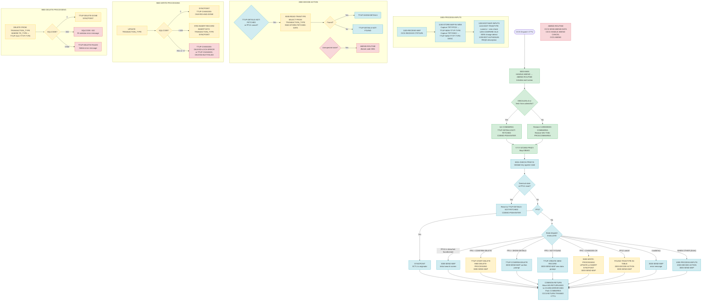

Application : AWS CardDemo
Source File : COTRTUPC.cbl
Type        : Online CICS COBOL
Source Banner: * Program:     COTRTUPC.CBL

---

# BIZ-COTRTUPC — Transaction Type Update / Create / Delete

## Section 1 — Purpose

COTRTUPC maintains individual records in the DB2 table `CARDDEMO.TRANSACTION_TYPE`. It supports three workflows from a single screen:

- **Update** an existing transaction type description (type code is immutable once saved)
- **Create** a new transaction type (INSERT) when the operator-supplied type code is not found
- **Delete** an existing transaction type (DELETE with referential-integrity guard)

The screen displays one transaction type at a time. Navigation between states is driven by a 14-state machine (`TTUP-CHANGE-ACTION`) carried in the COMMAREA. The operator keys in a two-digit numeric type code, the program fetches it from DB2, and then the operator may update the description or delete the row. All DB2 mutations require a two-keystroke confirmation (Enter to validate, PF5 or PF4 to commit). COTRTUPC is typically entered via PF2 from COTRTLIC but can also be entered directly from the admin menu.

**DB2 tables accessed:**

| Table | Schema | Access | Purpose |
|---|---|---|---|
| `TRANSACTION_TYPE` | `CARDDEMO` | SELECT / UPDATE / INSERT / DELETE | Single transaction type record |

**External programs transferred to:**

| Program | Transaction | Condition |
|---|---|---|
| `COADM01C` | `CA00` | PF3 pressed with no originating program |
| `COTRTLIC` | `CTLI` | PF3 pressed when originating program is `COTRTLIC` |
| Originating program (from `CDEMO-FROM-PROGRAM`) | `CDEMO-FROM-TRANID` | PF3 — returns to any other valid originator |

No VSAM or sequential files are opened.

---

## Section 2 — Program Flow

### 2.1 Startup

1. **`0000-MAIN`** (line 344): PROCEDURE DIVISION entry. CICS HANDLE ABEND is immediately registered to label `ABEND-ROUTINE` (line 347), providing a catch-all for unexpected CICS abends throughout the task.
2. `CC-WORK-AREA`, `WS-MISC-STORAGE`, and `WS-COMMAREA` are initialised.
3. `WS-TRANID` is set to `'CTTU'`. `WS-RETURN-MSG` is blanked.
4. COMMAREA restore / reset logic (line 366):
   - If `EIBCALEN = 0` (no COMMAREA) OR the calling program is `COADM01C` on first entry OR the calling program is `COTRTLIC` on first entry: both `CARDDEMO-COMMAREA` and `WS-THIS-PROGCOMMAREA` are initialised. `CDEMO-PGM-ENTER` and `TTUP-DETAILS-NOT-FETCHED` are set TRUE.
   - Otherwise: `CARDDEMO-COMMAREA` is restored from the first N bytes of `DFHCOMMAREA`, and `WS-THIS-PROGCOMMAREA` from the next M bytes.
5. **`YYYY-STORE-PFKEY`** (from CSSTRPFY): maps `EIBAID` to `CCARD-AID` 88-level conditions.
6. **`0001-CHECK-PFKEYS`** (line 577): determines whether the pressed key is valid in the current state. Valid key combinations:
   - PF3: always valid
   - Enter: valid unless currently in `TTUP-CONFIRM-DELETE` state
   - PF4: valid when `TTUP-SHOW-DETAILS` or `TTUP-CONFIRM-DELETE`
   - PF5: valid when `TTUP-CHANGES-OK-NOT-CONFIRMED`, `TTUP-DETAILS-NOT-FOUND`, or `TTUP-DELETE-IN-PROGRESS`
   - PF12: valid when `TTUP-CHANGES-OK-NOT-CONFIRMED`, `TTUP-SHOW-DETAILS`, `TTUP-DETAILS-NOT-FOUND`, `TTUP-CONFIRM-DELETE`, or `TTUP-CREATE-NEW-RECORD`
   Any other key sets `PFK-INVALID` and sets `WS-INVALID-KEY-PRESSED` message if no prior error message exists.
7. **State reset** (lines 405–419): if any of the following terminal states are detected, the program resets to the initial search state (`TTUP-DETAILS-NOT-FETCHED`):
   - PF12 pressed while in `TTUP-SHOW-DETAILS`, `TTUP-CREATE-NEW-RECORD`, or `TTUP-DETAILS-NOT-FOUND`
   - `TTUP-CHANGES-OKAYED-AND-DONE` (successful update/insert)
   - `TTUP-CHANGES-FAILED` (lock error or DB2 failure)
   - `TTUP-CHANGES-BACKED-OUT` when old details are blank
   - `TTUP-DELETE-DONE` or `TTUP-DELETE-FAILED`

### 2.2 Main Processing — State Machine

The outer EVALUATE TRUE block (line 423) dispatches on the current PF key and COMMAREA state. The states of `TTUP-CHANGE-ACTION` are:

| Value | 88-level Name | Meaning |
|---|---|---|
| LOW-VALUES or spaces | `TTUP-DETAILS-NOT-FETCHED` | No record looked up yet |
| `'K'` | `TTUP-INVALID-SEARCH-KEYS` | Type code failed validation |
| `'X'` | `TTUP-DETAILS-NOT-FOUND` | Type code valid but not in DB2 |
| `'S'` | `TTUP-SHOW-DETAILS` | DB2 record fetched and displayed |
| `'R'` | `TTUP-CREATE-NEW-RECORD` | New record creation accepted |
| `'V'` | `TTUP-REVIEW-NEW-RECORD` | (declared but never set — unused) |
| `'9'` | `TTUP-CONFIRM-DELETE` | Awaiting F4 confirmation |
| `'8'` | `TTUP-START-DELETE` | Delete in progress (transient) |
| `'7'` | `TTUP-DELETE-DONE` | Delete succeeded |
| `'6'` | `TTUP-DELETE-FAILED` | Delete failed |
| `'E'` | `TTUP-CHANGES-NOT-OK` | Validation errors in changes |
| `'N'` | `TTUP-CHANGES-OK-NOT-CONFIRMED` | Changes valid, awaiting PF5 |
| `'L'` | `TTUP-CHANGES-OKAYED-LOCK-ERROR` | DB2 lock conflict on write |
| `'F'` | `TTUP-CHANGES-OKAYED-BUT-FAILED` | DB2 error on write |
| `'C'` | `TTUP-CHANGES-OKAYED-AND-DONE` | Update/insert succeeded |
| `'B'` | `TTUP-CHANGES-BACKED-OUT` | Changes cancelled by user |

**PF3 — Exit** (line 429): issues CICS SYNCPOINT then XCTL to the originating program (or admin menu if none).

**PF12 / Fresh start / Terminal state** (line 465): sends the initial search screen (`3000-SEND-MAP`) with `TTUP-DETAILS-NOT-FETCHED` state; sets `CDEMO-PGM-REENTER`.

**PF4 after confirm-delete prompt** (line 482): sets `TTUP-START-DELETE` and calls **`9800-DELETE-PROCESSING`**.

**PF4 after show-details** (line 493): sets `TTUP-CONFIRM-DELETE` and re-sends the map showing the delete confirmation prompt.

**PF5 after not-found** (line 503): sets `TTUP-CREATE-NEW-RECORD` and sends map with "Enter new transaction type details" prompt.

**PF5 after changes validated** (line 514): calls **`9600-WRITE-PROCESSING`** to execute the UPDATE (or INSERT via fallback).

**PF12 to cancel changes or cancel delete** (line 524): sets `FOUND-TRANTYPE-IN-TABLE` and calls **`2000-DECIDE-ACTION`** which re-reads the original DB2 record, setting `TTUP-SHOW-DETAILS` or `TTUP-DETAILS-NOT-FOUND`.

**Invalid key** (line 539): re-sends the map with the existing error message.

**WHEN OTHER — main input processing path** (line 548): invokes `1000-PROCESS-INPUTS`, then `2000-DECIDE-ACTION`, then `3000-SEND-MAP`. This is the path for Enter key when search keys or descriptions are being provided.

**Step — `1000-PROCESS-INPUTS`** (line 625)

8. **`1100-RECEIVE-MAP`** (line 641): CICS RECEIVE MAP `CTRTUPA` / mapset `COTRTUP  ` into `CTRTUPAI`. Response codes `WS-RESP-CD` and `WS-REAS-CD` are not checked after this call.
9. **`1150-STORE-MAP-IN-NEW`** (line 652): captures BMS input into `TTUP-NEW-DETAILS`:
   - If the type code field `TRTYPCDI` of `CTRTUPAI` equals `'*'` or spaces, `TTUP-NEW-TTYP-TYPE` is set to LOW-VALUES.
   - Otherwise the trimmed value is stored.
   - If the description field `TRTYDSCI` of `CTRTUPAI` equals `'*'` or spaces, `TTUP-NEW-TTYP-TYPE-DESC` is set to LOW-VALUES.
   - Otherwise the trimmed value is stored.
   - Special case: if in `TTUP-DETAILS-NOT-FOUND` state and PF5 was not pressed and the incoming type code equals `TTUP-NEW-TTYP-TYPE` (unchanged), the routine exits early without updating new details.
10. **`1200-EDIT-MAP-INPUTS`** (line 689): validation dispatcher:
    - If `TTUP-DETAILS-NOT-FOUND` and type code unchanged and PF5 not pressed: sets `TTUP-DETAILS-NOT-FETCHED` and exits.
    - If in `TTUP-CREATE-NEW-RECORD` or `TTUP-CHANGES-OK-NOT-CONFIRMED` state: skips type-code validation, goes directly to description comparison.
    - Otherwise: calls **`1210-EDIT-TRANTYPE`** to validate the type code. If blank, sets `TTUP-DETAILS-NOT-FETCHED` with message `'No input received'`. If invalid, sets `TTUP-INVALID-SEARCH-KEYS`.
    - If `TTUP-DETAILS-NOT-FETCHED`: exits.
    - **`1205-COMPARE-OLD-NEW`** (line 783): compares `TTUP-NEW-TTYP-TYPE` and `TTUP-NEW-TTYP-TYPE-DESC` (case-insensitive, trimmed) against saved old values. Sets `NO-CHANGES-FOUND` with message `'No change detected with respect to values fetched.'` if identical, or `CHANGE-HAS-OCCURRED` otherwise.
    - If no changes found, or already in `TTUP-CHANGES-OK-NOT-CONFIRMED`, or update already done: clears `WS-NON-KEY-FLAGS` and exits.
    - Sets `TTUP-CHANGES-NOT-OK`. Calls **`1230-EDIT-ALPHANUM-REQD`** on `TTUP-NEW-TTYP-TYPE-DESC` (max 50 characters): must be non-blank, must contain only alphanumerics and spaces.
    - If no `INPUT-ERROR`: sets `TTUP-CHANGES-OK-NOT-CONFIRMED`.

11. **`1210-EDIT-TRANTYPE`** (line 820): validates `TTUP-NEW-TTYP-TYPE` as a 2-digit non-zero numeric using **`1245-EDIT-NUM-REQD`**. If valid, normalises the value: converts via NUMVAL to `WS-EDIT-NUMERIC-2`, moves to `WS-EDIT-ALPHANUMERIC-2`, replaces any spaces with zeros, then moves back to `TTUP-NEW-TTYP-TYPE`. This ensures `' 5'` is stored as `'05'`.

12. **`1245-EDIT-NUM-REQD`** (line 907): validates that the field is non-blank, numeric (FUNCTION TEST-NUMVAL), and non-zero. Error messages constructed with FUNCTION TRIM of `WS-EDIT-VARIABLE-NAME` + `' must be supplied.'` / `' must be numeric.'` / `' must not be zero.'`.

13. **`1230-EDIT-ALPHANUM-REQD`** (line 849): as in COTRTLIC — validates non-blank and alphanumeric-only.

**Step — `2000-DECIDE-ACTION`** (line 978)

The second EVALUATE TRUE block determines the next COMMAREA state based on the current state and the PF key:

- `TTUP-DETAILS-NOT-FETCHED` or PF12 pressed while filter is valid: calls **`9000-READ-TRANTYPE`** to fetch the record from DB2. Sets `TTUP-SHOW-DETAILS` if found, `TTUP-DETAILS-NOT-FOUND` if not.
- PF12 pressed while filter is not valid: cancels the current action (sets `WS-DELETE-WAS-CANCELLED` or `WS-UPDATE-WAS-CANCELLED`, transitions to `TTUP-DETAILS-NOT-FETCHED` or `TTUP-CHANGES-BACKED-OUT`).
- `TTUP-CONFIRM-DELETE` with PF12: retains `TTUP-CONFIRM-DELETE` state (confirms the delete display stays).
- `TTUP-SHOW-DETAILS` with no errors: sets `TTUP-CHANGES-OK-NOT-CONFIRMED`.
- `TTUP-CHANGES-NOT-OK`: holds state (validation errors already displayed).
- `TTUP-CHANGES-BACKED-OUT`: transitions back to `TTUP-CHANGES-NOT-OK` to re-show the previous editable state.
- `TTUP-INVALID-SEARCH-KEYS`: holds state.
- PF5 while `TTUP-DETAILS-NOT-FOUND`: sets `TTUP-CREATE-NEW-RECORD`.
- `TTUP-CHANGES-OK-NOT-CONFIRMED`: holds state (waiting for PF5).
- `TTUP-CHANGES-OKAYED-AND-DONE`: sets `TTUP-SHOW-DETAILS`, clears COMMAREA account/card fields if no return transaction.
- `WHEN OTHER`: moves `'COTRTUPC'` to `ABEND-CULPRIT`, `'0001'` to `ABEND-CODE`, `'UNEXPECTED DATA SCENARIO'` to `ABEND-MSG`, then calls `ABEND-ROUTINE`.

**Step — DB2 Read: `9000-READ-TRANTYPE`** (line 1447)

14. Initialises `TTUP-OLD-DETAILS`. Clears `WS-INFO-MSG`. Calls **`9100-GET-TRANSACTION-TYPE`**.
15. **`9100-GET-TRANSACTION-TYPE`** (line 1469): moves `TTUP-NEW-TTYP-TYPE` to `DCL-TR-TYPE`. Executes `SELECT TR_TYPE, TR_DESCRIPTION INTO :DCL-TR-TYPE, :DCL-TR-DESCRIPTION FROM CARDDEMO.TRANSACTION_TYPE WHERE TR_TYPE = :DCL-TR-TYPE`.
    - SQLCODE = 0: sets `FOUND-TRANTYPE-IN-TABLE`.
    - SQLCODE = +100: sets `INPUT-ERROR`, `FLG-TRANFILTER-NOT-OK`, message `'No record found for this key in database'`.
    - Negative SQLCODE: sets `INPUT-ERROR`, `FLG-TRANFILTER-NOT-OK`, constructs STRING message with `'Error accessing: TRANSACTION_TYPE table. SQLCODE:'` + `WS-DISP-SQLCODE` + `':'` + `SQLERRM OF SQLCA`.
16. **`9500-STORE-FETCHED-DATA`** (line 1517): moves `DCL-TR-TYPE` to `TTUP-OLD-TTYP-TYPE` and copies `DCL-TR-DESCRIPTION-TEXT(1:DCL-TR-DESCRIPTION-LEN)` to `TTUP-OLD-TTYP-TYPE-DESC`.

**Step — DB2 Write: `9600-WRITE-PROCESSING`** (line 1531)

17. Sets `DCL-TR-TYPE` from `TTUP-NEW-TTYP-TYPE`. Trims `TTUP-NEW-TTYP-TYPE-DESC` into `DCL-TR-DESCRIPTION-TEXT`. Computes `DCL-TR-DESCRIPTION-LEN` from `FUNCTION LENGTH(TTUP-NEW-TTYP-TYPE-DESC)` (note: uses the untrimmed field length — see Migration Notes).
18. Executes `UPDATE CARDDEMO.TRANSACTION_TYPE SET TR_DESCRIPTION = :DCL-TR-DESCRIPTION WHERE TR_TYPE = :DCL-TR-TYPE`.
    - SQLCODE = 0: CICS SYNCPOINT issued. Sets `TTUP-CHANGES-OKAYED-AND-DONE`.
    - SQLCODE = +100 (row not found — was it deleted concurrently?): calls **`9700-INSERT-RECORD`** as an upsert fallback.
    - SQLCODE = -911 (lock conflict): sets `INPUT-ERROR` and `COULD-NOT-LOCK-REC-FOR-UPDATE`.
    - Negative SQLCODE: constructs error STRING with `'Error updating: TRANSACTION_TYPE Table. SQLCODE:'` + `WS-DISP-SQLCODE` + `':'` + `SQLERRM OF SQLCA`. Sets `TABLE-UPDATE-FAILED`.
19. Second EVALUATE sets final state:
    - `COULD-NOT-LOCK-REC-FOR-UPDATE` → `TTUP-CHANGES-OKAYED-LOCK-ERROR`
    - `TABLE-UPDATE-FAILED` → `TTUP-CHANGES-OKAYED-BUT-FAILED`
    - `DATA-WAS-CHANGED-BEFORE-UPDATE` → `TTUP-SHOW-DETAILS` (note: this 88-level is never set by any code path — see Migration Notes)
    - WHEN OTHER → `TTUP-CHANGES-OKAYED-AND-DONE`

**Step — DB2 Insert: `9700-INSERT-RECORD`** (line 1596)

20. Executes `INSERT INTO CARDDEMO.TRANSACTION_TYPE (TR_TYPE, TR_DESCRIPTION) VALUES (:DCL-TR-TYPE, :DCL-TR-DESCRIPTION)`.
    - SQLCODE = 0: CICS SYNCPOINT issued.
    - Any other SQLCODE: sets `TABLE-UPDATE-FAILED`, constructs STRING error message with `'Error inserting record into: TRANSACTION_TYPE Table. SQLCODE:'`.

**Step — DB2 Delete: `9800-DELETE-PROCESSING`** (line 1624)

21. Moves `TTUP-OLD-TTYP-TYPE` (not `TTUP-NEW-TTYP-TYPE`) to `DCL-TR-TYPE`. Executes `DELETE FROM CARDDEMO.TRANSACTION_TYPE WHERE TR_TYPE = :DCL-TR-TYPE`.
    - SQLCODE = 0: sets `TTUP-DELETE-DONE`, issues CICS SYNCPOINT.
    - SQLCODE = -532 (referential integrity): sets `RECORD-DELETE-FAILED`, constructs STRING message `'Please delete associated child records first:SQLCODE :'` + code + SQLERRM (note: SQLERRM appears twice in the STRING — see Migration Notes). Does NOT set `TTUP-DELETE-FAILED`.
    - Any other SQLCODE: sets both `RECORD-DELETE-FAILED` and `TTUP-DELETE-FAILED`, constructs STRING `'Delete failed with message:SQLCODE :'`.

**Step — `3000-SEND-MAP`** (line 1089)

22. Calls 7 sub-paragraphs in sequence:
23. **`3100-SCREEN-INIT`** (line 1110): clears `CTRTUPAO` to LOW-VALUES. Populates screen titles, transaction name, program name, current date (MM/DD/YY), and current time (HH:MM:SS). Note: FUNCTION CURRENT-DATE is called twice (lines 1113 and 1120) — both assigned to `WS-CURDATE-DATA`. The second call overwrites the first with no effect.
24. **`3200-SETUP-SCREEN-VARS`** (line 1140): chooses which field values to populate:
    - `TTUP-DETAILS-NOT-FETCHED`: calls **`3201-SHOW-INITIAL-VALUES`** — clears `TRTYPCDO` of `CTRTUPAO`.
    - `TTUP-SHOW-DETAILS`, `TTUP-CONFIRM-DELETE`, `TTUP-DELETE-FAILED`, `TTUP-DELETE-DONE`, `TTUP-CHANGES-BACKED-OUT`: calls **`3202-SHOW-ORIGINAL-VALUES`** — initialises `TTUP-NEW-DETAILS` then copies `TTUP-OLD-TTYP-TYPE`/`TTUP-OLD-TTYP-TYPE-DESC` to the output map.
    - `TTUP-CHANGES-MADE`, `TTUP-CHANGES-NOT-OK`, `TTUP-DETAILS-NOT-FOUND`, `TTUP-INVALID-SEARCH-KEYS`, `TTUP-CREATE-NEW-RECORD`, `TTUP-CHANGES-OKAYED-AND-DONE`: calls **`3203-SHOW-UPDATED-VALUES`** — copies `TTUP-NEW-TTYP-TYPE`/`TTUP-NEW-TTYP-TYPE-DESC` to the output map.
25. **`3250-SETUP-INFOMSG`** (line 1210): sets the information message:
    - `CDEMO-PGM-ENTER` / `TTUP-DETAILS-NOT-FETCHED` / `TTUP-INVALID-SEARCH-KEYS` → `'Enter transaction type to be maintained'`
    - `TTUP-DETAILS-NOT-FOUND` → `'Press F05 to add. F12 to cancel'`
    - `TTUP-SHOW-DETAILS` / `TTUP-CHANGES-BACKED-OUT` with empty old type → `'Enter transaction type to be maintained'`
    - `TTUP-CHANGES-BACKED-OUT` / `TTUP-CHANGES-NOT-OK` → `'Update transaction type details shown.'`
    - `TTUP-CONFIRM-DELETE` → `'Delete this record ? Press F4 to confirm'`
    - `TTUP-DELETE-FAILED` → `'Changes unsuccessful'`
    - `TTUP-DELETE-DONE` → `'Delete successful.'`
    - `TTUP-CREATE-NEW-RECORD` → `'Enter new transaction type details.'`
    - `TTUP-CHANGES-OK-NOT-CONFIRMED` → `'Changes validated.Press F5 to save'`
    - `TTUP-CHANGES-OKAYED-AND-DONE` → `'Changes committed to database'`
    - `TTUP-CHANGES-OKAYED-LOCK-ERROR` → `'Changes unsuccessful'`
    - `TTUP-CHANGES-OKAYED-BUT-FAILED` → `'Changes unsuccessful'`
    Message is centre-justified into `WS-STRING-OUT` (40 chars) and moved to `INFOMSGO`. `WS-RETURN-MSG` is moved to `ERRMSGO`.
26. **`3300-SETUP-SCREEN-ATTRS`** (line 1269): all fields are first protected by **`3310-PROTECT-ALL-ATTRS`** (sets `DFHBMPRF` on `TRTYPCDA`, `TRTYDSCA`, `INFOMSGA`). Then selectively unprotected:
    - Search states: makes `TRTYPCDA` FSET (editable type code only)
    - Show-details / changes-not-ok / create-new: calls **`3320-UNPROTECT-FEW-ATTRS`** (makes `TRTYDSCA` FSET, keeps `INFOMSGA` protected)
    - Changes-confirmed / update-done / delete-in-progress: keeps all protected
    Colour: `TRTYPCDO` coloured red if `FLG-TRANFILTER-NOT-OK` or `TTUP-DELETE-FAILED`. If filter is blank on re-entry, `'*'` is placed in `TRTYPCDO` and coloured red. Uses COPY CSSETATY with REPLACING to set description colour attributes via a standard attribute-setting skeleton.
    Cursor positioning: `TRTYPCDL = -1` on search states; `TRTYDSCL = -1` on edit states.
27. **`3390-SETUP-INFOMSG-ATTRS`** (line 1386): sets `INFOMSGA` dark (`DFHBMDAR`) if `WS-NO-INFO-MESSAGE`, bright (`DFHBMASB`) otherwise.
28. **`3391-SETUP-PFKEY-ATTRS`** (line 1397): highlights key-hint fields based on valid PF keys for current state. Enter key hint dark if `TTUP-CONFIRM-DELETE`. F4 hint bright if show-details or confirm-delete. F5 hint bright if changes-validated or not-found. F12 hint bright if changes-validated, show-details, not-found, confirm-delete, or create-new.
29. **`3400-SEND-SCREEN`** (line 1428): CICS SEND MAP from `CCARD-NEXT-MAP` / `CCARD-NEXT-MAPSET` (both set to literals just before the send). Response code `WS-RESP-CD` is captured but never checked.

### 2.3 Shutdown

30. **`COMMON-RETURN`** (line 559): moves `WS-RETURN-MSG` to `CCARD-ERROR-MSG`. Packs `CARDDEMO-COMMAREA` and `WS-THIS-PROGCOMMAREA` into `WS-COMMAREA`. CICS RETURN with `TRANSID('CTTU')` and packed COMMAREA. The next user keystroke re-enters at `0000-MAIN`.

---

## Section 3 — Error Handling

### 3.1 CICS HANDLE ABEND — `ABEND-ROUTINE` (line 1675)
Registered at program entry (line 347). Any unexpected CICS abend causes CICS to transfer control here. If `ABEND-MSG` is LOW-VALUES, it is set to `'UNEXPECTED ABEND OCCURRED.'`. `ABEND-CULPRIT` is set to `'COTRTUPC'`, `ABEND-CODE` to `'9999'`. Executes CICS SEND (plain text, NOHANDLE, ERASE) of `ABEND-DATA`. Then issues HANDLE ABEND CANCEL to deregister, and finally CICS ABEND with `ABEND-CODE`. This produces a controlled abend dump with the program and reason visible in the dump.

### 3.2 Invalid PF Key — `0001-CHECK-PFKEYS` (line 577)
If the pressed key is not valid for the current state, `PFK-INVALID` is set and (if no prior error message) `WS-INVALID-KEY-PRESSED` is set to `'Invalid key pressed'`. The outer EVALUATE catches this condition (`WHEN WS-INVALID-KEY-PRESSED`) and re-sends the map with the error message. No state change occurs.

### 3.3 Unexpected State — `2000-DECIDE-ACTION` WHEN OTHER (line 1073)
If the EVALUATE in `2000-DECIDE-ACTION` reaches WHEN OTHER (a state combination not explicitly coded), the program deliberately abends. Sets `ABEND-CULPRIT = 'COTRTUPC'`, `ABEND-CODE = '0001'`, `ABEND-MSG = 'UNEXPECTED DATA SCENARIO'`, and calls `ABEND-ROUTINE`. This is an intentional defensive measure for corruption detection.

### 3.4 DB2 Read Failure — `9100-GET-TRANSACTION-TYPE` (line 1469)
SQLCODE = +100: message `'No record found for this key in database'`, state `TTUP-DETAILS-NOT-FOUND`.
Negative SQLCODE: STRING message incorporating table name, SQLCODE, and SQLERRM from SQLCA, state `TTUP-INVALID-SEARCH-KEYS` effectively (via `FLG-TRANFILTER-NOT-OK`).

### 3.5 DB2 Update Failure — `9600-WRITE-PROCESSING` (line 1531)
SQLCODE = -911: message `'Could not lock record for update'`, state `TTUP-CHANGES-OKAYED-LOCK-ERROR`.
Negative SQLCODE: STRING message incorporating SQLCODE and SQLERRM, state `TTUP-CHANGES-OKAYED-BUT-FAILED`.
Both states display `'Changes unsuccessful'` to the operator via the info message field.

### 3.6 DB2 Insert Failure — `9700-INSERT-RECORD` (line 1596)
Any non-zero SQLCODE: STRING message incorporating SQLCODE and SQLERRM, sets `TABLE-UPDATE-FAILED` (same flag as update failure). State `TTUP-CHANGES-OKAYED-BUT-FAILED`.

### 3.7 DB2 Delete Failure — `9800-DELETE-PROCESSING` (line 1624)
SQLCODE = -532 (referential integrity): STRING message `'Please delete associated child records first:SQLCODE :...'`. State remains `TTUP-CONFIRM-DELETE` (does NOT set `TTUP-DELETE-FAILED` — the delete screen stays active). `RECORD-DELETE-FAILED` is set but the outer EVALUATE in the caller checks `CA-DELETE-SUCCEEDED` which is not in this program — it checks `TTUP-DELETE-DONE`.
Any other SQLCODE: STRING message `'Delete failed with message:SQLCODE :...'`. Sets `TTUP-DELETE-FAILED`. State machine transitions to `TTUP-DELETE-FAILED` on next entry.

### 3.8 RECEIVE MAP — Not Checked
`WS-RESP-CD` and `WS-REAS-CD` are populated by the CICS RECEIVE MAP at `1100-RECEIVE-MAP` (line 641) but are never tested. A CICS MAPFAIL (e.g., user pressed Enter with no data on the screen) will not be caught; the program will silently process whatever is in `CTRTUPAI` from the last SEND.

---

## Section 4 — Migration Notes

1. **`9600-WRITE-PROCESSING` silently upserts** (line 1559): when the UPDATE returns SQLCODE +100 (row not found), the program automatically falls through to `9700-INSERT-RECORD` and executes an INSERT. The operator entered a type code that was previously fetched (`TTUP-SHOW-DETAILS`), so the row should always exist. This fallback handles the edge case where another user deleted the row between display and save. However, it means a concurrent deletion followed by this user's edit results in a silent re-creation rather than an error — the operator never knows the row was deleted and re-inserted.

2. **`DCL-TR-DESCRIPTION-LEN` computed from untrimmed field** (line 1542): `FUNCTION LENGTH(TTUP-NEW-TTYP-TYPE-DESC)` always returns 50 (the PIC X(50) length), not the trimmed content length. This is different from COTRTLIC which uses `FUNCTION LENGTH(WS-ROW-TR-DESC-IN(I-SELECTED))`. The DB2 VARCHAR for `TR_DESCRIPTION` will therefore always be 50 characters, padded with spaces. Downstream SELECT queries using TRIM may work correctly, but any fixed-length comparison will include trailing spaces.

3. **`SQLERRM` referenced twice in delete error STRING** (line 1646): the STRING statement for SQLCODE -532 in `9800-DELETE-PROCESSING` lists `SQLERRM OF SQLCA` twice as delimiters. The first occurrence contributes its value; the second is a duplicate append. The resulting error message string may contain the SQLERRM text twice, making the output confusing.

4. **`DATA-WAS-CHANGED-BEFORE-UPDATE` 88-level is never set** (line 1585): the second EVALUATE in `9600-WRITE-PROCESSING` includes `WHEN DATA-WAS-CHANGED-BEFORE-UPDATE` → `TTUP-SHOW-DETAILS`. This branch was presumably intended for optimistic locking. However, no code in the program ever sets `DATA-WAS-CHANGED-BEFORE-UPDATE` to TRUE. The branch is permanently unreachable.

5. **`TTUP-REVIEW-NEW-RECORD` (`'V'`) is never set** (line 305): the 88-level is declared in the state machine but no PROCEDURE DIVISION code ever sets it. It appears to be a placeholder for a planned review step in the create workflow.

6. **`WS-EDIT-ALPHANUM-LENGTH` is COMP-3** (line 56): the edit length counter used in `1230-EDIT-ALPHANUM-REQD` and `1245-EDIT-NUM-REQD` is packed decimal. In Java, use `int`.

7. **FUNCTION CURRENT-DATE called twice in `3100-SCREEN-INIT`** (lines 1113 and 1120): both calls assign to `WS-CURDATE-DATA`. The second call overwrites the first. Only the date/time subfields from the second call are used. In practice both calls return the same timestamp, but the duplication wastes two system calls per screen send.

8. **`3201-SHOW-INITIAL-VALUES` assigns `TRTYPCDO` twice** (line 1177–1178): the statement `MOVE LOW-VALUES TO TRTYPCDO OF CTRTUPAO` appears twice in succession (both reference the same field twice in the MOVE destination list). This is a redundant duplicate with no functional harm.

9. **No optimistic locking on UPDATE**: the program reads the record (`9000-READ-TRANTYPE`), stores the original values, accepts user changes over one or more pseudo-conversational cycles, and then blindly writes the new description. No re-read or timestamp check is performed before the UPDATE to verify the row has not been changed by another user since it was fetched. SQLCODE -911 (deadlock) is the only concurrency protection.

10. **`CSUSR01Y` copybook included but never used**: `COPY CSUSR01Y` brings in `SEC-USER-DATA` (80 bytes). No field from this copybook is referenced in the PROCEDURE DIVISION.

11. **`CSMSG01Y` copybook included but never used**: `COPY CSMSG01Y` brings in `CCDA-MSG-THANK-YOU` and `CCDA-MSG-INVALID-KEY`. Neither is referenced.

12. **`CVACT02Y` (CARD-RECORD) not copied by this program**: COTRTUPC does not include `COPY CVACT02Y`, unlike COTRTLIC. It therefore does not have the unused CARD-RECORD structure.

13. **`WS-UCTRANS` field declared but never used** (line 46): PIC X(4), always SPACES. Not assigned or tested.

14. **`TTYP-UPDATE-RECORD` structure declared but never used** (line 129): a 60-byte local record layout (`TTUP-UPDATE-TTYP-TYPE` X(02) + `TTUP-UPDATE-TTYP-TYPE-DESC` X(50) + FILLER X(08)) is declared in working storage but no PROCEDURE DIVISION code references it. Data is handled entirely through `TTUP-NEW-DETAILS` and `TTUP-OLD-DETAILS`.

15. **`LIT-THISMAPSET` declared as PIC X(8)** (line 204): value is `'COTRTUP '` with a trailing space (7-character mapset name padded to 8). The CICS SEND MAP uses `CCARD-NEXT-MAPSET` which is PIC X(7) (from CVCRD01Y). When `LIT-THISMAPSET` is moved to `CCARD-NEXT-MAPSET`, only the first 7 characters (`'COTRTUP'`) are used, truncating the trailing space. No functional impact, but the PIC X(8) declaration is inconsistent with all other mapset literals in the suite.

16. **HANDLE ABEND vs. structured error handling**: registering HANDLE ABEND at the top of `0000-MAIN` means any CICS condition (including recoverable ones like MAPFAIL) that is not caught by a RESP check will trigger the abend handler. In a Java migration, all CICS interactions should use explicit response-code handling rather than a global catch.

---

## Appendix A — Files

COTRTUPC opens no VSAM or sequential files. All data access is via DB2 embedded SQL.

| Logical Name | DDname | Organization | Recording | Key Field | Direction | Contents |
|---|---|---|---|---|---|---|
| (none — DB2 only) | N/A | N/A | N/A | N/A | N/A | N/A |

---

## Appendix B — Copybooks and External Programs

### COCOM01Y — CARDDEMO-COMMAREA (level 01)

| Field | PIC | Bytes | Notes |
|---|---|---|---|
| `CDEMO-FROM-TRANID` | X(04) | 4 | Originating transaction ID |
| `CDEMO-FROM-PROGRAM` | X(08) | 8 | Originating program name |
| `CDEMO-TO-TRANID` | X(04) | 4 | Target for XCTL |
| `CDEMO-TO-PROGRAM` | X(08) | 8 | Target program for XCTL |
| `CDEMO-USER-ID` | X(08) | 8 | Signed-on user ID |
| `CDEMO-USER-TYPE` | X(01) | 1 | User type |
| `CDEMO-USRTYP-ADMIN` | 88 | — | VALUE `'A'` |
| `CDEMO-USRTYP-USER` | 88 | — | VALUE `'U'` |
| `CDEMO-PGM-CONTEXT` | 9(01) | 1 | Entry context |
| `CDEMO-PGM-ENTER` | 88 | — | VALUE 0 |
| `CDEMO-PGM-REENTER` | 88 | — | VALUE 1 |
| `CDEMO-ACCT-ID` | various | varies | Account ID — cleared in certain state transitions |
| `CDEMO-CARD-NUM` | various | varies | Card number — cleared in certain state transitions |
| `CDEMO-ACCT-STATUS` | various | varies | Account status — cleared in certain state transitions |
| Other customer/card fields | various | varies | **Not used by COTRTUPC** |
| `CDEMO-LAST-MAP` | X(07) | 7 | **Not used — map set via CCARD-NEXT-MAP** |
| `CDEMO-LAST-MAPSET` | X(07) | 7 | **Not used — mapset set via CCARD-NEXT-MAPSET** |

### WS-THIS-PROGCOMMAREA (level 01, local definition lines 293–335)

| Field | PIC | Bytes | Notes |
|---|---|---|---|
| `TTUP-CHANGE-ACTION` | X(1) | 1 | 14-state machine (see state table in Section 2) |
| `TTUP-OLD-TTYP-TYPE` | X(02) | 2 | Original type code from DB2 fetch |
| `TTUP-OLD-TTYP-TYPE-DESC` | X(50) | 50 | Original description from DB2 fetch |
| `TTUP-NEW-TTYP-TYPE` | X(02) | 2 | Type code entered by operator |
| `TTUP-NEW-TTYP-TYPE-DESC` | X(50) | 50 | Description entered or changed by operator |

### EXEC SQL INCLUDE DCLTRTYP — DCLTRANSACTION-TYPE (DB2 host variable)

The physical `DCLTRTYP` member is not present as a .cpy file. Based on usage:

| Field | Type | Bytes | Notes |
|---|---|---|---|
| `DCL-TR-TYPE` | PIC X(02) | 2 | Type code — primary key |
| `DCL-TR-DESCRIPTION` | Group | — | VARCHAR descriptor |
| `DCL-TR-DESCRIPTION-TEXT` | PIC X(n) | varies | Description content |
| `DCL-TR-DESCRIPTION-LEN` | S9(4) COMP | 2 | VARCHAR length |

### EXEC SQL INCLUDE DCLTRCAT — (DB2 host variable for TRANSACTION_CATEGORY)

The `DCLTRCAT` member declares host variables for the `TRANSACTION_CATEGORY` table. Despite being included at line 287, no SQL statement in COTRTUPC references `DCLTRCAT` fields or the `TRANSACTION_CATEGORY` table. The include is present but the table is entirely unused by this program.

### CSUTLDWY — WS-EDIT-DATE-CCYYMMDD group (within WS-MISC-STORAGE)

| Field | PIC | Bytes | Notes |
|---|---|---|---|
| `WS-EDIT-DATE-CCYYMMDD` | X(8) | 8 | Date edit buffer in CCYYMMDD format |
| Sub-year/month/day fields | various | 4/2/2 | Subfields for date component edit |
| `WS-EDIT-DATE-BINARY` | S9(9) BINARY | 4 | Numeric equivalent for arithmetic |
| `WS-CURRENT-DATE` | various | varies | Current date for comparison |
| `WS-EDIT-DATE-FLGS` | X | 1 | Validation flags |
| `WS-DATE-FORMAT` | X(8) | 8 | `'YYYYMMDD'` |
| `WS-DATE-VALIDATION-RESULT` | various | varies | Validation outcome |
| All CSUTLDWY fields | — | — | **Not used by COTRTUPC** — included but no date editing occurs in this program |

### CVCRD01Y — CC-WORK-AREAS (level 01)

| Field | PIC | Bytes | Notes |
|---|---|---|---|
| `CCARD-AID` | X(5) | 5 | Mapped attention identifier |
| `CCARD-AID-ENTER` through `CCARD-AID-PFK12` | 88 | — | PF key conditions |
| `CCARD-NEXT-PROG` | X(8) | 8 | **Used:** set to `LIT-THISPGM` in `1000-PROCESS-INPUTS` |
| `CCARD-NEXT-MAPSET` | X(7) | 7 | **Used:** set to `LIT-THISMAPSET` in `3400-SEND-SCREEN` |
| `CCARD-NEXT-MAP` | X(7) | 7 | **Used:** set to `LIT-THISMAP` in `3400-SEND-SCREEN` |
| `CCARD-ERROR-MSG` | X(75) | 75 | **Used:** populated at `COMMON-RETURN` from `WS-RETURN-MSG` |
| `CCARD-RETURN-MSG` | X(75) | 75 | **Not used** |
| `CC-ACCT-ID` | X(11) | 11 | **Not used** |
| `CC-CARD-NUM` | X(16) | 16 | **Not used** |
| `CC-CUST-ID` | X(09) | 9 | **Not used** |

### COTTL01Y — CCDA-SCREEN-TITLE (level 01)

| Field | PIC | Bytes | Notes |
|---|---|---|---|
| `CCDA-TITLE01` | X(40) | 40 | `'      AWS Mainframe Modernization       '` — used |
| `CCDA-TITLE02` | X(40) | 40 | `'              CardDemo                  '` — used |
| `CCDA-THANK-YOU` | X(40) | 40 | **Not used** |

### CSDAT01Y — WS-DATE-TIME (level 01)

| Field | PIC | Bytes | Notes |
|---|---|---|---|
| `WS-CURDATE-YEAR` | X(4) | 4 | Used |
| `WS-CURDATE-MONTH` | X(2) | 2 | Used |
| `WS-CURDATE-DAY` | X(2) | 2 | Used |
| `WS-CURTIME-HOURS` | X(2) | 2 | Used |
| `WS-CURTIME-MINUTE` | X(2) | 2 | Used |
| `WS-CURTIME-SECOND` | X(2) | 2 | Used |
| `WS-CURDATE-MM-DD-YY` | X(8) | 8 | Used |
| `WS-CURTIME-HH-MM-SS` | X(8) | 8 | Used |
| `WS-TIMESTAMP` | X(26) | 26 | **Not used** |

### CSMSG01Y — CCDA-COMMON-MESSAGES (level 01)

All fields **not used** by COTRTUPC:

| Field | PIC | Bytes | Notes |
|---|---|---|---|
| `CCDA-MSG-THANK-YOU` | X(50) | 50 | **Not used** |
| `CCDA-MSG-INVALID-KEY` | X(50) | 50 | **Not used** |

### CSMSG02Y — ABEND-DATA (level 01)

| Field | PIC | Bytes | Notes |
|---|---|---|---|
| `ABEND-CODE` | X(4) | 4 | Abend code — set to `'0001'` or `'9999'` |
| `ABEND-CULPRIT` | X(8) | 8 | Program name — set to `'COTRTUPC'` |
| `ABEND-REASON` | X(50) | 50 | Reason text — set to SPACES |
| `ABEND-MSG` | X(72) | 72 | Message — set to `'UNEXPECTED DATA SCENARIO'` or `'UNEXPECTED ABEND OCCURRED.'` |

### CSUSR01Y — SEC-USER-DATA (level 01)

All 80 bytes **not used** by COTRTUPC:

| Field | PIC | Bytes | Notes |
|---|---|---|---|
| `SEC-USR-ID` | X(08) | 8 | **Not used** |
| `SEC-USR-FNAME` | X(20) | 20 | **Not used** |
| `SEC-USR-LNAME` | X(20) | 20 | **Not used** |
| `SEC-USR-PWD` | X(08) | 8 | **Not used** |
| `SEC-USR-TYPE` | X(01) | 1 | **Not used** |
| `SEC-USR-FILLER` | X(23) | 23 | **Not used** |

### COTRTUP (BMS mapset) — CTRTUPAI / CTRTUPAO

| Input field | PIC | Bytes | Notes |
|---|---|---|---|
| `TRTYPCDI` of `CTRTUPAI` | X(2) | 2 | Transaction type code entered by operator |
| `TRTYDSCI` of `CTRTUPAI` | X(50) | 50 | Description entered or edited by operator |
| `TRTYPCDA` of `CTRTUPAI` | X | 1 | Type code field attribute (set to DFHBMFSE or DFHBMPRF) |
| `TRTYPCDL` of `CTRTUPAI` | S9(4) COMP | 2 | Type code cursor length (set to -1 for cursor position) |
| `TRTYDSCA` of `CTRTUPAI` | X | 1 | Description attribute byte |
| `TRTYDSCL` of `CTRTUPAI` | S9(4) COMP | 2 | Description cursor length |
| `INFOMSGA` of `CTRTUPAI` | X | 1 | Info message attribute byte |
| `FKEYSA`, `FKEY04A`, `FKEY05A`, `FKEY12A` of `CTRTUPAI` | X | 1 ea | PF key hint attribute bytes |

| Output field | Notes |
|---|---|
| `TRTYPCDO` of `CTRTUPAO` | Type code output value |
| `TRTYPCDC` of `CTRTUPAO` | Type code colour byte |
| `TRTYDSCO` of `CTRTUPAO` | Description output value |
| `TRTYDSCL` of `CTRTUPAO` | Description colour byte (via CSSETATY) |
| `INFOMSGO` of `CTRTUPAO` | Centre-justified info message (40 chars) |
| `ERRMSGO` of `CTRTUPAO` | Error/return message |
| `TITLE01O`, `TITLE02O` | Screen titles |
| `TRNNAMEO`, `PGMNAMEO` | Transaction and program name |
| `CURDATEO`, `CURTIMEO` | Date and time |

### External Program: CSSETATY (COPY CSSETATY REPLACING)

Used in `3300-SETUP-SCREEN-ATTRS` to set screen attributes for the description field. This is a skeleton copybook with placeholder tokens `(TESTVAR1)`, `(SCRNVAR2)`, `(MAPNAME3)` replaced at compile time with `DESCRIPTION`, `TRTYDSC`, `CTRTUPA`. Handles setting colour (red for errors, etc.) and attribute bytes for the description field. No call-time parameters.

---

## Appendix C — Hardcoded Literals

| Paragraph | Line | Value | Usage | Classification |
|---|---|---|---|---|
| `0000-MAIN` | 20100 | `'COTRTUPC'` | Program identity | System constant |
| `0000-MAIN` | 20300 | `'CTTU'` | This transaction ID | System constant |
| `0000-MAIN` | 20500 | `'COTRTUP '` | BMS mapset name (8 chars, trailing space) | System constant |
| `0000-MAIN` | 20700 | `'CTRTUPA'` | BMS map name | System constant |
| `0000-MAIN` | 20900 | `'COADM01C'` | Admin program fallback | System constant |
| `0000-MAIN` | 21100 | `'CA00'` | Admin transaction fallback | System constant |
| `0000-MAIN` | 21300 | `'COADM01'` | Admin mapset | System constant |
| `0000-MAIN` | 21500 | `'COADM1A'` | Admin map | System constant |
| `0000-MAIN` | 21700 | `'COTRTLIC'` | List program name | System constant |
| `0000-MAIN` | 21900 | `'CTLI'` | List transaction ID | System constant |
| `0000-MAIN` | 22100 | `'COTRTLI'` | List mapset | System constant |
| `0000-MAIN` | 22300 | `'CTRTLIA'` | List map | System constant |
| `WS-INFO-MSG` 88-levels | 14600 | `'Selected transaction type shown above'` | Show-details info | Display message |
| `WS-INFO-MSG` 88-levels | 14800 | `'Enter transaction type to be maintained'` | Search prompt | Display message |
| `WS-INFO-MSG` 88-levels | 15000 | `'Press F05 to add. F12 to cancel'` | Not-found prompt | Display message |
| `WS-INFO-MSG` 88-levels | 15200 | `'Delete this record ? Press F4 to confirm'` | Delete confirm prompt | Display message |
| `WS-INFO-MSG` 88-levels | 15400 | `'Delete successful.'` | Delete success | Display message |
| `WS-INFO-MSG` 88-levels | 15600 | `'Update transaction type details shown.'` | Changes-backed-out prompt | Display message |
| `WS-INFO-MSG` 88-levels | 15800 | `'Enter new transaction type details.'` | Create-new prompt | Display message |
| `WS-INFO-MSG` 88-levels | 16100 | `'Changes validated.Press F5 to save'` | Confirm save prompt | Display message |
| `WS-INFO-MSG` 88-levels | 16300 | `'Changes committed to database'` | Update success | Display message |
| `WS-INFO-MSG` 88-levels | 16500 | `'Changes unsuccessful'` | Failure info | Display message |
| `WS-RETURN-MSG` 88-levels | 16900 | `'PF03 pressed.Exiting              '` | PF3 exit message | Display message |
| `WS-RETURN-MSG` 88-levels | 17200 | `'Invalid Key pressed. '` | Invalid key (WS-INVALID-KEY) | Display message |
| `WS-RETURN-MSG` 88-levels | 17400 | `'Name can only contain alphabets and spaces'` | Not actually used by any paragraph | Display message |
| `WS-RETURN-MSG` 88-levels | 17600 | `'No record found for this key in database'` | SELECT not-found | Display message |
| `WS-RETURN-MSG` 88-levels | 17800 | `'No input received'` | Blank search key | Display message |
| `WS-RETURN-MSG` 88-levels | 18000 | `'No change detected with respect to values fetched.'` | No-change detection | Display message |
| `WS-RETURN-MSG` 88-levels | 18200 | `'Could not lock record for update'` | SQLCODE -911 on UPDATE | Display message |
| `WS-RETURN-MSG` 88-levels | 18400 | `'Record changed by some one else. Please review'` | DATA-WAS-CHANGED (unreachable) | Display message |
| `WS-RETURN-MSG` 88-levels | 18600 | `'Update was cancelled'` | PF12 cancel update | Display message |
| `WS-RETURN-MSG` 88-levels | 18800 | `'Update of record failed'` | TABLE-UPDATE-FAILED | Display message |
| `WS-RETURN-MSG` 88-levels | 19000 | `'Delete of record failed'` | RECORD-DELETE-FAILED | Display message |
| `WS-RETURN-MSG` 88-levels | 19200 | `'Delete was cancelled'` | PF12 cancel delete | Display message |
| `WS-RETURN-MSG` 88-levels | 19400 | `'Invalid key pressed'` | `WS-INVALID-KEY-PRESSED` | Display message |
| `WS-RETURN-MSG` 88-levels | 19600 | `'Looks Good.... so far'` | `CODING-TO-BE-DONE` — never set | Test data |
| `2000-DECIDE-ACTION` | 10750 | `'0001'` | Abend code for unexpected state | System constant |
| `2000-DECIDE-ACTION` | 10770 | `'UNEXPECTED DATA SCENARIO'` | Abend message | Display message |
| `9100-GET-TRANSACTION-TYPE` | 15000 | `'Error accessing:'` | DB2 read error prefix | Display message |
| `9600-WRITE-PROCESSING` | 15700 | `'Error updating:'` | DB2 update error prefix | Display message |
| `9700-INSERT-RECORD` | 16100 | `'Error inserting record into:'` | DB2 insert error prefix | Display message |
| `9800-DELETE-PROCESSING` | 16410 | `'Please delete associated child records first:'` | RI violation on delete | Display message |
| `9800-DELETE-PROCESSING` | 16540 | `'Delete failed with message:'` | Generic delete error | Display message |

---

## Appendix D — Internal Working Fields

| Field | PIC | Bytes | Purpose |
|---|---|---|---|
| `WS-RESP-CD` | S9(09) COMP | 4 | CICS response code (captured but never tested) |
| `WS-REAS-CD` | S9(09) COMP | 4 | CICS reason code (captured but never tested) |
| `WS-TRANID` | X(4) | 4 | Holds `'CTTU'` — not used after initial set |
| `WS-UCTRANS` | X(4) | 4 | Declared, never used |
| `WS-EDIT-VARIABLE-NAME` | X(25) | 25 | Field label for validation error messages |
| `WS-EDIT-ALPHANUM-ONLY` | X(256) | 256 | Input buffer for alphanumeric validation |
| `WS-EDIT-ALPHANUM-LENGTH` | S9(4) COMP-3 | 3 | Edit length counter (COMP-3 — use int in Java) |
| `WS-EDIT-ALPHANUM-ONLY-FLAGS` | X(1) | 1 | Validation result flag |
| `FLG-ALPHNANUM-ISVALID` | 88 | — | VALUE LOW-VALUES |
| `FLG-ALPHNANUM-NOT-OK` | 88 | — | VALUE `'0'` |
| `FLG-ALPHNANUM-BLANK` | 88 | — | VALUE `'B'` |
| `WS-DISP-SQLCODE` | `----9` | 5 | Display-formatted SQLCODE |
| `WS-STRING-MID` | 9(3) | 3 | Midpoint for centre-justification |
| `WS-STRING-LEN` | 9(3) | 3 | Trimmed message length |
| `WS-STRING-OUT` | X(40) | 40 | Centre-justified output (40 chars, narrower than COTRTLIC's 45) |
| `WS-DATACHANGED-FLAG` | X(1) | 1 | Whether old/new values differ |
| `NO-CHANGES-FOUND` | 88 | — | VALUE `'0'` |
| `CHANGE-HAS-OCCURRED` | 88 | — | VALUE `'1'` |
| `WS-INPUT-FLAG` | X(1) | 1 | Overall validation result |
| `INPUT-OK` | 88 | — | VALUE `'0'` |
| `INPUT-ERROR` | 88 | — | VALUE `'1'` |
| `INPUT-PENDING` | 88 | — | VALUE LOW-VALUES (never tested) |
| `WS-RETURN-FLAG` | X(1) | 1 | Declared but never set or tested |
| `WS-PFK-FLAG` | X(1) | 1 | PF key validity |
| `PFK-VALID` | 88 | — | VALUE `'0'` |
| `PFK-INVALID` | 88 | — | VALUE `'1'` |
| `WS-EDIT-TTYP-FLAG` | X(1) | 1 | Type code validation status |
| `FLG-TRANFILTER-ISVALID` | 88 | — | VALUE LOW-VALUES |
| `FLG-TRANFILTER-NOT-OK` | 88 | — | VALUE `'0'` |
| `FLG-TRANFILTER-BLANK` | 88 | — | VALUE `'B'` |
| `WS-EDIT-DESC-FLAGS` | X(1) | 1 | Description validation status |
| `FLG-DESCRIPTION-ISVALID` | 88 | — | VALUE LOW-VALUES |
| `FLG-DESCRIPTION-NOT-OK` | 88 | — | VALUE `'0'` |
| `FLG-DESCRIPTION-BLANK` | 88 | — | VALUE `'B'` |
| `WS-EDIT-DATE-X` | X(10) | 10 | Date edit buffer (part of CICS-OUTPUT-EDIT-VARS — unused) |
| `WS-EDIT-CURRENCY-9-2` | X(15) | 15 | Currency edit buffer (unused) |
| `WS-EDIT-CURRENCY-9-2-F` | +ZZZ,ZZZ,ZZZ.99 | 15 | Formatted currency (unused) |
| `WS-EDIT-NUMERIC-2` | 9(02) | 2 | Normalised 2-digit numeric for type code |
| `WS-EDIT-ALPHANUMERIC-2` | X(02) | 2 | Character form of normalised type code |
| `WS-TRANTYPE-MASTER-READ-FLAG` | X(1) | 1 | DB2 read success flag |
| `FOUND-TRANTYPE-IN-TABLE` | 88 | — | VALUE `'1'` |
| `TTUP-UPDATE-TTYP-TYPE` | X(02) | 2 | Local record type code (never used — see Migration Note 14) |
| `TTUP-UPDATE-TTYP-TYPE-DESC` | X(50) | 50 | Local record description (never used) |
| `WS-INFO-MSG` | X(40) | 40 | Info message for `INFOMSGO` |
| `WS-RETURN-MSG` | X(75) | 75 | Error/status message for `ERRMSGO` |
| `WS-NON-KEY-FLAGS` | X(1) | 1 | Container for `WS-EDIT-DESC-FLAGS` |
| `WS-COMMAREA` | X(2000) | 2000 | Full COMMAREA buffer |

---

## Appendix E — Execution at a Glance

