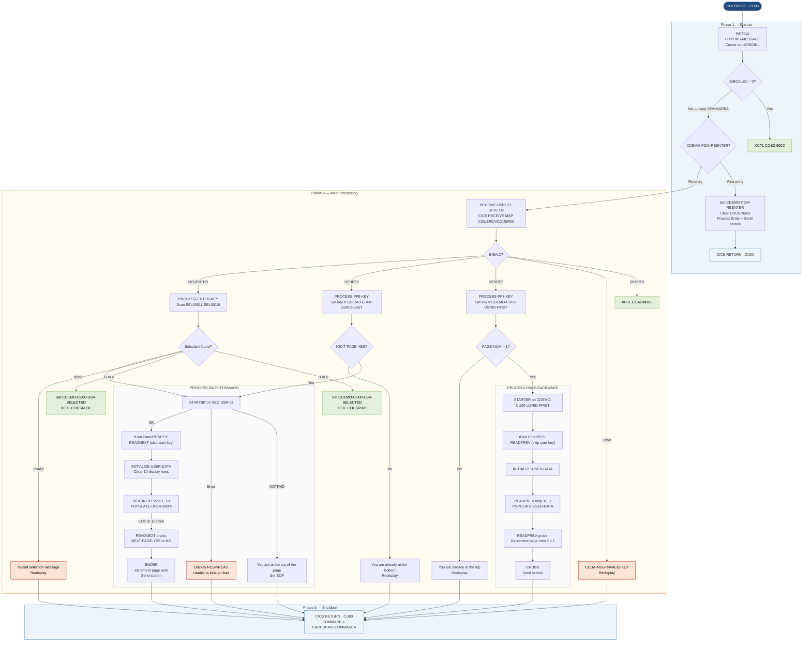

# COUSR00C — User List Screen

```
Application : AWS CardDemo
Source File : COUSR00C.cbl
Type        : Online CICS COBOL
Source Banner: Program : COUSR00C.CBL / Application : CardDemo / Type : CICS COBOL Program / Function : List all users from USRSEC file
```

This document describes what COUSR00C does in plain English. It presents a scrollable list of up to 10 CardDemo users per screen page, supports forward and backward paging through the USRSEC user-security file using CICS STARTBR / READNEXT / READPREV / ENDBR browse operations, and allows the operator to select a single user for update (transfer to `COUSR02C`) or delete (transfer to `COUSR03C`).

---

## 1. Purpose

COUSR00C reads the VSAM user-security file (`USRSEC`) sequentially using CICS browse operations and displays up to 10 users per screen. It supports:

- **Forward paging (PF8)** — advance to the next page of users.
- **Backward paging (PF7)** — return to the previous page of users.
- **User ID filter** — the operator may type a starting user ID in the `USRIDINI` field to position the browse.
- **Row selection** — the operator enters `'U'` or `'D'` beside a user row to transfer to the update (`COUSR02C`) or delete (`COUSR03C`) program.

The program is reached from `COADM01C` (admin menu) and returns to `COADM01C` on PF3. It uses transaction ID `CU00` and map `COUSR0A` / mapset `COUSR00`.

---

## 2. Program Flow

### 2.1 Startup

**Step 1 — Initialize flags** *(paragraph `MAIN-PARA`, line 98).*
`WS-ERR-FLG` set to `'N'` (`ERR-FLG-OFF`); `WS-USER-SEC-EOF` to `'N'` (`USER-SEC-NOT-EOF`); `CDEMO-CU00-NEXT-PAGE-FLG` to `'N'` (`NEXT-PAGE-NO`); `WS-SEND-ERASE-FLG` to `'Y'` (`SEND-ERASE-YES`). `WS-MESSAGE` and `ERRMSGO` cleared. Cursor set on `USRIDINL`.

**Step 2 — No COMMAREA** *(line 110).*
Sets `CDEMO-TO-PROGRAM` to `'COSGN00C'` and transfers to `RETURN-TO-PREV-SCREEN` (XCTL back to signon).

**Step 3 — First entry** *(line 115 — `CDEMO-PGM-REENTER` is false).*
Copies COMMAREA, sets `CDEMO-PGM-REENTER` to true, clears `COUSR0AO` to low values, immediately calls `PROCESS-ENTER-KEY` to load the first page of users, then calls `SEND-USRLST-SCREEN`.

### 2.2 Main Processing

**Step 4 — Re-entry: receive screen** *(line 121).*
`RECEIVE-USRLST-SCREEN` issues CICS RECEIVE MAP for `COUSR0A` / `COUSR00` into `COUSR0AI`.

**Step 5 — Evaluate attention key** *(line 122).*
- `DFHENTER` — `PROCESS-ENTER-KEY`.
- `DFHPF3` — set `CDEMO-TO-PROGRAM` to `'COADM01C'`, transfer to previous screen.
- `DFHPF7` — `PROCESS-PF7-KEY` (page backward).
- `DFHPF8` — `PROCESS-PF8-KEY` (page forward).
- Other — error flag, cursor on `USRIDINL`, `CCDA-MSG-INVALID-KEY`, redisplay.

**Step 6 — Process Enter key** *(paragraph `PROCESS-ENTER-KEY`, line 149).*
Scans all 10 selection fields (`SEL0001I` through `SEL0010I`) in order. The first non-blank, non-low-values selection is captured: the selection character is copied to `CDEMO-CU00-USR-SEL-FLG` and the corresponding user ID (`USRID01I`–`USRID10I`) to `CDEMO-CU00-USR-SELECTED`.

If a selection was found: evaluates `CDEMO-CU00-USR-SEL-FLG`:
- `'U'` or `'u'` — sets `CDEMO-TO-PROGRAM = 'COUSR02C'`, populates COMMAREA navigation fields, issues CICS XCTL to `COUSR02C`.
- `'D'` or `'d'` — sets `CDEMO-TO-PROGRAM = 'COUSR03C'`, issues CICS XCTL to `COUSR03C`.
- Other — message `'Invalid selection. Valid values are U and D'`, cursor on `USRIDINL`.

If no selection: uses `USRIDINI` as starting browse key (or low values if blank), resets `CDEMO-CU00-PAGE-NUM` to zero, and calls `PROCESS-PAGE-FORWARD`.

**Step 7 — Process PF7 (backward)** *(paragraph `PROCESS-PF7-KEY`, line 237).*
Sets browse starting key from `CDEMO-CU00-USRID-FIRST` (or low values). Sets `NEXT-PAGE-YES`. If `CDEMO-CU00-PAGE-NUM > 1`, calls `PROCESS-PAGE-BACKWARD`. Otherwise displays `'You are already at the top of the page...'`.

**Step 8 — Process PF8 (forward)** *(paragraph `PROCESS-PF8-KEY`, line 260).*
Sets browse starting key from `CDEMO-CU00-USRID-LAST` (or `HIGH-VALUES` if blank). If `NEXT-PAGE-YES`, calls `PROCESS-PAGE-FORWARD`. Otherwise displays `'You are already at the bottom of the page...'`.

**Step 9 — Forward page browse** *(paragraph `PROCESS-PAGE-FORWARD`, line 282).*
Calls `STARTBR-USER-SEC-FILE` to position the browse at `SEC-USR-ID`. If the AID is not DFHENTER, DFHPF7, or DFHPF3, reads one record ahead via `READNEXT-USER-SEC-FILE` (skip the starting key). Then clears the 10 display slots via `INITIALIZE-USER-DATA`. Loops up to 10 times reading records with `READNEXT-USER-SEC-FILE` and populating slots via `POPULATE-USER-DATA` (incrementing `WS-IDX`). After filling up to 10 rows, reads one more record to determine if a next page exists (`NEXT-PAGE-YES` or `NEXT-PAGE-NO`). Increments `CDEMO-CU00-PAGE-NUM`. Calls `ENDBR-USER-SEC-FILE`. Sends the screen.

**Step 10 — Backward page browse** *(paragraph `PROCESS-PAGE-BACKWARD`, line 336).*
Same browse structure as forward but uses `READPREV-USER-SEC-FILE`. The loop fills slots 10 down to 1 (decrementing `WS-IDX`). After filling, reads one more record in reverse to check for a prior page. Decrements `CDEMO-CU00-PAGE-NUM`. Ends browse and sends screen.

**Step 11 — Populate display row** *(paragraph `POPULATE-USER-DATA`, line 384).*
Based on `WS-IDX` (1–10), copies `SEC-USR-ID`, `SEC-USR-FNAME`, `SEC-USR-LNAME`, `SEC-USR-TYPE` from the just-read `SEC-USER-DATA` into the corresponding `USRID0nI`, `FNAME0nI`, `LNAME0nI`, `UTYPE0nI` map input fields. For row 1, also saves the user ID to `CDEMO-CU00-USRID-FIRST`. For row 10, also saves to `CDEMO-CU00-USRID-LAST`.

### 2.3 Shutdown

**Step 12 — CICS RETURN** *(paragraph `MAIN-PARA`, line 141).*
All non-XCTL paths funnel to CICS RETURN with `TRANSID = 'CU00'` and `COMMAREA = CARDDEMO-COMMAREA`.

---

## 3. Error Handling

### 3.1 STARTBR failure — `STARTBR-USER-SEC-FILE` (line 586)

- **DFHRESP(NORMAL)** — continue.
- **DFHRESP(NOTFND)** — despite setting `USER-SEC-EOF` to true, processing continues (the `CONTINUE` verb executes before the `SET`, effectively reaching the SET). Displays `'You are at the top of the page...'` — **but note: the `CONTINUE` on line 601 and `SET USER-SEC-EOF` on line 602 are sequential; the intent appears to be to set EOF and send, but the code flow may fall through to screen send correctly only because both statements are in the same WHEN clause.** Cursor on `USRIDINL`.
- **Other** — displays `'RESP:' WS-RESP-CD 'REAS:' WS-REAS-CD` to job log. Sets `WS-ERR-FLG = 'Y'`. Displays `'Unable to lookup User...'`.

### 3.2 READNEXT failure — `READNEXT-USER-SEC-FILE` (line 619)

- **DFHRESP(NORMAL)** — continue.
- **DFHRESP(ENDFILE)** — sets `USER-SEC-EOF = 'Y'`. Displays `'You have reached the bottom of the page...'`. Cursor on `USRIDINL`.
- **Other** — displays raw response codes to job log. Sets `WS-ERR-FLG = 'Y'`. Displays `'Unable to lookup User...'`.

### 3.3 READPREV failure — `READPREV-USER-SEC-FILE` (line 653)

- **DFHRESP(NORMAL)** — continue.
- **DFHRESP(ENDFILE)** — sets `USER-SEC-EOF = 'Y'`. Displays `'You have reached the top of the page...'`. Cursor on `USRIDINL`.
- **Other** — same pattern as READNEXT.

### 3.4 Invalid row selection — inline in `PROCESS-ENTER-KEY` (line 211)
Displays `'Invalid selection. Valid values are U and D'`. Cursor on `USRIDINL`.

---

## 4. Migration Notes

1. **`STARTBR` NOTFND handler has a logic anomaly (line 600–606).** In the WHEN `DFHRESP(NOTFND)` block, `CONTINUE` is listed first and then `SET USER-SEC-EOF TO TRUE` is on the next statement. In COBOL, both statements execute sequentially, so `USER-SEC-EOF` does get set. However, the screen-send on line 606 is inside the same WHEN clause and immediately redisplays — control never reaches the browse loop. A Java developer must ensure that a not-found condition from the KSDS browse terminates the page read and sends the screen rather than continuing into the read loop.

2. **`ENDBR` has no error handling (line 689).** The CICS ENDBR call has no RESP clause. Any error in ending the browse is silently ignored.

3. **`USER-REC` in `WS-USER-DATA` (lines 57–65) is defined but never used.** The 10-occurrence array of `USER-SEL`, `USER-ID`, `USER-NAME`, `USER-TYPE` is entirely unused; the program populates the BMS map fields directly.

4. **`CDEMO-CU00-INFO` fields are inline-defined after `COPY COCOM01Y` (line 67).** The `CDEMO-CU00-INFO` group is defined as an extension of `CARDDEMO-COMMAREA` without a separate copybook. A Java DTO must include these additional fields: `CDEMO-CU00-USRID-FIRST` (8), `CDEMO-CU00-USRID-LAST` (8), `CDEMO-CU00-PAGE-NUM` (9(08)), `CDEMO-CU00-NEXT-PAGE-FLG` (X(01)), `CDEMO-CU00-USR-SEL-FLG` (X(01)), `CDEMO-CU00-USR-SELECTED` (X(08)).

5. **Page-number tracking can drift on backward paging (lines 362–370).** If `NEXT-PAGE-YES` is false when paging backward, `CDEMO-CU00-PAGE-NUM` is not decremented. If it is true but `USER-SEC-EOF` is true after the extra read, the page number is decremented only if `> 1`, otherwise forced to 1. This logic can result in an incorrect page number display under edge cases (e.g., fewer than 10 records total). A Java implementation should compute page numbers from record position rather than incrementing/decrementing a counter.

6. **`CDEMO-CU00-PAGE-NUM` is displayed in map field `PAGENUMI` (PIC X(8)) at line 327.** The PIC is character, so the 8-digit numeric value is moved as a display string. If the page count exceeds 99999999 (unlikely but possible in theory), it wraps silently. No business risk in practice.

7. **`SEC-USR-FNAME` and `SEC-USR-LNAME` contain personal data (PII).** These fields are read from the USRSEC file and displayed on screen. A migrated Java service must apply appropriate PII handling, access control, and audit logging.

8. **No COMP-3 fields are read or written by this program.** All amounts and counters are display or COMP (binary). No BigDecimal conversion needed in this program.

---

## Appendix A — Files

| Logical Name | DDname | Organization | Recording | Key Field | Direction | Contents |
|---|---|---|---|---|---|---|
| `USRSEC` (CICS dataset) | `USRSEC  ` (8 bytes) | VSAM KSDS — accessed via CICS STARTBR / READNEXT / READPREV / ENDBR | Fixed | `SEC-USR-ID` PIC X(08) | Input — read-only browse | User security records: user ID, first name, last name, password, user type. Layout from `CSUSR01Y`. |

---

## Appendix B — Copybooks and External Programs

### Copybook `COCOM01Y` (WORKING-STORAGE SECTION, line 66)

Defines `CARDDEMO-COMMAREA`. See COSGN00C Appendix B for the full field table.

Additional fields appended inline after the `COPY COCOM01Y` statement (lines 67–75):

| Field | PIC | Bytes | Notes |
|---|---|---|---|
| `CDEMO-CU00-USRID-FIRST` | `X(08)` | 8 | User ID of the first record on the currently displayed page — used as STARTBR key for backward paging |
| `CDEMO-CU00-USRID-LAST` | `X(08)` | 8 | User ID of the last record on the currently displayed page — used as STARTBR key for forward paging |
| `CDEMO-CU00-PAGE-NUM` | `9(08)` | 8 | Current page number — displayed on screen |
| `CDEMO-CU00-NEXT-PAGE-FLG` | `X(01)` | 1 | Whether a next page exists. 88 `NEXT-PAGE-YES` = `'Y'`; `NEXT-PAGE-NO` = `'N'` |
| `CDEMO-CU00-USR-SEL-FLG` | `X(01)` | 1 | Selection action entered by operator (`'U'`/`'D'`/`'u'`/`'d'`) |
| `CDEMO-CU00-USR-SELECTED` | `X(08)` | 8 | User ID of the selected row — passed to `COUSR02C` or `COUSR03C` |

### Copybook `COUSR00` (WORKING-STORAGE SECTION, line 76)

Defines `COUSR0AI` (input) and `COUSR0AO` (output, REDEFINES) for the user list screen. Map `COUSR0A`, mapset `COUSR00`.

**Header fields (both I and O):**

| Field | PIC | Bytes | Notes |
|---|---|---|---|
| `TRNNAMEI`/`O` | `X(4)` | 4 | Transaction name |
| `TITLE01I`/`O` | `X(40)` | 40 | Screen title line 1 |
| `CURDATEI`/`O` | `X(8)` | 8 | Current date |
| `PGMNAMEI`/`O` | `X(8)` | 8 | Program name |
| `TITLE02I`/`O` | `X(40)` | 40 | Screen title line 2 |
| `CURTIMEI`/`O` | `X(8)` | 8 | Current time |
| `PAGENUMI`/`O` | `X(8)` | 8 | Page number |
| `USRIDINI`/`O` | `X(8)` | 8 | User ID filter — operator enters starting user ID; output area cleared after successful page load |
| `ERRMSGI`/`O` | `X(78)` | 78 | Error / status message |

**Per-row fields (10 rows, `01`–`10`):**

| Field pattern | PIC | Bytes | Notes |
|---|---|---|---|
| `SEL0001I`–`SEL0010I` | `X(1)` | 1 | Selection character per row — `'U'` or `'D'` |
| `USRID01I`–`USRID10I` | `X(8)` | 8 | User ID displayed in row |
| `FNAME01I`–`FNAME10I` | `X(20)` | 20 | First name (from `SEC-USR-FNAME`) |
| `LNAME01I`–`LNAME10I` | `X(20)` | 20 | Last name (from `SEC-USR-LNAME`) |
| `UTYPE01I`–`UTYPE10I` | `X(1)` | 1 | User type (`'A'` or `'U'`) |

### Copybook `COTTL01Y` — See COSGN00C Appendix B.

### Copybook `CSDAT01Y` — See COSGN00C Appendix B.

### Copybook `CSMSG01Y` — See COSGN00C Appendix B. `CCDA-MSG-INVALID-KEY` used on invalid AID; `CCDA-MSG-THANK-YOU` not used.

### Copybook `CSUSR01Y` (WORKING-STORAGE SECTION, line 81)

Defines `SEC-USER-DATA` — user security record read via CICS browse.

| Field | PIC | Bytes | Notes |
|---|---|---|---|
| `SEC-USR-ID` | `X(08)` | 8 | User ID — VSAM browse key; updated by READNEXT/READPREV with each successive key |
| `SEC-USR-FNAME` | `X(20)` | 20 | First name — displayed on screen (PII) |
| `SEC-USR-LNAME` | `X(20)` | 20 | Last name — displayed on screen (PII) |
| `SEC-USR-PWD` | `X(08)` | 8 | Stored password — **read into working storage but never displayed or used by this program** |
| `SEC-USR-TYPE` | `X(01)` | 1 | User type — displayed on screen |
| `SEC-USR-FILLER` | `X(23)` | 23 | Padding — **never referenced** |

### External Programs

#### `COUSR02C` — User Update

| Item | Detail |
|---|---|
| Called from | `PROCESS-ENTER-KEY`, line 196 — CICS XCTL |
| Condition | `CDEMO-CU00-USR-SEL-FLG = 'U'` or `'u'` |
| Input passed | `CDEMO-TO-PROGRAM = 'COUSR02C'`, `CDEMO-FROM-TRANID = 'CU00'`, `CDEMO-FROM-PROGRAM = 'COUSR00C'`, `CDEMO-PGM-CONTEXT = 0`, `CDEMO-CU00-USR-SELECTED` = selected user ID |
| Fields NOT checked | All COMMAREA fields not explicitly set |

#### `COUSR03C` — User Delete

| Item | Detail |
|---|---|
| Called from | `PROCESS-ENTER-KEY`, line 203 — CICS XCTL |
| Condition | `CDEMO-CU00-USR-SEL-FLG = 'D'` or `'d'` |
| Input passed | Same as `COUSR02C` except `CDEMO-TO-PROGRAM = 'COUSR03C'` |
| Fields NOT checked | All COMMAREA fields not explicitly set |

---

## Appendix C — Hardcoded Literals

| Paragraph | Line | Value | Usage | Classification |
|---|---|---|---|---|
| `WS-VARIABLES` | 36 | `'COUSR00C'` | `WS-PGMNAME` | System constant |
| `WS-VARIABLES` | 37 | `'CU00'` | `WS-TRANID` | System constant |
| `WS-VARIABLES` | 39 | `'USRSEC  '` | `WS-USRSEC-FILE` | System constant |
| `MAIN-PARA` | 111 | `'COSGN00C'` | Fallback XCTL target when no COMMAREA | Business rule |
| `MAIN-PARA` | 126 | `'COADM01C'` | PF3 return target | Business rule |
| `PROCESS-ENTER-KEY` | 192 | `'COUSR02C'` | Update program target | Business rule |
| `PROCESS-ENTER-KEY` | 201 | `'COUSR03C'` | Delete program target | Business rule |
| `PROCESS-ENTER-KEY` | 212 | `'Invalid selection. Valid values are U and D'` | Selection error message | Display message |
| `PROCESS-PF7-KEY` | 251 | `'You are already at the top of the page...'` | Paging boundary message | Display message |
| `PROCESS-PF8-KEY` | 273 | `'You are already at the bottom of the page...'` | Paging boundary message | Display message |
| `READNEXT-USER-SEC-FILE` | 637 | `'You have reached the bottom of the page...'` | EOF message on forward browse | Display message |
| `READPREV-USER-SEC-FILE` | 671 | `'You have reached the top of the page...'` | EOF message on backward browse | Display message |
| `STARTBR-USER-SEC-FILE` | 603 | `'You are at the top of the page...'` | NOTFND message on browse start | Display message |
| `STARTBR-USER-SEC-FILE` | 611 | `'Unable to lookup User...'` | File error message | Display message |

---

## Appendix D — Internal Working Fields

| Field | PIC | Bytes | Purpose |
|---|---|---|---|
| `WS-PGMNAME` | `X(08)` | 8 | Own program name `'COUSR00C'` |
| `WS-TRANID` | `X(04)` | 4 | Own transaction ID `'CU00'` |
| `WS-MESSAGE` | `X(80)` | 80 | Error/status message buffer |
| `WS-USRSEC-FILE` | `X(08)` | 8 | CICS dataset name `'USRSEC  '` |
| `WS-ERR-FLG` | `X(01)` | 1 | Error flag; 88 `ERR-FLG-ON` = `'Y'`; `ERR-FLG-OFF` = `'N'` |
| `WS-USER-SEC-EOF` | `X(01)` | 1 | Browse end-of-file indicator; 88 `USER-SEC-EOF` = `'Y'`; `USER-SEC-NOT-EOF` = `'N'` |
| `WS-SEND-ERASE-FLG` | `X(01)` | 1 | Controls ERASE on CICS SEND; 88 `SEND-ERASE-YES` = `'Y'`; `SEND-ERASE-NO` = `'N'` |
| `WS-RESP-CD` | `S9(09) COMP` | 4 | CICS primary response code |
| `WS-REAS-CD` | `S9(09) COMP` | 4 | CICS secondary reason code — captured but never displayed in success path |
| `WS-REC-COUNT` | `S9(04) COMP` | 2 | **Unused** — never incremented or read |
| `WS-IDX` | `S9(04) COMP` | 2 | Loop counter for populating display rows (1–10 forward; 10–1 backward) |
| `WS-PAGE-NUM` | `S9(04) COMP` | 2 | **Unused** — separate from `CDEMO-CU00-PAGE-NUM`; never read |
| `USER-REC` (OCCURS 10) | composite | 480 | **Unused** — 10-occurrence array of `USER-SEL`, `USER-ID`, `USER-NAME`, `USER-TYPE` fields; template artifact |

---

## Appendix E — Execution at a Glance



---

*Source: `COUSR00C.cbl`, CardDemo, Apache 2.0 license. Copybooks: `COCOM01Y.cpy`, `COUSR00.cpy`, `COTTL01Y.cpy`, `CSDAT01Y.cpy`, `CSMSG01Y.cpy`, `CSUSR01Y.cpy`, `DFHAID`, `DFHBMSCA`. External transfers: `COUSR02C` (XCTL — update), `COUSR03C` (XCTL — delete). All field names, paragraph names, PIC clauses, and literal values are taken directly from the source files.*
