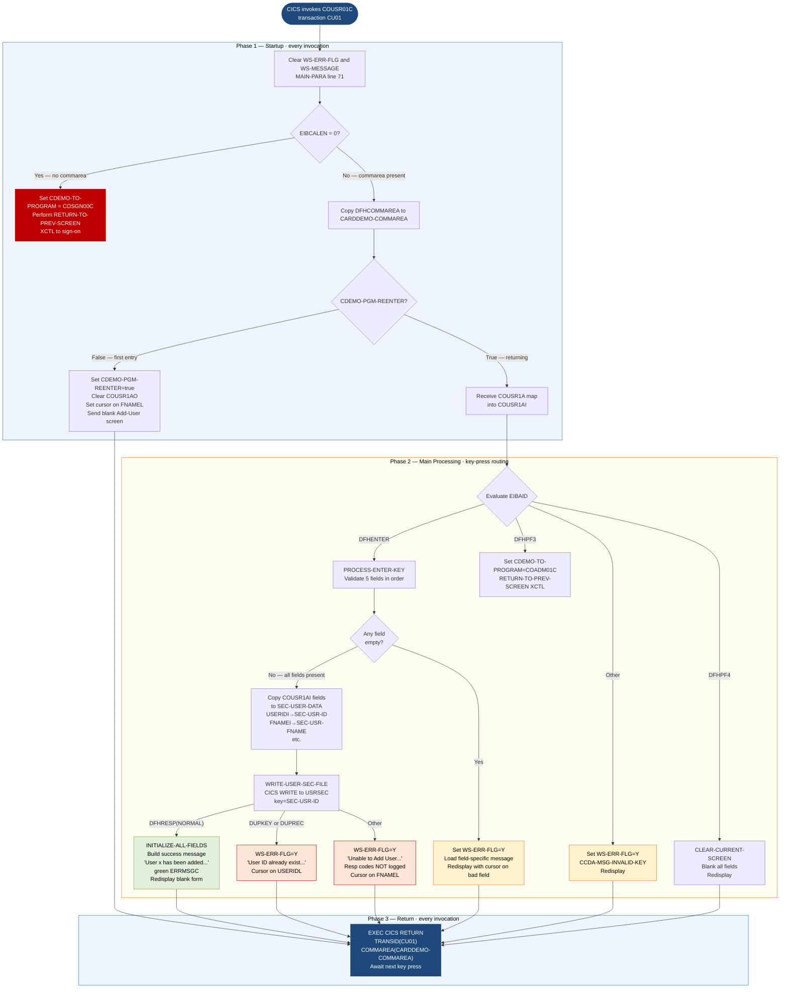

```
Application : AWS CardDemo
Source File : COUSR01C.cbl
Type        : Online CICS COBOL
Source Banner: Program     : COUSR01C.CBL / Application : CardDemo / Type : CICS COBOL Program / Function    : Add a new Regular/Admin user to USRSEC file
```

# COUSR01C — Add New User

This document describes what the program does in plain English so that a Java developer can understand every data action, screen interaction, and file write without reading COBOL source.

---

## 1. Purpose

COUSR01C is the **Add User** screen program in the CardDemo administrative subsystem. It runs under CICS with transaction code `CU01`. Its single job is to accept user registration data typed by an administrator and write one new record to the VSAM user security file identified by the CICS dataset name `USRSEC`.

The program reads nothing from `USRSEC` as part of its primary flow — it only writes. If the write detects a duplicate key it tells the operator. No external batch programs are called.

The user identity and navigation state are passed to and from the program through the CICS `COMMAREA` whose layout is defined in copybook `COCOM01Y`. The screen map is defined in the BMS mapset `COUSR01` (copybook `COUSR01.cpy`), providing input area `COUSR1AI` and output area `COUSR1AO`.

---

## 2. Program Flow

CICS programs do not run continuously. Each time the user presses a key, CICS invokes the program, which processes the key and returns, scheduling itself to be invoked again on the next key press. The three phases below describe the processing at each invocation.

### 2.1 Startup

Every invocation begins in `MAIN-PARA` (line 71). The program immediately clears the error flag `WS-ERR-FLG` (sets `ERR-FLG-OFF` true) and blanks `WS-MESSAGE` and the screen error field `ERRMSGO`.

**First-time entry — `EIBCALEN = 0`** (line 78): If the CICS communication area length is zero, no calling program passed a context. The program defaults the navigation target to `COSGN00C` (the sign-on screen) and performs `RETURN-TO-PREV-SCREEN`, transferring control via `XCTL`. This is a safety guard — the add-user screen should not be reachable without a login context.

**Normal entry — commarea present** (line 82): The program copies the commarea bytes into `CARDDEMO-COMMAREA`.

- If `CDEMO-PGM-REENTER` is false (first real display of this screen), the program sets it true, blanks the output map `COUSR1AO`, places cursor at `FNAMEL`, and calls `SEND-USRADD-SCREEN` to paint the empty form (line 87).
- If `CDEMO-PGM-REENTER` is already true (user has returned from a previous key press), the program calls `RECEIVE-USRADD-SCREEN` to collect what the user typed, then evaluates the attention identifier `EIBAID` (line 90).

### 2.2 Main Processing

The `EVALUATE EIBAID` block routes to one of four paths:

**Enter key (`DFHENTER`)** — calls `PROCESS-ENTER-KEY` (line 115). Validates all five required fields in sequence: `FNAMEI`, `LNAMEI`, `USERIDI`, `PASSWDI`, `USRTYPEI`. Each empty-field check sets `WS-ERR-FLG = 'Y'`, places an exact message in `WS-MESSAGE`, positions the cursor on the offending field via its length control (`FNAMEL`, `LNAMEL`, etc.), and calls `SEND-USRADD-SCREEN` to redisplay. The messages are:

| Condition | Message displayed |
|---|---|
| First name empty | `'First Name can NOT be empty...'` |
| Last name empty | `'Last Name can NOT be empty...'` |
| User ID empty | `'User ID can NOT be empty...'` |
| Password empty | `'Password can NOT be empty...'` |
| User type empty | `'User Type can NOT be empty...'` |

If all five fields pass validation (`ERR-FLG-ON` is false after the evaluate), the program copies the screen fields into the `SEC-USER-DATA` structure: `USERIDI` → `SEC-USR-ID`, `FNAMEI` → `SEC-USR-FNAME`, `LNAMEI` → `SEC-USR-LNAME`, `PASSWDI` → `SEC-USR-PWD`, `USRTYPEI` → `SEC-USR-TYPE`. It then calls `WRITE-USER-SEC-FILE` (line 238).

`WRITE-USER-SEC-FILE` issues a CICS WRITE to dataset `USRSEC` using `SEC-USR-ID` as the record key (line 241). Three outcomes:

- **DFHRESP(NORMAL)**: calls `INITIALIZE-ALL-FIELDS` to blank the form, then sets the error message colour to green (`DFHGREEN`) and builds the confirmation string `'User ' + SEC-USR-ID + ' has been added ...'` into `WS-MESSAGE`. Redisplays the blank form with the green confirmation.
- **DFHRESP(DUPKEY) or DFHRESP(DUPREC)**: sets `WS-ERR-FLG = 'Y'`, message `'User ID already exist...'`, cursor on `USERIDL`.
- **Other**: sets `WS-ERR-FLG = 'Y'`, message `'Unable to Add User...'`, cursor on `FNAMEL`. Note: the commented-out `DISPLAY 'RESP:' WS-RESP-CD 'REAS:' WS-REAS-CD` line (line 268) is inactive — detailed CICS response codes are never logged on this path.

**PF3 key (`DFHPF3`)** — sets `CDEMO-TO-PROGRAM` to `'COADM01C'` (admin menu) and calls `RETURN-TO-PREV-SCREEN`, transferring control via `XCTL`.

**PF4 key (`DFHPF4`)** — calls `CLEAR-CURRENT-SCREEN` (line 279), which calls `INITIALIZE-ALL-FIELDS` then `SEND-USRADD-SCREEN` to blank all input fields and redisplay.

**Any other key** — sets `WS-ERR-FLG = 'Y'`, copies `CCDA-MSG-INVALID-KEY` (`'Invalid key pressed. Please see below...'`) to `WS-MESSAGE`, positions cursor on `FNAMEL`, and redisplays.

### 2.3 Return

After all processing paths (except `XCTL` transfers), the program falls through to line 107:

```
EXEC CICS RETURN TRANSID(WS-TRANID) COMMAREA(CARDDEMO-COMMAREA) END-EXEC
```

This tells CICS to re-invoke transaction `CU01` with the updated commarea on the user's next key press. The program does not `GOBACK` or `STOP RUN` — CICS controls the lifecycle.

---

## 3. Error Handling

### 3.1 Field validation — `PROCESS-ENTER-KEY` (line 115)

Triggered when the user presses Enter. Each of the five required fields is tested in order. The first empty field stops evaluation, sets the error flag, loads the appropriate literal message, positions the screen cursor, and redisplays. No system abend; the operator sees the error message and corrects.

### 3.2 Duplicate user — `WRITE-USER-SEC-FILE`, DFHRESP(DUPKEY/DUPREC) (line 260)

When a user ID already exists in `USRSEC`, the program displays `'User ID already exist...'` and positions the cursor on the user ID field. No record is written.

### 3.3 Write failure — `WRITE-USER-SEC-FILE`, WHEN OTHER (line 267)

Any unexpected CICS condition code is caught by the `WHEN OTHER` branch. The message `'Unable to Add User...'` is shown. The CICS response code `WS-RESP-CD` and reason code `WS-REAS-CD` are **never displayed or logged** (the DISPLAY statement is commented out at line 268). This is a diagnostic gap — operators will see a generic message with no codes.

### 3.4 No-commarea guard — `MAIN-PARA` (line 78)

If `EIBCALEN = 0` the program treats this as an unexpected entry and exits to the sign-on screen. No error message is shown.

### 3.5 Invalid key — `MAIN-PARA` (line 98)

Unrecognised attention identifiers display `CCDA-MSG-INVALID-KEY` and redisplay the screen. No abend.

---

## 4. Migration Notes

1. **CICS response codes for write failures are swallowed (line 267–268).** The `DISPLAY` statement for `WS-RESP-CD` and `WS-REAS-CD` is commented out. Any write failure that is not a duplicate returns `'Unable to Add User...'` with no diagnostic information. The Java replacement must log the response and reason codes before surfacing the user message.

2. **Password is stored in plaintext.** `SEC-USR-PWD` (PIC X(8)) is written to `USRSEC` exactly as the user typed it. There is no hashing, salting, or masking. Migration must add proper credential handling.

3. **`WS-PGMNAME` is initialized to `'COUSR01C'` but `CDEMO-USER-ID` and `CDEMO-USER-TYPE` are never updated.** Lines 172–173 are commented out. The commarea's user identity fields are never written back by this program, meaning the downstream caller cannot read an updated user context after the add. This is intentional for the add-new-user case but should be verified.

4. **`CDEMO-CUST-ID`, `CDEMO-CUST-FNAME/MNAME/LNAME`, `CDEMO-ACCT-ID`, `CDEMO-ACCT-STATUS`, `CDEMO-CARD-NUM`, `CDEMO-LAST-MAP`, `CDEMO-LAST-MAPSET` from `COCOM01Y` are never used.** These fields exist in the commarea but this program neither reads nor writes them. They carry whatever values the calling program placed there.

5. **`SEC-USR-FILLER` (23 bytes) is written to the file but never populated by this program.** It will contain whatever was in working storage at the time of the WRITE — typically low-values or spaces from the initial copybook layout.

6. **The `WS-USR-MODIFIED` field present in COUSR02C and COUSR03C does not exist in COUSR01C.** The add-user flow has no concept of a modify-flag, which is correct, but the inconsistency means the three programs cannot share a common base class without conditional logic.

7. **No maximum-length check on password.** `PASSWDI` is PIC X(8). The user could type exactly 8 characters including spaces; if the entire 8 bytes are spaces the field still fails the empty-check and is rejected. However, there is no minimum-complexity or maximum-length guard beyond the physical field size.

8. **`DFHAID` and `DFHBMSCA` are CICS system copybooks not in this repository.** They define attention identifier constants and BMS colour attributes. Java replacements must replicate the constant values: `DFHENTER`, `DFHPF3`, `DFHPF4`, `DFHGREEN`, `DFHRED`, `DFHNEUTR`.

---

## Appendix A — Files

| Logical Name | DDname | Organization | Recording | Key Field | Direction | Contents |
|---|---|---|---|---|---|---|
| `USRSEC` (CICS dataset) | `USRSEC  ` (8 bytes, trailing spaces) | VSAM KSDS (keyed) | Fixed | `SEC-USR-ID` PIC X(8) — user ID | Output — write only (INSERT) | User security records; one per user; layout from `CSUSR01Y` |

---

## Appendix B — Copybooks and External Programs

### Copybook `COCOM01Y` — `CARDDEMO-COMMAREA` (WORKING-STORAGE, line 46)

Defines the shared communication area passed between all CardDemo CICS programs.

| Field | PIC | Bytes | Notes |
|---|---|---|---|
| `CDEMO-FROM-TRANID` | `X(04)` | 4 | Transaction ID of calling program |
| `CDEMO-FROM-PROGRAM` | `X(08)` | 8 | Program name of caller |
| `CDEMO-TO-TRANID` | `X(04)` | 4 | Target transaction ID (rarely set here) |
| `CDEMO-TO-PROGRAM` | `X(08)` | 8 | Navigation target; set to `'COADM01C'` on PF3 |
| `CDEMO-USER-ID` | `X(08)` | 8 | Logged-in user ID — **never written by COUSR01C** |
| `CDEMO-USER-TYPE` | `X(01)` | 1 | `'A'` = Admin (88 `CDEMO-USRTYP-ADMIN`); `'U'` = User (88 `CDEMO-USRTYP-USER`) — **never written by COUSR01C** |
| `CDEMO-PGM-CONTEXT` | `9(01)` | 1 | `0` = first entry (88 `CDEMO-PGM-ENTER`); `1` = re-entry (88 `CDEMO-PGM-REENTER`) |
| `CDEMO-CUST-ID` | `9(09)` | 9 | Customer ID — **not used by COUSR01C** |
| `CDEMO-CUST-FNAME` | `X(25)` | 25 | Customer first name — **not used** |
| `CDEMO-CUST-MNAME` | `X(25)` | 25 | Customer middle name — **not used** |
| `CDEMO-CUST-LNAME` | `X(25)` | 25 | Customer last name — **not used** |
| `CDEMO-ACCT-ID` | `9(11)` | 11 | Account ID — **not used** |
| `CDEMO-ACCT-STATUS` | `X(01)` | 1 | Account status — **not used** |
| `CDEMO-CARD-NUM` | `9(16)` | 16 | Card number — **not used** |
| `CDEMO-LAST-MAP` | `X(7)` | 7 | Last BMS map used — **not used** |
| `CDEMO-LAST-MAPSET` | `X(7)` | 7 | Last BMS mapset used — **not used** |

### Copybook `COUSR01` — `COUSR1AI` / `COUSR1AO` (WORKING-STORAGE, line 48)

BMS map structures for the Add User screen. `COUSR1AI` is the input structure (suffixed `I`); `COUSR1AO` redefines the same storage as output (suffixed `O`). Each field pair has a length control (`L` suffix, COMP S9(4)), attribute byte (`F`/`A`/`C`/`P`/`H`/`V` suffixes), and data subfield.

Key data fields used by COUSR01C:

| Input field | PIC | Bytes | Purpose |
|---|---|---|---|
| `TRNNAMEI` | `X(4)` | 4 | Transaction name (display only) |
| `TITLE01I` | `X(40)` | 40 | Screen title line 1 (display only) |
| `CURDATEI` | `X(8)` | 8 | Current date display field |
| `PGMNAMEI` | `X(8)` | 8 | Program name display field |
| `TITLE02I` | `X(40)` | 40 | Screen title line 2 (display only) |
| `CURTIMEI` | `X(8)` | 8 | Current time display field |
| `FNAMEI` | `X(20)` | 20 | First name input |
| `LNAMEI` | `X(20)` | 20 | Last name input |
| `USERIDI` | `X(8)` | 8 | User ID input (becomes VSAM key) |
| `PASSWDI` | `X(8)` | 8 | Password input (plaintext) |
| `USRTYPEI` | `X(1)` | 1 | User type input: `'A'` or `'U'` |
| `ERRMSGI` | `X(78)` | 78 | Error message display area |

Corresponding output fields in `COUSR1AO` have suffix `O` for data and `C` for colour attribute (`ERRMSGC` controls green/red colouring).

### Copybook `COTTL01Y` — `CCDA-SCREEN-TITLE` (WORKING-STORAGE, line 50)

| Field | PIC | Bytes | Value | Notes |
|---|---|---|---|---|
| `CCDA-TITLE01` | `X(40)` | 40 | `'      AWS Mainframe Modernization       '` | Screen title line 1 |
| `CCDA-TITLE02` | `X(40)` | 40 | `'              CardDemo                  '` | Screen title line 2 |
| `CCDA-THANK-YOU` | `X(40)` | 40 | `'Thank you for using CCDA application... '` | **Not used by COUSR01C** |

### Copybook `CSDAT01Y` — `WS-DATE-TIME` (WORKING-STORAGE, line 51)

| Field | PIC | Bytes | Notes |
|---|---|---|---|
| `WS-CURDATE-YEAR` | `9(04)` | 4 | 4-digit year from CURRENT-DATE |
| `WS-CURDATE-MONTH` | `9(02)` | 2 | Month |
| `WS-CURDATE-DAY` | `9(02)` | 2 | Day |
| `WS-CURDATE-N` | `9(08)` | 8 | Numeric redefinition of date |
| `WS-CURTIME-HOURS` | `9(02)` | 2 | Hours |
| `WS-CURTIME-MINUTE` | `9(02)` | 2 | Minutes |
| `WS-CURTIME-SECOND` | `9(02)` | 2 | Seconds |
| `WS-CURTIME-MILSEC` | `9(02)` | 2 | Milliseconds — **captured but not displayed** |
| `WS-CURDATE-MM` | `9(02)` | 2 | Formatted display month |
| `WS-CURDATE-DD` | `9(02)` | 2 | Formatted display day |
| `WS-CURDATE-YY` | `9(02)` | 2 | 2-digit display year (uses `WS-CURDATE-YEAR(3:2)`) |
| `WS-CURDATE-MM-DD-YY` | 8 bytes total | 8 | Display date formatted `MM/DD/YY` |
| `WS-CURTIME-HH` | `9(02)` | 2 | Formatted display hours |
| `WS-CURTIME-MM` | `9(02)` | 2 | Formatted display minutes |
| `WS-CURTIME-SS` | `9(02)` | 2 | Formatted display seconds |
| `WS-CURTIME-HH-MM-SS` | 8 bytes total | 8 | Display time `HH:MM:SS` |
| `WS-TIMESTAMP` | 23 bytes | 23 | Full timestamp field — **not used by COUSR01C** |

### Copybook `CSMSG01Y` — `CCDA-COMMON-MESSAGES` (WORKING-STORAGE, line 52)

| Field | PIC | Bytes | Value | Notes |
|---|---|---|---|---|
| `CCDA-MSG-THANK-YOU` | `X(50)` | 50 | `'Thank you for using CardDemo application...'` | **Not used by COUSR01C** |
| `CCDA-MSG-INVALID-KEY` | `X(50)` | 50 | `'Invalid key pressed. Please see below...'` | Displayed on unknown key press |

### Copybook `CSUSR01Y` — `SEC-USER-DATA` (WORKING-STORAGE, line 53)

Defines the user security record layout written to and read from `USRSEC`.

| Field | PIC | Bytes | Notes |
|---|---|---|---|
| `SEC-USR-ID` | `X(08)` | 8 | User ID — VSAM KSDS key |
| `SEC-USR-FNAME` | `X(20)` | 20 | First name |
| `SEC-USR-LNAME` | `X(20)` | 20 | Last name |
| `SEC-USR-PWD` | `X(08)` | 8 | Password — **stored in plaintext** |
| `SEC-USR-TYPE` | `X(01)` | 1 | `'A'` = Admin; `'U'` = Regular user |
| `SEC-USR-FILLER` | `X(23)` | 23 | Padding — **never populated by COUSR01C; written as low-values/spaces** |

Total record length: 80 bytes.

### Copybooks `DFHAID` and `DFHBMSCA`

CICS system copybooks defining attention identifier constants (`DFHENTER`, `DFHPF3`, `DFHPF4`, etc.) and BMS display attributes (`DFHGREEN`, `DFHRED`, `DFHNEUTR`). Not in this source repository; provided by the CICS runtime library.

---

## Appendix C — Hardcoded Literals

| Paragraph | Line | Value | Usage | Classification |
|---|---|---|---|---|
| `MAIN-PARA` | 79 | `'COSGN00C'` | Default navigation target when no commarea | System constant — sign-on program name |
| `MAIN-PARA` | 94 | `'COADM01C'` | Navigation target on PF3 | System constant — admin menu program name |
| `PROCESS-ENTER-KEY` | 120 | `'First Name can NOT be empty...'` | Field validation message | Display message |
| `PROCESS-ENTER-KEY` | 126 | `'Last Name can NOT be empty...'` | Field validation message | Display message |
| `PROCESS-ENTER-KEY` | 132 | `'User ID can NOT be empty...'` | Field validation message | Display message |
| `PROCESS-ENTER-KEY` | 138 | `'Password can NOT be empty...'` | Field validation message | Display message |
| `PROCESS-ENTER-KEY` | 144 | `'User Type can NOT be empty...'` | Field validation message | Display message |
| `WRITE-USER-SEC-FILE` | 255–257 | `'User ' + SEC-USR-ID + ' has been added ...'` | Success confirmation built with STRING | Display message |
| `WRITE-USER-SEC-FILE` | 263 | `'User ID already exist...'` | Duplicate-key error message | Display message |
| `WRITE-USER-SEC-FILE` | 270 | `'Unable to Add User...'` | Generic write-failure message | Display message |
| `WS-VARIABLES` | 37 | `'CU01'` | CICS transaction code for this program | System constant |
| `WS-VARIABLES` | 39 | `'USRSEC  '` | CICS dataset name (8 chars with trailing spaces) | System constant |

---

## Appendix D — Internal Working Fields

| Field | PIC | Bytes | Purpose |
|---|---|---|---|
| `WS-PGMNAME` | `X(08)` | 8 | Initialized to `'COUSR01C'`; written to `CDEMO-FROM-PROGRAM` on navigation |
| `WS-TRANID` | `X(04)` | 4 | `'CU01'`; passed to `CICS RETURN TRANSID` |
| `WS-MESSAGE` | `X(80)` | 80 | Working message buffer; copied to `ERRMSGO` before every screen send |
| `WS-USRSEC-FILE` | `X(08)` | 8 | `'USRSEC  '`; passed as dataset name to CICS WRITE |
| `WS-ERR-FLG` | `X(01)` | 1 | Error state flag; `'N'` = no error (88 `ERR-FLG-OFF`); `'Y'` = error (88 `ERR-FLG-ON`) |
| `WS-RESP-CD` | `S9(09) COMP` | 4 | CICS RESP return code from the WRITE command |
| `WS-REAS-CD` | `S9(09) COMP` | 4 | CICS RESP2 reason code from the WRITE command |

---

## Appendix E — Execution at a Glance



---

*Source: `COUSR01C.cbl`, CardDemo, Apache 2.0 license. Copybooks: `COCOM01Y.cpy`, `COUSR01.cpy`, `COTTL01Y.cpy`, `CSDAT01Y.cpy`, `CSMSG01Y.cpy`, `CSUSR01Y.cpy`. CICS system copybooks: `DFHAID`, `DFHBMSCA`.*
