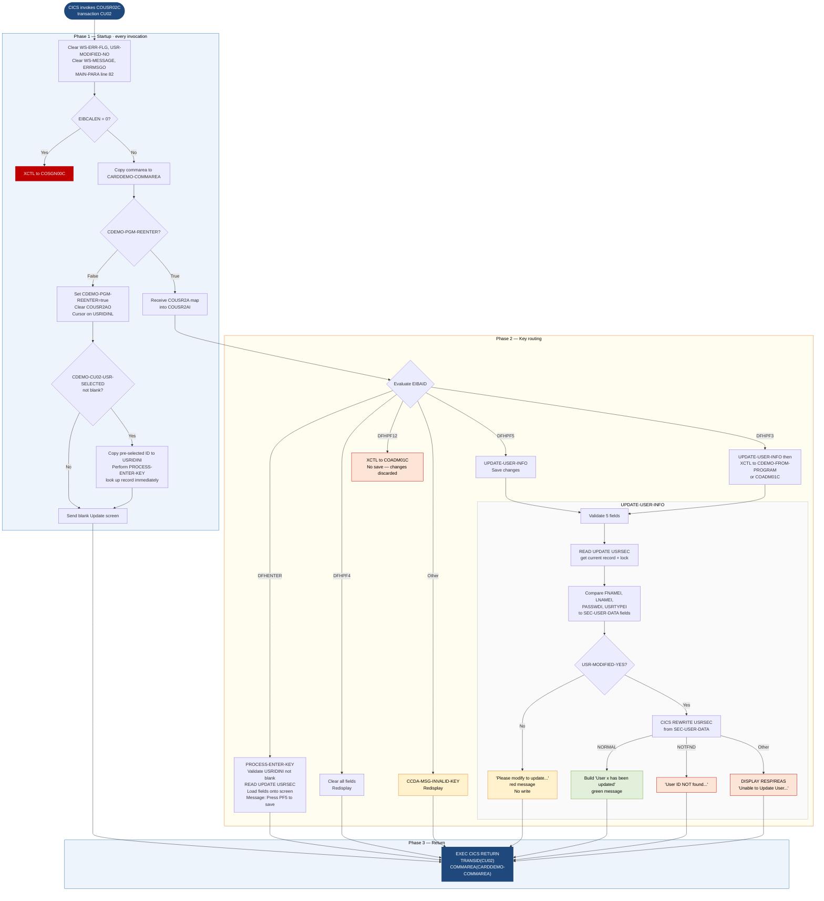

```
Application : AWS CardDemo
Source File : COUSR02C.cbl
Type        : Online CICS COBOL
Source Banner: Program     : COUSR02C.CBL / Application : CardDemo / Type : CICS COBOL Program / Function    : Update a user in USRSEC file
```

# COUSR02C — Update Existing User

This document describes what the program does in plain English so that a Java developer can understand every data action, screen interaction, and file operation without reading COBOL source.

---

## 1. Purpose

COUSR02C is the **Update User** screen program in the CardDemo administrative subsystem. It runs under CICS with transaction code `CU02`. Its job is to accept a user ID from the operator, retrieve the matching record from the VSAM user security file `USRSEC`, present the current values for editing, and — when the operator presses PF5 or PF3 — write the modified record back using a CICS REWRITE (update-in-place).

The program reads from `USRSEC` using `READ UPDATE`, which places a CICS lock on the record, preventing concurrent modification by another task until the record is rewritten or the task ends. No external batch programs are called.

Navigation context is carried in `CARDDEMO-COMMAREA` (`COCOM01Y`) extended inline with a COUSR02C-specific block `CDEMO-CU02-INFO` that carries pagination state and the pre-selected user ID from the calling list program.

---

## 2. Program Flow

### 2.1 Startup

Every invocation begins in `MAIN-PARA` (line 82). The program clears `WS-ERR-FLG`, `USR-MODIFIED-NO`, `WS-MESSAGE`, and `ERRMSGO`.

**First-time entry — `EIBCALEN = 0`** (line 90): defaults target to `COSGN00C` and exits via `RETURN-TO-PREV-SCREEN` (`XCTL`).

**Normal entry — commarea present** (line 94): copies commarea into `CARDDEMO-COMMAREA`.

- **First display** (`NOT CDEMO-PGM-REENTER`, line 95): sets `CDEMO-PGM-REENTER` true, clears `COUSR2AO`, sets cursor on `USRIDINL`. If the calling program pre-loaded a user ID into `CDEMO-CU02-USR-SELECTED` (not spaces or low-values, line 99), it copies that ID into `USRIDINI OF COUSR2AI` and immediately calls `PROCESS-ENTER-KEY` to look up the record. In either case calls `SEND-USRUPD-SCREEN`.

- **Re-entry** (line 106): calls `RECEIVE-USRUPD-SCREEN` then routes on `EIBAID`.

### 2.2 Main Processing

**Enter key (`DFHENTER`)** — calls `PROCESS-ENTER-KEY` (line 143).

Validates that `USRIDINI` is not blank. If blank: error `'User ID can NOT be empty...'`, cursor on `USRIDINL`.

If valid: copies `USRIDINI` to `SEC-USR-ID` and calls `READ-USER-SEC-FILE` (line 320). That paragraph issues a CICS READ UPDATE to `USRSEC`. On success, it copies the retrieved values to the screen fields (`SEC-USR-FNAME` → `FNAMEI`, `SEC-USR-LNAME` → `LNAMEI`, `SEC-USR-PWD` → `PASSWDI`, `SEC-USR-TYPE` → `USRTYPEI`) and redisplays with the message `'Press PF5 key to save your updates ...'` in neutral colour. The record lock is now held.

**PF3 key (`DFHPF3`)** — calls `UPDATE-USER-INFO` first (line 112), then navigates. The navigate target is `CDEMO-FROM-PROGRAM` if set, otherwise `'COADM01C'`. This means PF3 saves pending changes before leaving.

**PF4 key (`DFHPF4`)** — calls `CLEAR-CURRENT-SCREEN`, blanking all fields and redisplaying.

**PF5 key (`DFHPF5`)** — calls `UPDATE-USER-INFO` (line 123) without navigating away.

**PF12 key (`DFHPF12`)** — navigates to `'COADM01C'` without saving. **This is a discard path.**

**Other key** — sets error flag, displays `CCDA-MSG-INVALID-KEY`, redisplays.

`UPDATE-USER-INFO` (line 177):
1. Validates all five required fields in order (`USRIDINI`, `FNAMEI`, `LNAMEI`, `PASSWDI`, `USRTYPEI`). Each empty field shows the appropriate message and redisplays.
2. If all fields pass: copies `USRIDINI` to `SEC-USR-ID` and calls `READ-USER-SEC-FILE` again (to re-establish the lock and get the current record).
3. Compares each screen field to the corresponding `SEC-USER-DATA` field. Any differing field is written back to `SEC-USER-DATA` and sets `USR-MODIFIED-YES` to true.
4. If `USR-MODIFIED-YES`: calls `UPDATE-USER-SEC-FILE` (CICS REWRITE). On success, builds the message `'User ' + SEC-USR-ID + ' has been updated ...'` in green and redisplays.
5. If nothing changed: displays `'Please modify to update ...'` in red and redisplays without writing.

### 2.3 Return

After all processing, the program issues:

```
EXEC CICS RETURN TRANSID(WS-TRANID) COMMAREA(CARDDEMO-COMMAREA) END-EXEC
```

at line 135, re-scheduling transaction `CU02` for the next key press.

---

## 3. Error Handling

### 3.1 Read failure — `READ-USER-SEC-FILE` (line 320)

- **DFHRESP(NORMAL)**: success; displays `'Press PF5 key to save your updates ...'` in neutral colour.
- **DFHRESP(NOTFND)**: displays `'User ID NOT found...'`, cursor on `USRIDINL`.
- **Other**: `DISPLAY 'RESP:' WS-RESP-CD 'REAS:' WS-REAS-CD` (line 347) — note this DISPLAY is **active** (not commented out). Displays `'Unable to lookup User...'`, cursor on `FNAMEL`.

### 3.2 Rewrite failure — `UPDATE-USER-SEC-FILE` (line 358)

- **DFHRESP(NORMAL)**: success confirmation in green.
- **DFHRESP(NOTFND)**: `'User ID NOT found...'`.
- **Other**: `DISPLAY 'RESP:' WS-RESP-CD 'REAS:' WS-REAS-CD` (line 384) — active. `'Unable to Update User...'`.

### 3.3 No-change guard — `UPDATE-USER-INFO` (line 236)

If none of the four editable fields differ from the stored values, the program shows `'Please modify to update ...'` in red and does not call REWRITE.

### 3.4 Field validation — `UPDATE-USER-INFO` (line 177) and `PROCESS-ENTER-KEY` (line 143)

Same pattern as COUSR01C validation. Messages and cursor placement per field as listed in Appendix C.

---

## 4. Migration Notes

1. **Double READ UPDATE on every update path.** `UPDATE-USER-INFO` calls `READ-USER-SEC-FILE` first at line 217 (within `PROCESS-ENTER-KEY` if called from Enter-key path) and then again inside `UPDATE-USER-INFO` at line 217. The second READ UPDATE at line 217 re-reads and re-locks the same record, releasing the first lock. Between the two reads, another transaction could have modified the record. The Java replacement should use optimistic locking or a single read-then-rewrite within a transaction boundary.

2. **CICS record lock is held across screen interactions.** After `PROCESS-ENTER-KEY` reads the record with `UPDATE`, the CICS lock persists until `REWRITE` or task end. If the operator leaves the terminal idle after an Enter-key read, the lock prevents other tasks from updating that user record indefinitely. The Java replacement must use explicit lock timeouts.

3. **`CDEMO-CU02-INFO` block (lines 50–58) is inline in the source after the `COPY COCOM01Y` statement.** This is a code smell: extending a shared commarea copybook inline creates a brittle coupling. The fields `CDEMO-CU02-USRID-FIRST`, `CDEMO-CU02-USRID-LAST`, `CDEMO-CU02-PAGE-NUM`, `CDEMO-CU02-NEXT-PAGE-FLG`, `CDEMO-CU02-USR-SEL-FLG`, and `CDEMO-CU02-USR-SELECTED` are only used by this program and its caller — they are not in the copybook file itself.

4. **`CDEMO-CU02-PAGE-NUM`, `CDEMO-CU02-USR-SEL-FLG`, `CDEMO-CU02-USRID-FIRST`, and `CDEMO-CU02-USRID-LAST` are defined but never read or written by COUSR02C.** They exist for the pagination list screen that calls this program.

5. **PF12 discards changes silently.** When the user presses PF12 after modifying screen fields, the program navigates to `COADM01C` without calling `UPDATE-USER-INFO`. Any edits are lost without warning.

6. **`WS-USR-MODIFIED` reset timing.** `USR-MODIFIED-NO` is reset at the top of every CICS invocation (line 85), not just at the start of `UPDATE-USER-INFO`. This is correct because each key press is a fresh invocation, but it means the flag cannot carry information between invocations.

7. **CICS response codes for read and rewrite failures are logged via `DISPLAY`** (lines 347 and 384). Unlike COUSR01C's commented-out DISPLAY, these are active. However, `DISPLAY` output goes to CICS job log only; it is not surfaced to the operator screen. A Java implementation should propagate these codes to structured logging.

8. **Password comparison at line 227 is plaintext equality.** If the old and new passwords differ, the new plaintext password overwrites the stored plaintext password. Migration must introduce proper credential handling before this comparison.

9. **`SEC-USR-FILLER` (23 bytes) in `CSUSR01Y` is never read or written by COUSR02C.** The REWRITE preserves whatever bytes were in this field when the record was read.

---

## Appendix A — Files

| Logical Name | DDname | Organization | Recording | Key Field | Direction | Contents |
|---|---|---|---|---|---|---|
| `USRSEC` (CICS dataset) | `USRSEC  ` (8 bytes, trailing spaces) | VSAM KSDS | Fixed | `SEC-USR-ID` PIC X(8) | I-O — READ UPDATE then REWRITE | User security records; layout from `CSUSR01Y` |

---

## Appendix B — Copybooks and External Programs

### Copybook `COCOM01Y` — `CARDDEMO-COMMAREA` (WORKING-STORAGE, line 49)

Same as COUSR01C. See that document for the full field table. Fields not used by COUSR02C: `CDEMO-TO-TRANID`, `CDEMO-USER-ID`, `CDEMO-USER-TYPE`, `CDEMO-CUST-ID`, `CDEMO-CUST-FNAME/MNAME/LNAME`, `CDEMO-ACCT-ID`, `CDEMO-ACCT-STATUS`, `CDEMO-CARD-NUM`, `CDEMO-LAST-MAP`, `CDEMO-LAST-MAPSET`.

Inline extension after `COPY COCOM01Y` (lines 50–58):

| Field | PIC | Bytes | Notes |
|---|---|---|---|
| `CDEMO-CU02-USRID-FIRST` | `X(08)` | 8 | First user ID on current page — **not used by COUSR02C** |
| `CDEMO-CU02-USRID-LAST` | `X(08)` | 8 | Last user ID on current page — **not used by COUSR02C** |
| `CDEMO-CU02-PAGE-NUM` | `9(08)` | 8 | Current page number — **not used by COUSR02C** |
| `CDEMO-CU02-NEXT-PAGE-FLG` | `X(01)` | 1 | `'Y'` = more pages (88 `NEXT-PAGE-YES`); `'N'` = no more (88 `NEXT-PAGE-NO`) — **not used** |
| `CDEMO-CU02-USR-SEL-FLG` | `X(01)` | 1 | Selection flag from list screen — **not used by COUSR02C** |
| `CDEMO-CU02-USR-SELECTED` | `X(08)` | 8 | Pre-selected user ID passed from list screen; read at first entry (line 99) |

### Copybook `COUSR02` — `COUSR2AI` / `COUSR2AO` (WORKING-STORAGE, line 60)

BMS map for the Update User screen. Key data fields:

| Input field | PIC | Bytes | Purpose |
|---|---|---|---|
| `TRNNAMEI` | `X(4)` | 4 | Transaction name (display only) |
| `TITLE01I` | `X(40)` | 40 | Title line 1 |
| `CURDATEI` | `X(8)` | 8 | Current date |
| `PGMNAMEI` | `X(8)` | 8 | Program name |
| `TITLE02I` | `X(40)` | 40 | Title line 2 |
| `CURTIMEI` | `X(8)` | 8 | Current time |
| `USRIDINI` | `X(8)` | 8 | User ID lookup input (becomes `SEC-USR-ID`) |
| `FNAMEI` | `X(20)` | 20 | First name (editable) |
| `LNAMEI` | `X(20)` | 20 | Last name (editable) |
| `PASSWDI` | `X(8)` | 8 | Password (editable, plaintext) |
| `USRTYPEI` | `X(1)` | 1 | User type (editable) |
| `ERRMSGI` | `X(78)` | 78 | Error/status message area |

Note: COUSR02 does not have a `USERIDI` field (that is COUSR01's field for new-user ID input). Instead it has `USRIDINI` for the lookup ID. Also note COUSR02 does not have `PASSWDI` in COUSR03's map — see COUSR03 for the delete variant.

### Copybook `COTTL01Y` — `CCDA-SCREEN-TITLE`

Same as COUSR01C. `CCDA-THANK-YOU` not used.

### Copybook `CSDAT01Y` — `WS-DATE-TIME`

Same as COUSR01C. `WS-TIMESTAMP` not used.

### Copybook `CSMSG01Y` — `CCDA-COMMON-MESSAGES`

Same as COUSR01C. `CCDA-MSG-INVALID-KEY` used on unknown key press.

### Copybook `CSUSR01Y` — `SEC-USER-DATA`

| Field | PIC | Bytes | Notes |
|---|---|---|---|
| `SEC-USR-ID` | `X(08)` | 8 | VSAM key; set from `USRIDINI` before READ and REWRITE |
| `SEC-USR-FNAME` | `X(20)` | 20 | First name; compared to `FNAMEI` |
| `SEC-USR-LNAME` | `X(20)` | 20 | Last name; compared to `LNAMEI` |
| `SEC-USR-PWD` | `X(08)` | 8 | Password; compared to `PASSWDI` — **plaintext** |
| `SEC-USR-TYPE` | `X(01)` | 1 | User type; compared to `USRTYPEI` |
| `SEC-USR-FILLER` | `X(23)` | 23 | Padding — **never modified by COUSR02C; preserved from stored record** |

---

## Appendix C — Hardcoded Literals

| Paragraph | Line | Value | Usage | Classification |
|---|---|---|---|---|
| `MAIN-PARA` | 91 | `'COSGN00C'` | Default navigation when no commarea | System constant |
| `MAIN-PARA` | 114 | `'COADM01C'` | Default navigation on PF3 (if FROM not set) | System constant |
| `MAIN-PARA` | 125 | `'COADM01C'` | Navigation on PF12 (discard) | System constant |
| `PROCESS-ENTER-KEY` | 148 | `'User ID can NOT be empty...'` | Validation message | Display message |
| `UPDATE-USER-INFO` | 181 | `'User ID can NOT be empty...'` | Validation message | Display message |
| `UPDATE-USER-INFO` | 187 | `'First Name can NOT be empty...'` | Validation message | Display message |
| `UPDATE-USER-INFO` | 193 | `'Last Name can NOT be empty...'` | Validation message | Display message |
| `UPDATE-USER-INFO` | 199 | `'Password can NOT be empty...'` | Validation message | Display message |
| `UPDATE-USER-INFO` | 205 | `'User Type can NOT be empty...'` | Validation message | Display message |
| `UPDATE-USER-INFO` | 239 | `'Please modify to update ...'` | No-change warning | Display message |
| `UPDATE-USER-SEC-FILE` | 372–374 | `'User ' + SEC-USR-ID + ' has been updated ...'` | Success confirmation (STRING) | Display message |
| `READ-USER-SEC-FILE` | 336 | `'Press PF5 key to save your updates ...'` | Instruction after successful read | Display message |
| `READ-USER-SEC-FILE` | 341 | `'User ID NOT found...'` | Not-found message | Display message |
| `READ-USER-SEC-FILE` | 349 | `'Unable to lookup User...'` | Generic read failure | Display message |
| `UPDATE-USER-SEC-FILE` | 378 | `'User ID NOT found...'` | Not-found on rewrite | Display message |
| `UPDATE-USER-SEC-FILE` | 386 | `'Unable to Update User...'` | Generic rewrite failure | Display message |
| `WS-VARIABLES` | 37 | `'CU02'` | CICS transaction code | System constant |
| `WS-VARIABLES` | 39 | `'USRSEC  '` | CICS dataset name | System constant |

---

## Appendix D — Internal Working Fields

| Field | PIC | Bytes | Purpose |
|---|---|---|---|
| `WS-PGMNAME` | `X(08)` | 8 | `'COUSR02C'`; written to `CDEMO-FROM-PROGRAM` on navigation |
| `WS-TRANID` | `X(04)` | 4 | `'CU02'`; passed to `CICS RETURN TRANSID` |
| `WS-MESSAGE` | `X(80)` | 80 | Working message buffer |
| `WS-USRSEC-FILE` | `X(08)` | 8 | `'USRSEC  '`; dataset name for CICS READ and REWRITE |
| `WS-ERR-FLG` | `X(01)` | 1 | Error flag; `'N'` (88 `ERR-FLG-OFF`); `'Y'` (88 `ERR-FLG-ON`) |
| `WS-RESP-CD` | `S9(09) COMP` | 4 | CICS RESP code |
| `WS-REAS-CD` | `S9(09) COMP` | 4 | CICS RESP2 reason code |
| `WS-USR-MODIFIED` | `X(01)` | 1 | `'N'` no change (88 `USR-MODIFIED-NO`); `'Y'` changed (88 `USR-MODIFIED-YES`); reset on every invocation |

---

## Appendix E — Execution at a Glance



---

*Source: `COUSR02C.cbl`, CardDemo, Apache 2.0 license. Copybooks: `COCOM01Y.cpy`, `COUSR02.cpy`, `COTTL01Y.cpy`, `CSDAT01Y.cpy`, `CSMSG01Y.cpy`, `CSUSR01Y.cpy`. CICS system copybooks: `DFHAID`, `DFHBMSCA`.*
