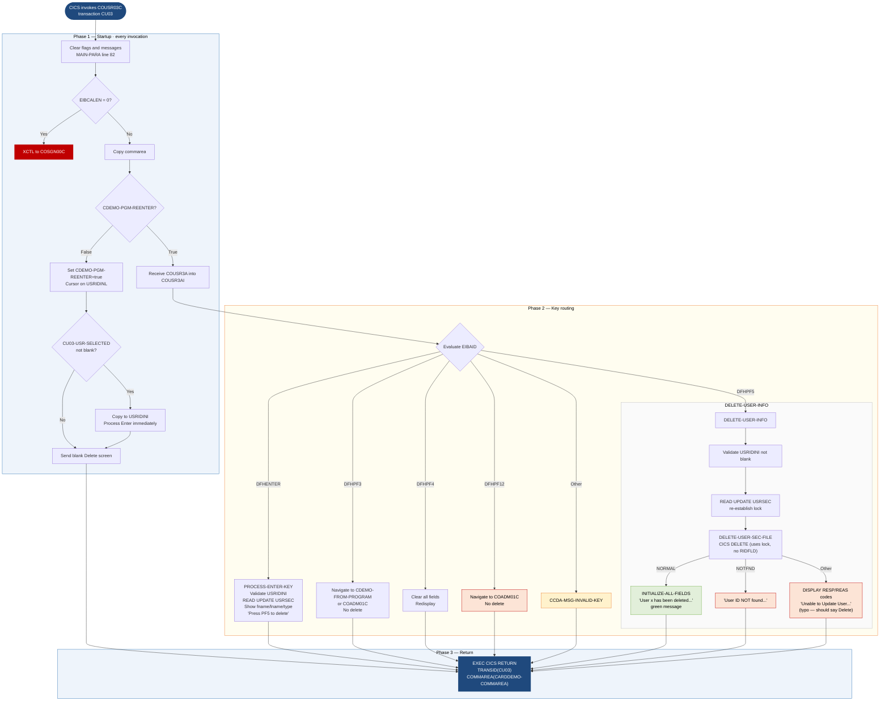

```
Application : AWS CardDemo
Source File : COUSR03C.cbl
Type        : Online CICS COBOL
Source Banner: Program     : COUSR03C.CBL / Application : CardDemo / Type : CICS COBOL Program / Function    : Delete a user from USRSEC file
```

# COUSR03C — Delete User

This document describes what the program does in plain English so that a Java developer can understand every data action, screen interaction, and file operation without reading COBOL source.

---

## 1. Purpose

COUSR03C is the **Delete User** screen program in the CardDemo administrative subsystem. It runs under CICS with transaction code `CU03`. Its job is to accept a user ID from the operator, display the matching user record for confirmation, and — when the operator presses PF5 — delete that record from the VSAM user security file `USRSEC`.

The delete is a CICS DELETE issued immediately after a READ UPDATE that locked the record. No other external programs are called.

Navigation context is carried in `CARDDEMO-COMMAREA` (`COCOM01Y`) extended with the inline block `CDEMO-CU03-INFO` (carrying the pre-selected user ID from the calling list screen).

---

## 2. Program Flow

### 2.1 Startup

Every invocation begins in `MAIN-PARA` (line 82). The program clears `WS-ERR-FLG`, `USR-MODIFIED-NO`, `WS-MESSAGE`, and `ERRMSGO`.

**First-time entry — `EIBCALEN = 0`** (line 90): defaults target to `COSGN00C` and exits via `RETURN-TO-PREV-SCREEN`.

**Normal entry** (line 94): copies commarea into `CARDDEMO-COMMAREA`.

- **First display** (`NOT CDEMO-PGM-REENTER`, line 95): sets `CDEMO-PGM-REENTER` true, clears `COUSR3AO`, sets cursor on `USRIDINL`. If `CDEMO-CU03-USR-SELECTED` is not blank (line 99), copies the ID to `USRIDINI` and performs `PROCESS-ENTER-KEY` to pre-load the user's details. Then sends the screen.

- **Re-entry** (line 106): calls `RECEIVE-USRDEL-SCREEN` then routes on `EIBAID`.

### 2.2 Main Processing

**Enter key (`DFHENTER`)** — calls `PROCESS-ENTER-KEY` (line 142). Validates `USRIDINI` not blank. Copies `USRIDINI` to `SEC-USR-ID` and calls `READ-USER-SEC-FILE` (line 267). On success, populates `FNAMEI`, `LNAMEI`, `USRTYPEI` from the record and sends the screen with the instruction `'Press PF5 key to delete this user ...'`. Note: `PASSWDI` is **not populated on the delete screen** — the delete map (`COUSR03`) has no password field visible, and the source never copies `SEC-USR-PWD` to any screen field.

**PF3 key (`DFHPF3`)** — navigates to `CDEMO-FROM-PROGRAM` if set, otherwise `'COADM01C'`. No delete is performed.

**PF4 key (`DFHPF4`)** — clears all fields and redisplays.

**PF5 key (`DFHPF5`)** — calls `DELETE-USER-INFO` (line 174). That paragraph validates `USRIDINI` is not blank, then calls `READ-USER-SEC-FILE` (to re-establish the lock) and then `DELETE-USER-SEC-FILE` (line 305).

**PF12 key (`DFHPF12`)** — navigates to `'COADM01C'` without deleting.

**Other key** — error message `CCDA-MSG-INVALID-KEY`, redisplay.

`DELETE-USER-SEC-FILE` (line 305) issues a CICS DELETE against `USRSEC` (note: **no RIDFLD is specified**; the delete applies to the record currently locked from the preceding READ UPDATE). Outcomes:

- **DFHRESP(NORMAL)**: calls `INITIALIZE-ALL-FIELDS`, builds success message `'User ' + SEC-USR-ID + ' has been deleted ...'` in green, redisplays blank form.
- **DFHRESP(NOTFND)**: `'User ID NOT found...'`.
- **Other**: `DISPLAY 'RESP:' WS-RESP-CD 'REAS:' WS-REAS-CD` (line 330, active). `'Unable to Update User...'` — note the message says "Update" rather than "Delete": this is a copy-paste error from COUSR02C.

### 2.3 Return

After all processing paths:

```
EXEC CICS RETURN TRANSID(WS-TRANID) COMMAREA(CARDDEMO-COMMAREA) END-EXEC
```

at line 134, re-scheduling transaction `CU03`.

---

## 3. Error Handling

### 3.1 Read failure — `READ-USER-SEC-FILE` (line 267)

- **DFHRESP(NORMAL)**: displays `'Press PF5 key to delete this user ...'` in neutral colour.
- **DFHRESP(NOTFND)**: `'User ID NOT found...'`, cursor on `USRIDINL`.
- **Other**: `DISPLAY 'RESP:' WS-RESP-CD 'REAS:' WS-REAS-CD` (line 294, active); `'Unable to lookup User...'`, cursor on `FNAMEL`.

### 3.2 Delete failure — `DELETE-USER-SEC-FILE` (line 305)

- **DFHRESP(NORMAL)**: clears form, green success message.
- **DFHRESP(NOTFND)**: `'User ID NOT found...'`.
- **Other**: `DISPLAY` of resp codes; `'Unable to Update User...'` (copy-paste error — should say "Delete").

### 3.3 No-commarea guard, invalid key, field validation

Same patterns as COUSR01C and COUSR02C.

---

## 4. Migration Notes

1. **Delete error message says "Unable to Update User..." (line 333) — copy-paste error from COUSR02C.** The correct message should say "Unable to Delete User...". This typo must be preserved in the COBOL but corrected in the Java replacement.

2. **CICS DELETE uses no RIDFLD clause (line 307–310).** The delete relies on the CICS record position established by the preceding READ UPDATE. If the READ UPDATE and DELETE are not in the same CICS task or if any intervening CICS call released the lock, the behaviour is undefined. Java must use explicit keyed deletion.

3. **Double READ UPDATE before delete.** `DELETE-USER-INFO` calls `READ-USER-SEC-FILE` (line 190), which issues READ UPDATE, then immediately calls `DELETE-USER-SEC-FILE`. This creates a read-then-delete sequence under lock — correct but redundant if the record was already locked from the `PROCESS-ENTER-KEY` Enter-key read. The Java replacement should issue a single keyed delete by ID.

4. **`INITIALIZE-ALL-FIELDS` for COUSR03C does not blank `PASSWDI`** (line 349–356). Looking at the paragraph, the cleared fields are `USRIDINI`, `FNAMEI`, `LNAMEI`, `USRTYPEI`, `WS-MESSAGE`. There is no password field in the delete map, so this is correct, but it means the `SEC-USR-FILLER` pattern differs from COUSR01C.

5. **`SEC-USR-PWD` is read from the file but never displayed.** When `READ-USER-SEC-FILE` succeeds, `SEC-USR-PWD` is in working storage but the program copies only fname, lname, and user-type to the screen. The password is never shown to the administrator on the delete confirmation screen. This is appropriate for security but means any post-delete audit trail lacks password information.

6. **`CDEMO-CU03-PAGE-NUM`, `CDEMO-CU03-USRID-FIRST`, `CDEMO-CU03-USRID-LAST`, `CDEMO-CU03-USR-SEL-FLG` are defined but never used by COUSR03C.** Same pattern as COUSR02C's inline commarea extension.

7. **`CDEMO-USER-ID` and `CDEMO-USER-TYPE` are never written back**, same as COUSR01C and COUSR02C. Comments at the equivalent lines are not present in COUSR03C (unlike COUSR01C lines 172–173), so the gap is less visible.

8. **`WS-USR-MODIFIED` is declared (line 45) but never set to `'Y'`** by COUSR03C. It is reset to `'N'` at the top of each invocation but no code path ever sets it to `USR-MODIFIED-YES`. It is a vestigial field copied from COUSR02C that serves no function here.

---

## Appendix A — Files

| Logical Name | DDname | Organization | Recording | Key Field | Direction | Contents |
|---|---|---|---|---|---|---|
| `USRSEC` (CICS dataset) | `USRSEC  ` (8 bytes) | VSAM KSDS | Fixed | `SEC-USR-ID` PIC X(8) | I-O — READ UPDATE then DELETE | User security records; layout from `CSUSR01Y` |

---

## Appendix B — Copybooks and External Programs

### Copybook `COCOM01Y` — `CARDDEMO-COMMAREA` (WORKING-STORAGE, line 49)

Same layout as documented in COUSR01C. Fields not used by COUSR03C: `CDEMO-TO-TRANID`, `CDEMO-USER-ID`, `CDEMO-USER-TYPE`, `CDEMO-CUST-*`, `CDEMO-ACCT-*`, `CDEMO-CARD-NUM`, `CDEMO-LAST-MAP`, `CDEMO-LAST-MAPSET`.

Inline extension (lines 50–58):

| Field | PIC | Bytes | Notes |
|---|---|---|---|
| `CDEMO-CU03-USRID-FIRST` | `X(08)` | 8 | **Not used by COUSR03C** |
| `CDEMO-CU03-USRID-LAST` | `X(08)` | 8 | **Not used by COUSR03C** |
| `CDEMO-CU03-PAGE-NUM` | `9(08)` | 8 | **Not used by COUSR03C** |
| `CDEMO-CU03-NEXT-PAGE-FLG` | `X(01)` | 1 | `'Y'`/`'N'` page flag — **not used** |
| `CDEMO-CU03-USR-SEL-FLG` | `X(01)` | 1 | **Not used by COUSR03C** |
| `CDEMO-CU03-USR-SELECTED` | `X(08)` | 8 | Pre-selected user ID from list screen; read at first entry |

### Copybook `COUSR03` — `COUSR3AI` / `COUSR3AO` (WORKING-STORAGE, line 60)

BMS map for the Delete User screen. Key data fields:

| Input field | PIC | Bytes | Purpose |
|---|---|---|---|
| `TRNNAMEI` | `X(4)` | 4 | Transaction name (display only) |
| `TITLE01I` | `X(40)` | 40 | Title line 1 |
| `CURDATEI` | `X(8)` | 8 | Current date |
| `PGMNAMEI` | `X(8)` | 8 | Program name |
| `TITLE02I` | `X(40)` | 40 | Title line 2 |
| `CURTIMEI` | `X(8)` | 8 | Current time |
| `USRIDINI` | `X(8)` | 8 | User ID input (lookup key) |
| `FNAMEI` | `X(20)` | 20 | First name (display only in delete context) |
| `LNAMEI` | `X(20)` | 20 | Last name (display only) |
| `USRTYPEI` | `X(1)` | 1 | User type (display only) |
| `ERRMSGI` | `X(78)` | 78 | Error/status message |

Note: the delete map has **no password field** — there is no `PASSWDI` in `COUSR3AI`. This differs from `COUSR1AI` and `COUSR2AI`.

### Copybooks `COTTL01Y`, `CSDAT01Y`, `CSMSG01Y`, `CSUSR01Y`

Same layouts as documented in COUSR01C and COUSR02C. `SEC-USR-PWD` is present in `SEC-USER-DATA` and read from the file but never transferred to the screen by COUSR03C.

---

## Appendix C — Hardcoded Literals

| Paragraph | Line | Value | Usage | Classification |
|---|---|---|---|---|
| `MAIN-PARA` | 91 | `'COSGN00C'` | Default navigation without commarea | System constant |
| `MAIN-PARA` | 113 | `'COADM01C'` | PF3 navigation fallback | System constant |
| `MAIN-PARA` | 124 | `'COADM01C'` | PF12 navigation | System constant |
| `PROCESS-ENTER-KEY` | 147 | `'User ID can NOT be empty...'` | Validation | Display message |
| `DELETE-USER-INFO` | 178 | `'User ID can NOT be empty...'` | Validation | Display message |
| `READ-USER-SEC-FILE` | 283 | `'Press PF5 key to delete this user ...'` | Instruction after lookup | Display message |
| `READ-USER-SEC-FILE` | 289 | `'User ID NOT found...'` | Not-found on read | Display message |
| `READ-USER-SEC-FILE` | 296 | `'Unable to lookup User...'` | Read failure | Display message |
| `DELETE-USER-SEC-FILE` | 318–320 | `'User ' + SEC-USR-ID + ' has been deleted ...'` | Success confirmation (STRING) | Display message |
| `DELETE-USER-SEC-FILE` | 325 | `'User ID NOT found...'` | Not-found on delete | Display message |
| `DELETE-USER-SEC-FILE` | 333 | `'Unable to Update User...'` | Delete failure — **(typo: should say Delete, not Update)** | Display message |
| `WS-VARIABLES` | 37 | `'CU03'` | CICS transaction code | System constant |
| `WS-VARIABLES` | 39 | `'USRSEC  '` | CICS dataset name | System constant |

---

## Appendix D — Internal Working Fields

| Field | PIC | Bytes | Purpose |
|---|---|---|---|
| `WS-PGMNAME` | `X(08)` | 8 | `'COUSR03C'`; written to `CDEMO-FROM-PROGRAM` on navigation |
| `WS-TRANID` | `X(04)` | 4 | `'CU03'`; CICS RETURN transaction |
| `WS-MESSAGE` | `X(80)` | 80 | Working message buffer |
| `WS-USRSEC-FILE` | `X(08)` | 8 | `'USRSEC  '`; dataset name for all CICS file commands |
| `WS-ERR-FLG` | `X(01)` | 1 | Error flag `'N'`/`'Y'` |
| `WS-RESP-CD` | `S9(09) COMP` | 4 | CICS RESP |
| `WS-REAS-CD` | `S9(09) COMP` | 4 | CICS RESP2 |
| `WS-USR-MODIFIED` | `X(01)` | 1 | Vestigial flag — declared, reset each invocation, **never set to `'Y'` in COUSR03C** |

---

## Appendix E — Execution at a Glance



---

*Source: `COUSR03C.cbl`, CardDemo, Apache 2.0 license. Copybooks: `COCOM01Y.cpy`, `COUSR03.cpy`, `COTTL01Y.cpy`, `CSDAT01Y.cpy`, `CSMSG01Y.cpy`, `CSUSR01Y.cpy`. CICS system copybooks: `DFHAID`, `DFHBMSCA`.*
