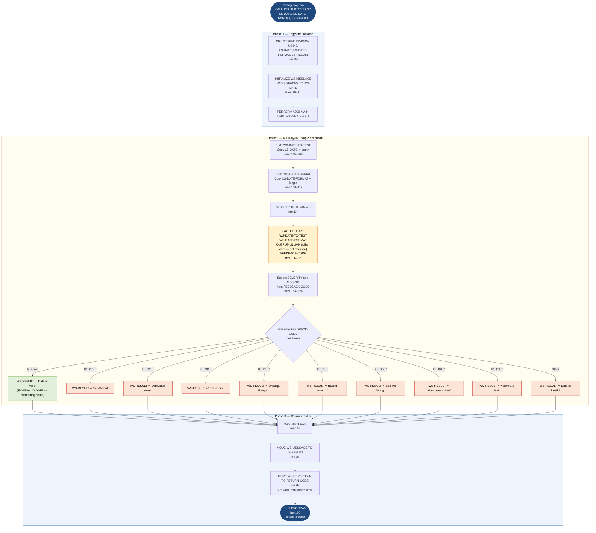

```
Application : AWS CardDemo
Source File : CSUTLDTC.cbl
Type        : Batch COBOL — callable subroutine
Source Banner: CALL TO CEEDAYS
```

# CSUTLDTC — Date Validation and Conversion Subroutine

This document describes what the program does in plain English so that a Java developer can understand every parameter, validation path, and return value without reading COBOL source.

---

## 1. Purpose

CSUTLDTC is a **reusable batch subroutine** that validates a date string and, if valid, converts it to a Lilian day number. It wraps the IBM Language Environment service `CEEDAYS`, which converts a character-format date into the number of days since 15 October 1582 (the Gregorian calendar epoch, called the Lilian date).

The program accepts three parameters via its `PROCEDURE DIVISION USING` clause:

| Parameter | PIC | Direction | Meaning |
|---|---|---|---|
| `LS-DATE` | `X(10)` | Input | The date string to validate, e.g. `'2024-04-28'` |
| `LS-DATE-FORMAT` | `X(10)` | Input | The format mask describing `LS-DATE`, e.g. `'YYYY-MM-DD'` |
| `LS-RESULT` | `X(80)` | Output | 80-byte diagnostic message including severity, message code, result text, the date tested, and the format mask used |

It returns a numeric severity value in `RETURN-CODE`: `0` means the date is valid; any non-zero value indicates an error whose meaning is encoded in the feedback code from `CEEDAYS`.

No files are read or written. No CICS commands are used.

---

## 2. Program Flow

### 2.1 Startup

The program is invoked with `CALL 'CSUTLDTC' USING date, format, result-area` from any calling program (line 88). There is no file open sequence and no one-time initialization beyond clearing the message area.

**Step 1 — Initialize message area and date field** (line 90): clears `WS-MESSAGE` and blanks `WS-DATE`.

**Step 2 — Call the main paragraph** (line 93): calls `A000-MAIN` through `A000-MAIN-EXIT`.

**Step 3 — Return results** (lines 97–99): copies `WS-MESSAGE` (80 bytes) into `LS-RESULT`, moves the numeric severity from `WS-SEVERITY-N` into `RETURN-CODE`, and issues `EXIT PROGRAM` (returning control to the caller). `GOBACK` at line 101 is commented out.

### 2.2 Main Processing — `A000-MAIN` (line 103)

**Step 4 — Build the CEEDAYS date parameter** (lines 105–107): copies the length of `LS-DATE` (always 10, since `LS-DATE` is `PIC X(10)`) into `Vstring-length OF WS-DATE-TO-TEST`, copies the date text into `Vstring-text OF WS-DATE-TO-TEST`, and also copies it into `WS-DATE` for display in the result message.

**Step 5 — Build the CEEDAYS format parameter** (lines 109–113): copies the length of `LS-DATE-FORMAT` into `Vstring-length OF WS-DATE-FORMAT`, copies the format text into `Vstring-text OF WS-DATE-FORMAT`, and also copies it into `WS-DATE-FMT` for display.

**Step 6 — Clear the output slot** (line 114): sets `OUTPUT-LILLIAN` to zero before the call. This ensures that if `CEEDAYS` fails and does not populate the output, the field does not carry a stale Lilian date from a previous call.

**Step 7 — Call `CEEDAYS`** (lines 116–120): passes four parameters: the variable-length date string `WS-DATE-TO-TEST`, the variable-length format string `WS-DATE-FORMAT`, the output Lilian date `OUTPUT-LILLIAN`, and the feedback code structure `FEEDBACK-CODE`. `CEEDAYS` writes the Lilian day number into `OUTPUT-LILLIAN` (or leaves it at zero if invalid) and fills `FEEDBACK-CODE` with a structured result token.

**Step 8 — Capture diagnostic fields** (lines 122–124): copies `WS-DATE-TO-TEST` back into `WS-DATE` (overwrites step 4's copy with whatever CEEDAYS may have altered — in practice identical), extracts the 16-bit severity (`SEVERITY OF FEEDBACK-CODE`) into `WS-SEVERITY-N`, and the 16-bit message number (`MSG-NO OF FEEDBACK-CODE`) into `WS-MSG-NO-N`.

**Step 9 — Classify the result** (lines 128–149): evaluates the 8-byte feedback token against nine known 88-level values:

| 88-level name | Feedback token hex value | Result text placed in `WS-RESULT` |
|---|---|---|
| `FC-INVALID-DATE` | `X'0000000000000000'` | `'Date is valid'` — a zero token means success |
| `FC-INSUFFICIENT-DATA` | `X'000309CB59C3C5C5'` | `'Insufficient'` |
| `FC-BAD-DATE-VALUE` | `X'000309CC59C3C5C5'` | `'Datevalue error'` |
| `FC-INVALID-ERA` | `X'000309CD59C3C5C5'` | `'Invalid Era    '` |
| `FC-UNSUPP-RANGE` | `X'000309D159C3C5C5'` | `'Unsupp. Range  '` |
| `FC-INVALID-MONTH` | `X'000309D559C3C5C5'` | `'Invalid month  '` |
| `FC-BAD-PIC-STRING` | `X'000309D659C3C5C5'` | `'Bad Pic String '` |
| `FC-NON-NUMERIC-DATA` | `X'000309D859C3C5C5'` | `'Nonnumeric data'` |
| `FC-YEAR-IN-ERA-ZERO` | `X'000309D959C3C5C5'` | `'YearInEra is 0 '` |
| `WHEN OTHER` | Any unrecognised token | `'Date is invalid'` |

The result text (exactly 15 characters) is placed in `WS-RESULT` within `WS-MESSAGE`. The caller receives this through `LS-RESULT`.

**Important naming note:** the 88-level `FC-INVALID-DATE` (value all zeros) is named to suggest an invalid date, but it actually represents **success** — a zero feedback token means `CEEDAYS` found no error. The result text `'Date is valid'` confirms this. The naming is misleading and is a latent documentation trap.

### 2.3 Shutdown

`A000-MAIN-EXIT` (line 152) is an `EXIT` paragraph used as the `THRU` target in the `PERFORM`. After it, control returns to the main body at line 97, which sets `LS-RESULT`, sets `RETURN-CODE`, and issues `EXIT PROGRAM`.

---

## 3. Error Handling

There is no error-routine paragraph. All error paths are handled by the `EVALUATE` in `A000-MAIN` (step 9 above). On any error the program places a human-readable 15-character string in `WS-RESULT`, copies the full 80-byte `WS-MESSAGE` (which includes severity, message code, result text, date, and format) into `LS-RESULT`, and returns a non-zero `RETURN-CODE` derived from the CEEDAYS severity field.

**The caller is responsible for checking `RETURN-CODE` or examining `LS-RESULT`.** If a caller ignores `RETURN-CODE`, a silently invalid date will not be caught.

---

## 4. Migration Notes

1. **`FC-INVALID-DATE` (X'0000000000000000') means the date IS valid, not invalid.** The 88-level name is the inverse of its meaning. Every Java developer reading this code should note: zero feedback = success = `'Date is valid'`. Migration must rename this constant to something like `FC-DATE-VALID` or `FC-NO-ERROR`.

2. **`OUTPUT-LILLIAN` (PIC S9(9) BINARY, 4 bytes) is populated on success but never returned to the caller.** The Lilian date number — the primary numeric output of `CEEDAYS` — is computed and left in working storage but not placed in `LS-RESULT` and not accessible to the caller. The caller receives only the 80-byte diagnostic text. Any migration that needs the Lilian day number as a Java `long` must either add a fourth parameter or return it through a different mechanism.

3. **`LS-RESULT` is 80 bytes of character text, not a structured object.** Callers must parse substrings to extract severity, message code, result text, date, and format. In Java, this should be replaced with a structured return type (`DateValidationResult`) containing typed fields.

4. **`Vstring-length` is set to the full PIC length (10) regardless of actual date content.** If `LS-DATE` is `'2024-04  '` (trailing spaces), CEEDAYS receives all 10 bytes including the trailing spaces as part of the date. CEEDAYS will likely return `FC-INSUFFICIENT-DATA` or `FC-BAD-DATE-VALUE`. Java callers should trim the date before calling the equivalent service.

5. **`RETURN-CODE` carries the CEEDAYS severity value (16-bit signed binary).** A severity of zero means success; non-zero values indicate varying error grades. The Java replacement should map these to an enum or exception type rather than a raw integer.

6. **The commented-out `DISPLAY WS-MESSAGE` at line 96 was likely a test diagnostic.** It is inactive in production but indicates the program was originally hand-tested by inspecting job log output. No automated test harness exists in the source.

7. **`WS-TIMESTAMP` from `CSDAT01Y` is not used.** CSUTLDTC does not copy `CSDAT01Y` — it has no date-time display area. The `WS-DATE-FMT` and `WS-DATE` fields are its own working storage defined inline.

8. **`GOBACK` at line 101 is commented out.** Only `EXIT PROGRAM` is active. The distinction matters if this subroutine is nested inside another COBOL program (dynamic vs. static call), but in practice both return to the caller identically in this context.

---

## Appendix A — Files

This program reads and writes no files. It is a pure subroutine.

| Logical Name | DDname | Organization | Recording | Key Field | Direction | Contents |
|---|---|---|---|---|---|---|
| — | — | — | — | — | — | No files used |

---

## Appendix B — Copybooks and External Programs

This program copies no COBOL copybooks. All working storage is defined inline.

### External Service `CEEDAYS`

| Item | Detail |
|---|---|
| Type | IBM Language Environment runtime service |
| Called from | `A000-MAIN`, line 116 |
| Input 1: `WS-DATE-TO-TEST` | Variable-length string structure — length field `PIC S9(4) BINARY` followed by up to 256 `PIC X` characters. Populated from `LS-DATE` (10 bytes). |
| Input 2: `WS-DATE-FORMAT` | Variable-length format mask structure — same layout. Populated from `LS-DATE-FORMAT` (10 bytes). Valid format tokens: `'YYYY-MM-DD'`, `'YYYYMMDD'`, `'MM/DD/YYYY'`, etc. (IBM LE-defined). |
| Output 3: `OUTPUT-LILLIAN` | `PIC S9(9) BINARY` (4 bytes). Receives the Lilian day number on success. **Not passed back to the caller.** |
| Output 4: `FEEDBACK-CODE` | 12-byte structured feedback token. Contains `SEVERITY` (S9(4) BINARY), `MSG-NO` (S9(4) BINARY), `CASE-SEV-CTL` (X), `FACILITY-ID` (XXX), and `I-S-INFO` (S9(9) BINARY). A zero token (`X'0000000000000000'`) means success. |
| Error handling gap | `OUTPUT-LILLIAN` is computed but **never returned to the caller**. Callers that need the numeric Lilian date cannot obtain it from this subroutine. |

---

## Appendix C — Hardcoded Literals

| Paragraph | Line | Value | Usage | Classification |
|---|---|---|---|---|
| `A000-MAIN` | 114 | `0` | Initial value for `OUTPUT-LILLIAN` before CEEDAYS call | System constant — clear-before-call |
| `A000-MAIN` | 130 | `'Date is valid'` | WS-RESULT when feedback = zero | Display message / business rule |
| `A000-MAIN` | 132 | `'Insufficient'` | WS-RESULT for FC-INSUFFICIENT-DATA | Display message |
| `A000-MAIN` | 134 | `'Datevalue error'` | WS-RESULT for FC-BAD-DATE-VALUE | Display message |
| `A000-MAIN` | 136 | `'Invalid Era    '` | WS-RESULT for FC-INVALID-ERA | Display message |
| `A000-MAIN` | 138 | `'Unsupp. Range  '` | WS-RESULT for FC-UNSUPP-RANGE | Display message |
| `A000-MAIN` | 140 | `'Invalid month  '` | WS-RESULT for FC-INVALID-MONTH | Display message |
| `A000-MAIN` | 142 | `'Bad Pic String '` | WS-RESULT for FC-BAD-PIC-STRING | Display message |
| `A000-MAIN` | 144 | `'Nonnumeric data'` | WS-RESULT for FC-NON-NUMERIC-DATA | Display message |
| `A000-MAIN` | 146 | `'YearInEra is 0 '` | WS-RESULT for FC-YEAR-IN-ERA-ZERO | Display message |
| `A000-MAIN` | 148 | `'Date is invalid'` | WS-RESULT for any unrecognised feedback | Display message |
| `WS-MESSAGE` | 45 | `'Mesg Code:'` | Literal label in message structure | Display constant |
| `WS-MESSAGE` | 51 | `'TstDate:'` (with trailing space) | Literal label | Display constant |
| `WS-MESSAGE` | 54 | `'Mask used:'` | Literal label | Display constant |

---

## Appendix D — Internal Working Fields

| Field | PIC | Bytes | Purpose |
|---|---|---|---|
| `WS-DATE-TO-TEST` (group) | Variable-length structure | 2 + up to 256 | CEEDAYS date parameter; `Vstring-length` (S9(4) BINARY, 2 bytes) + `Vstring-text` (X, 0–256 occurrences) |
| `WS-DATE-FORMAT` (group) | Variable-length structure | 2 + up to 256 | CEEDAYS format parameter; same structure |
| `OUTPUT-LILLIAN` | `S9(9) BINARY` | 4 | Lilian day number written by CEEDAYS on success; **never returned to caller** |
| `WS-MESSAGE` (group) | 80 bytes total | 80 | Result message composed of: `WS-SEVERITY` (X(4)), literal `'Mesg Code:'` (11), `WS-MSG-NO` (X(4)), space (1), `WS-RESULT` (X(15)), space (1), literal `'TstDate:'` padded (9), `WS-DATE` (X(10)), space (1), literal `'Mask used:'` (10), `WS-DATE-FMT` (X(10)), space (1), trailing spaces (3) |
| `WS-SEVERITY` | `X(04)` | 4 | Character form of severity; overlaid by `WS-SEVERITY-N PIC 9(4)` for numeric access |
| `WS-MSG-NO` | `X(04)` | 4 | Character form of message number; overlaid by `WS-MSG-NO-N PIC 9(4)` |
| `WS-RESULT` | `X(15)` | 15 | 15-char classification text from the EVALUATE |
| `WS-DATE` | `X(10)` | 10 | Copy of the date under test, embedded in `WS-MESSAGE` |
| `WS-DATE-FMT` | `X(10)` | 10 | Copy of the format mask, embedded in `WS-MESSAGE` |
| `FEEDBACK-CODE` (group) | 12 bytes | 12 | CEEDAYS result token; `CASE-1-CONDITION-ID` (4 bytes: `SEVERITY` S9(4) BINARY + `MSG-NO` S9(4) BINARY), `CASE-SEV-CTL` (X), `FACILITY-ID` (XXX), `I-S-INFO` (S9(9) BINARY = 4 bytes) |

---

## Appendix E — Execution at a Glance



---

*Source: `CSUTLDTC.cbl`, CardDemo, Apache 2.0 license. No copybooks. External service: `CEEDAYS` (IBM Language Environment). All field names, PIC clauses, 88-level values, and hex constants are taken directly from the source file.*
