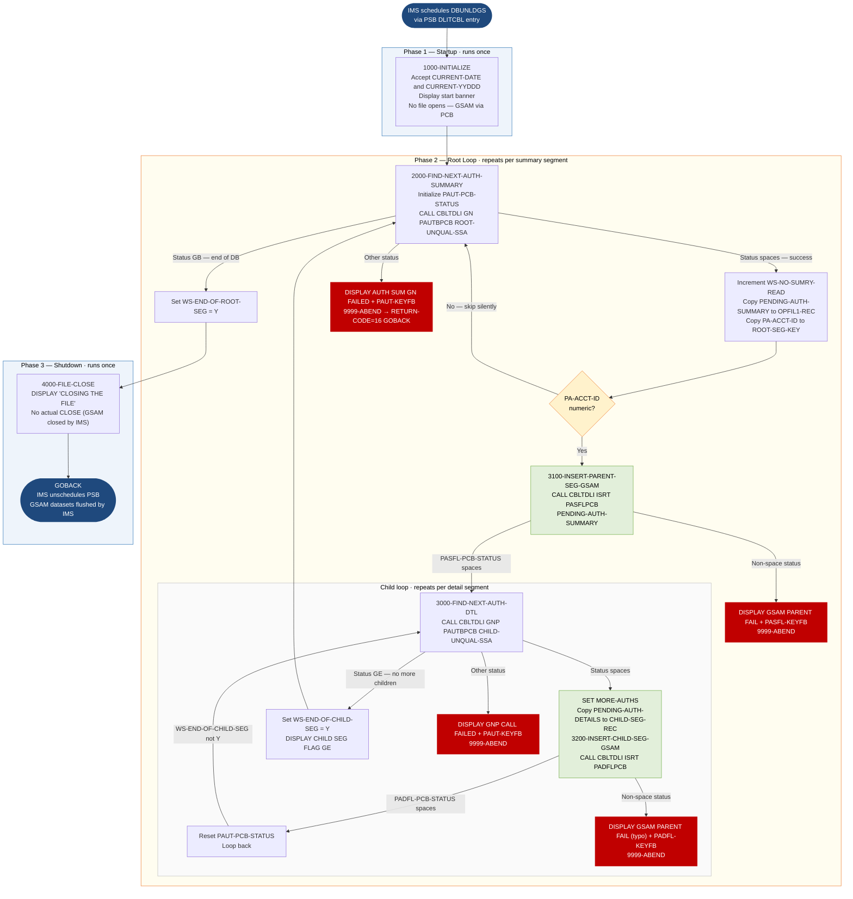

```
Application : AWS CardDemo
Source File : DBUNLDGS.cbl
Type        : Batch COBOL — IMS DL/I program
Source Banner: Copyright Amazon.com, Inc. or its affiliates.
```

# DBUNLDGS — IMS Pending Authorization Unload (GSAM Output)

This document describes what the program does in plain English so that a Java developer can understand every IMS call, data structure, and output path without reading COBOL source.

---

## 1. Purpose

DBUNLDGS is a **batch IMS DL/I program** that reads all pending authorization records from an IMS hierarchical database and writes them to two GSAM (Generalized Sequential Access Method) sequential output datasets. It is the **unload** half of a two-program IMS data movement pair: DBUNLDGS extracts from IMS to flat files; PAUDBLOD loads from flat files back into IMS.

For each **root segment** (pending authorization summary, one per account) it finds in the IMS database `PAUTSUM0`:
- Writes the root segment to the first GSAM dataset via PCB `PASFLPCB`.
- Reads all associated **child segments** (pending authorization details) under that root using the PCB `PAUTBPCB`.
- Writes each child segment to the second GSAM dataset via PCB `PADFLPCB`.

The program takes no parameters from SYSIN (`ACCEPT PRM-INFO FROM SYSIN` is commented out at line 1630).

**Key architectural note:** all file I/O is done via IMS GSAM calls (`CBLTDLI` with `FUNC-ISRT`), not via standard COBOL file WRITE statements. The `SELECT/FD` blocks for `OPFILE1` and `OPFILE2` are entirely commented out in the source (lines 100–360 in the DATA DIVISION). The working-storage fields `OPFIL1-REC` and `OPFIL2-REC` serve as staging buffers for GSAM inserts.

---

## 2. Program Flow

### 2.1 Startup — `1000-INITIALIZE` (line 1570)

**Step 1 — Accept system date** (line 1600): reads the current date into `CURRENT-DATE` (PIC 9(6), format `YYMMDD`) and the Julian day into `CURRENT-YYDDD` (PIC 9(5)).

**Step 2 — Display banner** (lines 1640–1670):
- `'STARTING PROGRAM DBUNLDGS::'`
- `'*-------------------------------------*'`
- `'TODAYS DATE            :'` followed by `CURRENT-DATE`
- A blank line

**Step 3 — No file opens.** The OPEN statements for `OPFILE1` and `OPFILE2` are commented out (lines 1700–1840). GSAM PCBs (`PASFLPCB`, `PADFLPCB`) are passed via the `PROCEDURE DIVISION USING` clause and are managed by the IMS PSB scheduler — no explicit open is required.

### 2.2 Per-Root Loop — `2000-FIND-NEXT-AUTH-SUMMARY` (line 1910)

The main loop runs `PERFORM 2000-FIND-NEXT-AUTH-SUMMARY THRU 2000-EXIT UNTIL WS-END-OF-ROOT-SEG = 'Y'` (lines 1470–1480).

Inside `2000-FIND-NEXT-AUTH-SUMMARY`:

**Step 4 — Initialize PCB status** (line 1960): clears `PAUT-PCB-STATUS` before each IMS call.

**Step 5 — Get next root segment (GN call)** (line 1970): calls `CBLTDLI` with function `FUNC-GN` (Get Next), PCB `PAUTBPCB`, target area `PENDING-AUTH-SUMMARY`, and unqualified SSA `ROOT-UNQUAL-SSA` (segment name `'PAUTSUM0'`). This retrieves the next available root segment in database key order.

Three outcomes from `PAUT-PCB-STATUS`:

- **Spaces (success)**: increments `WS-NO-SUMRY-READ` and `WS-AUTH-SMRY-PROC-CNT`. Copies `PENDING-AUTH-SUMMARY` into `OPFIL1-REC`. Initializes `ROOT-SEG-KEY` and `CHILD-SEG-REC` to zero/spaces. Copies `PA-ACCT-ID` (S9(11) COMP-3 — the account ID from the summary segment) into `ROOT-SEG-KEY`. **Only if `PA-ACCT-ID` is numeric**, calls `3100-INSERT-PARENT-SEG-GSAM` to write the root to GSAM, then runs the child loop.

- **`'GB'` (end-of-database)**: sets `WS-END-OF-ROOT-SEG = 'Y'`, exiting the outer loop.

- **Any other status**: displays `'AUTH SUM  GN FAILED  :'` followed by `PAUT-PCB-STATUS`, then `'KEY FEEDBACK AREA    :'` followed by `PAUT-KEYFB`, and calls `9999-ABEND`.

**Step 6 — Write root segment to GSAM — `3100-INSERT-PARENT-SEG-GSAM`** (line 2710200): calls `CBLTDLI` with `FUNC-ISRT`, PCB `PASFLPCB`, and `PENDING-AUTH-SUMMARY`. If `PASFL-PCB-STATUS` is not spaces (any error): displays `'GSAM PARENT FAIL :'` followed by `PASFL-PCB-STATUS`, then `'KFB AREA IN GSAM:'` followed by `PASFL-KEYFB`, and calls `9999-ABEND`.

**Step 7 — Child loop**: runs `PERFORM 3000-FIND-NEXT-AUTH-DTL THRU 3000-EXIT UNTIL WS-END-OF-CHILD-SEG = 'Y'` after initializing `WS-END-OF-CHILD-SEG` to spaces.

Inside `3000-FIND-NEXT-AUTH-DTL` (line 2370):

**Step 8 — Get next child segment (GNP call)** (line 2410): calls `CBLTDLI` with `FUNC-GNP` (Get Next within Parent), PCB `PAUTBPCB`, target area `PENDING-AUTH-DETAILS`, and unqualified SSA `CHILD-UNQUAL-SSA` (segment name `'PAUTDTL1'`).

- **Spaces (success)**: sets `MORE-AUTHS` true, increments `WS-NO-SUMRY-READ` and `WS-AUTH-SMRY-PROC-CNT`. Copies `PENDING-AUTH-DETAILS` into `CHILD-SEG-REC`. Calls `3200-INSERT-CHILD-SEG-GSAM`.
- **`'GE'` (no more children under this parent)**: sets `WS-END-OF-CHILD-SEG = 'Y'`; displays `'CHILD SEG FLAG GE : '` followed by `WS-END-OF-CHILD-SEG`.
- **Any other status**: displays `'GNP CALL FAILED  :'` and `'KFB AREA IN CHILD:'` with `PAUT-KEYFB`; calls `9999-ABEND`.
- After evaluation: **always** initializes `PAUT-PCB-STATUS` to spaces (line 2680).

**Step 9 — Write child segment to GSAM — `3200-INSERT-CHILD-SEG-GSAM`** (line 2721000): calls `CBLTDLI` with `FUNC-ISRT`, PCB `PADFLPCB`, and `PENDING-AUTH-DETAILS`. If `PADFL-PCB-STATUS` not spaces: displays `'GSAM PARENT FAIL :'` (note: says "PARENT" though this is the child PCB — typo), `'KFB AREA IN GSAM:'` with `PADFL-KEYFB`, and calls `9999-ABEND`.

### 2.3 Shutdown — `4000-FILE-CLOSE` (line 2730)

**Step 10 — Log close message** (line 2740): displays `'CLOSING THE FILE'`.

**Step 11 — No actual file close.** The `CLOSE OPFILE1` and `CLOSE OPFILE2` statements and their status checks are all commented out (lines 2750–2880). GSAM datasets are closed implicitly by IMS when the PSB is unscheduled.

**Step 12 — GOBACK** (line 1540): returns to the IMS controller.

---

## 3. Error Handling

### 3.1 Abend routine — `9999-ABEND` (line 2920)

Displays `'DBUNLDGS ABENDING ...'`, sets `RETURN-CODE` to `16`, and issues `GOBACK`. This does not call IBM LE's `CEE3ABD` — the program relies on IMS detecting the return code `16` and treating the step as failed. Any IMS-managed resource cleanup (PSB unschedule, rollback) occurs at the IMS level.

### 3.2 Root GN failure (line 2280)

Any PCB status other than spaces or `'GB'` from the root GN call: displays the status and key feedback area, then calls `9999-ABEND`.

### 3.3 Child GNP failure (line 2630)

Any PCB status other than spaces or `'GE'` from the child GNP call: displays the status and key feedback area, then calls `9999-ABEND`.

### 3.4 GSAM insert failure — root (line 2711401) and child (line 2722101)

Any non-space status from the GSAM ISRT call: displays the status and key feedback, then calls `9999-ABEND`.

---

## 4. Migration Notes

1. **All COBOL file I/O (SELECT, FD, OPEN, CLOSE, WRITE) is commented out.** The program uses IMS GSAM PCBs exclusively for output. The `OPFIL1-REC` and `OPFIL2-REC` structures in working storage serve purely as staging buffers passed to `CBLTDLI`. A Java migration must use the IMS Java API or the equivalent GSAM replacement.

2. **`WS-PGMNAME` is hardcoded to `'IMSUNLOD'` (line 380) but the program name is `DBUNLDGS`.** This is a copy-paste artifact from the `IMSUNLOD` template program. The field is used only for internal bookkeeping and does not affect execution, but it will confuse any diagnostic tool that reads `WS-PGMNAME` to identify the running program.

3. **`PA-ACCT-ID IS NUMERIC` guard (line 2160) silently skips root segments with non-numeric account IDs.** If a root segment has a non-numeric `PA-ACCT-ID` (e.g., spaces or corrupt data), it is read from IMS but neither written to GSAM nor counted. The counts `WS-NO-SUMRY-READ` and `WS-AUTH-SMRY-PROC-CNT` are incremented before the guard, so skipped records inflate the counters without producing output. This will cause `OPFIL1-REC` row count to diverge from `WS-NO-SUMRY-READ`.

4. **`PAUT-PCB-STATUS` is reset to spaces after every GNP call** (line 2680) regardless of result. This prevents the status from lingering into the next loop iteration, but it also means the status value is unavailable for any post-loop diagnostic.

5. **`3200-INSERT-CHILD-SEG-GSAM` error message says `'GSAM PARENT FAIL'` for a child GSAM write.** This is a copy-paste error from `3100-INSERT-PARENT-SEG-GSAM`. The message is misleading but harmless.

6. **Counter fields `WS-NO-SUMRY-DELETED`, `WS-NO-DTL-READ`, `WS-NO-DTL-DELETED`, `WS-TOT-REC-WRITTEN` are declared but never updated.** They are initialized to zero and stay at zero throughout. Any post-run report relying on these counters will be incorrect.

7. **`WS-EXPIRY-DAYS`, `WS-DAY-DIFF`, `IDX`, `WS-CURR-APP-ID`, `WS-AUTH-DATE`, `WS-NO-CHKP`, `WS-IMS-PSB-SCHD-FLG`, `IMS-RETURN-CODE`** and most fields in `WS-IMS-VARIABLES` are declared but never referenced. They are carry-over from the `IMSUNLOD` template.

8. **`PRM-INFO` (`P-EXPIRY-DAYS`, `P-CHKP-FREQ`, `P-CHKP-DIS-FREQ`, `P-DEBUG-FLAG`) is declared but never populated** (`ACCEPT PRM-INFO FROM SYSIN` is commented out). All control parameters are absent; the program always processes all records.

9. **`PASFLPCB` and `PADFLPCB` are GSAM PCBs.** Their `KEYFB` fields hold the IMS-assigned key feedback for GSAM segments (typically the byte offset of the inserted record). These PCBs are not shared with the database PCB `PAUTBPCB`.

10. **`ROOT-UNQUAL-SSA` is a 9-byte unqualified SSA** (segment name `'PAUTSUM0'` + space). No qualification means GN retrieves every root segment in ascending key order. There is no filter — the entire database is unloaded.

---

## Appendix A — Files

| Logical Name | DDname | Organization | Recording | Key Field | Direction | Contents |
|---|---|---|---|---|---|---|
| `PASFLPCB` (GSAM) | `OUTFIL1` (IMS GSAM DDname — inferred) | GSAM sequential | Variable | None (GSAM sequence) | Output — ISRT | Pending authorization summary (root) segments; one per account; layout from `CIPAUSMY` |
| `PADFLPCB` (GSAM) | `OUTFIL2` (IMS GSAM DDname — inferred) | GSAM sequential | Variable | None | Output — ISRT | Pending authorization detail (child) segments; one per transaction; layout from `CIPAUDTY` |
| `PAUTBPCB` (IMS DB) | IMS PSB database PCB | IMS hierarchical — GN/GNP | — | `PA-ACCT-ID` S9(11) COMP-3 (root) / `PA-AUTH-DATE-9C` + `PA-AUTH-TIME-9C` (child) | Input — GN, GNP | IMS pending authorization database with `PAUTSUM0` root and `PAUTDTL1` child segment types |

---

## Appendix B — Copybooks and External Programs

### Copybook `IMSFUNCS` — `FUNC-CODES` (WORKING-STORAGE, line 1160)

Defines IMS DL/I function code constants.

| Field | PIC | Bytes | Value | Notes |
|---|---|---|---|---|
| `FUNC-GU` | `X(04)` | 4 | `'GU  '` | Get Unique — not used by DBUNLDGS |
| `FUNC-GHU` | `X(04)` | 4 | `'GHU '` | Get Hold Unique — **not used** |
| `FUNC-GN` | `X(04)` | 4 | `'GN  '` | Get Next — used to read root segments |
| `FUNC-GHN` | `X(04)` | 4 | `'GHN '` | Get Hold Next — **not used** |
| `FUNC-GNP` | `X(04)` | 4 | `'GNP '` | Get Next within Parent — used to read child segments |
| `FUNC-GHNP` | `X(04)` | 4 | `'GHNP'` | Get Hold Next within Parent — **not used** |
| `FUNC-REPL` | `X(04)` | 4 | `'REPL'` | Replace — **not used** |
| `FUNC-ISRT` | `X(04)` | 4 | `'ISRT'` | Insert — used for both GSAM writes |
| `FUNC-DLET` | `X(04)` | 4 | `'DLET'` | Delete — **not used** |
| `PARMCOUNT` | `S9(05) COMP-5` | 2 | `+4` | IMS parameter count — standard value |

### Copybook `CIPAUSMY` — `PENDING-AUTH-SUMMARY` fields (WORKING-STORAGE, line 1230)

The root segment of the IMS pending authorization database. Copied into group `01 PENDING-AUTH-SUMMARY` (line 1220).

| Field | PIC | Bytes | Notes |
|---|---|---|---|
| `PA-ACCT-ID` | `S9(11) COMP-3` | 6 | Account ID — COMP-3, use BigDecimal; IMS root segment key |
| `PA-CUST-ID` | `9(09)` | 9 | Customer ID |
| `PA-AUTH-STATUS` | `X(01)` | 1 | Authorization status code |
| `PA-ACCOUNT-STATUS` | `X(02) OCCURS 5 TIMES` | 10 | Five status slots (5 × 2 bytes) |
| `PA-CREDIT-LIMIT` | `S9(09)V99 COMP-3` | 6 | Credit limit — COMP-3, use BigDecimal |
| `PA-CASH-LIMIT` | `S9(09)V99 COMP-3` | 6 | Cash advance limit — COMP-3 |
| `PA-CREDIT-BALANCE` | `S9(09)V99 COMP-3` | 6 | Current credit balance — COMP-3 |
| `PA-CASH-BALANCE` | `S9(09)V99 COMP-3` | 6 | Current cash balance — COMP-3 |
| `PA-APPROVED-AUTH-CNT` | `S9(04) COMP` | 2 | Count of approved authorizations — COMP binary |
| `PA-DECLINED-AUTH-CNT` | `S9(04) COMP` | 2 | Count of declined authorizations — COMP binary |
| `PA-APPROVED-AUTH-AMT` | `S9(09)V99 COMP-3` | 6 | Total approved amount — COMP-3 |
| `PA-DECLINED-AUTH-AMT` | `S9(09)V99 COMP-3` | 6 | Total declined amount — COMP-3 |
| `FILLER` | `X(34)` | 34 | Padding |

All COMP-3 fields must use `BigDecimal` in Java.

### Copybook `CIPAUDTY` — `PENDING-AUTH-DETAILS` fields (WORKING-STORAGE, line 1270)

The child segment. Copied into group `01 PENDING-AUTH-DETAILS` (line 1260).

| Field | PIC | Bytes | Notes |
|---|---|---|---|
| `PA-AUTH-DATE-9C` (in `PA-AUTHORIZATION-KEY`) | `S9(05) COMP-3` | 4 | Authorization date in COMP-3 packed form; part of IMS child key |
| `PA-AUTH-TIME-9C` (in `PA-AUTHORIZATION-KEY`) | `S9(09) COMP-3` | 6 | Authorization time in COMP-3 packed form; part of IMS child key |
| `PA-AUTH-ORIG-DATE` | `X(06)` | 6 | Original authorization date |
| `PA-AUTH-ORIG-TIME` | `X(06)` | 6 | Original authorization time |
| `PA-CARD-NUM` | `X(16)` | 16 | Card number |
| `PA-AUTH-TYPE` | `X(04)` | 4 | Authorization type code |
| `PA-CARD-EXPIRY-DATE` | `X(04)` | 4 | Card expiry date |
| `PA-MESSAGE-TYPE` | `X(06)` | 6 | ISO message type |
| `PA-MESSAGE-SOURCE` | `X(06)` | 6 | Message source code |
| `PA-AUTH-ID-CODE` | `X(06)` | 6 | Authorization ID |
| `PA-AUTH-RESP-CODE` | `X(02)` | 2 | Response code; 88 `PA-AUTH-APPROVED` = `'00'` |
| `PA-AUTH-RESP-REASON` | `X(04)` | 4 | Response reason |
| `PA-PROCESSING-CODE` | `9(06)` | 6 | Processing code |
| `PA-TRANSACTION-AMT` | `S9(10)V99 COMP-3` | 7 | Transaction amount — COMP-3, use BigDecimal |
| `PA-APPROVED-AMT` | `S9(10)V99 COMP-3` | 7 | Approved amount — COMP-3, use BigDecimal |
| `PA-MERCHANT-CATAGORY-CODE` | `X(04)` | 4 | MCC — note spelling "CATAGORY" (typo for CATEGORY) |
| `PA-ACQR-COUNTRY-CODE` | `X(03)` | 3 | Acquirer country code |
| `PA-POS-ENTRY-MODE` | `9(02)` | 2 | POS entry mode |
| `PA-MERCHANT-ID` | `X(15)` | 15 | Merchant identifier |
| `PA-MERCHANT-NAME` | `X(22)` | 22 | Merchant name |
| `PA-MERCHANT-CITY` | `X(13)` | 13 | Merchant city |
| `PA-MERCHANT-STATE` | `X(02)` | 2 | Merchant state |
| `PA-MERCHANT-ZIP` | `X(09)` | 9 | Merchant ZIP |
| `PA-TRANSACTION-ID` | `X(15)` | 15 | Transaction identifier |
| `PA-MATCH-STATUS` | `X(01)` | 1 | Match status: `'P'`=Pending (88 `PA-MATCH-PENDING`); `'D'`=Declined (88 `PA-MATCH-AUTH-DECLINED`); `'E'`=Expired (88 `PA-MATCH-PENDING-EXPIRED`); `'M'`=Matched (88 `PA-MATCHED-WITH-TRAN`) |
| `PA-AUTH-FRAUD` | `X(01)` | 1 | Fraud flag: `'F'`=Fraud confirmed (88 `PA-FRAUD-CONFIRMED`); `'R'`=Fraud removed (88 `PA-FRAUD-REMOVED`) |
| `PA-FRAUD-RPT-DATE` | `X(08)` | 8 | Fraud report date |
| `FILLER` | `X(17)` | 17 | Padding |

### Copybook `PAUTBPCB` — `PAUTBPCB` IMS PCB mask (LINKAGE SECTION, line 1340)

| Field | PIC | Bytes | Notes |
|---|---|---|---|
| `PAUT-DBDNAME` | `X(08)` | 8 | IMS database name |
| `PAUT-SEG-LEVEL` | `X(02)` | 2 | Segment level of last retrieved segment |
| `PAUT-PCB-STATUS` | `X(02)` | 2 | Status code from last DL/I call; spaces = success; `'GB'` = end-of-DB; `'GE'` = end-of-children |
| `PAUT-PCB-PROCOPT` | `X(04)` | 4 | Processing options |
| `FILLER` | `S9(05) COMP` | 2 | Reserved |
| `PAUT-SEG-NAME` | `X(08)` | 8 | Segment name of last retrieved segment |
| `PAUT-KEYFB-NAME` | `S9(05) COMP` | 2 | Key feedback length |
| `PAUT-NUM-SENSEGS` | `S9(05) COMP` | 2 | Number of sensitive segments |
| `PAUT-KEYFB` | `X(255)` | 255 | Key feedback area — logged on error |

### Copybook `PASFLPCB` — `PASFLPCB` GSAM output PCB for root segments (LINKAGE SECTION, line 1340)

| Field | PIC | Bytes | Notes |
|---|---|---|---|
| `PASFL-DBDNAME` | `X(08)` | 8 | GSAM dataset name |
| `PASFL-SEG-LEVEL` | `X(02)` | 2 | Always `'01'` for GSAM |
| `PASFL-PCB-STATUS` | `X(02)` | 2 | Spaces = success |
| `PASFL-PCB-PROCOPT` | `X(04)` | 4 | Processing options |
| `FILLER` | `S9(05) COMP` | 2 | Reserved |
| `PASFL-SEG-NAME` | `X(08)` | 8 | Segment name |
| `PASFL-KEYFB-NAME` | `S9(05) COMP` | 2 | Key feedback length |
| `PASFL-NUM-SENSEGS` | `S9(05) COMP` | 2 | Number of sensitive segments |
| `PASFL-KEYFB` | `X(100)` | 100 | Key feedback (offset of inserted record in GSAM) |

### Copybook `PADFLPCB` — `PADFLPCB` GSAM output PCB for child segments (LINKAGE SECTION, line 1342)

Same layout as `PASFLPCB` but with `PADFL-` prefix fields. `PADFL-KEYFB` is 255 bytes.

### External program `CBLTDLI`

| Item | Detail |
|---|---|
| Type | IBM IMS DL/I interface module; called for every IMS database and GSAM operation |
| GN call (root) | Line 1970: `FUNC-GN`, `PAUTBPCB`, `PENDING-AUTH-SUMMARY`, `ROOT-UNQUAL-SSA` |
| GNP call (child) | Line 2410: `FUNC-GNP`, `PAUTBPCB`, `PENDING-AUTH-DETAILS`, `CHILD-UNQUAL-SSA` |
| ISRT call (root GSAM) | Line 2710400: `FUNC-ISRT`, `PASFLPCB`, `PENDING-AUTH-SUMMARY` |
| ISRT call (child GSAM) | Line 2721200: `FUNC-ISRT`, `PADFLPCB`, `PENDING-AUTH-DETAILS` |
| Status field checked | `PAUT-PCB-STATUS` for DB reads; `PASFL-PCB-STATUS` / `PADFL-PCB-STATUS` for GSAM writes |

---

## Appendix C — Hardcoded Literals

| Paragraph | Line | Value | Usage | Classification |
|---|---|---|---|---|
| `1000-INITIALIZE` | 1640 | `'STARTING PROGRAM DBUNLDGS::'` | Job log banner | Display message |
| `1000-INITIALIZE` | 1650 | `'*-------------------------------------*'` | Job log separator | Display message |
| `1000-INITIALIZE` | 1660 | `'TODAYS DATE            :'` | Label for current date | Display message |
| `2000-FIND-NEXT-AUTH-SUMMARY` | 2280 | `'AUTH SUM  GN FAILED  :'` | Error prefix | Display message |
| `2000-FIND-NEXT-AUTH-SUMMARY` | 2290 | `'KEY FEEDBACK AREA    :'` | Error prefix | Display message |
| `3000-FIND-NEXT-AUTH-DTL` | 2600 | `'CHILD SEG FLAG GE : '` | End-of-children log | Display message |
| `3000-FIND-NEXT-AUTH-DTL` | 2640 | `'GNP CALL FAILED  :'` | Error prefix | Display message |
| `3000-FIND-NEXT-AUTH-DTL` | 2650 | `'KFB AREA IN CHILD:'` | Error prefix | Display message |
| `3100-INSERT-PARENT-SEG-GSAM` | 2711501 | `'GSAM PARENT FAIL :'` | GSAM root insert error | Display message |
| `3100-INSERT-PARENT-SEG-GSAM` | 2711601 | `'KFB AREA IN GSAM:'` | GSAM key feedback label | Display message |
| `3200-INSERT-CHILD-SEG-GSAM` | 2722201 | `'GSAM PARENT FAIL :'` | GSAM child insert error **(typo — says PARENT)** | Display message |
| `3200-INSERT-CHILD-SEG-GSAM` | 2722301 | `'KFB AREA IN GSAM:'` | GSAM key feedback label | Display message |
| `4000-FILE-CLOSE` | 2740 | `'CLOSING THE FILE'` | Shutdown message | Display message |
| `9999-ABEND` | 2950 | `'DBUNLDGS ABENDING ...'` | Abend notification | Display message |
| `9999-ABEND` | 2970 | `16` | RETURN-CODE on abend | System constant |
| `ROOT-UNQUAL-SSA` | 960 | `'PAUTSUM0'` | IMS root segment name | System constant |
| `CHILD-UNQUAL-SSA` | 1000 | `'PAUTDTL1'` | IMS child segment name | System constant |
| `WS-VARIABLES` | 380 | `'IMSUNLOD'` | WS-PGMNAME — **wrong; should be `'DBUNLDGS'`** | System constant — copy-paste error |
| `WK-CHKPT-ID` | 730 | `'RMAD'` | Checkpoint ID prefix — checkpoint calls are not implemented | Vestigial constant |

---

## Appendix D — Internal Working Fields

| Field | PIC | Bytes | Purpose |
|---|---|---|---|
| `CURRENT-DATE` | `9(06)` | 6 | Date from system DATE (YYMMDD format) |
| `CURRENT-YYDDD` | `9(05)` | 5 | Julian day from system DAY |
| `WS-NO-SUMRY-READ` | `S9(8) COMP` | 4 | Count of root segments retrieved by GN |
| `WS-AUTH-SMRY-PROC-CNT` | `9(8)` | 8 | Count of both root and child segments processed |
| `WS-END-OF-ROOT-SEG` | `X(01)` | 1 | `'Y'` when GB returned on root GN; controls outer loop |
| `WS-END-OF-CHILD-SEG` | `X(01)` | 1 | `'Y'` when GE returned on child GNP; controls inner loop |
| `OPFIL1-REC` | `X(100)` | 100 | Staging buffer for root segments passed to GSAM |
| `OPFIL2-REC` (group) | 211 bytes | 211 | Staging buffer for child segments: `ROOT-SEG-KEY` S9(11) COMP-3 (6) + `CHILD-SEG-REC` X(200) (200) |
| `WS-NO-SUMRY-DELETED` | `S9(8) COMP` | 4 | **Never updated — always zero** |
| `WS-NO-DTL-READ` | `S9(8) COMP` | 4 | **Never updated — always zero** |
| `WS-NO-DTL-DELETED` | `S9(8) COMP` | 4 | **Never updated — always zero** |
| `WS-TOT-REC-WRITTEN` | `S9(8) COMP` | 4 | **Never updated — always zero** |
| `WS-ERR-FLG` | `X(01)` | 1 | Error flag; `'N'` default; **never set to `'Y'` in DBUNLDGS** |
| `WK-CHKPT-ID` | 8 bytes | 8 | Checkpoint ID prefix `'RMAD'` + counter `WK-CHKPT-ID-CTR` — checkpoint logic not implemented |

---

## Appendix E — Execution at a Glance



---

*Source: `DBUNLDGS.cbl`, CardDemo, Apache 2.0 license. Copybooks: `IMSFUNCS.cpy`, `CIPAUSMY.cpy`, `CIPAUDTY.cpy`, `PAUTBPCB.cpy`, `PASFLPCB.cpy`, `PADFLPCB.cpy`. External program: `CBLTDLI` (IBM IMS DL/I interface). External service: IBM Language Environment (implicit via IMS).*
