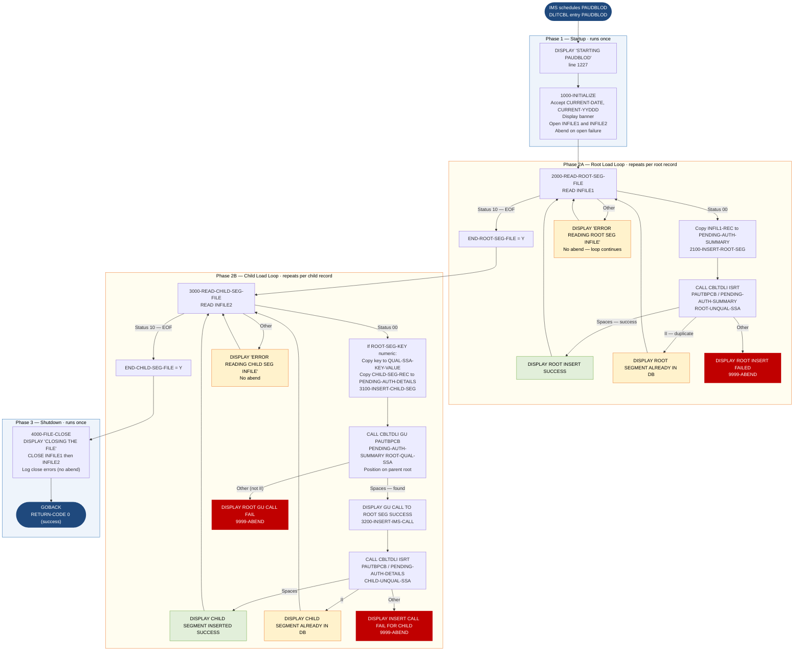

```
Application : AWS CardDemo
Source File : PAUDBLOD.CBL
Type        : Batch COBOL — IMS DL/I program
Source Banner: Copyright Amazon.com, Inc. or its affiliates.
```

# PAUDBLOD — IMS Pending Authorization Load from Flat Files

This document describes what the program does in plain English so that a Java developer can understand every IMS call, file read, and insert path without reading COBOL source.

---

## 1. Purpose

PAUDBLOD is a **batch IMS DL/I program** that reads pending authorization records from two sequential flat files and inserts them into an IMS hierarchical database. It is the **load** half of the data movement pair whose unload counterpart is PAUDBUNL.

The program:
- Reads root (summary) segment records from `INFILE1` (DDname `INFILE1`, 100-byte fixed records).
- For each root record, performs a CICS ISRT to the IMS database PCB `PAUTBPCB`.
- Separately reads child (detail) segment records from `INFILE2` (DDname `INFILE2`, records of `ROOT-SEG-KEY` S9(11) COMP-3 + `CHILD-SEG-REC` X(200) = 206 bytes).
- For each child record that has a numeric `ROOT-SEG-KEY`, performs a Get Unique (GU) to position in the IMS database on the parent root, then inserts the child segment via ISRT.

The two file loops run **sequentially, not interleaved**: all root records are processed first (loop 1, paragraph `2000-READ-ROOT-SEG-FILE`), then all child records are processed (loop 2, paragraph `3000-READ-CHILD-SEG-FILE`). This means the IMS database must already contain the target root segments before the child loop runs — root inserts from loop 1 serve as parents for the child inserts in loop 2.

---

## 2. Program Flow

### 2.1 Startup — `1000-INITIALIZE` (line 1690)

**Step 1 — Accept system date** (lines 1720–1730): `CURRENT-DATE` (YYMMDD) and `CURRENT-YYDDD` (Julian day).

**Step 2 — Display banner** (lines 1770–1800):
- `'*-------------------------------------*'`
- `'TODAYS DATE            :'` followed by `CURRENT-DATE`
- A blank line

Note: Unlike PAUDBUNL, PAUDBLOD does NOT display `'STARTING PAUDBLOD'` at the top of `MAIN-PARA`. The `DISPLAY 'STARTING PAUDBLOD'` is at line 1227, inside `MAIN-PARA` before the `1000-INITIALIZE` call.

**Step 3 — Open input files** (lines 1961–1969634): opens `INFILE1` for input, checks `WS-INFIL1-STATUS`; if not spaces or `'00'`, displays `'ERROR IN OPENING INFILE1:'` followed by the status and calls `9999-ABEND`. Then opens `INFILE2` similarly.

### 2.2 Root Load Loop — `2000-READ-ROOT-SEG-FILE` (line 2020)

Runs `PERFORM 2000-READ-ROOT-SEG-FILE THRU 2000-EXIT UNTIL END-ROOT-SEG-FILE = 'Y'`.

**Step 4 — Read next root record** (line 2042053): reads `INFILE1`. If status spaces or `'00'`: copies `INFIL1-REC` into `PENDING-AUTH-SUMMARY` and calls `2100-INSERT-ROOT-SEG`. If status `'10'` (EOF): sets `END-ROOT-SEG-FILE = 'Y'`. If other status: displays `'ERROR READING ROOT SEG INFILE'` (no abend — **this is a silent failure: the loop continues on a read error without aborting**).

**Step 5 — Insert root segment — `2100-INSERT-ROOT-SEG`** (line 2043653): calls `CBLTDLI` with `FUNC-ISRT`, `PAUTBPCB`, `PENDING-AUTH-SUMMARY`, and `ROOT-UNQUAL-SSA`. Displays `'*******************************'` before and after the call. Then evaluates `PAUT-PCB-STATUS`:

- **Spaces (success)**: displays `'ROOT INSERT SUCCESS    '`.
- **`'II'` (duplicate segment)**: displays `'ROOT SEGMENT ALREADY IN DB'`.
- **Any other status**: displays `'ROOT INSERT FAILED  :'` followed by the status; calls `9999-ABEND`.

### 2.3 Child Load Loop — `3000-READ-CHILD-SEG-FILE` (line 2340)

Runs `PERFORM 3000-READ-CHILD-SEG-FILE THRU 3000-EXIT UNTIL END-CHILD-SEG-FILE = 'Y'` after the root loop completes.

**Step 6 — Read next child record** (line 2352053): reads `INFILE2`. If status spaces or `'00'`: if `ROOT-SEG-KEY` (from the FD record `INFIL2-REC`) is numeric, copies it to `QUAL-SSA-KEY-VALUE` in the qualified SSA and copies `CHILD-SEG-REC` to `PENDING-AUTH-DETAILS`, then calls `3100-INSERT-CHILD-SEG`. If status `'10'` (EOF): sets `END-CHILD-SEG-FILE = 'Y'`. If other status: displays `'ERROR READING CHILD SEG INFILE'` (no abend).

**Step 7 — Position and insert child — `3100-INSERT-CHILD-SEG`** (line 2359753):
1. Initializes `PAUT-PCB-STATUS`.
2. Issues a GU (Get Unique) call to `PAUTBPCB` with `PENDING-AUTH-SUMMARY` and qualified SSA `ROOT-QUAL-SSA` (segment name `'PAUTSUM0'`, key field `'ACCNTID '`, operator `'EQ'`, value `QUAL-SSA-KEY-VALUE`). Displays `'***************************'` before and after.
3. If `PAUT-PCB-STATUS = SPACES` (root found): displays `'GU CALL TO ROOT SEG SUCCESS'`; calls `3200-INSERT-IMS-CALL`.
4. If `PAUT-PCB-STATUS NOT EQUAL TO SPACES AND 'II'`: displays `'ROOT GU CALL FAIL:'` and `'KFB AREA IN CHILD:'` with `PAUT-KEYFB`; calls `9999-ABEND`.

**Note a structural defect (Migration Note 1):** the `IF PAUT-PCB-STATUS = SPACES` and the `IF PAUT-PCB-STATUS NOT EQUAL TO SPACES AND 'II'` blocks are not in an `ELSE` relationship — they are two separate IF statements without an `END-IF` between them. If the status is spaces, both conditions are evaluated. The second condition (`NOT EQUAL TO SPACES AND 'II'`) is false when status is spaces, so the abend is not triggered, but this is an implicit rather than explicit logic flow.

**Step 8 — Insert child — `3200-INSERT-IMS-CALL`** (line 2611053): calls `CBLTDLI` with `FUNC-ISRT`, `PAUTBPCB`, `PENDING-AUTH-DETAILS`, `CHILD-UNQUAL-SSA`. Evaluates `PAUT-PCB-STATUS`:
- **Spaces**: `'CHILD SEGMENT INSERTED SUCCESS'`.
- **`'II'`**: `'CHILD SEGMENT ALREADY IN DB'`.
- **Other**: `'INSERT CALL FAIL FOR CHILD:'` + status, `'KFB AREA IN CHILD:'` + `PAUT-KEYFB`; `9999-ABEND`.

### 2.4 Shutdown — `4000-FILE-CLOSE` (line 2630)

Displays `'CLOSING THE FILE'`. Closes `INFILE1`; checks status (spaces or `'00'` continue; else displays `'ERROR IN CLOSING 1ST FILE:'`). Closes `INFILE2` similarly. Then `GOBACK`.

---

## 3. Error Handling

### 3.1 File open failure — `1000-INITIALIZE` (lines 1962–1969634)

Displays `'ERROR IN OPENING INFILE1:'` or `'ERROR IN OPENING INFILE2:'` followed by the file status; calls `9999-ABEND`.

### 3.2 File read error — `2000-READ-ROOT-SEG-FILE` (line 2042853) and `3000-READ-CHILD-SEG-FILE` (line 2359153)

Displays `'ERROR READING ROOT SEG INFILE'` or `'ERROR READING CHILD SEG INFILE'` — **but does not call `9999-ABEND`**. The loop continues to the next READ. This is a silent-continuation defect: corrupted input or device errors will produce missing records in the IMS database with no abend.

### 3.3 IMS ISRT failure — `2100-INSERT-ROOT-SEG` and `3200-INSERT-IMS-CALL`

Any PCB status other than spaces or `'II'` triggers abend with displayed status codes.

### 3.4 IMS GU failure — `3100-INSERT-CHILD-SEG`

Status other than spaces or `'II'` triggers abend. If the parent root is not found (`'GE'` status from GU), it would be caught by the `NOT EQUAL TO SPACES AND 'II'` condition and cause an abend.

### 3.5 Abend — `9999-ABEND` (line 3630)

Displays `'IMS LOAD ABENDING ...'`, sets `RETURN-CODE = 16`, issues `GOBACK`.

---

## 4. Migration Notes

1. **Structural bug in `3100-INSERT-CHILD-SEG` (lines 2420–2550051): missing `END-IF` between GU success path and error check.** The two `IF` blocks evaluating `PAUT-PCB-STATUS` are consecutive without `ELSE`. If GU returns `'GE'` (parent not found), the first `IF PAUT-PCB-STATUS = SPACES` is false (no action), then the second `IF PAUT-PCB-STATUS NOT EQUAL TO SPACES AND 'II'` is true — triggering abend. If GU returns `'II'`, neither condition fires (no insert, no abend, silent skip). If GU returns spaces, both conditions evaluate but only the first triggers the insert; the abend check correctly skips. The Java replacement must use explicit if-else-if logic.

2. **Read errors on both input files are silent — no abend** (lines 2042853 and 2359153). Any non-00, non-10 file status causes a DISPLAY but the loop continues. Records that fail to read are skipped silently, creating gaps in the IMS database with no diagnostic.

3. **Root and child loads run in two separate sequential loops, not interleaved.** All roots are loaded first, then all children. If the root file contains N records but fewer than N root segments are actually inserted (e.g., duplicates silently skipped), the child load may issue GU calls for parents that were never inserted, producing abends.

4. **Duplicate root and child records are silently accepted** (PCB status `'II'`) with only a DISPLAY message — no error flag, no abend, no count. The existing record in the IMS database is not updated. A Java replacement using `findOrCreate` semantics must handle this case explicitly.

5. **`WS-PGMNAME` is initialized to `'IMSUNLOD'`** (line 280, same as PAUDBUNL and DBUNLDGS) — a copy-paste artifact. The actual program name is `PAUDBLOD`.

6. **`IO-PCB-MASK` (line 1131057) is declared in the LINKAGE SECTION but only used in the PROCEDURE DIVISION USING clause at line 1180057.** It occupies one byte (`PIC X(1)`) and is referenced only as a positional parameter — a placeholder for the IMS I/O PCB that is not otherwise used.

7. **All counter and flag fields carry over from the `IMSUNLOD` template without being used:** `WS-NO-SUMRY-DELETED`, `WS-NO-DTL-READ`, `WS-NO-DTL-DELETED`, `WS-TOT-REC-WRITTEN`, `WS-ERR-FLG`, `WS-END-OF-AUTHDB-FLAG`, `WS-MORE-AUTHS-FLAG`, `WS-IMS-PSB-SCHD-FLG`, `IMS-RETURN-CODE` — all declared, never set to meaningful values.

8. **`ROOT-QUAL-SSA` key field name is `'ACCNTID '`** (line 831354) — 8 bytes padded with a space. This must match the IMS DBD field name exactly. Migration must verify the actual IMS database field name, as a mismatch causes GU to fail.

9. **Close errors are logged but do not abend** (lines 2690–2770034). A file close error displaying `'ERROR IN CLOSING 1ST FILE:'` or `'ERROR IN CLOSING 2ND FILE:'` is non-fatal. Any buffered data not flushed will be lost silently.

---

## Appendix A — Files

| Logical Name | DDname | Organization | Recording | Key Field | Direction | Contents |
|---|---|---|---|---|---|---|
| `INFILE1` | `INFILE1` | Sequential, fixed | Fixed, 100 bytes | None | Input | Root segment flat file; one 100-byte record per pending authorization summary; produced by PAUDBUNL `OPFILE1` |
| `INFILE2` | `INFILE2` | Sequential, fixed | Fixed, 206 bytes (6-byte COMP-3 key + 200-byte child data) | None | Input | Child segment flat file; layout `INFIL2-REC`: `ROOT-SEG-KEY` S9(11) COMP-3 + `CHILD-SEG-REC` X(200); produced by PAUDBUNL `OPFILE2` |
| `PAUTBPCB` (IMS DB) | IMS PSB PCB | IMS hierarchical | — | `ACCNTID` (root) | I-O — GU then ISRT | IMS pending authorization database |

---

## Appendix B — Copybooks and External Programs

### Copybook `IMSFUNCS` — `FUNC-CODES`

Same as documented in DBUNLDGS. Functions used by PAUDBLOD: `FUNC-GU` (step 7 GU call), `FUNC-ISRT` (steps 5 and 8 ISRT calls). Functions defined but **not used**: `FUNC-GHU`, `FUNC-GN`, `FUNC-GHN`, `FUNC-GNP`, `FUNC-GHNP`, `FUNC-REPL`, `FUNC-DLET`.

### Copybook `CIPAUSMY` — `PENDING-AUTH-SUMMARY` fields

Same as documented in DBUNLDGS. All COMP-3 fields require BigDecimal in Java. The key field `PA-ACCT-ID` (S9(11) COMP-3) is the IMS root segment key.

### Copybook `CIPAUDTY` — `PENDING-AUTH-DETAILS` fields

Same as documented in DBUNLDGS. `PA-MERCHANT-CATAGORY-CODE` — note spelling "CATAGORY" (typo for CATEGORY, preserved from copybook).

### Copybook `PAUTBPCB` — IMS PCB mask

Same layout as documented in DBUNLDGS. `PAUT-PCB-STATUS` is checked after every DL/I call.

### External program `CBLTDLI`

| Item | Detail |
|---|---|
| ISRT call (root) | Paragraph `2100-INSERT-ROOT-SEG`, line 2070053: `FUNC-ISRT`, `PAUTBPCB`, `PENDING-AUTH-SUMMARY`, `ROOT-UNQUAL-SSA` |
| GU call (position on root for child) | Paragraph `3100-INSERT-CHILD-SEG`, line 2370053: `FUNC-GU`, `PAUTBPCB`, `PENDING-AUTH-SUMMARY`, `ROOT-QUAL-SSA` |
| ISRT call (child) | Paragraph `3200-INSERT-IMS-CALL`, line 2611353: `FUNC-ISRT`, `PAUTBPCB`, `PENDING-AUTH-DETAILS`, `CHILD-UNQUAL-SSA` |
| Status field | `PAUT-PCB-STATUS` (from `PAUTBPCB`) |

---

## Appendix C — Hardcoded Literals

| Paragraph | Line | Value | Usage | Classification |
|---|---|---|---|---|
| `MAIN-PARA` | 1227053 | `'STARTING PAUDBLOD'` | Program start banner | Display message |
| `1000-INITIALIZE` | 1770026 | `'*-------------------------------------*'` | Separator | Display message |
| `1000-INITIALIZE` | 1790043 | `'TODAYS DATE            :'` | Date label | Display message |
| `1000-INITIALIZE` | 1965053 | `'ERROR IN OPENING INFILE1:'` | Open error label | Display message |
| `1000-INITIALIZE` | 1969453 | `'ERROR IN OPENING INFILE2:'` | Open error label | Display message |
| `2000-READ-ROOT-SEG-FILE` | 2042953 | `'ERROR READING ROOT SEG INFILE'` | Read error — **no abend** | Display message |
| `2100-INSERT-ROOT-SEG` | 2160053 | `'ROOT INSERT SUCCESS    '` | ISRT success | Display message |
| `2100-INSERT-ROOT-SEG` | 2194153 | `'ROOT SEGMENT ALREADY IN DB'` | Duplicate segment | Display message |
| `2100-INSERT-ROOT-SEG` | 2230053 | `'ROOT INSERT FAILED  :'` | ISRT failure | Display message |
| `3000-READ-CHILD-SEG-FILE` | 2359253 | `'ERROR READING CHILD SEG INFILE'` | Read error — **no abend** | Display message |
| `3100-INSERT-CHILD-SEG` | 2430053 | `'GU CALL TO ROOT SEG SUCCESS'` | GU success | Display message |
| `3100-INSERT-CHILD-SEG` | 2530053 | `'ROOT GU CALL FAIL:'` | GU failure | Display message |
| `3100-INSERT-CHILD-SEG` | 2531048 | `'KFB AREA IN CHILD:'` | Key feedback label | Display message |
| `3200-INSERT-IMS-CALL` | 2611966 | `'CHILD SEGMENT INSERTED SUCCESS'` | ISRT success | Display message |
| `3200-INSERT-IMS-CALL` | 2612266 | `'CHILD SEGMENT ALREADY IN DB'` | Duplicate child | Display message |
| `3200-INSERT-IMS-CALL` | 2612566 | `'INSERT CALL FAIL FOR CHILD:'` | ISRT failure | Display message |
| `3200-INSERT-IMS-CALL` | 2612666 | `'KFB AREA IN CHILD:'` | Key feedback label | Display message |
| `4000-FILE-CLOSE` | 2631043 | `'CLOSING THE FILE'` | Shutdown message | Display message |
| `4000-FILE-CLOSE` | 2690053 | `'ERROR IN CLOSING 1ST FILE:'` | Close error label | Display message |
| `4000-FILE-CLOSE` | 2760053 | `'ERROR IN CLOSING 2ND FILE:'` | Close error label | Display message |
| `9999-ABEND` | 3660054 | `'IMS LOAD ABENDING ...'` | Abend notification | Display message |
| `9999-ABEND` | 3680026 | `16` | RETURN-CODE on abend | System constant |
| `ROOT-QUAL-SSA` | 831153 | `'PAUTSUM0'` | IMS root segment name | System constant |
| `ROOT-QUAL-SSA` | 831354 | `'ACCNTID '` | IMS key field name in DBD | System constant |
| `ROOT-QUAL-SSA` | 831454 | `'EQ'` | Relational operator | System constant |
| `ROOT-UNQUAL-SSA` | 831953 | `'PAUTSUM0'` | Root unqualified SSA | System constant |
| `CHILD-UNQUAL-SSA` | 832353 | `'PAUTDTL1'` | Child unqualified SSA | System constant |
| `WS-VARIABLES` | 280026 | `'IMSUNLOD'` | WS-PGMNAME — **wrong; should be `'PAUDBLOD'`** | Copy-paste error |

---

## Appendix D — Internal Working Fields

| Field | PIC | Bytes | Purpose |
|---|---|---|---|
| `CURRENT-DATE` | `9(06)` | 6 | YYMMDD from system DATE |
| `CURRENT-YYDDD` | `9(05)` | 5 | Julian day from system DAY |
| `WS-NO-SUMRY-READ` | `S9(8) COMP` | 4 | Count of root records read from INFILE1 |
| `WS-AUTH-SMRY-PROC-CNT` | `9(8)` | 8 | Count of root + child records attempted (both incremented in child reads) |
| `END-ROOT-SEG-FILE` | `X(01)` | 1 | `'Y'` when INFILE1 reaches EOF; controls root loop |
| `END-CHILD-SEG-FILE` | `X(01)` | 1 | `'Y'` when INFILE2 reaches EOF; controls child loop |
| `IO-PCB-MASK` | `X(1)` | 1 | Positional LINKAGE placeholder for IMS I/O PCB; not otherwise used |
| `ROOT-QUAL-SSA` (group) | 21 bytes | 21 | Qualified SSA for GU: `PAUTSUM0` (8) + `(` (1) + `ACCNTID ` (8) + `EQ` (2) + `QUAL-SSA-KEY-VALUE` S9(11) COMP-3 (6 bytes) + `)` (1) = 26 bytes structural but 21 as declared |
| `WS-NO-SUMRY-DELETED`, `WS-NO-DTL-READ`, `WS-NO-DTL-DELETED`, `WS-TOT-REC-WRITTEN` | `S9(8) COMP` | 4 each | **Never updated — always zero** |
| `WS-ERR-FLG` | `X(01)` | 1 | Declared; **never set in this program** |
| `WK-CHKPT-ID` | 8 bytes | 8 | Checkpoint ID prefix; **checkpoint logic not implemented** |

---

## Appendix E — Execution at a Glance



---

*Source: `PAUDBLOD.CBL`, CardDemo, Apache 2.0 license. Copybooks: `IMSFUNCS.cpy`, `CIPAUSMY.cpy`, `CIPAUDTY.cpy`, `PAUTBPCB.cpy`. External program: `CBLTDLI` (IBM IMS DL/I interface).*
