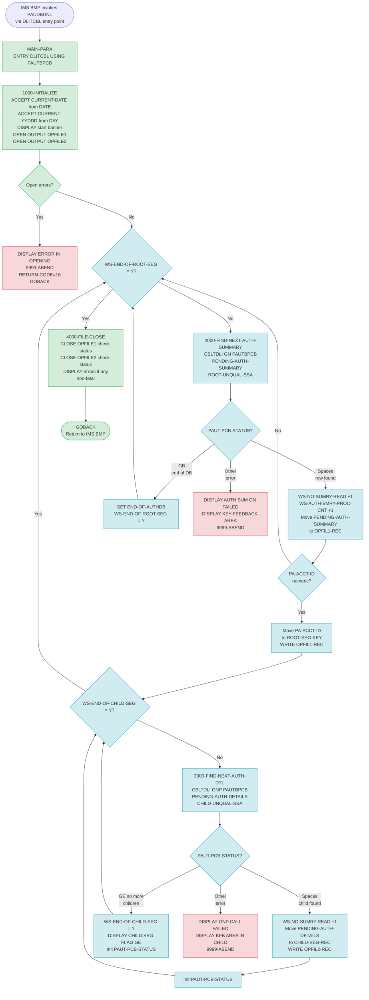

Application : AWS CardDemo
Source File : PAUDBUNL.CBL
Type        : Batch COBOL
Source Banner: * Copyright Amazon.com, Inc. or its affiliates.

---

# BIZ-PAUDBUNL — Pending Authorization IMS Unload to Sequential Files

## Section 1 — Purpose

PAUDBUNL is a batch IMS program that unloads the pending authorization database to two sequential output files. It reads every root segment (pending authorization summary, one per account) and every child segment (pending authorization detail, one per individual authorization event) from the IMS hierarchical database. For each root segment whose account ID is numeric, it writes the raw 100-byte root data to the first output file (`OUTFIL1`). For every child segment under that root, it writes a composed record containing the account ID key plus the 200-byte child segment data to the second output file (`OUTFIL2`).

The program is a pure extract: it reads and writes, but does not modify (delete, update, or insert) any IMS segment.

**Files written:**

| Logical Name | DDname | Contents |
|---|---|---|
| `OPFILE1` | `OUTFIL1` | One 100-byte record per root segment (raw `PENDING-AUTH-SUMMARY` data) |
| `OPFILE2` | `OUTFIL2` | One 209-byte record per child segment: 6-byte `ROOT-SEG-KEY` (COMP-3) + 200-byte filler followed by child segment data |

**IMS database accessed (read-only):**

| DBD Name | Segment Name | SSA | Access |
|---|---|---|---|
| `PAUTSUM0` (root segment) | `PAUTSUM0` | Unqualified: `'PAUTSUM0 '` (8+1 bytes) | GN (get next) |
| `PAUTDTL1` (child segment) | `PAUTDTL1` | Unqualified: `'PAUTDTL1 '` (8+1 bytes) | GNP (get next within parent) |

No VSAM files, DB2 tables, or other external programs are called.

**Program name discrepancy**: `PROGRAM-ID = PAUDBUNL` but `WS-PGMNAME = 'IMSUNLOD'` and the `9999-ABEND` paragraph DISPLAYs `'IMSUNLOD ABENDING ...'`. The working-storage name appears to be a template artifact from a generic IMS unload program. The job step and JCL should reference `PAUDBUNL`, not `IMSUNLOD`. See Migration Notes.

---

## Section 2 — Program Flow

### 2.1 Startup

1. **`MAIN-PARA`** (line 157): PROCEDURE DIVISION entry. PROCEDURE DIVISION is coded with `USING PAUTBPCB`, and an `ENTRY 'DLITCBL' USING PAUTBPCB` statement (line 158) is also present. The IMS batch environment invokes the program via the `DLITCBL` entry point, passing the PCB mask as the single USING parameter.
2. **`1000-INITIALIZE`** (line 173):
   - Accepts `CURRENT-DATE` from system (6-digit YYMMDD).
   - Accepts `CURRENT-YYDDD` from system (5-digit Julian day YYDDD).
   - The statement `ACCEPT PRM-INFO FROM SYSIN` (which would read `P-EXPIRY-DAYS`, `P-CHKP-FREQ`, `P-CHKP-DIS-FREQ`, and `P-DEBUG-FLAG` from the JCL SYSIN stream) is commented out (line 179). The `PRM-INFO` structure and all its subfields are therefore never populated.
   - DISPLAYs `'STARTING PROGRAM PAUDBUNL::'`, a separator line, `'TODAYS DATE            :'` followed by `CURRENT-DATE`.
   - Opens `OPFILE1` (DDname `OUTFIL1`) for OUTPUT. File status `WS-OUTFL1-STATUS` is checked: if not spaces or `'00'`, DISPLAYs `'ERROR IN OPENING OPFILE1:'` + status bytes and calls `9999-ABEND`.
   - Opens `OPFILE2` (DDname `OUTFIL2`) for OUTPUT. File status `WS-OUTFL2-STATUS` is checked the same way.

### 2.2 Per-Record Loop

3. **Root segment loop** (line 163): calls **`2000-FIND-NEXT-AUTH-SUMMARY`** repeatedly until `WS-END-OF-ROOT-SEG = 'Y'`.
4. **`2000-FIND-NEXT-AUTH-SUMMARY`** (line 207):
   - Initialises `PAUT-PCB-STATUS` to spaces.
   - Issues `CALL 'CBLTDLI' USING FUNC-GN, PAUTBPCB, PENDING-AUTH-SUMMARY, ROOT-UNQUAL-SSA`. This is a Get-Next call with an unqualified SSA for segment type `PAUTSUM0`, advancing sequentially through all root segments in the database.
   - If `PAUT-PCB-STATUS = SPACES` (successful read):
     - Increments `WS-NO-SUMRY-READ` and `WS-AUTH-SMRY-PROC-CNT`.
     - Moves `PENDING-AUTH-SUMMARY` to `OPFIL1-REC` (100 bytes).
     - Initialises `ROOT-SEG-KEY` and `CHILD-SEG-REC` within `OPFIL2-REC`.
     - Moves `PA-ACCT-ID` (from the just-read summary segment) to `ROOT-SEG-KEY` (PIC S9(11) COMP-3, 6 bytes).
     - Tests `PA-ACCT-ID IS NUMERIC`:
       - If numeric: writes `OPFIL1-REC` to `OPFILE1`, then initialises `WS-END-OF-CHILD-SEG` and calls the child-segment loop (`3000-FIND-NEXT-AUTH-DTL`) until `WS-END-OF-CHILD-SEG = 'Y'`.
       - If not numeric: skips both the write to `OPFILE1` and all child reads. No error message or counter is incremented.
   - If `PAUT-PCB-STATUS = 'GB'` (end of database): sets `END-OF-AUTHDB` TRUE (which sets `WS-END-OF-AUTHDB-FLAG = 'Y'`) and moves `'Y'` to `WS-END-OF-ROOT-SEG`. This terminates the outer loop.
   - If `PAUT-PCB-STATUS` is any other value: DISPLAYs `'AUTH SUM  GN FAILED  :'` + status, DISPLAYs `'KEY FEEDBACK AREA    :'` + `PAUT-KEYFB`, calls `9999-ABEND`.

5. **`3000-FIND-NEXT-AUTH-DTL`** (line 253): called in a loop per root segment, until `WS-END-OF-CHILD-SEG = 'Y'`.
   - Issues `CALL 'CBLTDLI' USING FUNC-GNP, PAUTBPCB, PENDING-AUTH-DETAILS, CHILD-UNQUAL-SSA`. This is a Get-Next-within-Parent call for segment type `PAUTDTL1`, reading all children of the current root in sequence.
   - If `PAUT-PCB-STATUS = SPACES` (successful read):
     - Sets `MORE-AUTHS` TRUE.
     - Increments `WS-NO-SUMRY-READ` and `WS-AUTH-SMRY-PROC-CNT` (note: these are summary counters, not child counters — see Migration Notes).
     - Moves `PENDING-AUTH-DETAILS` to `CHILD-SEG-REC` (200 bytes).
     - Writes `OPFIL2-REC` to `OPFILE2`. The record as written is `ROOT-SEG-KEY` (6 bytes COMP-3) followed by `CHILD-SEG-REC` (200 bytes) — total 206 bytes from the FD definition.
   - If `PAUT-PCB-STATUS = 'GE'` (no more child segments under this parent):
     - Moves `'Y'` to `WS-END-OF-CHILD-SEG`, terminating the child loop.
     - DISPLAYs `'CHILD SEG FLAG GE : '` + `WS-END-OF-CHILD-SEG`. This DISPLAY is executed for every root segment regardless of whether it had any children — it fires even for root segments with zero children.
   - If `PAUT-PCB-STATUS` is any other value: DISPLAYs `'GNP CALL FAILED  :'` + status, DISPLAYs `'KFB AREA IN CHILD:'` + `PAUT-KEYFB`, calls `9999-ABEND`.
   - Unconditionally initialises `PAUT-PCB-STATUS` to spaces at the end of the paragraph (line 284). This clears the status code after every child read regardless of outcome.

### 2.3 Shutdown

6. **`4000-FILE-CLOSE`** (line 289): DISPLAYs `'CLOSING THE FILE'`. Closes `OPFILE1` and checks `WS-OUTFL1-STATUS`: if not spaces or `'00'`, DISPLAYs `'ERROR IN CLOSING 1ST FILE:'` + status. Does NOT call `9999-ABEND` on close error — the program continues. Closes `OPFILE2` with the same non-fatal close-error handling.
7. `GOBACK` (line 170): returns control to IMS BMP batch scheduler.

---

## Section 3 — Error Handling

### 3.1 Open Failure — `1000-INITIALIZE` (line 186)
`OPFILE1` and `OPFILE2` are each opened with a file-status check. Status must be spaces or `'00'`. Any other value triggers DISPLAY of `'ERROR IN OPENING OPFILE1:'` / `'ERROR IN OPENING OPFILE2:'` + the two-byte status, then calls `9999-ABEND`. This is a hard abort.

### 3.2 IMS Root Segment Read Failure — `2000-FIND-NEXT-AUTH-SUMMARY` (line 243)
Any PCB status other than spaces (success) or `'GB'` (end of database) is treated as a fatal error. DISPLAYs:
- `'AUTH SUM  GN FAILED  :'` + `PAUT-PCB-STATUS`
- `'KEY FEEDBACK AREA    :'` + `PAUT-KEYFB`
Then calls `9999-ABEND`.

### 3.3 IMS Child Segment Read Failure — `3000-FIND-NEXT-AUTH-DTL` (line 279)
Any PCB status other than spaces (success) or `'GE'` (no more children) is treated as a fatal error. DISPLAYs:
- `'GNP CALL FAILED  :'` + `PAUT-PCB-STATUS`
- `'KFB AREA IN CHILD:'` + `PAUT-KEYFB`
Then calls `9999-ABEND`.

### 3.4 Close Error — `4000-FILE-CLOSE` (line 293)
Close errors for both files are reported via DISPLAY but are **non-fatal**: the program continues to `GOBACK` without aborting. Output files may be incomplete or corrupt if a close error occurs.

### 3.5 Abend Paragraph — `9999-ABEND` (line 308)
DISPLAYs `'IMSUNLOD ABENDING ...'` (note: uses the template program name, not `'PAUDBUNL'`). Moves 16 to `RETURN-CODE`. Issues `GOBACK`. Setting `RETURN-CODE = 16` signals the JCL step condition as a maximum severity failure. IMS BMP will detect the abnormal return and may schedule a backout. No explicit CBLTDLI checkpoint or rollback is issued.

---

## Section 4 — Migration Notes

1. **`WS-PGMNAME = 'IMSUNLOD'` template artifact** (line 54): the working-storage program name and the abend message both say `'IMSUNLOD'` but the PROGRAM-ID is `PAUDBUNL`. This indicates the program was derived from a generic IMS unload template without updating the internal name literal. Any downstream process that reads `WS-PGMNAME` from the output or logs will see the wrong program name. In Java the service should be named after `PAUDBUNL`.

2. **`ACCEPT PRM-INFO FROM SYSIN` is commented out** (line 179): the `PRM-INFO` structure defines runtime parameters: `P-EXPIRY-DAYS` (2-digit number), `P-CHKP-FREQ` (checkpoint frequency), `P-CHKP-DIS-FREQ` (display checkpoint frequency), `P-DEBUG-FLAG` (`'Y'`/`'N'`). With the ACCEPT commented out, these are never populated. The program has no checkpoint logic (no CBLTDLI checkpoint calls appear) and no expiry filtering based on `P-EXPIRY-DAYS`. The fields `WS-AUTH-DATE`, `WS-EXPIRY-DAYS`, and `WS-DAY-DIFF` are declared and never used. `P-DEBUG-FLAG` is never tested. The program behaves as if all parameters are permanently disabled.

3. **Child-segment counter is wrong** (line 268): inside `3000-FIND-NEXT-AUTH-DTL`, on a successful child read, `WS-NO-SUMRY-READ` and `WS-AUTH-SMRY-PROC-CNT` are incremented. These are conceptually "summary" (root) counters. The child-specific counters `WS-NO-DTL-READ` and `WS-NO-DTL-DELETED` are declared but never incremented. Summary statistics will be inflated by the number of child segments read.

4. **`PA-ACCT-ID IS NUMERIC` guard with no error logging** (line 232): if a root segment's account ID field fails the numeric test, the root segment and all its children are silently skipped — no DISPLAY, no counter increment. If data corruption causes many root segments to have non-numeric keys, the output files will be incomplete with no indication in the job log.

5. **`WS-END-OF-CHILD-SEG` DISPLAY fires for every root** (lines 276–277): the DISPLAY `'CHILD SEG FLAG GE : '` + `WS-END-OF-CHILD-SEG` inside the `GE` branch of `3000-FIND-NEXT-AUTH-DTL` produces one SYSOUT line per root segment processed. For a large database this creates voluminous job output.

6. **`PAUT-PCB-STATUS` is initialised before every CBLTDLI call** (line 212): the INITIALIZE at the top of `2000-FIND-NEXT-AUTH-SUMMARY` clears the status before the GN call. However, `3000-FIND-NEXT-AUTH-DTL` initialises `PAUT-PCB-STATUS` only at the END of the paragraph (line 284), after the status has already been tested. This post-loop initialise means the status is cleared after the GNP call result is processed, ready for the next iteration — this is correct but unusual placement.

7. **`WS-NO-CHKP`, `WS-TOT-REC-WRITTEN`, `WS-NO-SUMRY-DELETED`, `WS-NO-DTL-DELETED` declared but never used**: counters for checkpoint number, total records written, summary deletes, and detail deletes are all declared but never incremented or read. The intended checkpoint logic (and deletion logic) was never implemented.

8. **`WS-IMS-PSB-SCHD-FLG` declared but never used** (line 106): the PSB-scheduled flag with 88-levels `IMS-PSB-SCHD` and `IMS-PSB-NOT-SCHD` is present in working storage but no code sets or tests it. The PSB-NAME, PCB-OFFSET, and PAUT-PCB-NUM variables that appear as comments (lines 93–95) confirm that a PSB scheduling routine was once planned but never implemented.

9. **`FUNC-GHU`, `FUNC-GHN`, `FUNC-GHNP`, `FUNC-REPL`, `FUNC-ISRT`, `FUNC-DLET`, `PARMCOUNT` from IMSFUNCS are not used**: the program only uses `FUNC-GN` and `FUNC-GNP`. All other function codes copied from `IMSFUNCS` are present in memory but never referenced.

10. **`OPFIL2-REC` record length**: the FD defines `OPFIL2-REC` as `ROOT-SEG-KEY` (S9(11) COMP-3 = 6 bytes) + `CHILD-SEG-REC` (PIC X(200) = 200 bytes) = 206 bytes total. The IMS child segment (`CIPAUDTY`) is approximately 200 bytes. Java migration should define the output record as a fixed-length 206-byte structure with the account key as a `BigDecimal` (packed-decimal S9(11) COMP-3) followed by 200 bytes of child segment data.

11. **`PA-ACCT-ID` is COMP-3 — use BigDecimal**: `PA-ACCT-ID PIC S9(11) COMP-3` (6 bytes packed). Stored as `ROOT-SEG-KEY` in the output file. The Java representation must use `BigDecimal` with scale 0 and precision 11, or a `long` if values are guaranteed to fit. Any file-reading program must unpack from COMP-3 encoding.

12. **Monetary fields in `CIPAUSMY` are COMP-3**: `PA-CREDIT-LIMIT`, `PA-CASH-LIMIT`, `PA-CREDIT-BALANCE`, `PA-CASH-BALANCE` (all PIC S9(09)V99 COMP-3), `PA-APPROVED-AUTH-AMT`, `PA-DECLINED-AUTH-AMT` (same) must be represented as `BigDecimal` with scale 2 in Java. `PA-APPROVED-AUTH-CNT` and `PA-DECLINED-AUTH-CNT` are PIC S9(04) COMP (binary halfword) — use `short` or `int`.

13. **Monetary fields in `CIPAUDTY` are COMP-3**: `PA-TRANSACTION-AMT` and `PA-APPROVED-AMT` (both PIC S9(10)V99 COMP-3) must be `BigDecimal` scale 2. `PA-AUTH-DATE-9C` (PIC S9(05) COMP-3) and `PA-AUTH-TIME-9C` (PIC S9(09) COMP-3) are packed-decimal date and time keys — decode as integers before use.

14. **No CBLTDLI checkpoint calls**: IMS BMP programs typically issue periodic checkpoints via CHKP calls to enable restart. This program has no checkpoint calls despite having a checkpoint counter variable (`WS-NO-CHKP`) and checkpoint-frequency parameters (`P-CHKP-FREQ`, `P-CHKP-DIS-FREQ`). If the job fails mid-run, there is no restart point — the entire extract must rerun from the beginning.

15. **`PA-MERCHANT-CATAGORY-CODE` typo** (CIPAUDTY line 36): the field name reads `CATAGORY` instead of `CATEGORY`. The exact spelling must be preserved in any Java field name or a note added pointing to the original.

16. **`CURRENT-DATE` is YYMMDD format** (PIC 9(06)): the ACCEPT FROM DATE statement in IMS batch returns a 6-digit date in YYMMDD format (2-digit year, not 4-digit). The `CURRENT-DATE` field (PIC 9(06)) is only displayed and never used for calculations. However, any Java migration that reads this field from logs should note it is a 2-digit year.

---

## Appendix A — Files

| Logical Name | DDname | Organization | Recording | Key Field | Direction | Contents |
|---|---|---|---|---|---|---|
| `OPFILE1` | `OUTFIL1` | SEQUENTIAL | FIXED 100 | N/A | OUTPUT | One record per root IMS segment read; raw 100-byte PENDING-AUTH-SUMMARY data |
| `OPFILE2` | `OUTFIL2` | SEQUENTIAL | FIXED 206 | N/A | OUTPUT | One record per child IMS segment: 6-byte COMP-3 account key (`ROOT-SEG-KEY`) followed by 200-byte child segment data (`CHILD-SEG-REC`) |

---

## Appendix B — Copybooks and External Programs

### CIPAUSMY — PENDING-AUTH-SUMMARY (level 01, root IMS segment, ~100 bytes)

| Field | PIC | Bytes | Notes |
|---|---|---|---|
| `PA-ACCT-ID` | S9(11) COMP-3 | 6 | Account ID — primary key. (COMP-3 — use BigDecimal or long in Java) |
| `PA-CUST-ID` | 9(09) | 9 | Customer ID |
| `PA-AUTH-STATUS` | X(01) | 1 | Overall authorization status code |
| `PA-ACCOUNT-STATUS` OCCURS 5 | X(02) | 2 ea (10 total) | Five account status codes |
| `PA-CREDIT-LIMIT` | S9(09)V99 COMP-3 | 6 | Credit limit (COMP-3 — use BigDecimal scale 2) |
| `PA-CASH-LIMIT` | S9(09)V99 COMP-3 | 6 | Cash advance limit (COMP-3 — use BigDecimal scale 2) |
| `PA-CREDIT-BALANCE` | S9(09)V99 COMP-3 | 6 | Current credit balance (COMP-3 — use BigDecimal scale 2) |
| `PA-CASH-BALANCE` | S9(09)V99 COMP-3 | 6 | Current cash balance (COMP-3 — use BigDecimal scale 2) |
| `PA-APPROVED-AUTH-CNT` | S9(04) COMP | 2 | Count of approved authorizations |
| `PA-DECLINED-AUTH-CNT` | S9(04) COMP | 2 | Count of declined authorizations |
| `PA-APPROVED-AUTH-AMT` | S9(09)V99 COMP-3 | 6 | Total approved authorization amount (COMP-3 — use BigDecimal scale 2) |
| `PA-DECLINED-AUTH-AMT` | S9(09)V99 COMP-3 | 6 | Total declined authorization amount (COMP-3 — use BigDecimal scale 2) |
| `FILLER` | X(34) | 34 | Reserved / padding |

All fields are written verbatim to `OPFILE1` via MOVE PENDING-AUTH-SUMMARY TO OPFIL1-REC. No field-level selection or masking occurs.

### CIPAUDTY — PENDING-AUTH-DETAILS (level 01, child IMS segment, ~200 bytes)

| Field | PIC | Bytes | Notes |
|---|---|---|---|
| `PA-AUTH-DATE-9C` | S9(05) COMP-3 | 3 | Packed-decimal date portion of authorization key (COMP-3 — decode as integer, 5-digit YYDDD Julian) |
| `PA-AUTH-TIME-9C` | S9(09) COMP-3 | 5 | Packed-decimal time portion of authorization key (COMP-3 — decode as integer, HHMMSSCC format) |
| `PA-AUTH-ORIG-DATE` | X(06) | 6 | Original authorization date (display, YYMMDD) |
| `PA-AUTH-ORIG-TIME` | X(06) | 6 | Original authorization time (display, HHMMSS) |
| `PA-CARD-NUM` | X(16) | 16 | Card number (PII — mask in any non-production copy) |
| `PA-AUTH-TYPE` | X(04) | 4 | Authorization type code |
| `PA-CARD-EXPIRY-DATE` | X(04) | 4 | Card expiry date (MMYY) |
| `PA-MESSAGE-TYPE` | X(06) | 6 | ISO 8583 message type |
| `PA-MESSAGE-SOURCE` | X(06) | 6 | Message source identifier |
| `PA-AUTH-ID-CODE` | X(06) | 6 | Authorization ID code returned by issuer |
| `PA-AUTH-RESP-CODE` | X(02) | 2 | Response code; `'00'` = approved |
| `PA-AUTH-APPROVED` | 88 | — | VALUE `'00'` |
| `PA-AUTH-RESP-REASON` | X(04) | 4 | Reason code for non-approval |
| `PA-PROCESSING-CODE` | 9(06) | 6 | ISO 8583 processing code |
| `PA-TRANSACTION-AMT` | S9(10)V99 COMP-3 | 6 | Transaction amount (COMP-3 — use BigDecimal scale 2) |
| `PA-APPROVED-AMT` | S9(10)V99 COMP-3 | 6 | Approved amount (COMP-3 — use BigDecimal scale 2) |
| `PA-MERCHANT-CATAGORY-CODE` | X(04) | 4 | Merchant category code (typo: CATAGORY not CATEGORY) |
| `PA-ACQR-COUNTRY-CODE` | X(03) | 3 | Acquirer country code (ISO 3166) |
| `PA-POS-ENTRY-MODE` | 9(02) | 2 | Point-of-sale entry mode |
| `PA-MERCHANT-ID` | X(15) | 15 | Merchant identifier |
| `PA-MERCHANT-NAME` | X(22) | 22 | Merchant name |
| `PA-MERCHANT-CITY` | X(13) | 13 | Merchant city |
| `PA-MERCHANT-STATE` | X(02) | 2 | Merchant state code |
| `PA-MERCHANT-ZIP` | X(09) | 9 | Merchant postal code |
| `PA-TRANSACTION-ID` | X(15) | 15 | Transaction identifier |
| `PA-MATCH-STATUS` | X(01) | 1 | Transaction match status |
| `PA-MATCH-PENDING` | 88 | — | VALUE `'P'` — pending match |
| `PA-MATCH-AUTH-DECLINED` | 88 | — | VALUE `'D'` — declined, no match |
| `PA-MATCH-PENDING-EXPIRED` | 88 | — | VALUE `'E'` — expired pending |
| `PA-MATCHED-WITH-TRAN` | 88 | — | VALUE `'M'` — matched with a posted transaction |
| `PA-AUTH-FRAUD` | X(01) | 1 | Fraud indicator |
| `PA-FRAUD-CONFIRMED` | 88 | — | VALUE `'F'` — fraud confirmed |
| `PA-FRAUD-REMOVED` | 88 | — | VALUE `'R'` — fraud flag removed |
| `PA-FRAUD-RPT-DATE` | X(08) | 8 | Date fraud was reported (YYYYMMDD) |
| `FILLER` | X(17) | 17 | Reserved / padding |

All fields are written verbatim to `OPFILE2` via MOVE PENDING-AUTH-DETAILS TO CHILD-SEG-REC. No field-level selection or masking occurs. The 88-level conditions on `PA-MATCH-STATUS` and `PA-AUTH-FRAUD` are not tested by this program.

### PAUTBPCB — PAUTBPCB (level 01, PCB mask in LINKAGE SECTION)

| Field | PIC | Bytes | Notes |
|---|---|---|---|
| `PAUT-DBDNAME` | X(08) | 8 | DBD name returned by IMS (read-only) |
| `PAUT-SEG-LEVEL` | X(02) | 2 | Segment level (read-only) |
| `PAUT-PCB-STATUS` | X(02) | 2 | Status code from last DL/I call — the primary error indicator |
| `PAUT-PCB-PROCOPT` | X(04) | 4 | Processing options (e.g., `'GP  '` = get-path) |
| `FILLER` | S9(05) COMP | 2 | Reserved |
| `PAUT-SEG-NAME` | X(08) | 8 | Name of last segment processed |
| `PAUT-KEYFB-NAME` | S9(05) COMP | 2 | Length of key feedback area |
| `PAUT-NUM-SENSEGS` | S9(05) COMP | 2 | Number of sensitive segments |
| `PAUT-KEYFB` | X(255) | 255 | Key feedback area — concatenated key values for hierarchy path |

Fields used by the program: `PAUT-PCB-STATUS` (tested after every CBLTDLI call), `PAUT-KEYFB` (displayed on error). All other fields are present but not read.

### IMSFUNCS — FUNC-CODES (level 01)

| Field | PIC | Bytes | Value | Used? |
|---|---|---|---|---|
| `FUNC-GU` | X(04) | 4 | `'GU  '` | **Not used** |
| `FUNC-GHU` | X(04) | 4 | `'GHU '` | **Not used** |
| `FUNC-GN` | X(04) | 4 | `'GN  '` | Yes — root segment read |
| `FUNC-GHN` | X(04) | 4 | `'GHN '` | **Not used** |
| `FUNC-GNP` | X(04) | 4 | `'GNP '` | Yes — child segment read |
| `FUNC-GHNP` | X(04) | 4 | `'GHNP'` | **Not used** |
| `FUNC-REPL` | X(04) | 4 | `'REPL'` | **Not used** |
| `FUNC-ISRT` | X(04) | 4 | `'ISRT'` | **Not used** |
| `FUNC-DLET` | X(04) | 4 | `'DLET'` | **Not used** |
| `PARMCOUNT` | S9(05) COMP-5 | 2 | `+4` | **Not used** |

---

## Appendix C — Hardcoded Literals

| Paragraph | Line | Value | Usage | Classification |
|---|---|---|---|---|
| `WS-VARIABLES` | 280 | `'IMSUNLOD'` | `WS-PGMNAME` — template artifact, incorrect program name | Test data |
| `WS-VARIABLES` | 620 | `'RMAD'` | Checkpoint ID prefix in `WK-CHKPT-ID` — checkpoint logic not implemented | System constant |
| `ROOT-UNQUAL-SSA` | 831 | `'PAUTSUM0'` | IMS segment name for root segment | System constant |
| `ROOT-UNQUAL-SSA` | 831 | `' '` (space) | Unqualified SSA terminator | System constant |
| `CHILD-UNQUAL-SSA` | 831 | `'PAUTDTL1'` | IMS segment name for child segment | System constant |
| `CHILD-UNQUAL-SSA` | 831 | `' '` (space) | Unqualified SSA terminator | System constant |
| `1000-INITIALIZE` | 1760 | `'STARTING PROGRAM PAUDBUNL::'` | Job start banner | Display message |
| `1000-INITIALIZE` | 1770 | `'*-------------------------------------*'` | Banner separator | Display message |
| `1000-INITIALIZE` | 1790 | `'TODAYS DATE            :'` | Date display label | Display message |
| `1000-INITIALIZE` | 1965 | `'ERROR IN OPENING OPFILE1:'` | File open error message | Display message |
| `1000-INITIALIZE` | 1969 | `'ERROR IN OPENING OPFILE2:'` | File open error message | Display message |
| `2000-FIND-NEXT-AUTH-SUMMARY` | 2230 | `'AUTH SUM  GN FAILED  :'` | GN call failure message | Display message |
| `2000-FIND-NEXT-AUTH-SUMMARY` | 2240 | `'KEY FEEDBACK AREA    :'` | KFB dump label | Display message |
| `3000-FIND-NEXT-AUTH-DTL` | 2530 | `'GNP CALL FAILED  :'` | GNP call failure message | Display message |
| `3000-FIND-NEXT-AUTH-DTL` | 2531 | `'KFB AREA IN CHILD:'` | KFB dump label | Display message |
| `3000-FIND-NEXT-AUTH-DTL` | 2501 | `'CHILD SEG FLAG GE : '` | GE status display (fires per root) | Display message |
| `4000-FILE-CLOSE` | 2631 | `'CLOSING THE FILE'` | Close banner | Display message |
| `4000-FILE-CLOSE` | 2690 | `'ERROR IN CLOSING 1ST FILE:'` | File close error message | Display message |
| `4000-FILE-CLOSE` | 2760 | `'ERROR IN CLOSING 2ND FILE:'` | File close error message | Display message |
| `9999-ABEND` | 3660 | `'IMSUNLOD ABENDING ...'` | Abend message — uses wrong program name | Display message |
| `9999-ABEND` | 3680 | 16 | Return code set on abend | Business rule |

---

## Appendix D — Internal Working Fields

| Field | PIC | Bytes | Purpose |
|---|---|---|---|
| `WS-PGMNAME` | X(08) | 8 | Value `'IMSUNLOD'` — never used; template artifact |
| `CURRENT-DATE` | 9(06) | 6 | System date YYMMDD — accepted at startup, displayed only |
| `CURRENT-YYDDD` | 9(05) | 5 | System Julian day YYDDD — accepted at startup, never used after |
| `WS-AUTH-DATE` | 9(05) | 5 | Declared — never set or read |
| `WS-EXPIRY-DAYS` | S9(4) COMP | 2 | Declared — never set or read (intended for P-EXPIRY-DAYS logic) |
| `WS-DAY-DIFF` | S9(4) COMP | 2 | Declared — never set or read |
| `IDX` | S9(4) COMP | 2 | Declared — never set or read |
| `WS-CURR-APP-ID` | 9(11) | 11 | Declared — never set or read |
| `WS-NO-CHKP` | 9(8) | 8 | Checkpoint counter — never incremented |
| `WS-AUTH-SMRY-PROC-CNT` | 9(8) | 8 | Counts both root and child reads (incorrectly) |
| `WS-TOT-REC-WRITTEN` | S9(8) COMP | 4 | Declared — never incremented |
| `WS-NO-SUMRY-READ` | S9(8) COMP | 4 | Incremented on both root and child reads (misnamed) |
| `WS-NO-SUMRY-DELETED` | S9(8) COMP | 4 | Declared — never incremented |
| `WS-NO-DTL-READ` | S9(8) COMP | 4 | Declared — never incremented |
| `WS-NO-DTL-DELETED` | S9(8) COMP | 4 | Declared — never incremented |
| `WS-ERR-FLG` | X(01) | 1 | Error flag; `'Y'`=on, `'N'`=off (initial value). Never set after initialisation |
| `WS-END-OF-AUTHDB-FLAG` | X(01) | 1 | Set `'Y'` on IMS `'GB'` status in root read |
| `WS-MORE-AUTHS-FLAG` | X(01) | 1 | Set `'Y'` on successful child read (MORE-AUTHS); not tested |
| `WS-END-OF-ROOT-SEG` | X(01) | 1 | Loop control for root segment loop; set `'Y'` on `'GB'` |
| `WS-END-OF-CHILD-SEG` | X(01) | 1 | Loop control for child segment loop; set `'Y'` on `'GE'` |
| `WS-INFILE-STATUS` | X(02) | 2 | Declared but no input file exists — never used |
| `WS-OUTFL1-STATUS` | X(02) | 2 | File status for OPFILE1 |
| `WS-OUTFL2-STATUS` | X(02) | 2 | File status for OPFILE2 |
| `WS-CUSTID-STATUS` | X(02) | 2 | Declared — no customer ID file exists in this program; never used |
| `END-OF-FILE` | 88 | — | VALUE `'10'` on `WS-CUSTID-STATUS` — never tested |
| `WK-CHKPT-ID` | X(08) | 8 | Checkpoint ID: `'RMAD'` + 4-digit counter — never used in a CHKP call |
| `WK-CHKPT-ID-CTR` | 9(04) | 4 | Checkpoint counter — never incremented |
| `IMS-RETURN-CODE` | X(02) | 2 | 88-levels defined but the field itself is separate from `PAUT-PCB-STATUS`; the 88-levels are never tested (program tests `PAUT-PCB-STATUS` directly) |
| `WS-IMS-PSB-SCHD-FLG` | X(1) | 1 | PSB schedule flag — never set or tested |
| `P-EXPIRY-DAYS` | 9(02) | 2 | From `PRM-INFO` — never populated (SYSIN read commented out) |
| `P-CHKP-FREQ` | X(05) | 5 | From `PRM-INFO` — never populated |
| `P-CHKP-DIS-FREQ` | X(05) | 5 | From `PRM-INFO` — never populated |
| `P-DEBUG-FLAG` | X(01) | 1 | From `PRM-INFO` — never populated; `DEBUG-ON`/`DEBUG-OFF` 88-levels never tested |

---

## Appendix E — Execution at a Glance

