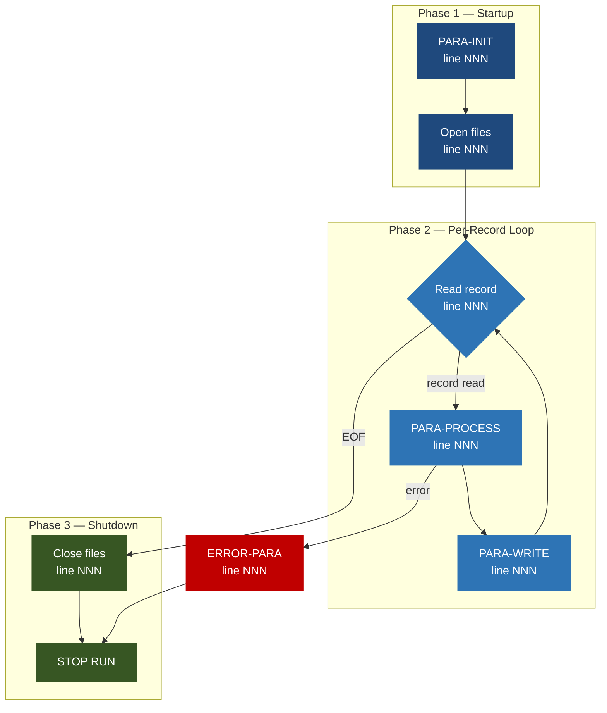

<!--
  BIZ-PROGRAMNAME.md — fill in all sections below.
  See DOCUMENTATION-STANDARD.md for rules and depth requirements.
  Reference implementation: CBACT01C/BIZ-CBACT01C.md
-->

```
Application : AWS CardDemo
Source File : PROGRAMNAME.cbl
Type        : [Batch COBOL | Online CICS COBOL]
Source Banner: [paste first comment line from .cbl verbatim]
```

---

# PROGRAMNAME — Business Documentation

## 1. Purpose

[What does this program do in one or two plain-English sentences?]

**Reads:**
- `DDNAME` (`LOGICAL-FILE-NAME`) — [plain-English description of contents]

**Writes:**
- `DDNAME` (`LOGICAL-FILE-NAME`) — [plain-English description]

**Calls:**
- `PROGRAM-NAME` — [business purpose of the call]

---

## 2. Program Flow

### 2.1 Startup

1. [Step 1 — paragraph `PARA-NAME` line NNN: what happens]
2. [Step 2 ...]

### 2.2 Per-[Record/Transaction/Statement] Loop

1. [Step 1 — paragraph `PARA-NAME` line NNN: what happens]
2. [Step 2 ...]

### 2.3 Shutdown

1. [Step 1 — paragraph `PARA-NAME` line NNN: what happens]
2. [Step 2 ...]

---

## 3. Error Handling

### `ERROR-PARAGRAPH-NAME` (line NNN)

[What triggers it. What it does in plain English. Exact DISPLAY strings.]

### `ABEND-ROUTINE` (line NNN)

[What triggers it. What it does in plain English. Exact DISPLAY strings.]

---

## 4. Migration Notes

1. **[Issue title]** — [Description with line number reference. What breaks in Java if not handled.]
2. **COMP-3 fields** — [List all COMP-3 packed decimal fields that require `BigDecimal` in Java.]
3. **Unused copybook fields** — [List fields present in copybooks but never referenced.]
4. **Unhandled file-status codes** — [Which status codes are not handled explicitly.]
5. **[Add more as discovered...]**

---

## Appendix A — Files

| Logical Name | DDname | Organization | Recording | Key Field | Direction | Contents |
|---|---|---|---|---|---|---|
| `LOGICAL-NAME` | `DDNAME` | SEQUENTIAL | FIXED | N/A | INPUT | [plain English] |

---

## Appendix B — Copybooks and External Programs

### `COPYBOOK-NAME.cpy` — defines `LEVEL-01-NAME`

| Field | PIC | Bytes | Notes |
|---|---|---|---|
| `FIELD-NAME` | `PIC X(n)` | n | [notes; flag COMP-3; flag unused; decode 88-levels] |

**Unused fields:** `FIELD-NAME` (PIC X(n)) — present in copybook, never referenced.

### External Program: `PROGRAM-NAME`

Called from `CALLING-PARA` (line NNN).

**Input fields set before call:**
- `FIELD-NAME` — [what it contains]

**Output fields read after call:**
- `FIELD-NAME` — [what it contains]

**Fields NOT checked:** `STATUS-FIELD` — [migration risk description].

---

## Appendix C — Hardcoded Literals

| Paragraph | Line | Value | Usage | Classification |
|---|---|---|---|---|
| `PARA-NAME` | NNN | `'VALUE'` | [usage] | [Test data \| Business rule \| Display message \| System constant] |

---

## Appendix D — Internal Working Fields

| Field | PIC | Bytes | Purpose |
|---|---|---|---|
| `FIELD-NAME` | `PIC X(n)` | n | [purpose] |

---

## Appendix E — Execution at a Glance


