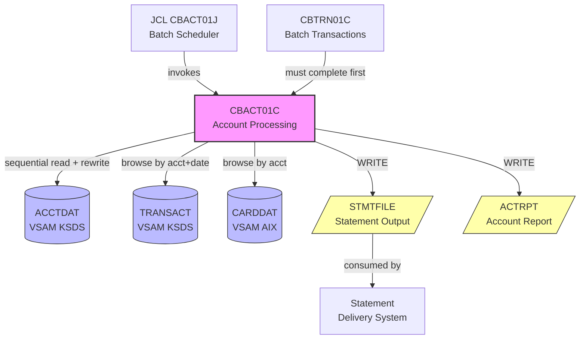

# Reverse Engineering Report: CBACT01C.cbl

## Program Identification

| Field | Value |
|-------|-------|
| Program ID | CBACT01C |
| Program Type | Batch (JCL-initiated) |
| Description | Batch Account Processing and Statement Generation |
| JCL Job | CBACT01J |
| Input Files | ACCTDAT (VSAM), TRANSACT (VSAM), CARDDAT (VSAM) |
| Output Files | ACTRPT (account report), STMTFILE (statement output) |
| Copybooks Used | CVACT01Y.cpy, CVACT02Y.cpy, CVTRA05Y.cpy, CVACT03Y.cpy, CBACT01Y.cpy |
| LOC (excluding comments) | ~520 |

## Structural Overview

CBACT01C is a batch program that processes all active accounts to generate monthly statements and account summary reports. It reads through the ACCTDAT file sequentially, aggregates transactions for the billing cycle from TRANSACT, includes card information from CARDDAT, and produces formatted statement records and a summary report. This program is the primary end-of-cycle batch job.

### Paragraph Structure

| Paragraph | Purpose |
|-----------|---------|
| 0000-MAIN | Main control: open, process loop, close |
| 1000-INIT | Opens files, reads control parameters, initializes counters |
| 1100-OPEN-FILES | Opens ACCTDAT, TRANSACT, CARDDAT, ACTRPT, STMTFILE |
| 1200-READ-CONTROL-PARAMS | Reads cycle date range from control file/JCL PARM |
| 2000-PROCESS-ACCOUNTS | Main loop: reads each account sequentially |
| 2100-READ-NEXT-ACCOUNT | Reads next account from ACCTDAT |
| 2200-PROCESS-SINGLE-ACCOUNT | Processes one account's statement |
| 2210-GET-ACCOUNT-CARDS | Reads all cards for account from CARDDAT (via AIX) |
| 2220-GET-ACCOUNT-TRANSACTIONS | Reads transactions for account/cycle from TRANSACT |
| 2230-CALCULATE-CYCLE-TOTALS | Sums debits, credits, fees, interest |
| 2240-CALCULATE-NEW-BALANCE | Computes: prior balance + debits - credits + fees + interest |
| 2250-CALCULATE-MINIMUM-PAYMENT | Determines minimum payment due |
| 2260-DETERMINE-PAYMENT-DUE-DATE | Sets payment due date (25 days from statement date) |
| 2300-WRITE-STATEMENT-RECORD | Writes formatted statement to STMTFILE |
| 2310-WRITE-STATEMENT-HEADER | Account info, dates, prior balance |
| 2320-WRITE-TRANSACTION-LINES | Each transaction as a statement line |
| 2330-WRITE-STATEMENT-SUMMARY | Totals, new balance, minimum payment |
| 2400-WRITE-REPORT-LINE | Writes account summary to ACTRPT |
| 2500-UPDATE-ACCOUNT-CYCLE | Resets cycle accumulators for next period |
| 3000-CLOSE | Close files, write report summary |
| 3100-WRITE-REPORT-SUMMARY | Total accounts, total balances, average balance |

### Control Flow

```
0000-MAIN
  |-- 1000-INIT
  |    |-- 1100-OPEN-FILES
  |    |-- 1200-READ-CONTROL-PARAMS (cycle start/end dates)
  |-- 2000-PROCESS-ACCOUNTS (PERFORM UNTIL EOF on ACCTDAT)
  |    |-- 2100-READ-NEXT-ACCOUNT
  |    |-- (ACCT-ACTIVE-STATUS = 'Y' or 'N')
  |    |    |-- 2200-PROCESS-SINGLE-ACCOUNT
  |    |    |    |-- 2210-GET-ACCOUNT-CARDS
  |    |    |    |-- 2220-GET-ACCOUNT-TRANSACTIONS
  |    |    |    |-- 2230-CALCULATE-CYCLE-TOTALS
  |    |    |    |-- 2240-CALCULATE-NEW-BALANCE
  |    |    |    |-- 2250-CALCULATE-MINIMUM-PAYMENT
  |    |    |    |-- 2260-DETERMINE-PAYMENT-DUE-DATE
  |    |    |    |-- 2300-WRITE-STATEMENT-RECORD
  |    |    |    |-- 2500-UPDATE-ACCOUNT-CYCLE
  |    |    |-- 2400-WRITE-REPORT-LINE
  |    |-- (ACCT-ACTIVE-STATUS = 'C') --> skip (closed accounts)
  |-- 3000-CLOSE
       |-- 3100-WRITE-REPORT-SUMMARY
```

## Business Rules

### BR-BACT-001: Account Selection
- All accounts in ACCTDAT are read sequentially (OPEN INPUT on VSAM KSDS)
- Active accounts (Y) and inactive accounts (N) receive statements
- Closed accounts (C) are skipped entirely
- Processing order: by account ID (VSAM primary key order)

### BR-BACT-002: Cycle Date Range
- Statement cycle dates read from JCL PARM or control record
- CYCLE-START-DATE and CYCLE-END-DATE define the billing period
- Only transactions with TRAN-ORIG-TS within cycle range are included
- Typical cycle: 1 calendar month

### BR-BACT-003: Cycle Total Calculation
- CYCLE-TOTAL-DEBITS: sum of all type 01 and 04 transaction amounts
- CYCLE-TOTAL-CREDITS: sum of all type 02 and 03 transaction amounts
- CYCLE-TOTAL-FEES: calculated fees (late payment, overlimit, annual)
- CYCLE-INTEREST: calculated interest on carried balance
- All amounts use PIC S9(15)V99 COMP-3 (BigDecimal in Java)

### BR-BACT-004: New Balance Calculation
- NEW-BALANCE = PRIOR-BALANCE + CYCLE-TOTAL-DEBITS - CYCLE-TOTAL-CREDITS + CYCLE-TOTAL-FEES + CYCLE-INTEREST
- PRIOR-BALANCE is ACCT-CURR-BAL at cycle start
- NEW-BALANCE written back to ACCT-CURR-BAL
- If NEW-BALANCE < 0 (credit balance): minimum payment = 0

### BR-BACT-005: Minimum Payment Calculation
- If NEW-BALANCE <= 0: minimum payment = 0
- If NEW-BALANCE <= 25.00: minimum payment = NEW-BALANCE
- If NEW-BALANCE > 25.00: minimum payment = MAX(25.00, NEW-BALANCE * 0.02)
- Minimum payment rounded to nearest cent (HALF-EVEN)
- Overlimit accounts: minimum payment includes overlimit amount

### BR-BACT-006: Payment Due Date
- Payment due date = statement date + 25 calendar days
- If due date falls on weekend/holiday: next business day
- COBOL uses simple +25 day calculation (no business day logic in source)
- Holiday table not referenced in CBACT01C

### BR-BACT-007: Cycle Reset
- After statement generation, account cycle fields reset:
  - ACCT-CURR-CYC-CREDIT = 0
  - ACCT-CURR-CYC-DEBIT = 0
  - Statement date updated to cycle end date
- Account record rewritten to ACCTDAT

### BR-BACT-008: Statement Output
- STMTFILE is a variable-length sequential file
- Each statement contains: header record, transaction detail records, summary record
- Statement records identified by record type: H (header), D (detail), S (summary)
- Used downstream by statement printing or electronic delivery systems

## Data Structure Mapping

| COBOL Field | Copybook | PIC | Java Type | Java Field | Notes |
|-------------|----------|-----|-----------|------------|-------|
| ACCT-ID | CVACT01Y | X(11) | String | accountId | Account key |
| ACCT-ACTIVE-STATUS | CVACT01Y | X(1) | String | accountStatus | Y/N/C |
| ACCT-CURR-BAL | CVACT01Y | S9(15)V99 | BigDecimal | currentBalance | Updated |
| ACCT-CREDIT-LIMIT | CVACT01Y | S9(15)V99 | BigDecimal | creditLimit | Read-only |
| ACCT-CURR-CYC-CREDIT | CVACT01Y | S9(15)V99 | BigDecimal | currentCycleCredit | Reset |
| ACCT-CURR-CYC-DEBIT | CVACT01Y | S9(15)V99 | BigDecimal | currentCycleDebit | Reset |
| ACCT-EXPIRATN-DATE | CVACT01Y | X(8) | LocalDate | expirationDate | Read-only |
| ACCT-CUST-ID | CVACT02Y | 9(09) | String | customerId | For statement |
| WS-CYCLE-START-DATE | CBACT01Y | X(8) | LocalDate | cycleStartDate | Control param |
| WS-CYCLE-END-DATE | CBACT01Y | X(8) | LocalDate | cycleEndDate | Control param |
| WS-PRIOR-BALANCE | CBACT01Y | S9(15)V99 | BigDecimal | priorBalance | Captured |
| WS-NEW-BALANCE | CBACT01Y | S9(15)V99 | BigDecimal | newBalance | Calculated |
| WS-MIN-PAYMENT | CBACT01Y | S9(15)V99 | BigDecimal | minimumPayment | Calculated |
| WS-PAYMENT-DUE-DATE | CBACT01Y | X(8) | LocalDate | paymentDueDate | Calculated |
| WS-TOTAL-DEBITS | CBACT01Y | S9(15)V99 | BigDecimal | cycleTotalDebits | Aggregated |
| WS-TOTAL-CREDITS | CBACT01Y | S9(15)V99 | BigDecimal | cycleTotalCredits | Aggregated |
| WS-TOTAL-FEES | CBACT01Y | S9(15)V99 | BigDecimal | cycleTotalFees | Calculated |
| WS-INTEREST | CBACT01Y | S9(15)V99 | BigDecimal | cycleInterest | Calculated |
| WS-ACCT-COUNT | CBACT01Y | 9(9) | long | accountCount | Counter |
| WS-TOTAL-ALL-BALANCES | CBACT01Y | S9(15)V99 | BigDecimal | totalAllBalances | Aggregation |

## File I/O Operations

| Operation | File | Type | Key | Notes |
|-----------|------|------|-----|-------|
| OPEN INPUT | ACCTDAT | VSAM KSDS | ACCT-ID | Sequential read |
| READ NEXT | ACCTDAT | VSAM KSDS | - | Sequential browse |
| READ (UPDATE) | ACCTDAT | VSAM KSDS | ACCT-ID | For cycle reset rewrite |
| REWRITE | ACCTDAT | VSAM KSDS | - | Cycle reset |
| STARTBR | TRANSACT | VSAM KSDS | acct+date | Transaction browse |
| READNEXT | TRANSACT | VSAM KSDS | - | All cycle transactions |
| ENDBR | TRANSACT | VSAM KSDS | - | End browse |
| STARTBR | CARDDAT (AIX) | VSAM AIX | CARD-ACCT-ID | Cards for account |
| READNEXT | CARDDAT (AIX) | VSAM AIX | - | All account cards |
| ENDBR | CARDDAT (AIX) | VSAM AIX | - | End browse |
| OPEN OUTPUT | ACTRPT | Sequential | - | Summary report |
| WRITE | ACTRPT | Sequential | - | Report lines |
| OPEN OUTPUT | STMTFILE | Sequential | - | Statement output |
| WRITE | STMTFILE | Sequential | - | Statement records |

## Dependencies

### Upstream
- **JCL CBACT01J**: Schedules batch job (typically monthly, end of cycle)
- **CBTRN01C**: Must complete before CBACT01C to ensure all transactions posted
- **Online programs**: CICS online region should be quiesced during batch

### Downstream
- **ACCTDAT**: Account data updated (balance, cycle reset)
- **STMTFILE**: Consumed by statement printing/delivery systems
- **ACTRPT**: Used by operations for monthly reporting and reconciliation

## Dependency Diagram



## Migration Recommendations

### Target Implementation
- **Java Class**: AccountBatchJob (Quarkus @Scheduled)
- **Schedule**: Configurable cron (default: 1st of month at 03:00 AM, after CBTRN01C)
- **Statement output**: Database `statement` and `statement_line` tables + PDF generation
- **Report**: Generated as CSV/PDF, stored in object storage

### Batch Processing Strategy
1. **Sequential processing**: Maintain sequential account processing order
2. **Chunk processing**: Process in chunks of 50 accounts with commit points
3. **Transaction aggregation**: SQL aggregation queries replace COBOL STARTBR/READNEXT accumulation
4. **Statement storage**: Database tables instead of sequential file records
5. **Cycle reset**: Atomic with statement write in same database transaction

### Business Logic
- Minimum payment calculation extracted to MinimumPaymentCalculator service
- Payment due date calculation enhanced with business day calendar
- Interest calculation: currently a stub in COBOL; implement configurable APR
- Fee calculation: late payment, overlimit, annual fee rules as configurable policies

### Architecture Decision

| Decision | Choice | Rationale |
|----------|--------|-----------|
| Scheduler | Quarkus @Scheduled + cron | Replaces JCL; integrates with application |
| Statement storage | Database tables | Replaces sequential file; enables API access |
| Statement delivery | Separate microservice | Separation of concerns from generation |
| Report format | CSV + PDF | Replaces 132-column print; modern formats |
| Cycle parameters | Configuration table | Replaces JCL PARM; per-account cycle dates possible |
| Interest calculation | APR-based calculator | COBOL has stub; implement proper interest engine |
| Job dependency | Quarkus job ordering | CBACT01C waits for CBTRN01C completion signal |
