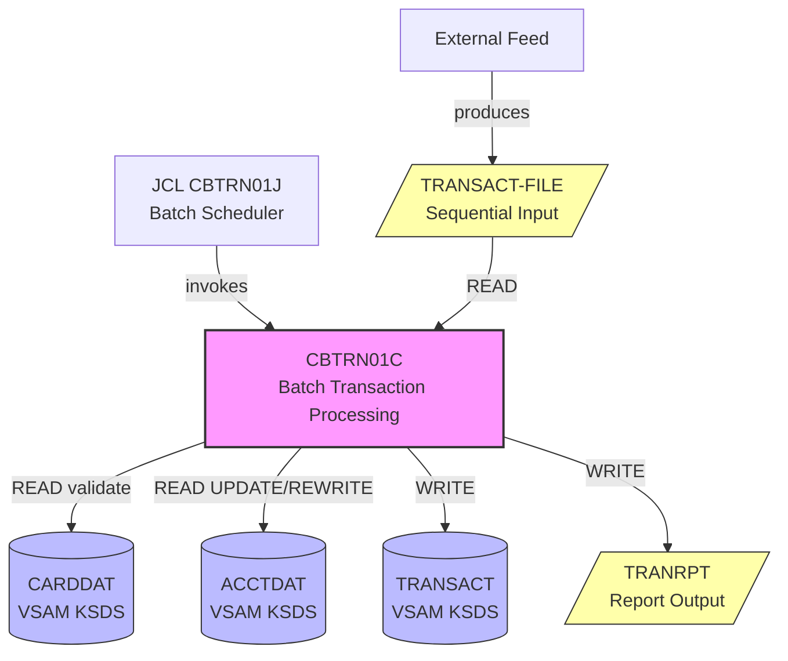

# Reverse Engineering Report: CBTRN01C.cbl

## Program Identification

| Field | Value |
|-------|-------|
| Program ID | CBTRN01C |
| Program Type | Batch (JCL-initiated) |
| Description | Batch Transaction Processing |
| JCL Job | CBTRN01J |
| Input File | TRANSACT-FILE (sequential extract) |
| Output Files | TRANRPT (report), TRANSACT (VSAM update) |
| Copybooks Used | CVTRA05Y.cpy, CVACT03Y.cpy, CVACT01Y.cpy, CBTRN01Y.cpy |
| LOC (excluding comments) | ~450 |

## Structural Overview

CBTRN01C is a batch program that processes a sequential file of pending transactions, validates each transaction, posts valid ones to the VSAM TRANSACT file, and updates account balances. It produces a printed report of processed and rejected transactions. This program runs as a scheduled nightly batch job and handles the high-volume transaction processing that would be impractical in the online CICS environment.

### Paragraph Structure

| Paragraph | Purpose |
|-----------|---------|
| 0000-MAIN | Main control: open files, process loop, close files |
| 1000-INIT | Opens all files, initializes counters and report header |
| 1100-OPEN-FILES | Opens TRANSACT-FILE, TRANSACT (VSAM), ACCTDAT, CARDDAT, TRANRPT |
| 2000-PROCESS-LOOP | Main loop: reads and processes each transaction record |
| 2100-READ-INPUT | Reads next record from sequential TRANSACT-FILE |
| 2200-VALIDATE-TRANSACTION | Validates transaction data (type, amount, card, limits) |
| 2210-VALIDATE-CARD | Reads CARDDAT to verify card exists and is active |
| 2220-VALIDATE-AMOUNT | Checks amount > 0 and within bounds |
| 2230-CHECK-CREDIT-LIMIT | Reads ACCTDAT, checks credit limit for debits |
| 2300-POST-TRANSACTION | Writes valid transaction to VSAM TRANSACT |
| 2310-UPDATE-ACCOUNT | Reads/updates ACCTDAT with new balance |
| 2320-GENERATE-TRAN-ID | Generates unique transaction ID for batch |
| 2400-WRITE-REPORT-LINE | Writes transaction result to TRANRPT |
| 2410-WRITE-ACCEPTED-LINE | Formats accepted transaction report line |
| 2420-WRITE-REJECTED-LINE | Formats rejected transaction with reason |
| 3000-CLOSE | Closes all files, writes summary totals to report |
| 3100-WRITE-SUMMARY | Writes counts: processed, accepted, rejected, total amount |

### Control Flow

```
0000-MAIN
  |-- 1000-INIT
  |    |-- 1100-OPEN-FILES (5 files)
  |-- 2000-PROCESS-LOOP (PERFORM UNTIL EOF)
  |    |-- 2100-READ-INPUT
  |    |-- 2200-VALIDATE-TRANSACTION
  |    |    |-- 2210-VALIDATE-CARD
  |    |    |-- 2220-VALIDATE-AMOUNT
  |    |    |-- 2230-CHECK-CREDIT-LIMIT
  |    |-- (valid) --> 2300-POST-TRANSACTION
  |    |    |-- 2320-GENERATE-TRAN-ID
  |    |    |-- WRITE to TRANSACT (VSAM)
  |    |    |-- 2310-UPDATE-ACCOUNT
  |    |    |-- 2410-WRITE-ACCEPTED-LINE
  |    |-- (invalid) --> 2420-WRITE-REJECTED-LINE
  |-- 3000-CLOSE
       |-- 3100-WRITE-SUMMARY
       |-- Close all files
```

## Business Rules

### BR-BTRN-001: Sequential File Processing
- Input file TRANSACT-FILE is a fixed-length sequential file
- Record layout matches CVTRA05Y.cpy (same as online transaction record)
- File is produced by an upstream extract process or external feed
- Processing order: sequential, first-in-first-processed
- Each record processed independently (no cross-record dependencies)

### BR-BTRN-002: Validation Rules (same as online)
- Transaction type must be 01, 02, 03, or 04
- Amount must be positive (> 0) and within PIC S9(9)V99 range
- Card must exist in CARDDAT and have CARD-ACTIVE-STATUS = 'Y'
- Debit transactions (01, 04) checked against credit limit
- Cash advances (04) additionally checked against cash credit limit
- All validation failures recorded with rejection reason code

### BR-BTRN-003: Rejection Reason Codes
- REJ-01: Invalid transaction type
- REJ-02: Invalid amount (zero, negative, or overflow)
- REJ-03: Card not found
- REJ-04: Card inactive or reported lost
- REJ-05: Credit limit exceeded
- REJ-06: Cash credit limit exceeded
- REJ-07: Account not found
- REJ-99: Unexpected I/O error

### BR-BTRN-004: Balance Update
- Same rules as online (BR-TRN-005 in COTRN00C):
  - Type 01, 04: ACCT-CURR-BAL += TRAN-AMT
  - Type 02, 03: ACCT-CURR-BAL -= TRAN-AMT
  - Cycle debit/credit accumulators updated

### BR-BTRN-005: Report Generation
- TRANRPT is a sequential print file (132-character lines)
- Header: job name, date, time, page number
- Detail lines: Tran ID, Card Number, Type, Amount, Status (ACCEPTED/REJECTED), Reason
- Summary: Total records read, accepted count, rejected count, total amount posted
- Report used for daily reconciliation

### BR-BTRN-006: Error Handling
- Individual record failures do not terminate the batch job
- Each failed record is written to the reject section of the report
- Cumulative I/O errors > 100: abort job with return code 16
- File open failures: immediate abort with return code 12
- Normal completion: return code 0

## Data Structure Mapping

| COBOL Field | Copybook | PIC | Java Type | Java Field | Notes |
|-------------|----------|-----|-----------|------------|-------|
| TRAN-ID | CVTRA05Y | X(16) | String | transactionId | Generated in batch |
| TRAN-CARD-NUM | CVTRA05Y | X(16) | String | cardNumber | Lookup key |
| TRAN-TYPE-CD | CVTRA05Y | X(2) | String | transactionType | 01/02/03/04 |
| TRAN-AMT | CVTRA05Y | S9(9)V99 COMP-3 | BigDecimal | amount | Positive only |
| TRAN-DESC | CVTRA05Y | X(100) | String | description | Free text |
| TRAN-ORIG-TS | CVTRA05Y | X(26) | LocalDateTime | timestamp | Original timestamp |
| WS-RECORDS-READ | CBTRN01Y | 9(9) | long | recordsRead | Counter |
| WS-RECORDS-ACCEPTED | CBTRN01Y | 9(9) | long | recordsAccepted | Counter |
| WS-RECORDS-REJECTED | CBTRN01Y | 9(9) | long | recordsRejected | Counter |
| WS-TOTAL-AMOUNT | CBTRN01Y | S9(15)V99 | BigDecimal | totalAmount | Running total |
| WS-REJECT-REASON | CBTRN01Y | X(6) | String | rejectReason | REJ-XX code |

## File I/O Operations

| Operation | File | Type | Key | Notes |
|-----------|------|------|-----|-------|
| OPEN INPUT | TRANSACT-FILE | Sequential | N/A | Input batch file |
| READ | TRANSACT-FILE | Sequential | N/A | AT END sets EOF flag |
| READ | CARDDAT | VSAM KSDS | CARD-NUM | Card validation |
| READ | ACCTDAT | VSAM KSDS | ACCT-ID | Credit limit check |
| READ (UPDATE) | ACCTDAT | VSAM KSDS | ACCT-ID | Balance update lock |
| REWRITE | ACCTDAT | VSAM KSDS | - | Balance update write |
| WRITE | TRANSACT | VSAM KSDS | TRAN-ID | Post transaction |
| OPEN OUTPUT | TRANRPT | Sequential | N/A | Print report |
| WRITE | TRANRPT | Sequential | N/A | Report lines |

## Dependencies

### Upstream
- **JCL CBTRN01J**: Schedules and initiates the batch job
- **External feed**: Produces TRANSACT-FILE sequential input
- **Online COTRN00C**: May have posted transactions that affect account balances

### Downstream
- **TRANSACT**: VSAM KSDS (transaction data, shared with online programs)
- **ACCTDAT**: VSAM KSDS (account data, shared with online programs)
- **CARDDAT**: VSAM KSDS (card data, read-only in batch)
- **TRANRPT**: Report file for operations/reconciliation team

## Dependency Diagram



## Migration Recommendations

### Target Implementation
- **Java Class**: TransactionBatchJob (Quarkus @Scheduled)
- **Schedule**: Configurable cron expression (default: daily at 02:00 AM)
- **Input**: Database staging table or file upload endpoint replaces sequential file
- **Output**: Database audit table + generated report (PDF or CSV)

### Batch Processing Strategy
1. **Input source**: Replace sequential file with `batch_transaction_staging` table
2. **Chunk processing**: Process in configurable chunks (default 100) with commit points
3. **Parallelism**: Consider partitioned processing by account ID range
4. **Restart/recovery**: Track last processed record for restart capability
5. **Report**: Generate as downloadable CSV/PDF instead of print file

### Error Handling
- Individual transaction failures captured in `batch_transaction_errors` table
- Threshold-based abort preserved (configurable, default 100 errors)
- Each chunk wrapped in its own database transaction
- Dead letter queue for transactions that fail validation

### Architecture Decision

| Decision | Choice | Rationale |
|----------|--------|-----------|
| Scheduler | Quarkus @Scheduled + cron | Replaces JCL job scheduler |
| Input | Staging database table | Replaces sequential file; enables restart |
| Chunk size | Configurable (default 100) | Balance between throughput and memory |
| Report format | CSV + optional PDF | Replaces 132-column print file |
| Error tracking | Separate errors table | Replaces report-only reject tracking |
| Concurrency | Single-threaded per job run | Matches COBOL sequential semantics; optimize later |
