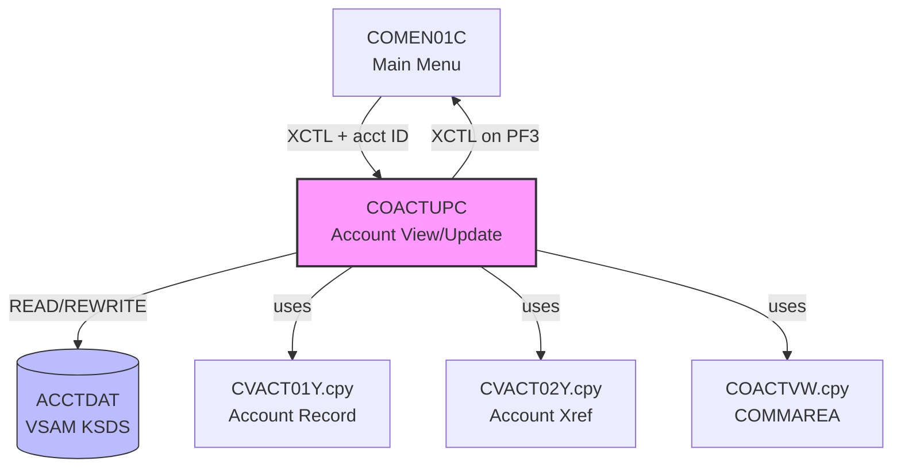

# Reverse Engineering Report: COACTUPC.cbl

## Program Identification

| Field | Value |
|-------|-------|
| Program ID | COACTUPC |
| Program Type | CICS Online (BMS) |
| Description | Account View and Update |
| Transaction ID | CAU0 |
| BMS Map | COACUP1 / COACUP2 |
| Copybooks Used | COACTVW.cpy, CVACT01Y.cpy, CVACT02Y.cpy, COTTL01Y.cpy, CSDAT01Y.cpy, CSMSG01Y.cpy |
| LOC (excluding comments) | ~620 |

## Structural Overview

COACTUPC provides account detail viewing and updating capabilities. The program reads an account record from the ACCTDAT VSAM file, displays the account details on a BMS map, and allows authorized users to modify specific fields. It enforces business rules on credit limits and account status before writing updates back to the file.

### Paragraph Structure

| Paragraph | Purpose |
|-----------|---------|
| MAIN-PARA | Entry point, routes based on EIBCALEN and COMMAREA flags |
| PROCESS-ENTER-KEY | Main processing: determines view vs update mode |
| READ-ACCTDAT-FILE | Reads account record by ACCT-ID from ACCTDAT |
| REWRITE-ACCTDAT-FILE | Writes updated record back to ACCTDAT |
| EDIT-ACCT-CHANGES | Validates all changed fields before rewrite |
| VALIDATE-CREDIT-LIMIT | Ensures credit limit is non-negative and within bounds |
| VALIDATE-CASH-LIMIT | Ensures cash credit limit does not exceed credit limit |
| VALIDATE-ACCT-STATUS | Validates status transition rules |
| COMPARE-OLD-NEW-FIELDS | Detects which fields were changed by the user |
| POPULATE-ACCT-SCREEN | Moves account record fields to BMS map |
| SEND-ACCT-SCREEN | Sends BMS map to terminal |
| RECEIVE-ACCT-SCREEN | Receives user input from BMS map |
| POPULATE-HEADER-INFO | Title, date, transaction info |
| FORMAT-CURR-FIELDS | Formats numeric fields for display (inserts decimal, commas) |
| PROTECT-FIELDS | Sets BMS attributes to protected for view-only mode |
| UNPROTECT-FIELDS | Sets BMS attributes to unprotected for edit mode |
| PROCESS-PF5-UPDATE | Initiates update mode (unprotects fields) |
| CONFIRM-UPDATE | Final confirmation before rewrite |

### Control Flow

```
MAIN-PARA
  |-- (EIBCALEN = 0) --> Initialize, SEND-ACCT-SCREEN
  |-- (EIBCALEN > 0) --> RECEIVE-ACCT-SCREEN
       |-- (AID = ENTER, view mode) --> READ-ACCTDAT-FILE
       |    --> POPULATE-ACCT-SCREEN --> SEND-ACCT-SCREEN
       |-- (AID = ENTER, update mode) --> COMPARE-OLD-NEW-FIELDS
       |    --> EDIT-ACCT-CHANGES
       |    |-- (valid) --> CONFIRM-UPDATE --> REWRITE-ACCTDAT-FILE
       |    |-- (invalid) --> error msg --> SEND-ACCT-SCREEN
       |-- (AID = PF5) --> PROCESS-PF5-UPDATE (toggle edit mode)
       |-- (AID = PF3) --> XCTL to COMEN01C
```

## Business Rules

### BR-ACCT-001: Credit Limit Validation
- Credit limit (ACCT-CREDIT-LIMIT) must be >= 0
- Credit limit is PIC S9(15)V99 COMP-3, maximum value: 9999999999999.99
- Credit limit changes require user type 'A' (Admin)
- Validation performed in VALIDATE-CREDIT-LIMIT paragraph

### BR-ACCT-002: Cash Credit Limit Validation
- Cash credit limit (ACCT-CASH-CREDIT-LIMIT) must be >= 0
- Cash credit limit must not exceed the overall credit limit
- Validation: IF ACCT-CASH-CREDIT-LIMIT > ACCT-CREDIT-LIMIT THEN error

### BR-ACCT-003: Account Status Transitions
- Valid statuses: Y (Active), N (Inactive), C (Closed)
- Allowed transitions: Y->N, Y->C, N->Y, N->C
- Closed accounts (C) cannot be reactivated (C->Y and C->N are invalid)
- Status change to C triggers a confirmation prompt

### BR-ACCT-004: View vs Update Mode
- Default mode is view (all fields protected)
- PF5 toggles to update mode (unprotects editable fields)
- Only Admin users (SEC-USR-TYPE = 'A') can enter update mode
- Non-admin users see PF5 as disabled

### BR-ACCT-005: Concurrent Update Protection
- COBOL uses EXEC CICS READ UPDATE to lock the record
- If another terminal holds the lock: INVREQ condition displayed as error
- Lock released on REWRITE or task end (CICS manages this)

### BR-ACCT-006: Monetary Display Format
- All monetary fields displayed with comma separators and 2 decimal places
- FORMAT-CURR-FIELDS handles: 1234567.89 -> "1,234,567.89"
- Negative amounts displayed with leading minus sign

## Data Structure Mapping

| COBOL Field | Copybook | PIC | Java Type | Java Field | Notes |
|-------------|----------|-----|-----------|------------|-------|
| ACCT-ID | CVACT01Y | X(11) | String | accountId | Primary key |
| ACCT-ACTIVE-STATUS | CVACT01Y | X(1) | String | accountStatus | Y/N/C |
| ACCT-CREDIT-LIMIT | CVACT01Y | S9(15)V99 COMP-3 | BigDecimal | creditLimit | Non-negative |
| ACCT-CURR-BAL | CVACT01Y | S9(15)V99 COMP-3 | BigDecimal | currentBalance | Can be negative |
| ACCT-CASH-CREDIT-LIMIT | CVACT01Y | S9(15)V99 COMP-3 | BigDecimal | cashCreditLimit | <= creditLimit |
| ACCT-OPEN-DATE | CVACT01Y | X(8) | LocalDate | openDate | YYYYMMDD |
| ACCT-EXPIRATN-DATE | CVACT01Y | X(8) | LocalDate | expirationDate | YYYYMMDD |
| ACCT-REISSUE-DATE | CVACT01Y | X(8) | LocalDate | reissueDate | YYYYMMDD |
| ACCT-CURR-CYC-CREDIT | CVACT01Y | S9(15)V99 COMP-3 | BigDecimal | currentCycleCredit | Cycle total |
| ACCT-CURR-CYC-DEBIT | CVACT01Y | S9(15)V99 COMP-3 | BigDecimal | currentCycleDebit | Cycle total |
| ACCT-GROUP-ID | CVACT01Y | X(10) | String | groupId | Group association |
| ACCT-CUST-ID | CVACT02Y | 9(09) | String | customerId | Customer FK |

## CICS Commands and File I/O

| Operation | Resource | Key | Condition Handling |
|-----------|----------|-----|-------------------|
| EXEC CICS READ | ACCTDAT | ACCT-ID | NOTFND: "Account not found" |
| EXEC CICS READ UPDATE | ACCTDAT | ACCT-ID | INVREQ: "Record locked by another user" |
| EXEC CICS REWRITE | ACCTDAT | - | IOERR: ABEND 'ACTU' |
| EXEC CICS SEND MAP | COACUP1 | - | - |
| EXEC CICS RECEIVE MAP | COACUP1 | - | MAPFAIL: redisplay |
| EXEC CICS XCTL | COMEN01C | - | On PF3 |

## Dependencies

### Upstream
- **COMEN01C**: Main menu, passes account ID via COMMAREA
- **COCRDLIC**: Card list, may navigate here with account context

### Downstream
- **COMEN01C**: Returns to main menu on PF3
- **ACCTDAT**: VSAM KSDS file (primary account data store)

### Copybook Dependencies
- **COACTVW.cpy**: COMMAREA layout for account view screen
- **CVACT01Y.cpy**: Account record layout
- **CVACT02Y.cpy**: Account cross-reference record layout
- **COTTL01Y.cpy**: Screen title/header layout
- **CSDAT01Y.cpy**: Date formatting
- **CSMSG01Y.cpy**: Message area layout

## Dependency Diagram



## Migration Recommendations

### Target API
- **View**: GET /api/v1/accounts/{id}
- **Update**: PUT /api/v1/accounts/{id}
- **Request (Update)**: `{ "creditLimit": number, "cashCreditLimit": number, "accountStatus": "string" }`

### Concurrency
1. **COBOL**: EXEC CICS READ UPDATE (pessimistic locking via VSAM exclusive control)
2. **Java**: Optimistic locking via JPA @Version column or ETag header
3. **Rationale**: Pessimistic locking does not scale for REST APIs; optimistic locking with conflict detection (HTTP 409) is standard

### Validation
- Credit limit and cash credit limit validation preserved in service layer
- Account status transition matrix implemented as state machine
- Closed account protection enforced at service level (reject updates to closed accounts)
- All monetary inputs validated for scale <= 2 and within PIC S9(15)V99 bounds

### Architecture Decision

| Decision | Choice | Rationale |
|----------|--------|-----------|
| Locking | Optimistic (@Version) | REST-compatible; CICS READ UPDATE not feasible |
| View/Update split | Separate GET/PUT endpoints | REST semantics replace PF5 toggle |
| Authorization | RBAC on PUT endpoint | Replaces COBOL user-type check for edit mode |
| Status transitions | State machine enum | Formalizes COBOL IF-ELSE chain |
| Monetary formatting | Client-side | Server returns raw BigDecimal; formatting is UI concern |
| Conflict response | HTTP 409 Conflict | Maps to COBOL INVREQ handling |
