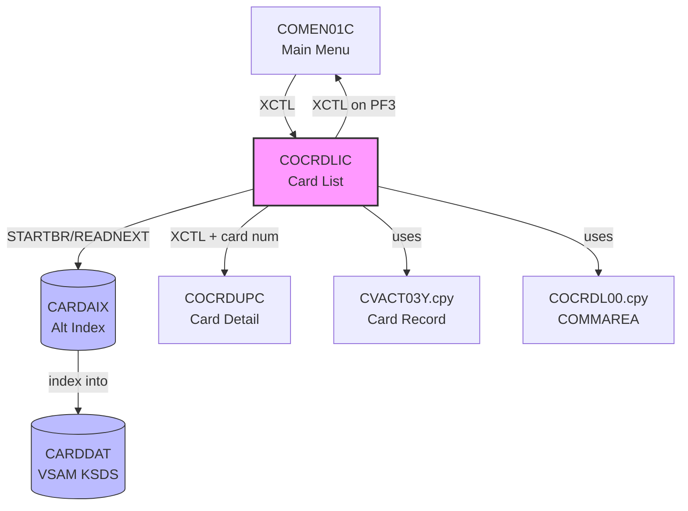

# Reverse Engineering Report: COCRDLIC.cbl

## Program Identification

| Field | Value |
|-------|-------|
| Program ID | COCRDLIC |
| Program Type | CICS Online (BMS) |
| Description | Card List Display with Pagination |
| Transaction ID | CCL0 |
| BMS Map | COCRDLI / COCRDLO |
| Copybooks Used | COCRDL00.cpy, CVACT03Y.cpy, COTTL01Y.cpy, CSDAT01Y.cpy, CSMSG01Y.cpy, CVACT01Y.cpy |
| LOC (excluding comments) | ~480 |

## Structural Overview

COCRDLIC displays a paginated list of credit cards associated with an account. The program uses CICS STARTBR/READNEXT/READPREV commands to browse the CARDAIX (alternate index) file, which is keyed by account ID. Results are displayed in a scrollable BMS map with 7 card entries per page.

### Paragraph Structure

| Paragraph | Purpose |
|-----------|---------|
| MAIN-PARA | Entry point, initializes or processes based on EIBCALEN |
| PROCESS-ENTER-KEY | Initiates card listing for entered account ID |
| PROCESS-PAGE-FORWARD | Reads next 7 records from CARDAIX via READNEXT |
| PROCESS-PAGE-BACKWARD | Reads previous 7 records from CARDAIX via READPREV |
| PROCESS-CARD-SELECTION | Handles user selection of a card for detail view |
| STARTBR-CARDAIX-FILE | Positions browse cursor at account's first card |
| READNEXT-CARDAIX-FILE | Reads next card record from browse |
| READPREV-CARDAIX-FILE | Reads previous card record from browse |
| ENDBR-CARDAIX-FILE | Ends browse operation |
| POPULATE-CARD-LINE | Moves card fields to BMS map output line |
| SEND-CARD-LIST-SCREEN | Sends populated BMS map to terminal |
| RECEIVE-CARD-LIST-SCREEN | Receives user input from BMS map |
| POPULATE-HEADER-INFO | Sets title, date, transaction ID in header |
| CLEAR-CARD-LINES | Initializes all 7 display lines to spaces |

### Control Flow

```
MAIN-PARA
  |-- (EIBCALEN = 0) --> Initialize COMMAREA, SEND-CARD-LIST-SCREEN
  |-- (EIBCALEN > 0) --> RECEIVE-CARD-LIST-SCREEN
       |-- (AID = ENTER) --> PROCESS-ENTER-KEY
       |    |-- STARTBR-CARDAIX-FILE
       |    |-- Loop: READNEXT x7 --> POPULATE-CARD-LINE
       |    |-- ENDBR-CARDAIX-FILE
       |    |-- SEND-CARD-LIST-SCREEN
       |-- (AID = PF7) --> PROCESS-PAGE-BACKWARD
       |-- (AID = PF8) --> PROCESS-PAGE-FORWARD
       |-- (AID = PF3) --> XCTL to COMEN01C
       |-- (selection made) --> PROCESS-CARD-SELECTION --> XCTL to COCRDUPC
```

## Business Rules

### BR-CRDL-001: Card Listing by Account
- User enters an 11-digit account ID on the screen
- Account ID is used as the browse key for CARDAIX (alternate index on CARDDAT)
- CARDAIX is keyed by CARD-ACCT-ID, returning cards in card number order within that account
- If no cards found for account: displays "No cards found for this account"

### BR-CRDL-002: Pagination
- Page size is fixed at 7 records (7 display lines on BMS map)
- PF8 (Forward): reads next 7 records via READNEXT
- PF7 (Backward): reads previous 7 records via READPREV
- COMMAREA stores the first and last card keys of the current page for navigation
- End of file: displays "End of records reached" and shows partial page

### BR-CRDL-003: Card Selection
- User types 'S' next to a card line to select it for detail view
- Selected card number is passed via COMMAREA to COCRDUPC
- Only one selection allowed per page; multiple selections show error

### BR-CRDL-004: Display Fields
- Each card line shows: Card Number, Card Status, Expiry Date (MM/YY)
- Card number is partially masked in display: first 4 and last 4 digits shown
- Status values: Y (Active), N (Inactive), R (Reported Lost)

## Data Structure Mapping

| COBOL Field | Copybook | PIC | Java Type | Java Field | Notes |
|-------------|----------|-----|-----------|------------|-------|
| CARD-NUM | CVACT03Y | X(16) | String | cardNumber | Primary key in CARDDAT |
| CARD-ACCT-ID | CVACT03Y | X(11) | String | accountId | Foreign key, CARDAIX key |
| CARD-CVV-CD | CVACT03Y | X(3) | String | cvvCode | Not displayed in list |
| CARD-EMBOSSED-NAME | CVACT03Y | X(26) | String | cardholderName | Display field |
| CARD-EXPIRATN-DATE | CVACT03Y | X(8) | LocalDate | expiryDate | YYYYMMDD format |
| CARD-ACTIVE-STATUS | CVACT03Y | X(1) | String | cardStatus | Y/N/R |
| CDEMO-ACCT-ID | COCRDL00 | X(11) | String | accountId | COMMAREA input |
| CDEMO-CARD-SEL-FLG | COCRDL00 | X(1) | String | - | Selection flag (S) |
| CDEMO-CARD-SEL-NUM | COCRDL00 | X(16) | String | - | Selected card number |
| CDEMO-LAST-CARD-NUM | COCRDL00 | X(16) | String | - | Pagination state |
| CDEMO-FIRST-CARD-NUM | COCRDL00 | X(16) | String | - | Pagination state |

## CICS Commands and File I/O

| Operation | Resource | Key | Condition Handling |
|-----------|----------|-----|-------------------|
| EXEC CICS STARTBR | CARDAIX | CARD-ACCT-ID | NOTFND: "No cards found" |
| EXEC CICS READNEXT | CARDAIX | CARD-ACCT-ID | ENDFILE: partial page display |
| EXEC CICS READPREV | CARDAIX | CARD-ACCT-ID | ENDFILE: stay on first page |
| EXEC CICS ENDBR | CARDAIX | - | - |
| EXEC CICS SEND MAP | COCRDLI | - | - |
| EXEC CICS RECEIVE MAP | COCRDLI | - | MAPFAIL: redisplay |
| EXEC CICS XCTL | COCRDUPC | - | On card selection |
| EXEC CICS XCTL | COMEN01C | - | On PF3 (exit) |

## Dependencies

### Upstream
- **COMEN01C**: Main menu transfers control here when user selects card list option

### Downstream
- **COCRDUPC**: Card detail/update program, receives selected card via COMMAREA
- **COMEN01C**: Returns to main menu on PF3
- **CARDDAT**: VSAM KSDS file (primary card data)
- **CARDAIX**: VSAM AIX (alternate index by account ID)

### Copybook Dependencies
- **COCRDL00.cpy**: COMMAREA layout for card list screen
- **CVACT03Y.cpy**: Card record layout
- **COTTL01Y.cpy**: Screen title/header layout
- **CSDAT01Y.cpy**: Date formatting
- **CSMSG01Y.cpy**: Message area layout
- **DFHAID / DFHBMSCA**: CICS standard copybooks

## Dependency Diagram



## Migration Recommendations

### Target API
- **Endpoint**: GET /api/v1/cards?accountId={id}&page={n}&size={n}
- **Response**: `{ "cards": [...], "totalCount": n, "page": n, "size": n }`

### Pagination Changes
1. **COBOL**: Cursor-based pagination using STARTBR/READNEXT with stored key positions
2. **Java**: Offset-based pagination using SQL LIMIT/OFFSET on card table
3. **Rationale**: SQL-based pagination is simpler and supports arbitrary page access (not just forward/back)
4. **Default page size**: 10 (increased from COBOL's 7 to suit modern UIs)

### Data Access
- CARDAIX alternate index replaced by SQL query with WHERE clause on account_id
- Card number masking moved to a response DTO transformer
- Browse state (first/last key) in COMMAREA replaced by stateless page/size parameters

### Architecture Decision

| Decision | Choice | Rationale |
|----------|--------|-----------|
| Pagination | Offset-based (page/size) | Stateless; COBOL cursor-based not needed with SQL |
| Page size | Configurable, default 10 | COBOL fixed at 7 due to BMS screen lines |
| Card masking | Response DTO layer | Separation of concerns vs COBOL in-line masking |
| Selection | Direct GET by card number | No selection flag needed; REST resource addressing |
| Sorting | Default by card number ASC | Matches CARDAIX key ordering |
