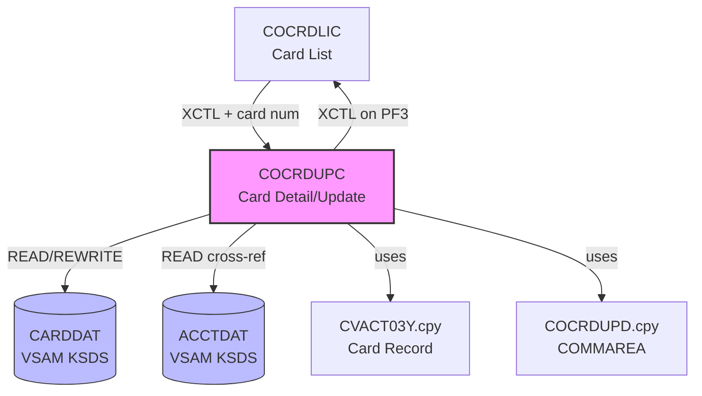

# Reverse Engineering Report: COCRDUPC.cbl

## Program Identification

| Field | Value |
|-------|-------|
| Program ID | COCRDUPC |
| Program Type | CICS Online (BMS) |
| Description | Card Detail View and Update |
| Transaction ID | CCU0 |
| BMS Map | COCRDUP / COCRDUO |
| Copybooks Used | COCRDUPD.cpy, CVACT03Y.cpy, CVACT01Y.cpy, COTTL01Y.cpy, CSDAT01Y.cpy, CSMSG01Y.cpy |
| LOC (excluding comments) | ~540 |

## Structural Overview

COCRDUPC provides detailed view and update functionality for individual credit card records. The program reads the card record from CARDDAT, displays all card fields, and allows authorized users to update the card status and expiry date. It validates expiry dates and status values before writing changes back to the file.

### Paragraph Structure

| Paragraph | Purpose |
|-----------|---------|
| MAIN-PARA | Entry point, routes based on EIBCALEN |
| PROCESS-ENTER-KEY | Main processing: view or confirm update |
| READ-CARD-RECORD | Reads card by CARD-NUM from CARDDAT |
| REWRITE-CARD-RECORD | Writes updated card record to CARDDAT |
| EDIT-CARD-CHANGES | Validates status and expiry date changes |
| VALIDATE-CARD-STATUS | Checks status value is Y, N, or R |
| VALIDATE-EXPIRY-DATE | Validates expiry date format and future date check |
| POPULATE-CARD-DETAIL | Moves card fields to BMS map for display |
| SEND-CARD-DETAIL-SCREEN | Sends BMS map to terminal |
| RECEIVE-CARD-DETAIL-SCREEN | Receives user input from BMS map |
| FORMAT-CARD-NUMBER | Formats 16-digit card number with spaces (XXXX XXXX XXXX XXXX) |
| FORMAT-EXPIRY-DATE | Converts YYYYMMDD to MM/YY display format |
| READ-ACCOUNT-FOR-CARD | Cross-references card to account for display |
| POPULATE-HEADER-INFO | Header title and date |
| PROCESS-PF5-UPDATE | Toggles between view and edit mode |
| CONFIRM-CARD-UPDATE | Final confirmation prompt before rewrite |

### Control Flow

```
MAIN-PARA
  |-- (EIBCALEN = 0) --> Initialize
  |-- (EIBCALEN > 0) --> RECEIVE-CARD-DETAIL-SCREEN
       |-- (AID = ENTER, view mode) --> READ-CARD-RECORD
       |    --> READ-ACCOUNT-FOR-CARD
       |    --> POPULATE-CARD-DETAIL
       |    --> SEND-CARD-DETAIL-SCREEN
       |-- (AID = ENTER, update mode) --> EDIT-CARD-CHANGES
       |    |-- (valid) --> CONFIRM-CARD-UPDATE --> REWRITE-CARD-RECORD
       |    |-- (invalid) --> error message --> SEND-CARD-DETAIL-SCREEN
       |-- (AID = PF5) --> PROCESS-PF5-UPDATE
       |-- (AID = PF3) --> XCTL to COCRDLIC (back to card list)
```

## Business Rules

### BR-CARD-001: Card Status Validation
- Valid card status values: Y (Active), N (Inactive), R (Reported Lost)
- Status field is CARD-ACTIVE-STATUS PIC X(1)
- Any value other than Y, N, or R is rejected with error message
- Status R (Reported Lost) triggers immediate deactivation flag

### BR-CARD-002: Expiry Date Validation
- Expiry date must be in YYYYMMDD format (PIC X(8))
- Date must be a valid calendar date (month 01-12, valid day for month)
- Expiry date must be in the future (compared to current CICS ASKTIME date)
- Leap year handling: Feb 29 validated against year
- Validation performed in VALIDATE-EXPIRY-DATE paragraph

### BR-CARD-003: Card Number Immutability
- Card number (CARD-NUM) is the VSAM primary key and cannot be changed
- BMS map displays card number as protected field in both view and edit modes
- Card number format: 16 numeric digits, displayed as XXXX XXXX XXXX XXXX

### BR-CARD-004: Account Cross-Reference
- Each card references an account via CARD-ACCT-ID
- READ-ACCOUNT-FOR-CARD reads ACCTDAT to display account information alongside card
- Account status affects card operations: cards on closed accounts cannot be reactivated
- Cross-reference is read-only (card detail screen does not modify account)

### BR-CARD-005: CVV Code Handling
- CARD-CVV-CD PIC X(3) is stored in CARDDAT but NEVER displayed on screen
- CVV is protected from display in both view and edit modes
- CVV cannot be changed through this program

### BR-CARD-006: Cardholder Name
- CARD-EMBOSSED-NAME PIC X(26) displayed in view mode
- Name can be updated in edit mode
- Leading/trailing spaces trimmed before storage

## Data Structure Mapping

| COBOL Field | Copybook | PIC | Java Type | Java Field | Notes |
|-------------|----------|-----|-----------|------------|-------|
| CARD-NUM | CVACT03Y | X(16) | String | cardNumber | Primary key, immutable |
| CARD-ACCT-ID | CVACT03Y | X(11) | String | accountId | Account FK |
| CARD-CVV-CD | CVACT03Y | X(3) | String | cvvCode | Never exposed in API |
| CARD-EMBOSSED-NAME | CVACT03Y | X(26) | String | cardholderName | Trimmed |
| CARD-EXPIRATN-DATE | CVACT03Y | X(8) | LocalDate | expiryDate | YYYYMMDD, must be future |
| CARD-ACTIVE-STATUS | CVACT03Y | X(1) | String | cardStatus | Y/N/R |
| CDEMO-CARD-NUM | COCRDUPD | X(16) | String | cardNumber | COMMAREA input from list |
| CDEMO-CARD-UPD-FLAG | COCRDUPD | X(1) | String | - | Update mode flag |
| CDEMO-CARD-OLD-STATUS | COCRDUPD | X(1) | String | - | Original status for comparison |
| CDEMO-CARD-OLD-EXPIRY | COCRDUPD | X(8) | String | - | Original expiry for comparison |

## CICS Commands and File I/O

| Operation | Resource | Key | Condition Handling |
|-----------|----------|-----|-------------------|
| EXEC CICS READ | CARDDAT | CARD-NUM | NOTFND: "Card not found" |
| EXEC CICS READ UPDATE | CARDDAT | CARD-NUM | INVREQ: "Record locked" |
| EXEC CICS REWRITE | CARDDAT | - | IOERR: ABEND 'CRDU' |
| EXEC CICS READ | ACCTDAT | CARD-ACCT-ID | NOTFND: "Account not found" (warning) |
| EXEC CICS SEND MAP | COCRDUP | - | - |
| EXEC CICS RECEIVE MAP | COCRDUP | - | MAPFAIL: redisplay |
| EXEC CICS XCTL | COCRDLIC | - | On PF3 (back to list) |

## Dependencies

### Upstream
- **COCRDLIC**: Card list program, passes selected card number via COMMAREA

### Downstream
- **COCRDLIC**: Returns to card list on PF3
- **CARDDAT**: VSAM KSDS file (primary card data)
- **ACCTDAT**: VSAM KSDS file (account data for cross-reference display)

### Copybook Dependencies
- **COCRDUPD.cpy**: COMMAREA layout for card detail screen
- **CVACT03Y.cpy**: Card record layout
- **CVACT01Y.cpy**: Account record layout (cross-reference read)
- **COTTL01Y.cpy**: Screen title/header
- **CSDAT01Y.cpy**: Date formatting
- **CSMSG01Y.cpy**: Message area

## Dependency Diagram



## Migration Recommendations

### Target API
- **View**: GET /api/v1/cards/{cardNumber}
- **Update**: PUT /api/v1/cards/{cardNumber}
- **Request (Update)**: `{ "cardStatus": "string", "expiryDate": "date", "cardholderName": "string" }`
- **Response**: Full card object (excluding CVV)

### Security Enhancements
1. **CVV exclusion**: COBOL hides CVV from BMS display; Java must exclude CVV from all API responses
2. **Card number masking**: Full card number only in internal APIs; external APIs show masked format
3. **PCI DSS**: Card data at rest must be encrypted; COBOL VSAM has no encryption
4. **Audit trail**: All card status changes logged with user, timestamp, old/new values

### Date Handling
- COBOL YYYYMMDD string -> Java LocalDate
- Expiry date future validation uses `LocalDate.now()` instead of CICS ASKTIME
- Date format in API: ISO 8601 (YYYY-MM-DD)

### Architecture Decision

| Decision | Choice | Rationale |
|----------|--------|-----------|
| CVV handling | Never in API response | PCI DSS compliance; COBOL already hid from display |
| Expiry validation | Service-layer LocalDate | Replaces COBOL string parsing with type-safe dates |
| Card number format | String, validated regex | 16-digit numeric, matches COBOL PIC X(16) |
| Status values | Enum (ACTIVE, INACTIVE, LOST) | Type-safe replacement for Y/N/R characters |
| Locking | Optimistic (ETag) | Replaces CICS READ UPDATE |
| Account cross-ref | JOIN query or lazy load | Replaces separate CICS READ of ACCTDAT |
