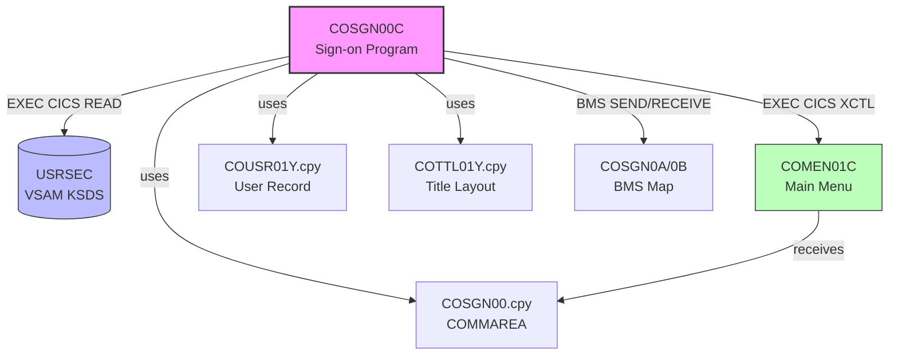

# Reverse Engineering Report: COSGN00C.cbl

## Program Identification

| Field | Value |
|-------|-------|
| Program ID | COSGN00C |
| Program Type | CICS Online (BMS) |
| Description | Sign-on / Authentication Screen |
| Transaction ID | CSG0 |
| BMS Map | COSGN0A / COSGN0B |
| Copybooks Used | COSGN00.cpy, COUSR01Y.cpy, COTTL01Y.cpy, CSDAT01Y.cpy, CSMSG01Y.cpy |
| LOC (excluding comments) | ~320 |

## Structural Overview

COSGN00C is the entry-point program for the CardDemo application. It presents a sign-on screen using a BMS map and validates user credentials against the USRSEC VSAM file. Upon successful authentication, control is transferred to the main menu program (COMEN01C) via EXEC CICS XCTL.

### Paragraph Structure

| Paragraph | Purpose |
|-----------|---------|
| MAIN-PARA | Entry point, evaluates EIBCALEN for first-time vs return |
| PROCESS-ENTER-KEY | Core authentication logic: reads USRSEC, validates credentials |
| RETURN-TO-SIGNON-SCREEN | Redisplays map with error messages on failure |
| SEND-SIGNON-SCREEN | Sends BMS map COSGN0A to terminal |
| RECEIVE-SIGNON-SCREEN | Receives user input from BMS map |
| POPULATE-HEADER-INFO | Sets title, date, time fields in map header |
| SEND-PLAIN-TEXT | Error fallback for non-map terminals |
| SEND-LONG-TEXT | Extended error message display |
| COPY-LAST-TRAN-ID | Captures last CICS transaction for audit |

### Control Flow

```
MAIN-PARA
  |-- (EIBCALEN = 0) --> SEND-SIGNON-SCREEN --> CICS RETURN
  |-- (EIBCALEN > 0) --> RECEIVE-SIGNON-SCREEN
                           |-- (AID = ENTER) --> PROCESS-ENTER-KEY
                           |     |-- READ USRSEC
                           |     |-- Compare password
                           |     |-- (match) --> XCTL to COMEN01C
                           |     |-- (no match) --> RETURN-TO-SIGNON-SCREEN
                           |-- (AID = PF3) --> CICS SEND TEXT 'Thank you'
                           |-- (other AID) --> RETURN-TO-SIGNON-SCREEN
```

## Business Rules

### BR-COSGN-001: Credential Validation
- User ID and password are read from BMS map fields USRIDINI and PASSINI
- User ID is used as the key to READ the USRSEC file
- The password from USRSEC (SEC-USR-PWD) is compared to the entered password
- Comparison is case-sensitive (no UPPER/LOWER transformation)
- On match, the user type (SEC-USR-TYPE) is passed to COMEN01C via COMMAREA

### BR-COSGN-002: User Type Classification
- SEC-USR-TYPE field determines user privileges in downstream programs
- Known values: 'A' (Admin), 'U' (Regular User)
- User type is propagated through COMMAREA for the entire session

### BR-COSGN-003: Error Handling
- USRSEC READ NOTFND condition: displays "User ID not found"
- Password mismatch: displays "Wrong password"
- Both cases return to the sign-on screen; no account lockout in COBOL source
- USRSEC READ other errors: ABEND with code 'USRD'

### BR-COSGN-004: Session Initialization
- First entry (EIBCALEN = 0): initializes COMMAREA, displays blank sign-on screen
- Return entry (EIBCALEN > 0): processes user input
- Successful login: COMMAREA fields CDEMO-USER-ID and CDEMO-USER-TYPE populated

## Data Structure Mapping

| COBOL Field | Copybook | PIC | Java Type | Java Field | Notes |
|-------------|----------|-----|-----------|------------|-------|
| SEC-USR-ID | COUSR01Y | X(8) | String | userId | Primary key in USRSEC |
| SEC-USR-PWD | COUSR01Y | X(8) | String | password | Plain-text in COBOL |
| SEC-USR-TYPE | COUSR01Y | X(1) | String | userType | A=Admin, U=User |
| SEC-USR-FNAME | COUSR01Y | X(20) | String | firstName | Display name |
| SEC-USR-LNAME | COUSR01Y | X(20) | String | lastName | Display name |
| CDEMO-USER-ID | COSGN00 | X(8) | String | userId | COMMAREA field |
| CDEMO-USER-TYPE | COSGN00 | X(1) | String | userType | COMMAREA field |
| USRIDINI | BMS Map | X(8) | String | (request body) | Map input field |
| PASSINI | BMS Map | X(8) | String | (request body) | Map input field |

## CICS Commands and File I/O

| Operation | Resource | Key | Condition Handling |
|-----------|----------|-----|-------------------|
| EXEC CICS READ | USRSEC | SEC-USR-ID | NOTFND: error msg, OTHER: ABEND 'USRD' |
| EXEC CICS SEND MAP | COSGN0A | - | MAPFAIL: SEND-PLAIN-TEXT |
| EXEC CICS RECEIVE MAP | COSGN0A | - | MAPFAIL: RETURN-TO-SIGNON-SCREEN |
| EXEC CICS XCTL | COMEN01C | - | On successful login |
| EXEC CICS RETURN | TRANSID CSG0 | - | Returns control with COMMAREA |

## Dependencies

### Upstream
- None (COSGN00C is the application entry point)

### Downstream
- **COMEN01C**: Main menu program, receives COMMAREA with user identity
- **USRSEC**: VSAM KSDS file containing user credentials

### Copybook Dependencies
- **COSGN00.cpy**: COMMAREA definition for sign-on screen
- **COUSR01Y.cpy**: User security record layout
- **COTTL01Y.cpy**: Screen title/header layout
- **CSDAT01Y.cpy**: Date formatting fields
- **CSMSG01Y.cpy**: Standard message area layout
- **DFHAID**: AID key definitions (standard CICS)
- **DFHBMSCA**: BMS attribute constants (standard CICS)

## Dependency Diagram



## Migration Recommendations

### Target API
- **Endpoint**: POST /api/v1/auth/login
- **Request**: `{ "userId": "string", "password": "string" }`
- **Response**: `{ "userId": "string", "userType": "string", "token": "string" }`

### Security Enhancements (beyond COBOL)
1. **Password hashing**: COBOL stores plain-text passwords in USRSEC. Java implementation must use bcrypt or Argon2.
2. **JWT tokens**: Replace COMMAREA-based session with stateless JWT tokens containing userId and userType claims.
3. **Account lockout**: Implement lockout after N failed attempts (not present in COBOL source).
4. **Input sanitization**: COBOL BMS provides implicit length limits (PIC X(8)); Java must validate explicitly.
5. **Audit logging**: COBOL has COPY-LAST-TRAN-ID; Java should log all authentication events to the audit table.

### Data Migration
- USRSEC VSAM file maps to `user_security` PostgreSQL table
- Password field must be hashed during migration (one-time ETL step)
- SEC-USR-TYPE values (A/U) map to role-based access control

### Architecture Decision

| Decision | Choice | Rationale |
|----------|--------|-----------|
| Auth mechanism | JWT (stateless) | Replaces CICS COMMAREA session; enables horizontal scaling |
| Password storage | bcrypt | Industry standard; COBOL plain-text is unacceptable |
| User type mapping | RBAC roles table | More flexible than single-character type field |
| Session management | Stateless | No equivalent of CICS pseudo-conversational state needed |
| Error responses | RFC 7807 Problem Details | Standardized error format replacing BMS error messages |
